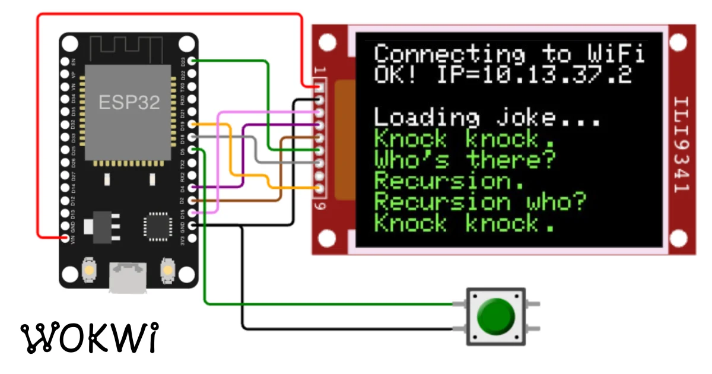
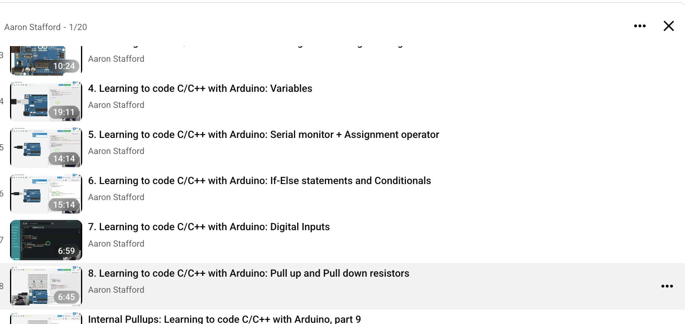
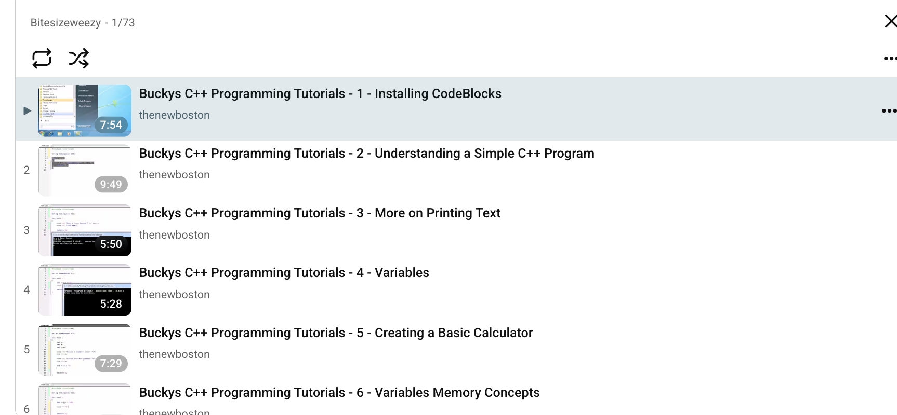
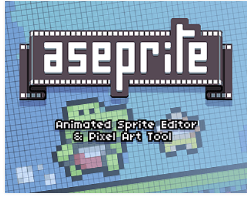

So the students learned:

https://drive.google.com/drive/folders/1VN7PbpWOi3ve6vug5PAFr_hFnT3QOrTV?usp=drive_link

- Arduino Electronics Similator
- MIT App inventor

### Wokwi Arduino Electronics Simulator

c01

| Workwi                                                                             |
| ---------------------------------------------------------------------------------- |
|                                                              |
| https://wokwi.com/                                                                 |
| https://www.youtube.com/playlist?list=PLAX_5sxaYEOc                                |
|                                                            |
|                                                            |
| Bucky Playlist https://www.youtube.com/watch?v=tvC1WCdV1XU&list=PLDED25B8DC0FEF9A1 |
|                                                            |

### Cpp Classess

c02

| cpp, 27 videos                                      |
| --------------------------------------------------- |
|                             |
| https://www.youtube.com/playlist?list=PLX6XZDfO3omE |
|                             |

Learning to code c/cpp with arudino https://www.youtube.com/watch?v=BWSDWB0e7L8&list=PLv5bCJpKDWIazJBFmeTLXOJ6CwLAxvVGY

### Python classess
c03

| Python Classes                                                                      |
| ----------------------------------------------------------------------------------- |
| https://www.youtube.com/watch?v=s9toTBXQSPE&list=PLb02lEEsdpfazL74WD8D9YAe5qroZzCpA |
|                                                             |

### MIT App inventor
c04

| Mit App Inventor                                                       |
| ---------------------------------------------------------------------- |
| https://www.youtube.com/watch?v=BT4YihNXiYw&list=PLW1QyFVl6M1A&pp=sAgC |

### Building Games with Godot
c05

How to make a Video Game - Godot Beginner Tutorial
https://www.youtube.com/watch?v=LOhfqjmasi0

GD Script https://www.youtube.com/watch?v=e1zJS31tr88

### How to use Github

https://www.youtube.com/watch?v=r8jQ9hVA2qs&list=PL0lo9MOBetEFcp4SCWinBdpml9B2U25-f

How To Use GitHub For Beginners
https://www.youtube.com/watch?v=a9u2yZvsqHA

零基礎GitHub教學，小白也能看懂｜如何一鍵獲取資源，解鎖全球最大寶藏網站
https://www.youtube.com/watch?v=FopO8IQLX_E

## Software to Download

| Video | Link|
|--|--|
||https://www.youtube.com/watch?v=PYzyv2hD4pE|
|| Sprite editor|
||asesprite

https://drive.google.com/drive/folders/1VN7PbpWOi3ve6vug5PAFr_hFnT3QOrTV?usp=drive_link

https://youtu.be/PYzyv2hD4pE?list=LL

Playlist with mutliple videos
https://www.youtube.com/watch?v=cq9P-KcJMkY&list=PLgZyoeNk0Yr423smsnxyT5eTkWPFB3AmP

