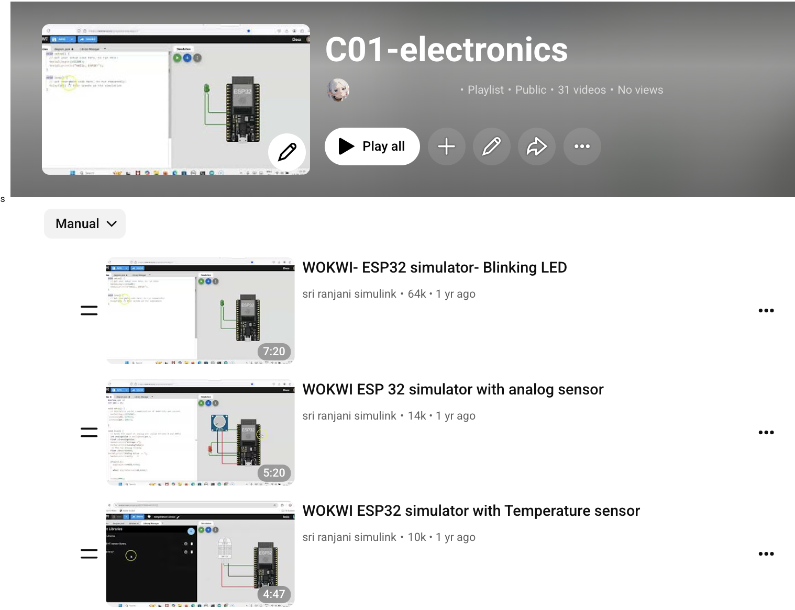
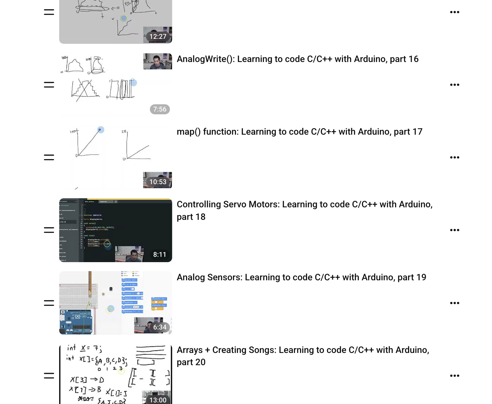
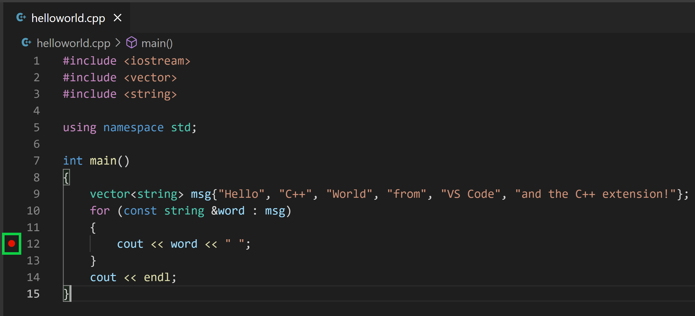
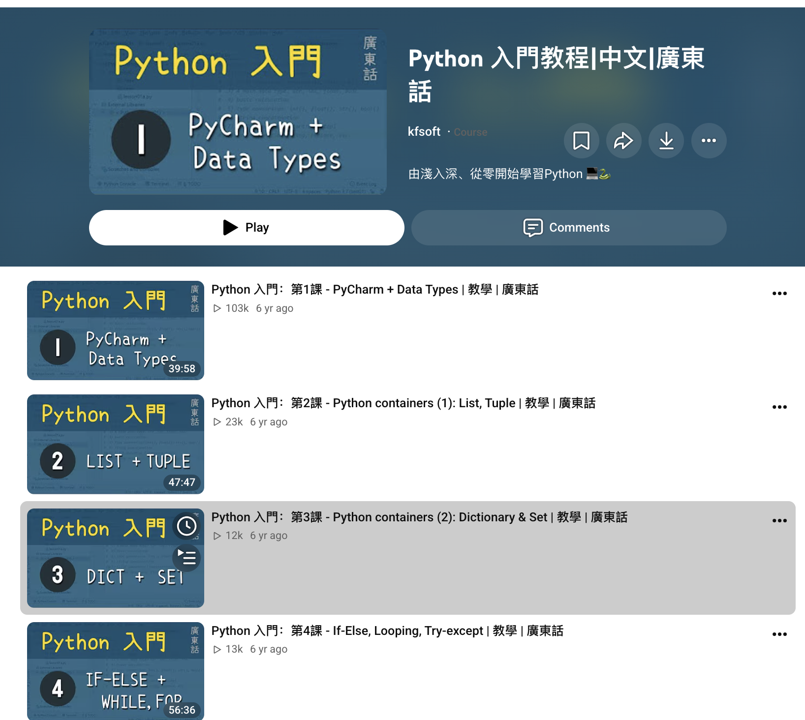
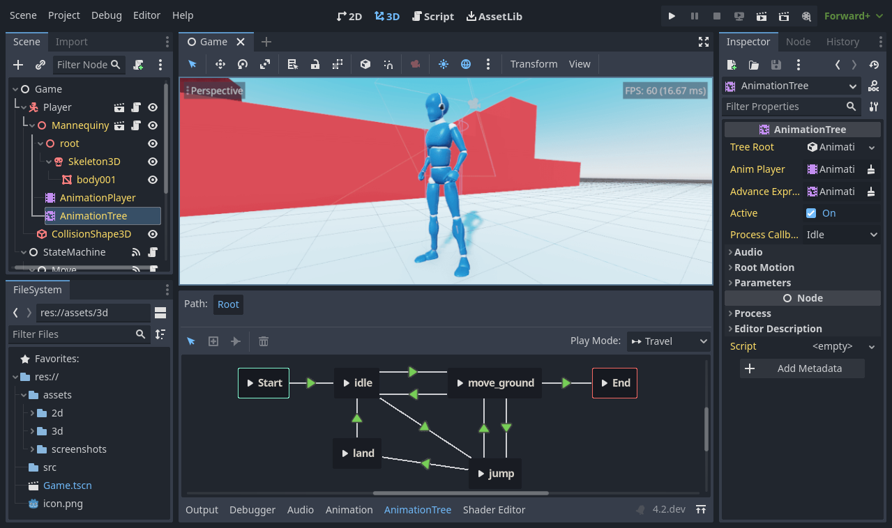
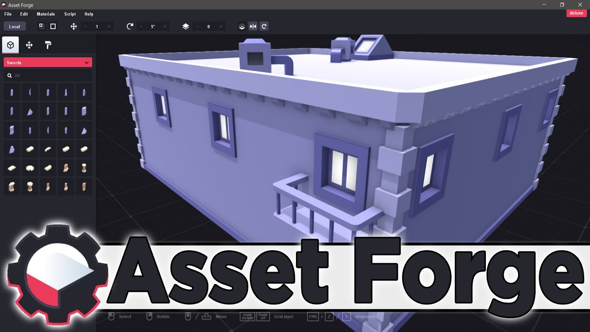

# 最后一课总结

这是我们学过的内容地图，以及可以继续自学的播放列表和工具。

课程文件（网盘）：[共享文件夹](https://drive.google.com/drive/folders/1VN7PbpWOi3ve6vug5PAFr_hFnT3QOrTV?usp=drive_link)

主要方向：

- Arduino 电子（Wokwi 模拟器）
- MIT App Inventor
- C++
- Python
- Godot 做游戏
- GitHub

---

## Wokwi Arduino 电子模拟器

在浏览器里练电路：[wokwi.com](https://wokwi.com/)

播放列表：

- [Wokwi / Arduino 播放列表](https://www.youtube.com/playlist?list=PLAX_5sxaYEOc)
- [Bucky 的 Arduino 播放列表](https://www.youtube.com/watch?v=tvC1WCdV1XU&list=PLDED25B8DC0FEF9A1)

<YouTubeEmbed id="tvC1WCdV1XU" title="Arduino 播放列表" />

---

## C++ 课

约 27 集：[C++ 播放列表](https://www.youtube.com/playlist?list=PLX6XZDfO3omE)

用 Arduino 学 C / C++：[播放列表](https://www.youtube.com/watch?v=BWSDWB0e7L8&list=PLv5bCJpKDWIazJBFmeTLXOJ6CwLAxvVGY)

<YouTubeEmbed id="BWSDWB0e7L8" title="用 Arduino 学 C/C++" />

---

## Python 课

[Python 播放列表](https://www.youtube.com/watch?v=s9toTBXQSPE&list=PLb02lEEsdpfazL74WD8D9YAe5qroZzCpA)

<YouTubeEmbed id="s9toTBXQSPE" title="Python 课程播放列表" />

---

## MIT App Inventor

[App Inventor 播放列表](https://www.youtube.com/watch?v=BT4YihNXiYw&list=PLW1QyFVl6M1A)

<YouTubeEmbed id="BT4YihNXiYw" title="MIT App Inventor" />

---

## 用 Godot 做游戏

- [如何做游戏 — Godot 入门教程](https://www.youtube.com/watch?v=LOhfqjmasi0)
- [GDScript](https://www.youtube.com/watch?v=e1zJS31tr88)

<YouTubeEmbed id="LOhfqjmasi0" title="Godot 入门教程" />

---

## 如何使用 GitHub

- [GitHub 播放列表](https://www.youtube.com/watch?v=r8jQ9hVA2qs&list=PL0lo9MOBetEFcp4SCWinBdpml9B2U25-f)
- [GitHub 新手教程](https://www.youtube.com/watch?v=a9u2yZvsqHA)
- [零基础 GitHub 教学](https://www.youtube.com/watch?v=FopO8IQLX_E)

<YouTubeEmbed id="a9u2yZvsqHA" title="GitHub 新手教程" />

---

## 需要下载的软件

| | |
|---|---|
|  | [安装讲解](https://www.youtube.com/watch?v=PYzyv2hD4pE) |
|  | 像素图编辑器 |
|  | [Aseprite](https://www.aseprite.org/) |

更多视频：[播放列表](https://www.youtube.com/watch?v=cq9P-KcJMkY&list=PLgZyoeNk0Yr423smsnxyT5eTkWPFB3AmP)
