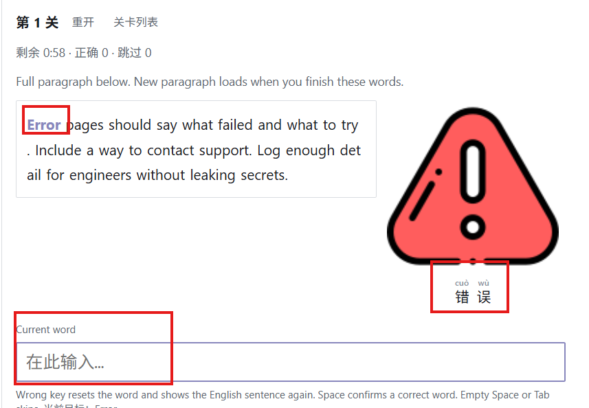
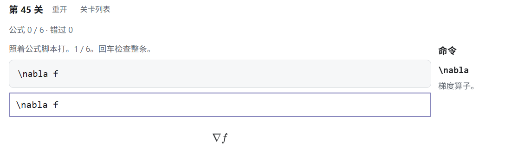

用打字游戏分别练英文、中文、代码和公式。建议按顺序完成下面四课：

1. **[3a — 英文打字](./lesson-3a-typing-en)**：计时、词数、记忆模式  

1. **[3b — 中文打字](./lesson-3b-typing-zh)**：对照英文提示打中文  
2. **[3c — 编程语言打字](./lesson-3c-typing-code)**：Python / Java / C++  

1. **[3d — 公式打字 (KaTeX)](./lesson-3d-typing-katex)**：数学公式脚本  

