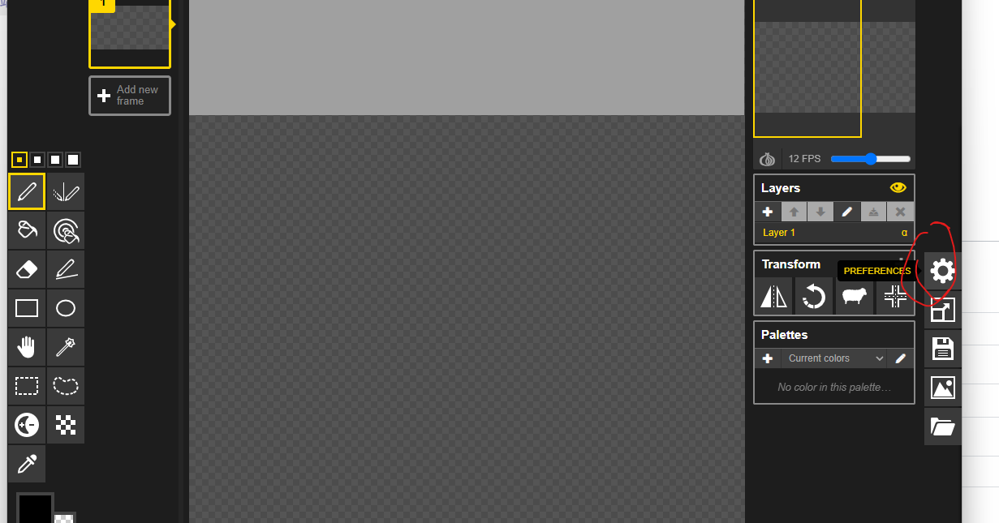
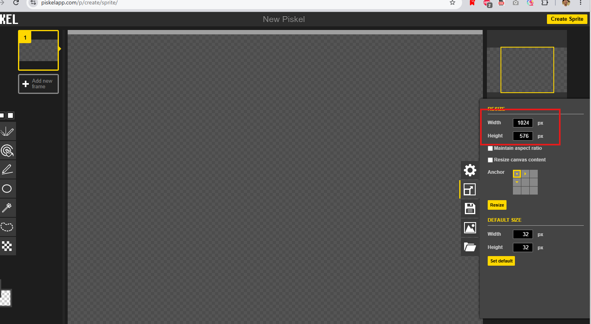

## 步骤

1. **打开编辑器**：[Piskel](https://www.piskelapp.com/p/create/sprite/)

2. **改尺寸**：右侧 Resize（方框箭头）→ Width `1024`，Height `576` → 点 **Resize**  
   （可先不勾 Maintain aspect ratio；内容不够时自己补画或裁）

3. **画画 / 改地面**：地面尽量靠画面下方，方便角色站立
4. **导出**：右侧 Export（图片图标）→ PNG → 下载
5. **上传到课**：把导出的 PNG 传到下方工坊，调好站位 Y，再「打开游戏」试玩

目标尺寸：**1024 × 576**（和游戏画布一样）

---

<FightingGameWorkshop stageOnly />

1. **也可以**：右侧文件夹图标 → Import → 选刚下的 `city.png`
2. **下载素材**：[city.png](https://c.l.l0l.in/proxy-image/uploads/city.png)（右键 → 另存为）