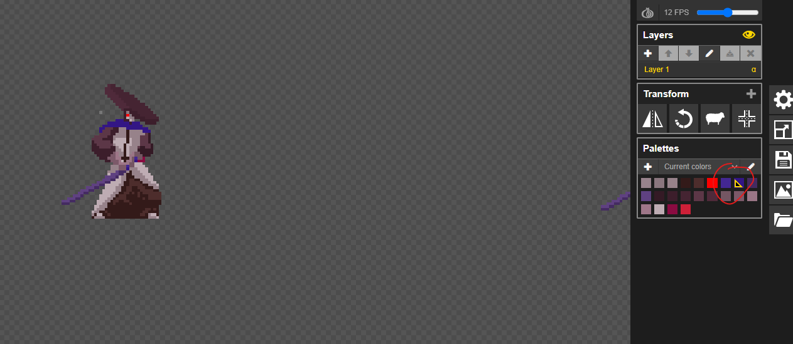
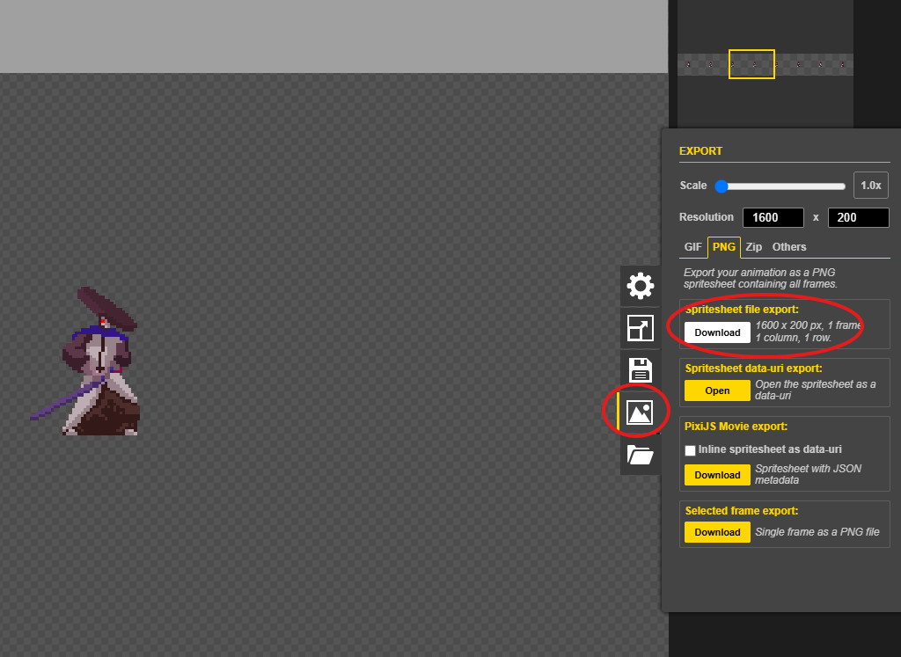

本课用经典包 **武士 Mack（samuraiMack）**。编辑器一开始**没有图**；素材下载在编辑器**上方**。

## 步骤（每个动作）

1. 上方「素材下载」→ **下载 …** 拿到原版 PNG  
2. 用 [Piskel](https://www.piskelapp.com/p/create/sprite/)（或其它像素编辑器）打开  
3. **换色**：盔甲 / 披风暖色 → **蓝色系**（透明底保留；整张表一起改）  

4. 导出 PNG → 编辑器对应标签里 **上传**（未上传时只有「上传」，没有播放）  

提示：Piskel 可用 Color swap / Hue 批量改色。

## 还要完成

1. **属性赠点** + **体型**  
2. **攻击 1 / 2**：伤害帧 + 伤害盒  
3. 用**新名字**保存（不能覆盖 **武士** / **剑士**）并试玩  

## 检查清单

- [ ] 上方下载 → 改蓝色 → 上传（八个标签）  
- [ ] 攻击 1 / 2：伤害帧 + 伤害盒  
- [ ] 新名字保存并「试玩」  

---

<CharacterHitboxWorkshop preset="samurai_mack" allowUpload />
