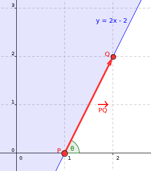

# Half-plane Intersection

Compute the region that lies inside **every** half-plane of a set. That region is always a **convex** polygon (or empty / unbounded). We want its vertices.

This lesson follows [CP-Algorithms — Half-plane intersection](https://cp-algorithms.com/geometry/halfplane-intersection.html) (Sort-and-Incremental, `O(N log N)`).

Prerequisites: points, vectors, line intersection, orientation (`cross`). Convex hull / CHT help intuition but are optional.

## Definitions

- `N` = number of half-planes.
- Represent a half-plane by a point `p` on its boundary and direction vector `pq`. The **allowed** region is to the **left** of `pq`. The **angle** of the half-plane is the polar angle of `pq`.
- Assume the answer is **bounded or empty**. For unbounded cases, add four half-planes of a large bounding box.
- For simplicity assume no parallels first; parallels are handled specially later.

Example: `y ≥ 2x − 2` as point `P = (1, 0)` with direction `PQ = (1, 2)`.



## Check: definitions

<MultipleChoice
  id="algo-11-hpi-defs"
  title="Half-plane definitions"
  questions={[
    {
      prompt: 'Allowed side of each half-plane in this article is…',
      choices: ['Right of pq', 'Left of pq', 'Both sides', 'Only the point p'],
      answer: 1,
      why: 'out(r) uses cross(pq, r−p) < 0 for the forbidden (right) side.',
    },
    {
      prompt: 'The angle used to sort half-planes is…',
      choices: [
        'Length of pq',
        'Polar angle of the direction vector pq',
        'x-coordinate of p only',
        'Area of the allowed region',
      ],
      answer: 1,
      why: 'angle = atan2(pq.y, pq.x); the final boundary walks in that order.',
    },
    {
      prompt: 'The intersection of half-planes is always…',
      choices: [
        'A non-convex polygon',
        'A convex region (polygon, empty, or unbounded)',
        'A single point',
        'A circle',
      ],
      answer: 1,
      why: 'Intersection of convex sets is convex; each half-plane is convex.',
    },
    {
      prompt: 'Unbounded intersections are handled by…',
      choices: [
        'Ignoring them',
        'Adding four bounding-box half-planes',
        'Switching to 3D',
        'Using FFT',
      ],
      answer: 1,
      why: 'Forces a large finite convex answer region so the deque algorithm can finish.',
    },
  ]}
/>

## Brute force — `O(N³)`

Intersect every pair of supporting lines (`O(N²)` points). Keep a point only if it lies in **all** half-planes (`O(N)` each). Convex-hull the survivors.

Vertices of the true intersection are among those pairwise intersections, so this is correct — and fine only for tiny `N` or “is empty?” checks.

## Incremental cutting — `O(N²)`

Start from a big box. Cut the current convex polygon by each half-plane in turn (find the two edge intersections, replace the discarded chain). Each cut is `O(N)` → `O(N²)` total.

Good intuition; still too slow when `N` is large.

## Sort-and-Incremental — `O(N log N)`

Attributed to Zeyuan Zhu’s 2006 CTOC thesis (*New Algorithm for Half-plane Intersection and its Practical Value*). Variant below builds the whole intersection in **one** angle-sorted pass with a **deque**.

### Key observation

The final boundary walks half-planes in **increasing angle**. If you insert half-planes in that order into a deque, newly redundant planes only appear at the **front** or **back** — never in the middle.

At step `k` (planes `1..k−1` already in the deque):

1. Pop back while the back plane is redundant w.r.t. the new one.
2. Pop front while the front plane is redundant.
3. If the deque collapses to empty → empty intersection.
4. Push the new half-plane.

A plane is **redundant** if removing it does not change the intersection (its adjacent vertex already lies outside the new plane).

### Parallels

- **Opposite** parallels: with a bounding box, opposite planes are not adjacent after sorting. If they become adjacent after pops, the intersection is empty — detect via `dot(pqᵢ, pqⱼ) < 0` and stop.
- **Same angle**: keep only the **leftmost** (strictest) half-plane; drop the others.

### Outline

1. Add bounding-box half-planes; **sort by angle** — `O(N log N)`.
2. Deque insert with front/back pops — amortized `O(N)` (each plane enters/leaves once).
3. Final wrap-around cleanup (front vs back).
4. Vertices = intersections of adjacent remaining planes — `O(N)`.

If planes are already angle-sorted (e.g. edges of one convex polygon), skip sorting → linear time.

## Check: algorithm

<MultipleChoice
  id="algo-11-hpi-algo"
  title="Half-plane intersection algorithm"
  questions={[
    {
      prompt: 'Sort-and-Incremental complexity is…',
      choices: ['O(N)', 'O(N log N)', 'O(N²)', 'O(N³)'],
      answer: 1,
      why: 'Sorting dominates; deque phase is amortized linear.',
    },
    {
      prompt: 'Half-planes are ordered by…',
      choices: [
        'Length of pq',
        'Polar angle of the direction vector',
        'x-coordinate of p only',
        'Random shuffle',
      ],
      answer: 1,
      why: 'Final convex boundary walks in angle order.',
    },
    {
      prompt: 'Why a deque?',
      choices: [
        'Only front/back planes can become redundant under angle-sorted inserts',
        'Need random access deletes in the middle',
        'To sort again',
        'For DFS on a tree',
      ],
      answer: 0,
      why: 'Convexity + sorted angles → pops only at ends.',
    },
    {
      prompt: 'Same-angle parallels: keep…',
      choices: [
        'All of them',
        'Only the leftmost / strictest',
        'Only the rightmost',
        'None',
      ],
      answer: 1,
      why: 'Others are completely redundant.',
    },
  ]}
/>

## Interactive walkthrough

Four half-planes of a convex quad, inserted in angle order.

<HalfplaneIntersectionSimulator />

## Implementation

### Point and half-plane

```cpp
const long double eps = 1e-9, inf = 1e9;

struct Point {
    long double x, y;
    explicit Point(long double x = 0, long double y = 0) : x(x), y(y) {}
    friend Point operator+(const Point& p, const Point& q) {
        return Point(p.x + q.x, p.y + q.y);
    }
    friend Point operator-(const Point& p, const Point& q) {
        return Point(p.x - q.x, p.y - q.y);
    }
    friend Point operator*(const Point& p, const long double& k) {
        return Point(p.x * k, p.y * k);
    }
    friend long double dot(const Point& p, const Point& q) {
        return p.x * q.x + p.y * q.y;
    }
    friend long double cross(const Point& p, const Point& q) {
        return p.x * q.y - p.y * q.x;
    }
};

struct Halfplane {
    Point p, pq;
    long double angle;
    Halfplane() {}
    Halfplane(const Point& a, const Point& b) : p(a), pq(b - a) {
        angle = atan2l(pq.y, pq.x);
    }
    // Allowed region = LEFT of directed line.
    bool out(const Point& r) {
        return cross(pq, r - p) < -eps;
    }
    bool operator<(const Halfplane& e) const { return angle < e.angle; }
    friend Point inter(const Halfplane& s, const Halfplane& t) {
        long double alpha = cross((t.p - s.p), t.pq) / cross(s.pq, t.pq);
        return s.p + (s.pq * alpha);
    }
};
```

### Algorithm

```cpp
vector<Point> hp_intersect(vector<Halfplane>& H) {
    Point box[4] = {
        Point(inf, inf), Point(-inf, inf),
        Point(-inf, -inf), Point(inf, -inf)
    };
    for (int i = 0; i < 4; i++)
        H.push_back(Halfplane(box[i], box[(i + 1) % 4]));

    sort(H.begin(), H.end());
    deque<Halfplane> dq;
    int len = 0;
    for (int i = 0; i < (int)H.size(); i++) {
        while (len > 1 && H[i].out(inter(dq[len - 1], dq[len - 2]))) {
            dq.pop_back(); --len;
        }
        while (len > 1 && H[i].out(inter(dq[0], dq[1]))) {
            dq.pop_front(); --len;
        }
        if (len > 0 && fabsl(cross(H[i].pq, dq[len - 1].pq)) < eps) {
            if (dot(H[i].pq, dq[len - 1].pq) < 0.0)
                return {};
            if (H[i].out(dq[len - 1].p)) {
                dq.pop_back(); --len;
            } else continue;
        }
        dq.push_back(H[i]); ++len;
    }
    while (len > 2 && dq[0].out(inter(dq[len - 1], dq[len - 2]))) {
        dq.pop_back(); --len;
    }
    while (len > 2 && dq[len - 1].out(inter(dq[0], dq[1]))) {
        dq.pop_front(); --len;
    }
    if (len < 3) return {};
    vector<Point> ret(len);
    for (int i = 0; i + 1 < len; i++)
        ret[i] = inter(dq[i], dq[i + 1]);
    ret.back() = inter(dq[len - 1], dq[0]);
    return ret;
}
```

<details>
<summary>🧪 Triangle half-planes → three vertices</summary>

<PistonRunner
  lang="c++"
  height="520px"
  code={`#include <iostream>
#include <algorithm>
#include <vector>
#include <deque>
#include <cmath>
#include <iomanip>
using namespace std;

const long double eps = 1e-9, inf = 1e4;

struct Point {
    long double x, y;
    Point(long double x = 0, long double y = 0) : x(x), y(y) {}
    Point operator+(Point q) const { return {x + q.x, y + q.y}; }
    Point operator-(Point q) const { return {x - q.x, y - q.y}; }
    Point operator*(long double k) const { return {x * k, y * k}; }
};
long double cross(Point p, Point q) { return p.x * q.y - p.y * q.x; }
long double dot(Point p, Point q) { return p.x * q.x + p.y * q.y; }

struct Halfplane {
    Point p, pq;
    long double angle;
    Halfplane(Point a = {}, Point b = {}) : p(a), pq(b - a) {
        angle = atan2l(pq.y, pq.x);
    }
    bool out(Point r) const { return cross(pq, r - p) < -eps; }
    bool operator<(const Halfplane& e) const { return angle < e.angle; }
};
Point inter(const Halfplane& s, const Halfplane& t) {
    long double alpha = cross(t.p - s.p, t.pq) / cross(s.pq, t.pq);
    return s.p + s.pq * alpha;
}

vector<Point> hp_intersect(vector<Halfplane> H) {
    Point box[4] = {{inf,inf},{-inf,inf},{-inf,-inf},{inf,-inf}};
    for (int i = 0; i < 4; i++)
        H.push_back(Halfplane(box[i], box[(i+1)%4]));
    sort(H.begin(), H.end());
    deque<Halfplane> dq;
    int len = 0;
    for (auto &hi : H) {
        while (len > 1 && hi.out(inter(dq[len-1], dq[len-2]))) {
            dq.pop_back(); --len;
        }
        while (len > 1 && hi.out(inter(dq[0], dq[1]))) {
            dq.pop_front(); --len;
        }
        if (len > 0 && fabsl(cross(hi.pq, dq[len-1].pq)) < eps) {
            if (dot(hi.pq, dq[len-1].pq) < 0) return {};
            if (hi.out(dq[len-1].p)) { dq.pop_back(); --len; }
            else continue;
        }
        dq.push_back(hi); ++len;
    }
    while (len > 2 && dq[0].out(inter(dq[len-1], dq[len-2]))) {
        dq.pop_back(); --len;
    }
    while (len > 2 && dq[len-1].out(inter(dq[0], dq[1]))) {
        dq.pop_front(); --len;
    }
    if (len < 3) return {};
    vector<Point> ret(len);
    for (int i = 0; i+1 < len; i++) ret[i] = inter(dq[i], dq[i+1]);
    ret.back() = inter(dq[len-1], dq[0]);
    return ret;
}

int main() {
    // CCW triangle (0,0)-(4,0)-(1,3); left of each edge = interior
    vector<Halfplane> H = {
        Halfplane({0,0},{4,0}),
        Halfplane({4,0},{1,3}),
        Halfplane({1,3},{0,0}),
    };
    auto poly = hp_intersect(H);
    cout << fixed << setprecision(3);
    cout << "vertices = " << poly.size() << endl;
    for (auto &p : poly)
        cout << "(" << (double)p.x << ", " << (double)p.y << ")" << endl;
    return 0;
}
`}
/>

</details>

## Implementation notes

- Multiple planes through one vertex can yield **duplicate adjacent** vertices. Harmless for emptiness / area; `unique` them if needed. Keep duplicates mid-algorithm so zero-area cases (point / segment) stay correct.
- Constraints `ax + by + c ≤ 0`: either adapt the struct or sample two points per line. Prefer the input form to limit precision loss.

## Applications

| Task | Idea |
|---|---|
| Intersection of convex polygons | Each edge → half-plane; intersect all — `O(S log S)` for total sides `S` |
| Kernel of a simple polygon | Can you see the whole boundary from an interior point? Half-planes of edges |
| Ordered visibility of points | See `pᵢ` left of `pᵢ₊₁` ↔ half-plane of segment `pᵢpᵢ₊₁`; nonempty intersection? |
| Largest inscribed circle in convex `P` | Binary search radius `r`; shrink each side inward by `r`; check nonempty (angles already sorted → `O(NK)`) |
| 2D linear programming | Feasibility = half-plane intersection; optimize linear `f` with binary search / CHT-like queries on the feasible polygon |

There is also a simple **randomized** LP algorithm for 2-variable constraints ([CG lecture](https://youtu.be/5dfc355t2y4), [Petr’s half-plane week](https://petr-mitrichev.blogspot.com/2016/07/a-half-plane-week.html)).

## Check: applications

<MultipleChoice
  id="algo-11-hpi-apps"
  title="Applications"
  questions={[
    {
      prompt: 'Kernel of a polygon is…',
      choices: [
        'Intersection of half-planes of its edges',
        'Its bounding box only',
        'Always empty',
        'The convex hull of exterior points',
      ],
      answer: 0,
      why: 'Points that see every edge lie on the inner side of each edge line.',
    },
    {
      prompt: 'Largest inscribed circle in a convex polygon…',
      choices: [
        'Needs 3D convex hull',
        'Binary-search r and shrink half-planes inward',
        'Is impossible',
        'Uses only Dijkstra',
      ],
      answer: 1,
      why: 'Feasibility at radius r ↔ nonempty intersection after offset.',
    },
    {
      prompt: 'Intersection of two convex polygons with total S sides…',
      choices: [
        'Needs O(S³) pairwise checks only',
        'Can be done via half-plane intersection in O(S log S)',
        'Is always empty',
        'Requires FFT',
      ],
      answer: 1,
      why: 'Each edge becomes a half-plane; Sort-and-Incremental is O(S log S).',
    },
    {
      prompt: '2D linear programming feasibility is…',
      choices: [
        'Unrelated to half-planes',
        'Exactly a half-plane intersection question',
        'Only solvable with simplex in 3D',
        'Always O(1)',
      ],
      answer: 1,
      why: 'Each linear constraint is a half-plane; nonempty intersection ⇔ feasible.',
    },
  ]}
/>

## Practice drills

<ExerciseSet>
<Exercise title="Point outside half-plane?" anchor="exercise-hpi-out">

:::tip Activity: Outside test
Line through `px py` toward `qx qy`; allowed = left. Point `rx ry`. Print `OUT` if outside, else `IN`.

<CodeExercise
  title="Outside test"
  heading="exercise-hpi-out"
  lang="python"
  filename="main.py"
  prompt="cross(pq, r-p) < 0 ⇒ OUT (strict)."
  sampleLog={`(input) 0 0 4 0 2 -1
OUT`}
  starter={`def side(px, py, qx, qy, rx, ry):
    # TODO: return "OUT" or "IN"
    return "IN"
`}
  wrapSuffix={`
px, py, qx, qy, rx, ry = map(float, input().split())
print(side(px, py, qx, qy, rx, ry))
`}
  hint="pq=(qx-px,qy-py); cross = pqx*(ry-py)-pqy*(rx-px); OUT if cross < 0"
  solution={`def side(px, py, qx, qy, rx, ry):
    cross = (qx - px) * (ry - py) - (qy - py) * (rx - px)
    return "OUT" if cross < 0 else "IN"
`}
  sourceChecks={[
    { name: 'cross', pattern: '\\*|cross', must: true, hint: 'use 2D cross product' },
  ]}
  tests={[
    { name: 'below', stdin: '0 0 4 0 2 -1', equals: 'OUT' },
    { name: 'above', stdin: '0 0 4 0 2 1', equals: 'IN' },
    { name: 'on', stdin: '0 0 4 0 2 0', equals: 'IN' },
  ]}
/>

:::

</Exercise>

<Exercise title="Polar angle order" anchor="exercise-hpi-sort">

:::tip Activity: Polar angle order
First line: `n`. Next `n` lines: `dx dy` (direction vectors). Print indices `0..n-1` sorted by `atan2(dy, dx)`.

<CodeExercise
  title="Sort by angle"
  heading="exercise-hpi-sort"
  lang="python"
  filename="main.py"
  prompt="Stable enough: sort by atan2."
  sampleLog={`(input) 3
1 0
0 1
-1 0
0 1 2`}
  starter={`import math

def order_by_angle(vecs):
    # TODO: return list of indices
    return list(range(len(vecs)))
`}
  wrapSuffix={`
n = int(input())
vecs = [tuple(map(float, input().split())) for _ in range(n)]
print(*order_by_angle(vecs))
`}
  hint="sorted(range(n), key=lambda i: math.atan2(vecs[i][1], vecs[i][0]))"
  solution={`import math

def order_by_angle(vecs):
    return sorted(range(len(vecs)), key=lambda i: math.atan2(vecs[i][1], vecs[i][0]))
`}
  sourceChecks={[
    { name: 'atan2', pattern: 'atan2', must: true, hint: 'sort key = atan2(dy, dx)' },
  ]}
  tests={[
    { name: 'sample', stdin: '3\n1 0\n0 1\n-1 0', equals: '0 1 2' },
    { name: 'reorder', stdin: '3\n0 1\n1 0\n-1 -1', equals: '2 1 0' },
  ]}
/>

:::

</Exercise>

<Exercise title="Line intersection" anchor="exercise-hpi-inter">

:::tip Activity: Line intersection
Two directed lines: `p1 q1` and `p2 q2` (8 floats). Print intersection `x y` with 4 decimals (assume not parallel).

<CodeExercise
  title="Line intersection"
  heading="exercise-hpi-inter"
  lang="python"
  filename="main.py"
  prompt="Same formula as inter(s,t) in the article."
  sampleLog={`(input) 0 0 1 0 0 1 0 2
0.0000 1.0000`}
  starter={`def intersect(p1, q1, p2, q2):
    # TODO: return (x, y)
    return 0.0, 0.0
`}
  wrapSuffix={`
vals = list(map(float, input().split()))
p1, q1, p2, q2 = vals[0:2], vals[2:4], vals[4:6], vals[6:8]
x, y = intersect(p1, q1, p2, q2)
print(f"{x:.4f} {y:.4f}")
`}
  hint="pq=q-p; alpha = cross(p2-p1, pq2)/cross(pq1,pq2); return p1+pq1*alpha"
  solution={`def cross(a, b):
    return a[0] * b[1] - a[1] * b[0]

def intersect(p1, q1, p2, q2):
    pq1 = (q1[0] - p1[0], q1[1] - p1[1])
    pq2 = (q2[0] - p2[0], q2[1] - p2[1])
    diff = (p2[0] - p1[0], p2[1] - p1[1])
    alpha = cross(diff, pq2) / cross(pq1, pq2)
    return p1[0] + pq1[0] * alpha, p1[1] + pq1[1] * alpha
`}
  sourceChecks={[
    { name: 'uses alpha', pattern: 'cross|/|\\*', must: true, hint: 'parametric line intersection' },
  ]}
  tests={[
    { name: 'sample', stdin: '0 0 1 0 0 1 0 2', equals: '0.0000 1.0000' },
    { name: 'diag', stdin: '0 0 2 2 0 2 2 0', equals: '1.0000 1.0000' },
  ]}
/>

:::

</Exercise>

<Exercise title="Polygon area (shoelace)" anchor="exercise-hpi-area">

:::tip Activity: Shoelace
After HPI you often need area. `n` then `n` points CCW/CW. Print absolute area with 1 decimal.

<CodeExercise
  title="Shoelace area"
  heading="exercise-hpi-area"
  lang="python"
  filename="main.py"
  prompt="Standard shoelace / 2."
  sampleLog={`(input) 4
0 0
4 0
4 3
0 3
12.0`}
  starter={`def polygon_area(pts):
    # TODO
    return 0.0
`}
  wrapSuffix={`
n = int(input())
pts = [tuple(map(float, input().split())) for _ in range(n)]
print(f"{polygon_area(pts):.1f}")
`}
  hint="sum x_i y_{i+1} - x_{i+1} y_i, abs/2"
  solution={`def polygon_area(pts):
    n = len(pts)
    s = 0.0
    for i in range(n):
        x1, y1 = pts[i]
        x2, y2 = pts[(i + 1) % n]
        s += x1 * y2 - x2 * y1
    return abs(s) / 2.0
`}
  sourceChecks={[
    { name: 'shoelace', pattern: '\\*|abs', must: true, hint: 'cross terms then abs/2' },
  ]}
  tests={[
    { name: 'rect', stdin: '4\n0 0\n4 0\n4 3\n0 3', equals: '12.0' },
    { name: 'tri', stdin: '3\n0 0\n4 0\n0 3', equals: '6.0' },
  ]}
/>

:::

</Exercise>
</ExerciseSet>

## Contest problems

From [CP-Algorithms](https://cp-algorithms.com/geometry/halfplane-intersection.html):

<ExerciseSet>
<Exercise title="Classic HPI" anchor="exercise-hpi-classic">

- [Codechef CHN02 — Animesh decides to settle down](https://www.codechef.com/problems/CHN02)
- [POJ 3130 — How I Mathematician Wonder What You Are!](http://poj.org/problem?id=3130)
- [POJ 3335 — Rotating Scoreboard](http://poj.org/problem?id=3335)
- [POJ 1474 — Video Surveillance](http://poj.org/problem?id=1474) (kernel nonempty?)
- [POJ 1279 — Art Gallery](http://poj.org/problem?id=1279)
- [POJ 2451 — Uyuw's Concert](http://poj.org/problem?id=2451)

</Exercise>

<Exercise title="Harder" anchor="exercise-hpi-hard">

- [POJ 3525 — Most Distant Point from the Sea](http://poj.org/problem?id=3525) · [Baekjoon 3903](https://www.acmicpc.net/problem/3903)
- [POJ 3384 — Feng Shui](http://poj.org/problem?id=3384)
- [POJ 1755 — Triathlon](http://poj.org/problem?id=1755)
- [DMOJ — Arrow](https://dmoj.ca/problem/ccoprep3p3)
- [POJ 3968 / CF Gym Jungle Outpost](http://poj.org/problem?id=3968)

</Exercise>
</ExerciseSet>

## References

- [Zeyuan Zhu — New Algorithm for Half-plane Intersection](http://people.csail.mit.edu/zeyuan/publications.htm)
- [Artem Vasilyev — Brazilian ICPC Summer School 2020](https://youtu.be/WKyZSitpm6M?t=6463)
- [Petr Mitrichev — A half-plane week](https://petr-mitrichev.blogspot.com/2016/07/a-half-plane-week.html)

## Cheat sheet

| Piece | Takeaway |
|---|---|
| Goal | Convex region ∩ all half-planes |
| Naive | `O(N³)` pairwise points |
| Cut | `O(N²)` incremental |
| Fast | Sort by angle + deque pops — `O(N log N)` |
| Parallel | Opposite → empty; same → keep leftmost |
| Unbounded | Add bounding box |
| Apps | Kernels, convex ∩, 2D LP, binary-search offsets |
