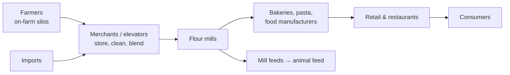
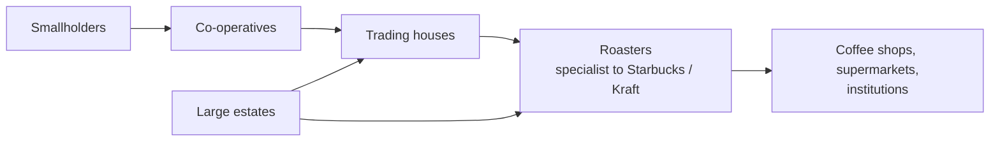
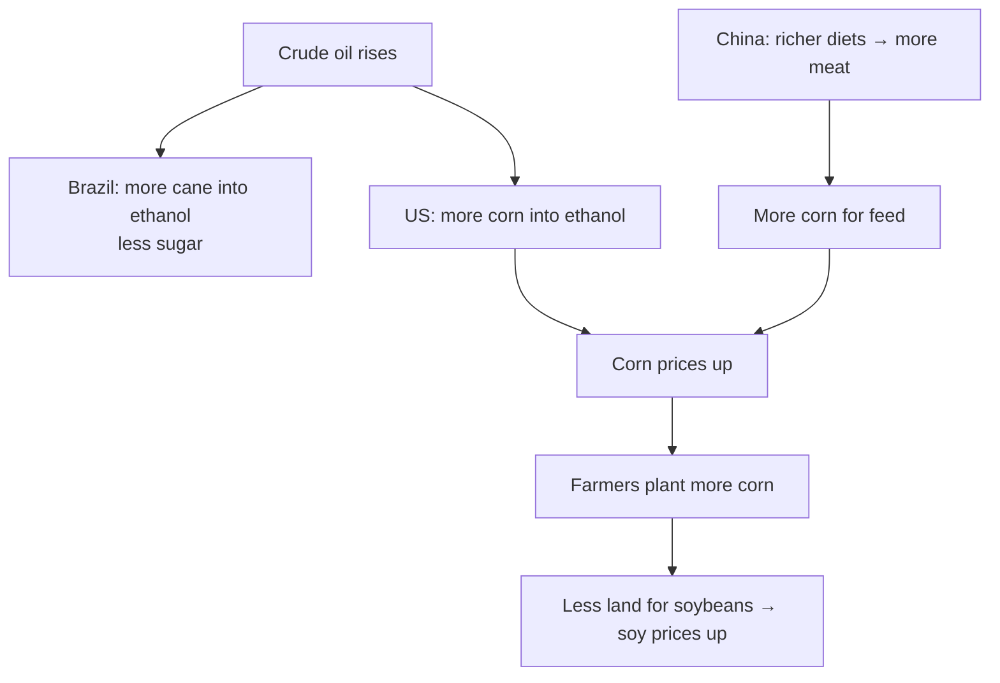
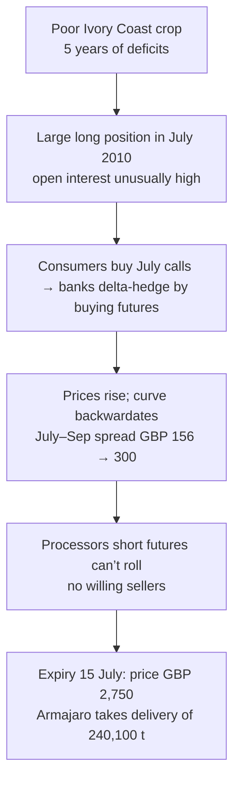

# 12. Agriculture

> **Teaching rewrite** of agricultural and soft commodities: grains, oilseeds, palm oil, sugar, coffee, cocoa, and ethanol — plus price drivers, the Commitments of Traders report, the 2010 cocoa squeeze, and OTC hedging structures. Original wording; worked numbers recomputed. Prices are teaching values. Not investment advice.

## Introduction

Agriculture splits into two groups:

| | **Agricultural (grains, oilseeds)** | **Softs** |
|---|---|---|
| Examples | Wheat, corn, soybeans | Coffee, sugar, cocoa, cotton |
| Where grown | Widely, incl. developed countries | Concentrated in a few, often developing, countries |
| Supply response | Fast — farmers add acreage when prices rise | Slower and prone to local shocks |

Unlike oil or metals, crops are **replanted every season** (or within a few years for tree crops), so supply responds quickly — but **weather** can wipe out a harvest at any time.

This lesson covers:

- The **balance sheet**: supply, demand, ending stocks, stocks-to-use
- **Grains and oilseeds**: wheat, corn, palm oil, the soybean complex
- **Softs**: sugar, coffee, cocoa; **ethanol**
- **Price drivers**: the “three Fs” (food, feed, fuel), weather and ENSO, policy, investors, emerging markets
- **COT reports** and the **2010 “Chocfinger” cocoa squeeze**
- **Exchange contracts and spreads** (crush), and **OTC structures**: swaps, spread options, accumulators, TARNs

---

## 12.1 Definitions: the balance sheet

| Term | Meaning |
|---|---|
| **Supply** | Beginning stocks (**carry-in**) + production + imports |
| **Demand (use)** | Domestic use + exports |
| **Ending stocks (carry-over / carry-out)** | Supply − use, carried into the next year |
| **Stocks-to-use ratio** | Ending stocks ÷ total use |

A stocks-to-use ratio of roughly **20–40%** is “normal”; lower means a **tight** market and more volatile prices.

:::caution Correction
The source defines carry-over as “previous year’s stocks + current production + imports” — that is **total supply**. **Carry-over** is what is **left after use**: supply minus demand.
:::

### Worked example: a wheat balance sheet (million t)

| Item | Value |
|---|---|
| Beginning stocks | 280 |
| Production | 764 |
| Imports (world: ≈ exports, so net 0) | — |
| **Total supply** | **1,044** |
| Use | 754 |
| **Ending stocks** | **290** |
| **Stocks-to-use** | 290 ÷ 754 ≈ **38.5%** |

(2020 production and consumption as quoted; stocks illustrative.) Production and consumption rarely match, so **stock changes** drive prices.

---

## 12.2 Grains and oilseeds

### Wheat: the supply chain

Merchants consolidate many farms. Global grain trading is dominated by the **ABCDs**: **A**rcher Daniels Midland, **B**unge, **C**argill, Louis **D**reyfus (with COFCO and others now significant).

**US wheat classes** (spring/winter = when sown):

| Class | Uses |
|---|---|
| Hard Red Winter | Bread flour, Asian noodles, rolls, flatbreads |
| Hard Red Spring | “Aristocrat” — premium bread, bagels, pizza |
| Soft Red Winter | Cookies, crackers, pastries (the **Chicago** futures grade) |
| Durum | Pasta, couscous |
| Hard White / Soft White | Bread, noodles / cakes, pastries |

**Production 2020**: ~764 Mt — EU 26%, China 23%, India 17%, Russia 15%, US 8% (of the largest producers). **Consumption**: ~754 Mt — EU 21%, China 20%, India 16%, US 5%.

### Corn (maize)

Mainly **animal feed**, plus sweeteners and **ethanol** — so oil prices matter. 2020 production ~1,111 Mt vs consumption ~1,135 Mt. US ≈ 34% of output, China 24%, Brazil 7%, EU 6%. About **40%** of the US crop goes into fuel ethanol.

### Palm oil

The world’s major edible oil (competing with soybean and rapeseed oil): ~**70% food** (cooking oil, margarine, shortening), ~**30% industrial** (cosmetics, cleaners, candles, **biodiesel**).

- Grows only within about **10° of the Equator** → **Indonesia and Malaysia ≈ 85%** of output
- Main importers: India, the EU, China
- Commercial variety: **Tenera** (a Dura × Pisifera hybrid)
- Nursery 12–18 months, first harvest ~30 months after planting, peak yield in years 8–15, life 25–30 years, harvested year-round
- Rule of thumb: about **4 t of oil per hectare**

### The soybean complex

Sown April–May (as late as July, risking frost). An **oilseed**, like peanuts, sunflower, and rapeseed.

- Hulls → dairy feed; beans eaten whole or **crushed** into **meal** (livestock feed) and **oil** (food, soap, even explosives)
- Crush volumes are a proxy for demand (imperfect — some beans are eaten or saved as seed)
- Producers: Brazil, US, Argentina; China is the largest crusher (of imported beans)

**One 60 lb bushel** crushes to about **44 lb meal + 11 lb oil + 5 lb waste**.

### Worked example: the board crush margin

Meal **USD 300 per short ton**, oil **30 cents/lb**, beans **USD 9.00/bushel**:

- Meal: 44 lb = 0.022 short ton → 0.022 × 300 = **6.60**
- Oil: 11 lb × 0.30 = **3.30**
- Crush margin = 6.60 + 3.30 − 9.00 = **USD 0.90/bushel**

A crusher is long this margin. **Buying the crush** (long beans, short meal and oil) bets it narrows; a **reverse crush** bets it widens. Shifts in meal vs oil demand change the margin.

<GuidedChoiceExplanation preset="comm-ag-balance" />

---

### Checkpoint 1: balance sheets and grains

<MultipleChoice
  id="comm-ch12-mid1"
  title="Checkpoint — sections 12.1 and 12.2"
  questions={[
    {
      prompt: 'Beginning stocks 50, production 400, imports 10, use 420. Ending stocks?',
      choices: ['40', '460', '30', '50'],
      answer: 0,
      why: '50 + 400 + 10 − 420.',
    },
    {
      prompt: 'Ending stocks 40 against use 420. Stocks-to-use and market read?',
      choices: ['9.5% — tight, volatile', '38% — normal', '105% — glut', '0.95% — normal'],
      answer: 0,
      why: 'Well below the 20–40% rule of thumb.',
    },
    {
      prompt: 'Why is palm oil production so concentrated?',
      choices: [
        'It is banned elsewhere',
        'Oil palms only grow within about 10° of the Equator',
        'Only two countries have refineries',
        'It needs desert conditions',
      ],
      answer: 1,
      why: 'Indonesia and Malaysia ≈ 85%.',
    },
    {
      prompt: 'Meal 350/short ton, oil 0.35/lb, beans 10.00/bu. Board crush margin?',
      choices: ['0.55', '1.55', '−0.55', '3.85'],
      answer: 1,
      why: '0.022 × 350 + 11 × 0.35 − 10 = 7.70 + 3.85 − 10 = 1.55.',
    },
    {
      type: 'order',
      prompt: 'Rank the wheat supply chain from field to table.',
      items: ['Farmer', 'Merchant / elevator', 'Flour mill', 'Bakery', 'Retailer'],
      why: 'Mill feeds branch off to animal feed.',
    },
  ]}
/>

---

## 12.3 Soft commodities

### Sugar

- Produced in about **110 countries**; ~**80% from cane**, the rest from beet
- Top producers: India, Brazil, Thailand, China, US, Mexico, Russia, Pakistan, France, Australia (~70%)
- Uses: food, feed, **ethanol**; consumption ~172 Mt (2018), growth slowing
- ~64 Mt traded; Brazil dominates exports; main importers Indonesia, China, US

:::caution Correction
The source says beet is grown in the Northern Hemisphere and cane in the Southern. More precisely, **cane** grows in **tropical and subtropical** regions (India and Thailand are north of the Equator), and **beet** in **temperate** climates (Europe, Russia, the northern US).
:::

### Coffee

**Bean anatomy** (outside in): skin → **pulp** (compost) → **mucilage** (jelly) → **parchment** (mulch, paper) → **silver skin** → **bean** (seed).

**Where**: native to Africa (arabica from Ethiopia); now grown across the **“bean belt”** between the Tropics. Brazil dominates, then Vietnam, Colombia, Indonesia, Honduras.

| Type | Flavour | Typical use | ICO groups |
|---|---|---|---|
| **Arabica** | Smoother | Brewed, specialty | Brazilian naturals, Colombian milds, other milds |
| **Robusta** | More bitter, more caffeine | Instant, espresso blends | Robustas (Vietnam, Indonesia, Ghana…) |

**Production process**: 3–4 years to first crop, ~25-year life → harvest → wash → dry 1–2 weeks → bag → mature 6–12 months (up to 3 years) → **roast** → grind → brew. Longer roasts are darker: light ~8 min, city ~12, Italian ~20, French ~24.

:::caution Corrections
- Roasting happens at roughly **190–250 °C** (about 375–480 °F), not °F as printed.
- The caffeine figures for cola and black tea are **mg**, not g: cola ~40 mg, black tea ~45 mg, brewed coffee ~95 mg, espresso shot ~27 mg (by the source’s figures).
- The source gives 2019 production as 168 million bags, “of which the two main types” were 96 million, with arabica 72 million — this is garbled. ICO figures put **arabica ≈ 96 million** and **robusta ≈ 72 million** bags.
:::

**Forms**: green, dried cherry, parchment, roasted, decaf, liquid, soluble (instant).

**Statistics**: the ICO **coffee year** starts **1 October**; output is counted in **60 kg bags** — 168 million bags ≈ **10.1 Mt**. Production: South America 46%, Asia & Oceania 30%, Mexico & Central America 13%, Africa 11%. Consumption: Europe 39%, Asia & Oceania 26%, North America 23%.

**Pricing**: commercial deals price off the ICE **“C” arabica futures** (37,500 lb, US cents/lb) plus a **negotiated premium** for quality (Starbucks buys high-altitude arabica this way). For delivery, the exchange grades beans (origin, preparation, size, defects, cup quality) and applies **fixed** origin premiums/discounts — e.g. Colombia at a premium, Brazil at a discount. Robusta trades on ICE London. The ICO publishes a **Composite Indicator** price.

### Cocoa

- Grown within **10° of the Equator**; Côte d’Ivoire, Ghana, Indonesia lead; the EU and US consume most
- Consumption is measured by **grindings**
- Needs lower altitude and more heat than coffee; ~1.5 years to flower, six more months to pods
- Process: ferment beans (up to a week) → dry (1–2 weeks) → roast → crack to **nibs** → grind to **cocoa liquor** → press into **cocoa butter** (chocolate, cosmetics) and **presscake** (cocoa powder)
- Bean grades: **fine/flavour** vs **bulk/ordinary**

| Chocolate | Main ingredients |
|---|---|
| Dark | Cocoa solids, cocoa butter, sugar |
| Milk | Cocoa solids, cocoa butter, sugar, **milk** |
| White | **Cocoa butter**, sugar, milk — no cocoa solids |

:::caution Corrections
- Cocoa beans are typically roasted at roughly **120–150 °C** for 15–35 minutes; the source’s “five minutes at 50 °C” is far too cool and short.
- The source lists “butter” as the extra ingredient in milk chocolate and “cocoa” in white. Milk chocolate adds **milk**; white chocolate uses **cocoa butter** but no cocoa solids.
:::

:::info Update
Cocoa hit record highs above **USD 12,000/t** in late 2024 after disease, ageing trees, and bad weather cut West African crops; arabica coffee also set records above **USD 4/lb** in early 2025 on Brazilian drought. The EU’s deforestation regulation (EUDR) adds traceability requirements for cocoa, coffee, palm oil, soy, and others.
:::

---

## 12.4 Ethanol

> “If you look at the ethanol landscape worldwide, the US and Brazil are like Kuwait and Saudi Arabia.” — *FT*, 2006

**What it is**: an alcohol (C₂H₅OH — a hydrocarbon chain with an –OH group). For fuel, the aim is high strength and few impurities.

:::caution Correction
The source calls ethanol the simplest alcohol. **Methanol** (CH₃OH) is the simplest; ethanol is the next.
:::

**Process (corn)**: grind kernels to meal → add water and enzymes (starch → sugar) = **mash** → heat to kill bacteria → cool, add **yeast** → ferment to ethanol + CO₂ → **distil** → **molecular sieve** removes the last water.

**Energy output ÷ input**: sugarcane **8.3**, sugar beet 1.9, corn 1.8 — cane is far more efficient.

| Argument | For | Against |
|---|---|---|
| Carbon | Crop reabsorbs the CO₂ released | Land clearing (Amazon), energy-hungry processing, fertiliser made from fossil hydrogen |
| Supply | Renewable | Huge land needs; competes with food and feed |
| Logistics | Blends into gasoline | Can’t use oil pipelines (absorbs water); needs trucks/rail and new retail infrastructure |

**Other biofuels**: cellulosic ethanol (waste plant matter), biobutanol (more energy, higher blends), biodiesel from non-food crops, biomass-to-liquids.

**Scale**: ~49 bn litres (2004) → ~**108 bn litres** (~24 bn gallons, 2018); US ~56%, Brazil ~28%.

**History**:

- **Brazil**: 1970s subsidies after oil shocks (90% of crude was imported) → all-ethanol cars by the 1980s → bust (cane shortages, decontrolled pump prices, dear sugar, poor cars, cheap oil) → **flex-fuel cars** from 2003, which were 50–75% of new sales by 2006.
- **US**: mandates, tax credits, and tariffs; demand jumped when **MTBE** was banned. Blends **E10–E15**; more needs modified engines.
- **Europe**: mainly from **sugar beet**, plus maize, wheat, barley, rye.

---

### Checkpoint 2: softs and ethanol

<MultipleChoice
  id="comm-ch12-mid2"
  title="Checkpoint — sections 12.3 and 12.4"
  questions={[
    {
      prompt: 'Which coffee is typically used for instant coffee?',
      choices: ['Arabica', 'Robusta', 'Liberica only', 'Specialty grade'],
      answer: 1,
      why: 'Cheaper and more bitter.',
    },
    {
      prompt: '150 million 60 kg bags of coffee is how many million tonnes?',
      choices: ['9.0', '2.5', '150', '0.9'],
      answer: 0,
      why: '150 × 60 / 1,000.',
    },
    {
      prompt: 'How is cocoa consumption usually measured?',
      choices: ['Chocolate bar sales', 'Grindings', 'Import tariffs', 'Retail prices'],
      answer: 1,
      why: 'The amount entering the grinding stage.',
    },
    {
      prompt: 'Why is cane ethanol considered more efficient than corn ethanol?',
      choices: [
        'Corn has no sugar',
        'Energy out per unit in is about 8.3 vs 1.8',
        'Cane grows in winter',
        'Corn ethanol is illegal',
      ],
      answer: 1,
      why: 'Much higher energy return.',
    },
    {
      type: 'order',
      prompt: 'Rank the cocoa processing steps.',
      items: ['Ferment beans', 'Dry beans', 'Roast and crack to nibs', 'Grind to liquor', 'Press into butter and presscake'],
      why: 'Presscake is pulverised into cocoa powder.',
    },
  ]}
/>

---

## 12.5 Price drivers

### The three Fs: food, feed, fuel

What links a Brazilian cane farmer, a US corn farmer, Chinese meat demand, and Iowa soybean prices? **Crude oil**.

### Physical factors

| Driver | Notes |
|---|---|
| **Weather** | The key harvest variable; climate change shifts long-term trends |
| **ENSO** | El Niño / La Niña shift rain and temperature worldwide (below) |
| **Physical limits** | Land, labour, water, environmental and political limits |
| **Transport choke points** | Panama Canal, Strait of Malacca, Hormuz, **Bosphorus** (Black Sea grain) |
| **Input costs** | Diesel, fertiliser, seed |
| **Innovation** | Coffee **capsules** first *cut* demand (less coffee poured away), then drew in new drinkers; GM crops raise yields (not accepted everywhere); buyers fund smallholders to secure supply |
| **Crop switching** | “Battle for acreage” as relative prices and biofuel demand change |
| **Supply elasticity** | Fast for annual crops (one season) vs years for mines |
| **Substitution** | Roasters add more robusta when arabica is dear |
| **Inventories** | Carry-over and stocks-to-use |

### El Niño and La Niña

In a **neutral** year, east-to-west trade winds pile warm water toward Indonesia and Australia (rain there), with cold water upwelling off South America.

| | **El Niño** (warm phase) | **La Niña** (cold phase) |
|---|---|---|
| Trade winds | **Weaker** | **Stronger** |
| East Pacific (off South America) | Warmer | Colder |
| Typical effects | **Drought** in Indonesia, Australia, northern South America; **wetter** southeastern South America, East Africa, southern US; **fewer** Atlantic hurricanes | Roughly the reverse: **drier** southern US, colder/wetter US Northwest, **more** Atlantic hurricanes |
| Frequency | Every ~3–5 years; no two alike | |

(The source writes “El Niña”; the cold phase is **La Niña**.) **Market read**: El Niño drought in Southeast Asia → lower **palm oil** output; drought in Australia → lower **wheat** output.

### Societal factors

- **Health**: sugar labelling and substitutes like **stevia** (300–400× sweeter, no calories)
- **Population**: 6.7 bn (2007) → 7.8 bn (2020) → over **8.2 bn** today
- **Seasonality**: turkeys peak before Thanksgiving and Christmas; ~80 million Easter eggs in the UK lift cocoa butter in the first half of the year; Ramadan lifts lamb demand

### Government

- **Data quality**: e.g. USDA’s *Prospective Plantings* surveys ~80,000 of ~2 million farms; revisions happen. Traders count trucks at Abidjan cocoa warehouses or charter helicopters over crops.
- **Protectionism**: subsidies (income support, price floors such as the EU’s Common Agricultural Policy), import tariffs, **export bans**, production limits.

### Financial factors

- **Food price level**: rising over the past two decades (FAO index)
- **US dollar**: most contracts are priced in USD
- **Investors**: index rolling (e.g. S&P GSCI) affects curve shape. Are speculators to blame for food prices? Questions to ask: how is speculation defined? Do speculators follow or set trends? Would hedgers lose liquidity without them? How big are futures relative to physical? (Beans are a small part of a Starbucks latte’s price.) Notably, markets with **little or no futures trading** still spiked: US peanuts tripled (2011), rubber +75% (2010), barley doubled in six weeks (2010), rice USD 300 → 1,000+ (2008).
- **Emerging-market wealth**: richer diets need more grain — about **3 kg of cereal per kg of pork** and **8 kg per kg of beef**; higher incomes also shift drinkers from instant (robusta) to brewed (arabica).

<GuidedChoiceExplanation preset="comm-ag-drivers" />

---

### Checkpoint 3: drivers

<MultipleChoice
  id="comm-ch12-mid3"
  title="Checkpoint — section 12.5"
  questions={[
    {
      prompt: 'Crude oil prices surge. Most likely effect on soybean prices?',
      choices: [
        'Fall',
        'Rise — more corn for ethanol pulls acreage from soybeans',
        'No link',
        'Soybeans become a fuel directly',
      ],
      answer: 1,
      why: 'The three Fs and the battle for acreage.',
    },
    {
      prompt: 'A strong El Niño is forecast. Which market is most at risk of a supply cut?',
      choices: ['Malaysian palm oil', 'US natural gas', 'LME copper', 'EU carbon'],
      answer: 0,
      why: 'El Niño brings drought to Southeast Asia.',
    },
    {
      prompt: 'Extra grain needed if 1 million t of extra beef replaces the same weight of pork?',
      choices: ['5 million t', '3 million t', '8 million t', '11 million t'],
      answer: 0,
      why: '(8 − 3) × 1 million.',
    },
    {
      prompt: 'Arabica prices spike. What do mass-market roasters typically do?',
      choices: ['Stop roasting', 'Blend in more robusta', 'Buy only specialty coffee', 'Switch to cocoa'],
      answer: 1,
      why: 'Product substitution.',
    },
    {
      type: 'order',
      prompt: 'Put the El Niño chain in order.',
      items: ['Trade winds weaken', 'Warm water spreads east toward South America', 'Rain shifts east; Southeast Asia dries', 'Palm oil yields fall', 'Palm oil prices rise'],
      why: 'Lags of months between weather and output.',
    },
  ]}
/>

---

## 12.6 Commitments of Traders (COT)

The CFTC publishes weekly (Tuesday data) a breakdown of **open interest** (contracts not yet closed) in markets with 20+ large traders. Total longs always equal total shorts.

**Legacy** categories: **commercial** (hedgers with an underlying exposure) vs **non-commercial** (speculators) — though a commercial can still speculate. Since 2009, the **disaggregated** report adds four groups: **producer/merchant/processor/user**, **swap dealers**, **managed money** (CTAs, commodity pools), and **other reportables**.

### Example: CBOT Soft Red Winter wheat, 24 March 2020 (open interest 359,729)

| Legacy | Long | Short | Spreads |
|---|---|---|---|
| Non-commercial | 97,437 | 62,621 | 121,381 |
| Commercial | 113,970 | 133,809 | — |
| Total reportable | 332,788 | 317,811 | |
| Non-reportable | 26,941 | 41,918 | |

Check: 97,437 + 121,381 + 113,970 = **332,788**; plus 26,941 = **359,729** ✓.

| Disaggregated | Long | Short | Spreading |
|---|---|---|---|
| Producer/merchant/processor/user | 28,192 | 104,769 | — |
| Swap dealers | 69,832 | 13,094 | 15,946 |
| Managed money | 62,852 | 42,709 | 88,589 |
| Other reportables | 34,585 | 19,912 | 32,792 |

**Read**: producers and merchants are **net short 76,577** (hedging crops); managed money is **net long 20,143**; swap dealers are net long 56,738 (offsetting index investors’ long swaps). Weekly changes are watched as **sentiment** indicators.

---

## 12.7 Exchange contracts and spreads

| | Corn | Chicago SRW wheat | Soybeans |
|---|---|---|---|
| Size | 5,000 bu | 5,000 bu | 5,000 bu |
| Bushel weight | 56 lb (~25.4 kg) | 60 lb (~27.2 kg) | 60 lb (~27.2 kg) |
| Par grade | No. 2 yellow (No. 1 +1½¢; No. 3 −2 to −4¢) | No. 2 SRW (No. 1 +3¢) | No. 2 yellow (No. 1 +6¢; No. 3 −6¢) |
| Tick | ¼¢/bu = **USD 12.50** | same | same |
| Quote | cents/bu | cents/bu | cents/bu |
| Months | Mar, May, Jul, Sep, Dec | Mar, May, Jul, Sep, Dec | Jan, Mar, May, Jul, Aug, Sep, Nov |
| Last trade | Business day before the 15th | same | same |

**Conversions**: a corn contract ≈ 5,000 × 25.4 kg ≈ **127 t**; 1 t of corn ≈ 39.4 bu; 1 t of wheat or soy ≈ 36.7 bu.

**Spreads** that mimic real economics (some with informal names):

| Spread | Legs |
|---|---|
| **Soybean crush** | Beans vs meal + oil (processing margin) |
| **Hog crush** (feeding margin) | Corn and soymeal vs lean hogs — a hog producer’s hedge is long feed, short hogs |
| “BBQ”, “popcorn” spreads | Playful pairings (energy vs live cattle; corn vs sugar) |

Options on the crush spread let processors trade expected meal vs oil demand.

---

## 12.8 Case study: “Chocfinger” and the July 2010 cocoa squeeze

- **Size**: 24,010 lots × 10 t = **240,100 t** ≈ 7% of world output; value ≈ 240,100 × 2,750 ≈ **GBP 660 million** — the biggest delivery in 14 years. Armajaro’s Anthony Ward had done similar in 1996 (300,000 t) and 2002 (148,000 t).
- **Why processors were hurt**: grinders **sell futures** to hedge their butter and liquor sales, **rolling** each contract before expiry. With one dominant long refusing to sell, they had to bid ever higher to close — or deliver beans they didn’t have. Their real exposure was a **spread** (beans vs butter/liquor), which bean futures hedge only as a **proxy**.
- **Aftermath**: a better October crop and a forecast surplus pushed December futures below GBP 2,000, and to ~GBP 1,770 by November. Against a reported average cost of GBP 2,100–2,200 and storage and financing of about USD 7–10 million a month, remaining stock likely lost money. Armajaro sold out by December, delivering much of the ~110,000 t into the December contract.
- **Regulation**: NYSE LIFFE found no manipulation — taking delivery is a core exchange function. Today’s EU **Market Abuse Regulation** (2014) explicitly covers “securing a dominant position” over supply that fixes prices or creates unfair conditions.

**Lessons**: manipulation is hard to define; **liquidity** can vanish near expiry; proxy hedges carry **spread risk** (an OTC hedge on butter/liquor would cost more but fit better — like the jet fuel example in lesson 6).

---

### Checkpoint 4: COT and the cocoa squeeze

<MultipleChoice
  id="comm-ch12-mid4"
  title="Checkpoint — sections 12.6 to 12.8"
  questions={[
    {
      prompt: 'Managed money: long 62,852, short 42,709. Net position?',
      choices: ['Net long 20,143', 'Net short 20,143', 'Net long 105,561', 'Flat'],
      answer: 0,
      why: '62,852 − 42,709.',
    },
    {
      prompt: 'Why are producers/merchants usually net short in grain futures?',
      choices: ['They speculate on falls', 'They hedge crops they own or will harvest', 'Rules require it', 'They are index investors'],
      answer: 1,
      why: 'Natural long physical → short futures.',
    },
    {
      prompt: 'How many tonnes is 24,010 cocoa lots of 10 t?',
      choices: ['24,010', '240,100', '2,401,000', '2,401'],
      answer: 1,
      why: '24,010 × 10.',
    },
    {
      prompt: 'Why did banks selling cocoa calls push prices higher?',
      choices: [
        'They took delivery',
        'They delta-hedged by buying futures, adding to demand',
        'They sold futures',
        'They cancelled the options',
      ],
      answer: 1,
      why: 'A feedback loop from hedging short calls.',
    },
    {
      prompt: 'One corn contract is 5,000 bu. Tick value for a ¼-cent move?',
      choices: ['USD 12.50', 'USD 25.00', 'USD 1.25', 'USD 50.00'],
      answer: 0,
      why: '5,000 × 0.0025.',
    },
  ]}
/>

---

## 12.9 OTC agricultural derivatives

Food companies rarely hedge beyond **12–18 months** — crop sizes vary too much year to year. Banks offer swaps even where no liquid future exists, usually settling against **CME futures** so the physical price and the hedge share a reference.

### Corn swap

| Term | Value |
|---|---|
| Notional | **700,000 bu** (140 contracts’ worth) for November |
| Fixed payer | Counterparty, **USD 3.50/bu** |
| Floating | Bank pays the average daily settlement of the **first nearby** CME corn future |

November average **3.80** → counterparty receives (3.80 − 3.50) × 700,000 = **USD 210,000**, offsetting a dearer physical purchase.

### Spread swaps: biodiesel margins

A **biodiesel** producer buys soybean (or palm) oil and sells fuel priced like diesel — a **spread** exposure. In a vanilla swap it **pays the floating spread** (soy oil − diesel, monthly average) and **receives fixed**, so a rise in soy oil relative to diesel is offset. Basis risk remains if the swap references e.g. ULSD futures rather than biodiesel itself.

Watched spreads: **POGO** (palm oil − gas oil), **BOHO** (soybean oil − heating oil), **BOGO** (soybean oil − gas oil).

### Spread options: selling a POGO put

Put payoff = max(K − (P_palm − P_gasoil), 0) — pays when the spread **falls** (palm gets relatively cheap).

| Palm | Gas oil | Spread | Payoff (K = 0) |
|---|---|---|---|
| 200 | 250 | −50 | **50** |
| 250 | 250 | 0 | 0 |
| 300 | 250 | +50 | 0 |

Indicative premiums (both prices 250, 30% vols, 6 months, K = 0): correlation −1 → **42**, 0 → **30**, +1 → negligible. **Higher correlation → cheaper**, because the spread moves less — true for spread calls and puts alike.

A producer that can switch to palm oil **sells** the put for 30. If the spread falls to −50 it pays 50 (net −20), but now buys cheaper palm oil as feedstock — it has **monetised its switching flexibility**. If the spread rises, it keeps the 30.

### Accumulator-style producer structure (book: “TARN”)

| Term | Value |
|---|---|
| Reference | 6-month CME corn future (now **3.15**) |
| Strike | **3.45** — 30¢ above market |
| Weekly | Price < 3.45 → producer sells **5,000 bu** at 3.45; price > 3.45 → sells **10,000 bu** at 3.45 |
| Knock-out | Ends if the price trades **≤ 2.85** at any time |
| Cost | Zero |

**Decomposition**: a weekly strip of **bought puts** (5,000) and **sold calls** (10,000, i.e. **2× leverage**), both struck at 3.45 and both **down-and-out** at 2.85.

- Week at **3.20**: sells 5,000 at 3.45 → **USD 1,250** better than market.
- Week at **3.70**: must sell 10,000 at 3.45 → opportunity loss **USD 2,500**.
- Below 2.85: the structure ends just when protection is most needed.

:::caution Note on terminology
This first example terminates on a **price barrier**, not a cumulative profit target — the market usually calls it an **accumulator** (or knock-out forward). A true **TARN** (target redemption) ends when **cumulative gains** hit a target, as in the next example.
:::

### TARN collar for a corn consumer

| Term | Value |
|---|---|
| Notional | 5,000 bu a month for 6 months, cash-settled on the monthly average |
| Client buys call | Strike **2.65** (prompt future 3.15 — deep ITM) |
| Client sells put | Strike **2.00** on **2× notional** |
| Target | Cumulative call receipts of **USD 1.00/bu** (= USD 5,000), then the trade ends |

| Month | Avg price | Receives /bu | Cumulative | Pays /bu |
|---|---|---|---|---|
| 1 | 3.20 | 0.55 | 0.55 | 0 |
| 2 | 2.90 | 0.25 | 0.80 | 0 |
| 3 | 2.80 | 0.15 | 0.95 | 0 |
| 4 | 2.30 | 0 | 0.95 | 0 |
| 5 | 1.90 | 0 | 0.95 | **0.20** (0.10 × 2) |
| 6 | 2.75 | **0.05** (capped; 0.10 due) | **1.00** | 0 |

Month 1 cash = 0.55 × 5,000 = **USD 2,750**; month 5 the client pays 0.10 × 10,000 = **USD 1,000**.

**Effective cost below the put strike** (per base bushel): market + 2 × (2.00 − market). At 1.90 → **2.10**; at 1.50 → **2.50**; at 1.00 → **3.00** — the **leverage** means the cost *rises* as prices crash.

**Redemption variants** for the final payment that would breach the target: **partial** (pay up to the target — as above), **full** (pay it all), or **none** (pay nothing; the client would end at 0.95).

<GuidedChoiceExplanation preset="comm-ag-hedge" />

---

### Rank: agriculture practice

<MultipleChoice
  id="comm-ch12-rank"
  title="Agriculture practice"
  questions={[
    {
      type: 'order',
      prompt: 'Rank the corn-to-ethanol process.',
      items: ['Grind kernels to meal', 'Add water and enzymes → mash', 'Heat, cool, add yeast to ferment', 'Distil', 'Molecular sieve removes water'],
      why: 'CO₂ bubbles off during fermentation.',
    },
    {
      type: 'order',
      prompt: 'Rank coffee roasts from LIGHTEST to DARKEST.',
      items: ['Light (~8 min)', 'City (~12 min)', 'Italian (~20 min)', 'French (~24 min)'],
      why: 'Longer roast → darker, stronger flavour.',
    },
    {
      type: 'order',
      prompt: 'Rank energy return on ethanol feedstocks (HIGHEST first).',
      items: ['Sugarcane (8.3)', 'Sugar beet (1.9)', 'Corn (1.8)'],
      why: 'Why Brazil is the low-cost producer.',
    },
  ]}
/>

---

### Check: agriculture

<MultipleChoice
  id="comm-ch12"
  title="Agriculture"
  questions={[
    {
      prompt: 'Why can grain supply respond faster to high prices than copper supply?',
      choices: ['Grain is cheaper', 'Crops are replanted each season; mines take years', 'Copper is not traded', 'Grain is not weather-dependent'],
      answer: 1,
      why: 'Supply elasticity.',
    },
    {
      prompt: 'Which correctly defines carry-over (ending stocks)?',
      choices: ['Production + imports', 'Supply − use', 'Use ÷ supply', 'Exports − imports'],
      answer: 1,
      why: 'What is left at year end.',
    },
    {
      prompt: 'Commercial coffee contracts are usually priced as…',
      choices: ['A fixed government price', 'ICE “C” futures plus a negotiated quality premium', 'The ICO composite only', 'Robusta futures plus freight'],
      answer: 1,
      why: 'As Starbucks describes.',
    },
    {
      prompt: 'A spread option’s value as correlation between the two legs rises…',
      choices: ['Rises', 'Falls', 'Stays the same', 'Becomes negative'],
      answer: 1,
      why: 'Spread volatility falls with correlation.',
    },
    {
      prompt: 'TARN collar: price 1.70, put strike 2.00, 2× leverage. Effective cost per bushel?',
      choices: ['1.70', '2.00', '2.30', '2.60'],
      answer: 2,
      why: '1.70 + 2 × 0.30.',
    },
    {
      prompt: 'What made processors vulnerable in the 2010 cocoa squeeze?',
      choices: [
        'They were long futures',
        'They were short futures they needed to roll, with few sellers to buy from',
        'They held too much cocoa butter',
        'Options were banned',
      ],
      answer: 1,
      why: 'Liquidity vanished near expiry.',
    },
  ]}
/>

---

## Calculate: numeric practice

Type the number (no units; minus sign for payments).

### Formula sheet

| Item | Formula |
|---|---|
| Ending stocks | beginning + production + imports − use (− exports, if separate) |
| Stocks-to-use | ending stocks ÷ use |
| Board crush | 0.022 × meal ($/st) + 11 × oil ($/lb) − beans ($/bu) |
| Bags → tonnes | bags × 60 ÷ 1,000 |
| Bushels → tonnes | bu × lb per bu × 0.45359 ÷ 1,000 |
| Contract value | price × 5,000 bu |
| Net COT position | long − short |
| Swap (fixed payer) | (average − fixed) × bushels |
| Spread put | max(K − (P₁ − P₂), 0) |
| TARN collar cost below put | price + 2 × (put strike − price) |

<NumericQuiz
  id="comm-ch12-calc"
  title="Calculate: agriculture"
  decimals={2}
  questions={[
    {
      prompt: 'Beginning stocks 280, production 764, use 754 (million t). Ending stocks?',
      answer: 290,
      why: '280 + 764 − 754.',
      decimals: 0,
    },
    {
      prompt: 'Ending stocks 290 against use 754. Stocks-to-use in % (1 dp)?',
      answer: 38.5,
      why: '290 / 754 ≈ 38.46%.',
      decimals: 1,
    },
    {
      prompt: 'Meal 300/short ton, oil 0.30/lb, beans 9.00/bu. Board crush (USD/bu)?',
      answer: 0.9,
      why: '6.60 + 3.30 − 9.00.',
    },
    {
      prompt: 'Coffee output 168 million 60 kg bags. Million tonnes (2 dp)?',
      answer: 10.08,
      why: '168 × 60 / 1,000.',
    },
    {
      prompt: 'One corn contract: 5,000 bu at 25.4 kg. Tonnes (1 dp)?',
      answer: 127,
      why: '5,000 × 25.4 / 1,000.',
      decimals: 1,
    },
    {
      prompt: 'Corn at 420 cents/bu. Value of one 5,000 bu contract (USD)?',
      answer: 21000,
      why: '4.20 × 5,000.',
      decimals: 0,
    },
    {
      prompt: 'Palm plantation of 2,500 ha at 4 t/ha. Annual oil output (t)?',
      answer: 10000,
      why: '2,500 × 4.',
      decimals: 0,
    },
    {
      prompt: 'Producer/merchant: long 28,192, short 104,769. Net position (negative = net short)?',
      answer: -76577,
      why: '28,192 − 104,769.',
      decimals: 0,
    },
    {
      prompt: 'Armajaro: 240,100 t at GBP 2,750. Value in GBP millions (1 dp)?',
      answer: 660.3,
      why: '240,100 × 2,750 = 660.275 m.',
      decimals: 1,
    },
    {
      prompt: 'Corn swap: pay fixed 3.50 on 700,000 bu; average 3.80. Cash flow to the fixed payer?',
      answer: 210000,
      why: '0.30 × 700,000.',
      decimals: 0,
    },
    {
      prompt: 'POGO put, strike 0: palm 200, gas oil 250. Payoff per tonne?',
      answer: 50,
      why: 'max(0 − (200 − 250), 0).',
      decimals: 0,
    },
    {
      prompt: 'Producer sold that POGO put for 30. Net option result per tonne?',
      answer: -20,
      why: '30 − 50 (offset by cheaper palm feedstock).',
      decimals: 0,
    },
    {
      prompt: 'Accumulator: strike 3.45; week at 3.70, so 10,000 bu are sold at strike. Opportunity loss (USD)?',
      answer: 2500,
      why: '0.25 × 10,000.',
      decimals: 0,
    },
    {
      prompt: 'TARN collar month 1: average 3.20, call strike 2.65, 5,000 bu. Cash received (USD)?',
      answer: 2750,
      why: '0.55 × 5,000.',
      decimals: 0,
    },
    {
      prompt: 'TARN collar: average 1.90, put strike 2.00 on 10,000 bu. Client pays (USD)?',
      answer: 1000,
      why: '0.10 × 10,000.',
      decimals: 0,
    },
    {
      prompt: 'TARN collar: market 1.50, put strike 2.00, 2× leverage. Effective cost per base bushel?',
      answer: 2.5,
      why: '1.50 + 2 × 0.50.',
    },
  ]}
/>

### Randomized practice

<NumericQuiz id="comm-ch12-calc-random" title="Practice: agriculture drills" bank="commAg" rounds={6} />

---

## Takeaways

:::tip Remember
- **Ags** (grains/oilseeds) respond fast; **softs** are concentrated and shock-prone
- Balance sheet: supply = carry-in + production + imports; **ending stocks = supply − use**; stocks-to-use ~20–40% is normal
- Crush: 60 lb bushel → 44 lb meal + 11 lb oil; margin = meal + oil − beans
- Coffee: arabica vs robusta, 60 kg bags, “C” futures + premium; cocoa measured by grindings
- Ethanol links ags to **oil**; cane is far more efficient than corn
- Drivers: the **three Fs**, weather and **ENSO**, acreage battles, policy, USD, investors, richer diets
- COT: who is long and short; hedgers net short, managed money drives sentiment
- Squeezes happen when shorts must roll and the long takes delivery
- OTC: swaps, spread swaps/options (correlation matters), accumulators and TARNs — cheap entry, **leveraged** downside, **capped** upside
:::

## Further Reading

- Next: [13. Commodity-linked financing](./commodity-linked-financing)
- [11. Climate and weather](./climate-and-weather)
- [6. Crude oil](./crude-oil) — proxy hedging (jet fuel)
- [5. Base metals](./base-metals) — option structures
- USDA WASDE and Prospective Plantings; ICO, ICCO and ISO statistics; CFTC Commitments of Traders; CME and ICE contract specifications
- Background: N. Schofield, *Commodity Derivatives: Markets and Applications* (Wiley) — used as a study outline
