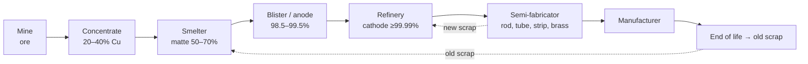
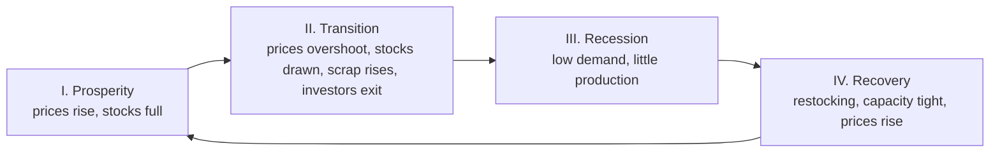

# 5. Base Metals

> **Teaching rewrite** of base metals: production, copper, aluminium, steel, the London Metal Exchange, price drivers, and hedging for consumers. Original wording; worked numbers recomputed. Prices (aluminium ~USD 2,500, copper ~USD 7,000) are teaching values. Not investment advice.

## Introduction

Base metals — copper, aluminium, zinc, nickel, lead, tin — wire our homes, build our cars, and carry our electricity. Unlike gold (lesson 4), most base metal supply sits **below** ground, inventories are thin, and prices respond quickly to economic cycles. Their price benchmark is set mostly on one unusual exchange: the **London Metal Exchange (LME)**.

This lesson covers:

- How metals are **produced**: ore → concentrate → smelting → refining
- **Copper** reserves, uses, supply chain, scrap, trade flows; **aluminium**; **steel**
- The **LME**: futures, TAPOs, prompt dates, ring trading, clearing, margining, warehouses and warrants
- **Price drivers**, the business cycle, **electric vehicles**
- Long-term prices, forward-curve moves, **marginal cost** curves, **regional premiums**
- **Hedging for an automaker**: forwards, carry (“lend/borrow”), options, min-max, three-way, knock-out forwards, forward plus, **basket options**, FX and **compo swaps**

---

## 5.1 How metals are produced

1. **Exploration** — geological surveys and test drilling; a mine goes ahead only if expected value exceeds development and operating costs (including roads, buildings, environment). Discovery to production can take **~10 years**; lenders often require **hedging** of future revenues.
2. **Separation** — about 80% of elements are metals, but most occur as **compounds** (ores). Rock and ore are ground and separated mechanically.
3. **Extraction** — breaking the compound: carbon/oxygen processes, or for very reactive metals, **smelting** and **electrolysis**. The more reactive the metal, the costlier.
4. **Refining** — removing impurities so the metal can be fabricated.

Gold and silver are unreactive and occur pure; francium reacts instantly with air or water.

---

## 5.2 Copper

### Reserves vs resources

| Term | Meaning | ≈ 2016 estimate |
|---|---|---|
| **Resources (total)** | Everything known or predicted | 5,600 Mt |
| Undiscovered resources | Postulated only | 3,500 Mt |
| Identified resources | Location and grade known/estimated | 2,100 Mt |
| **Reserves** | Economic to extract **now** | ~720 Mt |

Mine output was about **20 Mt** a year (2016). Reserves have stayed at roughly **40 years** of demand for decades because higher prices turn resources into reserves, technology improves, copper is **fully recyclable**, and innovation economises on use.

### Uses

Electrical (cables, appliances), electronics and communications, construction (plumbing, frames), transport (motors, wiring, **EVs**), industrial machinery, coins and cookware.

### Supply chain

| Stage | Top countries (source era) |
|---|---|
| Mining | Chile, Peru, China, US, Australia |
| Smelting | China, Japan, Chile, Russia, India |
| Refining | China, Chile, Japan, US, Russia |
| Semi-fabrication | China, US, Germany, Japan, Korea |

**Scrap**: *new* scrap = offcuts from manufacturing; *old* scrap = recovered from end-of-life products. Refined copper from scrap = **secondary production**.

**Trade flows**: concentrates (Chile, Peru, Indonesia → China, Japan, Spain); blister/anode (Chile, Bulgaria, Namibia → China, Belgium, India); refined copper (Chile, Japan, Russia → China, Germany, US); semis (Germany, Taiwan, China → China, US, Italy).

---

## 5.3 Aluminium

- Largest non-ferrous metal by output (**60 Mt+** a year).
- **Bauxite** → dissolved in caustic soda → **alumina** (Al₂O₃, white powder) → **electrolysis** → aluminium.
- **4 t bauxite → 2 t alumina → 1 t aluminium.**
- Very **energy-intensive** — electricity can be ~40% (up to ~50%) of costs, so smelters cluster near cheap power (e.g. Iceland). **Recycling** uses only ~**5%** of the energy.
- Alumina traditionally sold on long-term contracts at **12–14%** of the aluminium price.
- Producers: China, then the Gulf, North America, Western Europe. Demand: transport ~⅓ (engine blocks, body panels), construction ~25%, packaging ~16%.

---

## 5.4 Steel

Steel is an **alloy** (iron + carbon, plus elements such as manganese and silicon) — it doesn’t occur naturally.

| Route | Share | Main inputs per tonne of crude steel |
|---|---|---|
| **Basic oxygen furnace (BOF)** | ~72% | 1,370 kg iron ore, 780 kg coal, 270 kg limestone, 125 kg scrap |
| **Electric arc furnace (EAF)** | ~28% | 710 kg scrap, 586 kg iron ore, 88 kg limestone, 2.3 GJ electricity |

- **3,500+ grades**; alloying adds properties (manganese → harder; nickel/molybdenum → resistant; zinc coating → rust-proof).
- **Long products** (billet/bloom → wire rod, rebar, sections, rails) and **flat products** (slab → plate, hot/cold-rolled coil).
- Uses: buildings and infrastructure ~51%, mechanical equipment 15%, automotive 12%, metal products 11%.
- Price drivers: **met coke, iron ore, scrap, energy, freight**; China is both the largest producer and consumer.
- Hedging is relatively new: the LME lists **cash-settled** steel **scrap** (10 t lots, settled on the monthly average of a Platts Turkey scrap assessment — Turkey is the key scrap importer) and **rebar** futures.

<GuidedChoiceExplanation preset="comm-base-supply" />

---

### Checkpoint 1: production and metals

<MultipleChoice
  id="comm-ch5-mid1"
  title="Checkpoint — sections 5.1 to 5.4"
  questions={[
    {
      prompt: 'Why have copper reserves stayed near 40 years of demand for decades?',
      choices: [
        'No copper has been mined',
        'Higher prices and better technology convert resources into reserves, and copper is recyclable',
        'Governments fix reserves by law',
        'Demand has fallen',
      ],
      answer: 1,
      why: 'Reserves are an economic, not just geological, concept.',
    },
    {
      prompt: 'Order the copper concentrations: concentrate, matte, blister, cathode.',
      choices: [
        '20–40%, 50–70%, 98.5–99.5%, ≈99.99%',
        '50–70%, 20–40%, ≈99.99%, 98.5%',
        'All ≈99%',
        '10%, 20%, 30%, 40%',
      ],
      answer: 0,
      why: 'Each stage removes more of the non-copper material.',
    },
    {
      prompt: 'How much bauxite is needed for 5,000 t of aluminium?',
      choices: ['5,000 t', '10,000 t', '20,000 t', '40,000 t'],
      answer: 2,
      why: '4 t bauxite → 1 t aluminium.',
    },
    {
      prompt: 'Why do aluminium smelters locate near cheap electricity?',
      choices: [
        'Bauxite is found there',
        'Electrolysis is extremely energy-intensive — power is a huge share of cost',
        'Tax rules',
        'Shipping is free',
      ],
      answer: 1,
      why: 'Recycling, by contrast, needs only ~5% of the energy.',
    },
    {
      type: 'order',
      prompt: 'Rank the copper chain.',
      items: ['Mine ore', 'Concentrate', 'Smelt to matte, then blister/anode', 'Refine to cathode', 'Semi-fabricate (rod, tube, sheet)'],
      why: 'Ore → concentrate → smelter → refinery → semis.',
    },
  ]}
/>

---

## 5.5 The London Metal Exchange

The LME provides **transparent benchmark prices** that much of the physical metals trade references. Physical participants (producers, processors, consumers) are roughly **a third** of volume; the rest is financial. Much trade is **OTC**, but OTC risk is often hedged on the LME.

### Products

- **Futures** (physically settled; only ~1% delivered — positions are closed by opposite trades for the same **prompt date**)
  - Non-ferrous: copper, primary aluminium, aluminium alloy, NASAAC, lead, nickel, tin, zinc
  - Ferrous: steel scrap, rebar · Minor: cobalt, molybdenum · Precious: gold, silver
- **Options** on futures (American style for copper)
- **TAPOs** — traded average price options, settled on the **monthly average settlement price (MASP)**
- **Premium futures** (e.g. US Midwest aluminium premium)

### What the contract delivers

The LME prices metal at the **refined** stage (e.g. Grade A copper cathode). Other stages trade at **adjustments**: concentrates at a discount; semis and products at a premium.

#### TC/RCs: pricing concentrate

Smelters charge miners **treatment charges** (per dry metric tonne of concentrate) and **refining charges** (per pound of contained copper).

**Worked example**: concentrate **30%** Cu, payable at **96.65%** of LME **USD 7,000**:

- Payable value = 30% × 96.65% × 7,000 = **USD 2,029.65 / DMT**
- Refining charge at **USD 0.045/lb**: 30% × 0.045 × **2,204.6 lb/t** = **USD 29.76 / DMT**
- Plus a treatment charge (USD/DMT), both deducted from the payable value

:::caution Correction
The source uses 22,046 lb per tonne. One metric tonne is **2,204.6 lb**, giving USD 29.76/DMT for the refining charge.
:::

### Contract specs

| Metal | Lot size |
|---|---|
| Aluminium, copper, lead, zinc | 25 t |
| Aluminium alloy, NASAAC | 20 t |
| Nickel | 6 t |
| Tin | 5 t |

**Prompt dates**: **daily** out to 3 months; **weekly** (Wednesdays) 3–6 months; **monthly** (third Wednesday) out to **123 months** (metal-dependent). The **3-month** date is most liquid — historically the time to ship metal to London.

### Trading: the ring

Open-outcry **ring** sessions plus 24-hour electronic trading. Copper: ring 1 12:00–12:05, **ring 2 (official prices)** 12:30–12:35, kerb 13:25–13:35; afternoon rings and kerb follow. **Official prices** (cash, 3-month, three December prompts) are benchmarks for settlement.

### Clearing and margining

**LME Clear** becomes buyer to every seller and seller to every buyer (novation). Brokers’ clients still face their **broker’s** credit.

Unusual margin rule: **losses** are paid immediately (like other exchanges) but **profits** are **not** paid until the position closes or matures (like OTC).

**Example**: buy 1 lot aluminium at **1,900**, initial margin **100**. Next day the prompt trades **1,950**:

- Close out → receive margin back + **50** profit
- Keep the position → **no** cash for the 50 gain
- If it had fallen to **1,850** → pay **50** variation margin now

OTC trades are often collateralised under an **ISDA Credit Support Annex**: frequency, threshold, minimum transfer amount, eligible collateral.

### Delivery: warehouses and warrants

- **600+** LME-approved warehouses in ~35 countries, mainly near **consumers**. The LME owns neither warehouses nor metal; **stocks** are watched as an inventory gauge.
- Metal meeting specs is “**put on warrant**” (warrant = title); cancelling it takes metal “off warrant”.
- **LMEsword** transfers warrants electronically; warrants are **allocated randomly** to longs.
- The **seller chooses** location and brand → a “cheapest-to-deliver” element; off-exchange **warrant swaps** and premiums for popular locations/brands result.
- Delivered weight may vary **±2%**; the invoice adjusts.

:::info Since the source was written
In **March 2022** the LME suspended nickel trading and cancelled trades after prices more than doubled in hours — a reminder that exchange rules and liquidity can change abruptly. Sanctions have also restricted delivery of newly produced Russian metal on the LME since 2024.
:::

<GuidedChoiceExplanation preset="comm-lme" />

---

### Checkpoint 2: the LME

<MultipleChoice
  id="comm-ch5-mid2"
  title="Checkpoint — section 5.5"
  questions={[
    {
      prompt: 'Lot size of LME copper?',
      choices: ['5 t', '6 t', '25 t', '100 t'],
      answer: 2,
      why: 'Aluminium, copper, lead, zinc: 25 t.',
    },
    {
      prompt: 'An LME long position gains USD 2,000 but stays open. When is the profit paid?',
      choices: ['Next morning', 'When the position closes or matures', 'Never', 'Weekly'],
      answer: 1,
      why: 'Losses are called immediately; profits wait.',
    },
    {
      prompt: 'Who chooses the delivery location and brand on an LME futures delivery?',
      choices: ['The buyer', 'The seller', 'The exchange randomly picks the seller', 'The warehouse'],
      answer: 1,
      why: 'Hence cheapest-to-deliver behaviour and warrant swaps.',
    },
    {
      prompt: 'Concentrate 28% Cu, payable 96.5%, LME 8,000. Payable value per DMT?',
      choices: ['2,161.60', '2,240.00', '7,720.00', '2,016.00'],
      answer: 0,
      why: '0.28 × 0.965 × 8,000 = 2,161.60.',
    },
    {
      type: 'order',
      prompt: 'Rank LME prompt-date frequencies from NEAREST to FURTHEST maturities.',
      items: ['Daily (to 3 months)', 'Weekly Wednesdays (3–6 months)', 'Monthly third Wednesdays (out to 123 months)'],
      why: 'Granularity thins with distance.',
    },
  ]}
/>

---

## 5.6 Price drivers

| Driver | Effect |
|---|---|
| **Raw material quality** | Rich, cheap, long-life ore bodies are depleting |
| **Inventories** | Thin above-ground stocks → copper prone to **backwardation** (vs gold’s contango) |
| **Fiscal/monetary policy** | Stimulus → more cars, chips, housing → more metal |
| **US dollar** | Weaker USD → cheaper for others → more demand → higher USD price |
| **China and India** | China ≈ **50%** of world copper use (≈ 11.4 Mt of 23.3 Mt in 2016) despite producing ≈ 8.4 Mt refined |
| **Finance availability** | Tight credit after 2008 → less capex → eventually less supply |
| **Capex and exploration** | Cut in busts, so supply lags booms (up to ~10 years discovery-to-output) |
| **Environmental approvals** | Long lead times |
| **Substitution** | Feasible over 2–3 years when prices stay high |
| **Disruptions** | Strikes (labour ≈ 26% of copper cost), accidents |
| **Infrastructure** | Power and transport in producing countries |
| **Resource nationalism** | Pressure to take resources into local ownership |
| **Production costs** | Higher steel and energy prices feed back |
| **Investment flows** | Watched via the CFTC **Commitments of Traders** (commercial vs non-commercial) |

### The business cycle

### Electric vehicles

- Types: **hybrid**, **plug-in hybrid**, **battery EV**. Emissions shift toward power generation.
- More copper, nickel, cobalt, lithium; less palladium/rhodium (catalytic converters).
- **Lithium** (“the new gasoline”, 40–80 kg per pack — falling with technology); **cobalt** largely a by-product of copper, concentrated in the **DR Congo** and processed mainly in China.
- The LME lists cobalt, nickel, copper, aluminium (and has added battery-metal contracts such as lithium hydroxide).

---

## 5.7 Market price structure

### Long-term prices

Five ways to pick a “long-term price” (e.g. for a mine loan): **mean reversion** to a historic average · **future average** of forecasts · **equilibrium** price (judgement or inventory link) · **back end of the forward curve** · **incentive price** (high enough to justify new investment).

### How forward curves move

- **Level** (parallel shift), **slope** (two-point steepen/flatten), **shape** (curvature: middle vs ends).
- The **short end** reacts to physical events and is most volatile; the long end to financial factors (rates, inflation).

### Forwards are breakevens, not forecasts

Cash copper **6,700**, 3-month **6,800**. A seller who expects cash in 3 months **above 6,800** stays unhedged; **below 6,800** sells forward; **at 6,800** is indifferent. In high-price, steeply backwardated markets producers often **don’t** hedge (shareholders want upside) while consumers and investors buy forward — damping the backwardation.

### Marginal cost curves

Plot cumulative production (x) against cost (y). Producers above roughly the **90th percentile** are **marginal**: if prices stay below their cash cost, they should cut output — a soft **floor** in gluts. It works poorly in demand booms, and the curve itself shifts with the cycle.

### Regional premiums

“All-in” price = **LME price** (date or average) + **regional premium** (local availability and delivery) + shape/quality/alloy premium ± FX ± supply-chain stage adjustment.

- 2018 US tariffs on aluminium pushed up the **US Midwest premium**.
- A 2014 US Senate review found **warehouse queues** lengthened load-out times, raising rents and premiums.
- The LME **aluminium premium futures** (25 t, monthly to 15 months, physically delivered) let users hedge the premium; residual **basis risk** remains.

### Worked example: all-in price

LME 3-month aluminium **2,500** + US Midwest premium **400** + billet (shape) premium **150** = **USD 3,050/t** delivered.

---

### Checkpoint 3: drivers and structure

<MultipleChoice
  id="comm-ch5-mid3"
  title="Checkpoint — sections 5.6 and 5.7"
  questions={[
    {
      prompt: 'Why is copper more prone to backwardation than gold?',
      choices: [
        'Copper is cheaper',
        'Thin above-ground inventories make prompt metal scarce when demand rises',
        'Copper has no futures',
        'Gold is not stored',
      ],
      answer: 1,
      why: 'Scarcity premium on prompt delivery.',
    },
    {
      prompt: 'The US dollar weakens sharply. Expected effect on USD-priced copper?',
      choices: ['Falls', 'Rises', 'No effect', 'Becomes negative'],
      answer: 1,
      why: 'Cheaper for non-USD buyers → more demand.',
    },
    {
      prompt: 'Cash copper 9,000; 3-month 9,120. A miner expects 9,050 in three months. Best action?',
      choices: ['Stay unhedged', 'Sell 3-month forward', 'Buy forward', 'Indifferent'],
      answer: 1,
      why: '9,050 < 9,120 breakeven → lock in the forward.',
    },
    {
      prompt: 'LME 2,400 + regional premium 350 + shape premium 120. All-in price?',
      choices: ['2,400', '2,750', '2,870', '2,520'],
      answer: 2,
      why: '2,400 + 350 + 120 = 2,870.',
    },
    {
      type: 'order',
      prompt: 'Rank the business-cycle phases for base metals.',
      items: ['Prosperity', 'Transition', 'Recession', 'Recovery'],
      why: 'Then the cycle repeats.',
    },
  ]}
/>

---

## 5.8 Hedging for an aluminium consumer (automaker)

Automakers hedge aluminium, copper, zinc, lead, platinum/palladium, plastics, and steel — aluminium is the biggest by volume. The LME **NASAAC** contract (engine-block alloy, US delivery) was designed for them but has **poor liquidity** (natural sellers are mostly lower-credit scrap merchants).

**Market**: cash **2,400**, 3-month **2,500** (contango); options European, cash-settled, 20% vol, 3 months. The consumer buys physical metal on a **floating** price (average of the month before delivery) — it is **short forward**: hurt by rising prices.

### Forward purchase (cash-settled “swap”)

Buy a 3-month floating-price forward at **2,500**, settled against the same monthly average:

| Average at settlement | Physical cost | Hedge | Net |
|---|---|---|---|
| 2,400 | 2,400 | Pays 100 | **2,500** |
| 2,600 | 2,600 | Receives 100 | **2,500** |

### Carry trades: lend and borrow

Supplier delays delivery a month. After one month: 2-month **2,600**, 3-month **2,650**.

- **Sell** the 2-month (closing the original 2,500 long) → **+100**
- **Buy** the new 3-month at **2,650**
- Effective new cost ≈ 2,650 − 100 = **2,550** (less with interest on the 100)

Selling near / buying far = a **lend**; buying near / selling far = a **borrow** (the economics of a gold or FX swap).

### Option strategies

| Strategy | Construction | Result for the consumer |
|---|---|---|
| **Buy OTM call** (strike 2,600, premium 60) | Short forward + long call = synthetic **long put** | Max cost **2,660**; full benefit if prices fall (minus premium). Suits a consumer who expects a **fall** but can’t afford to be wrong — if it expected a rise, a forward (no premium) is better |
| **Sell OTM put** (strike 2,450, premium 76) | Short forward + short put = synthetic **short call** | Price 2,300 → cost 2,300 + 150 − 76 = **2,374**; price 2,700 → 2,700 − 76 = **2,624**. Subsidy only; no cap |
| **Sell OTM call** | Premium received | Risky: if prices spike, pays more for both metal and option |
| **Producer sells calls (“swaptions”)** | Miner with idle capacity sells calls ~15% above spot | If exercised, restart production — which is now profitable |

### Zero-premium combinations

| Structure | Legs | Outcome |
|---|---|---|
| **Min-max (collar)** | Buy call **2,600**, sell put **2,410** | Cost bounded **2,410 – 2,600** |
| **Ratio min-max** | Buy call 2,600, sell put on **75%** at **2,458** | Cap 2,600; below 2,458 benefits from only **25%** of further falls — but no hard floor |
| **Three-way** | Sell put **2,376**; buy call **2,450**; sell call **2,550** | Below 2,376 → 2,376; 2,376–2,450 → market; 2,450–2,550 → 2,450; above 2,550 → market − 100 |

### Structured (barrier) solutions

| Structure | Terms | Catch |
|---|---|---|
| **Knock-out forward** | Buy at **2,450** (vs 2,500 market) — built from a knock-out call and short knock-out put; terminates if cash hits **2,932** | Unhedged exactly when prices are very high |
| **Forward plus** | Long call **2,600** (60) financed by a short **knock-in put** 2,600 with trigger **2,139** | Never pays more than 2,600; benefits from falls only down to 2,139 — then locked at 2,600 |

### Basket options

An option on a weighted **basket** of metals is cheaper than separate options because prices don’t always move together.

> Basket call payoff = max(0, w₁S₁ + w₂S₂ − X)

**Example**: 50/50 aluminium (3-month 2,500) and copper (7,000) → strike **4,750**. At expiry 2,600 and 7,100 → basket 4,850 → payoff **100** (vs **200** from two separate calls).

> Basket vol = √(w₁²σ₁² + w₂²σ₂² + 2w₁w₂ρσ₁σ₂)

With σ_Al = 20%, σ_Cu = 25%:

| Correlation ρ | −1.0 | −0.5 | 0 | +0.5 | +1.0 |
|---|---|---|---|---|---|
| Basket vol | 2.50% | 11.46% | 16.01% | 19.53% | 22.50% |
| Premium (USD) | 125 | 155 | 181 | 204 | 224 |

Separate ATM calls cost 99 (Al) + 348 (Cu) = **447** — even at ρ = +1 the basket (224) is about half, since it is weighted 50/50.

### FX exposures

**Vanilla**: a bank sells copper to a EUR client at a fixed EUR price. 3-month copper **USD 7,000**, 3-month forward **€1 = USD 1.20** → **EUR 5,833**. If unhedged and EUR/USD ends at 1.15, the EUR received buys only **USD 6,708** — short of 7,000. The bank sells EUR forward (executed as an **FX swap**: spot + forward), funding USD and lending EUR in the money market.

**Compo (FX-linked commodity) swap**: a EUR consumer fixes **EUR/USD at 1.20**. Copper settles **USD 6,500**, spot FX **1.15**:

- Bank pays: 6,500 / 1.15 = **EUR 5,652** (what the client needs to buy USD 6,500)
- Client pays: 6,500 / 1.20 = **EUR 5,417**
- Net EUR cost of the copper fixed at the **1.20** rate. Variants fix the commodity, the FX, or both.

<GuidedChoiceExplanation preset="comm-base-hedge" />

---

### Checkpoint 4: hedging

<MultipleChoice
  id="comm-ch5-mid4"
  title="Checkpoint — section 5.8"
  questions={[
    {
      prompt: 'Consumer hedged at 2,500; monthly average settles 2,450. Hedge cash flow per tonne?',
      choices: ['Receives 50', 'Pays 50', 'Pays 2,450', 'Zero'],
      answer: 1,
      why: 'Pays 50, buys physical at 2,450 → net 2,500.',
    },
    {
      prompt: 'Selling the near prompt and buying the far prompt is called a…',
      choices: ['Borrow', 'Lend', 'Crack', 'Squeeze'],
      answer: 1,
      why: 'Metal goes out near-dated and comes back far-dated.',
    },
    {
      prompt: 'Collar: long call 2,600, short put 2,410. Price at expiry 2,200. Consumer’s net cost?',
      choices: ['2,200', '2,410', '2,600', '2,000'],
      answer: 1,
      why: 'Short put exercised: pays 210 → 2,410.',
    },
    {
      prompt: 'Three-way: short put 2,376, long call 2,450, short call 2,550. Price 2,800. Net cost?',
      choices: ['2,450', '2,550', '2,700', '2,800'],
      answer: 2,
      why: 'Call spread pays 100 → 2,800 − 100 = 2,700.',
    },
    {
      prompt: 'Why is a basket option cheaper than separate options?',
      choices: [
        'It has no strike',
        'Imperfect correlation lowers basket volatility and the expected payout',
        'It is exchange-traded',
        'It never pays',
      ],
      answer: 1,
      why: 'Diversification within the option.',
    },
    {
      type: 'order',
      prompt: 'Rank these consumer hedges by MAXIMUM possible cost (LOWEST cap first).',
      items: ['Forward at 2,500', 'Collar with call at 2,600', 'Long call 2,600 + premium 60 (cap 2,660)', 'Sold put only (no cap)'],
      why: 'Selling puts subsidises but never caps.',
    },
  ]}
/>

---

### Rank: base metals practice

<MultipleChoice
  id="comm-ch5-rank"
  title="Base metals practice"
  questions={[
    {
      type: 'order',
      prompt: 'Rank the basket premiums by correlation (CHEAPEST first).',
      items: ['ρ = −1.0 (125)', 'ρ = 0 (181)', 'ρ = +0.5 (204)', 'ρ = +1.0 (224)'],
      why: 'Higher correlation → higher basket volatility → higher premium.',
    },
    {
      type: 'order',
      prompt: 'Rank the components of an all-in delivered aluminium price as typically built.',
      items: ['LME benchmark price', 'Regional premium', 'Shape / quality premium', 'FX conversion if paying in non-USD'],
      why: 'Global benchmark, then local, product, and currency adjustments.',
    },
  ]}
/>

---

### Check: base metals

<MultipleChoice
  id="comm-ch5"
  title="Base metals"
  questions={[
    {
      prompt: 'At which stage of the supply chain is the LME contract priced?',
      choices: ['Ore', 'Concentrate', 'Refined metal (e.g. cathode)', 'Finished product'],
      answer: 2,
      why: 'Other stages trade at discounts or premiums to it.',
    },
    {
      prompt: 'What does a TAPO settle against?',
      choices: ['The cash price on one day', 'The LME monthly average settlement price', 'The 3-month price', 'A PRA index'],
      answer: 1,
      why: 'Traded average price options.',
    },
    {
      prompt: 'What is “putting metal on warrant”?',
      choices: [
        'Selling it short',
        'Depositing compliant metal in an LME warehouse and receiving a warrant of title',
        'Exporting it',
        'Recycling it',
      ],
      answer: 1,
      why: 'Cancelling the warrant takes it off warrant.',
    },
    {
      prompt: 'Which steel route uses mostly scrap?',
      choices: ['Basic oxygen furnace', 'Electric arc furnace', 'Blast furnace only', 'Rolling mill'],
      answer: 1,
      why: 'EAF ≈ 710 kg scrap per tonne.',
    },
    {
      prompt: 'Knock-out forward at 2,450 with KO 2,932. Price spikes to 3,000. Result?',
      choices: [
        'Buys at 2,450',
        'Hedge terminated — buys at market around 3,000',
        'Buys at 2,932',
        'Receives premium',
      ],
      answer: 1,
      why: 'The subsidy is paid for with the knock-out risk.',
    },
    {
      prompt: 'Compo swap fixed at €1 = USD 1.20; copper USD 6,000, spot FX 1.25. EUR the client pays on the swap?',
      choices: ['5,000', '4,800', '6,000', '7,200'],
      answer: 0,
      why: '6,000 / 1.20 = 5,000 (the bank pays 6,000 / 1.25 = 4,800).',
    },
  ]}
/>

---

## Calculate: numeric practice

Type the number (no units; minus sign for payments). 1 metric tonne = 2,204.6 lb.

### Formula sheet

| Item | Formula |
|---|---|
| Concentrate payable | Cu % × payable % × LME |
| Refining charge (USD/DMT) | Cu % × RC (USD/lb) × 2,204.6 |
| Bauxite needed | 4 × aluminium |
| LME lots | tonnes / lot size |
| Floating forward settlement (consumer) | (average − fixed) × tonnes |
| Lend roll effective price | new far price − profit on closing near |
| Collar cost | min(max(price, put strike), call strike) |
| Basket payoff | max(0, Σwᵢ Sᵢ − X) |
| Basket vol | √(w₁²σ₁² + w₂²σ₂² + 2w₁w₂ρσ₁σ₂) |
| EUR price | USD price / EUR-USD forward |

<NumericQuiz
  id="comm-ch5-calc"
  title="Calculate: base metals"
  decimals={2}
  questions={[
    {
      prompt: 'Concentrate: 25% Cu, payable 96.5% of LME USD 9,000. Payable value per DMT?',
      answer: 2171.25,
      why: '0.25 × 0.965 × 9,000 = 2,171.25.',
    },
    {
      prompt: 'Refining charge USD 0.08/lb on concentrate with 25% Cu. RC per DMT (2 dp)?',
      answer: 44.09,
      why: '0.25 × 0.08 × 2,204.6 ≈ 44.09.',
    },
    {
      prompt: 'Bauxite (tonnes) needed for 12,000 t of aluminium?',
      answer: 48000,
      why: '4 × 12,000 = 48,000.',
      decimals: 0,
    },
    {
      prompt: 'Alumina priced at 13% of aluminium at USD 2,500/t. Alumina price?',
      answer: 325,
      why: '0.13 × 2,500 = 325.',
    },
    {
      prompt: 'How many LME copper lots hedge 300 t?',
      answer: 12,
      why: '300 / 25 = 12.',
      decimals: 0,
    },
    {
      prompt: 'Consumer hedged 1,000 t with a floating forward at 2,500. Monthly average settles 2,430. Hedge cash flow for the consumer (negative = pays)?',
      answer: -70000,
      why: '(2,430 − 2,500) × 1,000 = −70,000; physical bought at 2,430 → net 2,500.',
      decimals: 0,
    },
    {
      prompt: 'Original long forward at 2,500. Delay: sell the near prompt at 2,620, buy the new far prompt at 2,680. Effective new price (ignore interest)?',
      answer: 2560,
      why: 'Profit 120; 2,680 − 120 = 2,560.',
      decimals: 0,
    },
    {
      prompt: 'Long call strike 2,600, premium 60, consumer short physical. Maximum net cost per tonne?',
      answer: 2660,
      why: 'Strike + premium.',
      decimals: 0,
    },
    {
      prompt: 'Three-way: short put 2,376, long call 2,450, short call 2,550. Price at expiry 2,700. Net cost?',
      answer: 2600,
      why: 'Call spread pays 100: 2,700 − 100 = 2,600.',
      decimals: 0,
    },
    {
      prompt: '50/50 basket: aluminium vol 20%, copper vol 30%, correlation 0.4. Basket vol in % (2 dp)?',
      answer: 21.1,
      why: '√(0.01 + 0.0225 + 0.012) = √0.0445 ≈ 21.10%.',
    },
    {
      prompt: '50/50 basket call, strike 4,750. At expiry aluminium 2,550, copper 7,250. Payoff?',
      answer: 150,
      why: '0.5 × 2,550 + 0.5 × 7,250 = 4,900; 4,900 − 4,750 = 150.',
      decimals: 0,
    },
    {
      prompt: 'Copper 3-month USD 8,400; 3-month forward €1 = USD 1.12. Fixed EUR price per tonne?',
      answer: 7500,
      why: '8,400 / 1.12 = 7,500.',
      decimals: 0,
    },
  ]}
/>

### Randomized practice

<NumericQuiz id="comm-ch5-calc-random" title="Practice: base metals drills" bank="commBase" rounds={6} />

---

## Takeaways

:::tip Remember
- Production: **ore → concentrate → smelt → refine**; copper reserves stay ~40 years because economics redefine them
- Aluminium: **4:2:1** bauxite→alumina→metal, power-hungry; steel via **BOF** (ore + coal) or **EAF** (scrap)
- LME: refined-metal benchmark; **25 t** lots for major metals; daily/weekly/monthly **prompts**; **ring** official prices; losses paid now, profits at close; **warrants** and seller’s delivery choice
- Drivers: **thin inventories**, China, USD, capex lag, disruptions, policy, investment, EVs
- Forwards are **breakevens**; marginal cost is a **soft floor**; **premiums** turn the global LME price into a local all-in price
- Consumer hedges: forwards, **lend/borrow** carry, calls, collars, three-ways, knock-out forwards, forward plus, **baskets** (cheaper via correlation), **compo swaps** for FX
:::

## Further Reading

- [4. Gold](./gold)
- [3. Risk management principles](./risk-management-principles)
- Next: [6. Crude oil](./crude-oil)
- LME ([lme.com](https://www.lme.com)) — contract specifications; International Copper Study Group, *World Copper Factbook*; World Steel Association statistics
- Background: N. Schofield, *Commodity Derivatives: Markets and Applications* (Wiley) — used as a study outline
