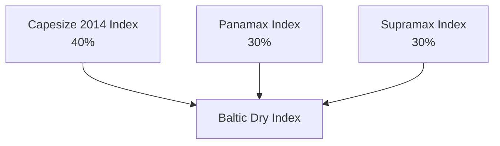

# 10. Bulk Commodities

> **Teaching rewrite** of the bulk commodity markets: coal, iron ore, and freight — the raw materials and shipping behind the steel supply chain. Original wording; worked numbers recomputed. Prices are teaching values. Not investment advice.

## Introduction

“Bulk commodities” is a loose label for markets linked by **steel**: **iron ore** and **coking coal** go into blast furnaces, and **dry bulk ships** carry both — about 60% of Capesize vessels haul iron ore. Some scale (Singapore Exchange, 2019):

- In tonnage, steel is roughly **20 times** all other metals combined.
- About **98%** of iron ore goes into steel.
- About **15%** of coal is used in steelmaking (as coking coal).
- **China** takes about two-thirds of seaborne iron ore.

Banks organise these desks differently: a consumer-focused bank may put iron ore under base metals, while a producer-focused one may group coal, iron ore, and freight together.

This lesson covers:

- **Coal**: types, supply and demand, the supply chain, price drivers, and derivatives (swaps, swaptions, covered calls)
- **Iron ore**: grades, CFR pricing, and exchange-listed contracts
- **Freight**: vessel classes, voyage vs time charters, **Baltic indices**, **Worldscale**, and **forward freight agreements (FFAs)** and exotic structures

---

## 10.1 Coal basics

Coal is a combustible sedimentary rock — mainly carbon, hydrogen, and oxygen — formed from plant matter compressed and heated over millions of years. Longer formation and greater heat and pressure give **higher rank** coal: more carbon and energy, less moisture.

| Rank | Type | Share of reserves | Main uses |
|---|---|---|---|
| High (hard coal ≈ 53%) | **Anthracite** | ~1% | Domestic and industrial heating |
| | **Bituminous — thermal (steam)** | ~52% (with coking) | Power generation, cement |
| | **Bituminous — metallurgical (coking)** | | Coke ovens → blast furnaces → pig iron |
| Low (≈ 47%) | **Sub-bituminous** | ~30% | Power, cement |
| | **Lignite (brown coal)** | ~17% | Local power generation, briquettes |

- **Coking coal** is harder and scarcer than thermal coal, so it trades at a **premium**.
- **Hard coal** has enough energy per tonne to justify international shipping; **lignite** is usually burned near the mine.

---

## 10.2 Coal demand and supply

Coal supplied about **27%** of primary energy in 2019, second only to oil. World Coal Association figures:

- ~**41%** of global electricity comes from coal
- ~**70%** of steel uses coal
- ~**200 kg** of coal per tonne of cement
- ~**50%** of the energy used to make aluminium comes from coal

**Reserves** (BP 2020): Asia Pacific 42.7%, North America 24.1%, CIS 17.8%, Europe 12.6%, Middle East and Africa 1.5%, South and Central America 1.3%.

**Reserves-to-production (R/P) ratio** = reserves at year end ÷ that year’s production → how many years reserves last at current output. Coal ≈ **132 years**, versus ≈ 50 for oil and for gas.

| Largest thermal exporters (2019) | Mt | Largest coking exporters | Mt | Main importers | Mt |
|---|---|---|---|---|---|
| Indonesia | 435 | Australia | 179 | China | 295 |
| Australia | 203 | USA | 56 | India | 240 |
| Russia | 173 | Canada | 29 | Japan | 185 |
| Colombia | 81 | Russia | 26 | South Korea | 142 |

Coal grew because energy demand rose, it is **cheaper per kWh** in many regions, it is **safe and cheap to transport**, and **reserves are large**.

:::info Update
Since 2019 coal’s role has shifted: Europe and the US have closed many coal plants, while China, India, and Indonesia have kept consumption near record highs. 2022 saw extreme price spikes (Newcastle above USD 400/t) as Europe replaced Russian gas.
:::

---

## 10.3 The physical supply chain

**Production**: **underground** mining (most output) or **surface/open-cast** mining (recovers more of a deposit, usually cheaper). Coal is crushed, cleaned, and moved by truck, rail, barge, and ship.

| Participant | Concern | Typical solution |
|---|---|---|
| **Mining companies** | Falling prices; financing linked to coal and FX | Swaps, collars, price-linked loans |
| **Utilities** | Volatile fuel cost; carbon cost | Financially settled swaps (separate price from delivery) |
| **Banks / trading houses** | Liquidity, client hedges, structured notes | Make markets, offset other banks’ exposures |
| **Industrial users** (cement, steel) | Rising costs | Buy swaps; steelmakers using thermal coal as a proxy take **basis risk** |

:::info Update
The source says financial markets trade only thermal coal. Today **coking coal** futures exist too (e.g. SGX and CME contracts on premium hard coking coal, FOB Australia), so steelmakers can hedge more directly.
:::

### Price drivers

| Driver | Effect |
|---|---|
| **Benchmark location** | Indices at Central Appalachia, Powder River Basin, ARA (Amsterdam–Rotterdam–Antwerp), Richards Bay, Newcastle |
| **Electricity demand** | Electrification (e.g. India) lifts demand; China largely uses its own coal |
| **Generation margins** | Gas-to-coal switching via spark vs **clean dark spreads** (lesson 8) |
| **Technology** | Cleaner preparation, scrubbers, more efficient boilers |
| **Environment** | Methane from mines; CO₂, ash, SOx, NOx from burning — regulation hurts prices |
| **Freight** | Delivered cost includes shipping |
| **Economic growth** | Chinese steel boom → coking coal demand |
| **Quality** | Calorific value and sulfur; low-sulfur, open-cast Powder River coal is cheaper and cleaner than Appalachian |
| **Mining** | Capex, disruption, costs, depth; long rail hauls (Russia), derailments, port logistics |
| **Competing fuels** | **Liquefaction** (coal → liquids) gains when oil is dear; **gasification** → syngas for power; cheap gas or LNG displaces coal |
| **Investors** | Flows can lift prices and deepen liquidity |

### Calorific value: GAR vs NAR

Contracts specify energy content, checked by lab assay (like a crude assay).

| Basis | Meaning |
|---|---|
| **GAR** — gross as received | Gross (higher) heating value: counts the heat recoverable by condensing the water vapour produced |
| **NAR** — net as received | Net (lower) heating value: excludes that latent heat — closer to what a boiler actually gets |

GAR > NAR for the same coal; the gap is the heat of the water vapour.

:::caution Correction
The source describes GAR as measured “after all the moisture has been removed”. **“As received”** means *including* the coal’s moisture as delivered; a dried basis is “air-dried” or “dry basis”. The GAR–NAR difference is the **latent heat of the water vapour**, not the moisture removal.
:::

<GuidedChoiceExplanation preset="comm-bulk-coal" />

---

### Checkpoint 1: coal basics

<MultipleChoice
  id="comm-ch10-mid1"
  title="Checkpoint — sections 10.1 to 10.3"
  questions={[
    {
      prompt: 'Which coal is used in coke ovens to make iron?',
      choices: ['Lignite', 'Thermal bituminous', 'Metallurgical (coking) bituminous', 'Sub-bituminous'],
      answer: 2,
      why: 'Coke from coking coal feeds blast furnaces.',
    },
    {
      prompt: 'Why is lignite rarely traded internationally?',
      choices: [
        'It is illegal to ship',
        'Low energy per tonne and high moisture make shipping uneconomic',
        'It is too valuable',
        'It is only used in steel',
      ],
      answer: 1,
      why: 'Shipping cost per unit of energy is too high.',
    },
    {
      prompt: 'Reserves 1,000 Mt; production 25 Mt a year. R/P ratio?',
      choices: ['25 years', '40 years', '1,025 years', '0.025 years'],
      answer: 1,
      why: '1,000 / 25.',
    },
    {
      prompt: 'Gas prices jump relative to coal. Expected effect on coal demand from power?',
      choices: ['Falls', 'Rises — generators switch to coal (carbon permitting)', 'No effect', 'Coal becomes a gas'],
      answer: 1,
      why: 'Compare spark vs clean dark spreads.',
    },
    {
      type: 'order',
      prompt: 'Rank by energy content (HIGHEST first).',
      items: ['Anthracite', 'Bituminous', 'Sub-bituminous', 'Lignite'],
      why: 'Rank rises with carbon content; moisture falls.',
    },
  ]}
/>

---

## 10.4 Coal derivatives

**Market size**: 8.1 billion t × USD 60 ≈ **USD 486 billion** of physical coal (2019), versus about **USD 100 billion** of derivatives notional — small, as derivatives usually exceed the physical market.

### Indices

“API” here means **All Publications Index** — an average of several published assessments (Argus/McCloskey). The number only distinguishes locations.

| Index | Basis | Location | Role |
|---|---|---|---|
| **API2** | **CIF** ARA (Amsterdam–Rotterdam–Antwerp) | Northwest Europe | Main **Atlantic** import benchmark |
| **API4** | **FOB** Richards Bay | South Africa | Export benchmark — Atlantic and Indian Ocean |
| **NEWC** (GlobalCoal) | FOB Newcastle | Australia | Main **Pacific** benchmark |
| API 3, 5, 6, 8, 10, 12 | Various | S. Africa, Australia, S. China, Colombia, India | Quality or regional variants |

:::caution Correction
The source calls API4 the Pacific benchmark. API4 (Richards Bay) serves the **Atlantic/Indian Ocean**; the **Pacific** benchmark is **Newcastle (NEWC)**. Also, API2 is CIF **ARA**, not Rotterdam alone.
:::

**Indicative implied volatilities**: API2 25–35%, API4 20–25%, NEWC 18–25%, crude 25–50%, US gas 40–120%, European gas 40–90%.

European utilities, facing less predictable load after liberalisation, moved from one-year fixed-price supply to index pricing plus swaps.

### Exchange futures: ICE Rotterdam coal (API2)

| Term | Specification |
|---|---|
| Unit | 1,000 t |
| Quote | USD and cents per tonne |
| Periods | Months, quarters, seasons, years |
| Tick | USD 0.05/t = USD 50 per contract |
| Last trading | Last business day of the delivery period |
| Settlement | **Cash** against the monthly average API2 |

### Coal swaps

An Australian producer sells most output on long-term fixed contracts, but some at the **floating API2** price (it has cheap freight to Europe). Fearing falling prices, it **receives fixed / pays floating**:

| Term | Value |
|---|---|
| Notional | 15,000 t (5,000 t a month for 3 months, starting next June) |
| Fixed payer | Bank, USD **60.00/t** |
| Floating payer | Client, monthly average API2 |
| Settlement | Monthly in arrears, paid 5 business days later |

**Worked example**: June API2 averages **52**.

- Physical sale: 52 × 5,000 = 260,000
- Swap: (60 − 52) × 5,000 = **+40,000**
- Total: **300,000 = USD 60/t**

Any mismatch between the physical and swap pricing dates is **basis risk**. To regain upside on its *fixed-price* contracts, the producer can do the opposite swap: **pay fixed, receive floating**. Swaps can also settle as **one three-month period** (a cash-settled forward), or pay in **GBP/EUR** at an average FX rate.

### Coal swaptions

A **European** option to enter that swap, expiring in December. The client buys from the bank at **USD 1.85/t × 15,000 = USD 27,750**. The bank would pay fixed 60, so the client has the right to **receive fixed** — a floor for a producer who expects prices to **rise** but cannot afford to be wrong.

| Swap level at expiry | Action | Net price after premium |
|---|---|---|
| 50 | Exercise → receive 60 | 60 − 1.85 = **58.15** |
| 70 | Let lapse → sell at market | 70 − 1.85 = **68.15** |

### Covered calls

A producer sells a 3-month **USD 55** call (spot 50, vol 40%) for about **USD 2**.

| Price at expiry | Outcome | Producer receives |
|---|---|---|
| 45 | Not exercised | 45 + 2 = **47** |
| 52 | Not exercised | **54** |
| 60 | Exercised | 55 + 2 = **57** — capped |

Extra income when prices are flat or falling, but the upside is capped — unsuitable for a strongly bullish view.

<GuidedChoiceExplanation preset="comm-bulk-coal-hedge" />

---

### Checkpoint 2: coal derivatives

<MultipleChoice
  id="comm-ch10-mid2"
  title="Checkpoint — section 10.4"
  questions={[
    {
      prompt: 'A producer receives fixed 60 on 5,000 t; API2 averages 65. Swap cash flow?',
      choices: ['+25,000', '−25,000', '+300,000', '0'],
      answer: 1,
      why: '(60 − 65) × 5,000 — but the physical sale earns 5 more, so net stays 60.',
    },
    {
      prompt: 'Which index is the main Pacific thermal coal benchmark?',
      choices: ['API2', 'API4', 'GlobalCoal NEWC', 'Henry Hub'],
      answer: 2,
      why: 'Newcastle, Australia.',
    },
    {
      prompt: 'Sell a 55 call for 2 against production. Price ends at 70. Effective sale price?',
      choices: ['70', '72', '57', '53'],
      answer: 2,
      why: 'Strike plus premium — the upside is capped.',
    },
    {
      prompt: 'Why might a producer buy a receiver swaption rather than receive fixed on a swap?',
      choices: [
        'It is free',
        'It wants a floor but expects prices to rise and wants to keep the upside',
        'It expects prices to collapse with certainty',
        'Swaps are banned',
      ],
      answer: 1,
      why: 'The premium buys optionality.',
    },
    {
      type: 'order',
      prompt: 'Rank by typical implied volatility (LOWEST first).',
      items: ['GlobalCoal NEWC (18–25%)', 'API2 (25–35%)', 'Crude oil (25–50%)', 'US natural gas (40–120%)'],
      why: 'Coal sits at the low end of the energy complex.',
    },
  ]}
/>

---

## 10.5 Iron ore

Iron (Fe) is abundant but never found as usable metal; **iron ore** is rock rich enough in iron to be worth processing.

- **Fines**: sand-like grains — the most traded form. **Lump**: larger pieces, charged directly into furnaces at a premium.
- Ore + coke in a blast furnace → **pig iron** → steel (iron plus a little carbon; see lesson 5).
- Iron and steel are about **95%** of all metal tonnage and the cheapest metals.

**Largest pig iron producers (USGS 2020)**: China 820 Mt, India 75, Japan 75, Russia 50, Korea 48.

### Grades and pricing

Prices are quoted by **Fe content**; the commonest grades are 58–65%, and **62% Fe** is the main benchmark. Iron ore moved from annual benchmark contracts to index pricing around 2010 (lesson 1).

**Simple Fe adjustment** (pro-rata, ignoring impurity penalties): a 58% cargo against a 62% index at USD 100 → 100 × 58 / 62 ≈ **USD 93.55**.

### Iron ore derivatives (e.g. SGX)

- Futures, swaps, and options (on futures or on swaps)
- Mainly **fines**, plus a lump contract; grades 58–65%
- Quoted **CFR** (cost and freight) to a Chinese port such as Qingdao: the seller pays freight and loads the ship, but **risk passes to the buyer once loaded**, and the seller doesn’t insure
- **Cash-settled** against a published index

---

## 10.6 Freight fundamentals

### Vessels

**Wet** freight: crude, products (plus containers, liners, tugs). **Dry** freight: coal, iron ore, bauxite, grain. Ships are sized by **deadweight tonnage (dwt)** — carrying capacity including fuel, water, crew, and stores.

| Dry bulk class | Approx. dwt | Notes |
|---|---|---|
| **Handysize** | 20,000–35,000 | Own cranes |
| **Handymax** | 36,000–49,000 | Grain, steel, fertiliser |
| **Supramax / Ultramax** | 50,000–65,000 | |
| **Panamax / Kamsarmax** | 65,000–83,000 | Fit the old Panama locks; coal, grain, forest products |
| **Post-Panamax / Mini-Cape** | 87,000–120,000 | |
| **Capesize** | ~100,000–200,000 (index ship 180,000) | Too big for Panama/Suez → round the Capes; mostly iron ore |
| **VLOC** (Valemax, Chinamax) | 220,000–400,000 | |

| Tanker class | Approx. dwt |
|---|---|
| Product tanker | 10,000–60,000 |
| Panamax | 60,000–80,000 |
| Aframax | 80,000–120,000 |
| Suezmax | 120,000–160,000 |
| **VLCC** (very large crude carrier) | 200,000–320,000 |
| **ULCC** (ultra large) | 320,000–550,000 |

:::caution Note on the source
The source gives Capesize as 80,000–175,000 dwt, overlapping Panamax and Mini-Cape. Modern Capesizes are mostly **~150,000–210,000 dwt**, and the Baltic Capesize index uses a **180,000 dwt** ship.
:::

### Voyage charter vs time charter

| | **Voyage charter (VC)** | **Time charter (TC)** |
|---|---|---|
| Analogy | Taxi: pay for the trip | Rental car: you drive, fuel, tolls, and delays are yours |
| Priced in | **USD per tonne** | **USD per day** |
| Fuel and ports | Owner pays | Charterer pays |

**Converting TC → VC per tonne**: (round-trip days × daily hire + fuel + port costs) ÷ tonnes carried.

**Worked example**: 50-day round trip at USD 15,000/day = 750,000; fuel 30 steaming days × 40 t × USD 500 = 600,000; cargo 170,000 t → (750,000 + 600,000) / 170,000 ≈ **USD 7.94/t**.

### Participants

Shipbuilders, **owners**, **brokers** (match owners with cargo), **charterers** (miners, utilities, steel mills, cement makers, grain traders), and **operators** (crewing and running ships; may charter in long and charter out short at a higher rate).

The **Baltic Exchange** (London, origins 1744, owned by SGX since 2016) publishes independent freight benchmarks used to settle physical and derivative contracts.

<GuidedChoiceExplanation preset="comm-bulk-freight" />

---

### Checkpoint 3: iron ore and shipping

<MultipleChoice
  id="comm-ch10-mid3"
  title="Checkpoint — sections 10.5 and 10.6"
  questions={[
    {
      prompt: 'What is the main benchmark iron ore grade?',
      choices: ['50% Fe', '62% Fe', '80% Fe', '99% Fe'],
      answer: 1,
      why: 'Commercial grades span ~58–65%.',
    },
    {
      prompt: 'Under CFR, when does risk pass to the buyer?',
      choices: ['On arrival', 'Once the goods are loaded on the ship', 'At contract signing', 'Never'],
      answer: 1,
      why: 'The seller pays freight but not insurance; risk transfers at loading.',
    },
    {
      prompt: 'A time charter is priced in…',
      choices: ['USD per tonne', 'USD per day', 'Worldscale points only', 'Barrels'],
      answer: 1,
      why: 'Daily hire; voyage charters are per tonne.',
    },
    {
      prompt: 'Which vessel cannot use the Panama or Suez canals and mainly carries iron ore?',
      choices: ['Handysize', 'Supramax', 'Panamax', 'Capesize'],
      answer: 3,
      why: 'Hence the name — it goes round the Capes.',
    },
    {
      type: 'order',
      prompt: 'Rank dry bulk vessels by size (SMALLEST first).',
      items: ['Handysize', 'Supramax', 'Panamax', 'Capesize', 'Valemax (VLOC)'],
      why: '~30k → ~55k → ~75k → ~180k → ~400k dwt.',
    },
  ]}
/>

---

## 10.7 Freight indices

### Why they are hard to compile

Shipping is varied and opaque; contracts are private and non-standard; deals are infrequent and may carry conditions; nobody has to report trades; and ships vary in size, age, upkeep, and owner credit. Panels of independent shipbrokers submit **judgement-based** assessments — there is no verifiable “right” rate. Volatility is extreme: the **Baltic Dry Index** fell from **11,793** (20 May 2008) to **663** (5 December 2008), a **94%** drop.

### The Baltic Dry Index (BDI)

An **index value**, not a price — a weighted blend of three sub-indices:

Each sub-index defines a notional ship (Capesize: 180,000 dwt, at most 10 years old) and set routes, e.g. **C2** Tubarão (Brazil) → Rotterdam (iron ore), **C4** Richards Bay → Rotterdam (coal).

### Worked example: building an index

Four routes, each to contribute 25% of a starting value of **1,000** → **250** each. Multiplier = 250 ÷ assessed rate.

| Route | Day 1 rate (USD/day) | Multiplier | Day 1 contribution | Day 2 rate | Day 2 contribution |
|---|---|---|---|---|---|
| 1 | 10,000 | 0.02500 | 250 | 10,000 | 250 |
| 2 | 11,000 | 0.02273 | 250 | 11,000 | 250 |
| 3 | 12,000 | 0.02083 | 250 | 12,000 | 250 |
| 4 | 13,000 | 0.01923 | 250 | **14,000** | **269.23** |
| **Index** | avg USD 11,500 | | **1,000** | avg USD 11,750 | **1,019.23** |

Multipliers stay **fixed** until the index composition changes. Each multiplier is also a sensitivity: a USD 1,000 rise on route 4 adds 1,000 × 0.01923 = **19.23 points**.

### Worldscale (tankers)

A yearly table of **flat rates** (WS100, USD/t) for 300,000+ voyages. Deals are struck in **points of scale**:

Rate = WS points ÷ 100 × flat rate. **Example**: WS **287** on a route with flat **USD 9.13/t** → 9.13 × 2.87 = **USD 26.2031/t**.

Flat rates are set so a **notional tanker** (75,000 t, 14.5 knots, 55 t VLSFO a day, 4 port days, USD 12,000/day fixed hire) earns the **same net daily revenue** on every route. Larger ships agree adjustments bilaterally.

---

## 10.8 Freight price drivers

| Group | Driver | Effect |
|---|---|---|
| **Fleet** | Ship availability (~9,000 dry bulkers), lay-ups | More ships → lower rates |
| | Newbuild deliveries (~18 months to build) | Watch the orderbook *and* deliveries |
| | **Piracy** (223 incidents in 2018), rerouting | Longer voyages absorb ships → higher rates; cargo owners finance stock longer |
| | **Choke points** (Hormuz, Suez, Panama) | Disruption ties up tonnage |
| | Environmental rules (sulfur caps, scrubbers) | Higher costs |
| **Economy** | Bulk commodity demand | Same drivers as coal, ore, grain |
| | **Credit** | Less lending → fewer newbuilds (2008: buyers forfeited deposits to cancel orders) |
| | Seasonality | Weather, harvests, holiday demand |
| | **Fuel** | ¼ to ⅓ of operating cost |
| | Port congestion | Ships waiting = lost supply |

Short-dated rates react to deliveries and demand; long-dated rates to structural themes (e.g. coal’s decline). Freight is often called a barometer of world trade — a useful but simplistic view.

**Rerouting example**: Gulf → Rotterdam takes 75 days; via the Cape of Good Hope, 95. At USD 20,000/day hire the extra 20 days cost **USD 400,000**.

:::info Update
Since 2023, Red Sea attacks have rerouted many ships around the Cape, and drought has restricted Panama Canal transits — real-world examples of choke-point risk lifting rates.
:::

---

## 10.9 Freight derivatives

### Forward freight agreements (FFAs)

Cash-settled swaps on a Baltic route or index — “a ULCC is not going to turn up at your office”.

- **Buy** (pay fixed) → protects against **rising** rates (charterers, cargo owners)
- **Sell** (receive fixed) → protects against **falling** rates (shipowners)

The FFA should trade near the physical forward charter rate; gaps from speculation can create hedging opportunities.

#### Voyage-charter FFA (USD/t)

| Term | Value |
|---|---|
| Start | 3.5 years forward; 12 monthly periods |
| Notional | 10,000 t/month (120,000 t) |
| Fixed payer (buyer) | Client, **USD 11.00/t** → 110,000 a month |
| Floating | Bank pays the monthly average of daily **Baltic C4** rates |

Month averages **11.50** → floating 115,000 vs fixed 110,000 → **bank pays 5,000**.

Who buys? E.g. an operator that has agreed a **fixed** voyage rate with a miner but will hire ships later at market rates — it fears **rising** freight, so pays fixed.

#### Time-charter FFA (USD/day)

| Term | Value |
|---|---|
| Start | 1.25 years forward; 12 monthly periods |
| Notional | Days in the month × **multiplier 0.5** (half a ship) |
| Fixed payer | Bank, **USD 15,000/day** |
| Floating payer (seller) | Client, average **Baltic Supramax S2** |

31-day month at 14,500: fixed 15,000 × 15.5 = 232,500; floating 14,500 × 15.5 = 224,750 → **bank pays 7,750** to the client. The client **sold** the FFA (receives fixed) — consistent with an owner chartering ships out who fears **falling** rates.

#### Worldscale FFA (tankers)

| Term | Value |
|---|---|
| Notional | 5,000 t/month for 3 months |
| Fixed payer | Bank, **WS178** = USD 24.7954/t → flat rate 24.7954 ÷ 1.78 = **USD 13.93/t** |
| Floating | Client pays average **TD8** (Kuwait → Singapore) in WS points × flat ÷ 100 |

Fixed: 24.7954 × 5,000 = **123,977**. Month averages **WS170**: 13.93 × 1.70 × 5,000 = **118,405** → **bank pays 5,572**.

**Flexibility**: size and maturity needn’t match the exposure; positions can be added or offset. **Trading views**: calendar spreads (Q3 vs Q4), index spreads (Capesize vs Panamax), wet vs dry (BDI vs Baltic Dirty Tanker Index).

### LNG freight futures

As LNG moves from oil-linked long-term contracts (freight included) to spot (~20% of trades), freight becomes a separate cost. **NYMEX** LNG freight futures (Baltic-settled, out to 2 years) cover Gladstone → Tokyo, Sabine Pass → Isle of Grain, Sabine Pass → Tokyo. A trader buying cheap gas can **buy freight futures** to fix shipping before chartering spot.

### Target payout structure

A charterer wants cheap protection against rising Panamax rates:

| Term | Value |
|---|---|
| Index | Panamax TC4 average |
| Strike | **USD 10,000/day**, monthly for 2 years |
| Client receives (call) | days × max(0, index − strike) |
| Client pays (put) | days × max(0, strike − index) × **2** |
| Target | Trade ends once cumulative call payments reach **USD 350,000** |

The client is long a **synthetic forward** at a better-than-market strike, paid for by **2× downside** and a **capped upside**.

- 31-day month at **12,000**: receives 31 × 2,000 = **62,000** (counts toward the 350,000 target).
- 31-day month at **8,000**: pays 31 × 2,000 × 2 = **124,000** — offset partly by cheaper physical charters.

**Options**: calls, puts, zero-cost collars, three-ways — as in lesson 5.

<GuidedChoiceExplanation preset="comm-bulk-ffa" />

---

### Checkpoint 4: indices and FFAs

<MultipleChoice
  id="comm-ch10-mid4"
  title="Checkpoint — sections 10.7 to 10.9"
  questions={[
    {
      prompt: 'Route assessed at USD 20,000/day must contribute 250 points. Multiplier?',
      choices: ['0.0125', '0.08', '80', '0.025'],
      answer: 0,
      why: '250 / 20,000.',
    },
    {
      prompt: 'A route with multiplier 0.02 rises USD 500/day. Index change?',
      choices: ['+10 points', '+500 points', '+0.02 points', '+25 points'],
      answer: 0,
      why: '500 × 0.02.',
    },
    {
      prompt: 'WS150 on a route with flat rate USD 12.00/t. Rate per tonne?',
      choices: ['12.00', '18.00', '1,800', '8.00'],
      answer: 1,
      why: '12 × 1.50.',
    },
    {
      prompt: 'A shipowner fears falling charter rates. FFA action?',
      choices: ['Buy (pay fixed)', 'Sell (receive fixed)', 'Buy calls', 'Do nothing'],
      answer: 1,
      why: 'Receive fixed to lock in hire income.',
    },
    {
      prompt: 'Target payout: strike 10,000, 30-day month, index 9,000, put leverage 2×. Client pays?',
      choices: ['30,000', '60,000', '0', '300,000'],
      answer: 1,
      why: '30 × 1,000 × 2.',
    },
    {
      type: 'order',
      prompt: 'Rank the steps the Baltic Exchange uses to compute a sub-index.',
      items: ['Panel brokers submit route assessments', 'Average the assessments for each route', 'Multiply each route average by its fixed multiplier', 'Sum the route contributions into the index'],
      why: 'Multipliers change only when the index composition changes.',
    },
  ]}
/>

---

### Rank: bulk commodities practice

<MultipleChoice
  id="comm-ch10-rank"
  title="Bulk commodities practice"
  questions={[
    {
      type: 'order',
      prompt: 'Rank the steel chain from mine to product.',
      items: ['Mine iron ore and coking coal', 'Ship by Capesize', 'Make coke in coke ovens', 'Smelt pig iron in a blast furnace', 'Convert to steel'],
      why: 'Freight sits between mine and mill.',
    },
    {
      type: 'order',
      prompt: 'Rank the steps to turn a time charter into a per-tonne cost.',
      items: ['Estimate round-trip days incl. loading/unloading', 'Multiply by daily hire', 'Add fuel and port costs', 'Divide by tonnes carried'],
      why: 'Then compare with the voyage charter rate on the same route.',
    },
    {
      type: 'order',
      prompt: 'Rank tankers by size (SMALLEST first).',
      items: ['Product tanker', 'Aframax', 'Suezmax', 'VLCC', 'ULCC'],
      why: '10–60k → 80–120k → 120–160k → ~200–320k → 320k+ dwt.',
    },
  ]}
/>

---

### Check: bulk commodities

<MultipleChoice
  id="comm-ch10"
  title="Bulk commodities"
  questions={[
    {
      prompt: 'What links coal, iron ore, and dry freight as “bulk commodities”?',
      choices: ['All are liquids', 'They form the steel supply chain', 'All trade on the LME', 'All are priced in Worldscale'],
      answer: 1,
      why: 'Ore + coking coal → steel, carried by bulkers.',
    },
    {
      prompt: 'What does API stand for in API2?',
      choices: ['American Petroleum Institute gravity', 'All Publications Index — an average of published prices', 'Asian Price Indicator', 'Annual Price Increase'],
      answer: 1,
      why: 'Not crude density.',
    },
    {
      prompt: 'A coal market worth USD 486 bn with ~USD 100 bn of derivatives suggests…',
      choices: ['An overheated market', 'A relatively illiquid derivatives market', 'Derivatives are banned', 'Coal is mostly hedged'],
      answer: 1,
      why: 'Mature markets usually have derivatives many times the physical size.',
    },
    {
      prompt: 'Which basis gives the higher calorific value for the same coal?',
      choices: ['NAR', 'GAR', 'Both equal', 'Depends on price'],
      answer: 1,
      why: 'GAR includes the latent heat of the water vapour.',
    },
    {
      prompt: 'VC FFA: pay fixed 11.00 on 10,000 t; C4 averages 10.40. Net?',
      choices: ['Client receives 6,000', 'Client pays 6,000', 'Client pays 110,000', 'Zero'],
      answer: 1,
      why: '(10.40 − 11.00) × 10,000.',
    },
    {
      prompt: 'Why does the target payout structure offer a better strike than a vanilla forward?',
      choices: [
        'It is subsidised by the exchange',
        'The client sells 2× puts and accepts a capped upside',
        'Freight cannot fall',
        'It has no risk',
      ],
      answer: 1,
      why: 'More downside and less upside fund the better strike.',
    },
  ]}
/>

---

## Calculate: numeric practice

Type the number (no units; minus sign for payments).

### Formula sheet

| Item | Formula |
|---|---|
| R/P ratio | reserves ÷ annual production |
| Market value | volume × price |
| Swap (fixed receiver) | (fixed − floating) × tonnes |
| Covered call income | min(price, strike) + premium |
| Fe adjustment (pro-rata) | index × grade ÷ 62 |
| TC → VC | (days × hire + fuel + port) ÷ tonnes |
| Index multiplier | target contribution ÷ assessed rate |
| Index change | Δrate × multiplier |
| Worldscale rate | flat × WS ÷ 100 |
| TC FFA cash flow | rate × days × multiplier |
| Target payout put | days × max(0, K − index) × 2 |

<NumericQuiz
  id="comm-ch10-calc"
  title="Calculate: bulk commodities"
  decimals={2}
  questions={[
    {
      prompt: 'Coal production 8.1 bn t at USD 60/t. Market value in USD billions?',
      answer: 486,
      why: '8.1 × 60.',
      decimals: 0,
    },
    {
      prompt: 'Coal reserves 1,070 bn t, annual production 8.1 bn t. R/P ratio in years (1 dp)?',
      answer: 132.1,
      why: '1,070 / 8.1 ≈ 132.1.',
      decimals: 1,
    },
    {
      prompt: 'Cement needs 200 kg of coal per tonne. Coal (t) for 5,000,000 t of cement?',
      answer: 1000000,
      why: '5,000,000 × 0.2.',
      decimals: 0,
    },
    {
      prompt: 'Producer receives fixed 60 on 5,000 t; API2 averages 52. Swap cash flow (USD)?',
      answer: 40000,
      why: '(60 − 52) × 5,000.',
      decimals: 0,
    },
    {
      prompt: 'Swaption premium USD 1.85/t on 15,000 t. Total premium?',
      answer: 27750,
      why: '1.85 × 15,000.',
      decimals: 0,
    },
    {
      prompt: 'Covered call: strike 55, premium 2, price at expiry 60. Producer’s effective price?',
      answer: 57,
      why: '55 + 2.',
      decimals: 0,
    },
    {
      prompt: '62% Fe index at USD 100; pro-rata value of a 58% cargo (2 dp)?',
      answer: 93.55,
      why: '100 × 58 / 62.',
    },
    {
      prompt: 'TC→VC: 50 days at 15,000/day, fuel 600,000, cargo 170,000 t. USD per tonne (2 dp)?',
      answer: 7.94,
      why: '1,350,000 / 170,000.',
    },
    {
      prompt: 'Index route assessed at 13,000 must contribute 250. Multiplier (5 dp)?',
      answer: 0.01923,
      why: '250 / 13,000.',
      decimals: 5,
    },
    {
      prompt: 'Route 4 rises from 13,000 to 14,000 with multiplier 0.01923. New index if the others sum to 750 (2 dp)?',
      answer: 1019.22,
      why: '750 + 14,000 × 0.01923 = 750 + 269.22. (With the unrounded multiplier 250/13,000 it is 1,019.23.)',
    },
    {
      prompt: 'BDI fell from 11,793 to 663. Percentage fall (2 dp)?',
      answer: 94.38,
      why: '11,130 / 11,793.',
    },
    {
      prompt: 'Worldscale: WS287 with flat USD 9.13/t. Rate per tonne (4 dp)?',
      answer: 26.2031,
      why: '9.13 × 2.87.',
      decimals: 4,
    },
    {
      prompt: 'VC FFA: fixed 11.00, C4 averages 11.50, 10,000 t. Net received by the fixed payer?',
      answer: 5000,
      why: '(11.50 − 11.00) × 10,000.',
      decimals: 0,
    },
    {
      prompt: 'TC FFA: fixed 15,000/day, floating 14,500, 31-day month, multiplier 0.5. Net to the fixed receiver?',
      answer: 7750,
      why: '500 × 15.5.',
      decimals: 0,
    },
    {
      prompt: 'Worldscale FFA: fixed WS178, floating WS170, flat 13.93, 5,000 t. Net paid by the fixed payer?',
      answer: 5572,
      why: '13.93 × 0.08 × 5,000.',
      decimals: 0,
    },
    {
      prompt: 'Target payout: strike 10,000, 31-day month, index 8,000, 2× puts. Client pays?',
      answer: 124000,
      why: '31 × 2,000 × 2.',
      decimals: 0,
    },
  ]}
/>

### Randomized practice

<NumericQuiz id="comm-ch10-calc-random" title="Practice: bulk drills" bank="commBulk" rounds={6} />

---

## Takeaways

:::tip Remember
- **Bulk commodities** = the steel chain: iron ore, coking coal, and the ships that carry them
- Coal rank: anthracite > bituminous (thermal / coking) > sub-bituminous > lignite; coking trades at a premium
- Benchmarks: **API2** (CIF ARA), **API4** (FOB Richards Bay), **NEWC** (Pacific); GAR > NAR
- Producers **receive fixed** on swaps, buy **receiver swaptions** for a floor, or sell **covered calls** for income
- Iron ore trades by **Fe grade** (62% benchmark), **CFR China**, cash-settled
- **VC** = USD/t (taxi); **TC** = USD/day (rental car); **BDI** = 40% Capesize, 30% Panamax, 30% Supramax
- Index multiplier = contribution ÷ rate, also the per-dollar sensitivity; Worldscale = flat × points ÷ 100
- **FFAs**: buy = pay fixed (fear rising rates), sell = receive fixed (fear falling rates)
:::

## Further Reading

- Next: [11. Climate and weather](./climate-and-weather)
- [9. Plastics](./plastics)
- [5. Base metals](./base-metals) — steel and option structures
- [8. Electricity](./electricity) — dark spreads
- [1. Fundamentals of commodities and derivatives](./fundamentals-of-commodities-and-derivatives) — iron ore’s move to index pricing
- Baltic Exchange route definitions; Worldscale Association; SGX and ICE contract specifications
- Background: N. Schofield, *Commodity Derivatives: Markets and Applications* (Wiley) — used as a study outline
