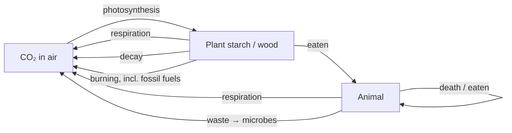
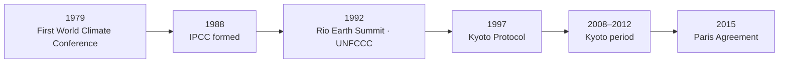

# 11. Climate and Weather

> **Teaching rewrite** of climate science, climate policy, emissions trading (with a focus on the EU ETS), emission derivatives, and weather derivatives. Original wording; worked numbers recomputed. Prices are teaching values. Not investment advice.

## Introduction

Two very different markets share this lesson:

- **Emissions** — a commodity created by regulation: the *right to emit* a tonne of CO₂. Its price depends on policy, the economy, and fuel switching between coal and gas.
- **Weather** — a risk, not a commodity: a mild winter cuts heating demand; a cool summer cuts ice cream and air-conditioning sales. **Weather derivatives** pay on measured temperature, rain, or snow.

First, the definitions. **Weather** is short-term, local atmospheric conditions (minutes to days). **Climate** is long-run patterns of temperature, humidity, and rainfall over seasons to decades. **Global warming** is the long-term heating since pre-industrial times (1850–1900) caused mainly by burning fossil fuels; **climate change** is the broader term covering human and natural warming and its effects.

This lesson covers:

- Greenhouse gases, **CO₂e**, the carbon cycle, and feedback loops
- Consequences, the IPCC findings, and the sceptics’ arguments
- Policy: **IPCC → Rio → Kyoto (ETS, CDM, JI) → Paris**
- Carbon **price drivers**, the **EU ETS** design, and cap-and-trade vs carbon tax
- **Emission derivatives**: spot, futures, forwards, fair value, repos, swaps, options, trading strategies
- **Weather derivatives**: HDD/CDD indices, futures, swaps, options, and hedging examples

---

## 11.1 The science

### Greenhouse gases

Sunlight warms the surface; the surface re-radiates **infrared**, and **greenhouse gases** (about 1% of the atmosphere) trap part of it. Without them Earth would be about **30 °C colder**.

| Gas | Main sources | GWP (100-yr, AR4) |
|---|---|---|
| Water vapour (H₂O) | Most abundant; follows temperature | — |
| **Carbon dioxide (CO₂)** | Burning fossil fuels, respiration | **1** |
| **Methane (CH₄)** | Coal mining, oil and gas, landfill, livestock | **25** |
| **Nitrous oxide (N₂O)** | Fuel combustion, fertilisers | **298** |
| HFCs / PFCs | Refrigeration, air conditioning | up to 14,800 / 12,200 |
| Sulfur hexafluoride (SF₆) | Electrical and industrial uses | 22,800 |

**CO₂ equivalent (CO₂e)** = mass emitted × **Global Warming Potential**. Example: 10 t of methane = 10 × 25 = **250 t CO₂e**.

:::info Update
These are the IPCC **AR4** values, still used in older Kyoto-era accounting. The **AR5/AR6** values differ (e.g. methane ≈ 28–30, N₂O ≈ 265–273, SF₆ ≈ 23,500–25,200). Check which GWP set a scheme uses.
:::

**Emission sources (IPCC 2014)**: energy 35%, agriculture, forestry and land use 24%, industry 21%, transport 14%, buildings 6.4%.

### The carbon cycle

Every path eventually returns carbon to the air as CO₂ — hence a **cycle**, though not a single simple route. Fossil fuels release carbon locked away for millions of years.

### Feedback loops

Warming changes **cloud cover, precipitation, wind, sea level, the water cycle** (more droughts and floods), and **season length**. Some feedbacks cool (more cloud reflects sunlight); others amplify (thawing **Siberian permafrost** releases methane). Man-made **aerosols** reflect sunlight and cool temporarily, but harm air quality.

---

## 11.2 Consequences and debate

**Mars** (thin CO₂ atmosphere, little methane or water vapour) is frozen; **Venus** (about 154,000 times Earth’s CO₂) has a runaway greenhouse hot enough to melt lead. Earth sits in between. Likely effects of a stronger greenhouse:

- Warmer on average — some regions benefit, most lose
- More evaporation and rain overall, but some regions wetter and others drier
- Rising seas: melting ice plus **thermal expansion** of warmer water
- Some crops grow faster with more CO₂, but the best growing areas shift

**IPCC Fifth Assessment Report (2014)**: human influence is clear; emissions are the highest in history; continued emissions risk severe, pervasive, irreversible impacts; **mitigation and adaptation** are complementary; no single option is enough.

:::info Update
The **Sixth Assessment Report** (2021–2023) went further: it is “unequivocal” that human influence has warmed the climate, and warming had reached about **1.1 °C** above pre-industrial levels.
:::

### The sceptics’ arguments, briefly

- Solar activity, not GHGs, drives climate (NASA disputes this)
- Consensus isn’t proof; funding and attention favour the majority view
- Past warming (1918–1940), cooling (1940s–70s — attributed by others to industrial sulfur aerosols), and a 1998–2005 plateau
- Vague language (“might”, “could”), model disagreement, selective time frames, little Southern Hemisphere data
- A 2005 UK House of Lords report questioned the objectivity of the IPCC process and the effectiveness of Kyoto-style targets

For markets, what matters is that **policy** — not the debate — sets the supply of allowances.

---

### Checkpoint 1: science

<MultipleChoice
  id="comm-ch11-mid1"
  title="Checkpoint — sections 11.1 and 11.2"
  questions={[
    {
      prompt: 'Weather vs climate — which statement is right?',
      choices: [
        'They are the same thing',
        'Weather is short-term local conditions; climate is long-run patterns over seasons to decades',
        'Climate changes hourly',
        'Weather only refers to temperature',
      ],
      answer: 1,
      why: 'A cold week says little about climate.',
    },
    {
      prompt: '5 t of nitrous oxide (GWP 298) equals how much CO₂e?',
      choices: ['5 t', '298 t', '1,490 t', '303 t'],
      answer: 2,
      why: '5 × 298.',
    },
    {
      prompt: 'Which is an amplifying (positive) feedback?',
      choices: ['More low cloud reflecting sunlight', 'Thawing permafrost releasing methane', 'Aerosols reflecting sunlight', 'Planting forests'],
      answer: 1,
      why: 'More GHG → more warming → more thaw.',
    },
    {
      prompt: 'Which sector was the largest emitter in the IPCC 2014 breakdown?',
      choices: ['Transport', 'Buildings', 'Energy', 'Industry'],
      answer: 2,
      why: '35%.',
    },
    {
      type: 'order',
      prompt: 'Rank by global warming potential (LOWEST first).',
      items: ['Carbon dioxide', 'Methane', 'Nitrous oxide', 'Sulfur hexafluoride'],
      why: '1 → 25 → 298 → 22,800 (AR4).',
    },
  ]}
/>

---

## 11.3 Policy history

- **IPCC** (WMO + UN Environment) reviews research; reports in 1990, 1995, 2001, 2007, 2014 (and 2021–23).
- **UNFCCC** (Rio 1992) named **Annex I** parties: the 1992 OECD members plus “economies in transition” (e.g. Russia).

### Kyoto Protocol

Legally binding targets for Annex I countries, from **−8% to +10%** of 1990 levels, aiming for an overall **−5%** in 2008–2012. One **AAU** (assigned amount unit) = 1 t CO₂e. A facility that emitted 100 t in 1990 might get **92 AAUs** a year — it must cut, or buy the difference.

| Mechanism | Type | How it works | Credit |
|---|---|---|---|
| **Emissions trading (ETS)** | Market | Buy/sell rights to emit; **cap and trade** | AAU / EUA |
| **Clean Development Mechanism (CDM)** | Project | Annex I invests in a **developing** country’s project; UN certifies reductions below the no-project baseline | **CER** |
| **Joint Implementation (JI)** | Project | Annex I invests in **another Annex I** country; allowances transfer, no net global change | **ERU** |

CDM projects: energy efficiency, methane capture, coal-to-gas switching, destroying industrial gases — 7,803 projects in 140 countries by 2018.

### Paris Agreement (COP21, 2015)

- Keep warming **well below 2 °C**, pursuing **1.5 °C**
- Peak emissions as soon as possible, then reach climate neutrality
- Every party sets a **nationally determined contribution (NDC)**
- Protect sinks; developed countries support developing ones with finance and technology
- **Global stocktake** in 2023 and every five years
- A new mechanism replaces CDM and JI

For 1.5 °C, CO₂ must fall about **45% by 2030** versus 2010 and reach **net zero around 2050**.

:::info Update
The first global stocktake concluded at **COP28 (Dubai, 2023)**, calling for “transitioning away from fossil fuels”. The Paris replacement for CDM/JI is the **Article 6** framework: 6.2 (country-to-country transfers) and 6.4 (the Paris Agreement Crediting Mechanism), with rules finalised at COP29 (2024).
:::

---

## 11.4 Carbon price drivers

### A different supply curve

In a normal market, supply rises with price. In a cap-and-trade scheme, supply is **fixed by regulators** each year (plus any eligible offsets), so the curve is **vertical**: price is set by where demand meets the cap.

| Feature | Effect |
|---|---|
| Fixed supply | Demand shocks move price, not volume |
| **Penalty** (e.g. EUR 100/t) | Discourages non-compliance |
| **Banking** | Allowances keep value into later periods → demand flattens at high prices rather than vanishing |

:::caution Correction
The source suggests the fine sets a ceiling — “no one would pay 110 if the fine is 100”. In the **EU ETS**, paying the penalty does **not** release you from the obligation: missing allowances must **still be surrendered** the following year. The fine is therefore **added** to the allowance cost, not a substitute for it, and is not a price cap. (A pure “pay the fine and walk away” scheme would be capped.)
:::

| Driver | Effect on allowance price |
|---|---|
| **Economic growth** | More output → more emissions → higher |
| **Allowance supply** | Over-allocation → collapse (phase 1, post-2008); political decisions matter |
| **Abatement cost** | Firms abate if cheaper than buying; abatement cost anchors the price |
| **Weather and fuel prices** | Dear gas or cold weather → switch to coal → more allowances needed → higher |
| **Penalties** | Strength of enforcement |
| **Low-carbon generation** | More nuclear and renewables → lower; expensive transition → higher |
| **Regulation** | Allocation rules, offsets, banking, compliance strength |

**Correlations** (intuitive): carbon is **positively** correlated with **gas** and **power** prices, and **negatively** with **coal** (dear coal → switch to gas → less carbon demand).

### Worked example: fuel-switching price

Gas at EUR 25/MWh (thermal) in a 50%-efficient plant → 50/MWh of power; coal at 10 in a 36% plant → 27.78. Emission factors: coal **0.90**, gas **0.37** t CO₂/MWh.

Coal and gas cost the same when:

Carbon price = (50 − 27.78) ÷ (0.90 − 0.37) = 22.22 ÷ 0.53 ≈ **EUR 41.93/t**

Above this, gas is cheaper → less coal burn → less carbon demand. This links carbon to the **clean spark and clean dark spreads** from lesson 8.

### Reading forward curves (Barclays, 2007)

The author’s argument: **contango** signals that long-term demand will exceed supply; **backwardation** signals short-term tightness but a long-term surplus. In 2007, the dirtiest fuels (coal, crude) were in contango and the cleaner one (gas) backwardated. The conclusion was that markets didn’t believe policy would shift demand away from dirty fuels. (Curve shape also reflects storage and financing costs, so treat this as one lens among several.)

<GuidedChoiceExplanation preset="comm-carbon-drivers" />

---

### Checkpoint 2: policy and drivers

<MultipleChoice
  id="comm-ch11-mid2"
  title="Checkpoint — sections 11.3 and 11.4"
  questions={[
    {
      prompt: 'Which Kyoto mechanism produces CERs?',
      choices: ['Emissions trading', 'Clean Development Mechanism', 'Joint Implementation', 'Paris NDCs'],
      answer: 1,
      why: 'CDM projects in developing countries.',
    },
    {
      prompt: 'Why does JI not reduce global emissions in accounting terms?',
      choices: [
        'It is illegal',
        'Allowances move between two capped Annex I countries — a transfer, not new credits',
        'It only applies to methane',
        'It has no projects',
      ],
      answer: 1,
      why: 'ERUs are converted from the host’s allowances.',
    },
    {
      prompt: 'Gas prices surge in a cold winter. Likely effect on EUA prices?',
      choices: ['Fall', 'Rise — coal burn and allowance demand increase', 'No effect', 'EUAs are cancelled'],
      answer: 1,
      why: 'Fuel switching toward coal.',
    },
    {
      prompt: 'Gas plant costs 48/MWh, coal 30/MWh, emission factors 0.37 and 0.91. Fuel-switch carbon price?',
      choices: ['About 33.33', 'About 18.00', 'About 52.75', 'About 0.54'],
      answer: 0,
      why: '18 / 0.54.',
    },
    {
      type: 'order',
      prompt: 'Rank the policy milestones in time order.',
      items: ['IPCC formed', 'Rio Earth Summit (UNFCCC)', 'Kyoto Protocol signed', 'Paris Agreement'],
      why: '1988 → 1992 → 1997 → 2015.',
    },
  ]}
/>

---

## 11.5 The EU Emissions Trading System

> “The commodity being bought and sold does not exist: it is the certified absence of carbon emissions.” — paraphrasing *The Economist*, 2006

| Phase | Years | Notes |
|---|---|---|
| 1 | 2005–2007 | Trial; national caps from estimates → over-allocated, price collapsed |
| 2 | 2008–2012 | Kyoto period; ~90% free allocation; aviation from 2012 |
| 3 | 2013–2020 | Single EU-wide cap; auctioning the default for power |
| 4 | 2021–2030 | Faster cap decline; Market Stability Reserve strengthened |

### Worked example: why trading lowers cost

Companies A and B each emit 100,000 t and receive 95,000 allowances → each is **5,000 t short**. Allowances cost **EUR 10**; fine EUR 100.

| | Abatement cost | Choice | Cost with trading | Cost without trading |
|---|---|---|---|---|
| **A** | EUR 5/t | Cuts **10,000 t** (50,000) and sells 5,000 spare (+50,000) | **0** | 5,000 × 5 = 25,000 |
| **B** | EUR 15/t | Buys 5,000 allowances | **50,000** | 5,000 × 15 = 75,000 |

Total cost falls from **100,000 to 50,000**, and the cheapest cuts happen first.

### System design

| Question | EU ETS answer |
|---|---|
| Which gases? | CO₂, N₂O, PFCs |
| Who? | Power, refineries, iron and steel, aluminium, cement, glass, ceramics, pulp and paper, acids, bulk chemicals; aviation from 2012 |
| Evidence? | **EUA** = 1 t CO₂e; aviation gets **EUAAs** (airlines can use EUAs, but others can’t use EUAAs) |
| Distribution? | Phase 1 almost all free → growing **auctions** on EEX and ICE (weekly); free allocation by end-February |
| Ownership? | **Union Registry** accounts; transfers checked by the **EU Transaction Log (EUTL)** |
| Cap? | EU-wide since phase 2; −2.2% a year from 2021 |
| Compliance? | Verify emissions by **31 March**, surrender by **30 April**; shortfall fine EUR 100/t **plus** make-good |
| Unused allowances? | **Banking** allowed indefinitely; early free allocation allowed de facto **borrowing** from the current year |
| Linking? | Limited CDM/JI credits allowed in earlier phases; none in phase 4 |

**Primary market** = auctions; **secondary market** = trading among participants. A **New Entrants Reserve** funds low-carbon projects.

### Fixing the surplus

After 2008, falling output left a **2.1 billion** surplus by 2013 and very low prices. Fixes:

1. **Back-loading**: delay auctioning 900 million allowances to 2019/20 (timing only).
2. **Market Stability Reserve (MSR)**: if allowances in circulation exceed **833 million**, a share is withheld from auctions; below **400 million**, 100 million are released.

**MSR example** (12% intake rate, as in the source): 1,400 million in circulation → withhold 0.12 × 1,400 = **168 million**.

:::info Update
- The MSR intake rate was doubled to **24%** from 2019 and kept there to 2030; since 2023, allowances held in the MSR above 400 million are **cancelled**.
- The 2023 reform raised the cap’s annual decline to **4.3% (2024–27)** and **4.4% (2028–30)**, targeting −62% versus 2005 by 2030.
- Maritime shipping joined in 2024; a separate **ETS2** for buildings and road fuel starts later in the decade.
- The **Carbon Border Adjustment Mechanism (CBAM)** prices the carbon in imports of steel, cement, aluminium, fertiliser, power, and hydrogen.
- The surrender deadline moved to **30 September** from the 2024 compliance cycle, and the EUR 100 penalty is inflation-indexed.
- EUA prices went from about EUR 5 (2013–17) to about **EUR 100** (early 2023).
:::

### Cap and trade vs carbon tax

| | Cap and trade | Carbon tax |
|---|---|---|
| Certainty of | **Quantity** of emissions | **Price** of emissions |
| Price volatility | High if the cap is misjudged | None |
| Recession | Prices fall (less output) unless the cap adjusts | Unchanged |
| Free allocation | Windfall gains possible | n/a |
| Innovation | A breakthrough lowers permit prices, cutting the innovator’s return | Clear floor, stable return |

---

### Checkpoint 3: EU ETS

<MultipleChoice
  id="comm-ch11-mid3"
  title="Checkpoint — section 11.5"
  questions={[
    {
      prompt: 'Allowances trade at 30. A firm can abate at 22/t. What should it do?',
      choices: ['Buy allowances', 'Abate, and sell any spare allowances', 'Pay the fine', 'Nothing'],
      answer: 1,
      why: 'Abate when cheaper than the market price.',
    },
    {
      prompt: 'A firm emits 120,000 t, holds 100,000 EUAs, and buys none. What happens?',
      choices: [
        'Fine of 20,000 × EUR 100 and it must still surrender 20,000 allowances later',
        'Only the fine',
        'Nothing',
        'Its cap rises',
      ],
      answer: 0,
      why: 'The penalty does not remove the obligation.',
    },
    {
      prompt: 'Who can use EUAAs for compliance?',
      choices: ['Any installation', 'Only aircraft operators', 'Only power stations', 'Nobody'],
      answer: 1,
      why: 'Airlines may use EUAs too, but not vice versa.',
    },
    {
      prompt: 'What does the Market Stability Reserve do when allowances in circulation exceed 833 million?',
      choices: ['Releases 100 million', 'Withholds a share of auction volume', 'Raises the fine', 'Closes the market'],
      answer: 1,
      why: 'It soaks up surplus.',
    },
    {
      type: 'order',
      prompt: 'Rank the annual EU ETS compliance cycle (original deadlines).',
      items: ['Emit and monitor during the calendar year', 'Free allocation for the new year (end-February)', 'Independent verification (31 March)', 'Surrender allowances (30 April)'],
      why: 'Allowances surrendered are cancelled.',
    },
  ]}
/>

---

## 11.6 Emission derivatives

**World Bank (2019)**: 57 carbon pricing initiatives covering 11 Gt CO₂e (~20% of emissions); prices from USD 1 to 127/t, with 51% of covered emissions below USD 10; revenue about USD 44 billion.

:::info Update
By 2024–25 around **75–80** carbon taxes and ETSs covered roughly a quarter of global emissions, and revenue exceeded **USD 100 billion** a year. China’s national ETS (launched 2021) is the largest by emissions covered.
:::

A buyer can **buy spot and hold**, **buy forward**, or use **options**.

### Spot and futures

- **Spot**: delivery T+1, OTC or on ICE/EEX; lots of 10,000 to 100,000 EUAs.
- **ICE EUA futures**: 1 lot = **1,000 EUAs**, priced in EUR; monthly, quarterly, and annual (December is the benchmark); expire on the last Monday of the month (earlier in December for holidays); **physical delivery** via the Union Registry.

### OTC forwards

- Fixed-price, physically settled forward
- Forward where the **seller may deliver early** (and receives a discounted amount)
- **Floating-price forward**: date fixed, price later set from an average (e.g. of futures)
- Floating forward where the buyer **chooses the volume** before pricing

### Fair value

EUAs are fully **fungible** and can be banked, so cost of carry applies: forward = spot × (1 + r × days/360).

**March 2020**: spot **18.40**, 12-month rate **−0.25%**:

- Fair forward = 18.40 × (1 − 0.0025 × 365/360) ≈ 18.40 − 0.05 = **18.35**
- Market forward = **18.15** — about 0.20 below fair value

A firm holding free allowances it doesn’t need for a year can **sell spot at 18.40 and buy forward at 18.15**. That is like borrowing at:

(18.15 ÷ 18.40 − 1) × 360/365 ≈ **−1.34%** — being paid to borrow.

### Repo / inventory monetisation

Sell EUAs spot and **buy them back forward** in one package — effectively a secured loan.

**Example**: 1 million EUAs; 12-month forward **EUR 15.00** → repay **15,000,000**. The bank charges Euribor **5.00% + 0.50%**:

Proceeds = 15,000,000 ÷ (1 + 0.055 × 365/360) ≈ **EUR 14,207,722**

The corporate borrows at Euribor + 0.50% — attractive if it usually pays more. The bank uses the **forward** (often more liquid than spot) to set value, and profits if it funds itself below Euribor + 0.50%.

:::caution Note on the source
The source prints 14,207,772; the correct figure is **14,207,722**.
:::

### Swaps

Cash-settled, fixed vs floating, **priced on a single day** (like a one-day contract for difference). Example: Company A pays fixed **EUR 14.00** on **25,000** allowances vs an index on the pricing date. Index at **16.00** → A receives (16 − 14) × 25,000 = **EUR 50,000**. Useful for price protection without delivery, or for taking a view.

### Options

A 9-month European **call on the December ICE EUA future**: 30,000 allowances, strike **EUR 20** (at-the-money forward), premium **EUR 2.39** (35% vol) → total **EUR 71,700**.

- Cash-settled payoff = max(F − K, 0) × quantity; physically settled → allowances delivered to the registry.
- At expiry F = **23.50** → payoff 3.50 × 30,000 = **105,000**; net of premium **33,300**.
- EUA implied vols have exceeded **60%** at times.

### View-driven strategies

| Strategy | Trade |
|---|---|
| **Cash-and-carry** | Forward rich vs fair value → buy spot, finance, sell forward |
| **Calendar spread** | Buy near / sell far (or the reverse) on curve shape |
| **Geographic** | Same contract priced differently on ICE vs EEX |
| **EUA / EUAA spread** | EUAAs normally trade at a discount; if the discount looks too wide → buy EUAA, sell EUA |
| **Volatility** | Straddles, strangles (lesson 3) |

<GuidedChoiceExplanation preset="comm-carbon-trade" />

---

### Checkpoint 4: emission derivatives

<MultipleChoice
  id="comm-ch11-mid4"
  title="Checkpoint — section 11.6"
  questions={[
    {
      prompt: 'Spot EUA 80, 1-year rate 3% (act/360, 365 days). Fair forward?',
      choices: ['80.00', 'About 82.43', 'About 77.60', '83.00'],
      answer: 1,
      why: '80 × (1 + 0.03 × 365/360) ≈ 82.43.',
    },
    {
      prompt: 'Forward trades well above fair value. Arbitrage?',
      choices: ['Sell spot, buy forward', 'Buy spot, finance it, sell forward', 'Buy both', 'Do nothing'],
      answer: 1,
      why: 'Lock in the rich forward against the cheaper carry.',
    },
    {
      prompt: 'Repo: repay 10,000,000 in 1 year; rate 4% (365/360). Proceeds today (nearest thousand)?',
      choices: ['9,600,000', '9,610,000', '10,400,000', '9,615,000'],
      answer: 1,
      why: '10,000,000 / 1.040556 ≈ 9,610,250.',
    },
    {
      prompt: 'Fixed payer at 14 on 25,000; index 12.50 on the pricing date. Cash flow to the fixed payer?',
      choices: ['+37,500', '−37,500', '−350,000', '0'],
      answer: 1,
      why: '(12.50 − 14) × 25,000.',
    },
    {
      type: 'order',
      prompt: 'Rank the steps of an EUA repo.',
      items: ['Price the forward buy-back', 'Discount it at the bank’s rate to get proceeds', 'Corporate sells EUAs spot and receives proceeds', 'Corporate buys EUAs back at maturity and repays'],
      why: 'Two linked trades, executed together.',
    },
  ]}
/>

---

## 11.7 Weather derivatives

> “You can’t make people think it’s going to be 110 degrees in London next week.” — a weather trader (*FT*, 2007): weather can’t be manipulated, and it is largely **uncorrelated** with other assets.

**Weather risk** = the effect of weather on cash flow. The first deal (**Enron–Koch, 1997**) paid USD 10,000 per degree away from a set level.

| | Insurance | Weather derivative |
|---|---|---|
| Covers | Rare, catastrophic events (hurricanes) | Frequent, moderate events (mild winter, wet summer) |
| Payout | Must prove a loss | Paid on an independent measured index |

**Users**: agriculture, aviation, construction, energy, film production, retail, tourism, wholesale.

**Contract ingredients**: an index (average temperature, HDD, CDD, rain, snow, wind chill), a period, a **weather station** (e.g. Heathrow), a **tick value** per index point, and a strike (often from history).

### HDD and CDD

Base **65 °F** (18 °C outside the US). Daily average temperature *T*:

- **HDD** = max(0, 65 − T) — rises when it’s **cold** (heating needed)
- **CDD** = max(0, T − 65) — rises when it’s **hot** (cooling needed)
- Monthly index = **sum** of the daily values; **CAT** = sum of daily average temperatures

**Example**: a week at 60, 55, 58, 61, 59, 56, 62 °F → HDD = 5 + 10 + 7 + 4 + 6 + 9 + 3 = **44**; CDD = 0.

### CME futures

| Term | Value |
|---|---|
| Contract | Monthly CDD (or HDD), e.g. **Dallas** |
| Size | **USD 20 × index** |
| Tick | 1 point |
| Settlement | Cash |

August Dallas CDD quoted at **691** → contract value 691 × 20 = **USD 13,820**. A 100 °F day adds 35 points; a 60 °F day adds 0. Months-ahead pricing relies on models such as GFS (US) and ECMWF (Europe) plus climatology.

### OTC features

Wider underlyings (rain, snow, wind, sunshine); can reduce **basis risk** between station and site; monthly, seasonal, or annual periods (HDD season Oct–Apr, CDD May–Sep); data must be **cleaned**; tick values negotiated (e.g. 1,000, 500, 200); payouts usually **capped**, as temperature has no natural limit.

### Swap

Dallas August CDD, **fixed 691**, **USD 500/point**. Realised CDD = **700** → the floating payer pays (700 − 691) × 500 = **USD 4,500**.

:::caution Note on the source
The source says the floating leg is the “average” of daily CDDs. A monthly CDD index is the **sum** of daily values (which is why it reaches ~700); an average would be about 22.
:::

### Options

- **Call** payoff = tick × max(index − K, 0); **put** = tick × max(K − index, 0)
- **Binary** options pay a fixed amount if in the money

### Application: cattle farmer

Losses from **hot springs** (slow growth) and **cold autumns** (young stock suffer):

- Buy a **CDD call** for spring
- Buy an **HDD call** for autumn — HDD *rises* as it gets colder, so a call (not a put) protects against cold

Using the 44-HDD week with strike 0 and USD 200/point → payout **USD 8,800**. A 91-day autumn with losses below 40 °F → HDD strike = (65 − 40) × 91 = **2,275**.

### Application: power utility

A Midwest utility loses **USD 50,000 per °F** that the summer average falls below normal (less air conditioning).

| Structure | Effect |
|---|---|
| **Buy a put** on average temperature | Paid when it’s cool; OTM strike lowers the premium |
| **Zero-cost collar** | Buy OTM put + sell OTM call: protection funded by giving up gains when hot |
| **Swap** | Locks in the temperature exposure both ways |

Payouts are usually capped (e.g. USD 300,000). **Example**: put strike 75 °F, realised 72 °F, USD 50,000/°F → 3 × 50,000 = **USD 150,000** (under the cap).

<GuidedChoiceExplanation preset="comm-weather-hedge" />

---

### Rank: climate and weather practice

<MultipleChoice
  id="comm-ch11-rank"
  title="Climate and weather practice"
  questions={[
    {
      type: 'order',
      prompt: 'Rank EU ETS phases in order.',
      items: ['Trial with estimated national caps', 'Kyoto period, aviation joins', 'Single EU-wide cap, auction-led', 'Faster cap decline to 2030'],
      why: 'Phases 1 → 4.',
    },
    {
      type: 'order',
      prompt: 'Rank days by HDD contribution (LARGEST first).',
      items: ['40 °F', '50 °F', '60 °F', '70 °F'],
      why: '25, 15, 5, 0.',
    },
    {
      type: 'order',
      prompt: 'Put the chain of effects in order when gas prices rise.',
      items: ['Gas gets dearer', 'Generators switch to coal', 'Emissions per MWh rise', 'Allowance demand and price rise', 'Power prices rise'],
      why: 'Why carbon correlates positively with gas.',
    },
  ]}
/>

---

### Check: climate and weather

<MultipleChoice
  id="comm-ch11"
  title="Climate and weather"
  questions={[
    {
      prompt: 'One EUA gives the right to emit…',
      choices: ['1 kg CO₂', '1 t CO₂e', '1 MWh', '1,000 t CO₂'],
      answer: 1,
      why: 'One tonne of CO₂ equivalent.',
    },
    {
      prompt: 'In cap and trade, which is fixed by the regulator?',
      choices: ['The price', 'The total quantity of allowances', 'Each firm’s output', 'The fuel mix'],
      answer: 1,
      why: 'A tax fixes the price instead.',
    },
    {
      prompt: 'Carbon prices tend to correlate negatively with…',
      choices: ['Gas prices', 'Power prices', 'Coal prices', 'Economic growth'],
      answer: 2,
      why: 'Dear coal → switch to gas → fewer allowances needed.',
    },
    {
      prompt: 'An ice-cream maker fears a cool summer. Hedge?',
      choices: ['Buy a CDD call', 'Buy a CDD put', 'Buy an HDD put', 'Sell a CDD put'],
      answer: 1,
      why: 'A cool summer → low CDD → the put pays.',
    },
    {
      prompt: 'A heating-oil distributor fears a mild winter. Hedge?',
      choices: ['Buy an HDD put', 'Buy an HDD call', 'Buy a CDD call', 'Sell an HDD put'],
      answer: 0,
      why: 'Mild winter → low HDD → the put pays.',
    },
    {
      prompt: 'Key difference between weather derivatives and insurance?',
      choices: [
        'Derivatives require proof of loss',
        'Derivatives pay on an independently measured index, no proof of loss needed',
        'Insurance covers mild winters',
        'There is no difference',
      ],
      answer: 1,
      why: 'Index-based settlement.',
    },
  ]}
/>

---

## Calculate: numeric practice

Type the number (no units; minus sign for payments).

### Formula sheet

| Item | Formula |
|---|---|
| CO₂e | mass × GWP |
| Fuel-switch carbon price | (gas cost/MWh − coal cost/MWh) ÷ (EF_coal − EF_gas) |
| Fuel cost per MWh | fuel price ÷ efficiency |
| Compliance cost | min(abatement cost, allowance price) × shortfall |
| MSR intake | rate × allowances in circulation (if above 833 m) |
| Forward fair value | spot × (1 + r × days/360) |
| Implied rate | (F/S − 1) × 360/days |
| Repo proceeds | forward amount ÷ (1 + r × days/360) |
| Swap (fixed payer) | (index − fixed) × quantity |
| Call | max(F − K, 0) × quantity |
| HDD / CDD | Σ max(0, 65 − T) / Σ max(0, T − 65) |
| Weather payoff | tick × index difference |

<NumericQuiz
  id="comm-ch11-calc"
  title="Calculate: climate and weather"
  decimals={2}
  questions={[
    {
      prompt: '10 t of methane (GWP 25). CO₂e in tonnes?',
      answer: 250,
      why: '10 × 25.',
      decimals: 0,
    },
    {
      prompt: '2 t of SF₆ (GWP 22,800). CO₂e in tonnes?',
      answer: 45600,
      why: '2 × 22,800.',
      decimals: 0,
    },
    {
      prompt: 'Company A abates 10,000 t at EUR 5 and sells 5,000 spare EUAs at 10. Net cost?',
      answer: 0,
      why: '50,000 − 50,000.',
      decimals: 0,
    },
    {
      prompt: 'Company B, 5,000 t short, abatement EUR 15/t, EUAs at 10. Cheapest compliance cost?',
      answer: 50000,
      why: 'Buy at 10: 5,000 × 10.',
      decimals: 0,
    },
    {
      prompt: 'Gas plant: gas 25, efficiency 50%. Coal plant: coal 10, efficiency 36%. EF coal 0.90, gas 0.37. Fuel-switch carbon price (2 dp)?',
      answer: 41.93,
      why: '(50 − 27.78) / 0.53.',
    },
    {
      prompt: 'MSR intake 12% on 1,400 million allowances in circulation. Withheld (millions)?',
      answer: 168,
      why: '0.12 × 1,400.',
      decimals: 0,
    },
    {
      prompt: 'Spot EUA 18.40, rate −0.25%, 365 days (act/360). Fair forward (2 dp)?',
      answer: 18.35,
      why: '18.40 × (1 − 0.0025 × 365/360) = 18.353.',
    },
    {
      prompt: 'Sell spot at 18.40, buy forward at 18.15, 365 days (act/360). Implied rate in % (2 dp)?',
      answer: -1.34,
      why: '(18.15/18.40 − 1) × 360/365 ≈ −1.34%.',
    },
    {
      prompt: 'Repo: repay EUR 15,000,000 in 365 days at 5.50% (act/360). Proceeds (nearest euro)?',
      answer: 14207722,
      why: '15,000,000 / (1 + 0.055 × 365/360).',
      decimals: 0,
    },
    {
      prompt: 'Swap: pay fixed 14.00 on 25,000 EUAs; index 16.00. Cash flow to the fixed payer?',
      answer: 50000,
      why: '2 × 25,000.',
      decimals: 0,
    },
    {
      prompt: 'EUA call: 30,000 allowances, premium 2.39. Total premium?',
      answer: 71700,
      why: '30,000 × 2.39.',
      decimals: 0,
    },
    {
      prompt: 'Same call, strike 20, futures 23.50 at expiry. Profit after premium?',
      answer: 33300,
      why: '3.50 × 30,000 − 71,700.',
      decimals: 0,
    },
    {
      prompt: 'Week at 60, 55, 58, 61, 59, 56, 62 °F. HDD total?',
      answer: 44,
      why: '5 + 10 + 7 + 4 + 6 + 9 + 3.',
      decimals: 0,
    },
    {
      prompt: 'CME CDD future at 691, USD 20 per point. Contract value?',
      answer: 13820,
      why: '691 × 20.',
      decimals: 0,
    },
    {
      prompt: 'CDD swap fixed 691, realised 700, USD 500/point. Amount paid by the floating payer?',
      answer: 4500,
      why: '9 × 500.',
      decimals: 0,
    },
    {
      prompt: 'Autumn of 91 days; losses below 40 °F. HDD strike?',
      answer: 2275,
      why: '(65 − 40) × 91.',
      decimals: 0,
    },
    {
      prompt: 'Utility put on average temperature: strike 75 °F, realised 72 °F, USD 50,000/°F, cap 300,000. Payout?',
      answer: 150000,
      why: '3 × 50,000 (below the cap).',
      decimals: 0,
    },
  ]}
/>

### Randomized practice

<NumericQuiz id="comm-ch11-calc-random" title="Practice: carbon and weather drills" bank="commClimate" rounds={6} />

---

## Takeaways

:::tip Remember
- **Weather** = short-term local; **climate** = long-run patterns; CO₂e = mass × GWP
- Policy path: IPCC → UNFCCC → **Kyoto** (ETS, CDM/CERs, JI/ERUs) → **Paris** (NDCs, Article 6)
- Cap and trade fixes **quantity**; a tax fixes **price**; firms abate when abatement is cheaper than allowances
- Carbon rises with gas and power prices, falls with coal prices; fuel-switch price = cost gap ÷ emission-factor gap
- EU ETS: EUAs/EUAAs, auctions plus free allocation, registry/EUTL, banking, MSR, fine **plus** make-good
- Derivatives: spot, futures (1,000 EUAs, physical), forwards, cost-of-carry fair value, repos, one-day swaps, options
- Weather: **HDD** = cold, **CDD** = heat; tick × index; calls/puts/swaps/collars; settled on measured data, not proof of loss
:::

## Further Reading

- Next: [12. Agriculture](./agriculture)
- [10. Bulk commodities](./bulk-commodities)
- [8. Electricity](./electricity) — clean spark and dark spreads, HDD/CDD
- [2. Derivative valuation](./derivative-valuation) — cost of carry
- [3. Risk management principles](./risk-management-principles) — volatility strategies
- IPCC Assessment Reports; European Commission EU ETS pages; World Bank *State and Trends of Carbon Pricing*; CME weather contract specifications
- Background: N. Schofield, *Commodity Derivatives: Markets and Applications* (Wiley) — used as a study outline
