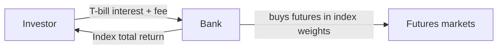

# 14. Commodity Investing

> **Teaching rewrite** of commodities as an investment: who invests and why, commodity indices and the roll-yield debate, total return swaps, exchange traded products (ETCs, ETFs, ETNs), and structured notes. Original wording; worked numbers recomputed. Not investment advice.

## Introduction

Earlier lessons looked at commodities through the eyes of **producers and consumers** hedging real exposures. Here the user is an **investor** who has no physical exposure but wants commodity **returns** — for diversification, inflation protection, or a view.

Because few investors want to store crude or cattle, almost all commodity investing runs through **futures**, **swaps**, and **securities wrapped around them**. That creates a subtle difference between the **spot price** you see quoted and the **return you actually earn**.

This lesson covers:

- **Who invests** and over what horizon; the main **instruments**
- **Why** invest: diversification, inflation, USD, risk premia
- **Commodity indices** (S&P GSCI): construction, spot vs excess vs total return
- The **roll-yield** myth, worked through in numbers
- **Total return swaps**, **ETCs / ETFs / ETNs**
- **Structured products**: capital-protected, basket, income, reverse convertible, autocallable, outperformance, worst-of

---

## 14.1 Investors and instruments

| Investor | Traits | Typical horizon |
|---|---|---|
| **Hedge funds, bank desks** | “Leveraged” accounts; tactical, relative value | Under 1 year |
| **Commodity trading advisors (CTAs)** | Futures-based, often trend-following, multi-asset | Short–medium |
| **Private bank / retail** | Mutual funds, ETPs, structured notes | 1–5 years |
| **Asset managers** | Funds, index tracking | 1–5 years |
| **Real money** (pensions, insurers) | Can’t borrow; buy and hold | 5+ years |
| **Sovereign wealth funds** | Strategic diversification | 5+ years |

**By horizon**:

- **Under 1 year**: tactical trades (e.g. mean reversion), relative value (platinum vs palladium, gold vs silver, or looser pairs like crude vs gold), index tracking. Blow-ups happen — e.g. Amaranth (lesson 3).
- **1–5 years**: diversification, growth, harvesting volatility with options, **ETPs**, **structured notes**.
- **5+ years**: strategic allocation to a broad **index**.

| Instrument | What it is |
|---|---|
| **Total return swap (TRS)** | OTC swap: receive an index’s total return, pay a money-market rate plus a fee |
| **Exchange traded product (ETP)** | Listed security on one commodity or an index: **ETC** (physically backed), **ETF** (derivatives-based, bankruptcy-remote), **ETN** (unsecured bank debt) |
| **Medium term note (MTN) / structured product** | Bank-issued note with embedded derivatives, mainly for retail and private banks |

**Market size** (Barclays): commodity assets under management grew from ~USD 15 bn (2001) to a peak of ~**USD 418 bn** (2012), then ~USD 311 bn (2017). TRS and ETPs dominate; structured notes are small. **Precious metals** are the most popular sector, then energy, agriculture, base metals.

---

## 14.2 Why invest in commodities?

### Return and diversification

The IMF all-commodity index (Jan 1992 = 100) peaked above **400** in July 2008 — versus 309 for the S&P 500 on the same base — then **halved** by January 2009. Since then: 388 (2011), 174 (2016), 265 (2018), 168 (April 2020). High return, high volatility.

**Two-asset portfolio volatility**:

σ_p = √( w₁²σ₁² + w₂²σ₂² + 2 w₁ w₂ ρ σ₁ σ₂ )

Unless ρ = +1, portfolio volatility is **below** the weighted average of the parts.

| Period | Correlation with equities | Bonds | T-bills |
|---|---|---|---|
| 1970–2005 | **−0.28** | −0.10 | −0.01 |
| 2006–2016 | **+0.40** | +0.28 | +0.10 |

### Worked example: diversification benefit

80% equities (vol 16%) + 20% commodities (vol 25%):

- ρ = −0.28 → σ_p = √(0.8²·0.16² + 0.2²·0.25² + 2·0.8·0.2·(−0.28)·0.16·0.25) ≈ **12.4%**
- ρ = +0.40 → σ_p ≈ **15.5%**
- All equities → **16.0%**

The benefit shrank as correlation turned positive.

**Why correlations shift** (Morgan Stanley, 2009): near **full capacity** (late cycle), scarce commodities rise while squeezed margins hurt equities → **negative** correlation. With **slack** (early cycle / recession), demand moves both together → **positive** correlation.

| | Low inflation | High inflation |
|---|---|---|
| **High growth** | Both can do well | Commodities up, equities squeezed |
| **Low growth** | Both weak | Commodities hold up better |

### Inflation hedge

Commodities correlate with realised inflation (partly because they are **in** inflation indices). Real return ≈ how much more you can consume later: a 2% coupon with 3% inflation → 1.02 ÷ 1.03 − 1 ≈ **−0.97%** in real terms.

### US dollar hedge

A weaker USD makes dollar-priced commodities cheaper abroad → more demand → higher USD prices. For a non-US investor holding USD assets, commodities can offset currency losses.

### Risk premia strategies

Systematic strategies that earn an **excess return for bearing a known risk** (Barclays, 2011):

| Strategy | Trade | Risk |
|---|---|---|
| **Curve (term premium)** | Long deferred, short nearby futures | Curve moves against you |
| **Value** | Long cheap, short dear (e.g. in steep backwardation: sell nearby, buy deferred) | Convergence takes too long |
| **Momentum** | Long recent winners, short losers | Trend reversal |
| **Arbitrage** | Positions that should converge | Model error, funding, liquidity |
| **Volatility** | Sell implied vol (usually above realised) | Vol spikes |

---

### Checkpoint 1: investors and rationale

<MultipleChoice
  id="comm-ch14-mid1"
  title="Checkpoint — sections 14.1 and 14.2"
  questions={[
    {
      prompt: 'Which product exposes the investor to the issuing bank’s credit risk?',
      choices: ['ETC', 'ETF', 'ETN', 'Futures'],
      answer: 2,
      why: 'An ETN is unsecured debt of a non-bankruptcy-remote issuer.',
    },
    {
      prompt: '50/50 portfolio, both assets 20% vol, correlation 0. Portfolio vol?',
      choices: ['20%', 'About 14.1%', '10%', '0%'],
      answer: 1,
      why: '√(0.25·0.04 + 0.25·0.04) = √0.02.',
    },
    {
      prompt: 'Commodity–equity correlation tends to be most negative when…',
      choices: ['The economy has lots of slack', 'The economy runs near full capacity', 'Rates are zero', 'Never'],
      answer: 1,
      why: 'Scarce commodities rise while margins are squeezed.',
    },
    {
      prompt: 'A bond yields 4%; inflation is 6%. Approximate real return?',
      choices: ['+2%', '−1.9%', '+10%', '0%'],
      answer: 1,
      why: '1.04 / 1.06 − 1 ≈ −1.89%.',
    },
    {
      type: 'order',
      prompt: 'Rank investors by typical horizon (SHORTEST first).',
      items: ['Hedge funds', 'Private bank / retail', 'Pension funds and insurers'],
      why: 'Under 1 year → 1–5 years → 5+ years.',
    },
  ]}
/>

---

## 14.3 Commodity indices

The **S&P GSCI** (launched 1991) was the first major investable commodity index — a **beta** index giving broad market exposure.

| Feature | S&P GSCI |
|---|---|
| Constituents | **24**: 6 energy, 5 industrial metals, 8 agriculture, 3 livestock, 2 precious metals |
| Weights | **World production value** (5-year average), reviewed annually → **energy > 60%** |
| Instruments | **Front-month futures**, not physical |
| Roll | 5th–9th business day of the month, **20% a day** |
| Sub-indices | Energy, non-energy, industrial metals, precious metals, agriculture, livestock… |

(The **Bloomberg Commodity Index**, BCOM, is the main alternative: it uses production *and* liquidity, caps sectors at about a third, and rolls on the 6th–10th business days.)

### Three versions of the index

| Version | Includes |
|---|---|
| **Spot** | Price changes of the futures held |
| **Excess return (ER)** | Spot + gains/losses from rolling (“roll yield”) — what an unfunded futures position earns |
| **Total return (TR)** | ER + interest on **fully collateralised** positions (e.g. USD 100,000 exposure: 5,000 margin, 95,000 in T-bills) |

TR ≠ ER + T-bill rate exactly, because interest is reinvested and collateral changes with the futures value.

### Index evolution

1. **Beta** — passive, long-only (S&P GSCI)
2. **Enhanced beta** — different constituents or weights, long/short, **deferred** contracts, different roll dates (pre-/post-roll), different use of cash
3. **Active alpha** — proprietary strategies: momentum, liquidity choices, volatility selling

---

## 14.4 The roll-yield myth

**Conventional view**: “roll yield” is the gain or loss **on the day you roll** — sell expiring at 100, buy next at 90 in backwardation = +10; the reverse in contango = −10.

**Revised view** (Campbell & Co., 2014): **rolling itself makes no P&L** — you sell and buy at market. Roll yield is the **net benefit or cost of owning the asset** (its carry):

- Futures return = spot return + **roll yield**
- **Roll yield = futures return − spot return**

### Worked example: gold in contango

Spot rises 5 a day from 1,000. Financing 3%, lease 1% → net carry 2% a year, so futures sit **above** spot (contango). F = S × (1 + 0.02 × days/360).

| Day | Spot | Future #1 (expires day 5) | Future #2 (34 days left on day 1) |
|---|---|---|---|
| 1 | 1,000 | **1,000.22** (buy) | 1,001.89 |
| 2 | 1,005 | 1,005.17 | 1,006.84 |
| 3 | 1,010 | 1,010.11 | 1,011.79 |
| 4 | 1,015 | **1,015.05** (sell) | **1,016.75** (buy) |
| 5 | 1,020 | 1,020 (= spot) | 1,021.70 |
| … | … | | … |
| 10 | 1,045 | | **1,046.45** (value) |

- Future #1 profit (days 1→4): 1,015.05 − 1,000.22 = **14.83**
- Future #2 profit (days 4→10): 1,046.45 − 1,016.75 = **29.70**
- **Futures return = 44.53**; spot return = **45.00**
- **Roll yield = 44.53 − 45.00 = −0.47**

The conventional “roll loss” on day 4 is 1,015.05 − 1,016.75 = **−1.70**. Subtracting that from the spot gain implies 43.30 — **wrong**; the actual futures P&L was 44.53.

**Reconciling the two**: roll yield = **basis return** + **cumulative roll adjustment**.

- Basis day 1: 1,000.22 − 1,000 = 0.22; basis day 10: 1,046.45 − 1,045 = 1.45 → basis return **1.23**
- Roll adjustment = −1.70
- 1.23 − 1.70 = **−0.47** ✓

Because the basis is **bounded** by the curve’s shape, over long periods the cumulative roll adjustment **dominates** — so the old rule of thumb survives:

- **Contango → longs underperform spot** (negative carry)
- **Backwardation → longs outperform spot** (positive carry). Swapping the rates (financing 1%, lease 3%) gives a futures return of 45.47 and roll yield **+0.47**.

:::caution Note on the source
The source quotes the futures return as both 44.53 and 44.54, the roll yield as both −0.46 and −0.47, and the second future’s roll price once as “1,106.75”. The consistent figures are **44.53**, **−0.47**, and **1,016.75**.
:::

<GuidedChoiceExplanation preset="comm-inv-roll" />

---

### Checkpoint 2: indices and roll yield

<MultipleChoice
  id="comm-ch14-mid2"
  title="Checkpoint — sections 14.3 and 14.4"
  questions={[
    {
      prompt: 'Why is the S&P GSCI dominated by energy?',
      choices: ['Committee preference', 'Weights follow world production value, which energy dominates', 'Energy is least volatile', 'By law'],
      answer: 1,
      why: 'Over 60% energy.',
    },
    {
      prompt: 'Which index version includes interest on fully collateralised positions?',
      choices: ['Spot', 'Excess return', 'Total return', 'None'],
      answer: 2,
      why: 'TR = ER plus T-bill interest (with reinvestment).',
    },
    {
      prompt: 'Spot gold rises 60; a rolled futures position earns 57. Roll yield (revised definition)?',
      choices: ['+3', '−3', '117', '0'],
      answer: 1,
      why: 'Futures return − spot return.',
    },
    {
      prompt: 'Under the revised view, what does the act of rolling itself generate?',
      choices: ['A profit in backwardation', 'A loss in contango', 'No P&L — you trade at market prices', 'A fee rebate'],
      answer: 2,
      why: 'Carry accrues while you hold the position.',
    },
    {
      prompt: 'Basis return +0.80, cumulative roll adjustment −2.30. Roll yield?',
      choices: ['−1.50', '+3.10', '−3.10', '+1.50'],
      answer: 0,
      why: '0.80 − 2.30.',
    },
  ]}
/>

---

## 14.5 Total return swaps

The investor **receives the index return** and **pays a T-bill rate plus a fee** — **unfunded** (no cash up front). Investors that can’t take unlimited leverage use a **funded** version (a note).

### Worked example: first monthly period

Notional **USD 200 m**, S&P GSCI TR from **2,922.42** to **2,955.33**, 31 days, fee 0.25% (act/365), T-bill 0.5%.

| Leg | Calculation | USD |
|---|---|---|
| Index amount | 200 m × (2,955.33 − 2,922.42) ÷ 2,922.42 | **+2,252,243** |
| Fee | 200 m × 0.25% × 31/365 | **−42,465.75** |
| T-bill leg | 200 m × [(1 − 91/360 × 0.5%)^(−31/91) − 1] | **−86,184** |
| **Net to investor** | | **2,123,593.25** |

Next period the floating leg uses an **adjusted notional** of 200 m × 2,955.33 ÷ 2,922.42 = **202,252,243**, mimicking the growth of a real holding.

:::caution Note on the source
The source’s term sheet states a notional of USD 100 million, but its worked example uses **USD 200 million**. The figures above use 200 million throughout.
:::

The bank **hedges** by buying futures in index weights; the 0.25% covers hedging costs and profit. Investor risks: index falls and **bank credit** (usually unsecured). Variants: sub-indices, zero-coupon (one payment at maturity), excess-return swaps (investor pays only the fee).

---

## 14.6 Exchange traded products

| | **ETC** | **ETF** | **ETN** |
|---|---|---|---|
| Backing | **Physical** commodity in a vault | **Derivatives** (futures/swaps) with collateral | **Unsecured issuer debt** |
| Issuer | Bankruptcy-remote SPV | Bankruptcy-remote SPV | Bank (not remote) |
| Size | Varies with creation/redemption | Varies | Fixed issue |
| Main extra risk | Fees erode entitlement | Swap counterparty, termination, leverage path-dependence | **Issuer credit** |

### ETC: Gold Bullion Securities (2004)

Jersey SPV (WisdomTree), physically backed by **allocated LBMA good-delivery gold** at HSBC London; trustee holds the gold for investors; fee **0.40%**; USD, unhedged.

An **SPV** is a “robot firm”: one purpose, fixed rules, no staff, outsourced administration, designed so it can’t practically go bankrupt.

**Creation/redemption**: **authorised participants (APs)** pay cash → the issuer buys gold → new securities to the AP, who sells them and **makes markets**. Redemption runs in reverse (even for physical gold).

**Fees are paid in gold**: each security’s **entitlement** shrinks daily.

- 1 July 2005: gold **427.30**; entitlement 99.550959% of 0.1 oz → 0.0995510 oz × 427.30 ≈ **USD 42.54**
- 4,000 securities ≈ **USD 170,160** (≈ 398 oz — about one 400 oz bar)
- Next day: 99.550959% − 0.40%/365 = **99.549863%**
- Mid-2020: entitlement 93.599%, gold 1,720.21 → **USD 161.01** per security

### ETF: 2× daily leveraged gold

References the **Bloomberg Gold Subindex TR** (futures-based), so the roll-yield issues apply. Fees 0.98% (issuer) + 1.30% (swap counterparty) + 0.05% (index).

**Structure**: investor cash → issuer → swap counterparty → **segregated collateral account** (third party) supporting a **total return swap** with **2× notional**.

**Daily valuation**: P_t = P_(t−1) × [1 + capital adjustment + leverage × index % change]

**Example**: 50.00 × [1 − 0.0001 + 2 × 0.05] = **54.995** — a 5% index rise gives ~10%. A **50% one-day** index fall wipes out the security (losses can’t exceed the investment).

**Daily reset = path dependence**: index +10% then −10% → index × 0.99; the 2× product × 1.20 × 0.80 = **0.96** — it loses more than twice the index’s 1%.

**Risks**: counterparty (mitigated by collateral); the counterparty may **terminate** if it can’t hedge — WisdomTree closed several leveraged oil ETPs in 2020 after crude briefly went negative.

### ETN: Barclays gold 3-month index note

USD 25 notes, 30-year maturity, NYSE Arca; tracks a Barclays index on gold futures **3 months out**, plus T-bill interest; **unsecured** — no principal protection; issuer call and investor put.

Value = previous value × (today’s index ÷ yesterday’s index). Index +5% then +2% → 25 × 1.05 × 1.02 = **26.775**. Market price can differ (liquidity, issuer downgrade).

<GuidedChoiceExplanation preset="comm-inv-etp" />

---

### Checkpoint 3: swaps and ETPs

<MultipleChoice
  id="comm-ch14-mid3"
  title="Checkpoint — sections 14.5 and 14.6"
  questions={[
    {
      prompt: 'TRS: notional 50 m, index 1,000 → 1,020. Index amount?',
      choices: ['1,000,000', '20,000', '1,020,000', '500,000'],
      answer: 0,
      why: '50 m × 2%.',
    },
    {
      prompt: 'How does a physically backed gold ETC collect its management fee?',
      choices: ['Monthly cash invoice', 'By shrinking each security’s gold entitlement daily', 'From the AP', 'It charges none'],
      answer: 1,
      why: 'The issuer is paid in gold.',
    },
    {
      prompt: '2× daily ETF at 40.00; index rises 3%; capital adjustment −0.0001. New value?',
      choices: ['42.40', '42.396', '41.20', '43.20'],
      answer: 1,
      why: '40 × (1 − 0.0001 + 0.06) = 42.396.',
    },
    {
      prompt: '2× daily product: index −10% then +10%. Product value from 100?',
      choices: ['98', '96', '100', '99'],
      answer: 1,
      why: '0.80 × 1.20 = 0.96.',
    },
    {
      type: 'order',
      prompt: 'Rank by exposure to issuer credit risk (LOWEST first).',
      items: ['Physically backed ETC', 'Collateralised synthetic ETF', 'Unsecured ETN'],
      why: 'Physical metal → collateralised swap → bank debt.',
    },
  ]}
/>

---

## 14.7 Structured products

A structured product offers a **risk-return profile investors can’t easily build themselves**: higher participation, limited downside, or a way to be **short**. Modern ones are often **model-based**, so not easily reverse-engineered. All carry **issuer credit risk** — “capital protection” is **not a guarantee**.

### Capital-protected note

= **zero-coupon bond** + **call option**.

**5-year gold note**, USD 100,000; zero rate 5%:

| Step | Value |
|---|---|
| ZCB to return 100,000 | 100,000 ÷ 1.05⁵ = **78,353** |
| Left for options | **21,647** |
| 5-yr ATM call (spot 1,500; vol 25%; rate 5%; lease 1%) | 433 → 433 ÷ 1,500 = **28.87%** of notional → 28,867 |
| **Participation** | 21,647 ÷ 28,867 ≈ **75%** |

Payout = 100% + 75% × max(0, gold return). Gold +10% → **107,500**; flat or down → **100,000**.

**Levers for a better participation rate**: OTM strike, longer maturity, partial protection, lower-vol commodity, capped upside (call spread or barrier), drop protection at very low prices, Asian or correlation-dependent options, sell above par.

### What’s special about commodities

- **Forward curve**: a European call’s moneyness depends on the **forward**, not spot. With rates 5% and lease 1%, the 5-year forward is 1,500 × e^(0.04×5) ≈ **1,832** — the “ATM” call is deep ITM. Reverse the rates (1% rates, 5% lease) and the forward is **1,228**, the call is OTM, and it costs about **174**.
- **Volatility term structure** often slopes **down** (near-term uncertainty) — cheaper long-dated options.
- **Low correlation between commodities** → cheaper basket options.

:::caution Correction
The source computes a **187%** participation rate by pricing the cheaper call with 1% rates but still funding the zero-coupon bond at **5%**. With 1% rates, the bond costs 100,000 ÷ 1.01⁵ ≈ **95,147**, leaving only 4,853 for options: 4,853 ÷ (174/1,500 × 100,000) ≈ **42%**. The lesson stands — the forward curve matters — but rates hit both legs.
:::

### Basket note

4-year, capital-protected, 100% participation in an **equally weighted WTI + cocoa** basket (initial 50 and 2,400). Basket value = Σ wₖ × finalₖ ÷ initialₖ.

| Scenario | WTI | Cocoa | Basket | Payout |
|---|---|---|---|---|
| Both rise | 70 | 2,500 | 0.5 × 1.40 + 0.5 × 1.0417 = **1.2208** | **122%** |
| Both fall | 40 | 2,300 | **0.8792** | **100%** |
| Diverge | 70 | 2,300 | **1.1792** | **118%** |

The buyer of a basket call is **long correlation**: lower correlation → cheaper option → higher participation.

### Income note: Baltic Dry Index

3-year capital-protected note; each year pays **min(5%, max(0, BDI_t ÷ BDI_0 − 1))** — a strip of annual **call spreads** (100%/105%). BDI +10% → **5%**; +3% → **3%**; −8% → **0%**.

### Reverse convertible

12-month, **8% coupon**, barrier **80%** on crude. Investor = **deposit + short down-and-in put** (strike 100%).

- Barrier never touched → **108%**
- Barrier touched → 100% + 8% − max(0, 1 − final ÷ initial)

**Example**: initial 60, barrier 48. Touches 47, ends at 45 → 108% − 25% = **83%**. Never touched, ends at 55 → **108%**.

:::caution Correction
The source writes the loss term as max(0, P_final ÷ P_initial − 1), which would penalise **rising** prices. The short put loses when prices **fall**: the term is **max(0, 1 − P_final ÷ P_initial)**.
:::

### Worst-of autocallable

6-month note on **Brent and silver**; knock-in barrier **85%**.

- At 3 months: if **both** ≥ 100% → **redeems at par** early
- Coupons at 3 and 6 months: principal × **N × 3%** (N = assets above their initial level)
- At maturity: if the worst asset ≥ 85% → **100%**; else **worst final ÷ worst initial**

Building blocks: **long digitals** (coupons), **short down-and-in put** on the worst asset (funds it), an **up-and-out** feature for early redemption.

**Example**: at 3 months Brent 105%, silver 98% → no call; coupon 1 × 3% = **3%**. At 6 months Brent 90%, silver 80% → coupon 0; silver < 85% → redemption **80%**.

### Outperformance note

5-year: 100% + **300% × max(oil return − gold return, 0)**; WTI 50, gold 1,500.

| Scenario | Oil return | Gold return | Payout |
|---|---|---|---|
| Both rise (70; 1,550) | 1.40 | 1.0333 | 100% + 3 × 0.3667 = **210%** |
| Both fall (45; 1,300) | 0.90 | 0.8667 | 100% + 3 × 0.0333 = **110%** |
| Diverge (40; 1,550) | 0.80 | 1.0333 | **100%** |

:::caution Corrections
- The source says the note is “based on the belief that **gold** will outperform oil”, but the payoff pays when **oil** outperforms gold.
- Its 211% and 109% come from rounding gold’s return to 1.03 and 0.87 first; unrounded they are **210%** and **110%**.
:::

### Worst-of call

3-year, coal and BDI: 100% + max(0, worst asset return − 1).

| Coal | BDI | Worst | Payout |
|---|---|---|---|
| +10% | +5% | BDI +5% | **105%** |
| +10% | −5% | BDI −5% | 100% |
| −10% | +5% | Coal −10% | 100% |
| −10% | −5% | Coal −10% | 100% |

Pays only if **both** rise — cheaper than a call on either, so it suits investors bullish on **all** assets.

<GuidedChoiceExplanation preset="comm-inv-notes" />

---

### Checkpoint 4: structured products

<MultipleChoice
  id="comm-ch14-mid4"
  title="Checkpoint — section 14.7"
  questions={[
    {
      prompt: 'ZCB rate 4% for 5 years, USD 100,000 note. Cost of the ZCB (nearest dollar)?',
      choices: ['82,193', '80,000', '96,154', '78,353'],
      answer: 0,
      why: '100,000 / 1.04⁵.',
    },
    {
      prompt: 'Option budget 20,000; a call on 100% of notional costs 25,000. Participation?',
      choices: ['80%', '125%', '45%', '20%'],
      answer: 0,
      why: '20,000 / 25,000.',
    },
    {
      prompt: 'Higher interest rates (all else equal) tend to…',
      choices: ['Lower participation', 'Raise participation — the ZCB is cheaper', 'Have no effect', 'Remove capital protection'],
      answer: 1,
      why: 'More money is left for options.',
    },
    {
      prompt: 'Reverse convertible: 8% coupon; barrier touched; final = 70% of initial. Redemption?',
      choices: ['108%', '78%', '70%', '100%'],
      answer: 1,
      why: '100 + 8 − 30.',
    },
    {
      prompt: 'Outperformance note 300% × max(A − B, 0): A return 1.10, B return 1.05. Payout?',
      choices: ['115%', '105%', '110%', '130%'],
      answer: 0,
      why: '100% + 3 × 5%.',
    },
    {
      type: 'order',
      prompt: 'Rank these notes from MOST to LEAST capital protection.',
      items: ['Capital-protected gold note', 'Reverse convertible with 80% barrier', 'Unsecured ETN with no protection'],
      why: 'Full protection (issuer credit aside) → conditional → none.',
    },
  ]}
/>

---

### Rank: investing practice

<MultipleChoice
  id="comm-ch14-rank"
  title="Investing practice"
  questions={[
    {
      type: 'order',
      prompt: 'Rank the generations of commodity index investing.',
      items: ['Passive long-only beta', 'Enhanced beta', 'Active alpha'],
      why: 'Each adds more design choices.',
    },
    {
      type: 'order',
      prompt: 'Rank the ETC creation process.',
      items: ['AP pays cash to the issuer', 'Issuer buys allocated gold', 'Gold goes into the custodian’s vault', 'New securities issued to the AP', 'AP sells securities and makes a market'],
      why: 'Redemption runs in reverse.',
    },
  ]}
/>

---

### Check: commodity investing

<MultipleChoice
  id="comm-ch14"
  title="Commodity investing"
  questions={[
    {
      prompt: 'Why do most commodity investments reference futures rather than physical goods?',
      choices: ['Physical is illegal to hold', 'Storage, transport, and insurance make physical impractical', 'Futures never move', 'Indices forbid physical'],
      answer: 1,
      why: 'Gold ETCs are the main physical exception.',
    },
    {
      prompt: 'A long futures investor in a contango market should expect, over time…',
      choices: ['To beat spot', 'To lag spot (negative carry)', 'To match spot exactly', 'No difference'],
      answer: 1,
      why: 'Negative roll yield.',
    },
    {
      prompt: 'In a TRS, why does the floating leg’s notional adjust each period?',
      choices: ['To charge more fees', 'To mimic a holding that grows or shrinks with the index', 'Regulation', 'To cut credit risk'],
      answer: 1,
      why: 'Adjusted notional = original × index_(m−1) / index_start.',
    },
    {
      prompt: 'A basket call buyer is…',
      choices: ['Short correlation', 'Long correlation', 'Correlation-neutral', 'Short volatility'],
      answer: 1,
      why: 'Higher correlation → more basket volatility → more valuable.',
    },
    {
      prompt: 'Main risk unique to an ETN vs an ETC?',
      choices: ['Commodity price', 'Issuer credit', 'Currency', 'Fees'],
      answer: 1,
      why: 'Unsecured bank debt.',
    },
    {
      prompt: 'Why might a long-dated commodity option be relatively cheap?',
      choices: ['Commodity vol curves often slope downward', 'Long options never pay', 'Rates are negative', 'Exchange rules'],
      answer: 0,
      why: 'Near-term uncertainty dominates.',
    },
  ]}
/>

---

## Calculate: numeric practice

Type the number (no units; minus sign for losses).

### Formula sheet

| Item | Formula |
|---|---|
| Portfolio vol | √(w₁²σ₁² + w₂²σ₂² + 2w₁w₂ρσ₁σ₂) |
| Real return | (1 + nominal) ÷ (1 + inflation) − 1 |
| Gold future | S × (1 + (financing − lease) × days/360) |
| Roll yield | futures return − spot return = basis return + roll adjustments |
| TRS index amount | notional × (I_m − I_(m−1)) ÷ I_start |
| TRS fee | notional × fee × days/365 |
| ETC value | entitlement × 0.1 oz × gold price |
| Leveraged ETF | P × (1 + adj + L × index change) |
| ZCB cost | 100 ÷ (1 + r)^T |
| Participation | option budget ÷ cost of 100% call |
| Basket | Σ w × final ÷ initial |
| Reverse convertible | 100% + coupon − max(0, 1 − final/initial) if barrier hit |

<NumericQuiz
  id="comm-ch14-calc"
  title="Calculate: commodity investing"
  decimals={2}
  questions={[
    {
      prompt: '80% equities (vol 16%), 20% commodities (vol 25%), correlation −0.28. Portfolio vol in % (2 dp)?',
      answer: 12.37,
      why: '√(0.016384 + 0.0025 − 0.003584) ≈ 12.37%.',
    },
    {
      prompt: 'Coupon 2%, inflation 3%. Real return in % (2 dp)?',
      answer: -0.97,
      why: '1.02 / 1.03 − 1.',
    },
    {
      prompt: 'Spot gold 1,015; net carry 2% (financing 3% − lease 1%); 31 days (act/360). Future price (2 dp)?',
      answer: 1016.75,
      why: '1,015 × (1 + 0.02 × 31/360).',
    },
    {
      prompt: 'Futures return 44.53, spot return 45.00. Roll yield (2 dp)?',
      answer: -0.47,
      why: '44.53 − 45.00.',
    },
    {
      prompt: 'Basis 0.22 → 1.45; roll adjustment −1.70. Roll yield (2 dp)?',
      answer: -0.47,
      why: '1.23 − 1.70.',
    },
    {
      prompt: 'TRS: USD 200 m, index 2,922.42 → 2,955.33. Index amount (nearest dollar)?',
      answer: 2252243,
      why: '200 m × 32.91 / 2,922.42.',
      decimals: 0,
    },
    {
      prompt: 'TRS fee: USD 200 m × 0.25% × 31/365 (2 dp)?',
      answer: 42465.75,
      why: 'Act/365.',
    },
    {
      prompt: 'Adjusted notional for period 2 (nearest dollar)?',
      answer: 202252243,
      why: '200 m × 2,955.33 / 2,922.42.',
      decimals: 0,
    },
    {
      prompt: 'ETC: entitlement 93.599% of 0.1 oz; gold 1,720.21. Value per security (2 dp)?',
      answer: 161.01,
      why: '0.093599 × 1,720.21.',
    },
    {
      prompt: '2× ETF at 50.00; index +5%; capital adjustment −0.0001. New value (3 dp)?',
      answer: 54.995,
      why: '50 × 1.0999.',
      decimals: 3,
    },
    {
      prompt: 'ETN at 25.00; index +5% then +2%. Value (3 dp)?',
      answer: 26.775,
      why: '25 × 1.05 × 1.02.',
      decimals: 3,
    },
    {
      prompt: 'Capital-protected note: USD 100,000, 5 years at 5%. ZCB cost (nearest dollar)?',
      answer: 78353,
      why: '100,000 / 1.05⁵.',
      decimals: 0,
    },
    {
      prompt: 'Option budget 21,647; a 100% call costs 28,867. Participation in % (1 dp)?',
      answer: 75,
      why: '21,647 / 28,867 ≈ 74.99%.',
      decimals: 1,
    },
    {
      prompt: '75% participation; gold +10%. Payout on USD 100,000?',
      answer: 107500,
      why: '100,000 × (1 + 0.75 × 0.10).',
      decimals: 0,
    },
    {
      prompt: 'Basket 50/50: WTI 50 → 70, cocoa 2,400 → 2,300. Basket value (4 dp)?',
      answer: 1.1792,
      why: '0.70 + 0.4792.',
      decimals: 4,
    },
    {
      prompt: 'Reverse convertible: 8% coupon, barrier touched, crude 60 → 45. Redemption in %?',
      answer: 83,
      why: '100 + 8 − 25.',
      decimals: 0,
    },
    {
      prompt: 'Outperformance 300%: oil 50 → 70, gold 1,500 → 1,550. Payout in % (1 dp)?',
      answer: 210,
      why: '100 + 3 × (1.40 − 1.0333).',
      decimals: 1,
    },
  ]}
/>

### Randomized practice

<NumericQuiz id="comm-ch14-calc-random" title="Practice: investing drills" bank="commInvest" rounds={6} />

---

## Takeaways

:::tip Remember
- Investors range from hedge funds (short horizon) to pensions and SWFs (long); instruments are TRS, ETPs, and structured notes
- Rationale: diversification (correlation regimes shift), inflation and USD hedges, risk premia
- S&P GSCI: production-weighted, energy-heavy, front-month futures, rolled 5th–9th business day; spot vs ER vs TR
- **Roll yield = futures return − spot return** = carry; rolling itself makes no P&L, but contango still hurts longs and backwardation helps
- TRS: receive index, pay T-bill + fee, with adjusted notional
- ETC (physical, fee paid in metal), ETF (synthetic, collateral, path-dependent leverage), ETN (issuer credit)
- Structured notes = ZCB + options; participation depends on rates, vol, the **forward curve**, and correlation
:::

:::info Update
Commodities rallied strongly in 2021–22 (energy shock), then fell back; gold hit successive records in 2024–25, passing **USD 3,000/oz** in 2025 amid heavy central-bank buying. The 2020 negative WTI episode forced several oil ETPs to restructure into deferred contracts — a real-world reminder of roll and counterparty risk.
:::

## Further Reading

- [13. Commodity-linked financing](./commodity-linked-financing)
- [2. Derivative valuation](./derivative-valuation) — forwards, carry, options
- [4. Gold](./gold) — lease rates and forwards
- [5. Base metals](./base-metals) — baskets, barriers, collars
- Campbell & Company (2014), *Deconstructing Futures Returns: The Role of Roll Yield*; S&P GSCI and Bloomberg Commodity Index methodologies
- Background: N. Schofield, *Commodity Derivatives: Markets and Applications* (Wiley) — used as a study outline
