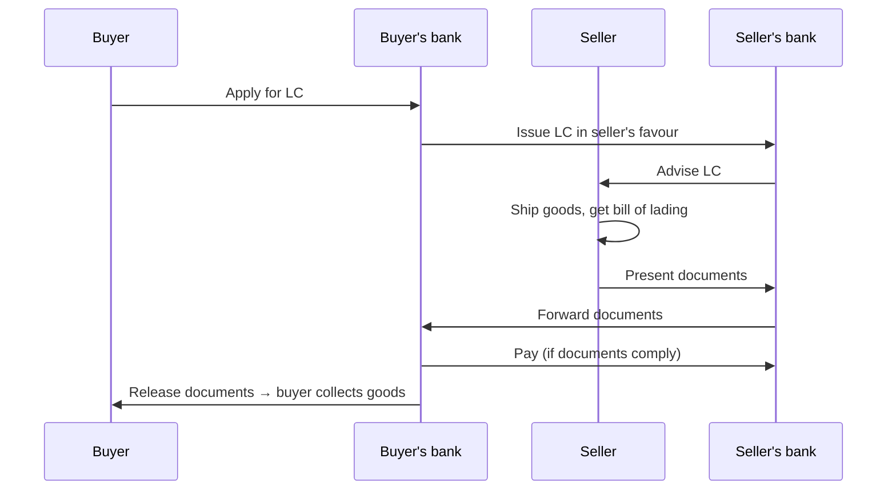
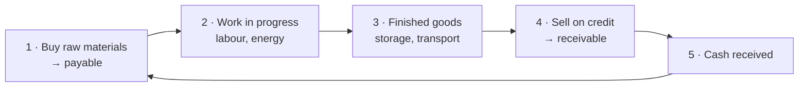
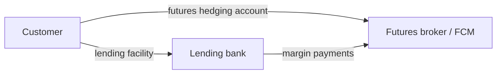

# 13. Commodity-Linked Financing

> **Teaching rewrite** of how commodity production and trade are financed: secured lending documents, project finance and the DSCR, the asset conversion cycle, repos, tri-party margin financing, prepays, supply-and-offtake deals, lending risks, and loans with embedded commodity optionality. Original wording; worked numbers recomputed. Not investment or legal advice.

## Introduction

Every stage of a commodity supply chain — mine, smelter, refinery, fabricator, ship, warehouse — ties up **cash** before it earns any. **Structured commodity finance** covers anything more than a plain unsecured loan: the lender takes **security over the commodity**, or the deal embeds **derivatives** to make repayment more certain or cheaper.

Lenders include commercial banks and, increasingly, **trading houses** (e.g. Glencore, Trafigura) that lend to suppliers and even governments — sometimes called **shadow banking**.

This lesson covers:

- Loan types and **security documents**: pledges, bills of lading, trust receipts, letters of credit, warehouse receipts
- Two **borrowing-base case studies** (coffee)
- **Project finance** and the **debt service coverage ratio (DSCR)**
- The **asset conversion cycle**, **repos**, **tri-party margin financing**, **prepays**, **prepaid variable forwards**
- **Lending risks**, the **commodity carry trade**, **supply-and-offtake** agreements
- **Long-term debt with embedded optionality**: option-subsidised loans, knock-in collars, digital and range-accrual swaps

---

## 13.1 Loans and security

### Two loan shapes

| | **Revolving facility** | **Term loan** |
|---|---|---|
| Drawdown | Draw, repay, redraw up to a limit | Full amount up front |
| Balance | Fluctuates with need | Amortises to zero |
| Typical use | Working capital (inventory, receivables) | Projects, capex |

### Ownership, possession, pledge

| Concept | Lender’s position |
|---|---|
| **True sale (ownership)** | Holds **legal title** — can sell or transfer the goods |
| **Possession** | Controls movement of the goods but has **no title** |
| **Pledge** | Borrower keeps title but gives the lender the **right to sell on default**, via documents of title or the goods themselves. Works only if the lender has **real control** |

### Key documents

| Document | What it does |
|---|---|
| **Bill of lading** | For sea freight: (1) **receipt** for cargo, (2) **contract of carriage**, (3) **document of title** |
| **Trust receipt (TR)** | Lender releases pledged goods or documents so the borrower can sell; the borrower holds goods and sale proceeds **in trust** for the lender |
| **Letter of credit (LC)** | Buyer’s bank promises to pay the seller (beneficiary) up to a limit **against documents** that comply on their face — solves “I won’t pay before I see the goods” vs “I won’t ship before I’m paid” |
| **Metal warrant** | Exchange-warehouse title document (lesson 5) |
| **Warehouse receipt** | Issued by a warehouse: location, depositor, date, type/quantity/quality, and **release instructions** (to depositor, a named party, or on written instruction) |

Title can pass by **endorsing** a negotiable document — no goods move. But there is **no global standard** for warehouse receipts; never assume one is negotiable without **specialist legal advice**.

### Case study 1: a borrowing base

A coffee trader gets a **USD 10 million revolver** secured on a **pool** of bills of lading, warehouse receipts (paper and electronic), trust receipts, and **assigned receivables**. The pool is **marked to market daily** off futures, adjusted for grade and location (**basis**). If it falls below a threshold, the trader **repays** part of the loan.

### Case study 2: warehouse-to-buyer financing

A Latin American exporter stores beans in an agreed warehouse; the **lender holds the warehouse receipt**, and beans move only with its permission.

- Advance = **80% of FOB value** off the front-month future. The **20% haircut** covers: freight to the nearest delivery port (Miami, New Orleans, Houston), price falls, and fire-sale losses.
- Daily mark-to-market; if cover falls below 80%, the exporter **tops up with cash**.
- On shipment, the lender takes **assignment of the sales contracts**; lending is capped at the **lower of sale value and futures value**, and the buyer pays **directly into the lender’s account**.

**Example**: 1,000 t of coffee with an FOB value of USD 4,000/t → advance 0.80 × 4,000,000 = **USD 3,200,000**. If the value falls to USD 3,700/t, cover needed = 0.80 × 3,700,000 = 2,960,000 → the exporter repays **USD 240,000**.

<GuidedChoiceExplanation preset="comm-fin-security" />

---

### Checkpoint 1: security

<MultipleChoice
  id="comm-ch13-mid1"
  title="Checkpoint — section 13.1"
  questions={[
    {
      prompt: 'Which bill of lading function lets a bank take security over cargo at sea?',
      choices: ['Receipt for cargo', 'Contract of carriage', 'Document of title', 'Insurance certificate'],
      answer: 2,
      why: 'Control the document, control the goods.',
    },
    {
      prompt: 'A lender releases pledged goods so the borrower can sell them. What protects the lender?',
      choices: ['A letter of credit', 'A trust receipt', 'A metal warrant', 'Nothing'],
      answer: 1,
      why: 'Goods and proceeds are held in trust for the lender.',
    },
    {
      prompt: 'Under a pledge, who holds legal title?',
      choices: ['The lender', 'The borrower', 'The warehouse', 'The exchange'],
      answer: 1,
      why: 'The lender has a right to sell on default, not ownership.',
    },
    {
      prompt: 'Advance 80% of USD 5,000,000 of collateral. Collateral falls to 4,500,000. Repayment needed to restore 80%?',
      choices: ['400,000', '500,000', '100,000', '0'],
      answer: 0,
      why: '4,000,000 − 0.8 × 4,500,000.',
    },
    {
      type: 'order',
      prompt: 'Rank the letter of credit flow.',
      items: ['Buyer’s bank issues LC', 'Seller ships and obtains bill of lading', 'Seller presents compliant documents', 'Issuing bank pays', 'Buyer receives documents and collects goods'],
      why: 'Payment against documents, not goods.',
    },
  ]}
/>

---

## 13.2 Project finance

Lenders care less about profit than about **cash to repay principal and interest**. Forward sales make that cash more certain.

### Example: a nickel mine

Borrow **USD 70 m** + **USD 30 m** equity; build for 2 years, produce for 5. Sales at the LME cash price on delivery; **40% hedged** with forwards (12,500 → 12,900 over years 1–5); planning price USD 12,000 for unhedged metal.

| USD m | Y1 | Y2 | Y3 | Y4 | Y5 |
|---|---|---|---|---|---|
| Output (t) | 5,000 | 10,000 | 10,000 | 10,000 | 10,000 |
| Unhedged revenue (60% × 12,000) | 36.0 | 72.0 | 72.0 | 72.0 | 72.0 |
| Hedged revenue (40% × forward) | 25.0 | 50.4 | 50.8 | 51.2 | 51.6 |
| Operating costs | (30.0) | (70.0) | (72.0) | (75.0) | (75.0) |
| Capex | (5.0) | (3.0) | (3.0) | (3.0) | (3.0) |
| **Cash available for debt** | **26.0** | **49.4** | **47.8** | **45.2** | **45.6** |
| Principal | — | (17.5) | (17.5) | (17.5) | (17.5) |
| Interest | (6.300) | (5.513) | (3.938) | (2.363) | (0.788) |
| **Cash after debt service** | 19.700 | 26.387 | 26.362 | 25.337 | **27.312** |
| **DSCR** | n/a | **2.15** | **2.23** | **2.28** | **2.49** |

**DSCR** = cash available for debt ÷ (principal + interest). Year 2: 49.4 ÷ (17.5 + 5.513) = **2.15**. Higher is safer; lenders typically set a minimum covenant.

:::caution Correction
The source shows year-5 interest as a **positive** 788,000, giving cash after debt service of 28.888 m and a DSCR of 2.73. Interest is a payment: 45.6 − 17.5 − 0.788 = **27.312 m**, and DSCR = 45.6 ÷ 18.288 = **2.49**.
:::

**How much to hedge?** If forwards (12,500–12,900) sit **above** the expected spot (12,000), or prices are expected to fall, hedging more makes sense. If both sides expect prices to beat the forwards, hedging gives that up. Options (lesson 5) are an alternative.

Interest is floating — e.g. **SOFR** + credit spread.

---

## 13.3 Working capital and the asset conversion cycle

**Working capital** = current assets − current liabilities, but the cycle tells the story better:

Goods in transit that **neither** seller nor buyer wants to fund are “orphaned” — a bank can step in. **Companies fail because they run out of cash**, so gaps in the cycle must be financed.

### Commodity repos (inventory monetisation)

The borrower **sells** inventory to the lender **spot** and **buys it back forward** — economically a secured loan, but the lender has **full title** (inventory must be **segregated**).

**Terms**: 3-year facility on **50,000 bbl** of crude, reset every **two weeks**; rate = index **1.50%** + margin **1.25%** = **2.75%**; prepayment (haircut) **10%**; act/360.

| Step | Calculation | Result |
|---|---|---|
| 1. Spot value from the 2-week forward (USD 50.00) | 50 ÷ (1 + 0.0275 × 14/360) | **49.95** |
| 2a. Haircut, method 1 | 49.95 ÷ 1.10 | **45.41** |
| 2b. Haircut, method 2 | 49.95 × 0.90 | 44.96 |
| 3. Cash lent (method 1) | 50,000 × 45.41 | **2,270,500** |
| 4. Prepayment amount | 50,000 × (49.95 − 45.41) | **227,000** |
| 5. Repaid at reset | 50,000 × 50.00 − 227,000 | **2,273,000** |

The two haircut methods give different numbers — the contract must specify which (or state it in USD/bbl).

:::caution Note on the source
The source says the refinery pays **2.75%**. Because the haircut is subtracted from both legs without accruing interest, the interest (2,500) is charged on the full collateral value but the cash received is smaller: 2,500 ÷ 2,270,500 × 360/14 ≈ **2.83%** on the cash actually borrowed.
:::

**Haircut drivers**: volatility, liquidity, quality (LME vs non-LME metal), transfer method (warrant, receipt, bill of lading), term, currency mismatch (EUR loan vs USD oil), credit quality.

**Default**: the second leg simply doesn’t happen — each side keeps what it holds. Hence short resets and **remargining** if prices move. The lender may return **equivalent** (not identical) barrels. The borrower pays storage, insurance, duties.

**Structured repos** embed optionality to cut the cost:

- **Sold deep-OTM call**: the refinery pays out if prices soar — but then its returned inventory is worth more. The premium reduces the **repurchase price**.
- **Extendible**: the lender can extend the repo — exercised if **rates fall**, locking in an above-market rate.

### Tri-party agreements (margin financing)

A lender requires the borrower to **hedge**; the **TPA** lets the bank fund **margin calls** at the broker. It must settle: security, who pays margin (bank directly or via the customer, perhaps backed by a standby LC), **segregated** accounts, who sets the **hedge strategy** (contracts, maturities, hedge ratio, proxies, pre-approval), **withdrawal controls** (hedge gains are often the lender’s security), and what happens if the **broker or bank** fails.

### Prepays

The buyer pays the **present value** of future deliveries **up front**; the producer then delivers. Useful for producers who can’t borrow easily.

**Example**: 1 t of copper a year for 3 years at forwards 6,000 / 6,100 / 6,200, zero rates 1% / 1.5% / 2%:

| Year | PV |
|---|---|
| 1 | 6,000 ÷ 1.01 = 5,941 |
| 2 | 6,100 ÷ 1.015² = 5,921 |
| 3 | 6,200 ÷ 1.02³ = 5,842 |
| **Total prepaid** | **USD 17,704** |

A credit margin would lower the prepayment. Variants: partial prepayment then “cash for commodity” exchanges.

### Prepaid variable forward

A prepay plus a **zero-cost collar**, giving the producer a floor **and** some upside.

| Term | Value |
|---|---|
| Producer sells to bank | 10,000 t thermal coal, 1 year (forward 60) |
| Floor (bought put) | **55** |
| Ceiling (sold call) | **67** |
| Advance | PV of floor: 55 ÷ 1.03 × 10,000 = **USD 533,981** (FV 550,000) |

**Settlement ratio** (fraction of the 10,000 t delivered, or its cash equivalent):

- P ≤ 55 → **1**
- 55 < P < 67 → **55 ÷ P** (delivers exactly USD 550,000 worth)
- P ≥ 67 → **1 − 12 ÷ P** (keeps 12 × 10,000 = USD 120,000 of value)

| Price at maturity | Ratio | Coal delivered (t) | Value delivered | Coal kept, value | Total to producer (FV) |
|---|---|---|---|---|---|
| 40 | 1 | 10,000 | 400,000 | 0 | **550,000** |
| 55 | 1 | 10,000 | 550,000 | 0 | **550,000** |
| 60 | 0.91667 | 9,167 | 550,000 | 50,000 | **600,000** |
| 65 | 0.84615 | 8,462 | 550,000 | 100,000 | **650,000** |
| 70 | 0.82857 | 8,286 | 580,000 | 120,000 | **670,000** |
| 80 | 0.85 | 8,500 | 680,000 | 120,000 | **670,000** |

Total = advance (550,000 FV) + value kept → **floor 550,000, cap 670,000**, and market value in between. Below 55 the **bank** loses (it sold the put).

:::caution Correction
The source’s table shows ratios of 60/P for prices of 60–70 and totals of 550,000 / 600,000 / 650,000 at 60 / 65 / 70 — inconsistent with its own floor of 55 and with its statement that the producer earns market value between the strikes. Using the term sheet’s formula, the totals are **600,000 / 650,000 / 670,000**.
:::

<GuidedChoiceExplanation preset="comm-fin-repo" />

---

### Checkpoint 2: project and working capital finance

<MultipleChoice
  id="comm-ch13-mid2"
  title="Checkpoint — sections 13.2 and 13.3"
  questions={[
    {
      prompt: 'Cash available 30 m; principal 15 m; interest 5 m. DSCR?',
      choices: ['1.50', '2.00', '6.00', '0.67'],
      answer: 0,
      why: '30 / 20.',
    },
    {
      prompt: 'Why do project lenders like forward sales of output?',
      choices: ['They raise profits', 'They make debt-service cash flows more certain', 'They remove operating costs', 'They are free'],
      answer: 1,
      why: 'DSCR becomes less sensitive to price.',
    },
    {
      prompt: 'In a commodity repo, who owns the barrels during the term?',
      choices: ['The refinery', 'The lender', 'The broker', 'Nobody'],
      answer: 1,
      why: 'Full title passes on the spot sale.',
    },
    {
      prompt: 'Prepay: 6,000 due in 1 year at 2%. Amount paid today (nearest dollar)?',
      choices: ['5,882', '6,120', '5,880', '6,000'],
      answer: 0,
      why: '6,000 / 1.02.',
    },
    {
      prompt: 'Prepaid variable forward, floor 55, cap 67, 10,000 t. Coal price 62 at maturity. Producer’s total value?',
      choices: ['550,000', '620,000', '670,000', '600,000'],
      answer: 1,
      why: 'Between the strikes → market value 62 × 10,000.',
    },
    {
      type: 'order',
      prompt: 'Rank the asset conversion cycle.',
      items: ['Buy raw materials', 'Work in progress', 'Finished goods', 'Sell on credit (receivable)', 'Collect cash'],
      why: 'Then restart the cycle.',
    },
  ]}
/>

---

## 13.4 Lending risks

| Risk | Example |
|---|---|
| **Fraud** | Goods don’t exist, or are pledged twice. Qingdao (2014) and Hin Leong (2020) involved collateral pledged to multiple banks; Trafigura (2023) found “nickel” cargoes that were largely worthless metal |
| **Counterparty credit** | A buyer walks away from a fixed-price purchase after prices fall — **market risk turns into credit risk** |
| **Wrong-way risk** | Exposure rises as the borrower weakens — e.g. a metal producer’s loan secured on its **own output**: lower prices hit both the collateral and the ability to repay |
| **Force majeure** | Events beyond control excuse performance — invoked by some LNG and copper buyers in early 2020 (COVID) |
| **Position risk** | A borrower allowed to speculate can lose heavily |
| **Quality** | Spoilage (ags), off-spec products (energy) — control storage, testing, inspection |

### The commodity carry trade (China)

Borrow cheap USD against copper, convert to CNY, invest at higher local rates.

| Step | Value |
|---|---|
| Collateral: 1,000 t × USD 6,000 | 6,000,000 |
| Loan after USD 1 m haircut, 1% for 1 year | 5,000,000 → repay **5,050,000** |
| Convert at 7.00 | CNY 35,000,000 |
| Invest at 5% | CNY 36,750,000 |
| Convert back at 7.00 | USD 5,250,000 → **profit USD 200,000** |
| …at 6.00 (CNY stronger) | USD 6,125,000 → profit **1,075,000** |
| …at 7.50 (CNY weaker) | USD 4,900,000 → **loss 150,000** |

It worked while CNY rates were high and the managed currency was stable. It collapsed amid **fraud** — the same metal (even photocopied warrants) pledged to several lenders.

### Supply-and-offtake agreements

An intermediary (bank or trader) takes over a refinery’s **working capital**: it buys existing crude and product inventory, buys all new crude, stores it **on site**, owns and sells the products, and pays the refinery the **crack spread** (plus location premium) less a **per-barrel fee**.

**Refinery: 50,000 bbl/day, crude USD 50.**

| Financing piece | Refinery alone (10% WACC) | Intermediary (2% funding) |
|---|---|---|
| Crude purchase terms | **Prepays** 14 days early: 50 × 10% × 14/360 ≈ 0.19/bbl → 1.5 m bbl/month × 0.19 = **USD 285,000/month cost** | **Pays 30 days after delivery**: 50 × 2% × 30/360 ≈ 0.08/bbl → **USD 120,000/month benefit** |
| Inventory: 750,000 bbl crude × 50 + 500,000 bbl gasoline × 60 = **USD 67.5 m** | × 10% = **USD 6.75 m/year** | × 2% = **USD 1.35 m/year** |

Saving on inventory = **USD 5.4 m a year** — both sides win if the intermediary’s fee and margin are below that. (Per-barrel figures are rounded to cents, as in the source; unrounded, the monthly amounts are 291,667 and 125,000.)

At maturity the refinery must **buy back** the inventory, so it has **price risk**: hedge with futures/forwards (watch basis) or a zero-cost collar (lesson 5).

---

## 13.5 Long-term debt with embedded commodity optionality

The idea: **sell optionality** that pays out when the borrower can best afford it, and use the premium to **cut interest costs**.

### Option-subsidised airline loan

A 3-year SOFR loan, quarterly. Each quarter the airline **sells a USD 20 put and buys a USD 16 put** on 40,000 bbl (a **bull put spread** — it collects a net premium).

| Quarter-average crude | Airline’s payment on the spread | Fuel bill | Net effect |
|---|---|---|---|
| 25 | 0 — keeps premium | High | Cheaper loan |
| 18 | (20 − 18) × 40,000 = **80,000** | Lower | Premium − 80,000 |
| 12 | Capped at (20 − 16) × 40,000 = **160,000** | Much lower | Premium − 160,000 |

The loss arrives exactly when **jet fuel is cheap** — a natural offset.

**Pricing with a backwardated curve** (spot 25, 3-year 20): early quarters are far OTM (cheap); late quarters are near the money (dearer). Downward-sloping **vol term structure** and **skew** also matter. (A bull spread with **calls** costs premium but has a better risk/reward than the cash-generating put version.)

### Interest-rate building blocks

**Swap**: fixed vs floating on a notional. LIBOR has been replaced by **risk-free rates** — SOFR (USD), SONIA (GBP), €STR (EUR) — which are overnight rates **compounded in arrears** over each period.

**Example**: GBP 10 m, 182 days, fixed 2.5% vs floating 2.0% (act/365):

- Fixed: 10,000,000 × 2.5% × 182/365 = **124,657.53**
- Floating: 10,000,000 × 2.0% × 182/365 = **99,726.03**
- Net **24,931.50** to the fixed receiver

(The source’s floating line repeats 2.5% in the formula; the result shown uses 2.0%.)

**Caps and floors**: strips of caplets/floorlets.

- Caplet = max(rate − strike, 0) × notional × days/basis
- Floorlet = max(strike − rate, 0) × notional × days/basis
- With term rates like LIBOR, the first period is already fixed, so a 3-year semi-annual cap has **5 caplets**
- **Cap–floor parity**: long cap + short floor at the same strike = pay fixed on a (forward-starting) swap

:::info Update
USD LIBOR ceased in June 2023. New loans and swaps reference SOFR (or term SOFR), and caps on compounded RFRs usually cover **every** period, including the first.
:::

### Zero-cost collar with a copper knock-in

A copper producer with 3-year floating debt (swap rate 2.62%) is offered zero-cost collars:

| Buy cap | Sell floor |
|---|---|
| 4.00% | 2.00% |
| 3.50% | 2.21% |
| 3.00% | 2.46% |
| 2.66% | 2.66% (= forward-starting swap rate) |

**Enhancement**: make the 3.50% cap **knock in only if LME cash copper < USD 5,000** on each reset date. The cap is cheaper, so the floor improves from 2.21% to **1.90%**.

- Copper high → no rate protection, but strong revenue
- Copper low → rates capped at 3.50% just when cash is tight

**Caveat**: high rates usually come with **strong economies and high copper**, so the protection may rarely activate. A **backwardated** copper curve (forwards below 5,000) makes knock-in likelier and the cap dearer; **contango** makes it cheaper.

**Example caplet**: SOFR 4.20%, cap 3.50%, USD 10 m, 91 days (act/360), copper at 4,800 → payout 0.70% × 10 m × 91/360 = **USD 17,694**. With copper at 5,500, the caplet isn’t knocked in → **0**.

### Swap with a commodity-linked digital

Copper producer, USD 10 m, 3 years: receives 3-month floating; pays floating **− 1.25%** if copper < **USD 6,000** on the payment date, else floating **+ 1.50%**. That is a strip of **sold quarterly digital calls** on copper: cheap debt when copper is low, dearer when copper is high.

Per quarter (¼ year): copper low → saves 1.25% × 10 m × 0.25 = **USD 31,250**; copper high → costs 1.50% × 10 m × 0.25 = **USD 37,500**.

### Range accrual on sugar

A sugar producer, USD 5 m, 3 years, quarterly: pays **1.5% + 5% × N/D** (N = days sugar settles **above** USD 0.10/lb, D = days in the quarter) vs a vanilla fixed rate of **3%**. Sugar is at 0.12, so the daily digitals start **in the money**.

- Sugar above 0.10 every day → **6.5%**; never → **1.5%**
- Break-even vs 3%: N/D = (3 − 1.5) ÷ 5 = **30%** of days
- Example: 60 of 91 days above → 1.5 + 5 × 60/91 = **4.80%**

The producer has sold a strip of **one-day digital calls**; it does well while sugar stays **low**.

<GuidedChoiceExplanation preset="comm-fin-structures" />

---

### Checkpoint 3: risks and embedded optionality

<MultipleChoice
  id="comm-ch13-mid3"
  title="Checkpoint — sections 13.4 and 13.5"
  questions={[
    {
      prompt: 'A loan to a gold miner secured on its own gold output is an example of…',
      choices: ['Right-way risk', 'Wrong-way risk', 'Force majeure', 'Quality risk'],
      answer: 1,
      why: 'Lower gold prices hurt both collateral and repayment capacity.',
    },
    {
      prompt: 'Carry trade: USD 5 m at 1%, CNY invested at 5% at 7.00; CNY weakens to 7.35 at maturity. Result (USD)?',
      choices: ['+200,000', '−50,000', '0', '+50,000'],
      answer: 1,
      why: '36.75 m / 7.35 = 5.00 m vs 5.05 m owed.',
    },
    {
      prompt: 'Supply-and-offtake: inventory USD 40 m; refinery WACC 9%, intermediary 3%. Annual funding saving?',
      choices: ['2.4 m', '3.6 m', '1.2 m', '4.8 m'],
      answer: 0,
      why: '40 m × (9% − 3%).',
    },
    {
      prompt: 'Airline sold a 20 put and bought a 16 put on 40,000 bbl. Average crude 14. Payment?',
      choices: ['240,000', '160,000', '80,000', '0'],
      answer: 1,
      why: 'Capped at the 4.00 strike difference.',
    },
    {
      prompt: 'Range accrual: pays 1.5% + 5% × N/D. Break-even N/D vs a 3% vanilla rate?',
      choices: ['30%', '50%', '60%', '15%'],
      answer: 0,
      why: '(3 − 1.5) / 5.',
    },
    {
      type: 'order',
      prompt: 'Rank the zero-cost collars by floor strike (LOWEST first).',
      items: ['Cap 4.00% / floor 2.00%', 'Cap 3.50% / floor 2.21%', 'Cap 3.00% / floor 2.46%', 'Cap 2.66% / floor 2.66%'],
      why: 'A lower cap costs more, so the floor must rise to pay for it.',
    },
  ]}
/>

---

### Rank: financing practice

<MultipleChoice
  id="comm-ch13-rank"
  title="Financing practice"
  questions={[
    {
      type: 'order',
      prompt: 'Rank the commodity repo steps.',
      items: ['Discount the forward to a spot value', 'Apply the haircut', 'Lender pays cash and takes title', 'Remargin or reset every two weeks', 'Borrower repurchases at forward less prepayment'],
      why: 'A secured loan in sale-and-repurchase form.',
    },
    {
      type: 'order',
      prompt: 'Rank the lender’s security from STRONGEST to WEAKEST.',
      items: ['True sale with segregated inventory (repo)', 'Pledge with lender-held negotiable warehouse receipt', 'Trust receipt after release to borrower', 'Unsecured revolving facility'],
      why: 'Title and control decline down the list.',
    },
  ]}
/>

---

### Check: commodity-linked financing

<MultipleChoice
  id="comm-ch13"
  title="Commodity-linked financing"
  questions={[
    {
      prompt: 'What makes a deal “structured” commodity finance?',
      choices: [
        'It is unsecured',
        'It goes beyond a plain unsecured loan — security over commodities and/or embedded derivatives',
        'It is always exchange traded',
        'It has no interest',
      ],
      answer: 1,
      why: 'Collateral control and optionality.',
    },
    {
      prompt: 'A letter of credit pays against…',
      choices: ['Inspection of goods by the bank', 'Documents that comply on their face', 'The buyer’s approval', 'Delivery at destination only'],
      answer: 1,
      why: 'Banks deal in documents, not goods.',
    },
    {
      prompt: 'Why do repos reset every couple of weeks?',
      choices: [
        'Regulation forbids longer',
        'To limit drift between collateral value and cash lent',
        'Oil expires',
        'To raise fees',
      ],
      answer: 1,
      why: 'Frequent reset or remargining controls credit exposure.',
    },
    {
      prompt: 'A prepaid variable forward combines a prepayment with…',
      choices: ['A swap', 'A zero-cost collar (bought put, sold call)', 'A range accrual', 'A cap'],
      answer: 1,
      why: 'Floor and cap on the producer’s proceeds.',
    },
    {
      prompt: 'What is the main appeal of a supply-and-offtake agreement to a refinery?',
      choices: [
        'It gets free crude',
        'It shifts inventory financing to a cheaper-funded intermediary',
        'It removes refining margin risk entirely',
        'It avoids taxes',
      ],
      answer: 1,
      why: 'Lower working capital costs.',
    },
    {
      prompt: 'A producer sells digital calls on copper inside its swap. When does its borrowing get dearer?',
      choices: ['When copper is low', 'When copper is at or above the trigger', 'Never', 'When rates fall'],
      answer: 1,
      why: 'It pays more when its own revenues are strong.',
    },
  ]}
/>

---

## Calculate: numeric practice

Type the number (no units; minus sign for payments).

### Formula sheet

| Item | Formula |
|---|---|
| Advance | collateral value × advance rate |
| Top-up | loan − advance rate × new value |
| DSCR | cash available ÷ (principal + interest) |
| Repo spot value | forward ÷ (1 + r × days/360) |
| Haircut (method 1 / 2) | spot ÷ (1 + h) / spot × (1 − h) |
| Prepay | Σ forward_t ÷ (1 + z_t)^t |
| PVF settlement ratio | 1; floor ÷ P; 1 − (cap − floor) ÷ P |
| Carry trade | (USD × FX₀ × (1 + r_local)) ÷ FX₁ − USD × (1 + r_usd) |
| Financing cost | value × rate × days/360 |
| Put spread payout | min(max(K_high − S, 0), K_high − K_low) × volume |
| Swap leg | notional × rate × days/basis |
| Caplet | max(rate − strike, 0) × notional × days/360 |
| Range accrual rate | base + digital × N/D |

<NumericQuiz
  id="comm-ch13-calc"
  title="Calculate: commodity-linked financing"
  decimals={2}
  questions={[
    {
      prompt: 'Coffee: 1,000 t at FOB USD 4,000/t; 80% advance. Loan amount?',
      answer: 3200000,
      why: '0.80 × 4,000,000.',
      decimals: 0,
    },
    {
      prompt: 'Same loan; value falls to USD 3,700/t. Repayment to restore 80% cover?',
      answer: 240000,
      why: '3,200,000 − 0.80 × 3,700,000.',
      decimals: 0,
    },
    {
      prompt: 'Nickel mine year 2: cash available 49.4 m, principal 17.5 m, interest 5.513 m. DSCR (2 dp)?',
      answer: 2.15,
      why: '49.4 / 23.013.',
    },
    {
      prompt: 'Year 5: cash available 45.6 m, principal 17.5 m, interest 0.788 m. DSCR (2 dp)?',
      answer: 2.49,
      why: '45.6 / 18.288.',
    },
    {
      prompt: 'Repo: 2-week forward 50.00, rate 2.75%, 14 days (act/360). Spot value (2 dp)?',
      answer: 49.95,
      why: '50 / (1 + 0.0275 × 14/360).',
    },
    {
      prompt: 'Spot 49.95, 10% prepayment applied as spot ÷ 1.10. Cash per barrel (2 dp)?',
      answer: 45.41,
      why: '49.95 / 1.10.',
    },
    {
      prompt: '50,000 bbl at 45.41. Cash lent?',
      answer: 2270500,
      why: '50,000 × 45.41.',
      decimals: 0,
    },
    {
      prompt: 'Repurchase: forward 50.00 on 50,000 bbl less prepayment 227,000. Amount repaid?',
      answer: 2273000,
      why: '2,500,000 − 227,000.',
      decimals: 0,
    },
    {
      prompt: 'Copper prepay: 6,000 / 6,100 / 6,200 at zero rates 1% / 1.5% / 2%. Total paid today (nearest dollar)?',
      answer: 17704,
      why: '5,941 + 5,921 + 5,842.',
      decimals: 0,
    },
    {
      prompt: 'Prepaid variable forward: floor 55 on 10,000 t, rate 3%. Cash advanced (nearest dollar)?',
      answer: 533981,
      why: '550,000 / 1.03.',
      decimals: 0,
    },
    {
      prompt: 'PVF: floor 55, cap 67, coal 70 at maturity. Settlement ratio (5 dp)?',
      answer: 0.82857,
      why: '1 − 12/70.',
      decimals: 5,
    },
    {
      prompt: 'Carry trade: USD 5 m at 1%, CNY at 5%, FX 7.00 → 6.00. Profit (USD)?',
      answer: 1075000,
      why: '36.75 m / 6 = 6.125 m − 5.05 m.',
      decimals: 0,
    },
    {
      prompt: 'Supply-and-offtake: inventory USD 67.5 m; WACC 10% vs 2%. Annual saving?',
      answer: 5400000,
      why: '67.5 m × 8%.',
      decimals: 0,
    },
    {
      prompt: 'Airline: sold 20 put, bought 16 put, 40,000 bbl; average crude 18. Payment?',
      answer: 80000,
      why: '2 × 40,000.',
      decimals: 0,
    },
    {
      prompt: 'GBP swap: 10 m, 182 days, fixed 2.5% vs floating 2.0% (act/365). Net to the fixed receiver (2 dp)?',
      answer: 24931.51,
      why: '10 m × 0.5% × 182/365 = 24,931.51 (the source shows 24,931.50 from rounding each leg first).',
    },
    {
      prompt: 'Knock-in caplet: SOFR 4.20%, strike 3.50%, USD 10 m, 91 days (act/360), copper below barrier. Payout (2 dp)?',
      answer: 17694.44,
      why: '0.007 × 10 m × 91/360.',
    },
    {
      prompt: 'Range accrual: 1.5% + 5% × N/D with 60 of 91 days above the strike. Rate in % (2 dp)?',
      answer: 4.8,
      why: '1.5 + 5 × 0.6593.',
    },
  ]}
/>

### Randomized practice

<NumericQuiz id="comm-ch13-calc-random" title="Practice: financing drills" bank="commFinance" rounds={6} />

---

## Takeaways

:::tip Remember
- Structured commodity finance = lending with **commodity security** and/or **embedded derivatives**
- Know the documents: bill of lading (title), trust receipt, LC (pays against documents), warehouse receipt (check negotiability)
- Borrowing bases advance a **haircut** share of marked-to-market collateral; shortfalls are topped up
- Project lenders watch the **DSCR**; hedging output stabilises it
- Repos = spot sale + forward repurchase with a haircut; short resets limit exposure
- Prepays pay PV up front; **prepaid variable forwards** add a floor and a cap
- Risks: fraud (double pledging), wrong-way, force majeure, credit, quality, position
- Supply-and-offtake shifts inventory funding to a cheaper balance sheet
- Embedded optionality cuts borrowing costs by selling payouts that hit when the borrower can **afford** them
:::

## Further Reading

- Next: [14. Commodity investing](./commodity-investing)
- [12. Agriculture](./agriculture)
- [5. Base metals](./base-metals) — warrants, collars, min-max structures
- [6. Crude oil](./crude-oil) — crack spreads, refinery hedging
- [2. Derivative valuation](./derivative-valuation) — discounting, put-call parity
- R. Jones, *Commodity Trade Finance* (2018); J. Gregory on counterparty risk and wrong-way risk
- Background: N. Schofield, *Commodity Derivatives: Markets and Applications* (Wiley) — used as a study outline
