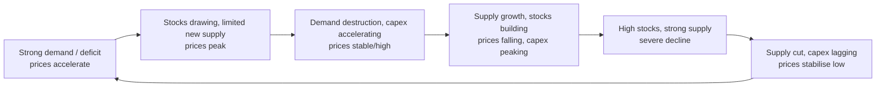

# 2. Derivative Valuation

> **Teaching rewrite** of how commodity forwards, swaps, and options are priced. Original wording; all worked numbers recomputed. Prices (gold near USD 1,400, crude near USD 50) are teaching values, not today’s market. Not investment advice.

## Introduction

Lesson 1 described **what** commodity derivatives do. This lesson explains **where their prices come from**. The recurring idea:

> **The price of a derivative is driven by the cost of hedging it** — not by anyone’s forecast.

This lesson covers:

- Why commodities can’t be valued like bonds or shares
- What drives commodity prices: **inventories, seasonality, inelasticity, marginal cost, mean reversion**
- **Forward curves**: cash-and-carry, **contango** vs **backwardation**, convenience yield
- **Arbitrage** across place, time, and quality — with real cases
- **Swap valuation**: discount factors, fair fixed price, OIS discounting
- **Option valuation**: Black–Scholes–Merton, Black-76, **Bachelier** (negative prices), **put-call parity**
- The **Greeks** — delta, gamma, theta, vega — and **volatility skews and term structures**

---

## 2.1 Three kinds of assets

| Asset type | Examples | How valued |
|---|---|---|
| **Capital assets** | Bonds, shares | **Discounted cash flows** — coupons, dividends |
| **Consumable / transformable (C/T)** | Oil, metals, grains | No income stream → **not** NPV; valued from **supply and demand** in their own market |
| **Store of value** | Fine art (and, arguably, gold) | Neither consumed nor income-producing, yet valued |

This is why finance techniques imported from bonds and equities often fail on commodities.

---

## 2.2 Commodity prices through the cycle

Because new mines, wells, and farms take years, **supply lags price** — producing long boom-and-bust cycles.

---

## 2.3 What drives commodity prices

| Driver | Idea | Example |
|---|---|---|
| **Inventories** | Large above-ground stocks cushion shocks; thin stocks amplify them | Gold: huge stocks → short-term price barely reacts to mine supply. Copper: thin stocks → sensitive |
| **Seasonality** | Demand/supply concentrated in parts of the year | Heating oil dearer for winter delivery |
| **Inelastic demand** | Demand doesn’t fall quickly when price rises | Small share of final cost (coffee in a latte), essential input (jet fuel), hard to substitute, brand loyalty |
| **Inelastic supply** | Output can’t rise quickly | Finite resources, land/water limits, weak infrastructure, geopolitics, slow technology |
| **Marginal cost** (“cost support”) | Long-run price floor ≈ cost of the marginal producer | Short term, prices can fall **below** cost — fixed costs are sunk; producers endure losses hoping for recovery |
| **Mean reversion** | Prices tend to drift back to a long-run average | Useful, but “long run” has no precise definition |

### Worked example: inelasticity

Price elasticity = % change in quantity ÷ % change in price. Jet fuel rises **40%** and airline fuel demand falls **4%** in the short run → elasticity = −4 / 40 = **−0.1** (very inelastic). Fuel surcharges pass the cost to passengers.

<GuidedChoiceExplanation preset="comm-curve-shape" />

---

### Checkpoint 1: price drivers

<MultipleChoice
  id="comm-ch2-mid1"
  title="Checkpoint — sections 2.1 to 2.3"
  questions={[
    {
      prompt: 'Why can’t crude oil be valued with a discounted cash flow model like a bond?',
      choices: [
        'Oil is too volatile',
        'Oil yields no ongoing cash flow; its value comes from supply and demand',
        'Oil is priced in dollars',
        'Bonds are commodities too',
      ],
      answer: 1,
      why: 'Consumable/transformable assets don’t pay coupons or dividends.',
    },
    {
      prompt: 'Why does copper react more sharply than gold to a mine strike?',
      choices: [
        'Copper is more valuable',
        'Copper has much thinner above-ground inventories',
        'Gold is not mined',
        'Copper has no futures market',
      ],
      answer: 1,
      why: 'Large stocks cushion supply shocks.',
    },
    {
      prompt: 'Price rises 25%; quantity demanded falls 5%. Price elasticity of demand?',
      choices: ['−5', '−0.2', '−0.05', '−1.25'],
      answer: 1,
      why: '−5% / 25% = −0.2 — inelastic.',
    },
    {
      prompt: 'Why can prices stay below marginal cost for a while?',
      choices: [
        'Marginal cost is always zero',
        'Many costs are fixed short term, and producers may accept losses expecting recovery',
        'Governments forbid it',
        'Futures prevent it',
      ],
      answer: 1,
      why: 'Cost support matters more in the long run.',
    },
    {
      type: 'order',
      prompt: 'Rank the cycle stages starting from a supply deficit.',
      items: [
        'Strong demand, prices accelerating',
        'Stocks drawing, prices peaking',
        'New supply arrives, stocks building, prices falling',
        'High stocks, severe price decline',
        'Investment cut, prices stabilise low',
      ],
      why: 'Supply lags price, creating long cycles.',
    },
  ]}
/>

---

## 2.4 Forward price curves

A **forward curve** plots today’s prices for delivery at different future dates. Typical features:

- **Contango**: forward > spot (upward slope). **Backwardation**: forward < spot (downward slope).
- **Short-dated** prices are **more volatile** than long-dated ones.
- At **low** prices the curve tends to slope **up**; as prices rise it **flattens** and may **invert**.

### Cash-and-carry: the financial benchmark

A bank sells a client a 1-year forward on an equity index (spot **100**). It hedges by buying the shares today:

| Item | Index points |
|---|---|
| Spot | 100 |
| + Financing at 3% | +3 |
| − Dividends received (1%) | −1 |
| − Securities-lending fee earned | −0.5 |
| **Fair forward** | **101.5** |

This is a **breakeven**, not a forecast. If another bank quotes **101**, an arbitrageur buys the forward at 101, borrows and sells the shares (100), deposits the cash (+3), pays the dividend to the lender (−1) and a borrow fee (−0.5): receives 101.5, pays 101 → **0.5** riskless profit.

### Gold forward: the same logic

A producer asks for a **6-month (182-day)** gold price. The bank:

1. **Sells** gold spot at **USD 1,425.40** (hedging the gold it will receive).
2. **Borrows** gold from a central bank at a **lease rate of 0.1157%** to deliver now.
3. **Deposits** the dollars at **3.39%**.

| Cash flow (per oz) | Calculation | USD |
|---|---|---|
| Spot proceeds | | 1,425.40 |
| + Deposit interest | 1,425.40 × 3.39% × 182/360 | +24.43 |
| − Gold lease cost | 1,425.40 × 0.1157% × 182/360 | −0.83 |
| **Fair forward** | | **≈ 1,449.00** |

**Forward = spot + cost of carrying the hedge.** As maturity approaches, carry shrinks and forward **converges** to spot.

If the market quotes **1,440** (“cheap to fair value”), an arbitrageur buys the forward at 1,440 and does the spot sale / lease / deposit trades — locking in about **USD 9/oz**.

:::info Benchmark rate update
The source text uses **LIBOR**. USD LIBOR ceased in June 2023; today USD deals use **SOFR**, EUR deals **€STR** (which replaced EONIA in 2022). The mechanics are identical — only the reference rate changes.
:::

### Contango and backwardation

With storage and insurance:

> **Forward = spot + interest + storage & insurance**

…which implies forward should always exceed spot. Yet crude oil and base metals are often **backwardated**. The textbook fix is the **convenience yield** — the benefit of physically **having** the commodity now (no stock-out, keep the plant running):

> **Forward = spot + interest + storage − convenience yield**

- Near zero when supply is normal; **no upper limit** when supply is tight.
- Practitioners are sceptical (“it’s the number that makes the formula work”), but it’s a useful **proxy for scarcity**: research comparing 1989–2004 data found higher convenience yields (crude ≈ 36%) where inventories were thin (≈ 20 days) and negative ones for gold (≈ −0.8%, inventories ≈ 16,500 days) — and higher volatility where convenience yield was high.

Why can’t arbitrage remove backwardation? You’d need to **borrow** the commodity to sell spot — and in a scarce market there is none to borrow.

An alternative view: producers need more protection than consumers, so they accept a **risk premium**:

> **Forward = expected future spot − risk premium**

E.g. a producer (marginal cost USD 45) and trader both expect USD 50 in six months; the trader pays **USD 49** — the USD 1 is the trader’s risk premium.

For index investors: **total return = spot return + roll yield + collateral yield**, and convenience yield ≈ roll yield + storage + interest.

| **Backwardation** | **Contango** |
|---|---|
| Scarcity, low inventories | Glut, high inventories |
| Volatile, strongly rising prices | Stable, weak prices |
| “Fear” premium | “Complacency” discount |
| Typical: crude, base metals | Typical: precious metals |

Crude is costly to store (roughly a fifth of a barrel’s value), so demand spikes hit spot prices first; gold is cheap to store and abundant above ground, so it usually sits in contango.

### Worked example: implied convenience yield

Spot crude **USD 80**, 1-year forward **USD 76**, interest **5%** (USD 4), storage **USD 3**.

Convenience yield = (spot − forward) + storage + interest = 4 + 3 + 4 = **USD 11** (≈ 13.75% of spot) — a tight market.

---

### Checkpoint 2: forward curves

<MultipleChoice
  id="comm-ch2-mid2"
  title="Checkpoint — section 2.4 (curves)"
  questions={[
    {
      prompt: 'Spot 200, financing 6, income 2, lending fee 1. Cash-and-carry forward?',
      choices: ['209', '203', '205', '197'],
      answer: 1,
      why: '200 + 6 − 2 − 1 = 203.',
    },
    {
      prompt: 'Fair gold forward is 1,449; the market quotes 1,460. The arbitrage is…',
      choices: [
        'Buy forward, sell spot',
        'Sell forward, buy spot and carry it',
        'Do nothing',
        'Buy both',
      ],
      answer: 1,
      why: 'Forward is rich: sell it and hold the hedge, earning ~11.',
    },
    {
      prompt: 'Which situation describes backwardation?',
      choices: [
        'Forward above spot, high inventories',
        'Forward below spot, low inventories',
        'Forward equals spot',
        'Negative interest rates',
      ],
      answer: 1,
      why: 'Scarcity makes prompt supply valuable.',
    },
    {
      prompt: 'Why can’t arbitrageurs eliminate a backwardated curve?',
      choices: [
        'Futures are banned',
        'They’d need to borrow the scarce physical commodity to sell spot — it isn’t available',
        'Interest rates are too high',
        'Storage is free',
      ],
      answer: 1,
      why: 'No deep lending market for the physical good.',
    },
    {
      prompt: 'Spot 60, forward 58, storage 2, interest 3. Implied convenience yield?',
      choices: ['3', '5', '7', '1'],
      answer: 2,
      why: '(60 − 58) + 2 + 3 = 7.',
    },
    {
      type: 'order',
      prompt: 'Rank these markets from MOST likely contango to MOST likely backwardation.',
      items: [
        'Gold — huge stocks, cheap storage',
        'Aluminium in a glut',
        'Copper with thin LME stocks',
        'Crude oil during a supply shock',
      ],
      why: 'Abundant, cheap-to-store → contango; scarce, costly to store → backwardation.',
    },
  ]}
/>

---

## 2.5 Commodity arbitrage

| Type | Exploits | Example |
|---|---|---|
| **Geographic** | Price gaps between locations | LME vs Shanghai Futures Exchange (SHFE) |
| **Time** | Forward curve away from cash-and-carry value | Buy spot, store, sell forward |
| **Technical / quality** | Blending or processing | Blending ethanol into US gasoline |

### Geographic: LME vs SHFE

> Arbitrage level = [(LME ± curve adjustment + CIF premium & freight) × USD/RMB × (1 + VAT) × (1 + tariff) + admin] − SHFE

Everything in brackets is the **all-in cost** of moving LME metal into China. If SHFE is higher than that, ship metal from LME to SHFE; reverse when negative.

### Worked example: is the import arb open?

LME copper **USD 9,000/t**, curve adjustment **+20**, CIF premium & freight **+80**, USD/RMB **7.1**, VAT **13%**, tariff **0%**, admin **RMB 50**, SHFE **RMB 73,000/t**.

All-in import cost = (9,000 + 20 + 80) × 7.1 × 1.13 + 50 = 9,100 × 7.1 × 1.13 + 50 = **RMB 73,059.3**. SHFE 73,000 − 73,059.3 ≈ **−59** → import arb slightly **closed**.

### Time arbitrage: aluminium

Cash **USD 2,000/t**; one week’s storage **3.00** and finance **0.50** → fair 1-week forward **2,003.50**. Market forward **2,005**.

Buy cash, sell forward. Whatever happens to price:

| Cash price after a week | Physical P&L incl. carry | Short forward P&L | Net |
|---|---|---|---|
| 2,010 | 10 − 3.50 = +6.50 | 2,005 − 2,010 = −5.00 | **+1.50** |
| 1,990 | −10 − 3.50 = −13.50 | 2,005 − 1,990 = +15.00 | **+1.50** |

Profit = 2,005 − 2,003.50 = **1.50** — locked in.

### Case: the 2010 aluminium carry trade

LME aluminium stocks quadrupled to ~4.5 Mt; much of the world’s stock sat in financing deals:

| Item | USD/t |
|---|---|
| Sell 3-month forward | 2,108 |
| − Buy spot | −2,076 |
| Spread | 32.00 |
| − Finance: 2,076 × 0.5% × 92/360 | −2.65 |
| − Warehousing: 0.15 × 92 days | −13.80 |
| **Net profit** | **15.55** (≈ 3% annualised) |

It persisted for years: producers kept selling surplus metal spot while consumers bought forward, and traders were paid to intermediate between them.

### Case: oil in floating storage (2008–09)

Spot crude **USD 47**, 12-month forward **USD 60**. A supertanker holds **2 million barrels**:

| Item | USD |
|---|---|
| Forward sale: 2 M × 60 | 120,000,000 |
| − Purchase: 2 M × 47 | −94,000,000 |
| − Storage: 2 M × 7.20 | −14,400,000 |
| − Financing: (94 M + 14.4 M) × 0.25% | −271,000 |
| **Net** | **≈ 11,329,000** |

As others copied the trade (100–120 M barrels on ~56 ships by April 2009), spot rose and forwards fell; by September the spread had shrunk to ~USD 5.45 and the trade faded — arbitrage closing itself.

<GuidedChoiceExplanation preset="comm-arbitrage" />

---

## 2.6 Swap valuation

A swap is fair on day one: **PV(fixed) = PV(floating)** → NPV = 0. The **price** of a swap is its **fixed** rate.

1. **Floating leg** — value each period using today’s **futures curve** (the trader hedges the floating leg with futures, so futures prices are the hedge cost).
2. **Discount** each cash flow: discount factor DF = 1 / (1 + r × days/360) for periods under a year (360 for USD/EUR, 365 for GBP); 1 / (1 + r)ⁿ for longer.
3. **Solve** for the fixed price that makes NPV zero:

> **Fixed = Σ(Fᵢ × DFᵢ) / Σ DFᵢ** — a discount-weighted average of the futures prices.

### Worked example: 6-month crude swap (10,000 bbl/month)

Assume 31-day months; each cash flow discounted to its own date.

| Month | Futures (USD) | Rate | Days | DF | PV fixed | PV floating |
|---|---|---|---|---|---|---|
| 1 | 50.00 | 1.00% | 31 | 0.999140 | 505,798.85 | 499,569.81 |
| 2 | 50.25 | 1.25% | 62 | 0.997852 | 505,146.93 | 501,420.55 |
| 3 | 50.50 | 1.50% | 93 | 0.996140 | 504,280.32 | 503,050.68 |
| 4 | 50.75 | 1.75% | 124 | 0.994008 | 503,201.22 | 504,459.23 |
| 5 | 51.00 | 2.00% | 155 | 0.991462 | 501,912.38 | 505,645.83 |
| 6 | 51.25 | 2.25% | 186 | 0.988509 | 500,417.05 | 506,610.65 |
| **Total** | | | | | **3,020,756.76** | **3,020,756.76** |

**Fair fixed price ≈ USD 50.62/bbl**; NPV = 0.

- The fixed payer profits only if actual futures rise **faster** than the curve already implies.
- **Futures +1 across the curve** → for the bank receiving fixed, NPV ≈ −10,000 × ΣDF ≈ **−USD 59,671**.
- **One month later**, curve unchanged, five flows left → NPV ≈ **−USD 6,253** to the fixed receiver (the cheap early months have passed).

:::caution Note on the source table
The source applies a single 31-day period to every month’s discount factor; discounting each cash flow to its own date (as above) is the standard method. The fair price is about USD 50.62 either way.
:::

### OIS discounting

Collateralised swaps pay **overnight** interest on collateral, so they should be discounted at **overnight index swap (OIS)** rates (SOFR, €STR today), not term rates.

**Worked example**: you will receive **USD 50,000** in one year. Term rate 5%, OIS 4%.

| Collateral held | Grows at OIS 4% to | Shortfall? |
|---|---|---|
| 50,000 / 1.05 = **47,619** (term discounting) | 49,524 | **476 short** |
| 50,000 / 1.04 = **48,077** (OIS discounting) | 50,000 | None |

Under OIS the fair fixed price barely changes, but **sensitivities** differ — large across big, long-dated portfolios.

---

### Checkpoint 3: arbitrage and swaps

<MultipleChoice
  id="comm-ch2-mid3"
  title="Checkpoint — sections 2.5 and 2.6"
  questions={[
    {
      prompt: 'Cash 1,500, carry cost 6 for one month, one-month forward 1,512. Locked-in arbitrage per tonne?',
      choices: ['12', '6', '18', '0'],
      answer: 1,
      why: 'Fair forward 1,506; market 1,512 → 6 profit.',
    },
    {
      prompt: 'Why did the 2009 floating-storage trade fade?',
      choices: [
        'Tankers sank',
        'Copycat buying lifted spot and forward selling lowered forwards, shrinking the spread',
        'Interest rates rose to 20%',
        'Oil became free',
      ],
      answer: 1,
      why: 'Arbitrage removes its own profit.',
    },
    {
      prompt: 'A swap’s fair fixed price is best described as…',
      choices: [
        'The trader’s forecast',
        'A discount-weighted average of futures prices that makes NPV zero',
        'Today’s spot price',
        'The highest futures price',
      ],
      answer: 1,
      why: 'Hedge cost, not forecast.',
    },
    {
      prompt: 'Two months: futures 40 and 44, DFs 0.99 and 0.98. Fair fixed price (2 dp)?',
      choices: ['42.00', '41.99', '42.50', '41.50'],
      answer: 1,
      why: '(40×0.99 + 44×0.98) / (0.99 + 0.98) = (39.6 + 43.12)/1.97 = 82.72/1.97 ≈ 41.99.',
    },
    {
      prompt: 'Why discount collateralised swaps at OIS rates?',
      choices: [
        'OIS rates are higher',
        'Collateral earns overnight interest, so OIS discounting makes collateral grow to exactly the amount owed',
        'Regulators ban term rates',
        'OIS has no credit risk at all',
      ],
      answer: 1,
      why: 'Discount at the rate collateral actually earns.',
    },
  ]}
/>

---

## 2.7 Option valuation

An option premium reflects the **expected payout** and its **probability**.

### Black–Scholes–Merton (BSM) inputs

Spot, strike, time to maturity, cost of carry (interest − income), **implied volatility**.

**Gold example**: spot **1,400**, strike **1,400**, 6 months, interest 3%, lease 0.10%, vol 15% → 6-month forward **≈ 1,420.44**, BSM call premium **≈ USD 69.38/oz**, delta **≈ 0.58**.

Looks at-the-money (spot = strike), but a European option is compared with the **forward**: buying at 1,400 when the forward is 1,420.44 means it is **in-the-money**.

### Intrinsic value and time value

| Component | Definition | Driven by |
|---|---|---|
| **Intrinsic** | Call: MAX(0, underlying − strike); put: MAX(0, strike − underlying) — underlying = **forward** for European, **spot** for American | Underlying price |
| **Time value** | Premium − intrinsic: a charge for future uncertainty; decays to zero by expiry | Time and implied volatility |

Gold call: intrinsic ≈ 1,420.44 − 1,400 = **20.44** (≈ 20.14 present-valued); time value ≈ 69.38 − 20.14 ≈ **49.24**.

Early exercise is rarely optimal: exercising captures only intrinsic value; **selling** the option captures intrinsic **and** time value.

### Black-76 and Bachelier

| Model | Underlying input | Distribution | Negative prices? | Volatility quoted as |
|---|---|---|---|---|
| **BSM** | Spot + carry | Lognormal | No | % |
| **Black-76** | **Futures price** directly | Lognormal | No | % |
| **Bachelier** (c. 1900) | Futures price | **Normal** | **Yes** | **Money** (e.g. USD 1.00) |

Negative prices are real in commodities: power and gas, calendar spreads, freight indices — and **WTI crude futures settled at about −USD 37/bbl on 20 April 2020**. Exchanges switched some options to Bachelier afterwards.

Bachelier consequences:

- **OTM puts** worth **more** than under BSM (prices can go below zero); OTM calls relatively less.
- ATM delta is exactly **0.5**.
- Example: 3-month put, strike 0, underlying 0, dollar vol USD 40 → premium = σ√T × 0.3989 = 40 × 0.5 × 0.3989 ≈ **USD 7.98**; Black-76 gives **0**.
- With dollar volatility, a USD 1 range stays USD 1 whether the price is 10 or 5.

### Put-call parity

> **C − P = PV(F − K)**

Same strike, maturity, and amount. As a strategy identity: **+C − P = +F** — buy a call and sell a put = a long forward.

**Example**: gold forward 1,420.44, strike 1,400, 6 months at 3% → C − P ≈ 20.44 × e^(−0.015) ≈ **20.14**. If the call is 69.38, the put should be ≈ **49.24**.

Hedging application: a buyer wanting a **better** rate than the forward (K < F) must cheapen the call relative to the put. Options:

- **Ratio forward** — buy a call on N, sell a put on 2N
- Buy a **reverse knock-out** call with a barrier unlikely to trade
- Buy a **short-dated** call, finance with a **longer-dated** put at the same strike

<GuidedChoiceExplanation preset="comm-models" />

---

## 2.8 The Greeks

| Greek | Measures | Buyer | Seller |
|---|---|---|---|
| **Delta** | Δ premium / Δ underlying | Long call +, long put − | Opposite |
| **Gamma** | Δ delta / Δ underlying | **+** | **−** |
| **Theta** | Δ premium / Δ time | **−** (time decay) | **+** |
| **Vega** | Δ premium / 1% change in implied vol | **+** (long vega) | **−** |

### Delta

Four readings: rate of change of premium; **slope** of the premium-vs-price curve; rough **probability of exercise**; **hedge ratio**.

Gold call (delta ≈ 0.575): underlying +0.50 → premium +0.29 (69.38 → ~69.67). Only valid for **small** moves — the curve is convex.

| Underlying | 1,325 | 1,350 | 1,375 | 1,400 | 1,425 | 1,450 | 1,475 | 1,500 | 1,525 |
|---|---|---|---|---|---|---|---|---|---|
| Premium | 33.89 | 44.00 | 55.84 | 69.38 | 84.56 | 101.29 | 119.43 | 138.83 | 159.33 |
| Delta | 0.37 | 0.44 | 0.51 | 0.58 | 0.64 | 0.70 | 0.75 | 0.80 | 0.84 |

**Delta equivalent**: long calls on 50,000 oz (delta 0.58) = **29,000 oz**; add 60,000 oz of calls with delta 0.40 = **24,000 oz** → total **53,000 oz** long. **Delta hedge**: sell 53,000 oz (forward market for European options) → **delta neutral**.

**Delta bleed**: as expiry nears, deltas drift toward **0** (OTM) or **1** (ITM).

### Gamma

Gamma = how fast a delta hedge goes stale; exposure to **realised** volatility. Gold call: gamma **0.0026** → a small rise moves delta to ≈ 0.5826, a small fall to ≈ 0.5774. Buyers are long gamma, sellers short.

### Theta

| Years to expiry | 1.0 | 0.8 | 0.6 | 0.5 | 0.4 | 0.2 | 0.1 | 0.01 |
|---|---|---|---|---|---|---|---|---|
| Premium (USD) | 103.94 | 91.10 | 77.05 | 69.38 | 61.10 | 41.53 | 28.53 | 8.58 |

Decay **accelerates** toward expiry — the last tenth of a year costs ~20.

### Vega and implied volatility

**Implied volatility** = the market’s best guess of future volatility to expiry — the only truly unknown input, so interbank options are **quoted in volatility**. Spot and implied vol are independent inputs: no rule ties a spot move to a vol move.

| Implied vol | OTM call (K 1,450) | ATM-forward call (K 1,420) | ITM call (K 1,400) |
|---|---|---|---|
| 0% | 0.00 | 0.00 | 20.00 |
| 5% | 8.67 | 19.73 | 31.29 |
| 10% | 27.00 | 39.46 | 50.07 |
| 15% | 46.36 | 59.18 | 69.38 |
| 20% | 65.99 | 78.88 | 88.80 |
| 30% | 105.43 | 118.20 | 127.69 |

- **ATM-forward** premium is roughly **proportional** to volatility (double vol → double premium).
- At **zero** vol, OTM and ATM options are worthless; ITM keeps only intrinsic value — **volatility is what makes an option an option**.
- OTM premiums are **non-linear** in vol at low levels.
- Higher vol pushes deltas toward **0.5**.

### Non-constant volatility

BSM assumes one volatility for all strikes and maturities. Markets disagree.

**Skew (by strike)**:

| Market | Shape | Reading |
|---|---|---|
| **WTI crude** | Skewed to the **downside** (OTM puts dearer) | Demand for crash protection; puts often financed by selling OTM calls |
| **Gold** | Near-symmetrical **smile / smirk** | Traded like a currency (XAU): fear of a USD crash or a gold crash |
| **Natural gas, power** | Skewed to the **upside** (OTM calls dearer) | Fear of price spikes |
| **Copper / base metals** | Mild skew | Less pronounced historically |

WTI example (3-month future 55.73): ATM vol 29% → premium 3.19; 10-delta call (strike 66.59) at 26.47% → 0.33; 10-delta put (strike 45.06) at 35.80% → 0.51.

**Term structure (by maturity)**: in most financial markets vol rises with maturity; in **crude** and **natural gas** it often **falls** (short end most volatile; mean reversion damps long-run dispersion). **Gold** slopes up like a financial asset; copper is less defined.

| Maturity | Constant vol 15% | Rising (15→18%) | Falling (15→12%) |
|---|---|---|---|
| 1 month | 1.73 | 1.73 | 1.73 |
| 3 months | 2.98 | 3.18 | 2.79 |
| 6 months | 4.21 | 4.77 | 3.93 |
| 12 months | 5.92 | 7.10 | 5.53 |

A downward-sloping term structure makes **long-dated** options relatively **cheap** — useful in structured products.

<GuidedChoiceExplanation preset="comm-greeks" />

---

### Checkpoint 4: options and Greeks

<MultipleChoice
  id="comm-ch2-mid4"
  title="Checkpoint — sections 2.7 and 2.8"
  questions={[
    {
      prompt: 'Spot 1,400, strike 1,400, 6-month forward 1,420. A European call is…',
      choices: ['ATM', 'ITM', 'OTM', 'Worthless'],
      answer: 1,
      why: 'European options are compared with the forward.',
    },
    {
      prompt: 'Why is early exercise of an American option rarely optimal?',
      choices: [
        'It is illegal',
        'Exercise captures only intrinsic value; selling also captures time value',
        'It costs a fee',
        'Delta becomes zero',
      ],
      answer: 1,
      why: 'Sell rather than exercise.',
    },
    {
      prompt: 'Which model allows negative underlying prices?',
      choices: ['Black–Scholes–Merton', 'Black-76', 'Bachelier', 'None'],
      answer: 2,
      why: 'Normal distribution, volatility in money terms.',
    },
    {
      prompt: 'Long 40,000 oz of calls with delta 0.6 and short 10,000 oz of calls with delta 0.5. Net delta equivalent?',
      choices: ['19,000 oz', '24,000 oz', '29,000 oz', '−5,000 oz'],
      answer: 0,
      why: '24,000 − 5,000 = 19,000 oz long.',
    },
    {
      prompt: 'Which Greeks are positive for an option buyer?',
      choices: ['Theta and gamma', 'Gamma and vega', 'Theta and vega', 'Only delta'],
      answer: 1,
      why: 'Buyers are long gamma and vega, short theta.',
    },
    {
      prompt: 'Natural gas OTM calls trade at higher implied vol than OTM puts. The market is…',
      choices: ['Skewed to the downside', 'Skewed to the upside', 'Flat', 'In contango'],
      answer: 1,
      why: 'Fear of price spikes.',
    },
    {
      type: 'order',
      prompt: 'Using the theta table, rank these periods by premium lost (LARGEST first).',
      items: ['0.1 → 0.01 years', '0.2 → 0.1 years', '0.6 → 0.5 years', '1.0 → 0.9 years'],
      why: '19.95, 13.00, 7.67, 6.29 — decay accelerates.',
    },
  ]}
/>

---

### Rank: valuation principles

<MultipleChoice
  id="comm-ch2-rank"
  title="Valuation principles"
  questions={[
    {
      type: 'order',
      prompt: 'Rank the steps to price a commodity swap.',
      items: [
        'Read the futures curve for each settlement period.',
        'Compute floating cash flows = volume × futures price.',
        'Build discount factors from (OIS) rates.',
        'Solve for the fixed price that makes PV(fixed) = PV(floating).',
      ],
      why: 'Hedge-cost floating leg, discount, solve.',
    },
    {
      type: 'order',
      prompt: 'Rank these call premiums from the vega table at 15% vol (HIGHEST first).',
      items: ['ITM (K 1,400): 69.38', 'ATM-forward (K 1,420): 59.18', 'OTM (K 1,450): 46.36'],
      why: 'Lower strike = more intrinsic value.',
    },
  ]}
/>

---

### Check: derivative valuation

<MultipleChoice
  id="comm-ch2"
  title="Derivative valuation"
  questions={[
    {
      prompt: 'The key maxim of derivative pricing is…',
      choices: [
        'Price = forecast of future spot',
        'Price is driven by the cost of the hedge',
        'Price = last trade',
        'Price = marginal cost',
      ],
      answer: 1,
      why: 'Forwards, swaps, and options are priced from hedge costs.',
    },
    {
      prompt: 'Which pair best describes a contango market?',
      choices: [
        'Scarcity and a fear premium',
        'Glut and a complacency discount',
        'Low inventories and rising prices',
        'High convenience yield',
      ],
      answer: 1,
      why: 'Plenty of supply, cheap prompt metal.',
    },
    {
      prompt: 'What happens to the spot–forward gap as delivery approaches?',
      choices: ['It widens', 'It shrinks to zero (convergence)', 'It stays fixed', 'It turns negative always'],
      answer: 1,
      why: 'Less time to carry the hedge.',
    },
    {
      prompt: 'Futures +1 across a 6-month, 10,000 bbl/month swap with ΣDF ≈ 5.96. Change in NPV for the fixed receiver?',
      choices: ['≈ +59,600', '≈ −59,600', '≈ −10,000', '≈ −6,000'],
      answer: 1,
      why: '−10,000 × 5.96 ≈ −59,600 (the worked example gave −59,671).',
    },
    {
      prompt: 'C − P = PV(F − K). F = K. Then…',
      choices: ['C > P', 'C < P', 'C = P', 'Both are zero'],
      answer: 2,
      why: 'At-the-money-forward calls and puts cost the same.',
    },
    {
      prompt: 'A crude oil option desk sees implied vol fall with maturity. Long-dated options are therefore…',
      choices: ['Relatively expensive', 'Relatively cheap', 'Unaffected', 'Impossible to price'],
      answer: 1,
      why: 'Inverse term structure lowers long-dated premiums.',
    },
  ]}
/>

---

## Calculate: numeric practice

Type the number (no units; minus sign for losses). Use 360-day years unless stated.

### Formula sheet

| Item | Formula |
|---|---|
| Cash-and-carry forward | spot + financing + storage − income |
| Gold forward | spot × (1 + (r_cash − r_lease) × days/360) |
| Convenience yield | (spot − forward) + storage + interest |
| Discount factor (< 1 yr) | 1 / (1 + r × days/360) |
| Swap fixed price | Σ(F × DF) / ΣDF |
| Put-call parity | C − P = PV(F − K) |
| Delta equivalent | notional × delta |
| Bachelier ATM premium | σ_$ × √T × 0.3989 |

<NumericQuiz
  id="comm-ch2-calc"
  title="Calculate: derivative valuation"
  decimals={2}
  questions={[
    {
      prompt: 'Index spot 250; financing 2.5% for one year; dividend yield 1.2%; lending fee 0.3% (all on spot). Fair 1-year forward?',
      answer: 252.5,
      why: '250 × (1 + 2.5% − 1.2% − 0.3%) = 250 × 1.01 = 252.50.',
    },
    {
      prompt: 'Gold spot 1,800; deposit rate 4%; lease rate 0.5%; 90 days (360 basis). Fair forward (2 dp)?',
      answer: 1815.75,
      why: '1,800 × (1 + 3.5% × 90/360) = 1,800 × 1.00875 = 1,815.75.',
    },
    {
      prompt: 'That fair forward is 1,815.75 but the market quotes 1,808. Arbitrage profit per oz from buying the forward and doing the spot/lease/deposit trades?',
      answer: 7.75,
      why: '1,815.75 − 1,808 = 7.75.',
    },
    {
      prompt: 'Spot crude 90, 1-year forward 84, storage 4, interest 5% of spot. Implied convenience yield in USD?',
      answer: 14.5,
      why: '(90 − 84) + 4 + 4.5 = 14.50.',
    },
    {
      prompt: 'Aluminium: buy spot 2,400, sell 3-month (90-day) forward 2,455. Finance 4% p.a. (360 basis), warehousing 0.20/t/day. Net profit per tonne?',
      answer: 13,
      why: 'Spread 55; finance 2,400 × 4% × 90/360 = 24; storage 0.20 × 90 = 18; 55 − 24 − 18 = 13.',
    },
    {
      prompt: 'Discount factor for a cash flow in 180 days at 5% (360 basis), 5 dp?',
      answer: 0.97561,
      decimals: 5,
      why: '1 / (1 + 0.05 × 0.5) = 1 / 1.025 = 0.975610.',
    },
    {
      prompt: 'Three-month swap: futures 70, 72, 74; DFs 0.995, 0.990, 0.985. Fair fixed price (2 dp)?',
      answer: 71.99,
      why: '(69.65 + 71.28 + 72.89) / 2.97 = 213.82 / 2.97 ≈ 71.99.',
    },
    {
      prompt: 'A swap leaves you owed USD 100,000 in one year. Term rate 6%, OIS 4.5%. Correct collateral under OIS discounting (whole dollars)?',
      answer: 95694,
      decimals: 0,
      why: '100,000 / 1.045 ≈ 95,694.',
    },
    {
      prompt: 'Forward 1,520, strike 1,500, discount factor 0.98. Put costs 42. Call price by put-call parity?',
      answer: 61.6,
      why: 'C = P + DF × (F − K) = 42 + 0.98 × 20 = 61.60.',
    },
    {
      prompt: 'Long calls on 80,000 oz (delta 0.45) and long puts on 30,000 oz (delta −0.30). Net delta equivalent in oz?',
      answer: 27000,
      why: '36,000 − 9,000 = 27,000 oz long.',
    },
    {
      prompt: 'Delta 0.62, gamma 0.004. The underlying rises by 5. Approximate new delta?',
      answer: 0.64,
      why: '0.62 + 0.004 × 5 = 0.64.',
    },
    {
      prompt: 'Bachelier: ATM option, dollar volatility USD 24, 1 year. Premium (2 dp)?',
      answer: 9.57,
      why: '24 × 1 × 0.3989 ≈ 9.57.',
    },
  ]}
/>

### Randomized practice

<NumericQuiz id="comm-ch2-calc-random" title="Practice: valuation drills" bank="commValuation" rounds={6} />

---

## Takeaways

:::tip Remember
- Commodities are **consumable/transformable** assets — valued from supply and demand, not DCF
- Price drivers: **inventories, seasonality, inelasticity, marginal cost, mean reversion**
- **Forward = spot + carry** (financing, storage, minus income/lease); a breakeven, not a forecast
- **Contango** = glut; **backwardation** = scarcity, explained by **convenience yield** — and not arbitrageable without borrowable supply
- Arbitrage across **place, time, quality** keeps prices aligned — until it closes itself
- **Swap fixed price** = discount-weighted average of futures; discount collateralised swaps at **OIS**
- Options: BSM / Black-76 / **Bachelier** (negative prices); intrinsic + time value; **put-call parity**
- Greeks: **delta** (direction), **gamma** (realised vol), **theta** (time decay), **vega** (implied vol)
- Volatility varies by **strike (skew)** and **maturity (term structure)** — and differs by commodity
:::

## Further Reading

- [1. Fundamentals of commodities and derivatives](./fundamentals-of-commodities-and-derivatives)
- [International Business home](../intro)
- Next: [3. Risk management principles](./risk-management-principles)
- Background: N. Schofield, *Commodity Derivatives: Markets and Applications* (Wiley) — used as a study outline; H. Geman, *Commodities and Commodity Derivatives* (2005); S. Natenberg, *Option Volatility and Pricing* (2014)
