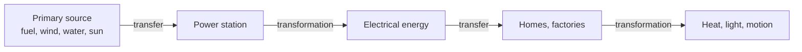

# 8. Electricity

> **Teaching rewrite** of electricity markets: generation, the supply chain, market design and regulation, price drivers, spark/dark spreads, trading conventions, locational pricing, and power derivatives. Original wording; worked numbers recomputed. Prices are teaching values. Not investment advice.

## Introduction

When England lost to Germany in a 1990 World Cup semi-final, UK demand jumped by about **2,800 MW** in minutes — over a million kettles switched on at once. Electricity is the commodity that **can’t be stored** at scale: supply must match demand **every second**, or the lights go out. That single fact shapes everything — from how prices are set to why they can spike to thousands or fall below zero.

This lesson covers:

- How electricity is **made** and **measured** (MW vs MWh, thermal efficiency)
- The **supply chain**: generation, transmission, distribution, supply
- Market design: **pools** vs **bilateral** markets; EU, UK, and US regulation
- **Price drivers**: load, weather, capacity, fuel, renewables, **negative prices**
- **Spark** and **dark spreads**, **heat rates**
- Trading: **load shapes**, contract volumes, **merit order**, imbalances, UK **EFA** calendar, US **locational marginal pricing** and **FTRs**
- Derivatives: forwards, swaps, **CfDs**, swaptions, spread options, embedded optionality, ratio swaps, **heat rate options**

:::info Lesson 7
Lesson 7 (natural gas) is reserved for the next chapter of the source; this lesson uses gas only as a generating fuel.
:::

---

## 8.1 What electricity is

Electrons moving between atoms create a current. Electricity is a **secondary** energy source: it must be **transformed** from a primary source and **transferred** to where it’s used, then transformed again into heat, light, sound, or motion.

- **Thermal plants** (gas, coal, nuclear, oil): boil water → steam → turbine → generator (**electromagnetic induction**, like a bicycle dynamo).
- **Wind, wave, hydro, tidal**: movement drives the generator directly.
- **Solar**: photovoltaic panels convert light directly; solar-thermal plants make steam.

### Fuel mix

| Fuel | USA 2003 | USA 2018 | UK 2004 | UK 2016 |
|---|---|---|---|---|
| Natural gas | 16% | 35% | 40% | 42% |
| Coal | 51% | 27% | 33% | 9% |
| Nuclear | 20% | 19% | 19% | 21% |
| Renewables | 7% | 17% | 1% | 25% |

Shale gas pushed US generation from coal to gas; the UK has moved to gas and renewables — and closed its **last coal plant in 2024**. Norway is almost **100% hydro**: exports in wet years, imports in dry ones.

### Thermal efficiency

Electrical output ÷ energy input. Combined-cycle gas ≈ **47–49%**; nuclear ≈ **38%**; coal ≈ **36%**. The rest leaves as heat (the plumes from cooling towers).

### Plant types

| Plant | How | Role |
|---|---|---|
| **CHP** (combined heat & power) | Gas-fired; captures waste steam/hot water for heating | Efficient where heat is needed |
| **CCGT** (combined cycle gas turbine) | Gas turbine + steam turbine from exhaust heat | Efficient baseload/mid-merit |
| **OCGT** (open cycle) | Gas turbine only | Less efficient but **ramps fast** — peaking/reserve |

### Measuring electricity

| Unit | Meaning |
|---|---|
| **W, kW, MW, GW** | **Power** — an instantaneous rate (a 100 W bulb draws 100 W at any moment) |
| **Wh, kWh, MWh, GWh, TWh** | **Energy** — power × time (ten 100 W bulbs for 1 hour = 1 kWh) |
| **Volt** | “Pressure” pushing electrons |

Buying a **100 MW** plant = capacity; using **100 MWh** = 100 MW for one hour. US homes used about **1,462 bn kWh** in 2018.

---

## 8.2 The supply chain

| Link | Role |
|---|---|
| **Generators** | Build and run power stations — portfolios or independents |
| **Transmission system operator (TSO)** | High-voltage **grid**: schedules flows, **balances supply and demand in real time**, manages reserves and emergencies, plans new lines |
| **Distribution (DSO)** | Substations step down voltage; local networks to homes |
| **Suppliers** | Sell to and bill end users |
| **End users** | Domestic, commercial, industrial |

In Great Britain, National Grid owns transmission, while system balancing moved to the publicly owned **National Energy System Operator (NESO)** in 2024.

**UK household bill (source era)**: wholesale ≈ 32%, network ≈ 23%, environmental/social obligations ≈ 20%, operating ≈ 17%, VAT ≈ 5%, supplier margin < 1%.

Rooftop solar, batteries, smart homes, and EVs are reshaping this chain.

---

## 8.3 Market structure and regulation

### Pools vs bilateral markets

**Pool**: generators bid into a central auction run by the system operator; everyone is paid the **highest accepted bid** — the **system marginal price**.

**Worked example**: demand **1,000 MW**; four generators each offer 250 MW at **60, 65, 70, 75**.

| Demand | In merit | Clearing price |
|---|---|---|
| 1,000 MW | I, II, III, IV | **75** |
| 750 MW | I, II, III (IV out of merit) | **70** |

**Bilateral** (e.g. Great Britain): buyers and sellers contract directly (OTC or on exchange), **notify** the system operator of net positions by **gate closure**, and sellers self-dispatch; the operator balances the residual.

### Europe

- Regulations apply directly; **directives** set goals each state implements.
- 1996 First Electricity Directive: large customers choose suppliers; third-party network access; **unbundling** of networks (regulated) from generation and supply (competitive). 2003 and 2009 packages extended this toward an integrated, price-convergent market.
- **ACER** (2011) coordinates regulators. **REMIT** bans market abuse (manipulation, insider trading), requires disclosure of inside information and reporting of suspicious trades.

### Great Britain

**NETA** (2001) introduced bilateral trading, a **balancing mechanism**, a single notional delivery point, short-term power exchanges, OTC derivatives, and imbalance settlement; extended to Scotland as **BETTA** (2005).

### United States

A patchwork: competitive markets in some regions, vertically integrated utilities in others.

- Suppliers: **investor-owned utilities** (~51% of sales), **power marketers** (~22%), public utilities (~14%), **co-ops** (~11%), federal agencies (e.g. Tennessee Valley Authority).
- **FERC** regulates wholesale markets; states regulate retail.
- **ISOs/RTOs** run grids and markets: **CAISO, ERCOT, MISO, ISO-NE, NYISO, PJM, SPP**.
- **NERC** sets reliability standards (adequacy and security) via regional entities.

<GuidedChoiceExplanation preset="comm-power-market" />

---

### Checkpoint 1: basics and market design

<MultipleChoice
  id="comm-ch8-mid1"
  title="Checkpoint — sections 8.1 to 8.3"
  questions={[
    {
      prompt: 'Twenty 50 W bulbs run for 3 hours. Energy used?',
      choices: ['1 kWh', '3 kWh', '150 W', '3 MWh'],
      answer: 1,
      why: '20 × 50 W = 1,000 W × 3 h = 3,000 Wh = 3 kWh.',
    },
    {
      prompt: 'A CCGT plant has 48% thermal efficiency. Gas input 1,000 MWh (thermal). Electricity out?',
      choices: ['48 MWh', '480 MWh', '520 MWh', '2,083 MWh'],
      answer: 1,
      why: '1,000 × 48%.',
    },
    {
      prompt: 'Pool: offers 200 MW at 50, 200 MW at 58, 200 MW at 66, 200 MW at 90. Demand 500 MW. Clearing price?',
      choices: ['58', '66', '90', 'Average 66'],
      answer: 1,
      why: 'Need the third block (400–600 MW) → 66 for everyone.',
    },
    {
      prompt: 'Which plant suits sudden demand spikes?',
      choices: ['Nuclear', 'OCGT', 'Coal', 'CHP'],
      answer: 1,
      why: 'Open-cycle gas turbines ramp quickly.',
    },
    {
      type: 'order',
      prompt: 'Rank the electricity supply chain.',
      items: ['Generation', 'Transmission (high voltage)', 'Distribution (low voltage)', 'Supply (billing)', 'End user'],
      why: 'Power flows down the voltage chain to customers.',
    },
  ]}
/>

---

## 8.4 Price drivers

Because power can’t be stored, **today’s** high price says little about **tomorrow’s**. Shortfalls cause **blackouts** (or **brownouts** — dimming).

### Load

- **Baseload**: the steady minimum, served by baseload plants.
- **Peak**: the highest demand, served by peakers; **intermediate** in between.
- Load shape depends on user type, time of day, season, region (US peaks in summer except the north and Florida).

### Demand drivers

| Driver | Example |
|---|---|
| Economic activity | More output → more power |
| **Weather** | Temperature, humidity, cloud, rain; **heating/cooling degree days** relative to ~21 °C (70 °F) |
| Time and calendar | Peak (working hours) vs off-peak, weekends, seasons (winter Oct–Mar, summer Apr–Sep) |
| User type | Households weigh weekends; industry weekdays |
| **Special events** | Britain’s “**TV pick-up**” at the end of matches and soaps |
| Efficiency | Better appliances reduce demand |
| **EVs** | See below |

**EV demand model**: EVs × km driven × kWh/km + grid losses (7–8%).
**Example**: 1 m EVs × 12,000 km × 0.18 kWh/km = **2.16 TWh**; +7.5% losses → **≈ 2.32 TWh** to generate. Unmanaged evening charging collides with peak demand — hence “managed” overnight charging.

### Supply drivers

- **Capacity**: plant types, outages, maintenance, transmission limits.
- **Reserve margin** = (installed capacity − peak demand) / installed capacity. Typical targets ~15–17% (US); below ~10–13%, scarcity premiums climb steeply.
- **Interconnectors** (GB links to France, Netherlands, Ireland and more) move power toward higher prices.
- **Marginal fuel**: cheapest plants run first (wind, hydro, nuclear), then gas or coal; the **marginal** plant’s fuel sets the price. Gas prices matter most when gas is marginal.
- **Renewables** and **bidding behaviour**.

### Spot vs forward

- Short-dated: plant availability, fuel prices, rain, wind, interconnectors, temperature, carbon.
- Long-dated: forward fuel, new/retired capacity, reservoirs, weather trends, carbon, growth.
- Forwards can’t be cash-and-carried (no storage) → **forward ≈ expected spot ± risk premium** (usually a premium); curves show **seasonality** (winter dearer in Europe).

### Negative prices

Occur when demand is low, wind/solar abundant, and inflexible plants (nuclear, coal) prefer paying to run over costly shutdown/restart; also from **transmission constraints** and **subsidies** (generators still earn the subsidy). Examples: Germany intraday **−EUR 500/MWh** (2012); US Northwest hydro, California solar, PJM/Texas night wind; Great Britain in 2019 (as low as −GBP 70/MWh). They have become more frequent as renewables grow.

:::info Price spikes too
In February 2021, Winter Storm Uri drove ERCOT (Texas) prices to the **USD 9,000/MWh** cap for days — the mirror image of negative prices.
:::

<GuidedChoiceExplanation preset="comm-power-price" />

---

## 8.5 Spark and dark spreads, heat rates

**Spark spread** = power − gas cost; **dark spread** = power − coal cost — the generator’s gross margin. Adjusted for carbon = **clean** spread.

> Raw spread = power − fuel cost per MWh ÷ efficiency
> Clean spread = raw spread − (t CO₂ per MWh × carbon price)

Conventions: gas efficiency **49.13%**, CO₂ factor **0.42 t/MWh**; coal efficiency **36%**, **0.85 t/MWh**.

### Worked example: clean spark spread (GB)

Power **GBP 34.50/MWh**; gas **36p/therm**; carbon **GBP 10.75/t**.

| Step | Calculation | GBP/MWh |
|---|---|---|
| Gas in GBP/therm | 36p ÷ 100 | 0.36 |
| Gas per MWh (thermal) | 0.36 ÷ 0.0293071 | 12.28 |
| Fuel per MWh of power | 12.28 ÷ 0.4913 | 25.00 |
| **Raw spark** | 34.50 − 25.00 | **9.50** |
| Carbon cost | 0.42 × 10.75 | 4.52 |
| **Clean spark** | 9.50 − 4.52 | **4.98** |

### Worked example: clean dark spread

Coal **USD 71.15/short ton**, GBP 1 = USD 1.90 → GBP 37.45; at 7 MWh/t → **GBP 5.35/MWh**.

Raw dark = 34.50 − 5.35 / 0.36 = **19.64**; clean dark = 19.64 − 0.85 × 10.75 = **10.50**.

Coal burns dirtier, so carbon prices hit coal harder (bigger effect in coal-heavy Germany than in Britain). Generators **sell the spread** (sell power, buy fuel forward) to lock in margin — mostly OTC, since power futures are less liquid.

### Heat rates

**Heat rate** = fuel input per unit of power (MMBtu/MWh) = the inverse of efficiency (1 kWh = 3,412 Btu):

| Efficiency | Heat rate (Btu/kWh) |
|---|---|
| 100% | 3,412 |
| 47% (gas) | ≈ 7,260 |
| 36% (coal) | ≈ 9,478 |

- **Technological** heat rate = input ÷ output (e.g. 3,500 MMBtu ÷ 500 MW = **7 MMBtu/MWh**).
- **Market (implied)** heat rate = power price ÷ gas price.
- Spark spread with heat rates = power − gas × heat rate.

**Example**: power **USD 39.75/MWh**, gas **USD 2.89/MMBtu** → market heat rate ≈ **13.75**; spark at heat rate 7 = 39.75 − 2.89 × 7 = **USD 19.52/MWh**.

:::caution Correction
The source quotes 19.49; 39.75 − 20.23 = **19.52**.
:::

---

### Checkpoint 2: drivers and spreads

<MultipleChoice
  id="comm-ch8-mid2"
  title="Checkpoint — sections 8.4 and 8.5"
  questions={[
    {
      prompt: 'Installed capacity 60 GW; peak demand 52 GW. Reserve margin?',
      choices: ['8.0%', '13.3%', '15.4%', '86.7%'],
      answer: 1,
      why: '(60 − 52) / 60 ≈ 13.3%.',
    },
    {
      prompt: 'Why can power prices turn negative?',
      choices: [
        'Fuel is free',
        'Low demand + abundant renewables + inflexible plants that avoid costly shutdowns (plus subsidies and grid constraints)',
        'Exchanges allow errors',
        'Inflation',
      ],
      answer: 1,
      why: 'Paying to keep running can be cheaper than stopping.',
    },
    {
      prompt: 'Power 60/MWh, gas fuel cost 25/MWh (thermal), efficiency 50%. Raw spark spread?',
      choices: ['35', '10', '47.5', '12.5'],
      answer: 1,
      why: '60 − 25 / 0.5 = 10.',
    },
    {
      prompt: 'Raw spark 10; carbon 80/t; factor 0.42. Clean spark?',
      choices: ['−23.6', '10', '33.6', '−70'],
      answer: 0,
      why: '10 − 33.6 = −23.6 — gas plants lose money at that carbon price.',
    },
    {
      prompt: 'Power USD 50/MWh, gas USD 4/MMBtu. Market heat rate?',
      choices: ['12.5', '200', '0.08', '7'],
      answer: 0,
      why: '50 / 4.',
    },
    {
      type: 'order',
      prompt: 'Rank by thermal efficiency (HIGHEST first).',
      items: ['Combined-cycle gas (~47–49%)', 'Nuclear (~38%)', 'Coal (~36%)'],
      why: 'Lower efficiency = higher heat rate.',
    },
  ]}
/>

---

## 8.6 Trading electricity

Participants: utilities, generators, suppliers, industrial users, banks, hedge funds, brokers, trading houses. Largest European markets: Germany, France, GB, Italy, Spain.

| Participant | Activities |
|---|---|
| Producers | Long-term supply contracts; exchange trades (e.g. EPEX); OTC hedges; futures via exchange members |
| Suppliers | Contracts with producers and end users; exchange balancing; risk solutions |
| Consumers | Fixed-price tariffs (backed by suppliers’ swaps); large users hedge directly |
| Intermediaries | Views, cross-market arbitrage, market making, brokerage, structured products |

### Load shapes

| Shape | Typical definition |
|---|---|
| **Baseload** | 24 hours a day |
| **Peak** | e.g. 07:00–19:00 weekdays (GB) |
| **Off-peak** | All other hours |
| **Overnight** | e.g. 23:00–07:00 |

### Contract volumes and values

Traded in **MW** (rate), settled in **MWh** (energy). GB has **48 half-hour** settlement periods per day.

| Trade | Total volume | Daily | Per half-hour | Value |
|---|---|---|---|---|
| **Winter peak 20 MW** (12 h × 5 d × 26 wk) | 20 × 12 × 5 × 26 = **31,200 MWh** | 240 | 10 | at GBP 14 → **GBP 436,800** |
| **Summer base 100 MW** (24 h × 7 d × 26 wk) | 100 × 24 × 7 × 26 = **436,800 MWh** | 2,400 | 50 | at GBP 15 → **GBP 6,552,000** |

### Price formation: the merit order

Price tends toward **short-run marginal cost**. A producer stacks plants by operating cost:

| Fuel | Capacity (MW) | Cost (USD/MWh) |
|---|---|---|
| Nuclear | 360 | 70 |
| Renewable | 120 | 80 |
| Natural gas | 350 | 110 |
| Coal | 130 | 120 |
| Diesel | 40 | 150 |

Demand **500 MW** = nuclear 360 + renewable 120 + gas **20** → price set by gas: **USD 110/MWh**. Spare capacity 500 MW. In reality the stack curves sharply upward near full capacity (“the devil’s elbow”), where **scarcity premiums** appear.

### Optimising production and timing

Producers forecast demand (contracts, weather, events, history) and choose to generate, buy from others, or hedge forward — refining positions via annual, seasonal, monthly, and shape-specific contracts, then **day-ahead** and **intraday** auctions. Traded volume far exceeds physical output (e.g. GB 2018: ~333 TWh generated, ~884 TWh traded OTC; Germany ~540 TWh vs ~5,330 TWh).

**Imbalances**: after **gate closure** (e.g. one hour ahead), parties submit final physical notifications; the operator resolves deviations with bids/offers and charges those who were out of balance. Causes include trading mismatches, generation over/under-delivery, demand forecast errors, plant failures, scheduling errors, and transmission losses (~10% rule of thumb).

**Timing mismatch**: generators want long-dated sales (to service plant loans); consumers buy shorter-dated — intermediaries bridge the gap.

### GB conventions: the EFA calendar

Pre-2014 GB trading used the **Electricity Forward Agreement** calendar: seasons (summer EFA Apr–Sep, winter Oct–Mar), quarters, EFA months, numbered weeks, EFA days running **23:00 to 23:00**, and six **4-hour blocks**:

| Block | 1 | 2 | 3 | 4 | 5 | 6 |
|---|---|---|---|---|---|---|
| Hours | 23–03 | 03–07 | 07–11 | 11–15 | 15–19 | 19–23 |

“WD3” = weekday 07:00–11:00. Gregorian contracts were added in 2014, but block indices persist.

### US: locational marginal pricing (LMP)

US power is **regional** — main markets CAISO, MISO, ISO-NE, NYISO, PJM, SPP, ERCOT, with many trading hubs (e.g. PJM West, SP-15, NP-15). When transmission is congested, prices differ by **node**.

**Worked example**: node A demand **50 MWh**, generator cost **USD 10**; node B demand **100 MWh**, cost **USD 15**; line A→B limited to **80 MWh**.

- Dispatch: A produces 50 + 80 = **130 MWh**; B produces **20 MWh**.
- LMPs: A **10**, B **15** (all B load pays 15).

| | Calculation | USD |
|---|---|---|
| Collected | 50 × 10 + 100 × 15 | **2,000** |
| Paid to generators | 130 × 10 + 20 × 15 | **1,600** |
| **Congestion revenue** | | **400** |

:::caution Correction
The source’s totals (1,500 collected, 1,300 paid) don’t match its own lines; the figures above add up.
:::

**Financial transmission rights (FTRs)**: auctioned contracts paying the **price difference** between two nodes in the stated direction (and charging if it reverses). Generator A selling into B with an A→B FTR receives **USD 5/MWh** here, restoring the B price.

<GuidedChoiceExplanation preset="comm-power-trading" />

---

### Checkpoint 3: trading

<MultipleChoice
  id="comm-ch8-mid3"
  title="Checkpoint — section 8.6"
  questions={[
    {
      prompt: 'A 15 MW winter peak contract (12 h, 5 days, 26 weeks). Total MWh?',
      choices: ['23,400', '65,520', '4,680', '180'],
      answer: 0,
      why: '15 × 12 × 5 × 26 = 23,400.',
    },
    {
      prompt: 'Same contract at GBP 50/MWh. Value?',
      choices: ['GBP 1,170,000', 'GBP 750', 'GBP 3,276,000', 'GBP 234,000'],
      answer: 0,
      why: '23,400 × 50.',
    },
    {
      prompt: 'Merit order example with demand 700 MW. Marginal fuel and price?',
      choices: ['Gas, 110', 'Coal, 120', 'Nuclear, 70', 'Diesel, 150'],
      answer: 0,
      why: 'Nuclear 360 + renewable 120 = 480; gas covers 220 of its 350 MW.',
    },
    {
      prompt: 'Why can’t power forwards be priced by cash-and-carry?',
      choices: [
        'Interest rates are zero',
        'Electricity can’t be stored, borrowed, or lent',
        'Forwards are illegal',
        'Spot prices are fixed',
      ],
      answer: 1,
      why: 'Forwards reflect expected supply and demand plus a risk premium.',
    },
    {
      prompt: 'Node A LMP 22, node B LMP 31. An A→B FTR on 50 MWh pays…',
      choices: ['USD 450', 'USD 1,550', 'USD 1,100', 'USD 0'],
      answer: 0,
      why: '(31 − 22) × 50.',
    },
  ]}
/>

---

## 8.7 Electricity derivatives

### Forwards

Priced from expected supply/demand (no arbitrage to spot). Uses: price certainty, avoiding volatile spot, securing supply, separating supply from risk (financial forwards), speculation, financing requirements.

Terms: trade date, buyer, seller, governing contract, price, volume, **load shape**, delivery schedule and **point**.

- **French example**: 50 MW for 12 hours (08:00–20:00) on one day → 600 MWh × EUR 60 = **EUR 36,000**.
- **GB example**: 50 MW baseload for one day → 1,200 MWh at GBP 32.
- **Floating (index) forwards**: price set at delivery from an index.

**Cross-border trade**: France **EUR 55**, Germany **EUR 60**, interconnector capacity **EUR 3/MWh**, **100 MW** annual baseload → (60 − 55 − 3) × 24 × 365 × 100 = **EUR 1,752,000**.

### Swaps

Fixed vs floating, cash-settled — e.g. against an index of day-ahead baseload prices.

**Example**: a hedge fund pays fixed **GBP 45.50** on **30 MW** winter baseload; a 31-day month averages **GBP 40.00**:

- Pays 30 × 45.50 × 24 × 31 = **1,015,560**; receives 30 × 40 × 744 = **892,800** → net **pays GBP 122,760**.

The fixed price ≈ a weighted average of the monthly forwards — the fixed payer must “beat the forward”. Suppliers pay fixed to fix costs; generators receive fixed to fix revenue. Continental swaps: monthly calculation periods, baseload/peak/off-peak, payment 5 or 20 days in arrears, hourly floating prices (e.g. 92-day baseload at 6 MWh/h = **13,248 MWh**).

### Contracts for difference (GB low-carbon CfDs)

The government-owned **Low Carbon Contracts Company** pays or receives the difference between a **strike** and a **reference price** for **15 years**.

Onshore wind strike **GBP 79.23**:

| Market price | Generator sells at | CfD | Net |
|---|---|---|---|
| 70.00 | 70.00 | **+9.23** | 79.23 |
| 85.00 | 85.00 | **−5.77** | 79.23 |

(Strike prices are set in competitive allocation rounds and indexed to inflation.)

### Swaptions and collars

A manufacturer could **pay fixed GBP 50/MWh** on half its 25 GWh/month use for 12 months. At an average of 55 it receives **5**; at 40 it pays **10** — net 50 either way.

A **payer swaption** gives the **right** to pay fixed — suits a buyer who expects prices to **fall** but wants protection. Most corporates avoid premiums, so banks offer a **min-max** (zero-cost collar): buy a payer swaption (cap) and sell one at a lower strike (floor).

### Spread options

Options on **spark/dark spreads**, or on **cross-border** differences (e.g. a UK chemicals maker protected if UK power rises relative to France).

### Monetising embedded optionality

An aluminium smelter with a flexible supply contract can stop smelting and **resell its power** when power prices spike. An **indifference curve** marks power/aluminium price pairs where it doesn’t care. It can **sell OTM power calls** (e.g. strike **USD 100**, premium **USD 3**, power at 80) — exercise leads to a **forward** sale, giving time to shut down. Higher implied vol → more premium. Risk: if aluminium rises, the curve shifts — a two-asset barrier can help.

### Ratio swap: power and aluminium

The smelter swaps floating aluminium revenue to fixed **and** floating power cost to fixed, in a ratio (e.g. **14 MWh per tonne**), locking its smelting margin in one structure.

### US monthly and daily “power swaps” and swaptions

US “power swaps” are effectively **physically settled forwards** for a region and month (or day), settling just before delivery.

**Monthly swaption example**: European call, PJM West peak (16 h × 23 weekdays), **100 MW** → **36,800 MWh**, strike **USD 50**, premium **USD 5/MWh**, cash-settled vs CME futures. Power implied vols above **100%** are common.

**Daily swaptions** = a strip of daily options — dearer than one monthly option (up to 23 chances to pay vs one).

**Generator selling put swaptions** (strike 50, premium 5):

| Market price | Physical | Premium | Option | Net |
|---|---|---|---|---|
| 60 | +60 | +5 | 0 | **65** |
| 50 | +50 | +5 | 0 | **55** |
| 45 | +45 | +5 | −5 | **45** |
| 30 | +30 | +5 | −20 | **15** |

Income boost in normal markets, double hit in a slump.

### Heat rate options

A **heat rate call** pays: **max(power − heat rate strike × gas price − variable charge, 0)** — a call on the spark spread. It mimics owning a gas plant.

**Daily example** (strike heat rate 7, gas **USD 5/MMBtu**, ignoring variable charge):

| Day | Power | Market heat rate | Payoff per MWh |
|---|---|---|---|
| 1 | 40 | 8 | **5** |
| 2 | 35 | 7 | 0 |
| 3 | 30 | 6 | 0 |

Typical term sheet: daily peak (08:00–23:00 → **1,500 MWh/day** at 100 MW), ~250 days → **375,000 MWh**, monthly premium **USD 11,000** (**132,000/yr**), variable charge USD 3.50/MWh, ISO New England day-ahead power vs Henry Hub gas.

Uses: generators **buy puts** (margin protection) or **sell OTM calls** (income); traders take **correlation** views (calls gain as power–gas correlation falls); delta-hedge with forwards, other Greeks with heat rate or single-commodity options.

<GuidedChoiceExplanation preset="comm-power-derivs" />

---

### Checkpoint 4: derivatives

<MultipleChoice
  id="comm-ch8-mid4"
  title="Checkpoint — section 8.7"
  questions={[
    {
      prompt: 'Fixed payer at GBP 48 on 20 MW baseload for a 30-day month; average 52. Net cash flow?',
      choices: ['+57,600', '−57,600', '+2,880', '0'],
      answer: 0,
      why: '(52 − 48) × 20 × 24 × 30 = 57,600 received.',
    },
    {
      prompt: 'CfD strike 79.23; market 92.00. Generator’s CfD cash flow per MWh?',
      choices: ['+12.77', '−12.77', '0', '+92.00'],
      answer: 1,
      why: 'Pays back the excess above the strike.',
    },
    {
      prompt: 'Heat rate call: strike 7.5, gas 4.00, power 36.00, variable charge 2.00. Payoff per MWh?',
      choices: ['4.00', '6.00', '0', '2.00'],
      answer: 0,
      why: '36 − (7.5 × 4 + 2) = 36 − 32 = 4.',
    },
    {
      prompt: 'France 48, Germany 53, capacity cost 2.50, 50 MW for one day baseload. Profit?',
      choices: ['EUR 3,000', 'EUR 6,000', 'EUR 2,500', 'EUR 125'],
      answer: 0,
      why: '(53 − 48 − 2.5) × 24 × 50 = 3,000.',
    },
    {
      prompt: 'Why is a daily swaption strip dearer than one monthly swaption?',
      choices: [
        'Daily options use lower vol',
        'It can pay out on every day instead of once',
        'It is cash-settled',
        'It has no strike',
      ],
      answer: 1,
      why: 'More exercise opportunities.',
    },
    {
      type: 'order',
      prompt: 'Rank the generator’s net revenue from the short put swaption table (HIGHEST first).',
      items: ['Price 60 → 65', 'Price 50 → 55', 'Price 45 → 45', 'Price 30 → 15'],
      why: 'Below the strike, the option payout compounds the physical fall.',
    },
  ]}
/>

---

### Rank: electricity practice

<MultipleChoice
  id="comm-ch8-rank"
  title="Electricity practice"
  questions={[
    {
      type: 'order',
      prompt: 'Rank the merit order from FIRST to LAST dispatched.',
      items: ['Nuclear (70)', 'Renewable (80)', 'Natural gas (110)', 'Coal (120)', 'Diesel (150)'],
      why: 'Cheapest variable cost first.',
    },
    {
      type: 'order',
      prompt: 'Rank the GB trading sequence for a delivery period.',
      items: ['Forward/seasonal hedges', 'Day-ahead auction', 'Intraday trading', 'Gate closure and final notification', 'Real-time balancing and imbalance settlement'],
      why: 'Positions are refined until gate closure; the operator then balances.',
    },
  ]}
/>

---

### Check: electricity

<MultipleChoice
  id="comm-ch8"
  title="Electricity"
  questions={[
    {
      prompt: 'MW measures ____; MWh measures ____.',
      choices: ['energy; power', 'power (rate); energy (power × time)', 'voltage; current', 'price; volume'],
      answer: 1,
      why: 'Contracts are traded in MW and settled in MWh.',
    },
    {
      prompt: 'In a pool, every accepted generator is paid…',
      choices: ['Its own bid', 'The system marginal (highest accepted) price', 'The average bid', 'A regulated tariff'],
      answer: 1,
      why: 'Uniform clearing price.',
    },
    {
      prompt: 'What sets the wholesale price in a merit-order market?',
      choices: ['The cheapest plant', 'The marginal plant’s cost', 'The average cost', 'The regulator'],
      answer: 1,
      why: 'Usually gas or coal.',
    },
    {
      prompt: 'Clean dark spread: power 60, coal fuel 10/MWh, efficiency 36%, carbon 50, factor 0.85?',
      choices: ['−10.28', '32.22', '17.78', '−0.28'],
      answer: 0,
      why: '60 − 27.78 = 32.22; − 42.50 = −10.28.',
    },
    {
      prompt: 'An LMP congestion example collects 2,000 and pays 1,600. Congestion revenue?',
      choices: ['400', '3,600', '0', '1,600'],
      answer: 0,
      why: 'Collected − paid.',
    },
    {
      prompt: 'A heat rate call option behaves like…',
      choices: ['A call on gas', 'A call on the spark spread (owning a gas plant)', 'A put on power', 'A swap'],
      answer: 1,
      why: 'Pays when power exceeds gas × heat rate.',
    },
  ]}
/>

---

## Calculate: numeric practice

Type the number (no units; minus sign for payments). 1 therm = 0.0293071 MWh.

### Formula sheet

| Item | Formula |
|---|---|
| Energy | MW × hours |
| Contract volume | MW × hours/day × days |
| Reserve margin | (capacity − peak) ÷ capacity |
| Raw spark / dark | power − fuel per MWh ÷ efficiency |
| Clean spread | raw − CO₂ factor × carbon price |
| Market heat rate | power ÷ gas |
| Spark (heat rate) | power − gas × heat rate |
| Swap net (fixed payer) | (floating − fixed) × MW × hours |
| CfD payment to generator | strike − market price |
| Heat rate call | max(power − HR × gas − charge, 0) |

<NumericQuiz
  id="comm-ch8-calc"
  title="Calculate: electricity"
  decimals={2}
  questions={[
    {
      prompt: 'Summer baseload 100 MW for 26 weeks (24 h × 7 days). Total MWh?',
      answer: 436800,
      why: '100 × 24 × 7 × 26.',
      decimals: 0,
    },
    {
      prompt: 'Winter peak 20 MW (12 h × 5 days × 26 weeks) at GBP 14/MWh. Contract value (GBP)?',
      answer: 436800,
      why: '31,200 MWh × 14.',
      decimals: 0,
    },
    {
      prompt: 'Reserve margin in %: capacity 75 GW, peak demand 66 GW (2 dp)?',
      answer: 12,
      why: '9 / 75 = 12%.',
    },
    {
      prompt: 'Gas 36p/therm; power GBP 34.50/MWh; efficiency 49.13%. Raw spark spread (2 dp)?',
      answer: 9.5,
      why: '0.36 / 0.0293071 = 12.28; / 0.4913 = 25.00; 34.50 − 25.00 = 9.50.',
    },
    {
      prompt: 'Raw spark 9.50; carbon GBP 10.75/t; factor 0.42. Clean spark (2 dp)?',
      answer: 4.98,
      why: '9.50 − 4.515 ≈ 4.98.',
    },
    {
      prompt: 'Power 34.50; coal fuel cost GBP 5.35/MWh; efficiency 36%; carbon 10.75; factor 0.85. Clean dark spread (2 dp)?',
      answer: 10.5,
      why: '34.50 − 14.86 = 19.64; − 9.14 = 10.50.',
    },
    {
      prompt: 'Power USD 39.75/MWh; gas USD 2.89/MMBtu. Spark spread at heat rate 7 (2 dp)?',
      answer: 19.52,
      why: '39.75 − 20.23.',
    },
    {
      prompt: 'Merit order: nuclear 360 MW @70, renewable 120 @80, gas 350 @110, coal 130 @120. Demand 900 MW. Clearing price?',
      answer: 120,
      why: '360 + 120 + 350 = 830 < 900 → coal is marginal.',
      decimals: 0,
    },
    {
      prompt: 'Fixed payer GBP 45.50 on 30 MW baseload, 31-day month averaging GBP 40.00. Net cash flow (negative = pays)?',
      answer: -122760,
      why: '(40 − 45.50) × 30 × 744.',
      decimals: 0,
    },
    {
      prompt: 'France EUR 55, Germany EUR 60, capacity EUR 3/MWh, 100 MW annual baseload (365 days). Profit (EUR)?',
      answer: 1752000,
      why: '2 × 24 × 365 × 100.',
      decimals: 0,
    },
    {
      prompt: 'LMP: node A demand 50 @ USD 10, node B demand 100 @ USD 15, line limit 80 MWh. Congestion revenue (USD)?',
      answer: 400,
      why: 'Collected 2,000 − paid 1,600.',
      decimals: 0,
    },
    {
      prompt: 'Heat rate call: strike 7, gas USD 5, power USD 40, variable charge USD 3.50, 1,500 MWh that day. Payoff (USD)?',
      answer: 2250,
      why: '40 − (35 + 3.50) = 1.50 × 1,500.',
      decimals: 0,
    },
  ]}
/>

### Randomized practice

<NumericQuiz id="comm-ch8-calc-random" title="Practice: power drills" bank="commPower" rounds={6} />

---

## Takeaways

:::tip Remember
- Power can’t be stored: supply = demand **every second**; MW (rate) vs MWh (energy)
- Chain: generation → transmission (TSO) → distribution → supply; networks regulated, generation/supply competitive
- **Pools** pay the marginal price; **bilateral** markets self-dispatch and settle imbalances
- Prices follow **load, weather, reserve margin, marginal fuel, renewables** — spiking or going **negative**
- **Spark/dark spreads** (and **clean** versions with carbon) and **heat rates** measure generator margins
- Contracts by **load shape**; value = MWh × price; the **merit order** sets price; GB **EFA** blocks; US **LMP** and **FTRs**
- Derivatives: forwards, swaps, **CfDs**, swaptions/collars, spread options, embedded optionality, ratio swaps, **heat rate options**
:::

## Further Reading

- [6. Crude oil](./crude-oil)
- [2. Derivative valuation](./derivative-valuation) — negative prices and spread options
- Next: [9. Plastics](./plastics)
- Energy Institute *Statistical Review of World Energy*; US EIA; Ofgem; ACER; NERC
- Background: N. Schofield, *Commodity Derivatives: Markets and Applications* (Wiley) — used as a study outline; V. Kaminski, *Energy Markets* (2012)
