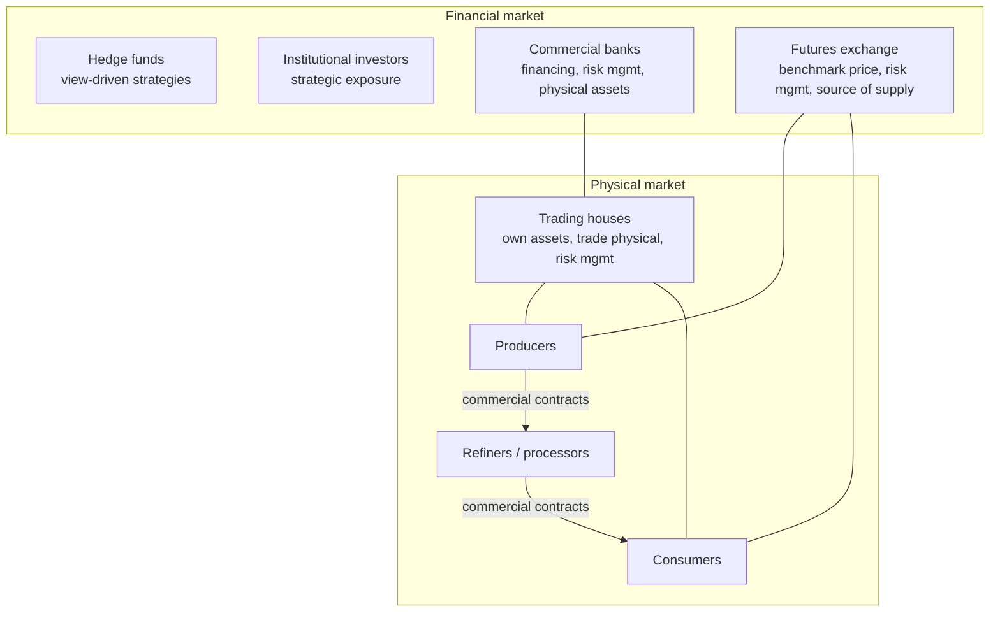

# 1. Fundamentals of Commodities and Derivatives

> **Teaching rewrite** of commodity-market fundamentals. Original wording; prices are illustrative (gold around USD 1,400 is a teaching number, not today’s market). Not investment advice.

## Introduction

“What are commodities?” sounds simple. Mostly they are **unprocessed or semi-processed goods** that are consumed or processed and resold — crude oil, copper, wheat. But the definition leaks: **freight** and **carbon emissions** are traded like commodities without being goods at all.

| Group | Examples |
|---|---|
| **Energy** | Crude oil and refined products (WTI, Brent, gasoline); power and natural gas; natural gas liquids (propane, butane); coal |
| **Industrial (base) metals** | Copper, aluminium |
| **Precious metals** | Gold, silver |
| **Agricultural** | Grains; softs (coffee, cocoa, sugar); livestock |
| **Specialty** | Forest products (pulp, recovered paper); carbon emissions; weather; freight |

This lesson covers:

- The **physical vs financial** market and its main **participants**
- **Price discovery**: exchanges and **price reporting agencies (PRAs)**
- **Traded vs non-traded** commodities — the iron ore story
- The four core derivatives: **forwards, futures, swaps, options**
- **Exotic options**: binary, barrier, spread, and average rate

---

## 1.1 Market overview

Think of crude oil. Producers extract it, refiners turn it into gasoline and diesel, consumers buy the products. Trading houses move and store it; banks finance it; investors and hedge funds take price exposure; the **futures exchange** provides the **benchmark price**.

Five features shape every commodity market:

| Feature | Meaning | Crude oil example |
|---|---|---|
| **Not homogeneous** | “Crude oil” means many grades with different chemistry — 150+ traded types | Light sweet vs heavy sour |
| **Must be transformed** | Commodities become consumer goods only after processing | Crude → refinery → gasoline |
| **Benchmarks** | Non-identical grades are priced **relative** to an agreed reference | A grade priced at “Brent futures + USD 1.20” |
| **Transport** | Production and consumption happen in different places; the mode varies | Pipeline/rail in the US, tankers in Europe/Asia |
| **Storage** | Production and consumption happen at different times; inventories bridge the gap | Tank farms, floating storage |

---

## 1.2 Market participants

Derivatives let each participant **avoid, retain, transfer, reduce, or increase** risk — matching different risk profiles with each other.

### Physical participants

| Participant | Main price risk |
|---|---|
| **Producers** (miners, oil companies, farmers) | **Falling** prices |
| **Consumers** (airlines, manufacturers, food companies) | **Rising** prices |
| **Refiners, processors, utilities** | **Margins** — output price minus input cost (e.g. gasoline minus crude) |

They also face **credit** risk (customers not paying), **logistics** risk, **quality/sourcing** risk, and **financing** needs.

### Price reporting agencies (PRAs)

Where no liquid futures market exists, how do you know a fair price? **PRAs** (e.g. Platts, Argus) publish **price assessments**: they collect transactions, bids, and offers and apply a methodology — partly **judgement** — to determine a price for a defined grade, location, and timing. IOSCO’s 2012 principles govern how PRAs should do this. Assessments are used to settle **physical supply contracts** and **cash-settled derivatives**.

### Investment banks

Business models vary. A **full-service** bank trades derivatives **and** physical commodities; others offer derivatives only.

| Sector | Problem | Bank solution |
|---|---|---|
| Crude and products | Inventory ties up working capital | Bank owns the inventory |
| Natural gas | Cold snaps raise demand but pipelines are constrained | Bank invests in pipelines or storage |
| Base metals | Consumers want better payment terms | Bank finances the logistics chain or intermediates |

### Commodity trading houses

Traditionally they bought from producers and sold to consumers. Many now **own and operate** mines, refineries, storage, ships, and terminals (Glencore — merged with Xstrata in 2013 — is a well-known example). Around 2013, trading houses handled well over 15 million barrels of oil a day, about half of world grain and soybean flows, and in some niches (zinc, coffee) a few firms dominated.

Growth drivers: the post-2000 emerging-market boom, buying physical assets, exploiting **arbitrage** along their own supply chains, and earlier industry consolidation.

### Hedge funds

Pooled, actively managed vehicles open to a limited investor group, aiming for returns in any market — often **view-driven**. (Amaranth’s 2006 collapse after losing billions in US natural gas is the classic warning.)

### “Real money” accounts

Investors that **can’t borrow** to leverage — pension funds, insurers — plus banks selling commodity investment products to retail clients. Mainly **investment** motivations.

<GuidedChoiceExplanation preset="comm-participants" />

---

### Checkpoint 1: markets and participants

<MultipleChoice
  id="comm-ch1-mid1"
  title="Checkpoint — sections 1.1 and 1.2"
  questions={[
    {
      prompt: 'Which risk does an oil refiner mainly face?',
      choices: [
        'Falling crude prices only',
        'Rising gasoline prices only',
        'Its margin — gasoline revenue minus crude cost',
        'None — refiners pass all costs on',
      ],
      answer: 2,
      why: 'Refiners and processors are exposed to the spread between output and input prices.',
    },
    {
      prompt: 'Why do commodity markets rely on benchmarks?',
      choices: [
        'All commodities are identical',
        'Grades differ, so prices are set relative to an agreed reference grade',
        'Governments require them',
        'Benchmarks remove transport costs',
      ],
      answer: 1,
      why: 'Heterogeneity makes a common reference essential.',
    },
    {
      prompt: 'What does a price reporting agency do?',
      choices: [
        'Runs a futures exchange',
        'Publishes assessed prices from transactions and market data, using a methodology and judgement',
        'Lends money to producers',
        'Stores physical commodities',
      ],
      answer: 1,
      why: 'Assessments matter most where no liquid exchange price exists.',
    },
    {
      prompt: 'A pension fund buys a commodity index product. It is best described as…',
      choices: ['A hedge fund', 'A “real money” investor', 'A trading house', 'A producer'],
      answer: 1,
      why: 'Real money accounts invest without borrowing to leverage.',
    },
    {
      type: 'order',
      prompt: 'Rank the crude oil chain from extraction to end use.',
      items: [
        'Producer extracts crude',
        'Crude is transported and stored',
        'Refiner turns crude into gasoline',
        'Consumer buys gasoline',
      ],
      why: 'Production, logistics, transformation, consumption.',
    },
  ]}
/>

---

## 1.3 Traded vs non-traded commodities: the iron ore story

Iron ore (with steel, the world’s second-largest commodity bloc by value) had **no meaningful spot market before ~2003**:

1. **Annual benchmark era** — Japanese and Korean steelmakers bought from Brazilian and Australian miners on **annual fixed-price bilateral contracts** (April–March).
2. **Demand shock** — China’s demand outgrew what the traditional system supplied; Indian suppliers responded quickly with **one-off** deals → a **spot market** emerged.
3. **Price reporting** — PRAs began publishing **daily** assessments for a standard grade (**62% Fe fines**).
4. **Contract stress** — in the 2008–09 crisis spot fell **below** the annual price; some buyers defaulted on fixed-price contracts to buy cheaper spot.
5. **Derivatives** — exchange-cleared iron ore **swaps** came first, then OTC swaps and **futures** (e.g. SGX, Dalian), forming a **forward curve**.

Why benchmarks matter for “tradability”:

- A **standard reference** based on actual activity, understood by all
- Contracts reference a **transparent**, representative, publicly determined price
- Other grades trade as **differentials** — 58% Fe below the benchmark, 65% above (also reflecting origin and availability)
- A benchmark enables **derivatives** for hedging

:::caution “Spot” is ambiguous
In gold, spot means delivery on **trade date + 2 business days**, like financial markets. In crude oil, “spot” usually means **near-term** physical delivery, often priced off futures.
:::

### Worked example: pricing off a benchmark

Benchmark 62% Fe = **USD 110/t**. A 58% grade trades at a USD 12 discount; a 65% grade at a USD 8 premium.

| Grade | Price |
|---|---|
| 58% Fe | 110 − 12 = **USD 98/t** |
| 62% Fe (benchmark) | **USD 110/t** |
| 65% Fe | 110 + 8 = **USD 118/t** |

If the benchmark rises to USD 120, the differentials (if unchanged) move every grade by +10.

---

## 1.4 Forward contracts

A **forward** fixes **today** the price for delivery at a **future** date. It is negotiated **bilaterally** (over-the-counter, **OTC**).

- Gold for **spot** settles in two days; gold for delivery in **one month** is a **forward**.
- A forward is a **commitment**: you can’t walk away because the spot price moved.
- Both parties can agree to **terminate early** at a “break” amount reflecting current value (**mark-to-market**, or the **exit price** in an arm’s-length deal).
- A **floating forward** commits to buy/sell at a future date, with the price set by formula at delivery (e.g. the average of daily spot prices in the prior month).

### Worked example: forward commitment

You bought **100 oz** of gold forward at **USD 1,430/oz**. At delivery spot is **USD 1,420**.

You must still pay 1,430: economic loss = (1,420 − 1,430) × 100 = **−USD 1,000**. Had spot been 1,450, the gain would be **+USD 2,000**.

---

## 1.5 Futures

A **future** gives the same economic result as a forward — price certainty — but is traded on an **exchange** (e.g. CME Group) with **standardised** terms.

| Feature (CME gold futures) | Specification |
|---|---|
| Trading unit | **100 troy ounces** |
| Price quote | USD and cents per troy ounce |
| Minimum tick | USD 0.10/oz = **USD 10 per contract** |
| Settlement | Physical delivery |
| Quality | 100 oz (±5%) refined gold, fineness ≥ **0.995**, one bar or three 1 kg bars, stamped by an exchange-approved refiner |
| Margin | Required on open positions |

| | Forward (OTC) | Future (exchange) |
|---|---|---|
| Terms | Negotiated | Standardised size, dates, quality |
| Counterparty | The other party | The exchange **clearing house** |
| Margin | Traditionally none; now often collateralised too | **Initial margin** (roughly ~5% of value as a rule of thumb) + daily **variation margin** |
| Exit | Agree a break with the counterparty | Trade out on the exchange |

About **95%** of futures are closed out before expiry — most users want **risk management**, not delivery.

### Worked example: margin

Buy 1 gold future at **USD 1,425** → contract value 1,425 × 100 = **USD 142,500**.

- Initial margin ≈ 5% × 142,500 ≈ **USD 7,125** (illustrative)
- Next day settlement price **1,410** → variation margin = (1,410 − 1,425) × 100 = **−USD 1,500** paid
- Ticks: a move from 1,425.00 to 1,425.30 = 3 ticks × USD 10 = **USD 30**

<GuidedChoiceExplanation preset="comm-instrument-choice" />

---

### Checkpoint 2: benchmarks, forwards, futures

<MultipleChoice
  id="comm-ch1-mid2"
  title="Checkpoint — sections 1.3 to 1.5"
  questions={[
    {
      prompt: 'What turned iron ore into a traded commodity?',
      choices: [
        'Annual fixed-price contracts',
        'A spot market, daily price assessments of a benchmark grade, then derivatives',
        'A ban on exports',
        'Lower steel demand',
      ],
      answer: 1,
      why: 'Benchmark price discovery enabled swaps and futures.',
    },
    {
      prompt: 'Benchmark 62% Fe at USD 100/t; a 60% grade trades at a USD 6 discount. Price?',
      choices: ['USD 106', 'USD 94', 'USD 100', 'USD 60'],
      answer: 1,
      why: '100 − 6 = 94.',
    },
    {
      prompt: 'You sold 200 oz gold forward at 1,400. Spot at delivery is 1,380. Your economic result?',
      choices: ['−USD 4,000', '+USD 4,000', '+USD 2,000', '0'],
      answer: 1,
      why: 'Seller receives 1,400 for gold worth 1,380: +20 × 200 = +4,000.',
    },
    {
      prompt: 'Long 2 gold futures at 1,500; settlement 1,512. Variation margin?',
      choices: ['+USD 1,200', '+USD 2,400', '−USD 2,400', '+USD 24'],
      answer: 1,
      why: '12 × 100 oz × 2 contracts = +2,400 received.',
    },
    {
      type: 'order',
      prompt: 'Rank these from MOST to LEAST standardised.',
      items: ['Exchange-traded future', 'Exchange-cleared swap', 'OTC forward', 'Bespoke physical supply contract'],
      why: 'Exchanges set every term; OTC and physical deals are negotiated.',
    },
  ]}
/>

---

## 1.6 Swaps

In a **swap**, two parties exchange cash flows based on different price indices — usually **fixed vs floating**. A **notional** quantity sizes the flows but is **not** exchanged.

| Market | Typical swap |
|---|---|
| Gold | Pay fixed lease rate vs receive floating lease rate |
| Base metals | Pay fixed aluminium price vs receive **average** price of the near-dated future |
| Oil | Pay fixed WTI vs receive **average** of near-dated WTI futures |

Features:

- Usually **spot-starting** (effective two days after trade); can be **forward-starting**.
- Settlement periods negotiable (1–12 months); flows **net**.
- Commodity swaps typically use an **average** floating price — because the physical exposure is usually priced on an average.
- In base metals a “swap” can simply be a **single-period, cash-settled forward**.

### Who does what

A consumer buying oil monthly at market prices fears rising prices → **pays fixed, receives floating**. The bank on the other side now has the consumer’s original exposure and hedges with an offsetting swap — earning the **bid-offer spread**.

| From the market maker’s quote | Bid | Offer |
|---|---|---|
| Fixed leg | Market maker **pays** fixed | Market maker **receives** fixed |
| Floating leg | Receives floating | Pays floating |
| Jargon | “Buy”, long | “Sell”, short |

Convention: the **buyer receives floating** and pays a single fixed price. To avoid confusion, say explicitly who **pays fixed** and who **receives fixed**.

### Worked example: a consumer’s swap

An airline swaps **10,000 bbl/month**: pays fixed **USD 75**, receives the monthly average WTI.

| Month average | Airline receives (floating − fixed) × 10,000 | Physical purchase cost | Net cost per bbl |
|---|---|---|---|
| USD 80 | +5 × 10,000 = **+USD 50,000** | 80 | **75** |
| USD 70 | −5 × 10,000 = **−USD 50,000** | 70 | **75** |

The swap locks the effective price at **USD 75** either way.

---

## 1.7 Options

A forward locks the buyer in — good if prices rise, bad if they fall. An **option** gives the **right, but not the obligation**, to buy or sell at an agreed price.

| Term | Meaning |
|---|---|
| **Call** | Right to **buy** |
| **Put** | Right to **sell** |
| **Strike** (exercise price) | Agreed trade price |
| **Premium** | Price paid by the buyer (usually upfront; quoted in the underlying’s units, e.g. USD/oz) |
| **European / American / Bermudan** | Exercise only at maturity / any time / on set dates |
| **Physical vs cash settlement** | Deliver the commodity, or pay the difference |

Cash-settled payoffs at expiry:

> **Call** = MAX(underlying − strike, 0)  **Put** = MAX(strike − underlying, 0)

### Moneyness (for a call)

| Spot | Strike | Status |
|---|---|---|
| 1,425 | 1,400 | **In-the-money (ITM)** — strike better than market |
| 1,425 | 1,430 | **Out-of-the-money (OTM)** |
| 1,425 | 1,425 | **At-the-money (ATM)** |

### Profit profiles at expiry

| Position | Gains when | Max loss | Max gain |
|---|---|---|---|
| **Buy call** | Price rises above strike + premium | Premium | Unlimited |
| **Sell call** | Price stays below strike | Unlimited | Premium |
| **Buy put** | Price falls below strike − premium | Premium | Strike − premium |
| **Sell put** | Price stays above strike | Strike − premium | Premium |

The seller’s profile is always the **mirror** of the buyer’s.

### Worked example: call and put

Gold call, strike **1,400**, premium **20**:

| Spot at expiry | Payoff | Profit |
|---|---|---|
| 1,380 | 0 | **−20** |
| 1,420 | 20 | **0** (breakeven = 1,400 + 20) |
| 1,460 | 60 | **+40** |

Gold put, strike **1,400**, premium **15**, spot at expiry **1,350**: payoff 50, profit **+35**. Breakeven = 1,400 − 15 = **1,385**.

### Four uses of options

1. **Directional view** — e.g. buy a call instead of physical gold (less outlay) or a future (limited downside).
2. **Volatility trading** — options carry **implied volatility**, an asset class in its own right.
3. **Hedging** — profiles in between full protection and full participation.
4. **Outperformance** — e.g. a holder of gold sells options to earn premium above money-market rates.

<GuidedChoiceExplanation preset="comm-option-payoff" />

---

### Checkpoint 3: swaps and options

<MultipleChoice
  id="comm-ch1-mid3"
  title="Checkpoint — sections 1.6 and 1.7"
  questions={[
    {
      prompt: 'A producer fears falling prices. Which swap position hedges it?',
      choices: [
        'Pay fixed, receive floating',
        'Receive fixed, pay floating',
        'Pay fixed, receive fixed',
        'No swap can help',
      ],
      answer: 1,
      why: 'If prices fall, the floating payment shrinks and the fixed receipt compensates.',
    },
    {
      prompt: 'Swap: pay fixed USD 60 on 5,000 bbl; monthly average is USD 64. Net payment to you?',
      choices: ['+USD 20,000', '−USD 20,000', '+USD 4,000', '+USD 320,000'],
      answer: 0,
      why: '(64 − 60) × 5,000 = +20,000 received.',
    },
    {
      prompt: 'Why do commodity swaps often use an average floating price?',
      choices: [
        'Averages are always higher',
        'Underlying physical contracts are usually priced on averages, so the hedge matches cash flows',
        'Regulators require it',
        'To avoid paying premium',
      ],
      answer: 1,
      why: 'Matching the commercial exposure avoids cash-flow mismatch.',
    },
    {
      prompt: 'Put strike 1,500, premium 25; spot at expiry 1,440. Profit?',
      choices: ['+60', '+35', '−25', '+85'],
      answer: 1,
      why: 'Payoff 60 − premium 25 = +35.',
    },
    {
      prompt: 'Spot 1,425. A call with strike 1,450 is…',
      choices: ['In-the-money', 'At-the-money', 'Out-of-the-money', 'Knocked out'],
      answer: 2,
      why: 'Buying at 1,450 is worse than the market at 1,425.',
    },
    {
      type: 'order',
      prompt: 'Rank these hedges for a gold buyer by upfront premium (LOWEST first).',
      items: ['Forward purchase (no premium)', 'At-the-money average rate call', 'At-the-money vanilla call', 'In-the-money vanilla call'],
      why: 'Forwards cost nothing upfront; averaging cheapens an option; in-the-money options cost the most.',
    },
  ]}
/>

---

## 1.8 Exotic options

Exotics have payoffs that differ from plain (“vanilla”) European/American options. Four building blocks appear in many structures.

### Binary (digital) options

A bet-like option: if it finishes in the money, the buyer receives a **fixed** amount, regardless of how far in the money. The strike is often (confusingly) called the **barrier**.

> Example: digital call on gold, trigger 1,450, pays **USD 10,000** if gold settles above 1,450 — whether at 1,451 or 1,600.

### Barrier options

Vanilla options that **knock in** (come into existence) or **knock out** (are cancelled) if spot touches a **barrier/trigger**.

| | Barrier in the **out-of-the-money** region | Barrier in the **in-the-money** region |
|---|---|---|
| Name | **Standard** barrier | **Reverse** barrier |
| Call examples | Down-and-in, down-and-out | Up-and-in, up-and-out |
| Put examples | Up-and-in, up-and-out | Down-and-in, down-and-out |

Example (spot **1,425**, call strike **1,430**, 3 months):

| Barrier option | Trigger | Effect |
|---|---|---|
| **Down-and-in** call (standard) | 1,420 | Call is **granted** only if spot falls to 1,420 or lower |
| **Down-and-out** call (standard) | 1,420 | Call is **cancelled** if spot falls to 1,420 or lower |
| **Up-and-in** call (reverse) | 1,435 | Call is granted if spot rises to 1,435 |
| **Up-and-out** call (reverse) | 1,435 | Call is cancelled if spot rises to 1,435 — just as it was paying off |

Barriers are **cheaper** than vanillas because the buyer accepts the chance of having no option.

### Spread options

Pay off on the **difference** between two prices relative to a strike:

> **Call** = MAX(price₁ − price₂ − strike, 0)  **Put** = MAX(strike − price₁ + price₂, 0)

Common in commodities for:

- **Input vs output** — e.g. gasoline minus crude (a **crack spread**)
- **Location** — the same commodity at two delivery points
- **Time** — the same future for two delivery months (a **calendar spread**)

Valuation needs the **correlation** between the two prices. For a call on the spread, **negative** correlation makes a wide spread more likely → **higher** premium; high positive correlation → lower premium.

**Worked example**: crack-spread call, strike **USD 15/bbl**. At expiry gasoline = **USD 95**, crude = **USD 75** → spread 20 → payoff = 20 − 15 = **USD 5/bbl**.

### Average rate options (“avros”)

Probably the **most common** commodity option: the payoff uses the **average** price over a period before maturity.

> **Call** = MAX(average − strike, 0)  **Put** = MAX(strike − average, 0)

They match physical contracts priced on averages, avoiding a cash-flow mismatch between the hedge and the commercial deal. Averaging **dampens volatility**, so avros are **cheaper** than equivalent vanillas — but they are not simply a “cheap” vanilla: the protection is different.

**Worked example**: strike **USD 50**. Monthly settlement prices in the averaging window: **48, 52, 56**.

| Option | Reference price | Payoff |
|---|---|---|
| Vanilla call (final price) | 56 | **USD 6** |
| Average rate call | (48 + 52 + 56) / 3 = 52 | **USD 2** |

Illustrative premiums: a 6-month ATM crude call (strike 50, 30% vol) ≈ **USD 4.20/bbl**; averaging over the last 3 months ≈ **USD 3.96/bbl**.

<GuidedChoiceExplanation preset="comm-exotics" />

---

### Checkpoint 4: exotic options

<MultipleChoice
  id="comm-ch1-mid4"
  title="Checkpoint — section 1.8"
  questions={[
    {
      prompt: 'A digital call pays USD 5,000 if gold settles above 1,500. Gold settles at 1,620. Payoff?',
      choices: ['USD 120', 'USD 5,000', 'USD 5,120', '0'],
      answer: 1,
      why: 'A binary pays a fixed amount regardless of how far in the money.',
    },
    {
      prompt: 'Spot 1,425, call strike 1,430, barrier 1,435 that cancels the option. Name?',
      choices: ['Down-and-in', 'Down-and-out', 'Up-and-in', 'Up-and-out'],
      answer: 3,
      why: 'Barrier above spot, in the money, cancels → reverse up-and-out.',
    },
    {
      prompt: 'Spread call: asset 1 = 82, asset 2 = 70, strike 8. Payoff?',
      choices: ['12', '4', '8', '0'],
      answer: 1,
      why: '82 − 70 − 8 = 4.',
    },
    {
      prompt: 'Why is an average rate option usually cheaper than a vanilla?',
      choices: [
        'It has no strike',
        'An average price is less volatile, so the expected payoff is lower',
        'It is exchange-traded',
        'It never pays out',
      ],
      answer: 1,
      why: 'Averaging dampens price swings.',
    },
    {
      prompt: 'For a call on the spread between two prices, which correlation raises the premium?',
      choices: ['High positive', 'Zero', 'Negative', 'Correlation is irrelevant'],
      answer: 2,
      why: 'Negative correlation makes large spreads more likely.',
    },
    {
      type: 'order',
      prompt: 'Average rate call, strike 100. Rank these averaging outcomes by payoff (HIGHEST first).',
      items: ['Prices 110, 115, 120', 'Prices 100, 105, 110', 'Prices 95, 100, 105', 'Prices 80, 90, 100'],
      why: 'Averages 115, 105, 100, 90 → payoffs 15, 5, 0, 0.',
    },
  ]}
/>

---

### Rank: putting it together

<MultipleChoice
  id="comm-ch1-rank"
  title="Instruments and markets"
  questions={[
    {
      type: 'order',
      prompt: 'Rank the stages in a commodity becoming “traded”.',
      items: [
        'Bilateral fixed-price contracts only',
        'One-off spot transactions appear',
        'PRAs publish regular assessments of a benchmark grade',
        'Swaps reference the benchmark',
        'Futures and a forward curve develop',
      ],
      why: 'The iron ore path: spot trading → price discovery → derivatives.',
    },
    {
      type: 'order',
      prompt: 'Rank these gold positions by maximum possible LOSS (LARGEST first).',
      items: ['Sold call', 'Long future', 'Bought call (premium 20)'],
      why: 'Sold call: unlimited; long future: price could fall a long way; bought call: premium only.',
    },
  ]}
/>

---

### Check: fundamentals of commodities and derivatives

<MultipleChoice
  id="comm-ch1"
  title="Fundamentals of commodities and derivatives"
  questions={[
    {
      prompt: 'Which item does NOT fit the classic “unprocessed good” definition but is traded like a commodity?',
      choices: ['Copper', 'Wheat', 'Freight', 'Crude oil'],
      answer: 2,
      why: 'Freight and carbon emissions are services/rights, not goods.',
    },
    {
      prompt: 'What is the key difference between a forward and a future?',
      choices: [
        'Futures give no price certainty',
        'Futures are standardised and exchange-traded with margining; forwards are bilateral OTC',
        'Forwards are always cash-settled',
        'Futures can’t be closed early',
      ],
      answer: 1,
      why: 'Same economics, different trading mechanics.',
    },
    {
      prompt: 'A gold future moves by 7 ticks. Gain per contract?',
      choices: ['USD 7', 'USD 70', 'USD 700', 'USD 0.70'],
      answer: 1,
      why: '7 × USD 10 per tick = 70.',
    },
    {
      prompt: 'About what share of futures are closed before expiry?',
      choices: ['5%', '50%', '95%', '100%'],
      answer: 2,
      why: 'Most users hedge or speculate rather than take delivery.',
    },
    {
      prompt: 'Which option style can be exercised on a set of pre-agreed dates?',
      choices: ['European', 'American', 'Bermudan', 'Asian'],
      answer: 2,
      why: 'Between European (one date) and American (any date).',
    },
    {
      prompt: 'Call strike 1,350, premium 30. Breakeven at expiry?',
      choices: ['1,320', '1,350', '1,380', '1,410'],
      answer: 2,
      why: 'Strike + premium.',
    },
    {
      prompt: 'Who bears the original price exposure after a corporate pays fixed on a swap with a bank?',
      choices: [
        'Nobody',
        'The bank, which then hedges with an offsetting transaction',
        'The exchange',
        'The PRA',
      ],
      answer: 1,
      why: 'Risk is transferred to the bank, which lays it off and earns the spread.',
    },
  ]}
/>

---

## Calculate: numeric practice

Type the number (no units or currency symbols; use a minus sign for losses or payments). Commas are fine.

### Formula sheet

| Instrument | Result |
|---|---|
| Forward (buyer) | (spot at delivery − forward price) × quantity |
| Future (long) variation margin | (today’s settlement − previous price) × contract size × contracts |
| Initial margin | price × contract size × contracts × margin % |
| Swap (pay fixed) | (floating average − fixed) × volume |
| Call / put payoff | MAX(S − K, 0) / MAX(K − S, 0); profit = payoff − premium |
| Breakeven | call: K + premium; put: K − premium |
| Spread call | MAX(P₁ − P₂ − K, 0) |
| Average rate call / put | MAX(avg − K, 0) / MAX(K − avg, 0) |

<NumericQuiz
  id="comm-ch1-calc"
  title="Calculate: commodity derivatives"
  decimals={2}
  questions={[
    {
      prompt: 'You bought 300 oz of gold forward at USD 1,445/oz. At delivery spot is USD 1,410. Economic profit in USD (negative for a loss)?',
      answer: -10500,
      why: '(1,410 − 1,445) × 300 = −35 × 300 = −10,500.',
    },
    {
      prompt: 'You go long 3 gold futures (100 oz each) at USD 1,520. Day 1 settles at 1,534, day 2 at 1,509. Total variation margin over the two days, in USD?',
      answer: -3300,
      why: 'Day 1: +14 × 300 = +4,200. Day 2: −25 × 300 = −7,500. Total −3,300 = (1,509 − 1,520) × 300.',
    },
    {
      prompt: 'Initial margin is 5% of contract value. How much initial margin for 4 gold futures (100 oz each) at USD 1,480?',
      answer: 29600,
      why: '1,480 × 100 × 4 = 592,000; × 5% = 29,600.',
    },
    {
      prompt: 'The 62% Fe benchmark is USD 105/t. A 58% grade trades at a USD 9 discount. What does a 170,000 t cargo of the 58% grade cost, in USD?',
      answer: 16320000,
      why: '(105 − 9) × 170,000 = 96 × 170,000 = 16,320,000.',
    },
    {
      prompt: 'An airline pays fixed USD 72/bbl on 25,000 bbl a month and receives the monthly average. Averages for three months: 78, 69, 75. Net swap cash flow to the airline over the three months, in USD?',
      answer: 150000,
      why: '(78 − 72) + (69 − 72) + (75 − 72) = 6 − 3 + 3 = 6; × 25,000 = 150,000.',
    },
    {
      prompt: 'Same airline, the month the average is USD 69: physical fuel costs 69, and the swap leg is −3. Effective cost per bbl?',
      answer: 72,
      why: '69 paid in the market + 3 paid on the swap = 72 — the fixed price.',
    },
    {
      prompt: 'You buy a gold call on 100 oz: strike USD 1,420, premium USD 18/oz. Spot at expiry is USD 1,465. Total profit in USD?',
      answer: 2700,
      why: 'Payoff 45/oz − premium 18 = 27/oz; × 100 = 2,700.',
    },
    {
      prompt: 'A producer buys a crude put on 1,000 bbl: strike USD 60, premium USD 2.40/bbl. Spot at expiry is USD 52.50. Total profit in USD?',
      answer: 5100,
      why: 'Payoff 7.50 − 2.40 = 5.10/bbl; × 1,000 = 5,100.',
    },
    {
      prompt: 'Crack-spread call, strike USD 12/bbl. At expiry gasoline = 88.50, crude = 71.00. Payoff per bbl?',
      answer: 5.5,
      why: 'Spread 17.50 − 12 = 5.50.',
    },
    {
      prompt: 'Average rate put, strike USD 55. Prices over the averaging period: 52, 50, 57, 49. Payoff per unit?',
      answer: 3,
      why: 'Average = 208 / 4 = 52; MAX(55 − 52, 0) = 3. (A vanilla put on the final 49 would pay 6.)',
    },
    {
      prompt: 'A digital call pays USD 20,000 if gold settles above 1,500. Premium paid: USD 7,500. Gold settles at 1,560. Profit in USD?',
      answer: 12500,
      why: 'Fixed payout 20,000 − 7,500 premium = 12,500, regardless of how far above 1,500.',
    },
    {
      prompt: 'Up-and-out call: strike 1,430, barrier 1,435. During the life spot touches 1,436, then ends at 1,460. Payoff per oz?',
      answer: 0,
      why: 'Touching 1,435 knocked the option out — it no longer exists at expiry.',
    },
  ]}
/>

### Randomized practice

Each attempt draws new numbers.

<NumericQuiz id="comm-ch1-calc-linear" title="Practice: forwards, futures, swaps, benchmarks" bank="commLinear" rounds={6} />

<NumericQuiz id="comm-ch1-calc-options" title="Practice: options and exotics" bank="commOptions" rounds={6} />

---

## Takeaways

:::tip Remember
- Commodities span **energy, metals, agriculture**, and **specialty** markets (freight, carbon, weather)
- They are **heterogeneous**, need **transformation, transport, and storage** — so **benchmarks** are central
- Producers fear **falling** prices, consumers **rising** prices, processors their **margin**
- **PRAs** and **exchanges** provide price discovery; iron ore shows how a benchmark creates a traded market
- **Forward** = OTC commitment; **future** = standardised, exchange-traded, margined
- **Swap** = fixed vs (often average) floating; say who **pays fixed**
- **Option** = right, not obligation; know call/put payoffs, moneyness, and buyer/seller profiles
- **Exotics**: binary (fixed payout), barrier (knock in/out), spread (two prices, correlation), average rate (most common, cheaper)
:::

## Further Reading

- [Inventory optimization](../inventory-optimization/inventory-policies) — physical stock decisions behind commodity storage
- [Export–Import: international payments](../export-import/international-payments) — FX forwards and options in trade
- [International Business home](../intro)
- Next: [2. Derivative valuation](./derivative-valuation)
- Sources: CME Group gold futures contract specification; IOSCO *Principles for Oil Price Reporting Agencies* (2012)
- Background: N. Schofield, *Commodity Derivatives: Markets and Applications* (Wiley) — used as a study outline
