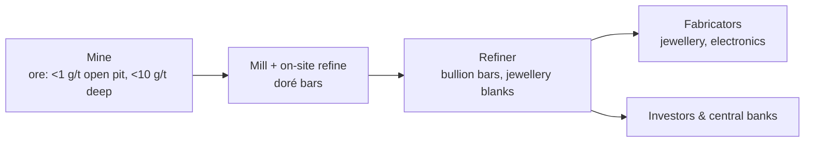

# 4. Gold

> **Teaching rewrite** of the gold market: physical chain, London conventions, price drivers, leasing, hedging, trading, and yield enhancement. Original wording; worked numbers recomputed. Prices around USD 1,300 are teaching values from the source era — see the price note below. Not investment advice.

## Introduction

On 24 January 1848, James Marshall spotted gold flakes in a stream at Coloma, California — triggering one of history’s largest migrations. Gold has fascinated people for millennia, and it remains unlike any other commodity: almost indestructible, mostly **still above ground**, held by **central banks**, and traded more like a **currency** than a raw material.

This lesson covers:

- Precious metals and the **physical supply chain**
- The **London market**: LBMA, Good Delivery bars, loco London, allocated vs unallocated, the **LBMA Gold Price** auction
- **Supply and demand** — mines, scrap, central banks, jewellery, investment
- Price relationships: **inflation, real yields, the US dollar**
- The **leasing** market, **forward pricing**, **GOFO**, implied lease rates, gold-in-gold
- Producer **hedging**: forward variants, unwinds, gold swaps, structured swaps, vanilla/Asian/barrier/two-asset options
- **Trading**: gold swaps as collateralised loans, non-deliverable swaps, deferred margin accounts
- **Yield enhancement** with covered calls

:::info Price note
The source uses gold near USD 1,300 and notes the August 2020 record of about USD 2,048. Gold has since set much higher records (above USD 4,000 in 2025). The mechanics in this lesson don’t depend on the price level.
:::

---

## 4.1 The gold market

### Precious metals

- **Gold** and **silver**
- **Platinum group metals (PGMs)**: actively traded **platinum** and **palladium**; less-traded **rhodium, ruthenium, iridium, osmium**

### Physical supply chain

Gold’s corrosion resistance and thermal and electrical conductivity make it valuable in electronics as well as jewellery.

### Intermediaries and central banks

Banks and trading houses: help miners hedge, **lend metal** to refiners and fabricators, **borrow** from central banks, manage central-bank holdings, intermediate the chain, and trade with hedge funds.

Simple model:

| Supply | Demand |
|---|---|
| New **mine** production | **Jewellery** |
| **Central bank** holdings (sales) | Physical **investment** (bars, coins, ETPs) |
| **Recycled scrap** (“urban mine”) | **Industrial** use |

### The London market

London is the largest **OTC** gold market; futures trade on CME and other exchanges.

| Body | Role |
|---|---|
| **LBMA** (London Bullion Market Association) | Standards for the wholesale precious metals market |
| **LPPM** (London Platinum and Palladium Market) | Same for PGMs |
| **LPMCL** (London Precious Metals Clearing Ltd) | Clearing between member banks using unallocated accounts |

Around 2020, London cleared roughly **USD 70 bn a day** in gold — large, but small next to FX (~USD 6.5 trn a day).

#### London Good Delivery

| Feature | Standard |
|---|---|
| Gold content | **350–430 fine oz** (≈ 10.9–13.4 kg); most bars ≈ **400 oz** (12.5 kg) |
| Fineness | ≥ **995 / 1,000** (“two nines five”) |
| Weight reporting | Troy oz in multiples of 0.025, rounded down |
| Marks | Serial number, approved refiner’s assay stamp, year (4 digits) on the larger face |
| Shape | Trapezoid prism |

**Carats** measure purity out of 24: 18 carat = 18/24 = **750** fineness; 24 carat ≈ pure. Wholesale markets use fineness, not carats.

**Loco London**: default delivery location; settlement **T+2** London business days (trade Wed 15 Jan 2020 → settle Fri 17 Jan 2020). Other locations or purities trade at an adjustment.

#### Allocated vs unallocated

| | **Unallocated** | **Allocated** |
|---|---|---|
| What you own | A general claim on the bank’s pool | Specific, segregated, numbered bars |
| Legal position | **Unsecured creditor** | **Owner** (secured) |
| Cost | Minimal | Higher storage/insurance fees |
| Bank balance sheet | On it — capital-intensive under newer rules | Off it — banks nudge clients here |

### The LBMA Gold Price

A **benchmark** is needed for transparency (central banks), unbiased contract settlement, and option exercise. The old twice-daily “fixing” (since 1919) was replaced in 2014–15 by an **independently administered electronic auction** (ICE Benchmark Administration), held at **10:30** and **15:00** London time.

How a round works:

1. Administrator proposes a price.
2. Direct participants submit buy and sell volumes within **30 seconds**.
3. If |buy − sell| > **10,000 oz**, the price moves toward the excess side and a new round starts.
4. Once within tolerance, volumes trade and the price is published (then converted to other currencies).

#### Worked example: auction rounds

| Round | Price | Bids (oz) | Asks (oz) | Imbalance | Action |
|---|---|---|---|---|---|
| 1 | 1,329.15 | 80,579 | 30,223 | +50,356 | Raise |
| 2 | 1,329.55 | 80,579 | 35,223 | +45,356 | Raise |
| 3 | 1,330.15 | 80,579 | 114,223 | −33,644 | Lower |
| 4 | 1,329.90 | 80,579 | 94,223 | −13,644 | Lower |
| 5 | 1,329.75 | 80,579 | 85,223 | **−4,644** | **Within 10,000 → set at 1,329.75** |

<GuidedChoiceExplanation preset="comm-gold-market" />

---

### Checkpoint 1: market structure

<MultipleChoice
  id="comm-ch4-mid1"
  title="Checkpoint — section 4.1"
  questions={[
    {
      prompt: 'What minimum fineness must a London Good Delivery gold bar meet?',
      choices: ['750', '916', '995', '999.9'],
      answer: 2,
      why: '995 parts per thousand — “two nines five”.',
    },
    {
      prompt: 'An investor holds unallocated gold at a bank that fails. Their position?',
      choices: [
        'Owner of specific bars',
        'Unsecured creditor of the bank',
        'Secured creditor with priority',
        'Protected by the LBMA',
      ],
      answer: 1,
      why: 'Unallocated = a general claim, not title to bars.',
    },
    {
      prompt: 'What fineness is 22-carat gold (nearest whole number)?',
      choices: ['750', '875', '917', '995'],
      answer: 2,
      why: '22 / 24 × 1,000 ≈ 916.7.',
    },
    {
      prompt: 'Auction round: bids 92,000 oz, asks 79,500 oz. What happens next?',
      choices: [
        'Price set — imbalance within tolerance',
        'Price raised — imbalance 12,500 oz exceeds 10,000',
        'Price lowered',
        'Auction cancelled',
      ],
      answer: 1,
      why: 'Excess buying beyond 10,000 oz pushes the price up.',
    },
    {
      type: 'order',
      prompt: 'Rank the physical gold chain.',
      items: ['Mine extracts ore', 'Milled and refined on site into doré', 'Refiner produces bullion bars', 'Fabricator makes jewellery or electronics'],
      why: 'Ore → doré → bullion → products.',
    },
  ]}
/>

---

## 4.2 Gold price drivers

> Supply and demand flows matter less for gold than for any other commodity — because almost all gold ever mined still exists.

### Supply

- About **187,000 t** mined in history; ~80% still exists; **90%** mined since the 1850s, **60%** since the 1950s.
- Production has shifted from **South Africa** (≈ 1,000 t ≈ 70% of world output in the early 1970s → 118 t ≈ 3% in 2019) toward **China** (largest producer, ≈ 383 t in 2019), **Russia, Australia**, the Americas.
- Remaining reserves ≈ **53,000 t** (USGS, 2020) — roughly 14 years of output, increasingly deep and costly (South African mines reach ~4 km).
- **Scrap** rises when prices rise (stronger trade-in culture in Asia than the West).
- **Producer hedging** adds supply: the bank buying a miner’s forward **borrows gold and sells it spot** today. **De-hedging** does the reverse — banks buy spot and lend, adding demand and pushing lease rates down.

### Demand

| Source | Notes |
|---|---|
| **Jewellery** | Largest, but price-sensitive; peak ≈ 3,350 t (1997); ≈ 2,137 t (≈ 44%) in 2019 |
| **Investment** | Volatile; ≈ 70% of demand in 1980, ≈ 6% in 2001, ≈ 39% at the 2011 peak — boosted by **exchange-traded products** |
| **Central banks** | Net **sellers** in the 1990s–2000s (≈ 4,400 t), net **buyers** since about 2010; emerging markets (e.g. China ≈ 600 t in 2009 → ≈ 1,948 t in 2020) |
| **Industry** | Electronics, dentistry |

**Central bank holdings (Oct 2020)**: US ≈ 8,134 t, Germany ≈ 3,362 t, IMF ≈ 2,814 t, Italy ≈ 2,452 t, France ≈ 2,436 t.

Heavy central bank selling pushed gold toward **USD 250** in the late 1990s → **Central Bank Gold Agreements** (Washington Agreement 1999 onward): coordinated sales, annual caps (400 t in the later agreements). The last agreement expired in **2019** and signatories said no renewal was needed — they had become buyers.

### Price relationships

**Fisher equation**: nominal yield ≈ real yield + expected inflation + risk premium.

Example: 3% deposit, 2% expected inflation, zero risk premium → real yield ≈ **1%** (strictly 103/102 − 1 ≈ 0.98%). With a 1% deposit and 3% inflation → real yield ≈ **−2%**: saving loses purchasing power.

| Relationship | Evidence |
|---|---|
| **Expected inflation** (breakevens) | Weak and inconsistent |
| **Real yields** | **Clearer negative relationship** — gold pays no coupon, so higher real yields raise its opportunity cost |
| **US dollar** | Generally inverse; gold trades like a currency (**XAU**) and a **safe haven** — though a much smaller market than major currencies |

One bank’s model found significant drivers including price **momentum** (+), the **US dollar index** (−), physically backed **ETP holdings** (+), Euro Stoxx 50 (−), emerging-market equities (+), US **breakevens** (+), consumer sentiment (−), US **real yields** (−), presidential approval (−), and industrial production (+).

### Worked example: real yields and gold

Nominal 10-year yield **4.5%**, expected inflation **2.3%** → real yield ≈ **2.2%**. If nominal yields fall to **3.5%** with inflation expectations unchanged, real yield ≈ **1.2%** — the opportunity cost of holding gold falls by a point, typically supportive for the price.

---

### Checkpoint 2: price drivers

<MultipleChoice
  id="comm-ch4-mid2"
  title="Checkpoint — section 4.2"
  questions={[
    {
      prompt: 'Why do mine supply changes barely move the gold price in the short run?',
      choices: [
        'Gold isn’t mined any more',
        'Huge above-ground stocks dwarf annual flows',
        'Central banks fix the price',
        'Gold has no futures market',
      ],
      answer: 1,
      why: 'Stock-to-flow is enormous for gold.',
    },
    {
      prompt: 'A miner sells production forward to a bank. Why does this add to spot supply today?',
      choices: [
        'The miner delivers immediately',
        'The bank hedges by borrowing gold and selling it spot',
        'Central banks must sell',
        'It doesn’t',
      ],
      answer: 1,
      why: 'Producer hedging pulls future supply into today.',
    },
    {
      prompt: 'Which relationship shows the clearest link with gold prices in the source evidence?',
      choices: ['Expected inflation', 'Real interest rates (inverse)', 'Oil prices', 'Copper inventories'],
      answer: 1,
      why: 'Higher real yields raise the cost of holding a non-yielding asset.',
    },
    {
      prompt: 'Nominal rate 2%, expected inflation 3.5%, risk premium 0. Approximate real yield?',
      choices: ['5.5%', '1.5%', '−1.5%', '0%'],
      answer: 2,
      why: '2 − 3.5 = −1.5%.',
    },
    {
      type: 'order',
      prompt: 'Rank these 2019 producers by output (LARGEST first).',
      items: ['China (≈ 383 t)', 'Russia (≈ 330 t)', 'Australia (≈ 325 t)', 'South Africa (≈ 118 t)'],
      why: 'Production has shifted away from South Africa.',
    },
  ]}
/>

---

## 4.3 Leasing and forward pricing

Because so much gold sits above ground, holders **lease** it out: title transfers temporarily in exchange for interest (in cash or gold). Central banks and institutions lend to earn something on an otherwise non-yielding asset — though lease rates are usually **below** cash rates (an opportunity cost).

:::caution Terminology
In gold, use **lease/deposit**. In base metals, a “borrow” means a simultaneous purchase and sale for different dates — a different trade.
:::

### Forward price formation

> “If you can hedge it, you can price it.”

A producer wants to sell gold in **6 months (182 days)**. Spot **1,300**, cash rate **2%**, lease rate **0.25%**:

| Bank’s hedge | USD per oz |
|---|---|
| Sell gold spot | 1,300.00 |
| + Deposit proceeds: 1,300 × 2% × 182/360 | +13.14 |
| − Lease cost to borrow gold: 1,300 × 0.25% × 182/360 | −1.64 |
| **Forward** | **1,311.50** |

The forward is a **carry calculation**, not a forecast; it converges to spot as maturity nears.

### GOFO / swap rate

The market quotes the **forward premium as % p.a.** — the **GOFO** (gold forward offered rate), swap rate, or contango:

> Swap rate = (forward / spot − 1) × 360 / days = (1,311.50 / 1,300 − 1) × 360 / 182 ≈ **1.75%**

And **swap rate ≈ cash rate − lease rate** (2% − 0.25% = 1.75%).

| Maturity | Swap bid | Swap offer | Outright bid | Outright offer |
|---|---|---|---|---|
| 1 month | 1.66% | 1.76% | 1,332.55 | 1,332.85 |
| 3 months | 1.79% | 1.89% | 1,336.67 | 1,337.19 |
| 6 months | 1.87% | 1.97% | 1,343.23 | 1,344.08 |
| 12 months | 2.07% | 2.17% | 1,358.58 | 1,360.11 |

Positive swap rates (cash rate > lease rate) give an upward-sloping curve; negative swap rates are rare.

:::info Rate updates
The LBMA **GOFO fixing was discontinued in 2015**, though the concept is still used. And **LIBOR** in the source is now replaced by **SOFR** for USD.
:::

### Implied lease rates

Actual lease trades aren’t widely reported, so lease rates are **inferred**:

> **Lease rate = cash rate − swap rate** (“LIBOR minus GOFO”)

Cash rate **2.0%**, swap rate **1.5%** → implied lease **0.5%**.

:::caution Correction
The source writes “swap rate − LIBOR = lease rate” and gives 2% − 1.5% = 0.5%. The correct identity is **cash rate − swap rate**; the example above uses the numbers the right way round.
:::

### Who lends and borrows

| Lenders | Borrowers / demand drivers |
|---|---|
| Central banks, institutional investors | **Producer hedging** (drives the **12-month+** end); **fabricators** (borrow gold instead of buying it — no price risk, and lease rate < cash rate); **short sellers**; overall cash-rate level |

Central bank lending tends to drive the **short** end of the lease curve.

### Gold-in-gold interest

Lend **100,000 oz** for one year (365 days) at **0.75%**, interest paid in gold:

- Interest = 100,000 × 0.75% × 365/360 ≈ **760 oz**
- One-year forward = 1,300 × (1 + 3.75% × 365/360) ≈ **1,349.43** → value ≈ 760 × 1,349.43 ≈ **USD 1,025,567**
- Cash-paid equivalent = 100,000 × 1,300 × 0.75% × 365/360 ≈ **USD 988,542**

To be equivalent, the gold-in-gold rate must be lower: (988,542 / 1,349.43) × (360/365) / 100,000 ≈ **0.7225%**.

<GuidedChoiceExplanation preset="comm-gold-lease" />

---

### Checkpoint 3: leasing and forwards

<MultipleChoice
  id="comm-ch4-mid3"
  title="Checkpoint — section 4.3"
  questions={[
    {
      prompt: 'Spot 2,000, cash rate 4%, lease 0.5%, 180 days (360 basis). Forward price?',
      choices: ['2,040', '2,035', '2,005', '2,045'],
      answer: 1,
      why: '2,000 × (1 + 3.5% × 0.5) = 2,035.',
    },
    {
      prompt: 'Cash rate 5.0%, GOFO 4.3%. Implied lease rate?',
      choices: ['0.7%', '9.3%', '−0.7%', '4.3%'],
      answer: 0,
      why: 'Lease = cash − swap = 0.7%.',
    },
    {
      prompt: 'Why might a jewellery fabricator borrow gold rather than buy it?',
      choices: [
        'Gold is cheaper to borrow than to buy forever',
        'No price risk while processing, and lease rates are below cash borrowing rates',
        'It must by law',
        'It earns a dividend',
      ],
      answer: 1,
      why: 'Repay the gold loan by buying metal when the jewellery sells.',
    },
    {
      prompt: 'What would make gold swap rates negative?',
      choices: [
        'Cash rates above lease rates',
        'Lease rates above cash rates',
        'High gold prices',
        'Low volatility',
      ],
      answer: 1,
      why: 'Swap ≈ cash − lease.',
    },
    {
      type: 'order',
      prompt: 'Rank the bank’s steps to hedge a producer’s forward sale.',
      items: [
        'Agree to buy gold forward from the producer',
        'Sell the same amount of gold spot',
        'Lease gold from a central bank to deliver the spot sale',
        'Deposit the dollar proceeds until maturity',
        'At maturity, receive producer’s gold, repay lease, pay producer from deposit',
      ],
      why: 'Every cash flow is known on day one — the forward is a carry calculation.',
    },
  ]}
/>

---

## 4.4 Hedging

Producers favour hedges that are **simple**, good value, system-friendly, and get good **accounting** treatment — so vanilla forwards and options dominate.

### Forward variants

| Product | How it works |
|---|---|
| **Physical forward** | Fixed gold for fixed cash, physically delivered |
| **Book-entry forward** | Same, but unallocated balances change in the vault records |
| **Spot deferred** | Spot price agreed now; **no fixed maturity**; rolled daily with cash and lease rates, terminable with notice — earns the short-term contango |
| **Floating rate forward** | Spot and cash-rate parts fixed; lease component floats (e.g. average 3-month lease rate) until maturity |
| **Flat rate forward** | Several deliveries at **one** price = discount-weighted average of the individual forwards |
| **Convertible forward** | Buy a **put**, sell a **reverse knock-in (up-and-in) call** at the same strike, zero cost by setting the barrier. If the barrier trades, −C + P = −F → the producer is effectively short forward at the strike |

### Unwinding a forward

A producer sold gold **3 years forward at USD 500**. Two years later the **1-year forward** is **USD 1,100**; 1-year rate **3%**.

Break cost = (500 − 1,100) / 1.03 ≈ **−USD 582.52/oz** — paid by the producer. (Several miners, e.g. Barrick in 2009, unwound hedges under shareholder pressure; rising prices had also forced them to post collateral.)

### Gold swap to defer delivery

A producer must deliver **50,000 oz** at **1,300** in two days but can’t. With spot **1,330** and 6-month forward **1,343**:

| Leg | Gold | Cash (per oz) |
|---|---|---|
| Original forward | Sell 50,000 | Receive 1,300 |
| Swap — spot leg | **Buy** 50,000 | Pay 1,330 |
| Swap — 6-month leg | **Sell** 50,000 | Receive 1,343 |

Spot gold nets to zero; the producer pays **30/oz** (1,330 − 1,300) = **USD 1.5 m** now and will deliver in six months at **1,343**.

### Structured swaps

Gold “swaps” can mean many things. Standard commodity swaps (cash-settled, fixed vs monthly average) exist; structured ones embed options:

| Structure | Terms | Embedded option sold by client | Risk |
|---|---|---|---|
| **American barrier reset swap** | Pay fixed **1,250** (vanilla 1,300); if LBMA price ≥ **1,400** in a month, that month’s fixed resets to **1,400** | Strip of monthly **digital calls** (payout 100 above vanilla) | Pays more than vanilla in high-price months |
| **American barrier knock-out swap** | Pay fixed **1,200**; if price ≥ **1,400**, the swap **terminates** | A **swaption** to enter an offsetting swap | Left **unhedged** just as prices are high |

### Options for producers

| Option | Premium (6 months, 50,000 oz context) | Notes |
|---|---|---|
| **Vanilla put**, K 1,300 (forward 1,306, vol 20%) | ≈ **USD 70/oz** (≈ USD 3.5 m) | Insurance for a producer who expects **higher** prices but wants protection — if it expected lower prices, selling forward would be cheaper |
| **Asian (average) put**, K 1,300, vol ≈ 15% on the average | ≈ **USD 28.59/oz** | Lower cost because averages vary less — but the payout is lower too, so it isn’t simply “cheap” |
| **Up-and-out put**, K 1,300, barrier 1,350 | ≈ **USD 35.03/oz** | Cancelled if gold trades above 1,350 — unhedged if it then falls |
| **Down-and-in put**, K 1,300, barrier 1,250 | ≈ **USD 66.70/oz** | Only activates below 1,250 — then born USD 50 in the money |
| **Two-asset barrier** — copper put (K 7,100) that knocks in if **gold** trades below 1,000 | ≈ **USD 52.83/t** vs vanilla copper put ≈ **USD 562/t** | Value depends on gold–copper **correlation** |

Two-asset barrier vs correlation:

| Gold–copper correlation | Premium |
|---|---|
| +1.0 | 93.35 |
| 0.0 | 52.83 |
| −1.0 | 0.01 |

Positive correlation: gold falling through the barrier likely coincides with copper falling → put likely in the money → dearer.

<GuidedChoiceExplanation preset="comm-gold-hedge" />

---

### Checkpoint 4: hedging

<MultipleChoice
  id="comm-ch4-mid4"
  title="Checkpoint — section 4.4"
  questions={[
    {
      prompt: 'A miner sold forward at 900; the current matching forward is 1,400; discount rate 4% for one year. Break cost per oz?',
      choices: ['−500.00', '−480.77', '−519.23', '+480.77'],
      answer: 1,
      why: '(900 − 1,400) / 1.04 ≈ −480.77.',
    },
    {
      prompt: 'Which forward lets a producer earn short-term contango with no fixed maturity?',
      choices: ['Flat rate forward', 'Spot deferred', 'Convertible forward', 'Floating rate forward'],
      answer: 1,
      why: 'Rolled daily, terminable with notice.',
    },
    {
      prompt: 'An American barrier knock-out swap lets a consumer pay 1,200 instead of 1,300. What did it give up?',
      choices: [
        'Nothing',
        'Its hedge terminates if gold hits 1,400 — unhedged when prices are high',
        'It pays 1,400 forever',
        'It must deliver gold',
      ],
      answer: 1,
      why: 'It sold an option (a swaption) that cancels the hedge.',
    },
    {
      prompt: 'Why is a down-and-in put cheaper than a vanilla put with the same strike?',
      choices: [
        'It has a higher strike',
        'It only comes alive if the barrier trades',
        'It is cash-settled',
        'It is American style',
      ],
      answer: 1,
      why: 'Probability of having protection is lower.',
    },
    {
      prompt: 'For the two-asset barrier (copper put knocking in on low gold), which correlation makes it most expensive?',
      choices: ['+1.0', '0.0', '−1.0', 'Correlation is irrelevant'],
      answer: 0,
      why: 'Low gold then likely means low copper → put in the money.',
    },
    {
      type: 'order',
      prompt: 'Rank these producer puts by premium (CHEAPEST first).',
      items: ['Asian put (≈ 28.59)', 'Up-and-out put (≈ 35.03)', 'Down-and-in put (≈ 66.70)', 'Vanilla put (≈ 70)'],
      why: 'Averaging and barriers cut the premium; the down-and-in is closest to vanilla.',
    },
  ]}
/>

---

## 4.5 Trading gold

### Gold swaps = collateralised USD loans

A **gold swap** (or “FX swap”) is a spot and a forward deal in opposite directions, executed together.

At the market maker’s **bid** (spot 1,330.65; 2-month swap 1.73%; outright 1,334.42):

| Date | Gold | Cash |
|---|---|---|
| Spot | Bank **delivers** 1 oz | Bank **receives** 1,330.65 |
| 2 months | Bank **receives back** 1 oz | Bank **repays** 1,334.42 |

Read **horizontally**: the bank **borrowed USD**, securing it with **gold** — a collateralised loan at ~1.73% p.a. At the offer, it lends USD and borrows gold.

Because swap ≈ cash rate − lease rate, strong demand to **borrow dollars against gold** pushes the forward (and swap rate) up — so the **implied lease rate** can turn **negative**. Like the FX basis, it means borrowers pay a premium to raise USD on a secured basis.

**Example**: spot 1,300, 12-month cash rate 3%, lease 0.10% → swap 2.90%, forward **1,337.70**. Demand to borrow USD pushes the forward to **1,345** → swap **3.46%** → implied lease **3% − 3.46% = −0.46%**: borrowers pay cash rate + 0.46%.

### Non-deliverable (cash-settled) gold swaps

Settled in **USD** only — for users who don’t want metal.

> Settlement = USD notional × (1 − forward / settlement price)
> Positive → paid **to the gold (XAU) buyer**; negative → paid **by the gold buyer** to the seller.

**Example**: 10,000 oz forward at **1,343** → USD notional **13,430,000**. At maturity gold is **1,320**:

13,430,000 × (1 − 1,343 / 1,320) ≈ **−234,008** → the gold **buyer pays** USD 234,008; a hedge fund that was **short** (bearish) collects it.

:::caution Note on the source
The source’s wording of who pays whom is inconsistent with its own example. The sign rule above follows from the formula: if gold settles above the forward, the result is positive and the buyer gains.
:::

### Deferred margin accounts

Leveraged gold exposure **without** owning metal. Client takes **10,000 oz** at **1,300** (USD 13 m), posts **8%** (USD 1.04 m); the bank funds USD 11.96 m.

> Requirement: market value − initial balance + initial margin ≥ 8% × max(market value, initial balance)

| Gold | Left side | Required | Result |
|---|---|---|---|
| 1,300 | 1,040,000 | 1,040,000 | Balanced |
| **1,250** | 12.5 m − 13 m + 1.04 m = **540,000** | 8% × 13 m = **1,040,000** | Top up **USD 500,000** |
| **1,350** | 13.5 m − 13 m + 1.04 m = **1,540,000** | 8% × 13.5 m = **1,080,000** | May withdraw **USD 460,000** |

Some banks add an auto-close threshold (e.g. 5%). The bank hedges by **selling 100 CME futures** (100 oz each) — leaving **basis risk** between spot (client) and futures (hedge), i.e. carry.

---

## 4.6 Yield enhancement: covered calls

Central banks hold gold that earns little. A **covered call**: sell calls on part of the holding.

Example: spot **1,300**, 12-month call strike **1,400**, vol 20% → premium ≈ **USD 18.35/oz**.

| Gold at expiry | Outcome vs just holding |
|---|---|
| Below **1,281.65** (1,300 − 18.35) | Loses money overall — but less than holding alone |
| 1,281.65 – 1,400 | Better off by the premium |
| At or above **1,400** | Profit capped at 1,400 + 18.35 = **1,418.35** |
| Above **1,418.35** | **Worse** than simply holding gold |

Not risk-free. Strike closer to spot → more premium, more chance of exercise. A **smile** (higher vol for OTM calls) or **upward** gold term structure (longer options at higher vol) raises premiums.

<GuidedChoiceExplanation preset="comm-gold-trading" />

---

### Rank: gold practice

<MultipleChoice
  id="comm-ch4-rank"
  title="Gold practice"
  questions={[
    {
      type: 'order',
      prompt: 'Rank these holdings from MOST to LEAST secure for the owner if the custodian bank fails.',
      items: ['Allocated bars in a segregated account', 'Unallocated balance at a large clearing bank', 'Deferred margin account (no metal rights)'],
      why: 'Allocated = ownership; unallocated = unsecured claim; deferred margin = a derivative only.',
    },
    {
      type: 'order',
      prompt: 'For the covered call (spot 1,300, strike 1,400, premium 18.35), rank these key prices from LOWEST to HIGHEST.',
      items: ['Downside breakeven 1,281.65', 'Spot 1,300', 'Strike 1,400', 'Cap / crossover 1,418.35'],
      why: 'Premium cushions losses down to 1,281.65; gains stop at 1,418.35.',
    },
  ]}
/>

---

### Check: gold

<MultipleChoice
  id="comm-ch4"
  title="Gold"
  questions={[
    {
      prompt: 'What is “loco London”?',
      choices: [
        'A London futures exchange',
        'The default delivery location and price basis for wholesale gold, settling T+2',
        'A carat scale',
        'A type of allocated account',
      ],
      answer: 1,
      why: 'Other locations trade at an adjustment.',
    },
    {
      prompt: 'Who administers the LBMA Gold Price auction today?',
      choices: ['The Bank of England', 'An independent benchmark administrator (ICE)', 'The five fixing banks', 'The CME'],
      answer: 1,
      why: 'Old fixings moved to independent administrators in 2014–15.',
    },
    {
      prompt: 'Central banks shifted from net sellers to net buyers around…',
      choices: ['1980', '1999', '2010', '2020'],
      answer: 2,
      why: 'After the mid-2000s price rise; emerging markets led buying.',
    },
    {
      prompt: 'Spot 1,800, 6-month (182-day) forward 1,836. Swap rate (% p.a., 2 dp)?',
      choices: ['2.00', '3.96', '4.00', '1.98'],
      answer: 1,
      why: '(1,836 / 1,800 − 1) × 360/182 = 0.02 × 1.978 ≈ 3.96%.',
    },
    {
      prompt: 'Locational swap: sell 40,000 oz loco New York at 1,940, buy 40,000 oz loco London at 1,941.50. Client pays…',
      choices: ['USD 40,000', 'USD 60,000', 'USD 1.5', 'Nothing'],
      answer: 1,
      why: '1.50 × 40,000 = 60,000 — no metal shipped.',
    },
    {
      prompt: 'Read horizontally, a gold swap at the dealer’s bid is…',
      choices: [
        'A bet on gold rising',
        'The dealer borrowing USD against gold collateral',
        'A gold sale',
        'An option',
      ],
      answer: 1,
      why: 'Cash in now, repaid later; gold out now, returned later.',
    },
  ]}
/>

---

## Calculate: numeric practice

Type the number (no units; minus sign for losses or payments). Use 360-day years unless stated.

### Formula sheet

| Item | Formula |
|---|---|
| Fineness from carats | carats / 24 × 1,000 |
| Gold forward | spot × (1 + (cash rate − lease rate) × days/360) |
| Swap (GOFO) rate | (forward / spot − 1) × 360/days |
| Implied lease rate | cash rate − swap rate |
| Gold-in-gold interest (oz) | oz × rate × days/360 |
| Unwind (break) cost | (original price − current forward) / (1 + r) |
| NDF settlement (to gold buyer) | USD notional × (1 − forward / settlement) |
| Deferred margin top-up | 8% × max(MV, initial) − (MV − initial + margin) |
| Covered call cap | strike + premium |

<NumericQuiz
  id="comm-ch4-calc"
  title="Calculate: gold"
  decimals={2}
  questions={[
    {
      prompt: 'Fineness of 18-carat gold (parts per thousand)?',
      answer: 750,
      why: '18 / 24 × 1,000 = 750.',
      decimals: 0,
    },
    {
      prompt: 'Spot 1,900; cash rate 5%; lease rate 0.4%; 182 days. Fair forward (2 dp)?',
      answer: 1944.19,
      why: '1,900 × (1 + 4.6% × 182/360) = 1,900 × 1.023256 ≈ 1,944.19.',
    },
    {
      prompt: 'Spot 1,300, 182-day forward 1,311.50. Swap (GOFO) rate in % p.a. (2 dp)?',
      answer: 1.75,
      why: '(1,311.50/1,300 − 1) × 360/182 ≈ 1.75%.',
    },
    {
      prompt: 'Cash rate 4.8%, gold swap rate 4.2%. Implied lease rate in %?',
      answer: 0.6,
      why: '4.8 − 4.2 = 0.6%.',
    },
    {
      prompt: 'A central bank lends 200,000 oz for 180 days at 0.6%, interest paid in gold. Interest in oz?',
      answer: 600,
      why: '200,000 × 0.6% × 180/360 = 600 oz.',
      decimals: 0,
    },
    {
      prompt: 'A miner sold gold forward at 1,200. The current forward for the same date is 1,950; one year remains; discount rate 5%. Break cost per oz (negative = producer pays)?',
      answer: -714.29,
      why: '(1,200 − 1,950) / 1.05 ≈ −714.29.',
    },
    {
      prompt: 'A miner must deliver 50,000 oz at 1,800 but defers with a gold swap: buy spot at 1,950, sell 6-month forward at 1,968. Cash the miner pays now (USD)?',
      answer: 7500000,
      why: '(1,950 − 1,800) × 50,000 = 7,500,000.',
      decimals: 0,
    },
    {
      prompt: 'LBMA auction round: bids 75,000 oz, asks 68,500 oz. Absolute imbalance in oz?',
      answer: 6500,
      why: '75,000 − 68,500 = 6,500 — within 10,000, so the price is set.',
      decimals: 0,
    },
    {
      prompt: 'NDF: buy 10,000 oz forward at 1,950 (USD notional 19,500,000). Gold settles at 2,000. Settlement to the gold buyer (USD)?',
      answer: 487500,
      why: '19,500,000 × (1 − 1,950/2,000) = 487,500 — positive, so the buyer receives.',
      decimals: 0,
    },
    {
      prompt: 'Deferred margin: 5,000 oz at 2,000 (USD 10 m), 8% initial margin (800,000). Gold falls to 1,900. Top-up required (USD)?',
      answer: 500000,
      why: 'Left: 9.5 m − 10 m + 0.8 m = 300,000. Required: 8% × 10 m = 800,000. Top up 500,000.',
      decimals: 0,
    },
    {
      prompt: 'Covered call: spot 2,000, call strike 2,150, premium 30. Price above which simply holding gold beats the covered call?',
      answer: 2180,
      why: 'Strike + premium = 2,180.',
      decimals: 0,
    },
    {
      prompt: 'Same covered call: price below which the position loses money overall?',
      answer: 1970,
      why: 'Spot − premium = 1,970.',
      decimals: 0,
    },
  ]}
/>

### Randomized practice

<NumericQuiz id="comm-ch4-calc-random" title="Practice: gold drills" bank="commGold" rounds={6} />

---

## Takeaways

:::tip Remember
- Gold is a **stock**, not a flow, market — almost all of it still exists, so supply/demand flows move price less
- London sets conventions: **Good Delivery** (350–430 oz, ≥ 995), **loco London** T+2, allocated vs unallocated
- The **LBMA Gold Price** is an independently run auction twice daily
- Supply has shifted to **China/Russia/Australia**; central banks turned from sellers to **buyers**
- Gold’s clearest macro link is to **real yields** (inverse); it trades like a currency (**XAU**)
- **Forward = spot × (1 + (cash − lease) × t)**; **lease = cash − swap (GOFO)**
- Producers hedge with forwards (spot deferred, floating, flat, convertible) and options (vanilla, Asian, barrier, two-asset)
- A **gold swap** is a collateralised USD loan; heavy USD demand can make implied lease rates **negative**
- **Covered calls** add yield but cap upside and don’t remove downside
:::

## Further Reading

- [3. Risk management principles](./risk-management-principles)
- [2. Derivative valuation](./derivative-valuation) — cash-and-carry and convenience yield
- Next: [5. Base metals](./base-metals)
- LBMA ([lbma.org.uk](https://www.lbma.org.uk)) — Good Delivery rules and the LBMA Gold Price; World Gold Council ([gold.org](https://www.gold.org)) — supply and demand data
- Background: N. Schofield, *Commodity Derivatives: Markets and Applications* (Wiley) — used as a study outline; J. Cross, *Gold Derivatives: The Market View* (2001)
