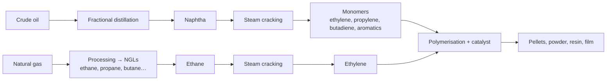

# 9. Plastics

> **Teaching rewrite** of plastics as a commodity: polymer chemistry, production routes, applications, the supply chain, benchmark pricing, price drivers, and hedging without a liquid futures market. Original wording; worked numbers recomputed. Prices are teaching values. Not investment advice.

## Introduction

Plastics are everywhere — bottles, bags, car parts, cables, clothing — and almost all start life as **crude oil or natural gas**. Yet plastics are an instructive *failure* among commodity markets: the LME launched plastics futures in **2005** and **delisted** them in **2011** for lack of liquidity. That makes plastics a case study in how a commodity gets priced and hedged when there is **no liquid exchange benchmark**.

This lesson covers:

- **Monomers and polymers**: ethylene → polyethylene, and how other elements change properties
- Production from **crude (naphtha)** and **natural gas (ethane)**; **polymerisation**
- The main **polymers** and uses; **thermoplastics vs thermosets**; moulding processes
- The **supply chain** and **benchmark price indices**
- **Price drivers**
- Hedging with **forwards, swaps, proxy hedges**, and **options**

---

## 9.1 Monomers and polymers

A **polymer** (*poly* = many) is a chain of **monomers** chemically bonded together.

- **Ethylene** (also called ethene) = C₂H₄: two carbons joined by a **double bond**, which breaks easily so molecules can link.
- **Polyethylene** (polythene) = **[C₂H₄]ₙ**, where *n* sets the chain length.
- Swap a hydrogen for **chlorine** → **vinyl chloride** (C₂H₃Cl) → **PVC**: higher tensile strength, lower melting point than polyethylene.
- Other elements (fluorine, iodine, bromine) also change properties.
- **Alkenes** (olefins) such as ethylene and propylene are simple, cheap, and easy to polymerise → **polyolefins** (polyethylene, polypropylene).

### Worked example: molar masses

C = 12, H = 1, Cl = 35.5 g/mol.

| Molecule | Formula | Molar mass |
|---|---|---|
| Ethylene | C₂H₄ | 2 × 12 + 4 × 1 = **28 g/mol** |
| Vinyl chloride | C₂H₃Cl | 24 + 3 + 35.5 = **62.5 g/mol** |
| Polyethylene chain, n = 2,500 | [C₂H₄]₂₅₀₀ | 28 × 2,500 = **70,000 g/mol** |

---

## 9.2 Producing plastics

Key building blocks: **ethylene** (C₂H₄), **propylene** (C₃H₆), **butene** (C₄H₈).

| Feedstock | Cost | Output |
|---|---|---|
| **Ethane** (from natural gas liquids) | Cheaper where gas is plentiful | **High ethylene yield** (~80%) but few co-products |
| **Naphtha** (from crude) | Dearer | Lower ethylene yield (~30%) but a broad slate: propylene, butadiene, aromatics |

:::caution Note on the source
The source says the gas route “yields a smaller amount”. More precisely, ethane cracking gives a **higher ethylene yield** but **fewer co-products**; naphtha cracking gives less ethylene per tonne but a wider range of products. Cheap shale ethane has made US and Middle East crackers highly competitive.
:::

**Polymerisation**: ethylene reacts with a **catalyst**; the catalyst choice shapes the bonds and the resulting polymer (pellets, film, resin, powder).

### Worked example: cracker output

An ethane cracker processes **1,000,000 t** of ethane at an **80%** ethylene yield → **800,000 t** of ethylene.

---

## 9.3 Applications

| Polymer | Resin code | Typical uses |
|---|---|---|
| **PET** (polyethylene terephthalate) | 1 | Soft-drink bottles, oven-safe trays, polyester fibre |
| **HDPE** (high-density PE) | 2 | Detergent bottles, refuse bags, carrier bags |
| **PVC** | 3 | Pipes, window frames, films, clothing |
| **LDPE / LLDPE** (low-density / linear low-density PE) | 4 | Food bags, squeeze bottles, stretch film |
| **PP** (polypropylene) | 5 | Caps and closures (rigid); confectionery and tobacco films (flexible); car parts; textiles |
| **PS** (polystyrene) | 6 | CD cases, cartons, medicine bottles, foam packaging |
| Other (e.g. **PTFE**) | 7 | Non-stick cookware, seals |

**Linear** means the carbon backbone is straighter, so chains pack more tightly.

### Thermoplastics vs thermosets

| | **Thermoplastic** | **Thermoset** |
|---|---|---|
| On heating | Softens and can be **reshaped**; chemistry unchanged | **Chemically cures** — sets irreversibly |
| Recyclable by remelting | Yes | No |
| Examples | PE, PP, PVC, PET, **polystyrene**, nylon | Epoxy resins, phenolics (Bakelite), polyurethane foams, vulcanised rubber |

:::caution Correction
The source lists polystyrene and PTFE as thermosets. **Polystyrene is a thermoplastic**, and PTFE is also a thermoplastic (though hard to melt-process). Classic thermosets are epoxies, phenolics, and vulcanised rubber.
:::

### Forming thermoplastics

| Process | How | Products |
|---|---|---|
| **Injection moulding** | Melt, inject into a mould, cool | Tubs, yoghurt pots, caps |
| **Blow moulding** | Inflate a molten tube inside a chilled mould | Bottles |
| **Extrusion** | Push molten plastic through a shaped die | Pipes, film, profiles |

Further processing tailors properties — e.g. **vulcanising** rubber with sulfur for strength and heat resistance.

<GuidedChoiceExplanation preset="comm-plastics-chem" />

---

### Checkpoint 1: chemistry and production

<MultipleChoice
  id="comm-ch9-mid1"
  title="Checkpoint — sections 9.1 to 9.3"
  questions={[
    {
      prompt: 'What makes ethylene easy to polymerise?',
      choices: [
        'It contains chlorine',
        'Its carbon–carbon double bond breaks easily, letting molecules link',
        'It is a solid',
        'It has no hydrogen',
      ],
      answer: 1,
      why: 'Opening the double bond joins monomers into chains.',
    },
    {
      prompt: 'Molar mass of a polyethylene chain with n = 1,500 (C = 12, H = 1)?',
      choices: ['28,000', '42,000', '1,500', '18,000'],
      answer: 1,
      why: '28 × 1,500 = 42,000 g/mol.',
    },
    {
      prompt: 'Which feedstock gives the broadest range of co-products?',
      choices: ['Ethane', 'Naphtha', 'Methane', 'Water'],
      answer: 1,
      why: 'Naphtha cracking yields propylene, butadiene, aromatics too.',
    },
    {
      prompt: 'Which is a thermoset?',
      choices: ['Polystyrene', 'Polyethylene', 'Epoxy resin', 'PET'],
      answer: 2,
      why: 'Thermosets cure irreversibly; the others are thermoplastics.',
    },
    {
      type: 'order',
      prompt: 'Rank the plastics chain from gas well to bottle.',
      items: ['Extract natural gas', 'Separate NGLs (ethane)', 'Steam-crack ethane to ethylene', 'Polymerise to polyethylene pellets', 'Blow-mould into a bottle'],
      why: 'Feedstock → monomer → polymer → product.',
    },
  ]}
/>

---

## 9.4 Supply chain and pricing

| Participant | Role | Price exposure | Natural hedge |
|---|---|---|---|
| **Integrated producer** (oil/gas major) | Feedstock → monomer → polymer | Falling polymer prices | Sell forward |
| **Non-integrated polymer producer** | Buys monomer, makes polymer | Falling polymer / rising monomer | Sell forward |
| **Converter** | Buys polymer, makes products | **Rising** prices | **Buy** forward |
| **Distributor** | Buys and resells | Both directions | Buy or sell |
| **End consumer** | Buys products | Rising prices | Buy forward |
| **Trader** | Intermediates, offers risk services | Both | Buy or sell |

### Why plastics futures failed

The LME listed **polypropylene** and **linear low-density polyethylene** futures in 2005 (≈ 40% of the thermoplastics market), tweaked them repeatedly, and **delisted them in 2011** — volume and open interest never built.

A futures exchange needs to provide: (1) a **reference price** for contracts, (2) **hedging instruments**, and (3) a **source of supply** of last resort. Plastics, with many grades and regional markets, never achieved this.

### Benchmark indices instead

For a benchmark to be accepted it must be **transparent**, reflect the **most liquid** market, be used by **many varied** participants, and be based on **actual trades** rather than quotes. Plastics contracts reference **price-reporting indices** (e.g. S&P Global/IHS Markit, OPIS/PetroChem Wire, ICIS, Platts) — the PRA route seen in lesson 1.

---

## 9.5 Price drivers

| Driver | Effect |
|---|---|
| **Crude and natural gas** | Feedstock cost — the biggest driver |
| **Environmental opposition** | Delays new plants, tightening capacity |
| **Recycling** | Extra supply as collection and sorting improve. England’s carrier-bag charge (5p from 2015, 10p from 2021) cut bag use by roughly 90% — about 140 bags per shopper a year down to ~10 |
| **Production capacity** | Long lead times to expand cracking and polymerisation |
| **Regional feedstock cost** | Cheap Middle East (and US shale) feedstock pulls new capacity there |
| **Disruptions** | US Gulf Coast hurricanes shut plants; imports fill gaps |
| **Economic cycle** | Booms lift demand |
| **Inventories** | Cushion short-term shocks |
| **Technology / substitution** | Lighter, stronger PET replaced cans and glass |
| **US dollar** | Priced in USD — a strong dollar raises costs for others |
| **Emerging markets** | China and India demand |

### Worked example: the recycling chain

Collect → sort by grade → wash and decontaminate → shred to flakes → melt into pellets → sell to manufacturers. Each tonne recycled is a tonne less virgin polymer demand.

### Worked example: bag charge impact

Bags per shopper fall from **140** to **10** a year → reduction = (140 − 10) / 140 ≈ **92.9%**.

<GuidedChoiceExplanation preset="comm-plastics-price" />

---

### Checkpoint 2: supply chain and drivers

<MultipleChoice
  id="comm-ch9-mid2"
  title="Checkpoint — sections 9.4 and 9.5"
  questions={[
    {
      prompt: 'A bottle converter buys polymer. Its main price risk and hedge?',
      choices: [
        'Falling prices — sell forward',
        'Rising prices — buy forward',
        'No risk',
        'Interest rates — swap',
      ],
      answer: 1,
      why: 'Converters are short polymer.',
    },
    {
      prompt: 'Why did LME plastics futures fail?',
      choices: [
        'They were banned',
        'They never attracted enough volume or open interest to become a benchmark',
        'Plastics are not traded',
        'Prices were fixed by OPEC',
      ],
      answer: 1,
      why: 'Liquidity is self-reinforcing — or absent.',
    },
    {
      prompt: 'Which is NOT a criterion for an accepted benchmark index?',
      choices: ['Transparent', 'Based on actual trades', 'Used by many participants', 'Set by one dominant producer'],
      answer: 3,
      why: 'A benchmark must be representative and independent.',
    },
    {
      prompt: 'Crude oil prices jump 30%. Expected effect on polymer prices?',
      choices: ['Fall', 'Rise (feedstock cost)', 'No effect', 'Become negative'],
      answer: 1,
      why: 'Especially for naphtha-based capacity.',
    },
    {
      type: 'order',
      prompt: 'Rank the recycling steps.',
      items: ['Collect', 'Sort by grade', 'Wash and decontaminate', 'Shred to flakes', 'Melt into pellets'],
      why: 'Pellets are then sold back to manufacturers.',
    },
  ]}
/>

---

## 9.6 Forwards and swaps

Even without futures, **OTC forwards, swaps, and options** exist (referencing the indices).

| Type | Purpose |
|---|---|
| **Price-fixing (macro) hedge** | Protects overall margins, not a specific deal |
| **Offset (micro) hedge** | Protects a specific transaction |
| **Strip** | Sequential monthly forwards for a regular exposure |
| **Swap** | Fixed vs floating index, settled in cash — economically a strip |

### Worked example: price-fixing hedge

A bottle maker buys LLDPE at the index price on delivery. In March it buys a **June forward at 1,185/t**. In late May the June price is **1,250**; it closes the forward for **+65**:

Net cost = 1,250 − 65 = **1,185/t** — the original forward price.

### Worked example: swap

A converter pays fixed **1,200/t** and receives the monthly index on **500 t**. The index averages **1,260**:

Swap receipt = (1,260 − 1,200) × 500 = **+30,000**; physical cost 1,260 × 500 − 30,000 = **600,000** → **1,200/t**.

(Calling this “buying” the swap is common but ambiguous — say who **pays fixed**.)

### Worked example: offset hedge

A distributor has sold **200 t** of PP to a customer at a fixed **1,400/t** for delivery in two months, and buys a forward at **1,310**:

Locked margin = (1,400 − 1,310) × 200 = **18,000**.

### Proxy hedges

With no liquid polymer market, hedge with a **correlated** one (crude, naphtha, natural gas, ethylene) — accepting **basis risk**; correlations can break in stressed markets.

**Example**: regression shows PP price (USD/t) moves about **9 ×** the crude price (USD/bbl). To hedge **2,000 t** of PP: 9 × 2,000 = **18,000 bbl** → **18** crude contracts of 1,000 bbl.

---

## 9.7 Options

“If you can hedge it, you can price it.” Option writers need to hedge **delta** (direction) and **vega** (volatility) — hard without liquid underlying futures. The LME never listed plastics options for this reason. OTC writers use **proxy** hedges (crude, gas futures and options) and charge for the imperfection. Structures mirror those in the gold (producer) and base metals (consumer) lessons: calls, puts, collars, averages.

### Worked example: a consumer cap

A converter buys a 3-month **average-price call** on PP at **1,300**, premium **25**. If the average is **1,380**: payoff 80, net cost = 1,380 − 80 + 25 = **1,325**. If the average is **1,200**: no payoff, net cost **1,225**.

<GuidedChoiceExplanation preset="comm-plastics-hedge" />

---

### Checkpoint 3: hedging

<MultipleChoice
  id="comm-ch9-mid3"
  title="Checkpoint — sections 9.6 and 9.7"
  questions={[
    {
      prompt: 'Bought a forward at 1,150; closed at 1,230; physical bought at the 1,230 index. Net cost?',
      choices: ['1,150', '1,230', '1,310', '1,190'],
      answer: 0,
      why: '1,230 − 80.',
    },
    {
      prompt: 'Pay fixed 1,250 on 800 t; index averages 1,210. Swap cash flow to the payer?',
      choices: ['+32,000', '−32,000', '−1,000,000', '0'],
      answer: 1,
      why: '(1,210 − 1,250) × 800 — but physical was cheaper, so net stays 1,250.',
    },
    {
      prompt: 'What is a proxy hedge?',
      choices: [
        'A hedge in the exact polymer',
        'A hedge using a correlated market (e.g. crude) because the polymer market is illiquid',
        'An option on a swap',
        'A forward with physical delivery',
      ],
      answer: 1,
      why: 'Accepts basis risk.',
    },
    {
      prompt: 'Why are plastics options thin?',
      choices: [
        'Volatility is zero',
        'Writers can’t easily hedge delta and vega without a liquid underlying',
        'Options are banned',
        'Plastics never move',
      ],
      answer: 1,
      why: 'If you can’t hedge it, pricing is hard.',
    },
    {
      type: 'order',
      prompt: 'Rank these hedges by basis risk for a PP buyer (LOWEST first).',
      items: ['OTC forward on a PP index matching the supply contract', 'Propylene (monomer) swap', 'Naphtha swap', 'Crude oil futures'],
      why: 'The further from the exact product, the larger the basis risk.',
    },
  ]}
/>

---

### Rank: plastics practice

<MultipleChoice
  id="comm-ch9-rank"
  title="Plastics practice"
  questions={[
    {
      type: 'order',
      prompt: 'Rank the resin identification codes from 1 to 4.',
      items: ['PET', 'HDPE', 'PVC', 'LDPE'],
      why: '1 PET, 2 HDPE, 3 PVC, 4 LDPE (5 PP, 6 PS, 7 other).',
    },
    {
      type: 'order',
      prompt: 'Rank the three roles of a futures exchange as listed in this lesson.',
      items: ['Reference price for commercial contracts', 'Hedging instruments', 'Source of supply / disposal of inventory'],
      why: 'Plastics futures failed to deliver any of them at scale.',
    },
  ]}
/>

---

### Check: plastics

<MultipleChoice
  id="comm-ch9"
  title="Plastics"
  questions={[
    {
      prompt: 'Polyethylene is a polymer of…',
      choices: ['Propylene', 'Ethylene', 'Styrene', 'Vinyl chloride'],
      answer: 1,
      why: '[C₂H₄]ₙ.',
    },
    {
      prompt: 'Replacing a hydrogen in ethylene with chlorine leads, after polymerisation, to…',
      choices: ['PET', 'PVC', 'PTFE', 'Nylon'],
      answer: 1,
      why: 'Vinyl chloride → polyvinyl chloride.',
    },
    {
      prompt: 'Which process makes bottles?',
      choices: ['Extrusion', 'Blow moulding', 'Vulcanisation', 'Distillation'],
      answer: 1,
      why: 'A molten tube is inflated inside a mould.',
    },
    {
      prompt: 'Distributor sells 300 t at fixed 1,450 and buys a forward at 1,360. Locked margin?',
      choices: ['27,000', '90', '435,000', '13,500'],
      answer: 0,
      why: '90 × 300.',
    },
    {
      prompt: 'In the absence of plastics futures, commercial contracts mostly price off…',
      choices: ['Crude futures only', 'Price-reporting agency indices', 'Government tariffs', 'Barter'],
      answer: 1,
      why: 'Transparent, trade-based assessments.',
    },
    {
      prompt: 'What is the main input-cost driver of plastic prices?',
      choices: ['Labour', 'Crude oil and natural gas feedstock', 'Shipping', 'Advertising'],
      answer: 1,
      why: 'Monomers come from hydrocarbons.',
    },
  ]}
/>

---

## Calculate: numeric practice

Type the number (no units; minus sign for payments). C = 12, H = 1, Cl = 35.5.

### Formula sheet

| Item | Formula |
|---|---|
| Molar mass | Σ atoms × atomic mass |
| Polymer chain mass | monomer mass × n |
| Cracker output | feed × yield |
| Forward hedge net cost | physical price − (close − forward) |
| Swap (fixed payer) | (index − fixed) × tonnes |
| Offset hedge margin | (sale price − forward) × tonnes |
| Proxy hedge size | β × tonnes ÷ contract size |
| Average call net cost | average − max(average − K, 0) + premium |

<NumericQuiz
  id="comm-ch9-calc"
  title="Calculate: plastics"
  decimals={2}
  questions={[
    {
      prompt: 'Molar mass of ethylene C₂H₄ (g/mol)?',
      answer: 28,
      why: '2 × 12 + 4 × 1.',
      decimals: 0,
    },
    {
      prompt: 'Molar mass of vinyl chloride C₂H₃Cl (g/mol, 1 dp)?',
      answer: 62.5,
      why: '24 + 3 + 35.5.',
    },
    {
      prompt: 'Molar mass of a polyethylene chain with n = 2,500?',
      answer: 70000,
      why: '28 × 2,500.',
      decimals: 0,
    },
    {
      prompt: 'Ethane cracker: 1,000,000 t feed at 80% ethylene yield. Ethylene output (t)?',
      answer: 800000,
      why: '1,000,000 × 0.8.',
      decimals: 0,
    },
    {
      prompt: 'Bags per shopper fall from 140 to 10 a year. Reduction in % (1 dp)?',
      answer: 92.9,
      why: '130 / 140 ≈ 92.86%.',
      decimals: 1,
    },
    {
      prompt: 'Bought June forward at 1,185; closed at 1,250; physical bought at 1,250. Net cost per tonne?',
      answer: 1185,
      why: '1,250 − 65.',
      decimals: 0,
    },
    {
      prompt: 'Pay fixed 1,200 on 500 t; index averages 1,260. Swap cash flow (USD)?',
      answer: 30000,
      why: '(1,260 − 1,200) × 500.',
      decimals: 0,
    },
    {
      prompt: 'Distributor sells 200 t at fixed 1,400; buys forward at 1,310. Locked margin (USD)?',
      answer: 18000,
      why: '90 × 200.',
      decimals: 0,
    },
    {
      prompt: 'Proxy hedge: PP moves 9 × crude (USD/t per USD/bbl). Hedge 2,000 t PP with 1,000 bbl crude contracts. Contracts?',
      answer: 18,
      why: '9 × 2,000 / 1,000.',
      decimals: 0,
    },
    {
      prompt: 'Average-price call on PP: strike 1,300, premium 25, average 1,380. Net cost per tonne?',
      answer: 1325,
      why: '1,380 − 80 + 25.',
      decimals: 0,
    },
    {
      prompt: 'Polymer at USD 1,200/t; EUR/USD 1.10. Price in EUR per tonne (2 dp)?',
      answer: 1090.91,
      why: '1,200 / 1.10.',
    },
    {
      prompt: 'Strip of equal monthly forwards at 1,180, 1,200, 1,220. Average locked price?',
      answer: 1200,
      why: 'Mean of the three.',
      decimals: 0,
    },
  ]}
/>

### Randomized practice

<NumericQuiz id="comm-ch9-calc-random" title="Practice: plastics drills" bank="commPlastics" rounds={6} />

---

## Takeaways

:::tip Remember
- Polymers are chains of monomers: **ethylene → polyethylene**; chlorine gives **PVC**
- Feedstock: **ethane** (cheap, high ethylene yield) vs **naphtha** (broader co-products)
- Know the main polymers, **resin codes**, and **thermoplastic vs thermoset**
- Converters and consumers fear **rising** prices; producers fear **falling** prices
- LME plastics futures (2005–2011) failed; contracts price off **PRA indices**
- Drivers: **feedstock** prices, capacity, regional cost, disruptions, recycling, cycle, USD, emerging markets
- Hedge with OTC **forwards, strips, swaps**, **proxy** hedges (basis risk), and limited **options**
:::

## Further Reading

- Next: [10. Bulk commodities](./bulk-commodities)
- [8. Electricity](./electricity)
- [6. Crude oil](./crude-oil) — naphtha and refining
- [1. Fundamentals of commodities and derivatives](./fundamentals-of-commodities-and-derivatives) — PRAs and benchmarks
- Background: N. Schofield, *Commodity Derivatives: Markets and Applications* (Wiley) — used as a study outline
