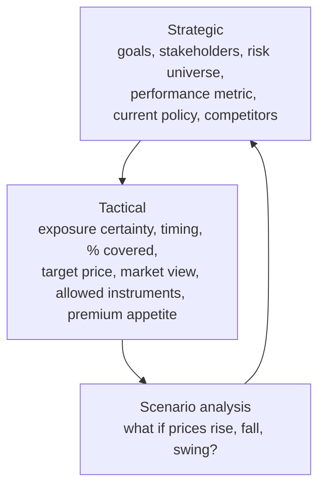
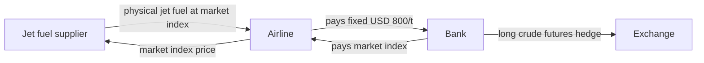

# 3. Risk Management Principles

> **Teaching rewrite** of risk management for commodity hedgers and traders. Original wording; worked numbers recomputed. Prices are teaching values. Not investment advice.

## Introduction

“Risk management” means different things to a mine, an airline, and a bank’s trading desk. This lesson builds one vocabulary for all three and then follows the risk from a **corporate hedger** to the **bank** that takes the other side — and on to the **traders** who manage it.

The big lesson from history: the most catastrophic losses rarely come from price moves alone. They come from **not understanding the business** and **weak controls** — risks no derivative can hedge.

This lesson covers:

- The **five risk types** and market-risk subcategories
- Who trades at the **short, medium, and long** end of the curve
- **Corporate hedging** choices and a **strategic → tactical** framework
- How banks hedge **forwards, swaps, options**, and **correlation** — plus **basis risk**
- **Trading**: spot vs forward breakeven, spreads, and **volatility trading** with delta hedging
- Case studies: **Japan Airlines**, **Amaranth**, **Metallgesellschaft**

---

## 3.1 Defining risk

| Risk | Meaning | Hedgeable with derivatives? |
|---|---|---|
| **Market** | Value of what you own or owe changes with prices | ✅ |
| **Credit** | Money owed is never repaid | ✅ (credit derivatives, collateral) |
| **Business** | Engaging in a business you don’t fully understand | ❌ |
| **Operational** | Losses from weak controls, processes, people, systems | ❌ |
| **Legal / documentary** | Contract void (e.g. *ultra vires*) or a contractual commitment causes loss | ❌ |

The irony: the risks most often behind big losses — **business** and **operational** — are the ones you **can’t** buy protection against. They come from culture and discipline. When a loss is “blamed on the market”, ask why nobody independent stopped it sooner.

### Market risk subcategories

| Subcategory | Example |
|---|---|
| **Interest rate** | Floating-rate borrowing costs rise — and interest earned on cash surpluses can fall |
| **Inflation** | Inflation-linked pension promises or costs |
| **FX** | **Transactional** (a foreign-currency payable) and **translational** (restating foreign assets). Commodities are priced in USD, so non-US producers and consumers carry FX risk |
| **Equity** | Defined-benefit pension assets, share buybacks, employee share options, stakes in listed companies |
| **Liquidity** | Can’t meet short-term cash needs — no credit line, or can’t sell assets |
| **Commodity** | Direct (a gold miner) or secondary (a haulier’s diesel). Integrated supply chains may have **offsetting** exposures |

### Credit risk in physical hedging

An automaker hedging metal directly with a mine or smelter faces:

1. **Specification** — miners produce intermediate product, not the exact grade/shape needed
2. **Counterparty** — operational problems may stop delivery
3. **Opposite timing** — consumers want to hedge at cycle **lows**, producers at **highs**

Fixed-price component supply shifts the problem to the component maker: hedge with poor credit (bad terms) or don’t hedge (exposed to rising metal).

### Legal risk: force majeure

A **force majeure** (“Act of God”) clause excuses performance when specified events beyond a party’s control prevent it. In 2020, some Chinese LNG and copper buyers declared force majeure as demand collapsed during COVID-19 — sellers complained some were really trying to swap long-term cargoes for cheaper spot ones. Drafting and interpreting these clauses is a real risk.

<GuidedChoiceExplanation preset="comm-risk-types" />

---

### Checkpoint 1: risk types

<MultipleChoice
  id="comm-ch3-mid1"
  title="Checkpoint — section 3.1"
  questions={[
    {
      prompt: 'A trader hides losses for months because nobody reconciles his positions independently. Which risk failed?',
      choices: ['Market risk', 'Operational risk', 'Interest rate risk', 'Legal risk'],
      answer: 1,
      why: 'Weak internal controls — not hedgeable with derivatives.',
    },
    {
      prompt: 'A Chilean copper miner reports in pesos but sells copper in USD. Besides copper price risk, it faces…',
      choices: ['Equity risk', 'FX risk', 'Inflation risk only', 'No other risk'],
      answer: 1,
      why: 'Commodities are priced in USD.',
    },
    {
      prompt: 'Which risk is generally NOT hedgeable with derivatives?',
      choices: ['Commodity price', 'Interest rate', 'Business risk', 'FX'],
      answer: 2,
      why: 'You can’t hedge not understanding your own business.',
    },
    {
      prompt: 'Why is hedging metal directly with a mine awkward for an automaker?',
      choices: [
        'Mines never sell forward',
        'Product specification, counterparty risk, and opposite price-timing preferences',
        'It is illegal',
        'Mines only accept options',
      ],
      answer: 1,
      why: 'Financial hedges let the automaker buy the exact grade elsewhere.',
    },
    {
      type: 'order',
      prompt: 'Rank these risks by how easily derivatives can hedge them (EASIEST first).',
      items: ['Commodity price risk', 'Counterparty credit risk', 'Legal / documentary risk', 'Business risk'],
      why: 'Market risk has deep hedging markets; credit has some tools; legal and business risks need governance, not trades.',
    },
  ]}
/>

---

## 3.2 Who trades where on the curve

| Maturity | Main participants | Activity |
|---|---|---|
| **Short-dated** | Banks and trading houses; index investors; hedge funds and CTAs | Managing trading books, tracking indices, short-term views |
| **Medium-dated** | Producers and consumers | **Strategic** hedging: refinery margins, airline jet fuel |
| **Long-dated** | Producers selling forward (often required by lenders); consumers buying into **backwardation**; investors in **structured notes** | Stabilising cash flows; buying cheap long-dated prices; notes often built as a **zero-coupon bond + call option** |

---

## 3.3 Corporate hedging strategies

Using an automaker buying metal as the example:

| Strategy | When it makes sense | Trade-off |
|---|---|---|
| **Don’t hedge** | Metal is a small share of cost; price rises can be passed on | Price falls may have to be passed on too |
| **Lock in unit costs** | Fix the cost of a production run and the selling price | Customers get stable prices; no benefit if metal falls |
| **Hedge the timing mismatch** | Long processes, irregular deliveries, large stocks — product price linked to commodity | Protects stock bought before sale |
| **Active (view-driven) hedging** | Firm knows it will always need the metal and acts on favourable prices | Requires market views — many firms are uneasy |

**How much?** Hedges on **forecast** purchases may outlive the exposure if production falls — so many firms hedge only a **proportion**. Hedges are often **cash-settled**, so the company can still buy the exact grade or shape from its preferred supplier.

---

## 3.4 A framework for corporate risk

Hedging should serve the company’s top-level goal — share price, profit, or cash flow — not just a single price.

**Strategic questions**: What are our goals? What matters to shareholders, lenders, staff? Which financial risks do we face, and which can be hedged? Against which metric do we judge success? What do we do today? What do competitors do?

**Tactical questions**:

- How **certain** is the exposure? When should the hedge **start**?
- What **percentage** to cover? Is there a **budget/target** price?
- What is our view on **direction, timing, and magnitude**?
- Which **instruments** are allowed? Will we pay **premium**?

Option structures are three-dimensional — they draw value from **direction, time, and volatility**. A client who can express even a modest view on these lets a bank build a more efficient hedge. **Scenario analysis** shows how each hedge affects the key metric and loops back to the strategic level.

<GuidedChoiceExplanation preset="comm-hedge-strategy" />

---

### Checkpoint 2: hedging strategy

<MultipleChoice
  id="comm-ch3-mid2"
  title="Checkpoint — sections 3.2 to 3.4"
  questions={[
    {
      prompt: 'Who typically dominates medium-dated maturities on a forward curve?',
      choices: [
        'Index investors',
        'Producers and consumers hedging strategically',
        'Retail traders',
        'Central banks',
      ],
      answer: 1,
      why: 'Refinery margins, airline fuel, mine output.',
    },
    {
      prompt: 'A lender requires a miner to hedge future production. Where on the curve will that hedge sit?',
      choices: ['Short-dated', 'Medium-dated', 'Long-dated', 'Spot only'],
      answer: 2,
      why: 'Long-dated producer selling to stabilise loan-servicing cash flows.',
    },
    {
      prompt: 'A company forecasts buying 10,000 t of copper next year but is unsure of production. Prudent approach?',
      choices: [
        'Hedge 150%',
        'Hedge a proportion, e.g. 60–80%',
        'Hedge 100% with physical delivery from one mine',
        'Never hedge',
      ],
      answer: 1,
      why: 'Over-hedging leaves hedges without an underlying exposure.',
    },
    {
      prompt: 'Which question belongs at the STRATEGIC level?',
      choices: [
        'What strike should the option have?',
        'Which performance metric — share price, profit, cash flow — should hedging protect?',
        'Should we use monthly averages?',
        'Which bank gives the best price?',
      ],
      answer: 1,
      why: 'Strategy defines what success means before choosing trades.',
    },
    {
      type: 'order',
      prompt: 'Rank the steps of the corporate hedging framework.',
      items: [
        'Set strategic goals and the performance metric',
        'Identify and size the specific exposures',
        'Decide % to hedge, target price, views, allowed instruments',
        'Run scenario analysis on candidate hedges',
        'Execute, then review against the strategic metric',
      ],
      why: 'Strategy → tactics → scenarios → execution → feedback.',
    },
  ]}
/>

---

## 3.5 How banks hedge client exposures

Derivatives **transform** risk: the bank takes on what the client gives up and lays it off. Its trading **book** mixes client-driven positions and discretionary views.

| Product | Bank’s risks | Typical hedge |
|---|---|---|
| **Futures** (client on exchange) | None for the bank — the **clearing house** is the counterparty and collects margin | — |
| **Forwards** | **Market** risk (spot + carry components) and **credit** risk | Equal and opposite position; hedge carry components |
| **Swaps** | Market and credit risk | Offsetting swap; or a **proxy** (e.g. jet fuel swap hedged with crude futures) → **basis risk** |
| **Options** | Underlying price, strike, time, carry, implied volatility | Manage each with its **Greek** (lesson 2) |
| **Correlation** | Spread and basket options; related commodities (platinum/palladium); commodities vs financial assets | Historical or implied correlation — **unstable** in volatile markets |

**Basis risk**: the hedge doesn’t move one-for-one with the exposure. A jet-fuel swap hedged with crude futures loses if the jet–crude spread (the “crack”) moves against you.

### Case study: Japan Airlines (2010)

JAL collapsed with debts of about **¥2.3 trillion**; outstanding fuel hedges were estimated at about **USD 440 million** — many struck near the 2008 price peaks.

The airline pays fixed and receives floating, locking its fuel cost. The bank pays floating and receives fixed, so it hedges by going **long crude futures** (basis risk: crude ≠ jet).

When jet fuel **fell** below USD 800/t, the swap was **in the money for the bank** — the airline owed it money. On default:

- **ITM for the bank** → the bank becomes an **unsecured creditor** for the mark-to-market.
- **OTM for the bank** → the bank must **pay** the bankrupt airline what it owes; **no credit loss**.
- Either way, the bank’s **hedge is now orphaned** — it must sell its crude futures, which pushed prices down in the short term.

### Worked example: credit exposure on a jet-fuel swap

Bank receives fixed **USD 800/t** on **60,000 t** remaining; jet fuel now **USD 650/t** (ignore discounting).

Mark-to-market for the bank = (800 − 650) × 60,000 = **USD 9,000,000** → the bank’s unsecured claim if the airline defaults. If jet fuel were **USD 900/t**, the bank would owe **USD 6,000,000** and have no credit exposure.

---

### Checkpoint 3: bank risk management

<MultipleChoice
  id="comm-ch3-mid3"
  title="Checkpoint — section 3.5"
  questions={[
    {
      prompt: 'A client buys an exchange-traded future through a bank. Who bears the client’s default risk?',
      choices: ['The bank as principal', 'The clearing house (via margin)', 'The PRA', 'Nobody'],
      answer: 1,
      why: 'The clearing house is the counterparty and collects margin.',
    },
    {
      prompt: 'A bank hedges a jet fuel swap with crude futures. The residual risk is…',
      choices: ['Credit risk', 'Basis risk', 'Legal risk', 'Liquidity risk only'],
      answer: 1,
      why: 'Jet fuel and crude don’t move one-for-one.',
    },
    {
      prompt: 'When does the bank have credit risk on a swap with a defaulting airline?',
      choices: [
        'Always',
        'Only when the swap is in the money for the bank',
        'Only when it is out of the money',
        'Never on swaps',
      ],
      answer: 1,
      why: 'Credit risk exists only when you are owed money.',
    },
    {
      prompt: 'Bank receives fixed USD 750/t on 40,000 t; market is USD 690/t. Bank’s claim if the airline defaults (undiscounted)?',
      choices: ['USD 2.4 million', 'USD 0', 'USD 27.6 million', 'USD 30 million'],
      answer: 0,
      why: '(750 − 690) × 40,000 = 2,400,000.',
    },
    {
      prompt: 'Which product requires a correlation input for pricing?',
      choices: ['Vanilla call', 'Spread option', 'Forward', 'Future'],
      answer: 1,
      why: 'Spread and basket options depend on how two prices co-move.',
    },
  ]}
/>

---

## 3.6 Trading risk management

**Trading** = buying and selling with **profit** as the main motive — **view-driven**, not driven by an operational need.

### Spot trading: the forward is the breakeven

Gold spot **USD 1,425.40**, 6-month forward **≈ USD 1,449** (lesson 2). A spot purchase financed and carried for six months **costs** the forward price. So the decision depends on where you think spot will be **relative to the forward**, not just up or down:

| Your view of spot in 6 months | Action |
|---|---|
| **Above** 1,449 | **Buy** spot, borrow cash, lend gold to earn the lease |
| **Below** 1,449 | **Sell** spot, deposit cash, borrow gold to cover |
| **Equal** to 1,449 | Indifferent |

You can expect gold to **rise** to 1,440 and still **sell** — because 1,440 < 1,449.

### Forward and relative-value trades

- **Curve slope**: expect steepening → sell short-dated, buy long-dated.
- **Curve curvature**: expect more concave → sell short and long, buy the middle (a “butterfly”).
- **Seasonal relationships**: e.g. winter vs spring gas (see Amaranth).
- **Inter-commodity spreads**:

| Spread | Legs |
|---|---|
| **Crack** | Gasoline or heating oil vs crude |
| **Spark** | Power vs natural gas |
| Base metals | Copper vs aluminium |
| Precious metals | Gold vs silver, platinum vs palladium |

**Worked example — crack spread**: gasoline **USD 2.40/gal** × 42 gal/bbl = **USD 100.80/bbl**; crude **USD 78/bbl** → crack = **USD 22.80/bbl**.

Also: **single-period physically settled swaps** (spot + forward together — a temporary exchange of metal for cash, to borrow cheaply or source metal temporarily) and **cash-settled swaps** (single-period = cash-settled forward).

### Trading volatility

Implied volatility is a market **guess** — so traders “buy” and “sell” it like a commodity, while neutralising direction:

| View | Strategies |
|---|---|
| **Sell volatility** (expect vol to fall / market to be calm) | Short ATM **straddle** (sell call + put); sell a call and delta-hedge; sell a put and delta-hedge |
| **Buy volatility** (expect vol to rise / market to swing) | Long ATM straddle; buy a call or put and delta-hedge |

### Worked example: selling a delta-hedged gold call

Bank sells a 3-month call on **10,000 oz**, strike **1,450**, spot **1,425.40**, vol 15% → premium **USD 31.66/oz**, delta **−0.4223** → buys **4,223 oz** to hedge.

| Step | Option P&L | Hedge P&L | Net |
|---|---|---|---|
| Gold **+5** to 1,430.40; option value 31.66 → 33.82 | −2.16 × 10,000 = **−21,600** | +5 × 4,223 = **+21,115** | **−485** |
| Re-hedge: delta now −0.44 → buy **177 oz** more at 1,430.40 | | | |
| Gold falls back to 1,425.40 | **+21,600** | −5 × 4,400 = **−22,000** | **−400** |
| **Total for the day** | 0 | | **−885** (= 177 × 5) |

The loss came from **re-hedging**: a short-option trader buys high and sells low as delta shifts. That’s **gamma** — here (0.44 − 0.4223) = **1.77%** delta change for a USD 5 move. Short options = **short gamma** = hurt by **realised** volatility.

The compensation is **theta**: initial theta **USD 0.2266/oz/day** × 10,000 = **USD 2,266/day** — more than the USD 885 re-hedging loss. Traders call theta “**gamma rent**”:

| | Buyer of volatility | Seller of volatility |
|---|---|---|
| Hopes for | Implied vol ↑ and/or big realised moves | Implied vol ↓ and/or calm markets |
| Profits if | Delta-hedging gains > time decay | Time decay > delta-hedging losses |

### Daily volatility rule of thumb

Daily vol ≈ annual vol ÷ √250. **15%** → ≈ **0.95%/day**. With gold at 1,425.40, a one-day move of about ±13.54 → expected range **≈ 1,411.86 – 1,438.94**.

<GuidedChoiceExplanation preset="comm-vol-trading" />

---

### Case study: Amaranth Advisors (2006)

- Hedge fund of about **USD 9.2 bn**; lost about **USD 6 bn** in two to three weeks on **US natural gas** spreads.
- Gas forward curves are **humped**: winter > summer.
- View: winter prices would rise **relative** to summer (demand growth, shortages, bottlenecks, weather). Trades included **short Nov-06 / long Jan-07** and **long Mar-07 / short Apr-07** — the volatile “**widow maker**” (March = end of withdrawal season; April = start of injection).
- Positions reached ~**100,000 contracts** (≈ 1 trillion cubic feet, ~5% of annual US use) and at times **~40%** of NYMEX open interest in winter months.
- Late August 2006: quiet hurricane season and **full storage** → the Mar/Apr spread collapsed from **USD 1.50–2.50** to about **USD 0.50/MMBtu**. Margin calls reached **~USD 3 bn**; the fund had to sell its book.

Lessons: **concentration** and **liquidity** risk (you can’t exit when you *are* the market), spread trades are **not** low-risk, and margin turns paper losses into **cash** crises.

### Case study: Metallgesellschaft (1993)

- US arm **MGRM** sold **fixed-price** oil products to service stations for **5–10 years** — about **160 million barrels** of commitments.
- Hedged with **short-dated** (~3-month) **long futures**, rolled every month — a **maturity mismatch** (a “stack-and-roll” hedge).
- In **backwardation**, rolling **earned** money (sell expiring dearer futures, buy cheaper next ones).
- Late 1993: OPEC didn’t cut, crude fell from about **USD 22 to under 14.50**, the curve flipped to **contango**:
  - **Margin calls** of about **USD 200 m** on long futures — cash out today, while gains on fixed-price contracts were years away.
  - **Roll costs** of about **USD 30 m per roll**.
  - Market participants who knew MG had to roll traded against it.
- Losses ≈ **USD 1.5 bn**.

Lesson: a hedge that is economically sound can still fail on **cash flow** (funding liquidity), **curve shape** (roll yield), and **predictability** (others front-running your rolls).

---

### Checkpoint 4: trading and case studies

<MultipleChoice
  id="comm-ch3-mid4"
  title="Checkpoint — section 3.6"
  questions={[
    {
      prompt: 'Gold spot 1,425, 6-month forward 1,449. You expect gold at 1,440 in six months. Best trade?',
      choices: ['Buy and carry', 'Sell spot and carry the short', 'Indifferent', 'Buy calls only'],
      answer: 1,
      why: '1,440 < 1,449 breakeven: selling wins even though gold rises.',
    },
    {
      prompt: 'A trader sells a straddle and delta-hedges. Which market hurts most?',
      choices: ['Calm, range-bound', 'Large back-and-forth swings', 'Steady small drift', 'Falling implied vol'],
      answer: 1,
      why: 'Short gamma: re-hedging buys high and sells low.',
    },
    {
      prompt: 'Why do traders call theta “gamma rent”?',
      choices: [
        'It is paid monthly',
        'Option buyers pay time decay for the right to profit from gamma; sellers collect it',
        'It equals gamma',
        'It is a tax',
      ],
      answer: 1,
      why: 'Time decay is the price of being long gamma.',
    },
    {
      prompt: 'Which spread pairs power with natural gas?',
      choices: ['Crack spread', 'Spark spread', 'Calendar spread', 'Basis spread'],
      answer: 1,
      why: 'Spark spread = power minus gas cost.',
    },
    {
      prompt: 'Metallgesellschaft’s hedge failed mainly because of…',
      choices: [
        'Wrong direction of hedge',
        'Maturity mismatch: margin calls and roll costs in contango drained cash before the long-term contracts paid',
        'Exchange default',
        'Force majeure',
      ],
      answer: 1,
      why: 'Funding liquidity and roll yield.',
    },
    {
      type: 'order',
      prompt: 'Rank the Amaranth sequence of events.',
      items: [
        'Builds huge long-winter / short-summer gas spreads',
        'Mild hurricane season and full storage',
        'Winter–summer spread collapses',
        'Margin calls reach billions',
        'Fund forced to sell its positions',
      ],
      why: 'View → fundamentals turn → spread collapses → cash crisis → liquidation.',
    },
  ]}
/>

---

### Rank: risk management practice

<MultipleChoice
  id="comm-ch3-rank"
  title="Risk management practice"
  questions={[
    {
      type: 'order',
      prompt: 'Rank these hedges of a jet-fuel exposure by basis risk (LOWEST first).',
      items: [
        'Jet fuel swap referencing the same index as the supply contract',
        'Heating oil futures (a close distillate)',
        'Crude oil futures',
        'Natural gas futures',
      ],
      why: 'The closer the hedge to the exposure, the smaller the basis risk.',
    },
    {
      type: 'order',
      prompt: 'Rank the re-hedging steps for a short delta-hedged call when spot jumps.',
      items: [
        'Spot rises; the option loses more than the hedge gains',
        'Recompute delta (higher)',
        'Buy more of the underlying at the new, higher price',
        'If spot falls back, the extra hedge loses money',
      ],
      why: 'That buy-high/sell-low cycle is the cost of short gamma.',
    },
  ]}
/>

---

### Check: risk management principles

<MultipleChoice
  id="comm-ch3"
  title="Risk management principles"
  questions={[
    {
      prompt: 'Which pair of risks most often causes catastrophic losses, yet can’t be hedged with derivatives?',
      choices: ['Market and credit', 'Business and operational', 'FX and interest rate', 'Legal and liquidity'],
      answer: 1,
      why: 'Culture and controls, not products.',
    },
    {
      prompt: 'Translational FX risk arises from…',
      choices: [
        'Paying a foreign supplier',
        'Restating foreign-currency assets and liabilities in the home currency',
        'Commodity price moves',
        'Interest on cash',
      ],
      answer: 1,
      why: 'Transactional = day-to-day flows; translational = accounting restatement.',
    },
    {
      prompt: 'Why do many corporates use cash-settled hedges?',
      choices: [
        'They are cheaper to store',
        'They can still buy the exact physical grade from their chosen supplier',
        'Regulation forbids physical delivery',
        'They avoid all basis risk',
      ],
      answer: 1,
      why: 'Separates price risk from physical sourcing.',
    },
    {
      prompt: 'Annual vol 25%. Approximate daily vol (√250 ≈ 15.81)?',
      choices: ['0.10%', '1.58%', '2.50%', '6.25%'],
      answer: 1,
      why: '25 / 15.81 ≈ 1.58%.',
    },
    {
      prompt: 'Short calls on 20,000 oz with delta 0.35. Delta hedge?',
      choices: ['Sell 7,000 oz', 'Buy 7,000 oz', 'Buy 20,000 oz', 'Sell 13,000 oz'],
      answer: 1,
      why: 'Short calls lose when price rises; buy 0.35 × 20,000 = 7,000 oz.',
    },
    {
      prompt: 'In backwardation, a long futures roll (sell expiring, buy next) tends to…',
      choices: ['Earn money', 'Cost money', 'Be neutral', 'Be impossible'],
      answer: 0,
      why: 'You sell the dearer near contract and buy the cheaper next one.',
    },
  ]}
/>

---

## Calculate: numeric practice

Type the number (no units; minus sign for losses).

### Formula sheet

| Item | Formula |
|---|---|
| Delta hedge size | notional × delta |
| Re-hedge loss (round trip) | extra units bought × price move |
| Daily volatility | annual vol ÷ √250 |
| Swap MTM (fixed receiver) | (fixed − market) × remaining volume |
| Spread trade P&L | change in spread × contract size × contracts |
| Futures roll cost (contango, long) | (next price − expiring price) × volume |
| Crack spread | product price per bbl − crude price |

<NumericQuiz
  id="comm-ch3-calc"
  title="Calculate: risk management"
  decimals={2}
  questions={[
    {
      prompt: 'You sold calls on 25,000 oz with delta 0.38. How many oz do you buy to delta-hedge?',
      answer: 9500,
      why: '25,000 × 0.38 = 9,500.',
      decimals: 0,
    },
    {
      prompt: 'Short delta-hedged calls on 10,000 oz. Spot rises 8; delta goes from 0.40 to 0.45, so you buy 500 oz more. Spot then falls back 8. Loss from the re-hedge in USD (negative)?',
      answer: -4000,
      why: '500 oz bought 8 higher, revalued 8 lower: −500 × 8 = −4,000.',
      decimals: 0,
    },
    {
      prompt: 'Theta is USD 0.31/oz/day on a short option position of 20,000 oz. Daily time-decay income in USD?',
      answer: 6200,
      why: '0.31 × 20,000 = 6,200.',
      decimals: 0,
    },
    {
      prompt: 'Delta moves from 0.40 to 0.46 for a USD 10 rise. Gamma per USD 1?',
      answer: 0.006,
      why: '0.06 / 10 = 0.006.',
      decimals: 3,
    },
    {
      prompt: 'Annual implied vol 20%. Approximate daily vol in % (√250 ≈ 15.81)?',
      answer: 1.26,
      why: '20 / 15.81 ≈ 1.26%.',
    },
    {
      prompt: 'Crude at 80 with daily vol 1.26%. Approximate one-day move in USD?',
      answer: 1.01,
      why: '80 × 1.26% ≈ 1.01.',
    },
    {
      prompt: 'Gold spot 2,000; deposit 4%, lease 0.5%; 180 days (360 basis). 6-month breakeven (forward) price?',
      answer: 2035,
      why: '2,000 × (1 + 3.5% × 0.5) = 2,035.',
    },
    {
      prompt: 'Same gold: you expect spot at 2,030 in six months and sell spot (carrying the short). Expected profit per oz?',
      answer: 5,
      why: 'Breakeven 2,035 − expected 2,030 = 5.',
    },
    {
      prompt: 'Bank receives fixed USD 800/t on a jet fuel swap with 50,000 t remaining; market is USD 650/t. Bank’s mark-to-market claim on default (undiscounted)?',
      answer: 7500000,
      why: '(800 − 650) × 50,000 = 7,500,000.',
      decimals: 0,
    },
    {
      prompt: 'Gasoline USD 2.40/gal (42 gal/bbl), crude USD 78/bbl. Crack spread per bbl?',
      answer: 22.8,
      why: '2.40 × 42 = 100.80; − 78 = 22.80.',
    },
    {
      prompt: 'Long 5,000 Mar/Apr gas spreads (10,000 MMBtu each). The spread falls from 2.00 to 0.50. P&L in USD?',
      answer: -75000000,
      why: '−1.50 × 10,000 × 5,000 = −75,000,000.',
      decimals: 0,
    },
    {
      prompt: 'A long hedge of 50,000 crude contracts (1,000 bbl each) rolls in contango: sell expiring at 18.00, buy next at 18.60. Roll cost in USD (negative)?',
      answer: -30000000,
      why: '−0.60 × 50,000,000 bbl = −30,000,000 — Metallgesellschaft’s problem.',
      decimals: 0,
    },
  ]}
/>

### Randomized practice

<NumericQuiz id="comm-ch3-calc-random" title="Practice: hedging and volatility drills" bank="commRisk" rounds={6} />

---

## Takeaways

:::tip Remember
- Five risks: **market, credit, business, operational, legal** — the last three can’t be hedged with derivatives
- Market risk includes **interest rate, inflation, FX, equity, liquidity, commodity**
- Short end = traders and investors; middle = **strategic hedgers**; long end = producers, lenders, structured notes
- Hedge choices: don’t hedge, lock costs, fix timing mismatch, active hedging — usually a **proportion**, often **cash-settled**
- Go **strategic → tactical → scenarios**, judged against the company’s key metric
- Banks lay off risk; proxies create **basis risk**; credit risk exists only when **in the money**
- The **forward is the breakeven** for spot trades; spreads trade relationships, not levels
- Short options: earn **theta**, pay **gamma** through re-hedging — and vice versa for buyers
- Amaranth and Metallgesellschaft: **concentration, liquidity, margin, and roll** can sink a “sound” position
:::

## Further Reading

- [2. Derivative valuation](./derivative-valuation) — forwards, Greeks, and volatility
- [1. Fundamentals of commodities and derivatives](./fundamentals-of-commodities-and-derivatives)
- [Export–Import: international payments](../export-import/international-payments) — FX risk in trade
- Next: [4. Gold](./gold)
- US Senate Permanent Subcommittee on Investigations, *Excessive Speculation in the Natural Gas Market* (2007)
- Background: N. Schofield, *Commodity Derivatives: Markets and Applications* (Wiley) — used as a study outline; J. Gregory, *The xVA Challenge* (derivative credit risk)
