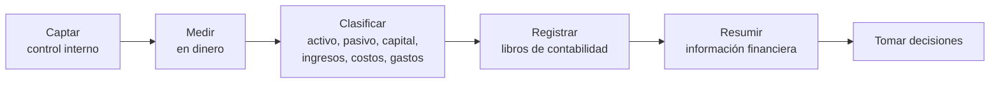
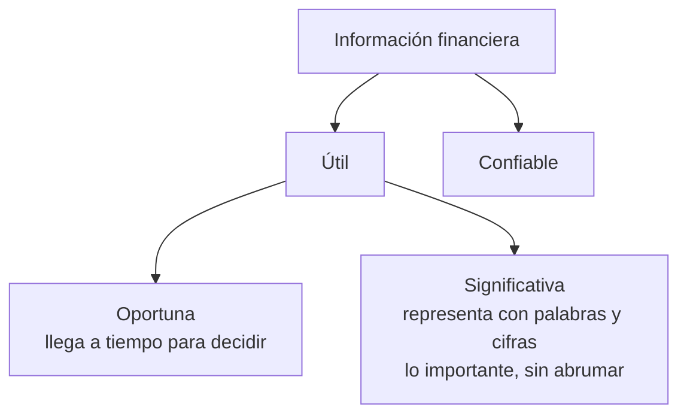
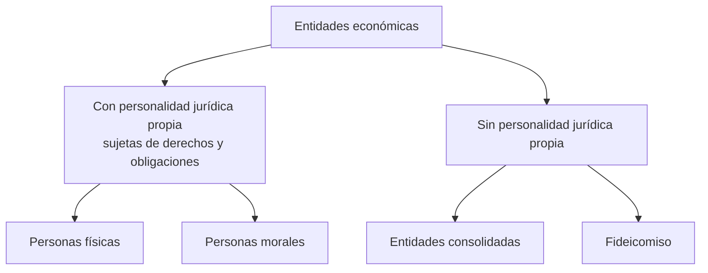
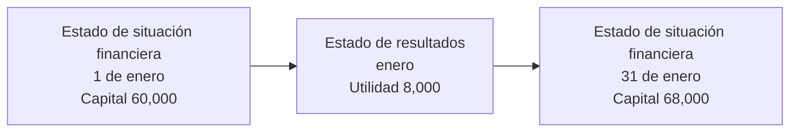

# 2. La contabilidad, la entidad y la información financiera

> **Reescritura didáctica** del capítulo sobre la naturaleza de la contabilidad, la entidad económica, los estados financieros y sus usuarios (enfoque México, NIF). Redacción original; las referencias normativas se verificaron y las erratas del texto fuente se señalan en recuadros. No es asesoría contable ni fiscal.

## Introducción

Toda **persona física o moral** —una tienda, una familia, una empresa— tiene que decidir **cómo distribuir sus recursos**. Para decidir bien necesita saber **qué tiene**, **qué debe** y **si está ganando o perdiendo**. La contabilidad existe para responder esas preguntas con números confiables.

En esta lección verás:

- La **naturaleza** de la contabilidad y el proceso que sigue (captar → medir → clasificar → registrar → resumir)
- Qué hace **útil y confiable** a la información financiera
- La **entidad económica**: definición, elementos y clasificación
- Los **cuatro estados financieros principales** y quién los usa
- La **ecuación contable** (Activo = Pasivo + Capital) y el **estado de resultados**

Al final hay un ejercicio de **completar espacios** (una o dos palabras): escribe, comprueba, pide una **pista** o **ve la respuesta** si te atoras.

---

## 2.1 Naturaleza de la contabilidad

> La contabilidad es una **técnica** que produce **sistemática y estructuralmente** información **cuantitativa**, expresada en **unidades monetarias**, sobre los **eventos económicos identificables y cuantificables** que realiza una entidad.

### El proceso contable

| Paso | Qué significa | Ejemplo: se vende mercancía por $3,000 al contado |
|---|---|---|
| **Captar** | Un **sistema de control interno** asegura que **ninguna** operación quede fuera | Se emite la factura y entra el dinero a caja |
| **Medir** | Expresar el evento en **unidades monetarias** | $3,000 |
| **Clasificar** | Asignarlo a su grupo: **activo, pasivo, capital, ingresos, costos o gastos** | Aumenta un activo (caja) y hay un ingreso (ventas) |
| **Registrar** | Asentarlo en los **libros de contabilidad**, en orden cronológico | Asiento en el diario |
| **Resumir** | Presentarlo con **claridad** en los estados financieros | Aparece en ventas del estado de resultados |

La contabilidad es el **proceso inicial** y la **base** de la información financiera para la **toma de decisiones**.

### Cualidades de la información financiera

- **Oportuna**: un reporte de ventas de enero que llega en junio ya no sirve para decidir las compras de febrero.
- **Significativa**: muestra lo importante con **conceptos y cantidades**; no ahoga al lector en detalles.

El **CINIF** (Consejo Mexicano de Normas de Información Financiera) es el **órgano rector** que emite las **Normas de Información Financiera (NIF)**, antes llamadas *principios de contabilidad*.

:::info Actualización
Hoy el **Marco Conceptual** de las NIF (NIF A-4) organiza estas cualidades como **características cualitativas**: la fundamental es la **confiabilidad**, y además la **relevancia**, la **comprensibilidad** y la **comparabilidad**. “Oportuna y significativa” del texto fuente se relacionan con la **relevancia** y con la **importancia relativa**.
:::

---

## 2.2 La entidad

La **entidad** es un **postulado básico** de las NIF:

> La entidad económica es una **unidad identificable** que realiza actividades económicas, constituida por **combinaciones de recursos humanos, materiales y financieros**, conducidos y administrados por un **único centro de control** que toma decisiones encaminadas al **cumplimiento de fines específicos**.

### Elementos de toda entidad

| Elemento | Pregunta que responde | Ejemplo: “Panadería La Espiga, S.A. de C.V.” |
|---|---|---|
| a) **Unidad identificable** | ¿Se distingue de otras? | Tiene nombre, RFC y domicilio propios |
| b) **Conjunto integrado de actividades económicas y recursos** | ¿Qué hace y con qué? | Panaderos (humanos), hornos (materiales), capital y crédito (financieros) |
| c) **Único centro de control** | ¿Quién decide? | El consejo y la dirección general |
| d) **Fines específicos** | ¿Para qué existe? | Producir y vender pan con utilidad |
| e) **Personalidad** | ¿Es sujeto de derechos y obligaciones? | Sí: es persona moral, distinta de sus socios |

:::caution Errata del texto fuente
El texto dice que la entidad es un postulado de la **NIF A-3**, pero su propia nota al pie cita la **NIF A-2**. La correcta es la **NIF A-2, “Postulados básicos”** (vigente desde el 1 de enero de 2006). La **NIF A-3** trata de las *Necesidades de los usuarios y objetivos de los estados financieros*.
:::

### Clasificación de las entidades

| Tipo | Explicación |
|---|---|
| **Con personalidad jurídica propia** | **Personas físicas** o **morales**, con personalidad y patrimonio propios. En una persona moral, la contabilidad registra los derechos, obligaciones y resultados **de la entidad**, no los de sus socios o administradores |
| **Entidades consolidadas** | Dos o más entidades con personalidad propia que se presentan **como un todo** (p. ej., una controladora y sus subsidiarias), aunque cada una actúa y responde individualmente |
| **Fideicomiso** | Patrimonio **autónomo** cuya titularidad tiene el **fiduciario** (una institución de crédito), que decide sobre él para cumplir un fin determinado |

**Ejemplo**: si la socia de La Espiga paga con su tarjeta personal la colegiatura de su hijo, ese gasto **no** va en la contabilidad de la panadería: la entidad es distinta de sus dueños.

<GuidedChoiceExplanation preset="contab-entidad" />

---

### Punto de control 1: contabilidad y entidad

<MultipleChoice
  id="contab-2-mid1"
  title="Punto de control — naturaleza de la contabilidad y la entidad"
  questions={[
    {
      prompt: '¿Qué garantiza que no quede sin captar ninguna operación de la entidad?',
      choices: ['El estado de resultados', 'Un sistema de control interno', 'La declaración anual', 'El auditor externo'],
      answer: 1,
      why: 'Primer paso del proceso contable.',
    },
    {
      prompt: 'Para que la información financiera sea útil debe ser…',
      choices: ['Extensa y detallada', 'Oportuna y significativa', 'Secreta y fiscal', 'Anual y auditada'],
      answer: 1,
      why: 'Útil = oportuna y significativa; además, confiable.',
    },
    {
      prompt: 'El dueño de un negocio paga con dinero de la empresa una cena familiar. ¿Qué concepto se viola si se registra como gasto del negocio?',
      choices: ['Oportunidad', 'Entidad', 'Moneda', 'Fideicomiso'],
      answer: 1,
      why: 'La entidad es distinta de sus dueños.',
    },
    {
      prompt: '¿Cuál es una entidad SIN personalidad jurídica propia?',
      choices: ['Una persona física', 'Una sociedad anónima', 'Un fideicomiso', 'Una cooperativa'],
      answer: 2,
      why: 'Su titularidad la tiene el fiduciario; también las entidades consolidadas.',
    },
    {
      type: 'order',
      prompt: 'Ordena el proceso contable.',
      items: ['Captar', 'Medir', 'Clasificar', 'Registrar', 'Resumir'],
      why: 'En orden cronológico y con claridad.',
    },
  ]}
/>

---

## 2.3 La información financiera

Todo usuario se hace al menos **dos preguntas**:

| Pregunta | Estado que la responde | Tipo |
|---|---|---|
| **¿Cuánto tengo?** | **Estado de situación financiera** (balance general) | **Estático** — a una **fecha** |
| **¿Cuánto he ganado o perdido?** | **Estado de resultados** (estado de pérdidas y ganancias) | **Dinámico** — por un **periodo** |

### Los cuatro estados financieros principales

| # | Estado | Muestra | Otros nombres |
|---|---|---|---|
| 1 | **Estado de situación financiera** | Activos, pasivos y capital a una fecha | Balance general, estado de condición financiera, estado de activo, pasivo y capital |
| 2 | **Estado de resultados** | Ingresos, costos, gastos, impuestos y la **utilidad o pérdida** de un periodo | Estado de pérdidas y ganancias, estado de ingresos y gastos |
| 3 | **Estado de cambios en la situación financiera** (con base en efectivo) | De dónde vinieron los recursos y en qué se usaron; mide la capacidad de **generar efectivo** | — |
| 4 | **Estado de variaciones en el capital contable** | Cambios en la inversión de los propietarios | — |

“**Balance**” viene de que **iguala** (balancea) los activos con la suma de lo que corresponde a acreedores y dueños. “**Pérdidas y ganancias**” viene de la última línea del estado; “**resultados**” es más amplio porque incluye ingresos, costos, gastos e impuestos.

:::info Actualización
Desde **2008**, la **NIF B-2** sustituyó el *estado de cambios en la situación financiera* por el **estado de flujos de efectivo**. Hoy los estados básicos se llaman: **estado de situación financiera**, **estado de resultado integral** (NIF B-3), **estado de cambios en el capital contable** (NIF B-4) y **estado de flujos de efectivo** (NIF B-2), junto con sus **notas**.
:::

### Usuarios de los estados financieros

| Usuario | Interno / externo | ¿Qué le interesa? |
|---|---|---|
| **Accionistas** y posibles **inversionistas** | Interno / externo | **Riesgo y rendimiento**; decidir si vender, conservar o invertir más |
| **Empleados y sindicatos** | Interno | Utilidades y su **participación** (PTU), estabilidad, salarios, crecimiento |
| **Administradores** | Interno | Todo, con el mayor detalle: **controlar, planear y decidir**; además son responsables de **preparar** la información |
| **Instituciones de crédito** | Externo | Si los préstamos e intereses **se pagarán**: estructura financiera y generación de fondos |
| **Proveedores y otros acreedores** | Externo | Si sus créditos se liquidarán; si será un buen cliente |
| **Clientes** | Externo | **Continuidad** de la empresa como proveedora |
| **Gobierno y cámaras** | Externo | Mercado, regulación, **política fiscal**, estadísticas |
| **Público en general** | Externo | Empleos, relación con la industria local, tamaño y tendencia de la empresa |

<GuidedChoiceExplanation preset="contab-usuarios" />

---

## 2.4 El estado de situación financiera y la ecuación contable

Muestra **a una fecha** los **recursos** de la entidad y **quién tiene derechos** sobre ellos.

| Elemento | Qué es | Ejemplos |
|---|---|---|
| **Activo** | Bienes y derechos **propiedad** de la entidad, con valor monetario | Efectivo, cuentas por cobrar a clientes, inventarios, mobiliario |
| **Pasivo** | **Deudas y obligaciones** a cargo de la entidad | Proveedores, bancos, acreedores diversos, impuestos por pagar |
| **Capital** | La **propiedad** de los dueños: la diferencia entre activos y pasivos | Aportaciones de socios, utilidades acumuladas |

### La ecuación contable

**Activo = Pasivo + Capital**

| Fórmula | Despeje | Ejemplo |
|---|---|---|
| Del **activo** | A = P + C | 100,000 = 40,000 + 60,000 |
| Del **pasivo** | P = A − C | 40,000 = 100,000 − 60,000 |
| Del **capital** | C = A − P | 60,000 = 100,000 − 40,000 |

**Ejemplo — La Espiga al 31 de diciembre**:

| Activo | | Pasivo y capital | |
|---|---|---|---|
| Caja y bancos | 15,000 | Proveedores | 22,000 |
| Clientes | 10,000 | Préstamo bancario | 18,000 |
| Inventario (harina, azúcar) | 25,000 | **Total pasivo** | **40,000** |
| Equipo (hornos) | 50,000 | **Capital** | **60,000** |
| **Total activo** | **100,000** | **Total pasivo + capital** | **100,000** |

Los activos “**están sujetos**” a los derechos de acreedores (40%) y dueños (60%).

---

## 2.5 El estado de resultados

Muestra los efectos de las operaciones de un **periodo** (normalmente no más de un año) y su resultado final: **utilidad** o **pérdida**.

- **Ingresos**: lo que la entidad **percibe** por sus operaciones (ventas, servicios).
- **Costos y gastos**: lo que **requiere** para lograr esas operaciones.

**Utilidad (o pérdida) = Ingresos − Costos − Gastos**

**Ejemplo — La Espiga, enero**:

| Concepto | $ |
|---|---|
| Ventas | 50,000 |
| (−) Costo de lo vendido | 30,000 |
| **= Utilidad bruta** | **20,000** |
| (−) Gastos de operación | 12,000 |
| **= Utilidad del periodo** | **8,000** |

### Cómo se conectan los dos estados

La **utilidad aumenta el capital** y la **pérdida lo disminuye**. Si La Espiga empezó enero con capital de 60,000 y ganó 8,000 (sin retiros de los socios), al final de enero su capital es **68,000** — y la ecuación sigue cuadrando, porque los activos netos crecieron en lo mismo.

<GuidedChoiceExplanation preset="contab-ecuacion" />

---

### Punto de control 2: estados financieros

<MultipleChoice
  id="contab-2-mid2"
  title="Punto de control — estados financieros y ecuación contable"
  questions={[
    {
      prompt: '¿Por qué el estado de situación financiera es un estado estático?',
      choices: ['Porque no cambia nunca', 'Porque muestra la situación a una fecha determinada', 'Porque solo lo usan los dueños', 'Porque no incluye dinero'],
      answer: 1,
      why: 'Una “foto” en una fecha; el estado de resultados es la “película” de un periodo.',
    },
    {
      prompt: 'Activo 250,000; pasivo 90,000. ¿Capital?',
      choices: ['340,000', '160,000', '90,000', '250,000'],
      answer: 1,
      why: 'C = A − P.',
    },
    {
      prompt: 'Ingresos 80,000; costos 45,000; gastos 40,000. ¿Resultado?',
      choices: ['Utilidad 5,000', 'Pérdida 5,000', 'Utilidad 35,000', 'Pérdida 85,000'],
      answer: 1,
      why: '80,000 − 45,000 − 40,000 = −5,000.',
    },
    {
      prompt: 'Un banco evalúa un préstamo. ¿Qué le interesa principalmente?',
      choices: ['La cobertura de mercado', 'Si le pagarán el crédito y los intereses al vencimiento', 'Los empleos en la comunidad', 'La PTU'],
      answer: 1,
      why: 'Estructura financiera y generación de fondos.',
    },
    {
      prompt: '¿Qué estado sustituyó en 2008 al estado de cambios en la situación financiera?',
      choices: ['El estado de resultados', 'El estado de flujos de efectivo', 'El balance general', 'El estado de variaciones en el capital'],
      answer: 1,
      why: 'NIF B-2.',
    },
    {
      type: 'order',
      prompt: 'Ordena los cuatro estados principales como los presenta el texto.',
      items: ['Estado de situación financiera', 'Estado de resultados', 'Estado de cambios en la situación financiera', 'Estado de variaciones en el capital contable'],
      why: 'Primero el fundamental (situación financiera).',
    },
  ]}
/>

---

## Practica: ecuación contable y resultados

Escribe el número (sin signo de pesos ni comas). Tienes dos intentos antes de ver la respuesta.

<ProblemSet id="contab-2-numeros" lang="es">
  <Problem
    title="N1"
    decimals={0}
    prompt={`Activo 100,000 y capital 60,000. ¿Cuánto es el pasivo?`}
    answer={40000}
    why={`P = A − C = 100,000 − 60,000.`}
  />
  <Problem
    title="N2"
    decimals={0}
    prompt={`Pasivo 35,000 y capital 85,000. ¿Cuánto es el activo?`}
    answer={120000}
    why={`A = P + C.`}
  />
  <Problem
    title="N3"
    decimals={0}
    prompt={`Caja 12,000; clientes 8,000; inventario 30,000; equipo 50,000; proveedores 25,000; préstamo bancario 15,000. ¿Cuánto es el capital?`}
    answer={60000}
    why={`Activo 100,000 − pasivo 40,000.`}
  />
  <Problem
    title="N4"
    decimals={0}
    prompt={`Ventas 50,000; costo de lo vendido 30,000; gastos de operación 12,000. ¿Utilidad del periodo?`}
    answer={8000}
    why={`50,000 − 30,000 − 12,000.`}
  />
  <Problem
    title="N5"
    decimals={0}
    prompt={`Capital inicial 60,000; utilidad del periodo 8,000; sin aportaciones ni retiros. ¿Capital final?`}
    answer={68000}
    why={`La utilidad incrementa el capital.`}
  />
  <Problem
    title="N6"
    decimals={0}
    prompt={`Ingresos 70,000; costos 48,000; gastos 30,000. ¿Resultado? (Escribe negativo si es pérdida.)`}
    answer={-8000}
    why={`70,000 − 48,000 − 30,000 = −8,000: pérdida, que reduce el capital.`}
  />
  <Problem
    title="N7"
    decimals={0}
    prompt={`Activo 100,000; pasivo 40,000. ¿Qué porcentaje del activo financian los dueños?`}
    answer={60}
    why={`Capital 60,000 / activo 100,000 = 60%.`}
  />
</ProblemSet>

---

### Evaluación: contabilidad, entidad e información financiera

<MultipleChoice
  id="contab-2"
  title="Contabilidad, entidad e información financiera"
  questions={[
    {
      prompt: '¿En qué se expresa la información que produce la contabilidad?',
      choices: ['En unidades físicas', 'En unidades monetarias', 'Solo en palabras', 'En porcentajes'],
      answer: 1,
      why: 'Información cuantitativa en dinero.',
    },
    {
      prompt: '¿Qué NIF contiene el postulado de entidad?',
      choices: ['NIF A-3', 'NIF A-2', 'NIF B-2', 'NIF C-1'],
      answer: 1,
      why: 'NIF A-2, Postulados básicos.',
    },
    {
      prompt: '¿Quién tiene la titularidad del patrimonio de un fideicomiso?',
      choices: ['El fideicomitente', 'El fiduciario (institución de crédito)', 'El SAT', 'Los beneficiarios'],
      answer: 1,
      why: 'Por eso el fideicomiso no tiene personalidad jurídica propia.',
    },
    {
      prompt: '¿Cuál es un usuario INTERNO?',
      choices: ['Un banco', 'Un proveedor', 'Un administrador', 'El gobierno'],
      answer: 2,
      why: 'Internos: accionistas, empleados y administradores.',
    },
    {
      prompt: 'Una pérdida del periodo…',
      choices: ['Aumenta el capital', 'Disminuye el capital', 'Aumenta el pasivo siempre', 'No afecta ningún estado'],
      answer: 1,
      why: 'Modifica la ecuación contable reduciendo el capital.',
    },
    {
      prompt: '¿Qué estado es dinámico?',
      choices: ['Estado de situación financiera', 'Estado de resultados', 'Balance general', 'Estado de activo, pasivo y capital'],
      answer: 1,
      why: 'Acumula cifras por un periodo.',
    },
  ]}
/>

---

## Preguntas y problemas: completa los espacios

Escribe la palabra que falta en cada espacio (una o dos palabras) y pulsa **Comprobar**. No importan acentos ni mayúsculas. Si te atoras, pide una **Pista** (primera letra) o pulsa **Ver respuesta** y luego **Marcar como revisada**.

<ProblemSet id="contab-2-completar" lang="es">
  <Problem
    type="cloze"
    title="1"
    prompt={`La contabilidad es una [[técnica]] que produce sistemática y estructuralmente [[información]] cuantitativa.`}
  />
  <Problem
    type="cloze"
    title="2"
    prompt={`La información debe ser [[cuantitativa]] y expresada en [[unidades monetarias]].`}
  />
  <Problem
    type="cloze"
    title="3"
    prompt={`La información está basada en la [[identificación]] y [[cuantificación]] de los eventos económicos que [[realiza]] un ente económico.`}
  />
  <Problem
    type="cloze"
    title="4"
    prompt={`Los eventos económicos que realiza el ente deben ser captados a través de un [[sistema]] de [[control interno]].`}
  />
  <Problem
    type="cloze"
    title="5"
    prompt={`Los eventos económicos deben ser [[medidos]], [[clasificados]], [[registrados]] y resumidos con claridad.`}
  />
  <Problem
    type="cloze"
    title="6"
    prompt={`La información financiera sirve para [[tomar decisiones|la toma de decisiones]].`}
  />
  <Problem
    type="cloze"
    title="7"
    prompt={`La información financiera que se produce debe ser [[útil]] y [[confiable]].`}
  />
  <Problem
    type="cloze"
    title="8"
    prompt={`Para que la información financiera sea útil se requiere que sea [[oportuna]] y [[significativa]].`}
  />
  <Problem
    type="cloze"
    title="9"
    prompt={`La entidad es una [[unidad]] identificable que realiza actividades económicas.`}
  />
  <Problem
    type="cloze"
    title="10"
    prompt={`La entidad económica está constituida por un conjunto integrado de actividades [[económicas]] y [[recursos]].`}
  />
  <Problem
    type="cloze"
    title="11"
    prompt={`La entidad está controlada por un único [[centro]] de control que toma [[decisiones]] para el cumplimiento de sus fines [[específicos]].`}
  />
  <Problem
    type="cloze"
    title="12"
    prompt={`Las entidades que realizan actividades económicas [[pueden tener]] o [[no tener]] personalidad jurídica propia.`}
  />
  <Problem
    type="cloze"
    title="13"
    prompt={`Las entidades que tienen personalidad jurídica propia están sujetas a [[derechos]] y [[obligaciones]], diferentes de los de sus accionistas, propietarios o patrocinadores.`}
  />
  <Problem
    type="cloze"
    title="14"
    prompt={`Las entidades con personalidad jurídica propia pueden ser personas [[físicas]] o [[morales]].`}
  />
  <Problem
    type="cloze"
    title="15"
    prompt={`Las entidades sin personalidad jurídica propia son las entidades [[consolidadas]] y el [[fideicomiso]].`}
  />
  <Problem
    type="cloze"
    title="16"
    prompt={`La información financiera debe ser fácilmente leída e [[interpretada]] por el lector.`}
  />
  <Problem
    type="cloze"
    title="17"
    prompt={`El estado financiero que muestra el activo, el pasivo y el capital del ente económico se denomina estado de [[situación financiera]] o también [[balance general|balance]].`}
  />
  <Problem
    type="cloze"
    title="18"
    prompt={`El estado de situación financiera es un estado [[estático]] porque muestra la situación financiera del ente económico en una [[fecha]] determinada.`}
  />
  <Problem
    type="cloze"
    title="19"
    prompt={`La ecuación contable es: Activo = Pasivo + [[Capital]]. De ella se deducen: [[Pasivo]] = Activo − Capital, y [[Capital]] = Activo − Pasivo.`}
  />
  <Problem
    type="cloze"
    title="20"
    prompt={`El estado financiero que muestra los ingresos, costos y gastos, y como resultado la utilidad o pérdida, se denomina estado de [[resultados]] o también estado de [[pérdidas]] y [[ganancias]].`}
  />
  <Problem
    type="cloze"
    title="21"
    prompt={`El estado de resultados es un estado [[dinámico]] porque muestra el resultado de las operaciones por un [[periodo|período]] determinado.`}
  />
  <Problem
    type="cloze"
    title="22"
    prompt={`El estado de resultados muestra los ingresos, costos, gastos e impuestos, así como el resultado final como una [[utilidad|utilidad neta]] o [[pérdida neta|pérdida]].`}
  />
  <Problem
    type="cloze"
    title="23"
    prompt={`El estado que muestra los cambios de la situación financiera durante un periodo se denomina estado de [[cambios]] en la [[situación financiera]].`}
    why={`Desde 2008 la NIF B-2 lo sustituyó por el estado de flujos de efectivo.`}
  />
  <Problem
    type="cloze"
    title="24"
    prompt={`Los usuarios de los estados financieros pueden ser [[internos]] y [[externos]].`}
  />
  <Problem
    type="cloze"
    title="25"
    prompt={`Los usuarios internos son los [[accionistas]], [[administradores]] y [[empleados]]. Un usuario externo es el [[público en general|publico]], además de posibles nuevos inversionistas, instituciones de crédito, proveedores y clientes.`}
  />
</ProblemSet>

---

## Resumen

:::tip Recuerda
- Contabilidad: **técnica** que produce información **cuantitativa en unidades monetarias** sobre eventos **identificables y cuantificables**
- Proceso: **captar** (control interno) → **medir** → **clasificar** → **registrar** → **resumir**
- Información **útil** (oportuna y significativa) y **confiable**
- **Entidad** (NIF A-2): unidad identificable, recursos y actividades integrados, único centro de control, fines específicos, personalidad
- Con personalidad: **personas físicas y morales**; sin personalidad: **entidades consolidadas** y **fideicomiso**
- **Situación financiera** (estático, a una fecha) · **Resultados** (dinámico, por un periodo) · cambios en la situación financiera (hoy **flujos de efectivo**) · variaciones en el **capital**
- **Activo = Pasivo + Capital**; la utilidad aumenta el capital y la pérdida lo reduce
- Usuarios **internos** (accionistas, empleados, administradores) y **externos** (inversionistas, bancos, proveedores, clientes, gobierno, público)
:::

## Lecturas adicionales

- Siguiente: [3. La cuenta](./la-cuenta)
- [1. La contaduría](./la-contaduria)
- CINIF — NIF A-2 *Postulados básicos*, NIF A-3 *Necesidades de los usuarios*, NIF A-4 *Características cualitativas*, NIF B-2 a B-4 (estados financieros)
- Base: texto de *Contabilidad básica* (Grupo Editorial Patria), usado como guía de estudio
