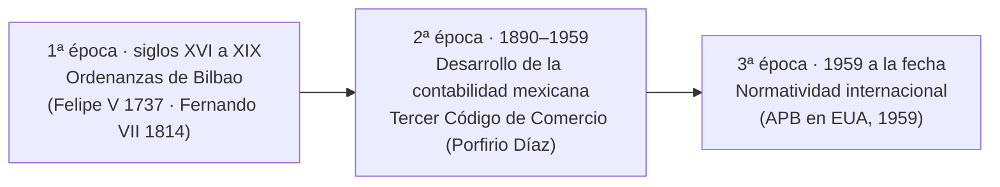
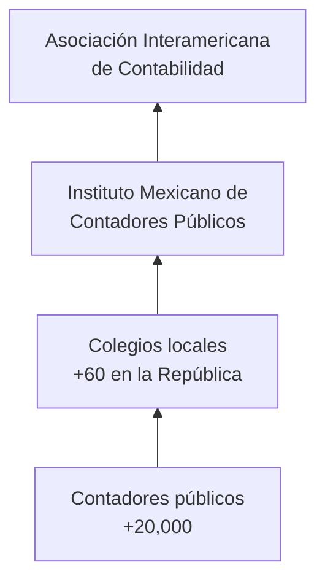

# 1. La contaduría

> **Reescritura didáctica** del capítulo introductorio de un texto de *Contabilidad básica* (enfoque México): historia de la contabilidad, marco jurídico, organización de la profesión, Código de Ética y certificación. Redacción original; las fechas y datos se verificaron y las erratas del texto fuente se señalan en recuadros. No es asesoría legal ni fiscal.

## Introducción

La **contabilidad** nació de un problema práctico: cuando un intercambio **no se liquidaba en el momento** —se entregaba la mercancía hoy y se pagaba después—, alguien tenía que **registrar quién debía qué a quién**. Ese registro es el origen de la contabilidad y de los contadores.

Hoy la contabilidad financiera **capta en orden cronológico**, mediante un sistema de **control interno**, los eventos económicos **identificables y cuantificables** de una entidad, para **medirlos, clasificarlos, registrarlos y resumirlos** en información financiera útil para **tomar decisiones**.

En esta lección verás:

- La **historia** de la contabilidad: de Luca Pacioli (1494) a las tres épocas de la contabilidad en México
- El **marco jurídico** que obliga a llevar contabilidad
- Cómo se **organiza la profesión** de contador público
- Los **12 postulados** del Código de Ética Profesional
- El papel del **contador público independiente**, el **dictamen** y la **certificación**

Al final hay un **cuestionario de respuesta escrita**: escribe tu respuesta, compárala con la **solución oficial** y márcala como revisada.

---

## 1.1 Historia de la contabilidad

### Los orígenes

| Momento | Hecho clave |
|---|---|
| Trueque | Aparece la contabilidad cuando una operación **no se paga al recibir o entregar** la mercancía |
| **1494**, Venecia | Fra **Luca Pacioli** publica el tratado *De computis et scripturis* (“Tratado de las cuentas y las escrituras”), que explica la **partida doble** |
| Siglo XVI | El **descubrimiento de América** impulsa un enorme desarrollo comercial entre **España y sus colonias** |

:::info Precisión
*De computis et scripturis* no se publicó como libro aparte: es una **sección** de la obra de Pacioli *Summa de arithmetica, geometria, proportioni et proportionalita* (Venecia, 1494). Es el primer texto **impreso** conocido que describe la partida doble, que ya usaban los mercaderes italianos antes.
:::

### Partida doble en una línea

Cada operación afecta **al menos dos cuentas** por el **mismo importe**: lo que se **carga** en una se **abona** en otra. Por eso la suma de cargos siempre es igual a la suma de abonos.

**Ejemplo**: una empresa compra mercancía por $10,000 a crédito.

| Cuenta | Cargo | Abono |
|---|---|---|
| Inventario (almacén) | 10,000 | |
| Proveedores | | 10,000 |
| **Sumas iguales** | **10,000** | **10,000** |

(Los cargos y abonos se estudian a fondo en lecciones posteriores.)

### Las tres épocas de la contabilidad en México

| Época | Periodo | Norma o hito |
|---|---|---|
| **1ª — Colonial** | Siglos XVI a finales del XIX | **Ordenanzas de Bilbao**, aprobadas por Felipe V (1737) y confirmadas por Fernando VII (1814); regulaban el comercio en gran parte del mundo hispano |
| **2ª — Desarrollo mexicano** | 1890–1959 | **Tercer Código de Comercio** (gobierno de Porfirio Díaz), que sustituye a las Ordenanzas. En 1891 Francisco de Padua Diez Barroso pide crear obras de enseñanza comercial; su hijo, **Fernando Diez Barroso**, fue el **primer contador público** titulado de México (1907) |
| **3ª — Moderna, con normatividad internacional** | 1959 a la fecha | Se crea en EUA la **Junta de Principios de Contabilidad** (*Accounting Principles Board*, APB) |

### De los Boletines a las NIF

| Año | Hecho |
|---|---|
| **1969** | La Comisión de Principios de Contabilidad del **Instituto Mexicano de Contadores Públicos (IMCP)** emite los primeros **Boletines de Principios de Contabilidad** → nace una estructura contable financiera mexicana |
| **1 de junio de 2004** | La Comisión deja de emitir Boletines; la emisión de normas pasa al **CINIF** (Consejo Mexicano de Normas de Información Financiera) |
| Hoy | El CINIF emite las **Normas de Información Financiera (NIF)** y busca **homologarlas** con las normas internacionales (**IFRS/NIIF**) para que la información sea comparable en cualquier parte del mundo |

**Definición clave** (CINIF): *la contabilidad es una técnica que se utiliza para el registro de las operaciones* que afectan económicamente a una entidad —**transacciones, transformaciones internas y otros eventos**— y que produce sistemática y estructuralmente **información financiera**.

:::caution Erratas del texto fuente
- El resumen del libro dice que la primera época va “de los siglos XVI a **XXI**”; el texto correcto es **XVI a finales del XIX**.
- Una respuesta del libro fecha el CINIF el “**10** de junio de 2004”; el texto dice **1 de junio de 2004**, que es la fecha en que el CINIF asumió la emisión de normas (el organismo se había constituido en 2002).
- Una respuesta dice “España y sus **provincias**”; el texto dice **colonias**.
:::

:::info Actualización
La APB estadounidense fue sustituida en **1973** por el **FASB** (*Financial Accounting Standards Board*). A nivel mundial, las **IFRS** las emite el **IASB** (desde 2001); en México, las empresas que cotizan en bolsa reportan bajo IFRS desde 2012, y el resto suele aplicar las NIF del CINIF.
:::

<GuidedChoiceExplanation preset="contab-historia" />

---

### Punto de control 1: historia

<MultipleChoice
  id="contab-1-mid1"
  title="Punto de control — historia de la contabilidad"
  questions={[
    {
      prompt: '¿Cuándo aparece la contabilidad?',
      choices: [
        'Cuando se inventa el dinero en papel',
        'Cuando una operación de trueque no se liquida al momento de recibir o entregar la mercancía',
        'Con la Revolución Industrial',
        'Con la creación del CINIF',
      ],
      answer: 1,
      why: 'Hace falta registrar lo que queda pendiente de pago.',
    },
    {
      prompt: '¿Qué obra de 1494 explica la partida doble?',
      choices: [
        'Las Ordenanzas de Bilbao',
        'El Código de Comercio',
        'El tratado De computis et scripturis de Luca Pacioli',
        'Los Boletines del IMCP',
      ],
      answer: 2,
      why: 'Publicado en Venecia como parte de la Summa de Pacioli.',
    },
    {
      prompt: '¿Qué norma regulaba el comercio en la primera época de la contabilidad en México?',
      choices: ['Las NIF', 'Las Ordenanzas de Bilbao', 'La Ley del ISR', 'El Código de Ética'],
      answer: 1,
      why: 'Aprobadas por Felipe V en 1737.',
    },
    {
      prompt: 'Compra a crédito de $5,000 de mercancía. ¿Cuánto suman los cargos y los abonos?',
      choices: ['Cargos 5,000 y abonos 0', 'Cargos 5,000 y abonos 5,000', 'Cargos 10,000 y abonos 5,000', 'Nada; no hubo pago'],
      answer: 1,
      why: 'Partida doble: Inventario se carga y Proveedores se abona por el mismo importe.',
    },
    {
      type: 'order',
      prompt: 'Ordena cronológicamente.',
      items: ['Tratado de Pacioli (1494)', 'Ordenanzas de Bilbao aprobadas (1737)', 'Primeros Boletines del IMCP (1969)', 'El CINIF asume la emisión de normas (2004)'],
      why: 'De la partida doble impresa a las NIF.',
    },
  ]}
/>

---

## 1.2 Marco jurídico de la información financiera

La obligación de **llevar cuenta y razón** de los negocios proviene de varias leyes:

| Ordenamiento | Qué establece |
|---|---|
| **Código de Comercio** (art. 33) | El comerciante debe llevar y mantener un **sistema de contabilidad adecuado** |
| **Ley General de Sociedades Mercantiles** | Información financiera de las sociedades (p. ej., informe anual de los administradores) |
| **Ley del Impuesto sobre la Renta** | Llevar contabilidad conforme al Código Fiscal de la Federación |
| **Código Fiscal de la Federación** | Reglas de la contabilidad para efectos fiscales |
| **Ley del IVA** y su Reglamento (art. 32) | Registros que permitan identificar las operaciones gravadas |

:::info Actualización
El texto fuente cita el **artículo 86** de la LISR, que corresponde a la ley anterior. Con la **LISR vigente desde 2014**, la obligación de llevar contabilidad de las personas morales está en el **artículo 76**, y las reglas de la contabilidad en el **artículo 28 del Código Fiscal de la Federación** (hoy incluye la **contabilidad electrónica** y los CFDI).
:::

---

## 1.3 La contaduría pública como profesión

- La **Ley de Profesiones** regula el ejercicio profesional; según el texto, para ejercer hay que **formar parte de un colegio de profesionistas**.
- La profesión agrupa a **más de 20,000 contadores públicos** en **más de 60 colegios** en todo el país.
- Los colegios integran el **Instituto Mexicano de Contadores Públicos (IMCP)**, una **federación de colegios**.

:::caution Precisión
En la práctica, la ley exige **título y cédula profesional** para ejercer; la **colegiación es voluntaria** en general. Sí es **obligatoria para ciertos fines**: por ejemplo, para emitir **dictámenes fiscales**, el Código Fiscal exige ser miembro de un colegio profesional y estar **certificado**.
:::

### El Código de Ética Profesional

El IMCP emite el **Código de Ética Profesional**, de **observancia obligatoria** para todos los contadores públicos. Busca dar **garantías de solvencia moral** y fijar **normas de actuación**. Tiene **12 postulados** en tres bloques más uno general:

| # | Postulado | Idea central |
|---|---|---|
| **I** | **Aplicación universal del código** | Aplica a firmas y contadores nacionales o extranjeros, independientes o empleados en el sector público o privado |
| | ***Responsabilidad hacia la sociedad*** | |
| **II** | Independencia de criterio | Criterio **imparcial** y libre de conflictos de interés |
| **III** | Calidad profesional de los trabajos | Siempre observar las normas de la profesión |
| **IV** | Preparación y calidad profesional | Entrenamiento técnico y capacitación necesarios |
| **V** | Responsabilidad personal | Responde por lo que hace y por lo que se hace bajo su dirección |
| | ***Responsabilidad hacia quien patrocina los servicios*** | |
| **VI** | Secreto profesional | No revelar lo conocido en el ejercicio profesional, ni en beneficio propio ni de terceros |
| **VII** | Rechazar tareas que no cumplan con la moral | No intervenir en arreglos o asuntos inmorales |
| **VIII** | Lealtad hacia el patrocinador | No aprovecharse de situaciones que perjudiquen al cliente |
| **IX** | Retribución económica | Tiene derecho a cobrar por sus servicios |
| | ***Responsabilidad hacia la profesión*** | |
| **X** | Respeto a los colegas y a la profesión | Cuidar relaciones con colaboradores, colegas e instituciones |
| **XI** | Dignificación de la imagen profesional a base de calidad | Proyectar una imagen positiva y de prestigio |
| **XII** | Difusión y enseñanza de conocimientos técnicos | Mantener altas normas y contribuir a difundir el conocimiento |

**Conteo**: 1 general + **4** hacia la sociedad + **4** hacia el patrocinador + **3** hacia la profesión = **12**.

El código aplica al contador como **profesional independiente**, **auditor externo**, en los **sectores público y privado** y en la **docencia**, e incluye **sanciones** para quien lo viole.

:::caution Errata del texto fuente
El texto dice que el contador debe “sostener un criterio **parcial**”. El sentido del postulado de independencia es exactamente el contrario: un criterio **imparcial**, libre de conflictos de interés.
:::

:::info Actualización
El IMCP ha actualizado su Código de Ética a lo largo de los años y hoy lo alinea con el **Código de Ética del IESBA** (IFAC), organizado por **principios fundamentales**: integridad, objetividad, competencia y diligencia profesionales, confidencialidad y comportamiento profesional. Los 12 postulados de esta lección corresponden a la versión del texto fuente.
:::

<GuidedChoiceExplanation preset="contab-etica" />

---

### Punto de control 2: marco jurídico y ética

<MultipleChoice
  id="contab-1-mid2"
  title="Punto de control — marco jurídico y Código de Ética"
  questions={[
    {
      prompt: '¿Qué artículo del Código de Comercio obliga al comerciante a llevar un sistema de contabilidad adecuado?',
      choices: ['Artículo 5', 'Artículo 33', 'Artículo 86', 'Artículo 32'],
      answer: 1,
      why: 'Artículo 33 del Código de Comercio.',
    },
    {
      prompt: 'Un contador comenta con un amigo las ventas de su cliente. ¿Qué postulado viola?',
      choices: ['Retribución económica', 'Secreto profesional', 'Aplicación universal', 'Difusión de conocimientos'],
      answer: 1,
      why: 'Postulado VI, responsabilidad hacia quien patrocina los servicios.',
    },
    {
      prompt: 'Un auditor tiene acciones de la empresa que audita. ¿Qué postulado está en riesgo?',
      choices: ['Independencia de criterio', 'Lealtad hacia el patrocinador', 'Respeto a los colegas', 'Retribución económica'],
      answer: 0,
      why: 'Postulado II: criterio imparcial y libre de conflicto de intereses.',
    },
    {
      prompt: '¿Cuántos postulados están orientados a la responsabilidad hacia la profesión?',
      choices: ['1', '3', '4', '12'],
      answer: 1,
      why: 'X, XI y XII.',
    },
    {
      type: 'order',
      prompt: 'Ordena los bloques del Código de Ética como aparecen.',
      items: ['Aplicación universal', 'Responsabilidad hacia la sociedad', 'Responsabilidad hacia quien patrocina los servicios', 'Responsabilidad hacia la profesión'],
      why: '1 + 4 + 4 + 3 = 12 postulados.',
    },
  ]}
/>

---

## 1.4 El contador público independiente y el dictamen

El contador público **independiente** es el **único** profesionista que puede **dictaminar** información financiera en México. En su **dictamen** (opinión de auditoría) afirma que los estados financieros **presentan razonablemente, en todos los aspectos importantes**, la **situación financiera** y los **resultados de las operaciones** de acuerdo con las **Normas de Información Financiera mexicanas (NIF)**.

“Razonablemente” no significa “con exactitud absoluta”: la auditoría da una **seguridad razonable**, no total, de que no hay **errores importantes** (materiales).

### Organización internacional

- El **IMCP** forma parte de la **Asociación Interamericana de Contabilidad (AIC)**, que reúne a los institutos de toda América (Argentina, Brasil, Canadá, Colombia, Chile, EUA, México, Perú, Uruguay, entre otros).
- En otros continentes existen organizaciones equivalentes; a nivel mundial, la **IFAC** (Federación Internacional de Contadores).

### Campo de acción

Además de dictaminar, el contador público puede ser:

- **Contador general** — creación y control de la información financiera
- Responsable de **costos** y **presupuestos**
- **Auditor interno**
- **Consultor fiscal**
- **Director de empresas** y, en general, funciones contables y financieras

### Certificación profesional

| Elemento | Detalle |
|---|---|
| Desde | **1 de mayo de 1998**: entra en vigor el reglamento de certificación |
| Propósito | Acreditar estudios, conocimientos y experiencia; permitir **reciprocidad** con organismos extranjeros |
| Examen | **Examen Uniforme de Certificación (EUC)**, preparado por el IMCP y aplicado por el **Ceneval** |
| Áreas | Responsabilidades profesionales y ética · contabilidad · costos · fiscal · derecho · finanzas · auditoría |
| Requisito clave | Para **dictaminar estados financieros para efectos fiscales** hay que estar **certificado** |

:::caution Errata del texto fuente
El resumen y una respuesta escriben “contabilidad **de costos**” como si fuera una sola área. El texto lista **contabilidad** y **costos** como áreas **separadas**.
:::

<GuidedChoiceExplanation preset="contab-profesion" />

---

### Punto de control 3: dictamen y certificación

<MultipleChoice
  id="contab-1-mid3"
  title="Punto de control — dictamen, organización y certificación"
  questions={[
    {
      prompt: '¿Quién puede dictaminar información financiera en México?',
      choices: ['Cualquier administrador', 'El contador público independiente', 'El SAT', 'El director general'],
      answer: 1,
      why: 'Es el único profesionista facultado.',
    },
    {
      prompt: 'En su dictamen, el contador afirma que los estados financieros…',
      choices: [
        'No contienen ningún error',
        'Presentan razonablemente, en todos los aspectos importantes, la situación financiera y los resultados conforme a las NIF',
        'Garantizan utilidades futuras',
        'Fueron elaborados por él mismo',
      ],
      answer: 1,
      why: 'Seguridad razonable, no absoluta.',
    },
    {
      prompt: '¿Quién aplica el Examen Uniforme de Certificación?',
      choices: ['El SAT', 'El Ceneval', 'La SEP', 'El CINIF'],
      answer: 1,
      why: 'Lo prepara el IMCP y lo aplica el Ceneval.',
    },
    {
      prompt: '¿A qué asociación continental pertenece el IMCP?',
      choices: ['IASB', 'Asociación Interamericana de Contabilidad', 'FASB', 'OCDE'],
      answer: 1,
      why: 'Reúne a los institutos de toda América.',
    },
    {
      type: 'order',
      prompt: 'Ordena de lo local a lo internacional.',
      items: ['Contador público', 'Colegio de contadores', 'Instituto Mexicano de Contadores Públicos', 'Asociación Interamericana de Contabilidad'],
      why: 'Persona → colegio → federación nacional → asociación continental.',
    },
  ]}
/>

---

### Ordena: repaso

<MultipleChoice
  id="contab-1-rank"
  title="Repaso de orden"
  questions={[
    {
      type: 'order',
      prompt: 'Ordena las tres épocas de la contabilidad en México.',
      items: ['Ordenanzas de Bilbao (siglos XVI–XIX)', 'Desarrollo mexicano con el Tercer Código de Comercio (1890–1959)', 'Normatividad internacional (1959 a la fecha)'],
      why: 'Colonial → mexicana → internacional.',
    },
    {
      type: 'order',
      prompt: 'Ordena el enfoque de la contabilidad financiera.',
      items: ['Captar los eventos económicos', 'Medirlos', 'Clasificarlos', 'Registrarlos', 'Resumirlos en información financiera'],
      why: 'Para la toma de decisiones.',
    },
  ]}
/>

---

### Evaluación: La contaduría

<MultipleChoice
  id="contab-1"
  title="La contaduría"
  questions={[
    {
      prompt: 'Según el CINIF, la contabilidad es…',
      choices: [
        'Un arte de calcular impuestos',
        'Una técnica que se utiliza para el registro de las operaciones',
        'Una ciencia exclusivamente jurídica',
        'Un libro de Pacioli',
      ],
      answer: 1,
      why: 'Registra transacciones, transformaciones internas y otros eventos.',
    },
    {
      prompt: '¿Qué organismo emite hoy las Normas de Información Financiera en México?',
      choices: ['El IMCP mediante Boletines', 'El CINIF', 'El SAT', 'La Bolsa Mexicana de Valores'],
      answer: 1,
      why: 'Desde el 1 de junio de 2004.',
    },
    {
      prompt: '¿Cuál NO forma parte del marco jurídico de la contabilidad?',
      choices: ['Código de Comercio', 'Ley del IVA', 'Ley General de Sociedades Mercantiles', 'Reglamento de Tránsito'],
      answer: 3,
      why: 'Los demás obligan a llevar o presentar contabilidad.',
    },
    {
      prompt: 'Un contador cobra honorarios por su trabajo. ¿Qué postulado lo respalda?',
      choices: ['Secreto profesional', 'Retribución económica', 'Independencia de criterio', 'Aplicación universal'],
      answer: 1,
      why: 'Postulado IX.',
    },
    {
      prompt: 'Un contador da clases en una universidad. ¿Le aplica el Código de Ética?',
      choices: ['No, solo a auditores', 'Sí, también en la docencia', 'Solo si es extranjero', 'Solo si dictamina'],
      answer: 1,
      why: 'Aplica como independiente, auditor externo, sectores público y privado, y docencia.',
    },
    {
      prompt: '¿Qué necesita un contador para dictaminar estados financieros para efectos fiscales?',
      choices: ['Solo el título', 'Estar certificado', 'Ser empleado del SAT', 'Tener 20 años de experiencia'],
      answer: 1,
      why: 'Certificación vía Examen Uniforme.',
    },
  ]}
/>

---

## Preguntas y problemas: respuesta escrita

Escribe tu respuesta con tus propias palabras en el recuadro, pulsa **Ver solución oficial** y compárala; después pulsa **Marcar como revisada**. Algunas preguntas piden términos obligatorios o un mínimo de palabras: pulsa **Verificar requisitos** antes de ver la solución. Tus borradores se guardan en este navegador.

<ProblemSet id="contab-1-preguntas" lang="es">
  <Problem
    type="concept"
    title="1"
    keywords={['trueque']}
    prompt={`¿Cuándo aparece en el mundo la contabilidad?`}
    answer={`Cuando, al hacer un simple trueque, la operación no se liquidaba en el momento de recibir o entregar la mercancía; había que registrar lo que quedaba pendiente.`}
  />
  <Problem
    type="concept"
    title="2"
    keywords={['Pacioli']}
    prompt={`¿Cuál es el primer libro de contabilidad que se conoce?`}
    answer={`El tratado De computis et scripturis (Tratado de las cuentas y las escrituras) de Fra Luca Pacioli, Venecia, 1494 —una sección de su Summa de arithmetica—, que explica la partida doble.`}
  />
  <Problem
    type="concept"
    title="3"
    prompt={`¿Qué trajo consigo el descubrimiento de América?`}
    answer={`Un extraordinario desarrollo comercial, principalmente entre España y sus colonias.`}
  />
  <Problem
    type="concept"
    title="4"
    minWords={15}
    keywords={['Bilbao']}
    prompt={`¿Cuántas épocas de desarrollo de la contabilidad mexicana se han determinado? Descríbelas.`}
    answer={`Tres: (1) la época colonial, de los siglos XVI a finales del XIX, normada por las Ordenanzas de Bilbao; (2) la de desarrollo de la contabilidad mexicana, de 1890 a 1959, que inicia con el Tercer Código de Comercio expedido en el gobierno de Porfirio Díaz; y (3) la época moderna con normatividad internacional, de 1959 a la fecha, que inicia con la creación de la Junta de Principios de Contabilidad (APB) en Estados Unidos.`}
  />
  <Problem
    type="concept"
    title="5"
    keywords={['1969']}
    prompt={`¿Cuándo se inicia la estructura contable financiera en México?`}
    answer={`En 1969, cuando la Comisión de Principios de Contabilidad del Instituto Mexicano de Contadores Públicos emite los primeros Boletines de Principios de Contabilidad.`}
  />
  <Problem
    type="concept"
    title="6"
    keywords={['2004']}
    prompt={`¿Cuándo asume el Consejo Mexicano de Normas de Información Financiera (CINIF) la emisión de normas?`}
    answer={`El 1 de junio de 2004; desde esa fecha el IMCP deja de emitir los Boletines de Principios de Contabilidad y el CINIF emite las Normas de Información Financiera (NIF).`}
  />
  <Problem
    type="concept"
    title="7"
    keywords={['registro']}
    prompt={`¿Qué es la contabilidad?`}
    answer={`Una técnica que se utiliza para el registro de las operaciones que afectan económicamente a una entidad y que produce sistemática y estructuralmente información financiera.`}
  />
  <Problem
    type="concept"
    title="8"
    minWords={10}
    prompt={`¿Cuál es el marco jurídico de la contabilidad y la información financiera?`}
    answer={`El Código de Comercio (art. 33), la Ley General de Sociedades Mercantiles, la Ley del Impuesto sobre la Renta, el Código Fiscal de la Federación y la Ley del Impuesto al Valor Agregado (y su Reglamento).`}
  />
  <Problem
    type="concept"
    title="9"
    keywords={['colegio']}
    prompt={`Para ejercer una profesión, ¿qué indica la Ley de Profesiones según el texto?`}
    answer={`Que es necesario formar parte de un colegio de profesionistas. (En la práctica se exige título y cédula; la colegiación es obligatoria para fines como el dictamen fiscal.)`}
  />
  <Problem
    type="concept"
    title="10"
    prompt={`¿Cómo está integrada la profesión contable?`}
    answer={`Por más de 20,000 contadores públicos que forman más de 60 colegios en la República, agrupados en el Instituto Mexicano de Contadores Públicos, que es una federación de colegios.`}
  />
  <Problem
    type="concept"
    title="11"
    prompt={`¿La observancia del Código de Ética Profesional es obligatoria para todos los contadores?`}
    answer={`Sí, su observancia es obligatoria para todos los contadores públicos.`}
  />
  <Problem
    type="concept"
    title="12"
    keywords={['12']}
    prompt={`¿Cuántos postulados contiene el Código de Ética Profesional?`}
    answer={`12 postulados.`}
  />
  <Problem
    type="concept"
    title="13"
    keywords={['universal']}
    prompt={`¿Cuál es el primer postulado del Código de Ética?`}
    answer={`La aplicación universal del código: aplica a firmas y contadores nacionales o extranjeros, en ejercicio independiente o como funcionarios o empleados de instituciones públicas o privadas.`}
  />
  <Problem
    type="concept"
    title="14"
    minWords={8}
    prompt={`¿Cuáles son los postulados relacionados con la responsabilidad hacia la sociedad?`}
    answer={`II Independencia de criterio, III Calidad profesional de los trabajos, IV Preparación y calidad profesional, y V Responsabilidad personal.`}
  />
  <Problem
    type="concept"
    title="15"
    minWords={8}
    keywords={['secreto']}
    prompt={`¿Cuáles son los postulados orientados hacia la responsabilidad con quien patrocina los servicios del contador público?`}
    answer={`VI Secreto profesional, VII Obligación de rechazar tareas que no cumplan con la moral, VIII Lealtad hacia el patrocinador de los servicios y IX Retribución económica.`}
  />
  <Problem
    type="concept"
    title="16"
    minWords={8}
    prompt={`¿Qué postulados están dirigidos hacia los colegas de los contadores públicos y su profesión?`}
    answer={`X Respeto a los colegas y a la profesión, XI Dignificación de la imagen profesional a base de calidad, y XII Difusión y enseñanza de conocimientos técnicos. (La respuesta del libro omite el postulado X.)`}
  />
  <Problem
    type="concept"
    title="17"
    keywords={['docencia']}
    prompt={`¿A qué actividades del contador público es aplicable el Código de Ética Profesional?`}
    answer={`A su actuación como profesional independiente, como auditor externo, en el desempeño en los sectores público y privado, y en la docencia.`}
  />
  <Problem
    type="concept"
    title="18"
    prompt={`¿Incluye sanciones el Código de Ética?`}
    answer={`Sí, el código establece sanciones para quien contravenga sus disposiciones.`}
  />
  <Problem
    type="concept"
    title="19"
    prompt={`¿Qué profesionista puede dictaminar información financiera en nuestro país?`}
    answer={`El contador público (independiente) es el único profesionista que puede dictaminar información financiera.`}
  />
  <Problem
    type="concept"
    title="20"
    minWords={15}
    keywords={['razonablemente']}
    prompt={`¿Qué afirma el contador público en su dictamen de los estados financieros?`}
    answer={`Que los estados financieros presentan razonablemente, en todos sus aspectos importantes, la situación financiera y los resultados de las operaciones de la entidad, de acuerdo con las Normas de Información Financiera mexicanas.`}
  />
  <Problem
    type="concept"
    title="21"
    keywords={['Interamericana']}
    prompt={`¿Con quién están afiliados los institutos de contadores en América?`}
    answer={`Con la Asociación Interamericana de Contabilidad, donde participan los institutos de toda América. En el resto del mundo existen asociaciones equivalentes (y, a nivel global, la IFAC).`}
  />
  <Problem
    type="concept"
    title="22"
    minWords={10}
    prompt={`¿En qué puede desempeñarse el contador público en la sociedad, además de dictaminar la información financiera?`}
    answer={`Como contador general, en la creación y control de la información financiera, de los costos y presupuestos, en auditoría interna, como consultor fiscal, en funciones contables y financieras en general y en la dirección de empresas, entre otras.`}
  />
  <Problem
    type="concept"
    title="23"
    keywords={['examen']}
    prompt={`¿Qué requiere el contador público, además de su título profesional, para ejercer como contador público independiente?`}
    answer={`Presentar un examen de certificación (Examen Uniforme de Certificación) que califique sus estudios y experiencia.`}
  />
  <Problem
    type="concept"
    title="24"
    keywords={['certificado']}
    prompt={`¿Qué requiere el contador público para dictaminar estados financieros para efectos fiscales?`}
    answer={`Estar certificado.`}
  />
  <Problem
    type="concept"
    title="25"
    minWords={8}
    prompt={`¿Qué incluye el examen de certificación?`}
    answer={`Conocimientos de: responsabilidades profesionales y ética, contabilidad, costos, fiscal, derecho, finanzas y auditoría.`}
  />
</ProblemSet>

---

## Resumen

:::tip Recuerda
- La contabilidad nace cuando una operación **no se liquida al momento**; Pacioli (1494) describe la **partida doble**
- Tres épocas en México: **Ordenanzas de Bilbao** (XVI–XIX), **desarrollo mexicano** (1890–1959), **normatividad internacional** (1959–hoy)
- **1969**: primeros Boletines del IMCP; **1 de junio de 2004**: el **CINIF** emite las **NIF**, homologadas con las IFRS
- Contabilidad = **técnica para el registro de las operaciones**
- Marco jurídico: Código de Comercio, LGSM, LISR, CFF, LIVA
- Profesión: **+20,000** contadores, **+60** colegios, **IMCP**, **AIC**
- Código de Ética: **12 postulados** (1 + 4 + 4 + 3), obligatorio y con sanciones
- Solo el **contador público independiente** dictamina; para el **dictamen fiscal** debe estar **certificado** (EUC, Ceneval)
:::

## Lecturas adicionales

- Siguiente: [2. La contabilidad, la entidad y la información financiera](./la-contabilidad-la-entidad-y-la-informacion-financiera)
- Comercio internacional: [Export–import practice](../export-import/introduction-to-export-import)
- CINIF — Normas de Información Financiera; IMCP — Código de Ética Profesional; IFAC / IESBA
- Base: texto de *Contabilidad básica* (Grupo Editorial Patria), usado como guía de estudio
