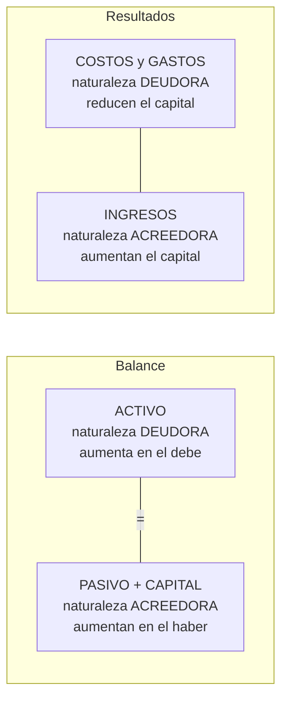
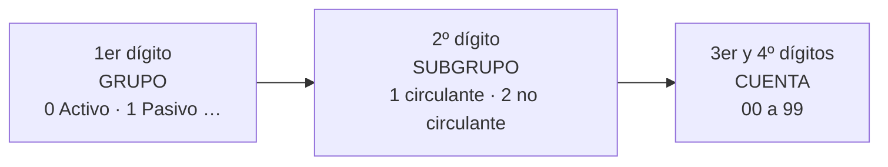

# 3. La cuenta

> **Reescritura didáctica** del capítulo sobre la cuenta contable: debe y haber, cargos y abonos, saldos, naturaleza deudora y acreedora, esquemas de mayor (“T”) y el catálogo de cuentas (enfoque México). Redacción original con ejemplos nuevos; las precisiones y actualizaciones se señalan en recuadros. No es asesoría contable ni fiscal.

## Introducción

En la lección anterior vimos la ecuación contable:

**Activo = Pasivo + Capital → 100,000 = 40,000 + 60,000**

Esa línea dice **cuánto** hay, pero no **qué**: ¿cuánto está en caja y cuánto en el banco? ¿a quién le debemos? ¿de dónde vienen las ventas? Para conocer el **detalle** de cada activo, pasivo, capital, ingreso, costo y gasto necesitamos una **cuenta** para cada concepto.

Además, el capital no solo cambia por utilidades o pérdidas: también **aumenta con las aportaciones** de los socios y **disminuye con los dividendos** que se decretan. Las cuentas registran todo ese movimiento.

En esta lección verás:

- Qué es una **cuenta** y sus partes: **debe, haber, cargo, abono, movimientos y saldo**
- Los **formatos** de cuenta (modelos “A” y “B”) y las **T** o esquemas de mayor
- La **naturaleza deudora o acreedora** de cada tipo de cuenta
- Cómo se construye un **catálogo de cuentas** codificado

Al final hay un ejercicio de **completar espacios** con pistas y respuesta.

---

## 3.1 La cuenta en general

> Las **cuentas** son los **registros** donde se describe en forma detallada y ordenada la **historia** de cada concepto del estado de situación financiera y del estado de resultados; es decir, el registro de sus **aumentos y disminuciones**.

Hay cuentas de **activo, pasivo, capital** y de **resultados** (u operación): **ingresos, costos y gastos**.

### El nombre de la cuenta

El nombre debe **corresponder al concepto** cuya historia se lleva:

| Cuenta | Qué registra |
|---|---|
| **Caja** (efectivo) | Dinero en la caja de la empresa |
| **Bancos** | Dinero en la cuenta de cheques |
| **Clientes** | Facturas pendientes de cobro |
| **Almacén** / inventario de productos terminados | Existencias listas para la venta |
| **Proveedores** | Compras pendientes de pago |
| **Capital social** | Aportaciones de los accionistas |
| **Ventas** | Operaciones realizadas con los clientes |
| **Gastos de venta** | Gastos generados por vender |

### Las partes de una cuenta

Cada cuenta ocupa una hoja **dividida a la mitad**:

| Término | Significado |
|---|---|
| **Debe** | Lado **izquierdo** |
| **Haber** | Lado **derecho** |
| **Cargo** (débito) | Cada registro hecho en el **debe** |
| **Abono** (crédito) | Cada registro hecho en el **haber** |
| **Movimiento deudor** | **Suma** de los cargos |
| **Movimiento acreedor** | **Suma** de los abonos |
| **Saldo** | **Diferencia** entre movimiento deudor y acreedor |
| **Saldo deudor** | Movimiento deudor **mayor** que el acreedor |
| **Saldo acreedor** | Movimiento acreedor **mayor** que el deudor |
| **Cuenta saldada** | Movimientos **iguales** → saldo **cero** |

:::tip Truco para recordar
**Debe** y **Cargo** empiezan del lado **izquierdo**; **Haber** y **Abono** del **derecho**. “Cargar” una cuenta = anotar en su debe; “abonar” = anotar en su haber. (En contabilidad, “débito” y “crédito” solo indican el **lado**, no si algo es bueno o malo.)
:::

### Formatos de cuenta

**Modelo “A”** — dos secciones, una para el debe (izquierda) y otra para el haber (derecha):

| Fecha | Concepto | Importe (Debe) | Fecha | Concepto | Importe (Haber) |
|---|---|---|---|---|---|
| | | | | | |

**Modelo “B”** — una sola página con columnas de debe, haber y **saldo** (variante: dos columnas de saldo, deudor y acreedor):

| Fecha | Concepto | Debe | Haber | Saldo |
|---|---|---|---|---|
| | | | | |

El modelo “B” es el que usan casi todos los sistemas electrónicos: muestra el **saldo actualizado** después de cada movimiento.

### Ejemplo: la cuenta Bancos de La Espiga (modelo “B”)

| Fecha | Concepto | Debe | Haber | Saldo |
|---|---|---|---|---|
| 1 mar | Saldo inicial | 50,000 | | 50,000 |
| 5 mar | Depósito por ventas | 20,000 | | 70,000 |
| 10 mar | Cheque a proveedores | | 30,000 | 40,000 |
| 20 mar | Pago de renta | | 15,000 | 25,000 |
| | **Movimientos** | **70,000** | **45,000** | **25,000 deudor** |

Movimiento deudor 70,000 − movimiento acreedor 45,000 = **saldo deudor 25,000**: el dinero que queda en el banco.

---

## 3.2 Naturaleza de las cuentas

Para que la ecuación **Activo = Pasivo + Capital** se conserve en los registros, cada lado de la ecuación “vive” en un lado de la cuenta:

| Tipo de cuenta | Naturaleza | Aumenta con | Disminuye con | Saldo normal |
|---|---|---|---|---|
| **Activo** | Deudora | Cargo | Abono | Deudor |
| **Pasivo** | Acreedora | Abono | Cargo | Acreedor |
| **Capital** | Acreedora | Abono | Cargo | Acreedor |
| **Ingresos** | Acreedora | Abono | Cargo | Acreedor |
| **Costos y gastos** | Deudora | Cargo | Abono | Deudor |

**¿Por qué los ingresos son acreedores?** Porque la utilidad **aumenta el capital**, que es acreedor. Los costos y gastos **reducen** el capital, por eso son deudores.

**Resultado del periodo**: si el saldo neto de las cuentas de resultados es **acreedor**, hay **utilidad**; si es **deudor**, hay **pérdida**.

- Las cuentas **deudoras** inician con un **cargo**; las **acreedoras**, con un **abono**.

:::info Precisión: cuentas complementarias
Algunas cuentas viven dentro de un grupo pero tienen la **naturaleza contraria**, porque **restan** a otra cuenta. Por ejemplo, la **depreciación acumulada** de mobiliario y la **provisión para cuentas de cobro dudoso** están en el activo pero tienen **saldo acreedor**: disminuyen el valor del activo con el que se relacionan. Las verás en la lección de procedimientos de ajuste.
:::

<GuidedChoiceExplanation preset="contab-naturaleza" />

---

## 3.3 Esquemas de mayor: las “T”

Para ejercicios y apuntes rápidos se usan las **“T”** (léase “tes”) o **esquemas de cuenta de mayor**: una T por cuenta, con el **debe a la izquierda** y el **haber a la derecha**. No hace falta una hoja por cuenta, solo un espacio.

**Ejemplo — Proveedores** (pasivo, naturaleza acreedora):

| Debe (cargos) | Haber (abonos) |
|---|---|
| (2) Pago 25,000 | (1) Compra a crédito 40,000 |
| | (3) Compra a crédito 10,000 |
| **Mov. deudor 25,000** | **Mov. acreedor 50,000** |
| | **Saldo acreedor 25,000** |

El saldo acreedor de 25,000 es lo que **todavía se debe** a los proveedores.

**Ejemplo — Ventas** (ingreso, acreedora): abonos 18,000 + 12,000 + 9,500 = **saldo acreedor 39,500**.

---

### Punto de control 1: la cuenta y su naturaleza

<MultipleChoice
  id="contab-3-mid1"
  title="Punto de control — la cuenta, debe, haber y naturaleza"
  questions={[
    {
      prompt: '¿Cómo se llama el registro que se hace en el lado izquierdo de una cuenta?',
      choices: ['Abono', 'Cargo', 'Saldo', 'Haber'],
      answer: 1,
      why: 'Cargo o débito, en el debe.',
    },
    {
      prompt: 'Una cuenta tiene movimiento deudor 70,000 y acreedor 45,000. ¿Su saldo?',
      choices: ['Acreedor 25,000', 'Deudor 25,000', 'Deudor 115,000', 'Cero'],
      answer: 1,
      why: 'El deudor es mayor: 70,000 − 45,000.',
    },
    {
      prompt: '¿Qué naturaleza tienen las cuentas de ingresos?',
      choices: ['Deudora', 'Acreedora', 'Mixta', 'Ninguna'],
      answer: 1,
      why: 'Aumentan el capital, que es acreedor.',
    },
    {
      prompt: '¿Cómo aumenta la cuenta Proveedores?',
      choices: ['Con un cargo', 'Con un abono', 'Con el saldo', 'No aumenta'],
      answer: 1,
      why: 'Es pasivo, naturaleza acreedora.',
    },
    {
      prompt: 'El saldo neto de las cuentas de resultados es deudor. ¿Qué significa?',
      choices: ['Utilidad', 'Pérdida', 'Cuenta saldada', 'Error'],
      answer: 1,
      why: 'Los costos y gastos superaron a los ingresos.',
    },
    {
      type: 'order',
      prompt: 'Ordena el cálculo del saldo de una cuenta.',
      items: ['Anotar cargos en el debe y abonos en el haber', 'Sumar el movimiento deudor', 'Sumar el movimiento acreedor', 'Restar el menor del mayor', 'Clasificar el saldo como deudor o acreedor'],
      why: 'Si son iguales, la cuenta está saldada.',
    },
  ]}
/>

---

## 3.4 El catálogo de cuentas

El **catálogo de cuentas** es el **conjunto ordenado** de cuentas que usa una entidad. Debe:

- **Agrupar** las cuentas por su **naturaleza**: activo, pasivo, capital, ingresos, costos y gastos
- Tener **código numérico**: indispensable en sistemas electrónicos (sin catálogo y código, la computadora no puede procesar las operaciones) y útil también en registros manuales
- Ser **flexible** para crecer cuando la empresa se expanda

### Cómo se ordena cada grupo

| Grupo | Subdivisión | Criterio |
|---|---|---|
| **Activo** | **Circulante** → **no circulante** | Del más **convertible en efectivo** (caja primero) a los de **más de un año** (inversiones a largo plazo, terrenos, maquinaria, muebles). Incluye **cargos diferidos**: gastos que se reparten en varios ejercicios |
| **Pasivo** | **Circulante** (≤ 1 año) → **no circulante** (> 1 año) | Primero lo **más exigible** (documentos por pagar antes que proveedores) |
| **Créditos diferidos** | — | Pasivo hoy que se convierte en **ingreso** con el tiempo (p. ej., intereses o rentas cobrados por anticipado) |
| **Capital** | Aportaciones → reservas → utilidades o pérdidas | Separa lo **aportado** por los socios de lo **ganado y retenido** |
| **Ingresos** | **Normales** → **otros ingresos** | Operación del objeto social vs. esporádicos |
| **Costos** | Un **solo** grupo | Costo de lo vendido |
| **Gastos** | **Normales** → **otros gastos** | Operación normal vs. esporádicos |
| **PTU e ISR** | Grupo especial | Participación de utilidades a empleados e impuesto sobre la renta |

### La estructura del código (4 dígitos)

| 1er dígito | Grupo |
|---|---|
| **0** | Activos |
| **1** | Pasivos |
| **2** | Créditos diferidos |
| **3** | Capital |
| **4** | Ingresos |
| **5** | Costos |
| **6** | Gastos |
| **7** | Otros ingresos y otros gastos |
| **8** | Participación de utilidades a empleados |
| **9** | Impuesto sobre la renta |

**Ejemplo de lectura**: **1103** → 1 (pasivo) · 1 (circulante) · 03 (proveedores).

### Catálogo de ejemplo

**0 Activos**

| Código | Cuenta | Código | Cuenta |
|---|---|---|---|
| | ***01 Circulante*** | | ***02 No circulante*** |
| 0101 | Caja | 0201 | Deudores hipotecarios |
| 0102 | Bancos | 0212 | Depósitos en garantía |
| 0110 | Documentos por cobrar | 0221 | Equipo de reparto |
| 0111 | Clientes | 0222 | Mobiliario y equipo |
| 0112 | Deudores diversos | 0223 | Edificio |
| 0113 | Intereses por cobrar ² | 0224 | Terreno |
| 0119 | Provisión para cuentas de cobro dudoso ² | 0231 | Depreciación de equipo de reparto ² |
| 0120 | Almacén | 0232 | Depreciación de mobiliario y equipo ² |
| 0121 | Inventario de mercancías ¹ | 0233 | Depreciación de edificio ² |
| 0129 | Provisión para inventarios de poco movimiento y obsoletos ² | 0241 | Patentes y marcas |
| 0130 | Seguros pagados por anticipado | 0251 | Amortización de patentes y marcas ² |
| 0131 | Papelería y útiles de escritorio | 0261 | Gastos de instalación y de organización |
| 0132 | Intereses pagados por anticipado | | |
| 0133 | Rentas pagadas por anticipado | | |
| 0134 | Propaganda y publicidad | | |

**1 Pasivos · 2 Créditos diferidos · 3 Capital**

| Código | Cuenta | Código | Cuenta |
|---|---|---|---|
| | ***11 Pasivo circulante*** | | ***2 Créditos diferidos*** |
| 1101 | Préstamos bancarios | 2001 | Intereses cobrados por anticipado |
| 1102 | Documentos por pagar | 2002 | Rentas cobradas por anticipado |
| 1103 | Proveedores | | ***3 Capital*** |
| 1104 | Acreedores diversos | 3001 | Capital (social) |
| 1105 | Intereses por pagar ² | 3002 | Cuenta particular del dueño |
| 1106 | Gastos acumulados ² | 3101 | Pérdidas y ganancias |
| 1107 | Impuestos acumulados ² | 3201 | Reserva de reinversión de utilidades |
| 1108 | Impuesto al valor agregado | 3300 | Utilidades acumuladas de años anteriores |
| 1109 | Impuesto sobre la renta por pagar | | |
| 1110 | Dividendos por pagar | | |
| | ***12 Pasivo no circulante*** | | |
| 1201 | Acreedores hipotecarios | | |

**4 a 9 Resultados**

| Código | Cuenta | Código | Cuenta |
|---|---|---|---|
| 4001 | Ventas | 6001 | Gastos de venta |
| 4060 | Ventas brutas ¹ | 6002 | Gastos de administración |
| 4061 | Devoluciones sobre ventas ¹ | 7101 | Gastos y productos financieros |
| 4062 | Descuentos sobre ventas ¹ | 7201 | Otros gastos y productos |
| 5001 | Costo de ventas | 8101 | Participación de utilidades a empleados |
| 5050 | Mercancías generales ¹ | 9102 | Impuesto sobre la renta |
| 5060 | Compras brutas ¹ | | |
| 5061 | Devoluciones sobre compras ¹ | | |
| 5062 | Descuentos sobre compras ¹ | | |
| 5063 | Gastos sobre compras ¹ | | |
| 5065 | Costo de ventas — método analítico ¹ | | |

¹ Se estudian con los sistemas de registro de compraventa de mercancías. ² Se estudian con los procedimientos de ajuste.

Cada empresa debe diseñar su catálogo **sobre una base razonada** y con **flexibilidad** para crecer; el número de dígitos depende de sus **necesidades**.

:::info Actualización
- Desde **2015**, el SAT exige la **contabilidad electrónica**: las empresas envían su catálogo de cuentas relacionando cada cuenta con el **código agrupador** oficial del SAT (anexo 24 de la Resolución Miscelánea Fiscal), además de su balanza de comprobación.
- Las NIF actuales (NIF B-6) hablan de activos y pasivos **a corto y largo plazo** en lugar de “circulantes y no circulantes”, y muchos conceptos de “créditos diferidos” hoy se presentan como pasivos (**anticipos de clientes**, ingresos cobrados por anticipado).
:::

<GuidedChoiceExplanation preset="contab-catalogo" />

---

### Punto de control 2: catálogo de cuentas

<MultipleChoice
  id="contab-3-mid2"
  title="Punto de control — catálogo de cuentas"
  questions={[
    {
      prompt: '¿Cuál es la primera cuenta del activo circulante?',
      choices: ['Clientes', 'Caja', 'Terreno', 'Almacén'],
      answer: 1,
      why: 'Se ordena por convertibilidad en efectivo.',
    },
    {
      prompt: 'Una empresa cobra por adelantado 12 meses de renta. ¿En qué grupo se registra al cobrar?',
      choices: ['Ingresos', 'Créditos diferidos', 'Capital', 'Activo no circulante'],
      answer: 1,
      why: 'Es un pasivo hoy que se convierte en ingreso con el tiempo.',
    },
    {
      prompt: 'En el catálogo de ejemplo, ¿qué indica el código 1201?',
      choices: ['Activo circulante', 'Pasivo no circulante (acreedores hipotecarios)', 'Capital social', 'Ventas'],
      answer: 1,
      why: '1 pasivo · 2 no circulante · 01.',
    },
    {
      prompt: '¿Qué pasivo se presenta primero: documentos por pagar o proveedores?',
      choices: ['Proveedores', 'Documentos por pagar', 'Da igual', 'Ninguno es pasivo'],
      answer: 1,
      why: 'Mayor grado de exigibilidad primero.',
    },
    {
      prompt: '¿Por qué un catálogo necesita códigos en un sistema electrónico?',
      choices: [
        'Por estética',
        'Sin catálogo y código la computadora no puede procesar las operaciones',
        'Lo exige el Código de Ética',
        'Para ahorrar papel',
      ],
      answer: 1,
      why: 'También facilita el trabajo manual.',
    },
    {
      type: 'order',
      prompt: 'Ordena los grupos según el primer dígito del catálogo.',
      items: ['Activos', 'Pasivos', 'Créditos diferidos', 'Capital', 'Ingresos', 'Costos', 'Gastos'],
      why: '0 a 6; después 7 otros ingresos y gastos, 8 PTU, 9 ISR.',
    },
  ]}
/>

---

## Practica: saldos y códigos

Escribe el número (sin comas ni signo de pesos). Tienes dos intentos antes de ver la respuesta.

<ProblemSet id="contab-3-numeros" lang="es">
  <Problem
    title="N1"
    decimals={0}
    prompt={`Bancos: saldo inicial 50,000; depósitos 20,000; cheques 30,000 y 15,000. ¿Saldo deudor final?`}
    answer={25000}
    why={`Movimiento deudor 70,000 − movimiento acreedor 45,000.`}
  />
  <Problem
    title="N2"
    decimals={0}
    prompt={`Proveedores: compras a crédito 40,000 y 10,000; pago 25,000. ¿Saldo acreedor?`}
    answer={25000}
    why={`Abonos 50,000 − cargos 25,000.`}
  />
  <Problem
    title="N3"
    decimals={0}
    prompt={`Clientes: cargos 18,000, 7,500 y 4,500; abonos (cobros) 12,000 y 18,000. ¿Saldo?`}
    answer={0}
    why={`Movimiento deudor 30,000 = movimiento acreedor 30,000: la cuenta está saldada.`}
  />
  <Problem
    title="N4"
    decimals={0}
    prompt={`Ventas: abonos 18,000, 12,000 y 9,500; un cargo por devolución de 1,500. ¿Saldo acreedor?`}
    answer={38000}
    why={`39,500 − 1,500.`}
  />
  <Problem
    title="N5"
    decimals={0}
    prompt={`En el catálogo de ejemplo, ¿cuál es el código de Proveedores?`}
    answer={1103}
    why={`1 pasivo · 1 circulante · 03.`}
  />
  <Problem
    title="N6"
    decimals={0}
    prompt={`¿Cuál es el código de Rentas cobradas por anticipado?`}
    answer={2002}
    why={`2 (créditos diferidos) · 0 · 02.`}
  />
  <Problem
    title="N7"
    decimals={0}
    prompt={`Ingresos 120,000; costos 70,000; gastos 35,000. ¿Saldo neto de resultados? (Positivo = acreedor/utilidad; negativo = deudor/pérdida.)`}
    answer={15000}
    why={`Saldo acreedor de 15,000: utilidad.`}
  />
</ProblemSet>

---

### Ordena: repaso

<MultipleChoice
  id="contab-3-rank"
  title="Repaso de orden"
  questions={[
    {
      type: 'order',
      prompt: 'Ordena estas cuentas de activo como irían en el catálogo (de más a menos líquida).',
      items: ['Caja', 'Bancos', 'Clientes', 'Almacén', 'Mobiliario y equipo', 'Terreno'],
      why: 'Circulantes primero, por convertibilidad en efectivo.',
    },
    {
      type: 'order',
      prompt: 'Ordena los dígitos del código 1103 de izquierda a derecha según su significado.',
      items: ['Grupo (pasivo)', 'Subgrupo (circulante)', 'Cuenta (proveedores)'],
      why: '1 · 1 · 03.',
    },
  ]}
/>

---

### Evaluación: la cuenta

<MultipleChoice
  id="contab-3"
  title="La cuenta"
  questions={[
    {
      prompt: '¿Qué son las cuentas?',
      choices: [
        'Facturas de venta',
        'Registros donde se describe en forma detallada y ordenada la historia de cada concepto financiero',
        'Solo los saldos bancarios',
        'Las declaraciones de impuestos',
      ],
      answer: 1,
      why: 'Registran aumentos y disminuciones.',
    },
    {
      prompt: '¿Qué naturaleza tiene la cuenta Gastos de administración?',
      choices: ['Acreedora', 'Deudora', 'Depende del mes', 'Ninguna'],
      answer: 1,
      why: 'Los gastos reducen el capital.',
    },
    {
      prompt: 'Los socios aportan 50,000 adicionales. ¿Qué le pasa al capital?',
      choices: ['Aumenta (abono)', 'Disminuye (cargo)', 'No cambia', 'Se convierte en pasivo'],
      answer: 0,
      why: 'Las aportaciones aumentan el capital; los dividendos lo disminuyen.',
    },
    {
      prompt: '¿Qué es una “T”?',
      choices: ['Un tipo de factura', 'Un esquema de cuenta de mayor', 'Un impuesto', 'Un estado financiero'],
      answer: 1,
      why: 'Representa una cuenta, con debe a la izquierda y haber a la derecha.',
    },
    {
      prompt: '¿En qué grupo van los gastos esporádicos no relacionados con el objeto social?',
      choices: ['Gastos de venta', 'Otros gastos', 'Costos', 'Capital'],
      answer: 1,
      why: 'Grupo 7: otros ingresos y otros gastos.',
    },
    {
      prompt: '¿Qué saldo tiene normalmente la depreciación acumulada de edificio?',
      choices: ['Deudor, como todo activo', 'Acreedor, porque resta al activo', 'Cero', 'No tiene saldo'],
      answer: 1,
      why: 'Cuenta complementaria de activo.',
    },
  ]}
/>

---

## Preguntas y problemas: completa los espacios

Escribe la palabra que falta (una o dos palabras) y pulsa **Comprobar**. No importan acentos ni mayúsculas. Si te atoras, usa **Pista** o **Ver respuesta**.

<ProblemSet id="contab-3-completar" lang="es">
  <Problem type="cloze" title="1" prompt={`La utilidad obtenida en las operaciones [[aumenta|incrementa]] el capital del ente económico. Las pérdidas [[disminuyen|reducen]] el capital.`} />
  <Problem type="cloze" title="2" prompt={`Las aportaciones de los socios [[aumentan|incrementan]] el capital del ente económico. Los dividendos que se decretan [[disminuyen|reducen]] el capital.`} />
  <Problem type="cloze" title="3" prompt={`Las cuentas son los [[registros]] donde se describe en forma detallada y ordenada la [[historia]] de cada concepto de la información financiera.`} />
  <Problem type="cloze" title="4" prompt={`La cuenta tiene dos espacios. El izquierdo se denomina [[debe]] y el derecho [[haber]].`} />
  <Problem type="cloze" title="5" prompt={`A la suma de los registros del lado izquierdo se le denomina movimiento [[deudor]]; a la del lado derecho, movimiento [[acreedor]].`} />
  <Problem type="cloze" title="6" prompt={`La diferencia entre el movimiento deudor y el acreedor se llama [[saldo]].`} />
  <Problem type="cloze" title="7" prompt={`Los registros que se hacen en el lado izquierdo de la cuenta se denominan [[cargos|cargo]] o [[débitos|débito]], y los del lado derecho [[abonos|abono]] o [[créditos|crédito]].`} />
  <Problem type="cloze" title="8" prompt={`Las cuentas de activo son de naturaleza [[deudora]].`} />
  <Problem type="cloze" title="9" prompt={`Las cuentas de pasivo son de naturaleza [[acreedora]].`} />
  <Problem type="cloze" title="10" prompt={`Las cuentas de capital son de naturaleza [[acreedora]].`} />
  <Problem type="cloze" title="11" prompt={`Las cuentas de ingreso son de naturaleza [[acreedora]].`} />
  <Problem type="cloze" title="12" prompt={`Las cuentas de costos y gastos son de naturaleza [[deudora]].`} />
  <Problem type="cloze" title="13" prompt={`Las utilidades representan saldos [[acreedores]].`} />
  <Problem type="cloze" title="14" prompt={`Las pérdidas representan saldos [[deudores]].`} />
  <Problem type="cloze" title="15" prompt={`Las T, o esquemas de mayor, representan una [[cuenta]].`} />
  <Problem type="cloze" title="16" prompt={`Las cuentas que se emplean en un ente económico forman el [[catálogo]] de [[cuentas]] y deben construirse en orden y en grupos de cuentas de naturaleza semejante.`} />
  <Problem type="cloze" title="17" prompt={`Las cuentas de activo se clasifican en [[circulantes|circulante]] y [[no circulantes|no circulante]].`} />
  <Problem type="cloze" title="18" prompt={`Los activos circulantes deben transformarse en efectivo en el término de [[un año|1 año]].`} />
  <Problem type="cloze" title="19" prompt={`Los activos no circulantes se transforman en efectivo en un plazo [[mayor]] de un año.`} />
  <Problem type="cloze" title="20" prompt={`Los activos no circulantes incluyen las inversiones que representan [[bienes tangibles]] cuyo uso o consumo se estima que sea prolongado.`} />
  <Problem type="cloze" title="21" prompt={`Las cuentas de pasivo se clasifican en [[circulantes|circulante]] y [[no circulantes|no circulante]].`} />
  <Problem type="cloze" title="22" prompt={`Los pasivos circulantes tienen vencimiento en el lapso de [[un año|1 año]].`} />
  <Problem type="cloze" title="23" prompt={`Los pasivos no circulantes tienen vencimiento en un lapso [[mayor]] de un año.`} />
  <Problem type="cloze" title="24" prompt={`Los créditos diferidos representan un [[pasivo]] en una fecha determinada, pero se convierten en [[ingresos|ingreso]] por el transcurso del tiempo.`} />
  <Problem type="cloze" title="25" prompt={`Las cuentas de capital se agrupan separando las [[aportaciones]] de los socios de las [[utilidades retenidas|utilidades]].`} />
  <Problem type="cloze" title="26" prompt={`Las cuentas de ingresos se agrupan separando los ingresos provenientes de las operaciones [[normales]] de los relacionados con operaciones [[esporádicas|esporadicos]].`} />
  <Problem type="cloze" title="27" prompt={`Las cuentas de costo de ventas forman [[un solo|un]] grupo.`} />
  <Problem type="cloze" title="28" prompt={`Las cuentas de gastos se agrupan separando los gastos provenientes de las operaciones [[normales]] de los relacionados con operaciones [[esporádicas|esporadicos]].`} />
  <Problem type="cloze" title="29" prompt={`El catálogo de cuentas debe construirse sobre una base [[razonada]] y con [[flexibilidad]] para crecimiento futuro.`} />
  <Problem type="cloze" title="30" prompt={`El número de dígitos de un catálogo de cuentas debe atender a las [[necesidades]] específicas de cada ente económico en particular.`} />
</ProblemSet>

---

## Resumen

:::tip Recuerda
- La ecuación contable no basta: cada concepto necesita su **cuenta**, que registra su **historia** (aumentos y disminuciones)
- **Debe** = izquierda = **cargos**; **Haber** = derecha = **abonos**; **saldo** = movimiento deudor − movimiento acreedor (deudor, acreedor o cero)
- Naturaleza **deudora**: activo, costos y gastos · **acreedora**: pasivo, capital e ingresos
- Saldo de resultados **acreedor = utilidad**; **deudor = pérdida**
- Las **T** representan una cuenta para ejercicios rápidos
- **Catálogo de cuentas**: ordenado por naturaleza, codificado y flexible; activo y pasivo **circulante / no circulante**; **créditos diferidos**; capital aportado vs. ganado; ingresos y gastos **normales / esporádicos**; costos en **un solo** grupo
- Código de 4 dígitos: **grupo · subgrupo · cuenta (00–99)**
:::

## Lecturas adicionales

- Siguiente: [4. Las cuentas de una entidad comercial](./las-cuentas-de-una-entidad-comercial)
- [2. La contabilidad, la entidad y la información financiera](./la-contabilidad-la-entidad-y-la-informacion-financiera)
- [1. La contaduría](./la-contaduria)
- SAT — Código agrupador de cuentas (contabilidad electrónica); CINIF — NIF B-6 *Estado de situación financiera*
- Base: texto de *Contabilidad básica* (Grupo Editorial Patria), usado como guía de estudio
