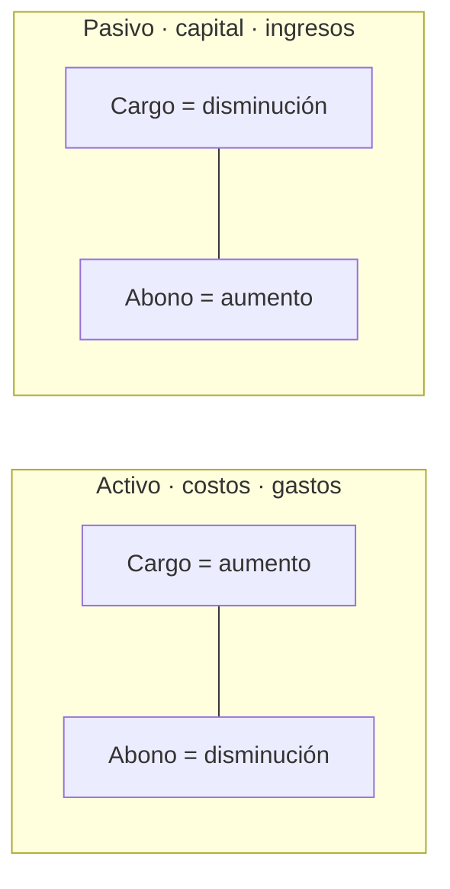
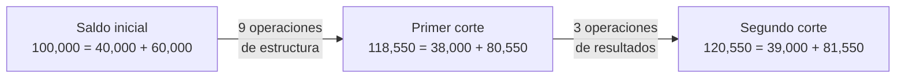

# 6. La partida doble y los asientos de diario

> **Reescritura didáctica** del capítulo sobre la **partida doble**, la obtención y aplicación de recursos, los **asientos de diario** y el primer informe financiero (enfoque México). Redacción original; todas las cifras del ejemplo se recalcularon y las erratas del texto fuente se señalan en recuadros. No es asesoría contable.

## Introducción

Toda operación tiene **dos caras**: si entra dinero al banco por un préstamo, a la vez **aumenta una deuda**; si se paga un dividendo, **sale efectivo** y **baja el capital**. Registrar siempre **ambos lados** —con cargos iguales a los abonos— es la **partida doble**, y es lo que mantiene en equilibrio la ecuación:

**Activo = Pasivo + Capital**

En esta lección verás:

- Las **nueve combinaciones** de la partida doble y sus reglas de cargo y abono
- La partida doble como **obtención y aplicación de recursos**
- Qué es un **asiento de diario**
- Un ejemplo completo: **12 operaciones**, primero en la ecuación, luego en **cuentas T**, y un **primer informe financiero**
- La diferencia entre operaciones que solo **cambian la estructura** y las que **producen resultados**

Al final hay ejercicios para **registrar asientos** (completar cuentas), **seguir la ecuación** con números y **preguntas de respuesta escrita**.

---

## 6.1 Las reglas de la partida doble

La partida doble se rige por el postulado de **dualidad económica** (lección 5): los **recursos** de la entidad y las **fuentes** de esos recursos.

### Nueve combinaciones

Mirando el lado **izquierdo** de cada movimiento (lo que aumenta el activo o disminuye pasivo o capital), hay nueve combinaciones posibles:

| Movimiento | Le corresponde… | Ejemplo |
|---|---|---|
| **1. Aumento de activo** | a) **Disminución** del activo mismo | Se compra mobiliario de contado |
| | b) **Aumento** de pasivo | Se recibe un préstamo bancario |
| | c) **Aumento** de capital | Los socios aportan efectivo |
| **2. Disminución de pasivo** | a) **Aumento** del pasivo mismo | Se documenta (con pagaré) una deuda con un proveedor |
| | b) **Aumento** de capital | Un préstamo de accionistas se capitaliza |
| | c) **Disminución** de activo | Se paga un préstamo |
| **3. Disminución de capital** | a) **Aumento** del capital mismo | Una reserva se capitaliza |
| | b) **Aumento** de pasivo | Se decreta un dividendo por pagar |
| | c) **Disminución** de activo | Se paga un dividendo en efectivo |

Puede haber **combinaciones**: por ejemplo, un aumento de activo de 100 compensado con un aumento de pasivo de 60 y de capital de 40. Lo único obligatorio es que **cargos = abonos**.

### Las mismas reglas en cargos y abonos

| Si se **carga**… | …la contrapartida es un **abono** a |
|---|---|
| Activo | Activo mismo · pasivo · capital |
| Pasivo | Pasivo mismo · capital · activo |
| Capital | Capital mismo · pasivo · activo |

### Cuándo se carga y cuándo se abona

| Una cuenta se **carga** cuando… | Una cuenta se **abona** cuando… |
|---|---|
| **Aumentan** los activos | **Disminuyen** los activos |
| **Disminuyen** los pasivos | **Aumentan** los pasivos |
| **Disminuye** el capital | **Aumenta** el capital |
| **Disminuyen** los ingresos | **Aumentan** los ingresos |
| **Aumentan** los costos y gastos | **Disminuyen** los costos y gastos |

Los sistemas electrónicos parecen “hacer solos” la igualdad de cargos y abonos, pero el **aspecto dual** de cada operación no desaparece.

### Obtención y aplicación de recursos

Otra forma de ver la partida doble: **de dónde vienen** los recursos y **en qué se usan**.

| Fuentes (obtención) | Usos (aplicación) |
|---|---|
| Aumento de **pasivo** (préstamos, crédito de proveedores) | Aumento de **activo** (comprar equipo, inventario) |
| Aumento de **capital** (aportaciones, utilidades) | Disminución de **pasivo** (pagar deudas) |
| Disminución de **activo** (vender un activo, cobrar) | Disminución de **capital** (dividendos, reembolsos) |

**Ejemplo**: una aportación de socios de 20,000 es una **fuente** (aumenta el capital); su **uso** puede ser aumentar el efectivo, pagar una deuda o pagar un dividendo.

<GuidedChoiceExplanation preset="contab-partida-doble" />

---

### Punto de control 1: reglas de la partida doble

<MultipleChoice
  id="contab-6-mid1"
  title="Punto de control — reglas de la partida doble"
  questions={[
    {
      prompt: 'Se recibe un préstamo bancario. ¿Qué combinación es?',
      choices: ['Aumento de activo con aumento de pasivo', 'Aumento de activo con aumento de capital', 'Disminución de pasivo con disminución de activo', 'Disminución de capital con aumento de pasivo'],
      answer: 0,
      why: 'Entra efectivo (activo) y nace una deuda (pasivo).',
    },
    {
      prompt: 'Se decreta un dividendo que se pagará el mes próximo. ¿Qué combinación es?',
      choices: ['Disminución de capital con disminución de activo', 'Disminución de capital con aumento de pasivo', 'Aumento de activo con aumento de capital', 'Disminución de pasivo con aumento de capital'],
      answer: 1,
      why: 'Baja el capital y nace “dividendos por pagar”.',
    },
    {
      prompt: '¿Cuándo se carga una cuenta de ingresos?',
      choices: ['Cuando aumentan', 'Cuando disminuyen', 'Nunca', 'Al cobrar'],
      answer: 1,
      why: 'Los ingresos son acreedores: aumentan con abonos.',
    },
    {
      prompt: 'A un cargo a una cuenta de capital le puede corresponder un abono a…',
      choices: ['Solo al activo', 'Al capital mismo, al pasivo o al activo', 'Solo a ingresos', 'Ninguna cuenta'],
      answer: 1,
      why: 'Las tres contrapartidas posibles.',
    },
    {
      prompt: 'Un préstamo de accionistas de 10,000 se capitaliza. Efecto en la ecuación:',
      choices: ['Activo +10,000; capital +10,000', 'Pasivo −10,000; capital +10,000', 'Pasivo +10,000; activo +10,000', 'Ninguno'],
      answer: 1,
      why: 'Disminución de pasivo con aumento de capital; el activo no cambia.',
    },
    {
      type: 'order',
      prompt: 'Ordena el razonamiento para registrar una operación.',
      items: ['Identificar las cuentas afectadas', 'Decidir si cada una aumenta o disminuye', 'Aplicar la naturaleza: cargo o abono', 'Verificar que cargos = abonos'],
      why: 'Así nunca se rompe la ecuación.',
    },
  ]}
/>

---

## 6.2 Los asientos de diario

Un **asiento de diario** es el registro de una operación en un libro (el **diario**) o documento, indicando **qué cuentas se cargan y cuáles se abonan**. Siempre debe estar **equilibrado**: **cargos = abonos**.

**Formato**:

| Fecha | Cuenta | Debe | Haber |
|---|---|---|---|
| 2 ene | Mobiliario y equipo | 5,000 | |
| |   Caja | | 5,000 |
| | *Compra de escritorios de contado* | | |

Por costumbre, la cuenta que se **abona** se escribe **con sangría**, y debajo va una breve **explicación** del asiento.

<GuidedChoiceExplanation preset="contab-asiento" />

---

## 6.3 Ejemplo completo: 12 operaciones

### Situación inicial (31 de diciembre)

**Activo 100,000 = Pasivo 40,000 + Capital 60,000**

| Activo | | Pasivo y capital | |
|---|---|---|---|
| Caja | 10,000 | Préstamo bancario | 10,000 |
| Bancos | 40,000 | Proveedores | 20,000 |
| Almacén | 50,000 | Préstamo de accionistas | 10,000 |
| | | Capital social | 30,000 |
| | | Reserva de reinversión de utilidades | 9,000 |
| | | Utilidades acumuladas | 21,000 |
| **Total** | **100,000** | **Total** | **100,000** |

### Primer bloque: operaciones que solo cambian la estructura financiera

| Op. | Operación | Combinación | Asiento (cargo / abono) | Activo | Pasivo | Capital |
|---|---|---|---|---|---|---|
| | **Saldos iniciales** | | | **100,000** | **40,000** | **60,000** |
| 1a | Se compra mobiliario por 5,000 de contado | +A / −A | Mobiliario y equipo / Caja | 100,000 | 40,000 | 60,000 |
| 1b | Préstamo bancario de 7,000 | +A / +P | Bancos / Préstamo bancario | 107,000 | 47,000 | 60,000 |
| 1c | Aportación de accionistas de 20,000 | +A / +C | Bancos / Capital social | 127,000 | 47,000 | 80,000 |
| 2a | Se documenta a un proveedor una deuda de 18,000 | −P / +P | Proveedores / Documentos por pagar | 127,000 | 47,000 | 80,000 |
| 2b | Se capitaliza el préstamo de accionistas de 10,000 | −P / +C | Préstamo de accionistas / Capital social | 127,000 | 37,000 | 90,000 |
| 2c | Se pagan 5,000 al banco | −P / −A | Préstamo bancario / Bancos | 122,000 | 32,000 | 90,000 |
| 3a | Se capitaliza la reserva de 9,000 | −C / +C | Reserva de reinversión / Capital social | 122,000 | 32,000 | 90,000 |
| 3b | Se decreta un dividendo de 6,000 por pagar | −C / +P | Utilidades acumuladas / Dividendos por pagar | 122,000 | 38,000 | 84,000 |
| 3c | Se decreta y paga un dividendo de 3,450 | −C / −A | Utilidades acumuladas / Bancos | 118,550 | 38,000 | 80,550 |

**Primer corte**: 118,550 = 38,000 + 80,550. El activo creció **18,550**, compensado con un aumento de capital de **20,550** y una disminución de pasivo de **2,000**. **No hubo utilidad ni pérdida**: solo cambió la **estructura financiera** (la relación entre activo, pasivo y capital).

### Segundo bloque: operaciones que producen resultados

| Op. | Operación | Asiento (cargo / abono) | Activo | Pasivo | Capital |
|---|---|---|---|---|---|
| | **Primer corte** | | **118,550** | **38,000** | **80,550** |
| A | Venta de contado por 5,000 | Caja / Ventas | 123,550 | 38,000 | 85,550 |
| B | Costo de lo vendido: 3,000 | Costo de ventas / Almacén | 120,550 | 38,000 | 82,550 |
| C | Comisión de venta de 1,000, sin pagar | Gastos de venta / Comisiones por pagar | 120,550 | 39,000 | 81,550 |

**Segundo corte**: 120,550 = 39,000 + 81,550.

### Resumen de los dos tipos de operaciones

| | Activo | Pasivo | Capital |
|---|---|---|---|
| Situación inicial | 100,000 | 40,000 | 60,000 |
| Operaciones que **cambian la estructura** | +18,550 | −2,000 | +20,550 |
| Operaciones que **producen resultados** | +2,000 | +1,000 | +1,000 |
| **Situación final** | **120,550** | **39,000** | **81,550** |

El capital subió **21,550**, pero **no todo es utilidad**: 20,550 vienen de aportaciones y movimientos de estructura, y solo **1,000** de resultados. Por eso, mirar el cambio del capital **no basta** para saber cuánto se ganó: hace falta el **estado de resultados**.

| Estado de resultados | $ |
|---|---|
| Ventas de contado | 5,000 |
| (−) Costo de la venta | 3,000 |
| **= Utilidad bruta** | **2,000** |
| (−) Gastos de venta | 1,000 |
| **= Utilidad** | **1,000** |

---

## 6.4 De una sola cuenta a varias cuentas

Si todo se registrara en tres cuentas (“Activo”, “Pasivo”, “Capital”), la ecuación cuadraría, pero **no sabríamos qué tenemos ni a quién debemos**. Por eso cada concepto lleva **su propia cuenta**.

**Registro en una sola cuenta — Activo**: cargos 100,000 + 5,000 + 7,000 + 20,000 = 132,000; abonos 5,000 + 5,000 + 3,450 = 13,450 → **saldo 118,550**; luego +5,000 − 3,000 = **120,550**.

**Registro en varias cuentas** (S1 = saldo inicial, S2 = primer corte, S3 = segundo corte):

| Cuenta | S1 | Cargos | Abonos | S2 | Cargos | Abonos | S3 |
|---|---|---|---|---|---|---|---|
| Caja | 10,000 | | 5,000 (1a) | 5,000 | 5,000 (A) | | 10,000 |
| Bancos | 40,000 | 7,000 (1b), 20,000 (1c) | 5,000 (2c), 3,450 (3c) | 58,550 | | | 58,550 |
| Almacén | 50,000 | | | 50,000 | | 3,000 (B) | 47,000 |
| Mobiliario y equipo | — | 5,000 (1a) | | 5,000 | | | 5,000 |
| Préstamo bancario | 10,000 | 5,000 (2c) | 7,000 (1b) | 12,000 | | | 12,000 |
| Documentos por pagar | — | | 18,000 (2a) | 18,000 | | | 18,000 |
| Proveedores | 20,000 | 18,000 (2a) | | 2,000 | | | 2,000 |
| Préstamo de accionistas | 10,000 | 10,000 (2b) | | 0 | | | 0 |
| Dividendos por pagar | — | | 6,000 (3b) | 6,000 | | | 6,000 |
| Comisiones por pagar | — | | | — | | 1,000 (C) | 1,000 |
| Capital social | 30,000 | | 20,000 (1c), 10,000 (2b), 9,000 (3a) | 69,000 | | | 69,000 |
| Reserva de reinversión | 9,000 | 9,000 (3a) | | 0 | | | 0 |
| Utilidades acumuladas | 21,000 | 6,000 (3b), 3,450 (3c) | | 11,550 | | | 11,550 |
| Ventas | — | | | — | | 5,000 (A) | 5,000 |
| Costo de ventas | — | | | — | 3,000 (B) | | 3,000 |
| Gastos de venta | — | | | — | 1,000 (C) | | 1,000 |

(En las cuentas de pasivo y capital, los saldos son **acreedores**; en ventas, acreedor; en costo y gastos, deudores.)

:::caution Erratas del texto fuente
En los esquemas de mayor del libro, varias cuentas llevan **códigos repetidos o cambiados** (p. ej., tres cuentas distintas aparecen como “1100”, Dividendos por pagar como “1107” —que en la lección 4 era el IVA— y las comisiones por pagar bajo el rótulo “Préstamo a accionista”). Aquí se muestran **por nombre**, con los mismos importes, que sí cuadran.
:::

### Un primer informe financiero

| | Saldo inicial (S1) | Primer corte (S2) | Segundo corte (S3) |
|---|---|---|---|
| **Activo** | | | |
| Caja | 10,000 | 5,000 | 10,000 |
| Bancos | 40,000 | 58,550 | 58,550 |
| Almacén | 50,000 | 50,000 | 47,000 |
| Mobiliario y equipo | — | 5,000 | 5,000 |
| **Total activo** | **100,000** | **118,550** | **120,550** |
| **Pasivo** | | | |
| Préstamo bancario | 10,000 | 12,000 | 12,000 |
| Documentos por pagar a proveedores | — | 18,000 | 18,000 |
| Proveedores | 20,000 | 2,000 | 2,000 |
| Préstamo de accionistas | 10,000 | — | — |
| Dividendos por pagar | — | 6,000 | 6,000 |
| Comisiones por pagar | — | — | 1,000 |
| **Total pasivo** | **40,000** | **38,000** | **39,000** |
| **Capital** | | | |
| Capital social | 30,000 | 69,000 | 69,000 |
| Reserva de reinversión de utilidades | 9,000 | — | — |
| Utilidades acumuladas de años anteriores | 21,000 | 11,550 | 11,550 |
| Resultado del periodo (utilidad) | — | — | 1,000 |
| **Total capital** | **60,000** | **80,550** | **81,550** |
| **Pasivo + capital** | **100,000** | **118,550** | **120,550** |

La igualdad se conserva en los **tres cortes**. Las cuentas de resultados forman un **grupo separado** cuyo total (la utilidad de 1,000) se muestra **dentro del capital**.

---

### Punto de control 2: el ejemplo completo

<MultipleChoice
  id="contab-6-mid2"
  title="Punto de control — ecuación, cuentas T e informe"
  questions={[
    {
      prompt: 'Tras las 9 primeras operaciones, ¿cuánto cambió el pasivo?',
      choices: ['+2,000', '−2,000', '+18,000', 'No cambió'],
      answer: 1,
      why: '40,000 → 38,000.',
    },
    {
      prompt: 'Si el capital subió 21,550 en total, ¿cuánto fue utilidad?',
      choices: ['21,550', '20,550', '1,000', '2,000'],
      answer: 2,
      why: 'El resto vino de operaciones de estructura (aportaciones, capitalizaciones).',
    },
    {
      prompt: '¿Qué asiento registra la operación 3c (dividendo pagado de 3,450)?',
      choices: [
        'Cargo a Bancos, abono a Utilidades acumuladas',
        'Cargo a Utilidades acumuladas, abono a Bancos',
        'Cargo a Dividendos por pagar, abono a Capital',
        'Cargo a Gastos, abono a Bancos',
      ],
      answer: 1,
      why: 'Disminuye el capital (cargo) y el activo (abono).',
    },
    {
      prompt: 'Saldo de Bancos en el primer corte:',
      choices: ['40,000', '67,000', '58,550', '63,550'],
      answer: 2,
      why: '40,000 + 7,000 + 20,000 − 5,000 − 3,450.',
    },
    {
      prompt: '¿Por qué conviene registrar en varias cuentas y no solo en “Activo”, “Pasivo” y “Capital”?',
      choices: [
        'Porque la ecuación no cuadraría',
        'Para conocer el detalle de cada concepto y los resultados',
        'Por obligación del SAT únicamente',
        'No conviene',
      ],
      answer: 1,
      why: 'La ecuación cuadra igual, pero sin detalle no hay información útil.',
    },
  ]}
/>

---

## Hoja de práctica: la ecuación contable paso a paso

Completa el activo, pasivo y capital **después de cada operación**, como en Excel. Puedes escribir números o fórmulas que usen la fila anterior (por ejemplo `=C1+7000` o `=C2`). La columna **Comprobación** calcula sola A − (P + C): debe quedar en **0** en cada fila.

<SheetExercise
  id="contab-6-ecuacion-hoja"
  lang="es"
  title="Activo = Pasivo + Capital"
  columns={[
    {key: 'op', label: 'Op.', type: 'text', width: 48},
    {key: 'desc', label: 'Operación', type: 'text', width: 260},
    {key: 'a', label: 'Activo', decimals: 0},
    {key: 'p', label: 'Pasivo', decimals: 0},
    {key: 'c', label: 'Capital', decimals: 0},
    {key: 'chk', label: 'Comprobación A − (P + C)', decimals: 0},
  ]}
  rows={[
    {op: '—', desc: 'Saldos al 31 de diciembre', a: 100000, p: 40000, c: 60000, chk: {f: '=C1-(D1+E1)'}},
    {op: '1a', desc: 'Compra de mobiliario por 5,000 de contado', a: {a: 100000}, p: {a: 40000}, c: {a: 60000}, chk: {f: '=C2-(D2+E2)'}},
    {op: '1b', desc: 'Préstamo bancario de 7,000', a: {a: 107000}, p: {a: 47000}, c: {a: 60000}, chk: {f: '=C3-(D3+E3)'}},
    {op: '1c', desc: 'Aportación de accionistas de 20,000', a: {a: 127000}, p: {a: 47000}, c: {a: 80000}, chk: {f: '=C4-(D4+E4)'}},
    {op: '2a', desc: 'Se documenta a un proveedor una deuda de 18,000', a: {a: 127000}, p: {a: 47000}, c: {a: 80000}, chk: {f: '=C5-(D5+E5)'}},
    {op: '2b', desc: 'Se capitaliza el préstamo de accionistas de 10,000', a: {a: 127000}, p: {a: 37000}, c: {a: 90000}, chk: {f: '=C6-(D6+E6)'}},
    {op: '2c', desc: 'Se pagan 5,000 al banco', a: {a: 122000}, p: {a: 32000}, c: {a: 90000}, chk: {f: '=C7-(D7+E7)'}},
    {op: '3a', desc: 'Se capitaliza la reserva de 9,000', a: {a: 122000}, p: {a: 32000}, c: {a: 90000}, chk: {f: '=C8-(D8+E8)'}},
    {op: '3b', desc: 'Dividendo de 6,000 por pagar', a: {a: 122000}, p: {a: 38000}, c: {a: 84000}, chk: {f: '=C9-(D9+E9)'}},
    {op: '3c', desc: 'Dividendo de 3,450 pagado con cheque', a: {a: 118550}, p: {a: 38000}, c: {a: 80550}, chk: {f: '=C10-(D10+E10)'}},
    {op: 'A', desc: 'Venta de contado por 5,000', a: {a: 123550}, p: {a: 38000}, c: {a: 85550}, chk: {f: '=C11-(D11+E11)'}},
    {op: 'B', desc: 'Costo de lo vendido: 3,000', a: {a: 120550}, p: {a: 38000}, c: {a: 82550}, chk: {f: '=C12-(D12+E12)'}},
    {op: 'C', desc: 'Comisión de venta de 1,000 sin pagar', a: {a: 120550}, p: {a: 39000}, c: {a: 81550}, chk: {f: '=C13-(D13+E13)'}, _style: 'total'},
  ]}
/>

---

## Practica: sigue la ecuación

Parte de **Activo 100,000 = Pasivo 40,000 + Capital 60,000** y aplica las operaciones en orden. Escribe el número sin comas.

<ProblemSet id="contab-6-ecuacion" lang="es">
  <Problem title="E1" decimals={0} prompt={`Después de 1a (mobiliario 5,000 de contado) y 1b (préstamo bancario 7,000), ¿cuánto es el activo?`} answer={107000} why={`1a no cambia el total; 1b lo aumenta 7,000.`} />
  <Problem title="E2" decimals={0} prompt={`Después de 1c (aportación de 20,000), ¿cuánto es el capital?`} answer={80000} why={`60,000 + 20,000.`} />
  <Problem title="E3" decimals={0} prompt={`Después de 2a, 2b y 2c, ¿cuánto es el pasivo? (Venía de 47,000.)`} answer={32000} why={`2a no cambia el total; 2b −10,000; 2c −5,000.`} />
  <Problem title="E4" decimals={0} prompt={`Después de 3a, 3b y 3c, ¿cuánto es el capital? (Venía de 90,000.)`} answer={80550} why={`3a no cambia el total; 3b −6,000; 3c −3,450.`} />
  <Problem title="E5" decimals={0} prompt={`Primer corte: activo 118,550 y capital 80,550. ¿Pasivo?`} answer={38000} why={`118,550 − 80,550.`} />
  <Problem title="E6" decimals={0} prompt={`Después de la venta (5,000), el costo (3,000) y la comisión por pagar (1,000), ¿cuánto es el activo?`} answer={120550} why={`118,550 + 5,000 − 3,000.`} />
  <Problem title="E7" decimals={0} prompt={`Utilidad de las operaciones A, B y C:`} answer={1000} why={`5,000 − 3,000 − 1,000.`} />
  <Problem title="E8" decimals={0} prompt={`Saldo de Utilidades acumuladas después de los dividendos (inicial 21,000):`} answer={11550} why={`21,000 − 6,000 − 3,450.`} />
</ProblemSet>

---

## Practica: registra los asientos

Escribe el nombre de la cuenta que se **carga** y la que se **abona** en cada operación del ejemplo. Se aceptan nombres equivalentes (p. ej., “Bancos” o “Banco”).

<ProblemSet id="contab-6-asientos" lang="es">
  <Problem type="cloze" title="1a" prompt={`Se compra mobiliario por 5,000 de contado. Cargo a [[Mobiliario y equipo|mobiliario|mobiliario y equipo de oficina]]; abono a [[Caja|efectivo]].`} />
  <Problem type="cloze" title="1b" prompt={`Se obtiene un préstamo bancario de 7,000 depositado en la cuenta de cheques. Cargo a [[Bancos|banco]]; abono a [[Préstamos bancarios|prestamo bancario|préstamo bancario|prestamos bancarios]].`} />
  <Problem type="cloze" title="1c" prompt={`Los accionistas aportan 20,000 depositados en el banco. Cargo a [[Bancos|banco]]; abono a [[Capital social|capital]].`} />
  <Problem type="cloze" title="2a" prompt={`Se firma un pagaré a un proveedor por 18,000 de su factura pendiente. Cargo a [[Proveedores|proveedor]]; abono a [[Documentos por pagar|documento por pagar]].`} />
  <Problem type="cloze" title="2b" prompt={`El préstamo de accionistas de 10,000 se capitaliza. Cargo a [[Préstamos de accionistas|prestamo de accionistas|préstamo de accionistas|prestamos de accionistas|prestamo accionistas]]; abono a [[Capital social|capital]].`} />
  <Problem type="cloze" title="2c" prompt={`Se pagan 5,000 al banco por un documento vencido. Cargo a [[Préstamos bancarios|prestamo bancario|préstamo bancario|prestamos bancarios]]; abono a [[Bancos|banco]].`} />
  <Problem type="cloze" title="3a" prompt={`La reserva de reinversión de utilidades de 9,000 se capitaliza. Cargo a [[Reserva de reinversión de utilidades|reserva de reinversion|reserva]]; abono a [[Capital social|capital]].`} />
  <Problem type="cloze" title="3b" prompt={`Se decreta un dividendo de 6,000 a pagar el mes próximo. Cargo a [[Utilidades acumuladas|utilidades acumuladas de años anteriores|utilidades retenidas]]; abono a [[Dividendos por pagar|dividendo por pagar]].`} />
  <Problem type="cloze" title="3c" prompt={`Se decreta y paga con cheque un dividendo de 3,450. Cargo a [[Utilidades acumuladas|utilidades acumuladas de años anteriores|utilidades retenidas]]; abono a [[Bancos|banco]].`} />
  <Problem type="cloze" title="A" prompt={`Venta de contado por 5,000 (cobrada en efectivo). Cargo a [[Caja|efectivo]]; abono a [[Ventas|venta]].`} />
  <Problem type="cloze" title="B" prompt={`El costo de lo vendido fue de 3,000. Cargo a [[Costo de ventas|costo de lo vendido|costo de venta]]; abono a [[Almacén|inventario|inventarios]].`} />
  <Problem type="cloze" title="C" prompt={`Comisión de venta de 1,000 que no se ha pagado. Cargo a [[Gastos de venta|gasto de venta|gastos de ventas]]; abono a [[Comisiones por pagar|acreedores diversos|comision por pagar]].`} />
</ProblemSet>

---

### Evaluación: partida doble y asientos de diario

<MultipleChoice
  id="contab-6"
  title="La partida doble y los asientos de diario"
  questions={[
    {
      prompt: '¿Qué postulado básico rige la partida doble?',
      choices: ['Negocio en marcha', 'Dualidad económica', 'Consistencia', 'Valuación'],
      answer: 1,
      why: 'Recursos y fuentes de los recursos.',
    },
    {
      prompt: 'En una cuenta de gastos, un cargo…',
      choices: ['Disminuye el saldo', 'Aumenta el saldo', 'No la afecta', 'La salda'],
      answer: 1,
      why: 'Activo, costos y gastos aumentan con cargos.',
    },
    {
      prompt: 'Requisito indispensable de un asiento de diario:',
      choices: ['Afectar tres cuentas', 'Cargos = abonos', 'Afectar resultados', 'Llevar IVA'],
      answer: 1,
      why: 'Si no, se rompe la ecuación contable.',
    },
    {
      prompt: '¿Cuál operación produce resultados?',
      choices: ['Capitalizar una reserva', 'Pagar un préstamo', 'Vender mercancía con utilidad', 'Recibir una aportación'],
      answer: 2,
      why: 'Las demás solo cambian la estructura financiera.',
    },
    {
      prompt: 'Desde el punto de vista de obtención y aplicación de recursos, un aumento de pasivo es…',
      choices: ['Una aplicación', 'Una fuente (obtención)', 'Un resultado', 'Un gasto'],
      answer: 1,
      why: 'Terceros aportan recursos a la entidad.',
    },
    {
      type: 'order',
      prompt: 'Ordena los tres momentos del ejemplo por total de activo (de menor a mayor).',
      items: ['Saldo inicial (100,000)', 'Primer corte (118,550)', 'Segundo corte (120,550)'],
      why: 'La igualdad se conserva en los tres.',
    },
  ]}
/>

---

## Preguntas y problemas: respuesta escrita

Escribe tu respuesta, pulsa **Ver solución oficial** y compárala; luego **Marcar como revisada**.

<ProblemSet id="contab-6-preguntas" lang="es">
  <Problem type="concept" title="1" prompt={`¿Qué efecto tienen las operaciones sobre la ecuación contable?`} answer={`Tienen un doble efecto.`} />
  <Problem type="concept" title="2" keywords={['dualidad']} prompt={`¿Qué postulado básico rige la teoría de la partida doble?`} answer={`El postulado de dualidad económica.`} />
  <Problem type="concept" title="3" prompt={`¿Qué produce en la ecuación contable un aumento en el activo?`} answer={`Un aumento de pasivo, un aumento de capital o una disminución del activo mismo.`} />
  <Problem type="concept" title="4" prompt={`¿Qué produce una disminución de pasivo en la ecuación contable?`} answer={`Una disminución de activo, un aumento de capital o un aumento del pasivo mismo.`} />
  <Problem type="concept" title="5" prompt={`¿Qué produce una disminución del capital en la ecuación contable?`} answer={`Una disminución del activo, un aumento del pasivo o un aumento del capital mismo.`} />
  <Problem type="concept" title="6" keywords={['igualdad']} prompt={`¿Una operación puede afectar a los tres elementos de la ecuación contable? ¿Qué se requiere?`} answer={`Sí, siempre que se mantenga la igualdad: el valor de los cargos debe ser igual al de los abonos.`} />
  <Problem type="concept" title="7" prompt={`¿Cuál puede ser la contrapartida de un cargo a una cuenta de activo?`} answer={`Un abono al pasivo, al capital o al activo mismo.`} />
  <Problem type="concept" title="8" prompt={`¿Cuál puede ser la contrapartida de un cargo a una cuenta de pasivo?`} answer={`Un abono al capital, al activo o al pasivo mismo.`} />
  <Problem type="concept" title="9" prompt={`¿Cuál puede ser la contrapartida de un cargo a una cuenta de capital?`} answer={`Un abono al pasivo, al activo o al capital mismo.`} />
  <Problem type="concept" title="10" minWords={8} prompt={`¿Cuándo se carga una cuenta?`} answer={`Cuando aumentan los activos, los costos y los gastos, o disminuyen los pasivos, el capital y los ingresos.`} />
  <Problem type="concept" title="11" minWords={8} prompt={`¿Cuándo se abona una cuenta?`} answer={`Cuando disminuyen los activos, los costos y los gastos, o aumentan los pasivos, el capital y los ingresos.`} />
  <Problem type="concept" title="12" keywords={['estructura']} prompt={`¿Qué producen las operaciones que realiza un ente económico?`} answer={`Cambios en la estructura financiera y, en su caso, en los resultados de la entidad.`} />
  <Problem type="concept" title="13" prompt={`Los resultados de la entidad, ¿qué aumentan o disminuyen?`} answer={`El capital: la utilidad lo aumenta y la pérdida lo disminuye.`} />
  <Problem type="concept" title="14" prompt={`¿Cómo se conocen los resultados de las operaciones?`} answer={`Registrando las operaciones en varias cuentas, una para cada concepto (ingresos, costos y gastos), y preparando el estado de resultados; el cambio en el capital no es suficiente.`} />
  <Problem type="concept" title="15" keywords={['recursos']} prompt={`La doble dimensión de la partida doble puede verse con claridad, ¿desde qué punto de vista?`} answer={`Desde el punto de vista de la obtención y aplicación de recursos: lo que se recibe y el uso que se hace de ello.`} />
  <Problem type="concept" title="16" prompt={`¿Qué son los asientos de diario?`} answer={`Los registros de las operaciones en un libro o documento, que detallan sus efectos (cargos y abonos) en el ente económico, siempre en equilibrio.`} />
  <Problem type="concept" title="17" minWords={8} prompt={`Los cargos en las cuentas, ¿qué producen en sus saldos?`} answer={`En las cuentas de activo, costos y gastos, un aumento; en las de pasivo, capital e ingresos, una disminución.`} />
  <Problem type="concept" title="18" minWords={8} prompt={`Los abonos en las cuentas, ¿qué producen en sus saldos?`} answer={`En las cuentas de activo, costos y gastos, una disminución; en las de pasivo, capital e ingresos, un aumento.`} />
  <Problem type="concept" title="19" keywords={['aportaciones']} prompt={`¿Qué conceptos integran el capital del ente económico?`} answer={`Las aportaciones de los socios o accionistas y los resultados obtenidos de las operaciones.`} />
  <Problem type="concept" title="20" prompt={`¿Cómo deben considerarse las cuentas de resultados?`} answer={`Como un grupo separado de cuentas cuyo resultado (utilidad o pérdida) forma parte del capital del ente económico.`} />
</ProblemSet>

---

## Resumen

:::tip Recuerda
- Toda operación tiene **doble efecto**; la partida doble se rige por la **dualidad económica**
- **Nueve combinaciones**: aumento de activo, disminución de pasivo o disminución de capital, cada uno con tres contrapartidas
- Se **carga** cuando aumentan activos, costos y gastos o disminuyen pasivos, capital e ingresos; se **abona** en los casos contrarios
- **Obtención** de recursos (más pasivo o capital, menos activo) → **aplicación** (más activo, menos pasivo o capital)
- **Asiento de diario**: cargos = abonos, con explicación
- Algunas operaciones solo **cambian la estructura**; otras **producen resultados**: el cambio del capital no basta para conocer la utilidad
- Registrar en **varias cuentas** da el detalle para el balance y el estado de resultados
:::

## Lecturas adicionales

- Siguiente: [7. Sistemas de compraventa de mercancías](./sistemas-de-compraventa-de-mercancias)
- [5. Las normas de información financiera](./las-normas-de-informacion-financiera) — dualidad económica
- [3. La cuenta](./la-cuenta) — debe, haber y naturaleza
- [4. Las cuentas de una entidad comercial](./las-cuentas-de-una-entidad-comercial)
- Base: texto de *Contabilidad básica* (Grupo Editorial Patria), usado como guía de estudio
