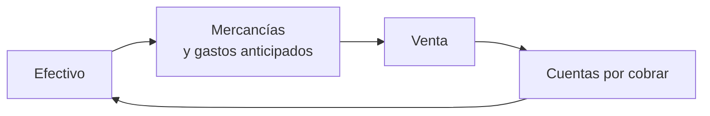
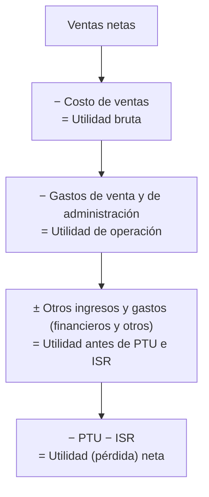

# 4. Las cuentas de una entidad comercial

> **Reescritura didáctica** del capítulo que recorre las cuentas más usuales de una empresa comercial: cuándo se cargan y abonan, qué significa su saldo y dónde se presentan en los estados financieros (enfoque México). Redacción original con ejemplos nuevos; las erratas del texto fuente y las actualizaciones normativas se señalan en recuadros. No es asesoría contable ni fiscal.

## Introducción

En la lección 3 vimos las reglas generales: el activo y los gastos son **deudores**, el pasivo, el capital y los ingresos son **acreedores**. Ahora aplicaremos esas reglas **cuenta por cuenta**. Para cada una responderemos tres preguntas:

1. **Movimiento** — ¿cuándo se **carga** y cuándo se **abona**?
2. **Saldo** — ¿es **deudor** o **acreedor**, y qué **representa**?
3. **Presentación** — ¿en qué **grupo** del estado de situación financiera o de resultados aparece?

(No se incluyen aquí los asientos de **cierre y apertura** del ejercicio; se estudian más adelante.)

Al final hay **110 operaciones** para clasificar: para cada una escribe el **movimiento**, la **cuenta**, la **naturaleza del saldo** y el **grupo**, y compárala con la solución oficial.

:::caution Numeración de cuentas en este capítulo
El texto fuente cambia la numeración de algunas cuentas respecto al catálogo de la lección 3. En esta lección usamos **la numeración del capítulo y de su ejercicio**: 1101 Documentos por pagar, **1102 Proveedores**, **1103 Acreedores diversos**, 1107 IVA, 1108 ISR por pagar, 1109 Dividendos por pagar, 1110 Préstamos de accionistas. Además, el libro usa tanto **7201** como **7102** para *Otros gastos y productos*, y tanto **8102** como **9102** para *Impuesto sobre la renta*; en el ejercicio se aceptan ambas.
:::

---

## 4.1 Cuentas de activo

Representan **bienes y derechos** del negocio: **inician con un cargo** y su saldo es **deudor**.

### Activo circulante: efectivo y cuentas por cobrar

| Cuenta | Se **carga** por | Se **abona** por | Saldo representa | Presentación |
|---|---|---|---|---|
| **0101 Caja** | Efectivo al iniciar operaciones; efectivo recibido | Efectivo desembolsado | Efectivo disponible | Primera del activo circulante |
| **0102 Bancos** | Depósito de apertura; depósitos; cobranzas hechas por el banco; intereses que paga el banco | Cheques expedidos; comisiones bancarias; transferencias y pagos por otros medios | Dinero en la cuenta de cheques | Después de caja; a menudo juntos como “**efectivo en caja y bancos**” |
| **0110 Documentos por cobrar** | Documentos aceptados por clientes o terceros | Documentos cobrados o cancelados | Documentos pendientes de cobro | Después del efectivo |
| **0111 Clientes** | Facturas de venta a crédito; intereses moratorios; fletes y maniobras cargados al cliente | Cobros; documentos recibidos en pago; notas de crédito por devoluciones; descuentos y rebajas | Facturas pendientes de cobro | Después de documentos por cobrar |
| **0112 Deudores diversos** | Efectivo entregado a personas; entregas a terceros por cuenta del deudor | Cobros; documentos recibidos; entregas a terceros por cuenta de la empresa | Otras cuentas por cobrar | Activo circulante, con un **nombre descriptivo** |

:::tip Dos reglas de presentación
- **Sobregiro bancario**: si Bancos queda con **saldo acreedor** (se giró más de lo depositado), se presenta como **pasivo circulante**, no como activo negativo.
- **Deudores diversos** no se presenta con ese nombre, por ser indefinido: se usa “**funcionarios y empleados**”, “**otras cuentas por cobrar**” o el nombre del deudor si el saldo es importante.
:::

### Activo circulante: inventarios y pagos anticipados

| Cuenta | Se **carga** por | Se **abona** por | Saldo representa |
|---|---|---|---|
| **0120 Almacén** | Costo de mercancías compradas; costo de devoluciones de clientes | Costo de lo vendido; costo de devoluciones a proveedores; rebajas sobre compras | Inventario de mercancías |
| **0130 Seguros pagados por anticipado** | Primas pagadas por anticipado | Porción devengada (pasa a resultados); bonificaciones de la aseguradora | Primas **no devengadas** |
| **0131 Papelería y útiles** | Costo de lo comprado | Lo consumido; devoluciones; rebajas | Existencia de papelería |
| **0132 Intereses pagados por anticipado** | Intereses descontados al recibir un préstamo | Porción devengada; cancelación por pago anticipado del préstamo | Intereses **no devengados** |
| **0133 Rentas pagadas por anticipado** | Rentas pagadas por anticipado | Porción devengada | Rentas **no devengadas** |
| **0134 Propaganda y publicidad** | Publicidad comprada | Porción usada o devengada; devoluciones o descuentos | Publicidad **no devengada** |

Todas se presentan en el activo circulante **después del almacén**.

**¿Por qué los pagos anticipados son “circulantes” si no se convierten en dinero?** Porque se recuperan a través del **ciclo financiero a corto plazo**: el dinero se convierte en mercancía, se hacen gastos, se vende, se cobra… y el **precio de venta** incluye esos costos y gastos.

**Ejemplo — seguro anual**: el 1 de enero se pagan 12,000 de prima anual → cargo a 0130. Cada mes se devengan 1,000 (abono a 0130 y cargo a gastos). Al 31 de marzo el saldo es **9,000**: lo que aún no se ha devengado.

### Activo no circulante

| Cuenta | Se **carga** por | Se **abona** por | Saldo representa |
|---|---|---|---|
| **0201 Deudores hipotecarios** | Préstamos otorgados con garantía hipotecaria | Cobros según la escritura | Préstamos hipotecarios por cobrar |
| **0212 Depósitos en garantía** | Dinero entregado en garantía de un contrato | Depósitos recuperados o aplicados al terminar el contrato | Depósitos vigentes |
| **0221 Equipo de reparto** | Costo de vehículos de reparto | Bajas; ventas (a costo) | Costo del equipo en uso |
| **0222 Mobiliario y equipo** | Costo de escritorios, archivos, equipo de oficina | Bajas; ventas (a costo) | Costo del mobiliario en uso |
| **0223 Edificio** | Costo de adquisición o construcción **sin el terreno** | Venta (a costo); demolición | Costo del edificio |
| **0224 Terreno** | Costo del terreno | Venta (a costo) | Costo del terreno |
| **0241 Patentes y marcas** | Costo de patentes y marcas compradas o desarrolladas | Venta; caducidad; bajas por pérdida de vida útil | Costo de intangibles con vida útil |
| **0261 Gastos de instalación y organización** | Gastos de instalar, adaptar locales u organizar el negocio | Porción aplicada a cada ejercicio | Gastos pendientes de aplicar (**cargos diferidos**) |

Equipo, mobiliario, edificio y terreno suelen llamarse **activos fijos**: se adquieren con **propósito permanente** para cumplir los objetivos del negocio. Edificio y terreno van en **cuentas separadas** porque el edificio se deprecia y el terreno no.

:::info Actualización
- Bajo las NIF vigentes (NIF C-8 *Activos intangibles*), la mayoría de los **gastos de instalación y organización** (preoperativos) se reconocen como **gasto** del periodo en que se incurren, en lugar de diferirse.
- Lo que el texto llama “activos fijos” hoy se denomina **propiedades, planta y equipo** (NIF C-6).
:::

<GuidedChoiceExplanation preset="contab-presentacion" />

---

### Punto de control 1: cuentas de activo

<MultipleChoice
  id="contab-4-mid1"
  title="Punto de control — cuentas de activo"
  questions={[
    {
      prompt: 'El banco cobra una comisión por chequera. ¿Qué le pasa a la cuenta Bancos?',
      choices: ['Se carga', 'Se abona', 'No se afecta', 'Pasa a capital'],
      answer: 1,
      why: 'Disminuye el dinero en la cuenta de cheques.',
    },
    {
      prompt: 'La cuenta Bancos termina con saldo acreedor de 8,000. ¿Cómo se presenta?',
      choices: ['Activo circulante negativo', 'Pasivo circulante (sobregiro)', 'Capital', 'No se presenta'],
      answer: 1,
      why: 'Es una deuda a corto plazo con el banco.',
    },
    {
      prompt: 'Un cliente devuelve mercancía vendida a crédito. ¿Qué le pasa a Clientes?',
      choices: ['Se carga', 'Se abona (nota de crédito)', 'Se salda', 'Nada'],
      answer: 1,
      why: 'Disminuye lo que el cliente debe.',
    },
    {
      prompt: 'Se pagan 24,000 de renta por 12 meses. Pasaron 3 meses. ¿Saldo de Rentas pagadas por anticipado?',
      choices: ['24,000', '18,000', '6,000', '0'],
      answer: 1,
      why: 'Se devengaron 3 × 2,000 = 6,000.',
    },
    {
      prompt: '¿Por qué edificio y terreno se registran en cuentas separadas?',
      choices: ['Por capricho', 'Porque el edificio se deprecia y el terreno no', 'Porque el terreno es pasivo', 'Por el IVA'],
      answer: 1,
      why: 'El costo del edificio se registra sin el valor del terreno.',
    },
    {
      type: 'order',
      prompt: 'Ordena estas cuentas como se presentan en el activo.',
      items: ['Caja', 'Bancos', 'Documentos por cobrar', 'Clientes', 'Almacén', 'Seguros pagados por anticipado', 'Equipo de reparto'],
      why: 'Del más líquido al menos líquido; circulante antes que no circulante.',
    },
  ]}
/>

---

## 4.2 Cuentas de pasivo

Representan **deudas y obligaciones**: **inician con un abono** y su saldo es **acreedor**.

| Cuenta | Se **carga** por | Se **abona** por | Saldo representa | Presentación |
|---|---|---|---|---|
| **1100 Préstamos bancarios** | Pagos | Préstamos recibidos del banco | Préstamos por pagar | Pasivo circulante (igual que documentos por pagar) |
| **1101 Documentos por pagar** | Documentos pagados | Documentos aceptados a pagar después | Documentos pendientes de pago | **Inicio** del pasivo circulante |
| **1102 Proveedores** | Pagos; documentos aceptados en pago; notas de cargo por devoluciones; descuentos y rebajas recibidos | Facturas por compras de mercancía; notas de cargo por fletes y maniobras | Lo que se debe a proveedores | Después de documentos por pagar |
| **1103 Acreedores diversos** | Pagos; documentos aceptados; entregas a terceros por cuenta del acreedor | Efectivo recibido; entregas a terceros por cuenta de la empresa (servicios recibidos no pagados) | Otras cuentas por pagar | Pasivo circulante, con **nombre descriptivo** |
| **1107 IVA** | IVA pagado en compras; IVA de notas de crédito; pago al fisco | IVA cobrado en ventas; IVA de notas de cargo | IVA por pagar al fisco | Pasivo circulante |
| **1108 ISR por pagar** | Pagos provisionales (anticipos); pago del saldo | Impuesto anual determinado | ISR por pagar | Pasivo circulante (si es deudor: **activo, ISR por recuperar**) |
| **1109 Dividendos por pagar** | Pago de dividendos | Dividendos decretados por la asamblea | Dividendos pendientes de pago | Pasivo circulante |
| **1110 Préstamos de accionistas** | Pago; capitalización | Préstamos recibidos de accionistas | Préstamos por pagar a accionistas | Circulante (o no circulante si vence a más de un año) |
| **1201 Acreedores hipotecarios** | Pagos pactados | Préstamo hipotecario recibido | Saldo por pagar | **Pasivo no circulante**; la parte que vence en 12 meses va al circulante |

**Cuentas “espejo”**: Documentos por pagar ↔ Documentos por cobrar; Proveedores ↔ Clientes; Acreedores diversos ↔ Deudores diversos.

### El IVA en una línea

El IVA lo paga el **consumidor final**. La empresa **paga** IVA al comprar y **cobra** IVA al vender; al fisco le entrega solo la **diferencia**. Por eso el IVA pagado **no es un gasto**, sino un **menor pasivo**.

**Ejemplo** (tasa general 16%): compra mercancía por 10,000 + IVA 1,600 → cargo de 1,600 a IVA. Vende en 15,000 + IVA 2,400 → abono de 2,400 a IVA. **Saldo acreedor 800** = IVA por pagar al SAT (2,400 − 1,600).

:::info Actualización
El IVA suele separarse hoy en varias cuentas (IVA **acreditable** pagado / pendiente de pago e IVA **trasladado** cobrado / no cobrado) porque, desde la Ley del IVA de 2002, se causa en **flujo de efectivo**: al cobrar y pagar, no al facturar. El mecanismo de fondo —trasladado menos acreditable— es el mismo.
:::

<GuidedChoiceExplanation preset="contab-iva" />

---

## 4.3 Créditos diferidos y capital

### Créditos diferidos

Se convierten en **ingreso** con el **paso del tiempo**: inician con **abono**, saldo **acreedor**, y se presentan **después del pasivo y antes del capital**.

| Cuenta | Se **carga** por | Se **abona** por |
|---|---|---|
| **2001 Intereses cobrados por anticipado** | Porción devengada (pasa a ingresos); cancelación si el deudor paga antes | Intereses cobrados por anticipado |
| **2002 Rentas cobradas por anticipado** | Porción devengada | Rentas cobradas por anticipado |

¿Pasivo o ingreso? Si el deudor **paga antes** de tiempo, los intereses no devengados se **devuelven** (pasivo); si paga al vencimiento, se convierten en **ingreso**.

### Capital

Representa el **patrimonio** de los dueños: aportaciones, utilidades retenidas y resultado del ejercicio. Saldos **acreedores**, salvo las pérdidas (deudoras).

| Cuenta | Se **carga** por | Se **abona** por | Saldo |
|---|---|---|---|
| **3001 Capital** | Reembolso de aportaciones; aplicación de pérdidas | Aportaciones iniciales y adicionales; capitalización de utilidades | Acreedor: capital del ente |
| **3002 Cuenta particular del dueño** | Retiros del dueño (dinero, mercancía, bienes); pagos por cuenta del dueño | Dinero o bienes que entrega el dueño; sueldos asignados | **Deudor o acreedor** — suma o resta al capital |
| **3101 Pérdidas y ganancias** | Traspaso de **costos y gastos** al cierre | Traspaso de **ingresos** al cierre | Acreedor = **utilidad**; deudor = **pérdida** |
| **3201 Reserva de reinversión** | Capitalización; reparto como dividendos | Utilidades separadas para reinvertir | Acreedor |
| **3300 Utilidades acumuladas** | Reservas; dividendos; capitalización; pérdida del ejercicio | Utilidad remanente del ejercicio | Acreedor (deudor = pérdidas acumuladas) |

La cuenta particular del dueño se usa cuando hay **un solo propietario** (persona física). Pérdidas y ganancias recibe los saldos de **todas** las cuentas de resultados al cierre (el **asiento de pérdidas y ganancias**); su saldo solo se aplica por decisión de los dueños.

**Presentación del capital**:

| Capital social y utilidades retenidas | $ |
|---|---|
| Capital social | XXX |
| Utilidades retenidas: de años anteriores | XXX |
| Utilidades retenidas: utilidad (pérdida) del año | XXX |
| **Total** | **XXX** |

La utilidad del año debe **coincidir** con la del estado de resultados.

---

### Punto de control 2: pasivo, créditos diferidos y capital

<MultipleChoice
  id="contab-4-mid2"
  title="Punto de control — pasivo, créditos diferidos y capital"
  questions={[
    {
      prompt: 'Se reciben fletes de un proveedor con nota de cargo. ¿Qué le pasa a Proveedores?',
      choices: ['Se carga', 'Se abona', 'Se salda', 'Pasa a capital'],
      answer: 1,
      why: 'Aumenta lo que se debe al proveedor.',
    },
    {
      prompt: 'IVA cobrado en ventas 4,800; IVA pagado en compras 3,200. ¿Saldo de IVA?',
      choices: ['Deudor 1,600', 'Acreedor 1,600', 'Acreedor 8,000', 'Cero'],
      answer: 1,
      why: 'Trasladado − acreditable = 1,600 por pagar.',
    },
    {
      prompt: 'Los pagos provisionales de ISR superan al impuesto anual. ¿Cómo se presenta el saldo?',
      choices: ['Pasivo circulante', 'Activo circulante: ISR por recuperar', 'Capital', 'Gasto'],
      answer: 1,
      why: 'Saldo deudor = saldo a favor.',
    },
    {
      prompt: 'Préstamo hipotecario de 600,000 a 5 años; este año vencen 120,000. ¿Cómo se presenta?',
      choices: [
        'Todo en pasivo circulante',
        '120,000 en circulante y 480,000 en no circulante',
        'Todo en no circulante',
        'En capital',
      ],
      answer: 1,
      why: 'La porción a 12 meses es “deuda a largo plazo con vencimiento a un año”.',
    },
    {
      prompt: 'El dueño retiró 30,000 y se le asignaron sueldos por 20,000. ¿Saldo de su cuenta particular?',
      choices: ['Acreedor 10,000', 'Deudor 10,000', 'Acreedor 50,000', 'Cero'],
      answer: 1,
      why: 'Retiró más de lo asignado: disminuye el capital.',
    },
    {
      prompt: 'Al cierre, el saldo de Pérdidas y ganancias es acreedor. ¿Qué significa?',
      choices: ['Pérdida', 'Utilidad', 'Error', 'Capital social'],
      answer: 1,
      why: 'Los ingresos superaron a costos y gastos.',
    },
  ]}
/>

---

## 4.4 Cuentas de resultados y el estado de resultados

Al **cierre del ejercicio** todas se cancelan contra **3101 Pérdidas y ganancias**.

| Cuenta | Se **carga** por | Se **abona** por | Saldo |
|---|---|---|---|
| **4001 Ventas** | Notas de crédito por devoluciones (a precio de venta); descuentos y rebajas | Facturas de venta (a precio de venta) | Acreedor: **ventas netas** |
| **5001 Costo de ventas** | Costo de lo vendido | Costo de devoluciones de clientes | Deudor |
| **6001 Gastos de venta** | Sueldos y comisiones de vendedores; empaque y entrega; publicidad; rentas y mantenimiento; depreciación de equipo de reparto | Cierre | Deudor |
| **6002 Gastos de administración** | Sueldos administrativos; papelería, luz, teléfono; rentas; depreciación de equipo de oficina | Cierre | Deudor |
| **7101 Gastos y productos financieros** | Intereses pagados; pérdida en cambios; moratorios pagados | Intereses ganados; moratorios cobrados; utilidad en cambios; descuentos por pronto pago | **Deudor o acreedor** |
| **7201 Otros gastos y productos** | Pérdida en venta de activo fijo; pérdidas extraordinarias | Utilidad en venta de activo fijo; utilidades extraordinarias | **Deudor o acreedor** |
| **8101 PTU** | PTU estimada del ejercicio | Cierre | Deudor |
| **8102 ISR** | ISR estimado del ejercicio | Cierre | Deudor |

### La estructura del estado de resultados

**Ejemplo — Comercial La Espiga, año 1**:

| Concepto | $ |
|---|---|
| Ventas netas | 500,000 |
| (−) Costo de ventas | 300,000 |
| **= Utilidad bruta** | **200,000** |
| (−) Gastos de venta | 60,000 |
| (−) Gastos de administración | 50,000 |
| **= Utilidad de operación** | **90,000** |
| (−) Gastos y productos financieros (neto) | 10,000 |
| (+) Otros productos (utilidad en venta de equipo) | 5,000 |
| **= Utilidad antes de PTU e ISR** | **85,000** |
| (−) PTU (10%) | 8,500 |
| (−) ISR (30%, ilustrativo) | 25,500 |
| **= Utilidad neta** | **51,000** |

(Las bases de PTU e ISR se simplifican: en la práctica se calculan sobre la **utilidad fiscal**, no la contable.)

:::info Actualización
- Desde **2013** (NIF B-3), la **PTU** se presenta dentro de los **costos y gastos** que correspondan, no en un renglón separado; el texto ya lo menciona.
- Los gastos y productos financieros hoy se presentan como **resultado integral de financiamiento (RIF)**, y los “otros ingresos y gastos” se muestran **antes** de la utilidad de operación.
- La tasa del ISR para personas morales es **30%** y la PTU es **10%** de la base que marca la ley.
:::

<GuidedChoiceExplanation preset="contab-resultados" />

---

### Punto de control 3: resultados

<MultipleChoice
  id="contab-4-mid3"
  title="Punto de control — cuentas de resultados"
  questions={[
    {
      prompt: '¿A qué precio se carga Ventas por una devolución de un cliente?',
      choices: ['A precio de costo', 'Al mismo precio de venta de la factura', 'A valor de mercado', 'No se carga'],
      answer: 1,
      why: 'El costo se corrige aparte en Costo de ventas y Almacén.',
    },
    {
      prompt: 'Ventas netas 400,000; costo de ventas 260,000. ¿Utilidad bruta?',
      choices: ['660,000', '140,000', '260,000', '400,000'],
      answer: 1,
      why: 'Ventas netas − costo de ventas.',
    },
    {
      prompt: 'La depreciación de los camiones de reparto se carga a…',
      choices: ['Gastos de administración', 'Gastos de venta', 'Costo de ventas', 'Capital'],
      answer: 1,
      why: 'Están relacionados con la función de vender.',
    },
    {
      prompt: 'Una utilidad en cambios de moneda extranjera se abona a…',
      choices: ['Ventas', 'Gastos y productos financieros', 'Capital', 'Clientes'],
      answer: 1,
      why: 'Operación financiera, no normal del giro.',
    },
    {
      type: 'order',
      prompt: 'Ordena los niveles de utilidad del estado de resultados.',
      items: ['Utilidad bruta', 'Utilidad de operación', 'Utilidad antes de PTU e ISR', 'Utilidad neta'],
      why: 'Cada nivel resta un grupo de costos o gastos.',
    },
  ]}
/>

---

## Practica: saldos y estado de resultados

Escribe el número (sin comas ni signo de pesos). Tienes dos intentos antes de ver la respuesta.

<ProblemSet id="contab-4-numeros" lang="es">
  <Problem title="N1" decimals={0} prompt={`Seguro anual de 12,000 pagado el 1 de enero. ¿Saldo de Seguros pagados por anticipado al 31 de marzo?`} answer={9000} why={`Se devengaron 3 × 1,000.`} />
  <Problem title="N2" decimals={0} prompt={`IVA trasladado en ventas 2,400; IVA acreditable en compras 1,600. ¿IVA por pagar?`} answer={800} why={`2,400 − 1,600: saldo acreedor.`} />
  <Problem title="N3" decimals={0} prompt={`Clientes: facturas a crédito 45,000; cobros 30,000; nota de crédito por devolución 2,000. ¿Saldo deudor?`} answer={13000} why={`45,000 − 30,000 − 2,000.`} />
  <Problem title="N4" decimals={0} prompt={`Ventas brutas 520,000; devoluciones 12,000; descuentos 8,000. ¿Ventas netas?`} answer={500000} why={`Las devoluciones y descuentos se cargan a Ventas.`} />
  <Problem title="N5" decimals={0} prompt={`Ventas netas 500,000; costo 300,000; gastos de venta 60,000; de administración 50,000. ¿Utilidad de operación?`} answer={90000} why={`Utilidad bruta 200,000 − gastos de operación 110,000.`} />
  <Problem title="N6" decimals={0} prompt={`Utilidad de operación 90,000; gastos financieros netos 10,000; otros productos 5,000. ¿Utilidad antes de PTU e ISR?`} answer={85000} why={`90,000 − 10,000 + 5,000.`} />
  <Problem title="N7" decimals={0} prompt={`Utilidad antes de PTU e ISR 85,000; PTU 8,500; ISR 25,500. ¿Utilidad neta?`} answer={51000} why={`85,000 − 8,500 − 25,500.`} />
  <Problem title="N8" decimals={0} prompt={`Pagos provisionales de ISR 40,000; ISR anual 34,000. ¿Saldo a favor (por recuperar)?`} answer={6000} why={`Saldo deudor de la cuenta ISR por pagar: se presenta en el activo.`} />
</ProblemSet>

---

### Evaluación: cuentas de una entidad comercial

<MultipleChoice
  id="contab-4"
  title="Las cuentas de una entidad comercial"
  questions={[
    {
      prompt: '¿Con qué movimiento inician las cuentas de pasivo?',
      choices: ['Cargo', 'Abono', 'Saldo', 'Traspaso'],
      answer: 1,
      why: 'Son de naturaleza acreedora.',
    },
    {
      prompt: '¿Qué cuenta se abona cuando se consume papelería?',
      choices: ['Gastos de administración', 'Papelería y útiles de escritorio', 'Proveedores', 'Caja'],
      answer: 1,
      why: 'Disminuye la existencia; el cargo va a gastos.',
    },
    {
      prompt: '¿Dónde se presentan los créditos diferidos?',
      choices: ['Antes del activo', 'Después del pasivo y antes del capital', 'En resultados', 'Dentro del capital'],
      answer: 1,
      why: 'Son un pasivo que se convierte en ingreso con el tiempo.',
    },
    {
      prompt: '¿Qué cuenta puede tener saldo deudor o acreedor de forma normal?',
      choices: ['Caja', 'Gastos y productos financieros', 'Proveedores', 'Terreno'],
      answer: 1,
      why: 'También Otros gastos y productos y la cuenta particular del dueño.',
    },
    {
      prompt: 'Al cierre del ejercicio, las cuentas de ingresos se traspasan a…',
      choices: ['Capital (abono directo)', 'Pérdidas y ganancias (abono)', 'Utilidades acumuladas (cargo)', 'Bancos'],
      answer: 1,
      why: 'Asiento de pérdidas y ganancias.',
    },
    {
      prompt: '¿Por qué el IVA pagado en compras no es un gasto?',
      choices: [
        'Porque es un activo fijo',
        'Porque se acredita contra el IVA cobrado: es un menor pasivo',
        'Porque lo paga el proveedor',
        'Porque es capital',
      ],
      answer: 1,
      why: 'El IVA lo soporta el consumidor final.',
    },
  ]}
/>

---

## Preguntas y problemas: clasifica 110 operaciones

Para cada operación completa: **movimiento** (cargo o abono), **cuenta** (número del catálogo de abajo), **naturaleza del saldo** de esa cuenta (deudor, acreedor o deudor o acreedor) y **grupo** (siglas). Pulsa **Comprobar**; si te atoras, usa **Pista** o **Ver respuesta**. No importan acentos ni mayúsculas.

**Catálogo del ejercicio**

| Activo circulante (AC) | Activo no circulante (AF) | Pasivo (PC / PF) | Créditos diferidos (CD), capital (C) y resultados (R) |
|---|---|---|---|
| 0101 Caja | 0201 Deudor hipotecario | 1101 Documentos por pagar | 2001 Intereses cobrados por anticipado |
| 0102 Banco | 0212 Depósitos en garantía | 1102 Proveedores | 2002 Rentas cobradas por anticipado |
| 0110 Documentos por cobrar | 0221 Equipo de reparto | 1103 Acreedores diversos | 3001 Capital |
| 0111 Clientes | 0222 Mobiliario y equipo | 1107 Impuesto al valor agregado | 3002 Cuenta particular del dueño |
| 0112 Deudores diversos | 0223 Edificio | 1108 ISR por pagar | 3101 Pérdidas y ganancias |
| 0120 Almacén | 0224 Terreno | **PF:** 1201 Acreedores hipotecarios | 4001 Ventas · 5001 Costo de ventas |
| 0130 Seguros pagados por anticipado | 0241 Patentes y marcas | | 6001 Gastos de venta · 6002 Gastos de administración |
| 0131 Papelería y útiles | 0261 Gastos de instalación y organización | | 7101 Gastos y productos financieros |
| 0132 Intereses pagados por anticipado | | | 7102 Otros gastos y productos |
| 0133 Rentas pagadas por anticipado | | | 8101 PTU · 9102 Impuesto sobre la renta |
| 0134 Propaganda y publicidad | | | |

**Siglas de grupo**: AC activo circulante · AF activo no circulante · PC pasivo circulante · PF pasivo no circulante · CD créditos diferidos · C capital · R resultados.

:::caution Erratas en las soluciones del libro
- Operaciones **22** y **23** (rentas e intereses cobrados por anticipado): el libro indica grupo **PC**; según su propio catálogo son **créditos diferidos (CD)**, como en las operaciones 9, 34 y 45.
- Operaciones con la **cuenta particular del dueño** (38, 57, 62, 69): el libro pone saldo “acreedor”, pero el texto explica que puede ser **deudor o acreedor**; se aceptan ambas respuestas.
- Cuando una operación afecta dos cuentas (p. ej., una devolución a proveedores afecta Proveedores **y** Almacén), el ejercicio pide solo la cuenta que el libro indica, aclarada en el enunciado.
:::

### Operaciones 1 a 10

<ProblemSet id="contab-4-ops-1" lang="es">
  <Problem type="cloze" title="1" prompt={`Aportan capital los socios. → Movimiento: [[abono|abono o credito|credito|abonar]] · Cuenta: [[3001]] · Saldo de la cuenta: [[acreedor|acreedora]] · Grupo: [[C|capital]]`} />
  <Problem type="cloze" title="2" prompt={`Renta pagada por anticipado. → Movimiento: [[cargo|cargo o debito|debito|cargar]] · Cuenta: [[0133|133]] · Saldo de la cuenta: [[deudor|deudora]] · Grupo: [[AC|activo circulante]]`} />
  <Problem type="cloze" title="3" prompt={`Compra de mobiliario y equipo. → Movimiento: [[cargo|cargo o debito|debito|cargar]] · Cuenta: [[0222|222]] · Saldo de la cuenta: [[deudor|deudora]] · Grupo: [[AF|activo no circulante|activo fijo|ANC]]`} />
  <Problem type="cloze" title="4" prompt={`Crédito de proveedores por la compra de mercancías. → Movimiento: [[abono|abono o credito|credito|abonar]] · Cuenta: [[1102]] · Saldo de la cuenta: [[acreedor|acreedora]] · Grupo: [[PC|pasivo circulante]]`} />
  <Problem type="cloze" title="5" prompt={`Compra de mercancías. → Movimiento: [[cargo|cargo o debito|debito|cargar]] · Cuenta: [[0120|120]] · Saldo de la cuenta: [[deudor|deudora]] · Grupo: [[AC|activo circulante]]`} />
  <Problem type="cloze" title="6" prompt={`Expedición de cheques por varios conceptos. → Movimiento: [[abono|abono o credito|credito|abonar]] · Cuenta: [[0102|102]] · Saldo de la cuenta: [[deudor|deudora]] · Grupo: [[AC|activo circulante]]`} />
  <Problem type="cloze" title="7" prompt={`Venta de mercancías. → Movimiento: [[abono|abono o credito|credito|abonar]] · Cuenta: [[4001]] · Saldo de la cuenta: [[acreedor|acreedora]] · Grupo: [[R|resultados]]`} />
  <Problem type="cloze" title="8" prompt={`Disminución de la cuenta de proveedores a través de un pago. → Movimiento: [[cargo|cargo o debito|debito|cargar]] · Cuenta: [[1102]] · Saldo de la cuenta: [[acreedor|acreedora]] · Grupo: [[PC|pasivo circulante]]`} />
  <Problem type="cloze" title="9" prompt={`Cobro de intereses por anticipado. → Movimiento: [[abono|abono o credito|credito|abonar]] · Cuenta: [[2001]] · Saldo de la cuenta: [[acreedor|acreedora]] · Grupo: [[CD|creditos diferidos|créditos diferidos]]`} />
  <Problem type="cloze" title="10" prompt={`Compra de papelería y útiles de escritorio. → Movimiento: [[cargo|cargo o debito|debito|cargar]] · Cuenta: [[0131|131]] · Saldo de la cuenta: [[deudor|deudora]] · Grupo: [[AC|activo circulante]]`} />
</ProblemSet>

### Operaciones 11 a 20

<ProblemSet id="contab-4-ops-11" lang="es">
  <Problem type="cloze" title="11" prompt={`Cobro de documentos. → Movimiento: [[abono|abono o credito|credito|abonar]] · Cuenta: [[0110|110]] · Saldo de la cuenta: [[deudor|deudora]] · Grupo: [[AC|activo circulante]]`} />
  <Problem type="cloze" title="12" prompt={`Clientes adquieren mercancías a crédito. → Movimiento: [[cargo|cargo o debito|debito|cargar]] · Cuenta: [[0111|111]] · Saldo de la cuenta: [[deudor|deudora]] · Grupo: [[AC|activo circulante]]`} />
  <Problem type="cloze" title="13" prompt={`Seguros pagados por anticipado. → Movimiento: [[cargo|cargo o debito|debito|cargar]] · Cuenta: [[0130|130]] · Saldo de la cuenta: [[deudor|deudora]] · Grupo: [[AC|activo circulante]]`} />
  <Problem type="cloze" title="14" prompt={`Pago a proveedores con documentos. → Movimiento: [[cargo|cargo o debito|debito|cargar]] · Cuenta: [[1102]] · Saldo de la cuenta: [[acreedor|acreedora]] · Grupo: [[PC|pasivo circulante]]`} />
  <Problem type="cloze" title="15" prompt={`Aceptación de documentos por pagar. → Movimiento: [[abono|abono o credito|credito|abonar]] · Cuenta: [[1101]] · Saldo de la cuenta: [[acreedor|acreedora]] · Grupo: [[PC|pasivo circulante]]`} />
  <Problem type="cloze" title="16" prompt={`Entrega de mercancía vendida (salida del almacén a costo). → Movimiento: [[abono|abono o credito|credito|abonar]] · Cuenta: [[0120|120]] · Saldo de la cuenta: [[deudor|deudora]] · Grupo: [[AC|activo circulante]]`} />
  <Problem type="cloze" title="17" prompt={`Intereses pagados por anticipado. → Movimiento: [[cargo|cargo o debito|debito|cargar]] · Cuenta: [[0132|132]] · Saldo de la cuenta: [[deudor|deudora]] · Grupo: [[AC|activo circulante]]`} />
  <Problem type="cloze" title="18" prompt={`Depósito en efectivo en el banco. → Movimiento: [[cargo|cargo o debito|debito|cargar]] · Cuenta: [[0102|102]] · Saldo de la cuenta: [[deudor|deudora]] · Grupo: [[AC|activo circulante]]`} />
  <Problem type="cloze" title="19" prompt={`Compra de equipo de reparto. → Movimiento: [[cargo|cargo o debito|debito|cargar]] · Cuenta: [[0221|221]] · Saldo de la cuenta: [[deudor|deudora]] · Grupo: [[AF|activo no circulante|activo fijo|ANC]]`} />
  <Problem type="cloze" title="20" prompt={`Se efectúan gastos de instalación y organización. → Movimiento: [[cargo|cargo o debito|debito|cargar]] · Cuenta: [[0261|261]] · Saldo de la cuenta: [[deudor|deudora]] · Grupo: [[AF|activo no circulante|activo fijo|ANC]]`} />
</ProblemSet>

### Operaciones 21 a 30

<ProblemSet id="contab-4-ops-21" lang="es">
  <Problem type="cloze" title="21" prompt={`Se expiden notas de crédito por devoluciones. → Movimiento: [[cargo|cargo o debito|debito|cargar]] · Cuenta: [[4001]] · Saldo de la cuenta: [[acreedor|acreedora]] · Grupo: [[R|resultados]]`} />
  <Problem type="cloze" title="22" prompt={`Rentas cobradas por anticipado. → Movimiento: [[abono|abono o credito|credito|abonar]] · Cuenta: [[2002]] · Saldo de la cuenta: [[acreedor|acreedora]] · Grupo: [[CD|creditos diferidos|créditos diferidos]]`} why={`El libro marca el grupo como PC; por su propio catálogo, la cuenta 2002 pertenece a créditos diferidos (CD).`} />
  <Problem type="cloze" title="23" prompt={`Se devengan los intereses cobrados por anticipado. → Movimiento: [[cargo|cargo o debito|debito|cargar]] · Cuenta: [[2001]] · Saldo de la cuenta: [[acreedor|acreedora]] · Grupo: [[CD|creditos diferidos|créditos diferidos]]`} why={`El libro marca el grupo como PC; la cuenta 2001 pertenece a créditos diferidos (CD).`} />
  <Problem type="cloze" title="24" prompt={`Se efectúa un anticipo de impuesto sobre la renta. → Movimiento: [[cargo|cargo o debito|debito|cargar]] · Cuenta: [[1108]] · Saldo de la cuenta: [[acreedor|acreedora]] · Grupo: [[PC|pasivo circulante]]`} />
  <Problem type="cloze" title="25" prompt={`Compra de publicidad y propaganda. → Movimiento: [[cargo|cargo o debito|debito|cargar]] · Cuenta: [[0134|134]] · Saldo de la cuenta: [[deudor|deudora]] · Grupo: [[AC|activo circulante]]`} />
  <Problem type="cloze" title="26" prompt={`Devolución de mercancía a proveedores (efecto en proveedores). → Movimiento: [[cargo|cargo o debito|debito|cargar]] · Cuenta: [[1102]] · Saldo de la cuenta: [[acreedor|acreedora]] · Grupo: [[PC|pasivo circulante]]`} />
  <Problem type="cloze" title="27" prompt={`Se efectúa un depósito en garantía. → Movimiento: [[cargo|cargo o debito|debito|cargar]] · Cuenta: [[0212|212]] · Saldo de la cuenta: [[deudor|deudora]] · Grupo: [[AF|activo no circulante|activo fijo|ANC]]`} />
  <Problem type="cloze" title="28" prompt={`Se liquida un documento por pagar. → Movimiento: [[cargo|cargo o debito|debito|cargar]] · Cuenta: [[1101]] · Saldo de la cuenta: [[acreedor|acreedora]] · Grupo: [[PC|pasivo circulante]]`} />
  <Problem type="cloze" title="29" prompt={`IVA incluido en las facturas de venta. → Movimiento: [[abono|abono o credito|credito|abonar]] · Cuenta: [[1107]] · Saldo de la cuenta: [[acreedor|acreedora]] · Grupo: [[PC|pasivo circulante]]`} />
  <Problem type="cloze" title="30" prompt={`Se realizan gastos de venta. → Movimiento: [[cargo|cargo o debito|debito|cargar]] · Cuenta: [[6001]] · Saldo de la cuenta: [[deudor|deudora]] · Grupo: [[R|resultados]]`} />
</ProblemSet>

### Operaciones 31 a 40

<ProblemSet id="contab-4-ops-31" lang="es">
  <Problem type="cloze" title="31" prompt={`Consumo de papelería y útiles de escritorio. → Movimiento: [[abono|abono o credito|credito|abonar]] · Cuenta: [[0131|131]] · Saldo de la cuenta: [[deudor|deudora]] · Grupo: [[AC|activo circulante]]`} />
  <Problem type="cloze" title="32" prompt={`Se devengan intereses pagados por anticipado. → Movimiento: [[abono|abono o credito|credito|abonar]] · Cuenta: [[0132|132]] · Saldo de la cuenta: [[deudor|deudora]] · Grupo: [[AC|activo circulante]]`} />
  <Problem type="cloze" title="33" prompt={`Se acepta un préstamo hipotecario. → Movimiento: [[abono|abono o credito|credito|abonar]] · Cuenta: [[1201]] · Saldo de la cuenta: [[acreedor|acreedora]] · Grupo: [[PF|pasivo no circulante|PNC]]`} />
  <Problem type="cloze" title="34" prompt={`Cancelación de intereses cobrados por anticipado. → Movimiento: [[cargo|cargo o debito|debito|cargar]] · Cuenta: [[2001]] · Saldo de la cuenta: [[acreedor|acreedora]] · Grupo: [[CD|creditos diferidos|créditos diferidos]]`} />
  <Problem type="cloze" title="35" prompt={`Costo de las mercancías vendidas. → Movimiento: [[cargo|cargo o debito|debito|cargar]] · Cuenta: [[5001]] · Saldo de la cuenta: [[deudor|deudora]] · Grupo: [[R|resultados]]`} />
  <Problem type="cloze" title="36" prompt={`Aumento de capital por capitalización de utilidades. → Movimiento: [[abono|abono o credito|credito|abonar]] · Cuenta: [[3001]] · Saldo de la cuenta: [[acreedor|acreedora]] · Grupo: [[C|capital]]`} />
  <Problem type="cloze" title="37" prompt={`Provisión del impuesto sobre la renta por pagar. → Movimiento: [[abono|abono o credito|credito|abonar]] · Cuenta: [[1108]] · Saldo de la cuenta: [[acreedor|acreedora]] · Grupo: [[PC|pasivo circulante]]`} />
  <Problem type="cloze" title="38" prompt={`Entregas de efectivo al dueño del negocio. → Movimiento: [[cargo|cargo o debito|debito|cargar]] · Cuenta: [[3002]] · Saldo de la cuenta: [[deudor o acreedor|acreedor|acreedora|acreedor o deudor|deudora o acreedora]] · Grupo: [[C|capital]]`} why={`La cuenta particular del dueño puede tener saldo deudor o acreedor; el libro la marca como acreedora.`} />
  <Problem type="cloze" title="39" prompt={`Compra del edificio. → Movimiento: [[cargo|cargo o debito|debito|cargar]] · Cuenta: [[0223|223]] · Saldo de la cuenta: [[deudor|deudora]] · Grupo: [[AF|activo no circulante|activo fijo|ANC]]`} />
  <Problem type="cloze" title="40" prompt={`IVA pagado en la adquisición de insumos. → Movimiento: [[cargo|cargo o debito|debito|cargar]] · Cuenta: [[1107]] · Saldo de la cuenta: [[acreedor|acreedora]] · Grupo: [[PC|pasivo circulante]]`} />
</ProblemSet>

### Operaciones 41 a 50

<ProblemSet id="contab-4-ops-41" lang="es">
  <Problem type="cloze" title="41" prompt={`Se recupera un depósito en garantía. → Movimiento: [[abono|abono o credito|credito|abonar]] · Cuenta: [[0212|212]] · Saldo de la cuenta: [[deudor|deudora]] · Grupo: [[AF|activo no circulante|activo fijo|ANC]]`} />
  <Problem type="cloze" title="42" prompt={`Se vende equipo de reparto. → Movimiento: [[abono|abono o credito|credito|abonar]] · Cuenta: [[0221|221]] · Saldo de la cuenta: [[deudor|deudora]] · Grupo: [[AF|activo no circulante|activo fijo|ANC]]`} />
  <Problem type="cloze" title="43" prompt={`Se liquida el impuesto al valor agregado. → Movimiento: [[cargo|cargo o debito|debito|cargar]] · Cuenta: [[1107]] · Saldo de la cuenta: [[acreedor|acreedora]] · Grupo: [[PC|pasivo circulante]]`} />
  <Problem type="cloze" title="44" prompt={`Se reciben servicios de un tercero y no se liquidan. → Movimiento: [[abono|abono o credito|credito|abonar]] · Cuenta: [[1103]] · Saldo de la cuenta: [[acreedor|acreedora]] · Grupo: [[PC|pasivo circulante]]`} />
  <Problem type="cloze" title="45" prompt={`Se devengan rentas cobradas por anticipado. → Movimiento: [[cargo|cargo o debito|debito|cargar]] · Cuenta: [[2002]] · Saldo de la cuenta: [[acreedor|acreedora]] · Grupo: [[CD|creditos diferidos|créditos diferidos]]`} />
  <Problem type="cloze" title="46" prompt={`Se otorga un préstamo hipotecario. → Movimiento: [[cargo|cargo o debito|debito|cargar]] · Cuenta: [[0201|201]] · Saldo de la cuenta: [[deudor|deudora]] · Grupo: [[AF|activo no circulante|activo fijo|ANC]]`} />
  <Problem type="cloze" title="47" prompt={`Se liquida al acreedor hipotecario. → Movimiento: [[cargo|cargo o debito|debito|cargar]] · Cuenta: [[1201]] · Saldo de la cuenta: [[acreedor|acreedora]] · Grupo: [[PF|pasivo no circulante|PNC]]`} />
  <Problem type="cloze" title="48" prompt={`Se reciben descuentos de proveedores. → Movimiento: [[cargo|cargo o debito|debito|cargar]] · Cuenta: [[1102]] · Saldo de la cuenta: [[acreedor|acreedora]] · Grupo: [[PC|pasivo circulante]]`} />
  <Problem type="cloze" title="49" prompt={`Reembolso de capital a los accionistas. → Movimiento: [[cargo|cargo o debito|debito|cargar]] · Cuenta: [[3001]] · Saldo de la cuenta: [[acreedor|acreedora]] · Grupo: [[C|capital]]`} />
  <Problem type="cloze" title="50" prompt={`Se da de baja mobiliario y equipo. → Movimiento: [[abono|abono o credito|credito|abonar]] · Cuenta: [[0222|222]] · Saldo de la cuenta: [[deudor|deudora]] · Grupo: [[AF|activo no circulante|activo fijo|ANC]]`} />
</ProblemSet>

### Operaciones 51 a 60

<ProblemSet id="contab-4-ops-51" lang="es">
  <Problem type="cloze" title="51" prompt={`Se recibe efectivo en la caja. → Movimiento: [[cargo|cargo o debito|debito|cargar]] · Cuenta: [[0101|101]] · Saldo de la cuenta: [[deudor|deudora]] · Grupo: [[AC|activo circulante]]`} />
  <Problem type="cloze" title="52" prompt={`Salidas del almacén por devolución de mercancía a proveedores. → Movimiento: [[abono|abono o credito|credito|abonar]] · Cuenta: [[0120|120]] · Saldo de la cuenta: [[deudor|deudora]] · Grupo: [[AC|activo circulante]]`} />
  <Problem type="cloze" title="53" prompt={`Se devengan rentas pagadas por anticipado. → Movimiento: [[abono|abono o credito|credito|abonar]] · Cuenta: [[0133|133]] · Saldo de la cuenta: [[deudor|deudora]] · Grupo: [[AC|activo circulante]]`} />
  <Problem type="cloze" title="54" prompt={`Se liquida el saldo del impuesto sobre la renta por pagar. → Movimiento: [[cargo|cargo o debito|debito|cargar]] · Cuenta: [[1108]] · Saldo de la cuenta: [[acreedor|acreedora]] · Grupo: [[PC|pasivo circulante]]`} />
  <Problem type="cloze" title="55" prompt={`Aportaciones adicionales de socios. → Movimiento: [[abono|abono o credito|credito|abonar]] · Cuenta: [[3001]] · Saldo de la cuenta: [[acreedor|acreedora]] · Grupo: [[C|capital]]`} />
  <Problem type="cloze" title="56" prompt={`Se efectúan gastos de administración. → Movimiento: [[cargo|cargo o debito|debito|cargar]] · Cuenta: [[6002]] · Saldo de la cuenta: [[deudor|deudora]] · Grupo: [[R|resultados]]`} />
  <Problem type="cloze" title="57" prompt={`Entregas de dinero y bienes del dueño al negocio. → Movimiento: [[abono|abono o credito|credito|abonar]] · Cuenta: [[3002]] · Saldo de la cuenta: [[deudor o acreedor|acreedor|acreedora|acreedor o deudor|deudora o acreedora]] · Grupo: [[C|capital]]`} why={`La cuenta particular del dueño puede tener saldo deudor o acreedor; el libro la marca como acreedora.`} />
  <Problem type="cloze" title="58" prompt={`Aplicación de pérdidas al capital. → Movimiento: [[cargo|cargo o debito|debito|cargar]] · Cuenta: [[3001]] · Saldo de la cuenta: [[acreedor|acreedora]] · Grupo: [[C|capital]]`} />
  <Problem type="cloze" title="59" prompt={`Se expiden notas de crédito por descuentos y rebajas. → Movimiento: [[cargo|cargo o debito|debito|cargar]] · Cuenta: [[4001]] · Saldo de la cuenta: [[acreedor|acreedora]] · Grupo: [[R|resultados]]`} />
  <Problem type="cloze" title="60" prompt={`Impuesto sobre la renta del ejercicio. → Movimiento: [[cargo|cargo o debito|debito|cargar]] · Cuenta: [[8102|9102]] · Saldo de la cuenta: [[deudor|deudora]] · Grupo: [[R|resultados]]`} why={`El texto usa 8102; los catálogos del libro la numeran 9102. Se aceptan ambas.`} />
</ProblemSet>

### Operaciones 61 a 70

<ProblemSet id="contab-4-ops-61" lang="es">
  <Problem type="cloze" title="61" prompt={`Pérdida en venta de activos fijos. → Movimiento: [[cargo|cargo o debito|debito|cargar]] · Cuenta: [[7102|7201]] · Saldo de la cuenta: [[deudor o acreedor|acreedor o deudor|deudora o acreedora]] · Grupo: [[R|resultados]]`} why={`El catálogo del ejercicio usa 7102 y el texto 7201 para Otros gastos y productos. Se aceptan ambas.`} />
  <Problem type="cloze" title="62" prompt={`Cantidades asignadas al dueño como sueldo, aplicadas a su patrimonio. → Movimiento: [[abono|abono o credito|credito|abonar]] · Cuenta: [[3002]] · Saldo de la cuenta: [[deudor o acreedor|acreedor|acreedora|acreedor o deudor|deudora o acreedora]] · Grupo: [[C|capital]]`} why={`La cuenta particular del dueño puede tener saldo deudor o acreedor.`} />
  <Problem type="cloze" title="63" prompt={`Pagos realizados con efectivo. → Movimiento: [[abono|abono o credito|credito|abonar]] · Cuenta: [[0101|101]] · Saldo de la cuenta: [[deudor|deudora]] · Grupo: [[AC|activo circulante]]`} />
  <Problem type="cloze" title="64" prompt={`Se devengan seguros pagados por anticipado. → Movimiento: [[abono|abono o credito|credito|abonar]] · Cuenta: [[0130|130]] · Saldo de la cuenta: [[deudor|deudora]] · Grupo: [[AC|activo circulante]]`} />
  <Problem type="cloze" title="65" prompt={`Devolución de papelería y útiles de escritorio. → Movimiento: [[abono|abono o credito|credito|abonar]] · Cuenta: [[0131|131]] · Saldo de la cuenta: [[deudor|deudora]] · Grupo: [[AC|activo circulante]]`} />
  <Problem type="cloze" title="66" prompt={`El deudor hipotecario liquida su saldo. → Movimiento: [[abono|abono o credito|credito|abonar]] · Cuenta: [[0201|201]] · Saldo de la cuenta: [[deudor|deudora]] · Grupo: [[AF|activo no circulante|activo fijo|ANC]]`} />
  <Problem type="cloze" title="67" prompt={`Depósitos en el banco por cobranza. → Movimiento: [[cargo|cargo o debito|debito|cargar]] · Cuenta: [[0102|102]] · Saldo de la cuenta: [[deudor|deudora]] · Grupo: [[AC|activo circulante]]`} />
  <Problem type="cloze" title="68" prompt={`Compra de terreno. → Movimiento: [[cargo|cargo o debito|debito|cargar]] · Cuenta: [[0224|224]] · Saldo de la cuenta: [[deudor|deudora]] · Grupo: [[AF|activo no circulante|activo fijo|ANC]]`} />
  <Problem type="cloze" title="69" prompt={`Cantidades pagadas por cuenta del dueño del negocio. → Movimiento: [[cargo|cargo o debito|debito|cargar]] · Cuenta: [[3002]] · Saldo de la cuenta: [[deudor o acreedor|acreedor|acreedora|acreedor o deudor|deudora o acreedora]] · Grupo: [[C|capital]]`} why={`La cuenta particular del dueño puede tener saldo deudor o acreedor; el libro la marca como acreedora.`} />
  <Problem type="cloze" title="70" prompt={`Se cancelan patentes y marcas. → Movimiento: [[abono|abono o credito|credito|abonar]] · Cuenta: [[0241|241]] · Saldo de la cuenta: [[deudor|deudora]] · Grupo: [[AF|activo no circulante|activo fijo|ANC]]`} />
</ProblemSet>

### Operaciones 71 a 80

<ProblemSet id="contab-4-ops-71" lang="es">
  <Problem type="cloze" title="71" prompt={`Participación de utilidades a empleados del ejercicio. → Movimiento: [[cargo|cargo o debito|debito|cargar]] · Cuenta: [[8101]] · Saldo de la cuenta: [[deudor|deudora]] · Grupo: [[R|resultados]]`} />
  <Problem type="cloze" title="72" prompt={`Disminución del costo de ventas por mercancías devueltas. → Movimiento: [[abono|abono o credito|credito|abonar]] · Cuenta: [[5001]] · Saldo de la cuenta: [[deudor|deudora]] · Grupo: [[R|resultados]]`} />
  <Problem type="cloze" title="73" prompt={`Utilidad en cambios. → Movimiento: [[abono|abono o credito|credito|abonar]] · Cuenta: [[7101]] · Saldo de la cuenta: [[deudor o acreedor|acreedor o deudor|deudora o acreedora]] · Grupo: [[R|resultados]]`} />
  <Problem type="cloze" title="74" prompt={`Compra de patentes y marcas. → Movimiento: [[cargo|cargo o debito|debito|cargar]] · Cuenta: [[0241|241]] · Saldo de la cuenta: [[deudor|deudora]] · Grupo: [[AF|activo no circulante|activo fijo|ANC]]`} />
  <Problem type="cloze" title="75" prompt={`Bonificación sobre primas de seguros pagados por anticipado. → Movimiento: [[abono|abono o credito|credito|abonar]] · Cuenta: [[0130|130]] · Saldo de la cuenta: [[deudor|deudora]] · Grupo: [[AC|activo circulante]]`} />
  <Problem type="cloze" title="76" prompt={`Pérdida anormal del negocio. → Movimiento: [[cargo|cargo o debito|debito|cargar]] · Cuenta: [[7102|7201]] · Saldo de la cuenta: [[deudor o acreedor|acreedor o deudor|deudora o acreedora]] · Grupo: [[R|resultados]]`} why={`El libro usa aquí 7201; el catálogo del ejercicio, 7102. Se aceptan ambas.`} />
  <Problem type="cloze" title="77" prompt={`Los clientes liquidan sus facturas. → Movimiento: [[abono|abono o credito|credito|abonar]] · Cuenta: [[0111|111]] · Saldo de la cuenta: [[deudor|deudora]] · Grupo: [[AC|activo circulante]]`} />
  <Problem type="cloze" title="78" prompt={`Venta del edificio. → Movimiento: [[abono|abono o credito|credito|abonar]] · Cuenta: [[0223|223]] · Saldo de la cuenta: [[deudor|deudora]] · Grupo: [[AF|activo no circulante|activo fijo|ANC]]`} />
  <Problem type="cloze" title="79" prompt={`Propaganda y publicidad devengada. → Movimiento: [[abono|abono o credito|credito|abonar]] · Cuenta: [[0134|134]] · Saldo de la cuenta: [[deudor|deudora]] · Grupo: [[AC|activo circulante]]`} />
  <Problem type="cloze" title="80" prompt={`Intereses ganados. → Movimiento: [[abono|abono o credito|credito|abonar]] · Cuenta: [[7101]] · Saldo de la cuenta: [[deudor o acreedor|acreedor o deudor|deudora o acreedora]] · Grupo: [[R|resultados]]`} />
</ProblemSet>

### Operaciones 81 a 90

<ProblemSet id="contab-4-ops-81" lang="es">
  <Problem type="cloze" title="81" prompt={`Mercancía recibida en el almacén por devolución de clientes. → Movimiento: [[cargo|cargo o debito|debito|cargar]] · Cuenta: [[0120|120]] · Saldo de la cuenta: [[deudor|deudora]] · Grupo: [[AC|activo circulante]]`} />
  <Problem type="cloze" title="82" prompt={`Devolución de intereses pagados por anticipado por liquidación del adeudo. → Movimiento: [[abono|abono o credito|credito|abonar]] · Cuenta: [[0132|132]] · Saldo de la cuenta: [[deudor|deudora]] · Grupo: [[AC|activo circulante]]`} />
  <Problem type="cloze" title="83" prompt={`Venta de terreno. → Movimiento: [[abono|abono o credito|credito|abonar]] · Cuenta: [[0224|224]] · Saldo de la cuenta: [[deudor|deudora]] · Grupo: [[AF|activo no circulante|activo fijo|ANC]]`} />
  <Problem type="cloze" title="84" prompt={`Disminución del IVA por notas de crédito por devoluciones y descuentos. → Movimiento: [[cargo|cargo o debito|debito|cargar]] · Cuenta: [[1107]] · Saldo de la cuenta: [[acreedor|acreedora]] · Grupo: [[PC|pasivo circulante]]`} />
  <Problem type="cloze" title="85" prompt={`Pérdida en cambios. → Movimiento: [[cargo|cargo o debito|debito|cargar]] · Cuenta: [[7101]] · Saldo de la cuenta: [[deudor o acreedor|acreedor o deudor|deudora o acreedora]] · Grupo: [[R|resultados]]`} />
  <Problem type="cloze" title="86" prompt={`Pago a acreedores diversos. → Movimiento: [[cargo|cargo o debito|debito|cargar]] · Cuenta: [[1103]] · Saldo de la cuenta: [[acreedor|acreedora]] · Grupo: [[PC|pasivo circulante]]`} />
  <Problem type="cloze" title="87" prompt={`Costo del desarrollo de patentes y marcas. → Movimiento: [[cargo|cargo o debito|debito|cargar]] · Cuenta: [[0241|241]] · Saldo de la cuenta: [[deudor|deudora]] · Grupo: [[AF|activo no circulante|activo fijo|ANC]]`} />
  <Problem type="cloze" title="88" prompt={`Descuentos recibidos sobre propaganda y publicidad. → Movimiento: [[abono|abono o credito|credito|abonar]] · Cuenta: [[0134|134]] · Saldo de la cuenta: [[deudor|deudora]] · Grupo: [[AC|activo circulante]]`} />
  <Problem type="cloze" title="89" prompt={`Disminución de gastos de instalación y organización por aplicación a resultados. → Movimiento: [[abono|abono o credito|credito|abonar]] · Cuenta: [[0261|261]] · Saldo de la cuenta: [[deudor|deudora]] · Grupo: [[AF|activo no circulante|activo fijo|ANC]]`} />
  <Problem type="cloze" title="90" prompt={`Utilidad en cambios. → Movimiento: [[abono|abono o credito|credito|abonar]] · Cuenta: [[7101]] · Saldo de la cuenta: [[deudor o acreedor|acreedor o deudor|deudora o acreedora]] · Grupo: [[R|resultados]]`} />
</ProblemSet>

### Operaciones 91 a 100

<ProblemSet id="contab-4-ops-91" lang="es">
  <Problem type="cloze" title="91" prompt={`Utilidad en venta de activos fijos. → Movimiento: [[abono|abono o credito|credito|abonar]] · Cuenta: [[7102|7201]] · Saldo de la cuenta: [[deudor o acreedor|acreedor o deudor|deudora o acreedora]] · Grupo: [[R|resultados]]`} why={`El catálogo del ejercicio usa 7102; el texto, 7201. Se aceptan ambas.`} />
  <Problem type="cloze" title="92" prompt={`Documentos aceptados por deudores. → Movimiento: [[cargo|cargo o debito|debito|cargar]] · Cuenta: [[0110|110]] · Saldo de la cuenta: [[deudor|deudora]] · Grupo: [[AC|activo circulante]]`} />
  <Problem type="cloze" title="93" prompt={`Disminución del valor de los inventarios por rebajas sobre compras. → Movimiento: [[abono|abono o credito|credito|abonar]] · Cuenta: [[0120|120]] · Saldo de la cuenta: [[deudor|deudora]] · Grupo: [[AC|activo circulante]]`} />
  <Problem type="cloze" title="94" prompt={`Intereses pagados. → Movimiento: [[cargo|cargo o debito|debito|cargar]] · Cuenta: [[7101]] · Saldo de la cuenta: [[deudor o acreedor|acreedor o deudor|deudora o acreedora]] · Grupo: [[R|resultados]]`} />
  <Problem type="cloze" title="95" prompt={`Venta de patentes y marcas. → Movimiento: [[abono|abono o credito|credito|abonar]] · Cuenta: [[0241|241]] · Saldo de la cuenta: [[deudor|deudora]] · Grupo: [[AF|activo no circulante|activo fijo|ANC]]`} />
  <Problem type="cloze" title="96" prompt={`Entrega de efectivo a deudores diversos. → Movimiento: [[cargo|cargo o debito|debito|cargar]] · Cuenta: [[0112|112]] · Saldo de la cuenta: [[deudor|deudora]] · Grupo: [[AC|activo circulante]]`} />
  <Problem type="cloze" title="97" prompt={`Notas de cargo del proveedor por fletes. → Movimiento: [[abono|abono o credito|credito|abonar]] · Cuenta: [[1102]] · Saldo de la cuenta: [[acreedor|acreedora]] · Grupo: [[PC|pasivo circulante]]`} />
  <Problem type="cloze" title="98" prompt={`Utilidades fuera de lo normal. → Movimiento: [[abono|abono o credito|credito|abonar]] · Cuenta: [[7102|7201]] · Saldo de la cuenta: [[deudor o acreedor|acreedor o deudor|deudora o acreedora]] · Grupo: [[R|resultados]]`} why={`El catálogo del ejercicio usa 7102; el texto, 7201. Se aceptan ambas.`} />
  <Problem type="cloze" title="99" prompt={`Notas de crédito otorgadas a los clientes por descuentos y devoluciones (efecto en clientes). → Movimiento: [[abono|abono o credito|credito|abonar]] · Cuenta: [[0111|111]] · Saldo de la cuenta: [[deudor|deudora]] · Grupo: [[AC|activo circulante]]`} />
  <Problem type="cloze" title="100" prompt={`Cobro hecho a deudores diversos. → Movimiento: [[abono|abono o credito|credito|abonar]] · Cuenta: [[0112|112]] · Saldo de la cuenta: [[deudor|deudora]] · Grupo: [[AC|activo circulante]]`} />
</ProblemSet>

### Operaciones 101 a 110

<ProblemSet id="contab-4-ops-101" lang="es">
  <Problem type="cloze" title="101" prompt={`Traspaso de las cuentas de costos y gastos a Pérdidas y ganancias. → Movimiento: [[cargo|cargo o debito|debito|cargar]] · Cuenta: [[3101]] · Saldo de la cuenta: [[deudor o acreedor|acreedor o deudor|deudora o acreedora]] · Grupo: [[C|capital]]`} />
  <Problem type="cloze" title="102" prompt={`IVA por notas de cargo expedidas. → Movimiento: [[abono|abono o credito|credito|abonar]] · Cuenta: [[1107]] · Saldo de la cuenta: [[acreedor|acreedora]] · Grupo: [[PC|pasivo circulante]]`} />
  <Problem type="cloze" title="103" prompt={`Pérdida del ejercicio (saldo de Pérdidas y ganancias). → Movimiento: [[cargo|cargo o debito|debito|cargar]] · Cuenta: [[3101]] · Saldo de la cuenta: [[deudor|deudora]] · Grupo: [[C|capital]]`} />
  <Problem type="cloze" title="104" prompt={`Descuentos financieros por pago anticipado a proveedores. → Movimiento: [[abono|abono o credito|credito|abonar]] · Cuenta: [[7101]] · Saldo de la cuenta: [[deudor o acreedor|acreedor o deudor|deudora o acreedora]] · Grupo: [[R|resultados]]`} />
  <Problem type="cloze" title="105" prompt={`Pago a acreedores diversos con documentos. → Movimiento: [[cargo|cargo o debito|debito|cargar]] · Cuenta: [[1103]] · Saldo de la cuenta: [[acreedor|acreedora]] · Grupo: [[PC|pasivo circulante]]`} />
  <Problem type="cloze" title="106" prompt={`Utilidad del ejercicio (saldo de Pérdidas y ganancias). → Movimiento: [[abono|abono o credito|credito|abonar]] · Cuenta: [[3101]] · Saldo de la cuenta: [[acreedor|acreedora]] · Grupo: [[C|capital]]`} />
  <Problem type="cloze" title="107" prompt={`Traspaso de las cuentas de ingresos a Pérdidas y ganancias. → Movimiento: [[abono|abono o credito|credito|abonar]] · Cuenta: [[3101]] · Saldo de la cuenta: [[deudor o acreedor|acreedor o deudor|deudora o acreedora]] · Grupo: [[C|capital]]`} />
  <Problem type="cloze" title="108" prompt={`Baja de equipo de reparto por destrucción. → Movimiento: [[abono|abono o credito|credito|abonar]] · Cuenta: [[0221|221]] · Saldo de la cuenta: [[deudor|deudora]] · Grupo: [[AF|activo no circulante|activo fijo|ANC]]`} />
  <Problem type="cloze" title="109" prompt={`Cargos moratorios liquidados. → Movimiento: [[cargo|cargo o debito|debito|cargar]] · Cuenta: [[7101]] · Saldo de la cuenta: [[deudor o acreedor|acreedor o deudor|deudora o acreedora]] · Grupo: [[R|resultados]]`} />
  <Problem type="cloze" title="110" prompt={`Disminución del depósito en garantía por su uso o consumo. → Movimiento: [[abono|abono o credito|credito|abonar]] · Cuenta: [[0212|212]] · Saldo de la cuenta: [[deudor|deudora]] · Grupo: [[AF|activo no circulante|activo fijo|ANC]]`} />
</ProblemSet>
---

## Resumen

:::tip Recuerda
- **Activo**: bienes y derechos · inicia con **cargo** · saldo **deudor** (sobregiro bancario → pasivo; ISR a favor → activo)
- **Pasivo**: deudas y obligaciones · inicia con **abono** · saldo **acreedor**; la porción a 12 meses de deuda a largo plazo va al circulante
- **Créditos diferidos**: se convierten en ingreso con el tiempo · **abono** · **acreedor** · entre pasivo y capital
- **Capital**: aportaciones, utilidades retenidas y resultado · **acreedor** (las pérdidas, deudoras); la cuenta particular del dueño puede ser deudora o acreedora
- **Ingresos** (acreedores) · **costos y gastos** (deudores) · **otros ingresos y gastos** (deudores o acreedores) · **PTU e ISR** (deudores)
- Al cierre, todas las cuentas de resultados se traspasan a **Pérdidas y ganancias**: saldo acreedor = **utilidad**, deudor = **pérdida**
- Estado de resultados: ventas netas → utilidad **bruta** → utilidad de **operación** → utilidad **antes de PTU e ISR** → utilidad **neta**
- **IVA**: trasladado − acreditable = IVA por pagar; no es gasto
:::

## Lecturas adicionales

- Siguiente: [5. Las normas de información financiera](./las-normas-de-informacion-financiera)
- [3. La cuenta](./la-cuenta)
- [2. La contabilidad, la entidad y la información financiera](./la-contabilidad-la-entidad-y-la-informacion-financiera)
- CINIF — NIF B-3 *Estado de resultado integral*, NIF C-6 *Propiedades, planta y equipo*, NIF C-8 *Activos intangibles*, NIF D-3 *Beneficios a los empleados* (PTU); Ley del IVA
- Base: texto de *Contabilidad básica* (Grupo Editorial Patria), usado como guía de estudio
