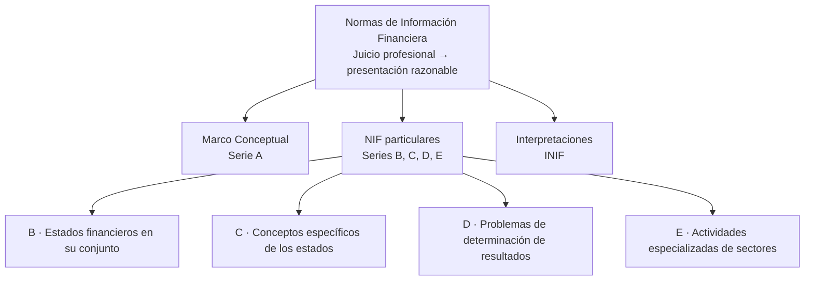
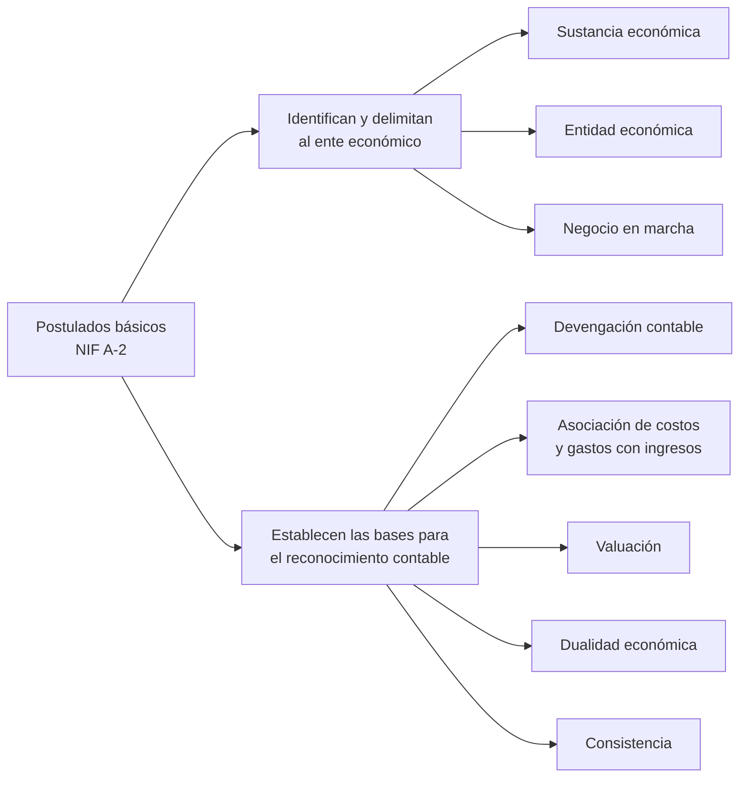
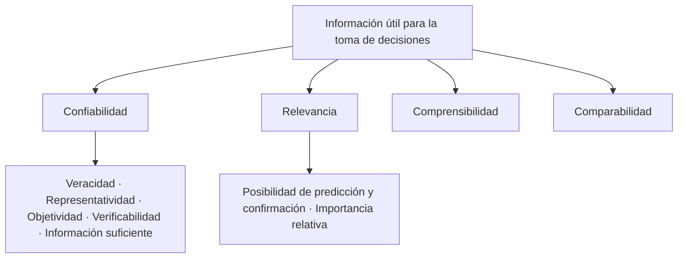

# 5. Las normas de información financiera

> **Reescritura didáctica** del capítulo sobre las **Normas de Información Financiera (NIF)** del CINIF —antes “principios de contabilidad”—, con énfasis en el **Marco Conceptual (serie A)**. Redacción original con ejemplos nuevos; las citas son breves paráfrasis de la norma y las erratas del texto fuente se señalan en recuadros. No es asesoría contable.

## Introducción

Imagina que dos panaderías registran la misma compra de hornos de forma distinta: una como gasto del mes y otra como activo. Sus estados financieros serían **incomparables** y un banco no podría decidir a cuál prestarle. Las **NIF** existen para que todas las entidades **reconozcan, valúen, presenten y revelen** sus operaciones con las **mismas reglas**.

En esta lección verás:

- La **estructura** de las NIF: Marco Conceptual (serie A), NIF particulares (B, C, D, E) e interpretaciones (INIF)
- Los **8 postulados básicos** (NIF A-2) y cómo se agrupan
- Las **necesidades de los usuarios** y los **objetivos** de los estados financieros (A-3)
- Las **características cualitativas** (A-4) y los **elementos básicos** (A-5)
- **Reconocimiento y valuación** (A-6), **presentación y revelación** (A-7), **supletoriedad** (A-8)
- El **juicio profesional**

Al final hay **preguntas de respuesta escrita** con solución oficial y un ejercicio corto de **completar espacios**.

---

## 5.1 Estructura de las NIF

### La serie A: el Marco Conceptual

| NIF | Tema | Idea central |
|---|---|---|
| **A-1** | Estructura de las NIF | Cómo se organizan las normas; incluye el **juicio profesional** |
| **A-2** | **Postulados básicos** | Los 8 fundamentos del sistema contable |
| **A-3** | Necesidades de los usuarios y objetivos de los estados financieros | Para **quién** y **para qué** se informa |
| **A-4** | Características cualitativas | Qué hace **útil** a la información |
| **A-5** | Elementos básicos de los estados financieros | Activos, pasivos, capital, ingresos, costos, gastos… |
| **A-6** | Reconocimiento y valuación | **Cuándo** se registra y **con qué valor** |
| **A-7** | Presentación y revelación | **Cómo** se muestra y qué se explica en **notas** |
| **A-8** | Supletoriedad | Qué hacer si **no hay** NIF aplicable |

:::caution Errata del texto fuente
El resumen del libro (y su respuesta 2) recorre la numeración: llama **A1** a los postulados y **A8** al juicio profesional. Su propio texto, en cambio, usa la numeración correcta: **A-2 postulados, A-3 necesidades, A-4 características, A-5 elementos, A-6 reconocimiento y valuación, A-7 presentación y revelación, A-8 supletoriedad**; la **A-1** es la *Estructura de las NIF*, que incluye el juicio profesional. El resumen también omite la **serie E** entre las NIF particulares.
:::

---

## 5.2 Postulados básicos (NIF A-2)

Los postulados son los **fundamentos** que configuran el sistema de información contable. Son **ocho**, en dos grupos:

| Postulado | Qué dice | Ejemplo |
|---|---|---|
| **Sustancia económica** | Debe prevalecer la **esencia económica** de la operación sobre su forma legal | Un “arrendamiento” en el que la empresa se quedará con el camión al final se trata como una **compra financiada** |
| **Entidad económica** | Unidad identificable, con recursos, un único centro de control, fines específicos y **personalidad propia** | Los gastos personales del dueño no son gastos de la empresa |
| **Negocio en marcha** | La entidad tiene existencia **permanente** salvo prueba en contrario; no se valúa a precios de **liquidación** | Los hornos se muestran a su costo menos depreciación, no a lo que darían en un remate |
| **Devengación contable** | Los eventos se reconocen **cuando ocurren**, sin importar cuándo se cobran o pagan, y se identifican con un **periodo contable** | Una venta a crédito de diciembre es ingreso de diciembre aunque se cobre en enero |
| **Asociación de costos y gastos con ingresos** | Los costos y gastos se identifican con el **ingreso que generan** en el mismo periodo | El costo de la mercancía se reconoce en el periodo en que se **vende**, no cuando se compra |
| **Valuación** | Cuantificar en dinero según los **atributos** del elemento, para captar su valor económico **más objetivo** | El inventario se valúa a su costo de adquisición |
| **Dualidad económica** | La estructura financiera son los **recursos** y sus **fuentes** | Activo = Pasivo + Capital |
| **Consistencia** | Operaciones similares reciben el **mismo tratamiento** a lo largo del tiempo | Si se usa un método de valuación de inventarios, se mantiene año con año (y si cambia, se revela) |

La **devengación** absorbe los antiguos principios de **realización** y **periodo contable**; el **valor histórico original** quedó dentro de la **valuación**.

:::caution Errata del texto fuente
El texto del libro agrupa **entidad, devengación y asociación** como postulados que “identifican al ente”, y su respuesta 4 dice “entidad económica y negocio en marcha”. La NIF A-2 los agrupa así: **identifican y delimitan al ente** → sustancia económica, entidad económica y negocio en marcha; **bases para el reconocimiento contable** → devengación contable, asociación de costos y gastos con ingresos, valuación, dualidad económica y consistencia. Esta lección usa la agrupación de la norma.
:::

<GuidedChoiceExplanation preset="contab-postulados" />

---

### Punto de control 1: estructura y postulados

<MultipleChoice
  id="contab-5-mid1"
  title="Punto de control — estructura de las NIF y postulados básicos"
  questions={[
    {
      prompt: '¿Qué serie de NIF forma el Marco Conceptual?',
      choices: ['Serie A', 'Serie B', 'Serie C', 'INIF'],
      answer: 0,
      why: 'Las series B a E son NIF particulares.',
    },
    {
      prompt: 'Se vende a crédito el 28 de diciembre y se cobra el 15 de enero. ¿Cuándo se reconoce el ingreso?',
      choices: ['El 15 de enero', 'En diciembre', 'Cuando se deposita en el banco', 'Al cierre del año siguiente'],
      answer: 1,
      why: 'Devengación contable: cuando ocurre, no cuando se cobra.',
    },
    {
      prompt: 'Una empresa en quiebra va a liquidarse. ¿Qué postulado deja de aplicar?',
      choices: ['Dualidad económica', 'Negocio en marcha', 'Consistencia', 'Entidad económica'],
      answer: 1,
      why: 'Se valuaría a valores de liquidación.',
    },
    {
      prompt: 'Activo = Pasivo + Capital expresa el postulado de…',
      choices: ['Valuación', 'Dualidad económica', 'Sustancia económica', 'Asociación'],
      answer: 1,
      why: 'Recursos y fuentes de los recursos.',
    },
    {
      prompt: '¿Cuántos postulados básicos hay?',
      choices: ['5', '8', '12', '4'],
      answer: 1,
      why: '3 identifican al ente + 5 establecen bases de reconocimiento.',
    },
    {
      type: 'order',
      prompt: 'Ordena la serie A de la A-2 a la A-8.',
      items: ['Postulados básicos', 'Necesidades de los usuarios y objetivos', 'Características cualitativas', 'Elementos básicos', 'Reconocimiento y valuación', 'Presentación y revelación', 'Supletoriedad'],
      why: 'La A-1 es la estructura de las NIF.',
    },
  ]}
/>

---

## 5.3 Usuarios y objetivos (NIF A-3)

La **actividad económica** —el intercambio de bienes, servicios y obligaciones— es el punto de partida. El **usuario general** decide cómo destinar sus recursos (consumir, ahorrar, invertir, prestar, donar) y necesita información para hacerlo.

**Usuarios**: accionistas o dueños, patrocinadores, órganos de supervisión corporativa, administradores, proveedores, acreedores, empleados, clientes y beneficiarios, gobierno, contribuyentes, reguladores, y otros (público inversionista, analistas, consultores).

**Los estados financieros deben ser útiles para:**

| Objetivo | Usuario típico |
|---|---|
| Decidir **inversiones** o asignación de recursos | Accionistas, inversionistas |
| Decidir si **otorgar crédito** | Proveedores, acreedores, bancos |
| Evaluar la capacidad de **generar recursos** con la operación | Todos |
| Conocer el **origen** y el **rendimiento** de los recursos financieros | Accionistas, analistas |
| Evaluar la **gestión** de la administración: rentabilidad, solvencia, crecimiento | Consejo, accionistas |
| Conocer flujos de efectivo, productividad, cambios en recursos y obligaciones, y la capacidad de **seguir operando** | Todos |

---

## 5.4 Características cualitativas (NIF A-4)

| Característica | Significa | Ejemplo de falla |
|---|---|---|
| **Confiabilidad** | **Veraz** (refleja lo que ocurrió), **representativa** (concuerda con lo que pretende mostrar), **objetiva** (sin sesgo), **verificable** y **suficiente** | Inflar ventas para conseguir un crédito |
| **Relevancia** | Sirve para **predecir y confirmar**; muestra lo **significativo** (**importancia relativa**) en monto y en naturaleza | Ocultar en “otros gastos” una demanda millonaria |
| **Comprensibilidad** | Se puede **entender** con conocimientos razonables | Notas llenas de jerga sin explicar |
| **Comparabilidad** | Se puede comparar **en el tiempo** y **con otras entidades** | Cambiar cada año el método de depreciación sin revelarlo |

**Restricciones** a estas características: **oportunidad** (la información debe llegar a tiempo), **relación costo-beneficio** (no gastar más en producirla de lo que vale) y **equilibrio** entre las características.

<GuidedChoiceExplanation preset="contab-cualitativas" />

---

## 5.5 Elementos básicos (NIF A-5)

| Estado | Entidades lucrativas | Entidades no lucrativas |
|---|---|---|
| **Estado de situación financiera** (balance general) | Activos, pasivos, **capital contable** | Activos, pasivos, **patrimonio contable** |
| **Estado de resultados** / **estado de actividades** | Ingresos, costos, gastos → **utilidad o pérdida neta** | Ingresos, costos, gastos → **cambio neto en el patrimonio** |
| **Estado de variaciones en el capital contable** | Movimientos de propietarios, creación de reservas, **utilidad o pérdida integral** | — |
| **Estado de flujos de efectivo** (o de cambios en la situación financiera) | **Origen y aplicación** de recursos | Origen y aplicación de recursos |

---

## 5.6 Reconocimiento, valuación, presentación y revelación

### Reconocimiento y valuación (NIF A-6)

- **Reconocimiento**: la norma básica es la **devengación contable** — registrar cuando el evento **ocurre**.
- **Valuación**: cuantificar en dinero según los **atributos** del elemento (costo histórico, valor razonable, etc.), buscando el valor **más objetivo**.

### Presentación (NIF A-7)

Los estados financieros **y sus notas** son una **unidad inseparable**: se presentan siempre **juntos**. Las notas siguen un orden lógico y se **relacionan** con los renglones del estado.

Todo estado financiero debe mostrar de forma **prominente**:

| # | Dato | Ejemplo |
|---|---|---|
| a | Nombre o razón social (y el anterior, si cambió recientemente) | Panadería La Espiga, S.A. de C.V. |
| b | Conformación de la entidad | Persona moral |
| c | Fecha del balance y periodo de los demás estados | Al 31 de diciembre de 2026; año terminado en esa fecha |
| d | Si las cifras están en miles o millones | “Cifras en miles de pesos” |
| e | Moneda | Pesos mexicanos |
| f | Poder adquisitivo de las cifras | “Moneda de poder adquisitivo al…” |
| g | Nivel de redondeo, en su caso | Al millar más cercano |

### Revelación (NIF A-7)

- **Políticas contables**: los criterios que la administración eligió para aplicar las NIF.
- **Negocio en marcha**: se evalúa al preparar los estados; si no aplica, se valúa a **valores de liquidación**.
- **Eventos posteriores**: lo que ocurra **entre la fecha de los estados y su emisión** y los afecte sustancialmente debe **revelarse** (p. ej., un incendio en la bodega en enero, antes de emitir los estados al 31 de diciembre).

### Supletoriedad (NIF A-8)

Si **no existe** una NIF para cierta situación, se aplica una **norma supletoria** formalmente establecida —en primer lugar las **IFRS (NIIF)** del IASB.

### Juicio profesional

Las NIF dejan **alternativas**; elegir la adecuada requiere **juicio profesional**, ejercido con **enfoque prudencial**: ante la duda, la opción **más conservadora**, sin dejar de ser **equitativa** para los usuarios. Se usa para:

1. Hacer **estimaciones y provisiones** confiables
2. Juzgar la **incertidumbre** sobre sucesos futuros
3. **Elegir tratamientos** contables
4. Elegir **normas supletorias**
5. Establecer tratamientos **particulares**
6. **Equilibrar** las características cualitativas

El resultado buscado es una **presentación razonable**.

:::info Actualización
- “Moneda de poder adquisitivo” se relaciona con la **NIF B-10** (*Efectos de la inflación*): desde 2008 México se considera un entorno **no inflacionario** y solo se reexpresan cifras si la inflación acumulada de tres años llega al **26%**.
- La convergencia con las **IFRS** ha continuado: muchas NIF recientes (ingresos, arrendamientos, instrumentos financieros) siguen de cerca a sus equivalentes internacionales.
:::

---

### Punto de control 2: usuarios, características y presentación

<MultipleChoice
  id="contab-5-mid2"
  title="Punto de control — A-3 a A-8"
  questions={[
    {
      prompt: 'Un auditor puede rastrear cada venta hasta su factura y su depósito. ¿Qué cualidad se cumple?',
      choices: ['Comprensibilidad', 'Verificabilidad (confiabilidad)', 'Comparabilidad', 'Oportunidad'],
      answer: 1,
      why: 'Es parte de la confiabilidad.',
    },
    {
      prompt: 'Una empresa cambia cada año su método de valuar inventarios sin decirlo. ¿Qué se afecta más?',
      choices: ['Comparabilidad (y el postulado de consistencia)', 'Dualidad', 'Entidad', 'Supletoriedad'],
      answer: 0,
      why: 'No se pueden comparar los periodos.',
    },
    {
      prompt: '¿Qué afirma la NIF A-7 sobre las notas?',
      choices: [
        'Son opcionales',
        'Forman con los estados financieros una unidad inseparable',
        'Solo se usan en auditorías',
        'Sustituyen a los estados',
      ],
      answer: 1,
      why: 'Siempre se presentan juntos.',
    },
    {
      prompt: 'No hay NIF para cierta operación. ¿Qué se hace?',
      choices: ['No se registra', 'Se aplica una norma supletoria (IFRS en primer lugar)', 'Se elige libremente', 'Se consulta al SAT'],
      answer: 1,
      why: 'NIF A-8, supletoriedad.',
    },
    {
      prompt: 'El enfoque prudencial del juicio profesional consiste en…',
      choices: ['Elegir la opción más optimista', 'Elegir la opción más conservadora, sin perder la equidad', 'Elegir la más barata', 'No elegir'],
      answer: 1,
      why: 'Busca una presentación razonable.',
    },
    {
      prompt: 'El estado financiero de una asociación civil sin fines de lucro que muestra ingresos y gastos se llama…',
      choices: ['Estado de resultados', 'Estado de actividades', 'Balance general', 'Estado de variaciones'],
      answer: 1,
      why: 'Su resultado es el cambio neto en el patrimonio contable.',
    },
  ]}
/>

---

## Completa los espacios: ideas clave

<ProblemSet id="contab-5-completar" lang="es">
  <Problem type="cloze" title="1" prompt={`Las NIF se estructuran en el Marco [[Conceptual]] (serie A), las NIF [[particulares]] (series B, C, D y E) y las [[interpretaciones|INIF]] a las NIF.`} />
  <Problem type="cloze" title="2" prompt={`Los postulados básicos están en la NIF [[A-2|A2]].`} />
  <Problem type="cloze" title="3" prompt={`Según la devengación contable, los eventos se reconocen cuando [[ocurren]], independientemente de cuándo se consideren realizados.`} />
  <Problem type="cloze" title="4" prompt={`Por el postulado de [[negocio en marcha]], la entidad se presume permanente y no se valúa a precios de [[liquidación]].`} />
  <Problem type="cloze" title="5" prompt={`La dualidad económica distingue los [[recursos]] de la entidad y las [[fuentes]] de esos recursos.`} />
  <Problem type="cloze" title="6" prompt={`Por la [[consistencia]], las operaciones similares reciben el mismo tratamiento a lo largo del tiempo.`} />
  <Problem type="cloze" title="7" prompt={`Las características cualitativas principales son confiabilidad, [[relevancia]], [[comprensibilidad]] y [[comparabilidad]].`} />
  <Problem type="cloze" title="8" prompt={`La confiabilidad implica veracidad, representatividad, [[objetividad]], [[verificabilidad]] e información suficiente.`} />
  <Problem type="cloze" title="9" prompt={`Los estados financieros y sus [[notas]] forman una unidad [[inseparable]].`} />
  <Problem type="cloze" title="10" prompt={`Cuando no existe una NIF aplicable se recurre a la [[supletoriedad]] (NIF A-8).`} />
  <Problem type="cloze" title="11" prompt={`El juicio profesional se ejerce con un enfoque [[prudencial]], eligiendo la opción más [[conservadora]].`} />
</ProblemSet>

---

### Evaluación: normas de información financiera

<MultipleChoice
  id="contab-5"
  title="Normas de información financiera"
  questions={[
    {
      prompt: '¿Cuál postulado pertenece al grupo que identifica y delimita al ente?',
      choices: ['Valuación', 'Sustancia económica', 'Devengación contable', 'Consistencia'],
      answer: 1,
      why: 'Junto con entidad económica y negocio en marcha.',
    },
    {
      prompt: 'Una empresa compra mercancía en marzo y la vende en mayo. ¿Cuándo se reconoce su costo en resultados?',
      choices: ['En marzo', 'En mayo, junto con el ingreso', 'Al pagarla', 'Al final del año siguiente'],
      answer: 1,
      why: 'Asociación de costos y gastos con ingresos.',
    },
    {
      prompt: 'Incendio en la bodega el 20 de enero; los estados al 31 de diciembre se emiten el 15 de febrero. ¿Qué se hace?',
      choices: ['Nada, ocurrió después', 'Revelarlo como evento posterior', 'Cambiar la fecha del balance', 'Registrarlo en diciembre como pérdida ya ocurrida'],
      answer: 1,
      why: 'Eventos posteriores sustanciales deben revelarse (NIF A-7).',
    },
    {
      prompt: '¿Qué restricción reconoce que producir información tiene un costo?',
      choices: ['Oportunidad', 'Relación costo-beneficio', 'Importancia relativa', 'Consistencia'],
      answer: 1,
      why: 'No debe costar más de lo que vale para el usuario.',
    },
    {
      prompt: 'Un pagaré de 10 millones se oculta dentro de “otros pasivos” sin nota. ¿Qué característica falla?',
      choices: ['Relevancia (importancia relativa)', 'Dualidad', 'Supletoriedad', 'Entidad'],
      answer: 0,
      why: 'Una partida significativa debe mostrarse.',
    },
    {
      type: 'order',
      prompt: 'Ordena del concepto más general al más particular.',
      items: ['Normas de Información Financiera', 'Marco Conceptual (serie A)', 'NIF A-2 Postulados básicos', 'Devengación contable'],
      why: 'Norma → marco → serie → postulado.',
    },
  ]}
/>

---

## Preguntas y problemas: respuesta escrita

Escribe tu respuesta, pulsa **Ver solución oficial** y compárala; luego **Marcar como revisada**. Algunas preguntas piden términos obligatorios: pulsa **Verificar requisitos** antes. Las soluciones siguen la norma (con las correcciones indicadas arriba).

<ProblemSet id="contab-5-preguntas" lang="es">
  <Problem type="concept" title="1" keywords={['Marco Conceptual']} prompt={`¿En qué se basa la estructura de las Normas de Información Financiera?`} answer={`En un Marco Conceptual (serie A), las NIF particulares (series B, C, D y E) y las Interpretaciones a las NIF (INIF).`} />
  <Problem type="concept" title="2" minWords={10} prompt={`¿Cómo está integrado el Marco Conceptual de las NIF?`} answer={`Por la serie A: A-1 Estructura de las NIF (incluye el juicio profesional), A-2 Postulados básicos, A-3 Necesidades de los usuarios y objetivos de los estados financieros, A-4 Características cualitativas, A-5 Elementos básicos, A-6 Reconocimiento y valuación, A-7 Presentación y revelación y A-8 Supletoriedad.`} />
  <Problem type="concept" title="3" prompt={`¿Qué grupos componen los postulados básicos?`} answer={`Los que identifican y delimitan al ente económico, y los que establecen las bases para el reconocimiento contable de las transacciones, transformaciones internas y otros eventos.`} />
  <Problem type="concept" title="4" keywords={['entidad']} prompt={`¿Qué postulados identifican y delimitan al ente económico?`} answer={`Sustancia económica, entidad económica y negocio en marcha. (El libro responde “entidad económica y negocio en marcha”; la NIF A-2 incluye también la sustancia económica.)`} />
  <Problem type="concept" title="5" minWords={10} prompt={`¿Qué representa la entidad?`} answer={`Una unidad identificable que realiza actividades económicas, constituida por recursos humanos, materiales y financieros, con un único centro de control que toma decisiones para cumplir fines específicos, y con personalidad propia.`} />
  <Problem type="concept" title="6" keywords={['ocurren']} prompt={`¿Qué señala la devengación contable?`} answer={`Que los eventos económicos deben reconocerse contablemente en el momento en que ocurren, independientemente de la fecha en que se consideren realizados, y deben identificarse con un periodo contable.`} />
  <Problem type="concept" title="7" keywords={['ingreso']} prompt={`¿Con qué deben identificarse los costos y gastos?`} answer={`Con los ingresos que generan, en el mismo periodo, independientemente de la fecha de su realización.`} />
  <Problem type="concept" title="8" minWords={6} prompt={`¿Cuáles son los postulados que establecen las bases para el reconocimiento contable de las transacciones, transformaciones internas y otros eventos?`} answer={`Devengación contable, asociación de costos y gastos con ingresos, valuación, dualidad económica y consistencia.`} />
  <Problem type="concept" title="9" prompt={`¿Qué es la sustancia económica?`} answer={`El postulado según el cual debe prevalecer la esencia económica de las operaciones, sobre su forma legal, en la captación y operación del sistema de información contable.`} />
  <Problem type="concept" title="10" keywords={['permanente']} prompt={`¿Qué señala el negocio en marcha?`} answer={`Que la entidad tiene existencia permanente, salvo prueba en contrario; sus cifras se basan en las NIF y no en valores estimados de su disposición o liquidación.`} />
  <Problem type="concept" title="11" prompt={`¿Qué cuantifica la valuación?`} answer={`Cuantifica en términos monetarios los eventos económicos atendiendo a los atributos del elemento valuado, para captar su valor económico más objetivo.`} />
  <Problem type="concept" title="12" keywords={['recursos']} prompt={`¿Qué representa la dualidad económica?`} answer={`La estructura financiera de la entidad: los recursos con que cuenta y las fuentes de esos recursos (Activo = Pasivo + Capital).`} />
  <Problem type="concept" title="13" prompt={`¿Qué es la consistencia?`} answer={`Que las operaciones similares reciban el mismo tratamiento de cuantificación, registro y presentación, y que este se mantenga a lo largo del tiempo.`} />
  <Problem type="concept" title="14" prompt={`¿De qué trata la NIF A-3?`} answer={`De las necesidades de los usuarios y los objetivos de los estados financieros.`} />
  <Problem type="concept" title="15" prompt={`¿Qué necesidades tienen los usuarios de los estados financieros?`} answer={`Conocer la situación financiera y el resultado de las operaciones de la entidad para tomar decisiones (de inversión, crédito, consumo, ahorro, etc.).`} />
  <Problem type="concept" title="16" minWords={10} prompt={`¿Cuáles son los objetivos de los estados financieros?`} answer={`Se derivan de las necesidades del usuario general y de la naturaleza de la entidad: proporcionar información sobre la situación financiera, la actividad operativa, los flujos de efectivo y los cambios en la situación financiera, útil para decidir inversiones y créditos, evaluar la capacidad de generar recursos y evaluar la gestión de la administración.`} />
  <Problem type="concept" title="17" keywords={['confiabilidad', 'relevancia']} prompt={`¿Cuáles son las características cualitativas de los estados financieros?`} answer={`Confiabilidad, relevancia, comprensibilidad y comparabilidad.`} />
  <Problem type="concept" title="18" minWords={8} prompt={`¿Cuáles son los elementos básicos de los estados financieros?`} answer={`Activos, pasivos y capital (o patrimonio) contable; ingresos, costos y gastos; utilidad o pérdida neta (o cambio neto en el patrimonio); movimientos de propietarios, reservas y utilidad o pérdida integral; y origen y aplicación de recursos.`} />
  <Problem type="concept" title="19" prompt={`¿Qué incluye el reconocimiento y valuación de las operaciones?`} answer={`Los criterios para valuar los eventos económicos y la norma básica de reconocimiento, que es la devengación contable.`} />
  <Problem type="concept" title="20" minWords={10} prompt={`¿A qué se refiere la presentación y revelación de la información financiera?`} answer={`A que los estados financieros y sus notas forman una unidad inseparable, cuya información se describe mediante títulos, rubros, conjuntos y cantidades; y a que deben revelarse las políticas contables, la evaluación de negocio en marcha y los eventos posteriores sustanciales.`} />
  <Problem type="concept" title="21" keywords={['supletoria']} prompt={`¿Qué es la supletoriedad?`} answer={`Que, cuando no existe una NIF mexicana aplicable, se aplica una norma supletoria formalmente establecida, en primer lugar las IFRS.`} />
  <Problem type="concept" title="22" prompt={`¿Qué representa el juicio profesional en la información financiera?`} answer={`La capacidad de elegir, entre las alternativas que permiten las NIF, la más adecuada para lograr una presentación razonable (estimaciones, provisiones, tratamientos contables, normas supletorias, etc.).`} />
  <Problem type="concept" title="23" keywords={['prudencial']} prompt={`¿Cómo se debe ejercer el juicio profesional?`} answer={`Con un enfoque prudencial: seleccionar la opción más conservadora, procurando que la decisión sea equitativa para los usuarios.`} />
</ProblemSet>

---

## Resumen

:::tip Recuerda
- NIF = **Marco Conceptual** (serie A) + **NIF particulares** (B, C, D, E) + **INIF**
- Serie A: A-1 estructura · **A-2 postulados** · A-3 usuarios y objetivos · **A-4 características** · A-5 elementos · A-6 reconocimiento y valuación · A-7 presentación y revelación · A-8 supletoriedad
- **8 postulados**: sustancia económica, entidad, negocio en marcha (delimitan al ente) · devengación, asociación, valuación, dualidad, consistencia (bases de reconocimiento)
- Información útil: **confiable, relevante, comprensible, comparable**; restricciones: oportunidad, costo-beneficio, equilibrio
- Estados y notas = **unidad inseparable**; revelar políticas, negocio en marcha y eventos posteriores
- Sin NIF aplicable → **supletoriedad** (IFRS); alternativas → **juicio profesional prudencial**
:::

## Lecturas adicionales

- Siguiente: [6. La partida doble y los asientos de diario](./la-partida-doble-y-los-asientos-de-diario)
- [4. Las cuentas de una entidad comercial](./las-cuentas-de-una-entidad-comercial)
- [2. La contabilidad, la entidad y la información financiera](./la-contabilidad-la-entidad-y-la-informacion-financiera)
- CINIF — Marco Conceptual de las NIF (serie A); NIF B-10 *Efectos de la inflación*
- Base: texto de *Contabilidad básica* (Grupo Editorial Patria), usado como guía de estudio
