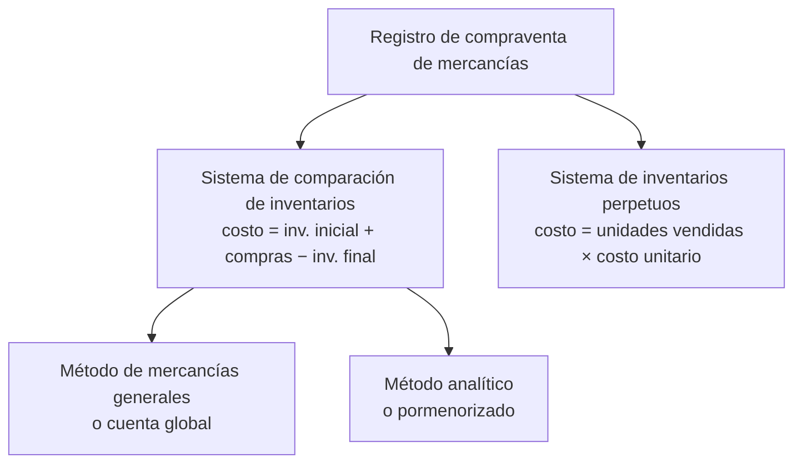

# 7. Sistemas de tratamiento contable a operaciones de compraventa de mercancías

> **Reescritura didáctica** del capítulo sobre cómo registrar la compraventa de mercancías: el **sistema de comparación de inventarios** (métodos de **mercancías generales** y **analítico**) y el **sistema de inventarios perpetuos** (enfoque México). Redacción original; todas las cifras se recalcularon y las erratas del texto fuente se señalan en recuadros. No es asesoría contable ni fiscal.

## Introducción

Toda venta de mercancía tiene **dos precios**:

- **Precio de venta**: el que se pacta con el **cliente**.
- **Precio de costo**: lo que la empresa **invirtió** en la cosa vendida.

La diferencia es la **utilidad (o pérdida) bruta**. El precio de venta se conoce **al vender**; el de costo **no siempre**. Una papelería que vende miles de lápices de pocos pesos no puede, sin un buen sistema, saber el costo de cada uno en cada venta.

Por eso existen dos **sistemas**:

En esta lección verás los tres métodos con el **mismo ejemplo**, sus ventajas y limitaciones, y practicarás **asientos con códigos**, **cálculos** y **preguntas de respuesta escrita**.

---

## 7.1 ¿Comparación de inventarios o inventarios perpetuos?

| | **Comparación de inventarios** | **Inventarios perpetuos** |
|---|---|---|
| Costo de lo vendido | **Inventario inicial + compras − inventario final** (en conjunto) | **Unidades vendidas × costo unitario** (por artículo) |
| ¿Cuándo se conoce? | Normalmente **al final del ejercicio**, tras un **inventario físico** | En cada venta, por lo general **mensualmente** |
| Existencias | Solo al contar | **Siempre**, por artículo, en unidades y valor |
| Mermas y robos | **No se detectan** | Se detectan comparando con el conteo físico |
| Utilidad por producto | No (solo global) | **Sí** |
| Típico en | Tiendas de menudeo, autoservicios, restaurantes **sin** sistemas electrónicos | Negocios con costo identificable o con **lectores de código de barras** |

**Limitaciones de la comparación de inventarios**:

1. Sin inventario físico no hay costo ni resultado **intermedio**; contar cada mes **cuesta** tiempo y puede afectar el **servicio** al cliente.
2. El resultado es **global**: no ayuda a fijar precios **por producto**.
3. No permite detectar **mermas, robos o sustracciones**.

Con lectoras ópticas y sistemas electrónicos, incluso un supermercado puede llevar **inventarios perpetuos**, con niveles de existencia y **puntos de reorden** automáticos.

:::info Actualización
- La **NIF C-4 *Inventarios*** regula su valuación (costo de adquisición; fórmulas de **costos identificados**, **PEPS** o **costo promedio**; el método UEPS ya no se permite) y su presentación.
- Para efectos fiscales, desde la reforma de **2005** que hizo deducible el **costo de lo vendido**, las reglas fiscales exigen, en general, llevar **inventarios perpetuos** y un sistema de costeo; la comparación de inventarios queda para casos muy limitados.
:::

<GuidedChoiceExplanation preset="contab-sistema-inventario" />

---

## 7.2 Ejemplo común para los métodos de comparación

| # | Operación | Importe |
|---|---|---|
| 1 | Inventario inicial (a costo) | 100,000 |
| 2 | Compras brutas | 500,000 |
| 3 | Fletes y derechos sobre compras | 60,000 |
| 4 | Descuentos obtenidos de proveedores | 18,000 |
| 5 | Devoluciones a proveedores | 30,000 |
| 6 | Ventas brutas | 1,000,000 |
| 7 | Descuentos otorgados a clientes | 40,000 |
| 8 | Devoluciones de clientes | 70,000 |
| — | Inventario final (por conteo físico, a costo) | 180,000 |

---

## 7.3 Método de mercancías generales (cuenta global)

Todo se registra en **una sola cuenta**: **5050 Mercancías generales**.

| Se **carga** por | Se **abona** por |
|---|---|
| Inventario **inicial** — a **costo** | Mercancías **vendidas** — a **venta** |
| **Compras** (y fletes) — a **costo** | Devoluciones y rebajas **sobre compras** — a **costo** |
| Devoluciones y rebajas **sobre ventas** — a **venta** | |

La cuenta **mezcla dos precios** (costo y venta), por lo que su saldo es **heterogéneo** y puede ser **deudor o acreedor**.

**Ejemplo**:

| 5050 Mercancías generales — Debe | | Haber | |
|---|---|---|---|
| (1) Inventario inicial | 100,000 | (4) Descuentos sobre compras | 18,000 |
| (2) Compras brutas | 500,000 | (5) Devoluciones sobre compras | 30,000 |
| (3) Fletes y derechos | 60,000 | (6) Ventas | 1,000,000 |
| (7) Descuentos sobre ventas | 40,000 | | |
| (8) Devoluciones sobre ventas | 70,000 | | |
| **Movimiento deudor** | **770,000** | **Movimiento acreedor** | **1,048,000** |
| | | **Saldo acreedor** | **278,000** |

Ese 278,000 **no es** ni el inventario ni la utilidad: es una **mezcla**. Para separarlos se **incorpora el inventario final**:

| Cuenta | Debe | Haber |
|---|---|---|
| 0121 Inventario de mercancías | 180,000 | |
|  5050 Mercancías generales | | 180,000 |

Nuevo saldo de 5050: 278,000 + 180,000 = **458,000 acreedor = utilidad bruta**. En ese momento 5050 se convierte en **cuenta de resultados**.

**Comprobación** (requiere **analizar** la cuenta 5050, porque el mayor no muestra los conceptos por separado):

| | | $ |
|---|---|---|
| Ventas | | 1,000,000 |
| (−) Devoluciones 70,000 y descuentos 40,000 | | 110,000 |
| **Ventas netas** | | **890,000** |
| Inventario inicial | 100,000 | |
| (+) Compras 500,000 + fletes 60,000 − devoluciones 30,000 − descuentos 18,000 | 512,000 | |
| = Mercancía disponible | 612,000 | |
| (−) Inventario final | 180,000 | |
| **Costo de ventas** | | **432,000** |
| **Utilidad bruta** | | **458,000** |

- Al **cierre**, 5050 se salda contra **3101 Pérdidas y ganancias**.
- **0121 Inventario de mercancías** es **activo circulante**; al iniciar el nuevo ejercicio se traspasa a 5050 (el inventario final se vuelve **inicial**).

:::caution Errata del texto fuente
El asiento del libro para incorporar el inventario final carga la cuenta “**0130** Inventario de mercancías”; 0130 es *Seguros pagados por anticipado*. La cuenta correcta es **0121 Inventario de mercancías**, como el propio libro usa enseguida en el mayor.
:::

---

## 7.4 Método analítico o pormenorizado

Usa **una cuenta para cada concepto**, de modo que cada cuenta tiene operaciones **homogéneas** (un solo precio) y la información es **limpia**.

| Grupo | Cuenta | Naturaleza | Registra |
|---|---|---|---|
| **Inventario** | 0121 Inventario de mercancías | Deudora | Inventario **inicial** (sin otro movimiento en el año) y luego el final |
| **Compras** | 5060 Compras brutas | Deudora | Facturas de proveedores, a costo |
| | 5061 Devoluciones sobre compras | **Acreedora** | Mercancía devuelta a proveedores |
| | 5062 Descuentos sobre compras | **Acreedora** | Rebajas obtenidas |
| | 5063 Gastos sobre compras | Deudora | Fletes, derechos de importación, gastos aduanales, comisiones, acarreos |
| **Ventas** | 4060 Ventas brutas | Acreedora | Facturas de venta |
| | 4061 Devoluciones sobre ventas | **Deudora** | Devoluciones de clientes, a precio de venta |
| | 4062 Descuentos sobre ventas | **Deudora** | Rebajas otorgadas |
| **Costo** | 5065 Costo de ventas | Deudora | Se determina al cierre |

**Fórmulas**:

- **Compras netas** = compras brutas + gastos sobre compras − devoluciones − descuentos
- **Ventas netas** = ventas brutas − devoluciones − descuentos
- **Costo de ventas** = inventario inicial + compras netas − inventario final
- **Utilidad bruta** = ventas netas − costo de ventas

### Asientos para determinar el costo de ventas

| # | Cuenta | Debe | Haber |
|---|---|---|---|
| 1 | 5065 Costo de ventas | 100,000 | |
| |  0121 Inventario de mercancías | | 100,000 |
| | *Traspaso del inventario inicial* | | |
| 2 | 5065 Costo de ventas | 512,000 | |
| | 5061 Devoluciones sobre compras | 30,000 | |
| | 5062 Descuentos sobre compras | 18,000 | |
| |  5060 Compras brutas | | 500,000 |
| |  5063 Gastos sobre compras | | 60,000 |
| | *Traspaso de las compras netas* | | |
| 3 | 0121 Inventario de mercancías | 180,000 | |
| |  5065 Costo de ventas | | 180,000 |
| | *Registro del inventario final* | | |

Saldo de **5065** = 100,000 + 512,000 − 180,000 = **432,000**, el mismo costo que en el método global. El **estado de resultados analítico** es idéntico al de la comprobación anterior (utilidad bruta **458,000**), pero ahora **sale directamente de las cuentas** del mayor.

El inventario final registrado en 0121 es el **inicial** del ejercicio siguiente. Al cierre, las cuentas de resultados se saldan contra **Pérdidas y ganancias**.

<GuidedChoiceExplanation preset="contab-costo-ventas" />

---

### Punto de control 1: comparación de inventarios

<MultipleChoice
  id="contab-7-mid1"
  title="Punto de control — mercancías generales y analítico"
  questions={[
    {
      prompt: '¿Por qué el saldo de Mercancías generales es “heterogéneo”?',
      choices: ['Porque mezcla precios de costo y de venta', 'Porque tiene muchos movimientos', 'Porque es de capital', 'Porque no tiene saldo'],
      answer: 0,
      why: 'Por eso hay que incorporar el inventario final para obtener la utilidad bruta.',
    },
    {
      prompt: 'En mercancías generales, ¿a qué precio se cargan las devoluciones sobre ventas?',
      choices: ['A costo', 'A venta', 'A promedio', 'No se registran'],
      answer: 1,
      why: 'Revierten parte de la venta, que está a precio de venta.',
    },
    {
      prompt: 'Inventario inicial 80,000; compras netas 300,000; inventario final 60,000. ¿Costo de ventas?',
      choices: ['320,000', '440,000', '280,000', '300,000'],
      answer: 0,
      why: '80,000 + 300,000 − 60,000.',
    },
    {
      prompt: '¿Qué naturaleza tiene la cuenta 5061 Devoluciones sobre compras?',
      choices: ['Deudora', 'Acreedora', 'Mixta', 'Ninguna'],
      answer: 1,
      why: 'Disminuye las compras brutas.',
    },
    {
      prompt: '¿Cómo se registra el inventario final en el método analítico?',
      choices: [
        'Cargo a 5065, abono a 0121',
        'Cargo a 0121, abono a 5065',
        'Cargo a 5060, abono a 0121',
        'No se registra',
      ],
      answer: 1,
      why: 'Reduce el costo de ventas y queda como activo.',
    },
    {
      type: 'order',
      prompt: 'Ordena el cálculo del costo de ventas.',
      items: ['Inventario inicial', 'Más compras netas', 'Igual a mercancía disponible', 'Menos inventario final', 'Igual a costo de ventas'],
      why: 'Comparación de inventarios.',
    },
  ]}
/>

---

## 7.5 Sistema de inventarios perpetuos

Mantiene en todo momento las **existencias y su valor** por artículo. Funciona con tres cuentas: **0120 Almacén** (con un **auxiliar por artículo**), **4001 Ventas** y **5001 Costo de ventas**.

Cada venta lleva un **doble asiento**:

1. La **venta**, a **precio de venta**: cargo a Bancos o Clientes, abono a Ventas.
2. El **costo**, a **precio de costo**: cargo a Costo de ventas, abono a Almacén.

Así el Almacén siempre refleja la **inversión real** (todos sus movimientos son a costo).

**Ventajas**:

- Se conoce la existencia e inversión **sin contar**: permite niveles óptimos, prevenir faltantes y mantener el servicio al cliente.
- Se conoce el resultado **por producto**.
- Se puede **responsabilizar** a quien custodia el inventario.
- Se obtienen resultados por **mercado, zona geográfica**, etc.

### Ejemplo

| # | Fecha | Operación |
|---|---|---|
| 1 | 31 dic | Inventario inicial: **A** 100 u × 1,000 = 100,000; **B** 50 u × 5,000 = 250,000 → **350,000** (financiado con capital) |
| 2 | 5 ene | Compra a crédito de **C**: 30 u × 5,000 = **150,000** |
| 3 | 6 ene | Descuento del proveedor en C: 500 por unidad → **15,000** (costo de C baja a **4,500**) |
| 4 | 10 ene | Devolución al proveedor de 30 u de **A** en mal estado → **30,000** |
| 5 | 12 ene | Venta de contado: A 40 u × 1,600 = 64,000; B 20 u × 8,000 = 160,000; C 10 u × 7,000 = 70,000 → **294,000** |
| 6 | 13 ene | Descuento especial de **3%** sobre esa venta, pagado en efectivo → **8,820** |
| 7 | 23 ene | El cliente devuelve las 10 u de **C** (defectuosas); se le reembolsan 70,000 − 3% = **67,900** |

**Asientos de diario**:

| # | Cuenta | Debe | Haber |
|---|---|---|---|
| 1 | 0120 Almacén | 350,000 | |
| |  3001 Capital | | 350,000 |
| 2 | 0120 Almacén | 150,000 | |
| |  1102 Proveedores | | 150,000 |
| 3 | 1102 Proveedores | 15,000 | |
| |  0120 Almacén | | 15,000 |
| 4 | 1102 Proveedores | 30,000 | |
| |  0120 Almacén | | 30,000 |
| 5 | 0102 Bancos | 294,000 | |
| |  4001 Ventas | | 294,000 |
| 5A | 5001 Costo de ventas (A 40 × 1,000 + B 20 × 5,000 + C 10 × 4,500) | 185,000 | |
| |  0120 Almacén | | 185,000 |
| 6 | 4001 Ventas | 8,820 | |
| |  0102 Bancos | | 8,820 |
| 7 | 4001 Ventas | 67,900 | |
| |  0102 Bancos | | 67,900 |
| 7A | 0120 Almacén (C 10 × 4,500) | 45,000 | |
| |  5001 Costo de ventas | | 45,000 |

**Saldos**:

| Cuenta | Cálculo | Saldo |
|---|---|---|
| 0120 Almacén | 350,000 + 150,000 + 45,000 − 15,000 − 30,000 − 185,000 | **315,000** deudor |
| 1102 Proveedores | 150,000 − 15,000 − 30,000 | **105,000** acreedor |
| 0102 Bancos | 294,000 − 8,820 − 67,900 | **217,280** deudor |
| 4001 Ventas | 294,000 − 8,820 − 67,900 | **217,280** acreedor (ventas netas) |
| 5001 Costo de ventas | 185,000 − 45,000 | **140,000** deudor |

**Utilidad bruta** = 217,280 − 140,000 = **77,280**.

### Auxiliares de Almacén (por artículo)

| Artículo | Movimientos (unidades) | Existencia | Costo unitario | Importe |
|---|---|---|---|---|
| **A** | 100 inicial − 30 devolución − 40 venta | **30** | 1,000 | **30,000** |
| **B** | 50 inicial − 20 venta | **30** | 5,000 | **150,000** |
| **C** | 30 compra − 10 venta + 10 devolución del cliente | **30** | 4,500 | **135,000** |
| **Total** | | | | **315,000** |

El total de los auxiliares **coincide** con el saldo de la cuenta de mayor Almacén. La cuenta Ventas también puede llevar auxiliares (ventas brutas 294,000, devoluciones 67,900, descuentos 8,820), o abrirse cuentas de mayor separadas como en el método analítico.

:::caution Erratas del texto fuente
- El descuento del 13 de enero se describe como **3%**, pero el libro registra **29,400** (que es el **10%** de 294,000); la devolución del 23 de enero sí aplica 3% (70,000 − 2,100 = 67,900). Con 3%, el descuento es **8,820**, y las ventas netas y el saldo de Bancos quedan en **217,280** (el libro: 196,700).
- En los auxiliares del libro, varias fechas de enero aparecen como “10/10”, “12/10”, “15/1” y “16/1”; corresponden al **10, 12, 5 y 6 de enero**.
:::

<GuidedChoiceExplanation preset="contab-perpetuo" />

---

### Punto de control 2: inventarios perpetuos

<MultipleChoice
  id="contab-7-mid2"
  title="Punto de control — inventarios perpetuos"
  questions={[
    {
      prompt: '¿Cuántos asientos genera una venta en inventarios perpetuos?',
      choices: ['Uno', 'Dos: la venta (a precio de venta) y el costo (a precio de costo)', 'Tres', 'Ninguno hasta fin de año'],
      answer: 1,
      why: 'El segundo transfiere el costo de Almacén a Costo de ventas.',
    },
    {
      prompt: 'Se venden 25 unidades con costo de 400 c/u a 650 c/u. ¿Cargo a Costo de ventas?',
      choices: ['16,250', '10,000', '6,250', '26,250'],
      answer: 1,
      why: '25 × 400.',
    },
    {
      prompt: '¿Por qué el saldo de Almacén representa la inversión real?',
      choices: ['Porque se cuenta cada día', 'Porque todos sus cargos y abonos son a precio de costo', 'Porque incluye las ventas', 'Porque lo fija el SAT'],
      answer: 1,
      why: 'Nunca se mezcla con precios de venta.',
    },
    {
      prompt: 'Un descuento de 500 por unidad sobre 30 unidades compradas a 5,000. ¿Nuevo costo unitario?',
      choices: ['5,000', '4,500', '4,983', '5,500'],
      answer: 1,
      why: 'El descuento disminuye el costo de la mercancía.',
    },
    {
      prompt: '¿Qué ventaja NO tiene la comparación de inventarios frente a los perpetuos?',
      choices: ['Detectar mermas y robos', 'Determinar el costo con inventario final', 'Funcionar con pocas cuentas', 'Ser sencilla'],
      answer: 0,
      why: 'Sin existencias teóricas no hay contra qué comparar el conteo.',
    },
  ]}
/>

---

## Practica: cálculos

Escribe el número sin comas. Tienes dos intentos antes de ver la respuesta.

<ProblemSet id="contab-7-numeros" lang="es">
  <Problem title="N1" decimals={0} prompt={`Mercancías generales: movimiento deudor 770,000 y acreedor 1,048,000. ¿Saldo (acreedor) antes del inventario final?`} answer={278000} why={`1,048,000 − 770,000.`} />
  <Problem title="N2" decimals={0} prompt={`Con ese saldo, se incorpora un inventario final de 180,000. ¿Utilidad bruta?`} answer={458000} why={`278,000 + 180,000 (abono a 5050).`} />
  <Problem title="N3" decimals={0} prompt={`Compras brutas 500,000; gastos sobre compras 60,000; devoluciones 30,000; descuentos 18,000. ¿Compras netas?`} answer={512000} why={`500,000 + 60,000 − 30,000 − 18,000.`} />
  <Problem title="N4" decimals={0} prompt={`(Libro, problema 47) Ventas brutas 500,000; descuentos 20,000; devoluciones 35,000. ¿Ventas netas?`} answer={445000} why={`500,000 − 55,000.`} />
  <Problem title="N5" decimals={0} prompt={`(Problema 48) Inventario inicial 50,000; compras 250,000; gastos 30,000; descuentos 9,000; devoluciones 15,000; inventario final 90,000. ¿Costo de ventas?`} answer={216000} why={`Compras netas 256,000; 50,000 + 256,000 − 90,000.`} />
  <Problem title="N6" decimals={0} prompt={`(Problema 46) Con las cifras anteriores, ¿utilidad bruta?`} answer={229000} why={`445,000 − 216,000.`} />
  <Problem title="N7" decimals={0} prompt={`Perpetuos: costo de la venta del 12 de enero (A 40 × 1,000; B 20 × 5,000; C 10 × 4,500).`} answer={185000} why={`40,000 + 100,000 + 45,000.`} />
  <Problem title="N8" decimals={0} prompt={`Descuento de 3% sobre la venta de 294,000.`} answer={8820} why={`294,000 × 0.03.`} />
  <Problem title="N9" decimals={0} prompt={`Ventas netas del ejemplo perpetuo: 294,000 − 8,820 − 67,900.`} answer={217280} why={`Saldo acreedor de 4001 Ventas.`} />
  <Problem title="N10" decimals={0} prompt={`Saldo final de Almacén en el ejemplo perpetuo.`} answer={315000} why={`A 30,000 + B 150,000 + C 135,000.`} />
  <Problem title="N11" decimals={0} prompt={`(Problema 51) Compra a crédito: A 40 × 1,000 y B 200 × 500. ¿Importe del asiento?`} answer={140000} why={`40,000 + 100,000.`} />
  <Problem title="N12" decimals={0} prompt={`(Problema 51) Venta a crédito: A 20 × 1,800 y B 50 × 800. ¿Cargo a Clientes?`} answer={76000} why={`36,000 + 40,000.`} />
  <Problem title="N13" decimals={0} prompt={`(Problema 51) Costo de esa venta (A a 1,000; B a 500).`} answer={45000} why={`20,000 + 25,000.`} />
  <Problem title="N14" decimals={0} prompt={`(Problema 53) Saldo de Almacén después de la compra y la venta.`} answer={95000} why={`A 20 × 1,000 + B 150 × 500.`} />
</ProblemSet>

---

## Practica: asientos con códigos (problemas 49 y 50)

Escribe el **código** de la cuenta que se **carga** y la que se **abona**, el **grupo** de cada una (AC, PC, R) y si la operación es a precio de **costo** o de **venta**. Códigos: 0102 Bancos · 0111 Clientes · 0121 Inventario de mercancías · 1102 Proveedores · 4060 Ventas brutas · 4061 Devoluciones sobre ventas · 4062 Descuentos sobre ventas · 5050 Mercancías generales · 5060 Compras brutas · 5061 Devoluciones sobre compras · 5062 Descuentos sobre compras · 5063 Gastos sobre compras · 5065 Costo de ventas.

### Problema 49: método de mercancías generales

<ProblemSet id="contab-7-p49" lang="es">
  <Problem type="cloze" title="1" prompt={`Devolución de mercancías compradas (a crédito). Cargo [[1102]] ([[PC]]) · Abono [[5050]] ([[R]]) · Precio de [[costo]]`} />
  <Problem type="cloze" title="2" prompt={`Inventario al principio del ejercicio. Cargo [[5050]] ([[R]]) · Abono [[0121|121]] ([[AC]]) · Precio de [[costo]]`} />
  <Problem type="cloze" title="3" prompt={`Ventas a crédito. Cargo [[0111|111]] ([[AC]]) · Abono [[5050]] ([[R]]) · Precio de [[venta]]`} />
  <Problem type="cloze" title="4" prompt={`Inventario final. Cargo [[0121|121]] ([[AC]]) · Abono [[5050]] ([[R]]) · Precio de [[costo]]`} />
  <Problem type="cloze" title="5" prompt={`Descuentos sobre compras (a crédito). Cargo [[1102]] ([[PC]]) · Abono [[5050]] ([[R]]) · Precio de [[costo]]`} />
  <Problem type="cloze" title="6" prompt={`Descuentos sobre ventas a crédito. Cargo [[5050]] ([[R]]) · Abono [[0111|111]] ([[AC]]) · Precio de [[venta]]`} />
  <Problem type="cloze" title="7" prompt={`Compras a crédito. Cargo [[5050]] ([[R]]) · Abono [[1102]] ([[PC]]) · Precio de [[costo]]`} />
  <Problem type="cloze" title="8" prompt={`Devoluciones sobre ventas a crédito. Cargo [[5050]] ([[R]]) · Abono [[0111|111]] ([[AC]]) · Precio de [[venta]]`} />
  <Problem type="cloze" title="9" prompt={`Gastos sobre compras pagados con cheque. Cargo [[5050]] ([[R]]) · Abono [[0102|102]] ([[AC]]) · Precio de [[costo]]`} />
</ProblemSet>

### Problema 50: método analítico o pormenorizado

<ProblemSet id="contab-7-p50" lang="es">
  <Problem type="cloze" title="1" prompt={`Devolución de mercancías compradas. Cargo [[1102]] ([[PC]]) · Abono [[5061]] ([[R]]) · Precio de [[costo]]`} />
  <Problem type="cloze" title="2" prompt={`Inventario al principio del ejercicio (traspaso al costo de ventas). Cargo [[5065]] ([[R]]) · Abono [[0121|121]] ([[AC]]) · Precio de [[costo]]`} />
  <Problem type="cloze" title="3" prompt={`Ventas a crédito. Cargo [[0111|111]] ([[AC]]) · Abono [[4060]] ([[R]]) · Precio de [[venta]]`} />
  <Problem type="cloze" title="4" prompt={`Inventario final. Cargo [[0121|121]] ([[AC]]) · Abono [[5065]] ([[R]]) · Precio de [[costo]]`} />
  <Problem type="cloze" title="5" prompt={`Descuentos sobre compras. Cargo [[1102]] ([[PC]]) · Abono [[5062]] ([[R]]) · Precio de [[costo]]`} />
  <Problem type="cloze" title="6" prompt={`Descuentos sobre ventas a crédito. Cargo [[4062]] ([[R]]) · Abono [[0111|111]] ([[AC]]) · Precio de [[venta]]`} />
  <Problem type="cloze" title="7" prompt={`Compras a crédito. Cargo [[5060]] ([[R]]) · Abono [[1102]] ([[PC]]) · Precio de [[costo]]`} />
  <Problem type="cloze" title="8" prompt={`Devoluciones sobre ventas a crédito. Cargo [[4061]] ([[R]]) · Abono [[0111|111]] ([[AC]]) · Precio de [[venta]]`} />
  <Problem type="cloze" title="9" prompt={`Gastos sobre compras pagados con cheque. Cargo [[5063]] ([[R]]) · Abono [[0102|102]] ([[AC]]) · Precio de [[costo]]`} />
  <Problem type="cloze" title="10a" prompt={`Traspaso de compras brutas al costo de ventas. Cargo [[5065]] ([[R]]) · Abono [[5060]] ([[R]]) · Precio de [[costo]]`} />
  <Problem type="cloze" title="10b" prompt={`Traspaso de devoluciones sobre compras al costo de ventas. Cargo [[5061]] ([[R]]) · Abono [[5065]] ([[R]]) · Precio de [[costo]]`} />
  <Problem type="cloze" title="10c" prompt={`Traspaso de descuentos sobre compras al costo de ventas. Cargo [[5062]] ([[R]]) · Abono [[5065]] ([[R]]) · Precio de [[costo]]`} />
  <Problem type="cloze" title="10d" prompt={`Traspaso de gastos sobre compras al costo de ventas. Cargo [[5065]] ([[R]]) · Abono [[5063]] ([[R]]) · Precio de [[costo]]`} />
</ProblemSet>

---

## Hoja de práctica: kárdex con capas de inventario

Llena la tarjeta de almacén (kárdex) del **artículo A** como en Excel: escribe números o **fórmulas** (por ejemplo `=C1*F1` para un importe o `=I1-H2` para un saldo). Pulsa **Comprobar** para ver en verde o rojo cada celda; **Pista** llena la primera celda pendiente y **Ver respuestas** las muestra todas. Cambia el **método** para comparar cómo se valúan las salidas.

| Fecha | Operación |
|---|---|
| 2 ene | Compra 500 piezas a 300 |
| 6 ene | Venta 150 piezas |
| 14 ene | Compra 250 piezas a 330 |
| 19 ene | Venta 200 piezas |
| 26 ene | Compra 375 piezas a 430 |
| 30 ene | Venta 150 piezas |

<SheetExercise
  id="contab-7-kardex-49"
  lang="es"
  title="Kárdex — artículo A"
  kind="kardex"
  method="UEPS"
  methods={['UEPS', 'PEPS', 'PROMEDIO']}
  ops={[
    {fecha: '2/1', tipo: 'compra', unidades: 500, costo: 300},
    {fecha: '6/1', tipo: 'venta', unidades: 150},
    {fecha: '14/1', tipo: 'compra', unidades: 250, costo: 330},
    {fecha: '19/1', tipo: 'venta', unidades: 200},
    {fecha: '26/1', tipo: 'compra', unidades: 375, costo: 430},
    {fecha: '30/1', tipo: 'venta', unidades: 150},
  ]}
/>

| Método | Salidas a… | Costo de ventas | Inventario final (625 piezas) |
|---|---|---|---|
| **UEPS** (últimas entradas, primeras salidas) | Capa más **reciente** | 175,500 | 218,250 = 350 × 300 + 50 × 330 + 225 × 430 |
| **PEPS** (primeras entradas, primeras salidas) | Capa más **antigua** | 150,000 | 243,750 = 250 × 330 + 375 × 430 |
| **Costo promedio** | Promedio ponderado (redondeado a centavos) | 162,902.50 | 230,847.50 |

Con precios **al alza**, UEPS da el costo de ventas más alto (y menor utilidad) y PEPS el más bajo; el promedio queda en medio. En los tres casos, **costo de ventas + inventario final = 393,750**, el total comprado.

:::caution Erratas y vigencia
- En el resumen de capas del libro para este problema aparecen “**150** piezas a $330 = 16,500” (son **50** piezas) y “150 piezas a $300 = **145,000**” en el costo de ventas (son **45,000**); con esas correcciones los totales de 218,250 y 175,500 cuadran.
- La **NIF C-4** ya **no permite UEPS**; se estudia como contraste. Los métodos vigentes son **costos identificados**, **PEPS** y **costo promedio**.
:::

### Auxiliares de almacén del problema 52

<SheetExercise
  id="contab-7-kardex-52a"
  lang="es"
  title="Artículo A (problema 52)"
  kind="kardex"
  method="PEPS"
  ops={[
    {fecha: '1/1', tipo: 'compra', unidades: 40, costo: 1000},
    {fecha: '6/1', tipo: 'venta', unidades: 20},
  ]}
/>

<SheetExercise
  id="contab-7-kardex-52b"
  lang="es"
  title="Artículo B (problema 52)"
  kind="kardex"
  method="PEPS"
  ops={[
    {fecha: '1/1', tipo: 'compra', unidades: 200, costo: 500},
    {fecha: '6/1', tipo: 'venta', unidades: 50},
  ]}
/>

Suma de los inventarios finales: 20,000 + 75,000 = **95,000** (problema 53).

---

### Evaluación: compraventa de mercancías

<MultipleChoice
  id="contab-7"
  title="Sistemas de compraventa de mercancías"
  questions={[
    {
      prompt: '¿Cuántas cuentas usa el método analítico?',
      choices: ['Una', 'Tres', 'Nueve', 'Doce'],
      answer: 2,
      why: '0121, 4060, 4061, 4062, 5060, 5061, 5062, 5063 y 5065.',
    },
    {
      prompt: '¿Con qué cuentas funciona el método de inventarios perpetuos?',
      choices: ['5050 únicamente', '0120 Almacén, 4001 Ventas y 5001 Costo de ventas', 'Las nueve del analítico', '0121 y 5065'],
      answer: 1,
      why: 'Almacén lleva auxiliares por artículo.',
    },
    {
      prompt: 'Al terminar el ejercicio, ¿contra qué cuenta se salda 5050 Mercancías generales?',
      choices: ['0121 Inventario', '3101 Pérdidas y ganancias', '3001 Capital', '1102 Proveedores'],
      answer: 1,
      why: 'Ya convertida en cuenta de resultados (utilidad bruta).',
    },
    {
      prompt: 'Una tienda de abarrotes sin lector de código de barras y con miles de productos baratos usaría…',
      choices: ['Inventarios perpetuos manuales', 'Comparación de inventarios', 'No registraría compras', 'Solo cuentas de capital'],
      answer: 1,
      why: 'Llevar el costo por producto a mano no sería costeable.',
    },
    {
      prompt: 'Ventas netas 890,000; costo de ventas 432,000. ¿Utilidad bruta?',
      choices: ['1,322,000', '458,000', '432,000', '890,000'],
      answer: 1,
      why: 'Ventas netas − costo de ventas.',
    },
    {
      type: 'order',
      prompt: 'Ordena los asientos del método analítico para determinar el costo de ventas.',
      items: ['Traspasar el inventario inicial a 5065', 'Traspasar las compras netas a 5065', 'Registrar el inventario final (cargo 0121, abono 5065)'],
      why: 'El saldo de 5065 queda como costo de ventas.',
    },
  ]}
/>

---

## Preguntas y problemas: respuesta escrita

Escribe tu respuesta, pulsa **Ver solución oficial** y compárala; luego **Marcar como revisada**. (Los problemas 46 a 53 están en las prácticas de arriba.)

<ProblemSet id="contab-7-preguntas" lang="es">
  <Problem type="concept" title="1" prompt={`¿Cuántos precios hay en las operaciones de compraventa?`} answer={`Dos: el de venta y el de costo.`} />
  <Problem type="concept" title="2" prompt={`¿Qué es el precio de venta?`} answer={`El precio al que se concierta la operación con el cliente.`} />
  <Problem type="concept" title="3" prompt={`¿Qué representa el precio de costo?`} answer={`La inversión que se hizo por la unidad vendida.`} />
  <Problem type="concept" title="4" prompt={`¿Qué representa la utilidad o pérdida bruta?`} answer={`La diferencia entre el precio de venta y el precio de costo.`} />
  <Problem type="concept" title="5" prompt={`El precio de venta se conoce en el momento de la venta; el precio de costo, ¿también se conoce?`} answer={`No siempre se conoce.`} />
  <Problem type="concept" title="6" prompt={`¿Se conoce el costo de cada producto en los almacenes de menudeo y tiendas de autoservicio?`} answer={`Generalmente no se conoce el costo por producto.`} />
  <Problem type="concept" title="7" prompt={`¿Por qué no se conoce el costo por producto en algunos negocios?`} answer={`Por su incosteabilidad: conocerlo costaría mucho por tratarse de productos de costo bajo y volúmenes muy altos.`} />
  <Problem type="concept" title="8" prompt={`Cuando no se conoce el costo por cada producto, ¿cómo se determina el costo de lo vendido?`} answer={`Por el sistema de comparación de inventarios.`} />
  <Problem type="concept" title="9" keywords={['perpetuos']} prompt={`¿Qué sistema se aplica para conocer el costo por cada producto?`} answer={`El sistema de inventarios perpetuos.`} />
  <Problem type="concept" title="10" prompt={`¿Se podría conocer y manejar el costo por producto en los almacenes de menudeo y tiendas de autoservicio?`} answer={`Sí, con un sistema de inventarios perpetuos apoyado en procesamiento electrónico y lectoras ópticas de los códigos de las etiquetas.`} />
  <Problem type="concept" title="11" prompt={`¿Cómo se obtiene el costo de ventas en el sistema de comparación de inventarios?`} answer={`Sumando las compras al inventario inicial y restando el inventario final.`} />
  <Problem type="concept" title="12" prompt={`¿Qué inconveniente tiene el sistema de comparación de inventarios?`} answer={`El costo de ventas se obtiene a fin de año, al practicar un inventario físico; durante el año se carece de información sobre el resultado de las operaciones.`} />
  <Problem type="concept" title="13" prompt={`Con un sistema de comparación de inventarios, ¿se podría tener información durante el año sobre el resultado de las operaciones?`} answer={`Es posible, pero requiere tomar un inventario físico mensual, lo que es costoso y puede afectar el servicio a los clientes.`} />
  <Problem type="concept" title="14" prompt={`¿Qué limitación importante tiene el sistema de comparación de inventarios?`} answer={`El costo de ventas se conoce de forma global y no por producto, lo que limita la información para decidir (p. ej., fijar precios).`} />
  <Problem type="concept" title="15" prompt={`En el sistema de comparación de inventarios, ¿se pueden detectar las pérdidas por mermas, robos o sustracciones?`} answer={`No se pueden detectar.`} />
  <Problem type="concept" title="16" prompt={`¿Cómo se obtiene el costo de lo vendido en el método de inventarios perpetuos?`} answer={`Multiplicando las unidades vendidas por su costo unitario.`} />
  <Problem type="concept" title="17" prompt={`¿Cada cuándo puede obtenerse el costo de lo vendido en el método de inventarios perpetuos?`} answer={`En cada operación si es necesario; por lo general, mensualmente.`} />
  <Problem type="concept" title="18" prompt={`¿El sistema de inventarios perpetuos proporciona información sobre las existencias?`} answer={`Sí, con el detalle que requiera el negocio.`} />
  <Problem type="concept" title="19" prompt={`¿Cuántos métodos tiene el sistema de comparación de inventarios?`} answer={`Dos: el de mercancías generales o cuenta global y el analítico o pormenorizado.`} />
  <Problem type="concept" title="20" prompt={`¿A través de qué cuentas se maneja el método de mercancías generales o cuenta global?`} answer={`De la cuenta 5050 Mercancías generales (y 0121 Inventario de mercancías para el inventario final).`} />
  <Problem type="concept" title="21" minWords={15} prompt={`¿Qué movimientos tiene la cuenta 5050 Mercancías generales?`} answer={`Se carga a costo por el inventario inicial y las compras, y a precio de venta por las devoluciones y rebajas sobre ventas; se abona a costo por las devoluciones y rebajas sobre compras, y a precio de venta por las mercancías vendidas.`} />
  <Problem type="concept" title="22" prompt={`¿Qué representa el saldo de la cuenta 5050 Mercancías generales?`} answer={`Un saldo heterogéneo, porque mezcla precios de costo y de venta; puede ser deudor o acreedor.`} />
  <Problem type="concept" title="23" prompt={`¿Cómo se determina la utilidad o pérdida bruta en el método de mercancías generales?`} answer={`Incorporando a la cuenta 5050 el inventario final valuado a costo (cargo a 0121, abono a 5050): si el saldo queda acreedor es utilidad; si deudor, pérdida.`} />
  <Problem type="concept" title="24" prompt={`¿En qué cuenta se registra el inventario de fin de año en el método de mercancías generales?`} answer={`En la cuenta 0121 Inventario de mercancías.`} />
  <Problem type="concept" title="25" prompt={`¿Cuándo se salda la cuenta 5050 Mercancías generales?`} answer={`A fin de año, contra la cuenta 3101 Pérdidas y ganancias.`} />
  <Problem type="concept" title="26" prompt={`¿Cuándo se salda la cuenta 0121 Inventario de mercancías (en mercancías generales)?`} answer={`Al iniciar el nuevo ejercicio, traspasando su importe a la cuenta 5050 Mercancías generales.`} />
  <Problem type="concept" title="27" prompt={`¿Qué proporciona el método analítico o pormenorizado?`} answer={`Un mayor análisis de las operaciones: usa una cuenta de mayor para cada concepto de la compraventa.`} />
  <Problem type="concept" title="28" prompt={`¿Qué elementos intervienen en la operación de compraventa?`} answer={`Los inventarios, las compras y las ventas.`} />
  <Problem type="concept" title="29" prompt={`¿Cómo están integradas las compras?`} answer={`Por las compras brutas, los gastos sobre compras, los descuentos obtenidos y las devoluciones efectuadas.`} />
  <Problem type="concept" title="30" prompt={`¿Cómo están integradas las ventas?`} answer={`Por las ventas brutas, las devoluciones de los clientes y los descuentos otorgados.`} />
  <Problem type="concept" title="31" minWords={10} prompt={`¿Cuántas cuentas se manejan en el método analítico o pormenorizado? ¿Cuáles?`} answer={`Nueve: 0121 Inventario de mercancías; 4060 Ventas brutas; 4061 Devoluciones sobre ventas; 4062 Descuentos sobre ventas; 5060 Compras brutas; 5061 Devoluciones sobre compras; 5062 Descuentos sobre compras; 5063 Gastos sobre compras; 5065 Costo de ventas. (La respuesta del libro llama a la 4062 “descuentos sobre compras”; es sobre ventas.)`} />
  <Problem type="concept" title="32" prompt={`¿Cómo están integradas las ventas netas?`} answer={`4060 Ventas brutas menos 4061 Devoluciones sobre ventas y 4062 Descuentos sobre ventas.`} />
  <Problem type="concept" title="33" prompt={`¿Cómo están integradas las compras netas?`} answer={`5060 Compras brutas más 5063 Gastos sobre compras, menos 5061 Devoluciones sobre compras y 5062 Descuentos sobre compras.`} />
  <Problem type="concept" title="34" prompt={`¿Cómo se determina el costo de ventas?`} answer={`Sumando al inventario inicial las compras netas y restando el inventario final.`} />
  <Problem type="concept" title="35" prompt={`¿Cómo se obtiene la utilidad o pérdida bruta?`} answer={`Restando el costo de ventas a las ventas netas.`} />
  <Problem type="concept" title="36" prompt={`¿Cómo se incorpora el inventario final al costo de ventas (método analítico)?`} answer={`Con un cargo a la cuenta 0121 Inventario de mercancías y un abono a la cuenta 5065 Costo de ventas.`} />
  <Problem type="concept" title="37" prompt={`¿Qué información proporciona el sistema de inventarios perpetuos?`} answer={`Las existencias y su valor en todo momento.`} />
  <Problem type="concept" title="38" minWords={15} prompt={`¿Qué ventajas tiene el sistema de inventarios perpetuos?`} answer={`a) Se conoce permanentemente el número de artículos en existencia y su inversión; b) se conoce el resultado de cada operación de compraventa; c) se puede responsabilizar a quienes custodian el inventario; d) se obtienen resultados por mercado, zona geográfica, etc.`} />
  <Problem type="concept" title="39" prompt={`¿Qué obtiene el administrador con el sistema de inventarios perpetuos?`} answer={`Información para mantener niveles óptimos de existencias, prevenir y evitar faltantes y dar buen servicio al cliente.`} />
  <Problem type="concept" title="40" prompt={`¿Se puede mejorar la productividad de un negocio con el método de inventarios perpetuos?`} answer={`Sí: con información permanente, el administrador puede tomar decisiones para mejorar la productividad.`} />
  <Problem type="concept" title="41" prompt={`¿Con qué cuentas se maneja el método de inventarios perpetuos?`} answer={`Con tres cuentas: 0120 Almacén, 4001 Ventas y 5001 Costo de ventas.`} />
  <Problem type="concept" title="42" keywords={['auxiliares']} prompt={`¿Cómo se conoce el detalle o análisis de los productos que se tienen?`} answer={`La cuenta 0120 Almacén tiene auxiliares (subcuentas) donde se lleva el movimiento en unidades y valores de cada producto.`} />
  <Problem type="concept" title="43" prompt={`¿Cómo se registran las operaciones de compraventa en el método de inventarios perpetuos?`} answer={`Cada operación tiene un doble asiento: uno por la venta, a precio de venta, y otro por el costo, a precio de costo.`} />
  <Problem type="concept" title="44" prompt={`¿Cómo se mantiene el inventario perpetuo en la cuenta 0120 Almacén?`} answer={`Porque tanto sus cargos como sus abonos se registran a precio de costo.`} />
  <Problem type="concept" title="45" prompt={`¿En el sistema de inventarios perpetuos se puede tener un mayor análisis de las ventas?`} answer={`Sí: la cuenta 4001 Ventas puede tener auxiliares de ventas brutas, devoluciones y descuentos, o abrirse cuentas de mayor para cada concepto, como en el método analítico.`} />
</ProblemSet>

---

## Resumen

:::tip Recuerda
- Dos precios: **venta** y **costo**; su diferencia es la **utilidad bruta**
- **Comparación de inventarios**: costo = inventario inicial + compras netas − inventario final; requiere inventario físico; resultado global; no detecta mermas
  - **Mercancías generales**: una cuenta (5050) que mezcla costo y venta; con el inventario final, su saldo es la utilidad bruta
  - **Analítico**: nueve cuentas homogéneas; el costo se determina en 5065
- **Inventarios perpetuos**: Almacén (con auxiliares por artículo), Ventas y Costo de ventas; **doble asiento** por venta; existencias y costo **siempre** disponibles
- Compras netas = brutas + gastos − devoluciones − descuentos · Ventas netas = brutas − devoluciones − descuentos
:::

## Lecturas adicionales

- [6. La partida doble y los asientos de diario](./la-partida-doble-y-los-asientos-de-diario)
- [4. Las cuentas de una entidad comercial](./las-cuentas-de-una-entidad-comercial) — Almacén, Ventas y Costo de ventas
- [Inventory optimization](../inventory-optimization/inventory-policies) — políticas de reorden y existencias
- CINIF — NIF C-4 *Inventarios*
- Base: texto de *Contabilidad básica* (Grupo Editorial Patria), usado como guía de estudio
