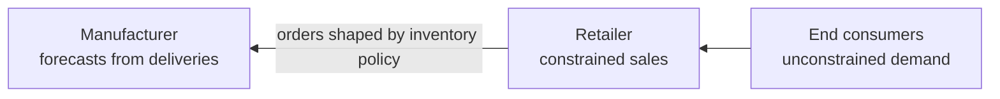
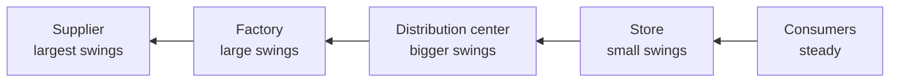
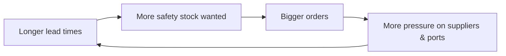

# 4. Collaboration: Data Sharing and Planning Alignment

> **Teaching rewrite** — still the *Data* step of the framework, now looking beyond your own walls. Original wording; numbers are illustrative.

## Introduction

Lesson 3 showed how to recover demand inside your own business. But most companies don’t sell to end consumers directly — they sell to retailers, distributors, or other manufacturers. Every link in between **reshapes** the demand signal before it reaches you, and the further upstream you sit, the more distorted it gets.

This lesson covers:

- How multi-echelon supply chains **distort demand information**
- The **bullwhip effect** and its five causes
- **Internal collaboration**: end-to-end visibility and central planning
- **External collaboration**: leaner logistics, four stages of information sharing, consignment, VMI, and CPFR
- Collaborating with **suppliers**

---

## 4.1 How supply chains distort demand

Take a **two-echelon** chain: manufacturer → retailer → end consumers.

| What each party sees | Distorted by |
|---|---|
| **End-consumer demand** | — (this is the signal the whole chain should forecast) |
| **Retailer sales** | Shortages at the retailer |
| **Retailer orders to manufacturer** | Retailer’s **inventory policy**: pallet/truck multiples, order calendar, stock targets |
| **Manufacturer deliveries** (what most manufacturers forecast from) | Shortages at the manufacturer |

Example: the retailer changes its policy from holding **2 weeks** to **3 weeks** of stock. It places one big order — yet end-consumer demand hasn’t moved at all.

Each extra echelon is like another player in the children’s game *telephone*: the message drifts until it is unrecognisable.

> If you can forecast end-customer demand, everything else is **planning**.

---

## 4.2 The bullwhip effect

The **bullwhip effect**: the further **upstream** a node is, the **more variable** the orders it receives — even when end-consumer demand is steady. A small flick at the handle (consumers) becomes a big swing at the tip (raw-material suppliers).

:::info History
Jay Forrester (MIT) described the dynamics in the 1960s. The name “bullwhip” came in the 1990s from Procter & Gamble, which saw wildly variable factory orders for diapers even though babies consume them at a very steady rate. The **beer game** — a classroom simulation of a four-stage beer supply chain — lets players experience it first-hand.
:::

### Five causes

Lee, Padmanabhan, and Whang (1997) identified the first four; lead-time variation is a useful fifth. They reinforce one another.

| Cause | Mechanism | Remedy |
|---|---|---|
| **1. Order forecasting** | Each node forecasts its **incoming orders**, not end demand — guessing the guess — and its inventory policy **amplifies** changes | Share end-customer demand (POS, sell-out) |
| **2. Order batching** | Upstream nodes order **less often, in bigger lots** (truckload discounts, monthly cycles) → lumpy, delayed signal | Smaller, more frequent orders; pricing that doesn’t reward big lots |
| **3. Price fluctuations & promotions** | Promotions pull demand forward; upstream sees swings without knowing why | Share promo calendars; stable pricing (e.g. **everyday low price**) |
| **4. Shortage gaming** | Fearing shortages, nodes **over-order** to secure supply; others run short — often a self-fulfilling prophecy | Fair-share allocation; central control; transparency |
| **5. Lead-time variation** | Longer quoted lead times → bigger safety stocks → bigger orders → more congestion → even longer lead times | Share capacity information; avoid panic re-planning |

### Worked example: how an inventory policy amplifies a forecast change

A retailer sells a steady **100 units/week**, keeps a target of **4 weeks** of stock (400 units), and orders ~100/week.

It now believes demand has dropped **10%** to **90/week**:

| Item | Calculation | Units |
|---|---|---|
| New stock target | 90 × 4 | 360 |
| Current stock | | 400 |
| Excess stock | 400 − 360 | 40 |
| Next order | forecast − excess = 90 − 40 | **50** |

A **10%** drop in perceived demand becomes a **50%** drop in the order to the manufacturer. If the manufacturer applies the same logic to its own suppliers, the swing grows again.

Reverse it: if the retailer thinks demand rose to 110, target = 440, shortfall = 40, order = 110 + 40 = **150** — a 50% jump.

### Case snapshot: grabbing the hot product

A distributor had one central warehouse and many independent stores. Whenever a store suspected a top seller might run short, it pulled as much as it could from the central warehouse. That store ended up overstocked while neighbours ran out — lower total sales and plenty of resentment between teams.

### The lead-time spiral

If a supplier’s quoted lead time goes from **21 to 28 days**, your safety stock must cover a longer **risk horizon**, so you order more. When thousands of buyers react the same way to congested ports, the extra orders lengthen lead times further. The reverse happens when lead times shrink: everyone cuts orders and is left with overstock.

<GuidedChoiceExplanation preset="dfx-bullwhip-cause" />

---

### Checkpoint: distortion and bullwhip

<MultipleChoice
  id="dfx-ch4-mid1"
  title="Checkpoint — sections 4.1 and 4.2"
  questions={[
    {
      prompt: 'What does the bullwhip effect describe?',
      choices: [
        'Demand falling at the end of a product’s life',
        'Order variability increasing as you move upstream, even when end demand is stable',
        'Price wars between retailers',
        'Transport delays at ports',
      ],
      answer: 1,
      why: 'Small consumer changes become large swings upstream.',
    },
    {
      prompt: 'Steady demand 200/week; target 3 weeks of stock (600). The retailer now forecasts 180/week. Next order?',
      choices: ['180', '160', '120', '140'],
      answer: 2,
      why: 'New target 540; excess 60; order = 180 − 60 = 120 — a 10% demand drop becomes a 40% order drop.',
    },
    {
      prompt: 'Stores over-order a product they fear will run short. Which cause is this?',
      choices: ['Order batching', 'Shortage gaming', 'Price fluctuations', 'Order forecasting'],
      answer: 1,
      why: 'Speculative ordering to secure scarce supply.',
    },
    {
      type: 'order',
      prompt: 'Rank these signals from LEAST to MOST distorted for a manufacturer.',
      items: [
        'End-consumer demand',
        'Retailer sales (constrained by retailer shortages)',
        'Retailer orders (shaped by its inventory policy)',
        'Manufacturer deliveries (also constrained by manufacturer shortages)',
      ],
      why: 'Each step adds a constraint or a policy between the consumer and the manufacturer.',
    },
  ]}
/>

---

## 4.3 Collaborative planning

Instead of working in silos — forecasting incoming orders and ordering without regard for other echelons — share information and align plans.

### Internal collaboration (inside your own supply chain)

1. **End-to-end visibility** — one view of demand and supply across every inventory node: local shortages, sell-outs, point-of-sale data. Visibility improves forecasts; reports alone don’t create alignment.
2. **End-to-end planning and control**
   - **Demand**: coordinate pricing, promotions, and marketing across channels and markets in line with supply — usually in the **S&OP** cycle.
   - **Supply and inventory**: a **central team** sets inventory policies for all nodes and makes sure they are followed. With **multi-echelon inventory optimization (MEIO)**, typical inventory reductions are in the **10–30%** range at the same service level. Even without advanced models, central control stops shortage gaming and enforces **fair-share allocation**.

### External collaboration (with customers)

**Start with leaner logistics.** Set up your prices and costs to encourage **small, frequent orders** from customers (less batching, fewer delayed orders) — and place small, frequent orders with your own suppliers.

**Four stages of information sharing:**

| Stage | What you get | Limitation |
|---|---|---|
| **1. No information** | Customer orders only | Full bullwhip — you forecast distorted orders |
| **2. Buying information** | Sell-out and inventory data bought from third-party providers | Often partial, late, low quality, or at the wrong aggregation level; turning sell-out into sell-in forecasts is hard |
| **3. Sharing information** | Customers send sell-out, inventory, possibly their policies — more, fresher, better data | Plans are still not aligned |
| **4. Collaboration** | Data sharing **plus** aligned supply/inventory plans | Requires trust and integration — but unlocks MEIO and route optimization |

Using sell-out data at stages 2–3 (two approaches):

- **Simulate the customer’s policy**: estimate its usual stock cover from history, forecast its sell-out, and derive its likely orders (sell-in). Many assumptions — not guaranteed to be accurate.
- **Machine learning**: feed sell-out and customer inventory levels as extra features into the demand model.

**Three ways to collaborate:**

| Model | Who owns the stock at the customer | Who manages replenishment | Notes |
|---|---|---|---|
| **Consignment** | Supplier | Supplier | Supplier carries financial risk; useful to place risky/new products |
| **Vendor-managed inventory (VMI)** | Customer | Supplier | Customer carries financial risk; supplier sees POS and stock |
| **CPFR** (Collaborative Planning, Forecasting and Replenishment) | Per contract | Jointly | Joint S&OP covering quantities, stock targets, pricing, promotions, campaigns; demanding to implement — common among large retailers and in food |

### Worked example: VMI in numbers

A supplier manages a customer DC under VMI. It sees: on-hand **1,200**, sell-out forecast **400/week**, agreed target cover **3 weeks**, lead time **1 week**, weekly review.

Target = 3 × 400 = **1,200**, to be held after next week’s consumption. Inventory after one week without a delivery = 1,200 − 400 = 800. Replenishment = 1,200 − 800 = **400** — exactly the sell-out. Because the supplier sees real consumption, no amplification occurs.

### Collaborating with suppliers

Share your expected **supply requirements** (not your raw demand forecast — net them of your stock and policies first). Suppliers can plan better and cut costs, which gives you room to negotiate prices; in return you get earlier warnings of shortages and more reliable lead times.

<GuidedChoiceExplanation preset="dfx-collaboration-stage" />

---

### Checkpoint: collaborative planning

<MultipleChoice
  id="dfx-ch4-mid2"
  title="Checkpoint — section 4.3"
  questions={[
    {
      prompt: 'Under VMI, who owns the inventory at the customer site?',
      choices: ['The supplier', 'The customer', 'A third-party logistics provider', 'The bank'],
      answer: 1,
      why: 'The supplier manages it; the customer owns it. Under consignment, the supplier owns it.',
    },
    {
      prompt: 'What separates stage 4 (collaboration) from stage 3 (sharing information)?',
      choices: [
        'More frequent data',
        'Aligned supply and inventory plans between the partners',
        'Paying for the data',
        'Using machine learning',
      ],
      answer: 1,
      why: 'Planning alignment enables multi-echelon optimization.',
    },
    {
      prompt: 'A company runs a central inventory team for all its warehouses. Which bullwhip cause does this especially curb?',
      choices: ['Shortage gaming', 'Seasonality', 'Product launches', 'Currency moves'],
      answer: 0,
      why: 'Central control enforces fair-share allocation.',
    },
    {
      type: 'order',
      prompt: 'Rank the stages of supplier–customer information sharing.',
      items: ['No information', 'Buying information', 'Sharing information', 'Collaboration'],
      why: 'Each stage adds data quality, then planning alignment.',
    },
  ]}
/>

---

### Rank: dampening the bullwhip

<MultipleChoice
  id="dfx-ch4-rank"
  title="Sequence a bullwhip-reduction program"
  questions={[
    {
      type: 'order',
      prompt: 'Rank the steps a manufacturer could take.',
      items: [
        'Build end-to-end visibility of demand and stock across its own nodes.',
        'Centralise inventory policy setting and fair-share allocation.',
        'Adjust pricing and logistics to encourage small, frequent customer orders.',
        'Obtain sell-out and inventory data from key customers.',
        'Align plans with key customers through VMI or CPFR.',
      ],
      why: 'Get your own house in order, then remove incentives for batching, then share data, then align plans.',
    },
    {
      type: 'order',
      prompt: 'Rank by how much planning control the SUPPLIER has over stock at the customer (LEAST first).',
      items: [
        'Customer simply sends orders',
        'Customer shares sell-out and stock data',
        'Vendor-managed inventory',
        'Consignment (supplier also owns the stock)',
      ],
      why: 'Control (and, for consignment, risk) moves toward the supplier.',
    },
  ]}
/>

---

### Check: collaboration and bullwhip

<MultipleChoice
  id="dfx-ch4"
  title="Collaboration, data sharing, and the bullwhip effect"
  questions={[
    {
      prompt: 'What should the whole supply chain ideally forecast?',
      choices: ['Each node’s incoming orders', 'End-consumer demand', 'Manufacturer deliveries', 'Retailer stock targets'],
      answer: 1,
      why: 'Everything else is planning.',
    },
    {
      prompt: 'Why does order batching distort demand?',
      choices: [
        'It makes orders smaller',
        'Fewer, larger, later orders create a lumpy, delayed signal',
        'It removes promotions',
        'It shortens lead times',
      ],
      answer: 1,
      why: 'Lot sizes and long review periods hide the true demand rhythm.',
    },
    {
      prompt: 'Why does an everyday-low-price strategy reduce bullwhip for suppliers?',
      choices: [
        'Prices are confidential',
        'Fewer promotions mean steadier demand and orders',
        'It increases batching',
        'It shortens lead times',
      ],
      answer: 1,
      why: 'Promotions pull demand forward and create swings.',
    },
    {
      prompt: 'A supplier’s lead time rises from 4 to 6 weeks. Typical buyer reaction?',
      choices: [
        'Order less',
        'Increase safety stock and order more — which can lengthen lead times further',
        'Ignore it',
        'Cancel all orders',
      ],
      answer: 1,
      why: 'This is the lead-time spiral.',
    },
    {
      prompt: 'Steady demand 50/week; target 4 weeks (200). Forecast rises to 60/week. Next order?',
      choices: ['60', '80', '100', '240'],
      answer: 2,
      why: 'New target 240; shortfall 40; order = 60 + 40 = 100 — a 20% demand increase doubles the order.',
    },
    {
      prompt: 'What should you share with your suppliers?',
      choices: [
        'Your raw demand forecast',
        'Expected supply requirements, after netting your stock and inventory policies',
        'Only purchase orders',
        'Nothing',
      ],
      answer: 1,
      why: 'Suppliers need what you will order, not what your customers will buy.',
    },
  ]}
/>

---

## Takeaways

:::tip Remember
- Each echelon distorts the demand signal; forecast **end-customer demand** wherever possible
- **Bullwhip** causes: order forecasting, batching, promotions/price swings, shortage gaming, lead-time variation
- Inventory policies **amplify** small forecast changes into large order changes
- Internally: **visibility**, then **central planning** (MEIO, fair-share allocation)
- Externally: lean logistics → buy data → share data → **collaborate** (consignment, VMI, CPFR)
- Share **supply requirements** with suppliers to get better prices and more reliable lead times
:::

## Further Reading

- [3. Capturing unconstrained demand](./capturing-unconstrained-demand)
- [Multi-echelon inventory optimization](../inventory-optimization/multi-echelon-inventory)
- Next: [5. Forecasting hierarchies](./forecasting-hierarchies)
- Background: N. Vandeput, *Demand Forecasting Best Practices* (Manning) — study outline; H. Lee, V. Padmanabhan, S. Whang, “Information Distortion in a Supply Chain: The Bullwhip Effect” (1997)
