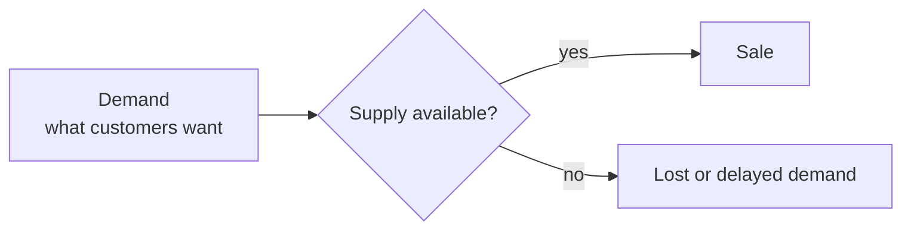
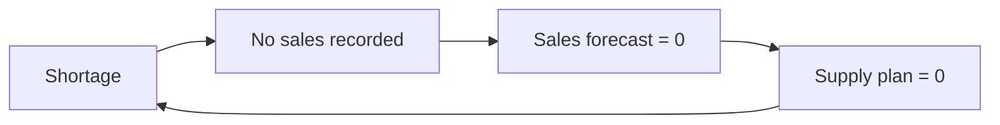
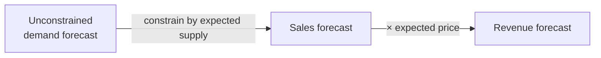

# 2. Demand, Sales, and Plans

> **Teaching rewrite** — the *Objective* step of the framework. Original wording; the ice-cream truck is a running toy example.

## Introduction

Before asking *how* to forecast, ask *what* you are forecasting. Many companies say “demand forecast” but actually forecast **sales**, or quietly copy the **budget**, or let **sales targets** leak into the numbers. Each of these mixes up a prediction with a constraint or a goal — and leads to politics, wishful thinking, and a self-reinforcing cycle of shortages.

This lesson covers:

- Why we forecast demand at all: **a means, not an end**
- **Demand vs sales vs supply**
- The **sales-forecasting vicious circle**
- Turning a demand forecast into a **sales or revenue forecast**
- How a demand forecast differs from a **supply plan**, a **financial budget**, and **sales targets**

---

## 2.1 Why forecast demand?

Good decisions need good information. Buying a house, you would want to know its condition, the expected repairs, and where local prices are heading. In a supply chain, decisions about buying, producing, shipping, and storing all rely — at least partly — on how much customers will want.

> The demand planner’s objective: produce the best possible picture of future demand, **so other teams can make better decisions.** The forecast is a means, not the end.

---

## 2.2 Demand, supply, and sales

Imagine you run an **ice-cream truck**.

| Term | Meaning | Ice-cream example |
|---|---|---|
| **Demand** | What customers want, how much, and when — **unconstrained** by your stock | 15 children want chocolate cones tomorrow |
| **Demand forecast** | Your prediction of future demand | “I expect 15 chocolate cones tomorrow” |
| **Supply** | What you have available | 10 chocolate cones in the freezer |
| **Sales** | Where demand meets supply — **constrained** | 10 cones sold; 5 children disappointed |

Sales equal demand only when there is **enough supply**.

### The sales-forecasting vicious circle

Suppose chocolate runs out and you forecast **sales**:

1. Out of stock → zero chocolate sales.
2. Forecast based on sales → **zero** chocolate tomorrow.
3. Purchasing replenishes based on the forecast → orders **zero**.
4. No stock arrives → zero sales again… and the cycle repeats.

The worst part: every KPI looks perfect. Forecast 0, sold 0 → **100% accuracy**. Stock target 0, stock 0 → **100% inventory adherence**. Everyone hits their metric while the business loses every chocolate sale.

Forecasting **demand** breaks the circle: the forecast stays at ~15, purchasing reorders, children get their cones.

:::caution Watch the KPIs
A metric that is perfectly satisfied by a broken process is a warning sign. Accuracy measured against constrained sales can reward forecasting shortages.
:::

<GuidedChoiceExplanation preset="dfx-vicious-circle" />

### From demand forecast to sales and revenue forecasts

Finance still needs expected **sales** and **revenue**. Derive them from the demand forecast — never the other way round:

### Worked example: constraining the forecast

| Flavour | Demand forecast (next week) | Expected available supply | Sales forecast | Price | Revenue forecast |
|---|---|---|---|---|---|
| Chocolate | 10 | 0 | **0** | 3.00 | **0.00** |
| Vanilla | 20 | 25 | **20** | 2.50 | **50.00** |
| Strawberry | 12 | 8 | **8** | 2.80 | **22.40** |
| **Total** | 42 | | **28** | | **72.40** |

- Purchasing receives the **demand** forecast (42; chocolate 10) so it can replenish correctly.
- Finance receives the **sales/revenue** forecast (28 units; 72.40).

Sales forecast for each item = min(demand forecast, available supply).

---

### Checkpoint: demand vs sales

<MultipleChoice
  id="dfx-ch2-mid1"
  title="Checkpoint — sections 2.1 and 2.2"
  questions={[
    {
      prompt: 'Which statement defines demand correctly?',
      choices: [
        'What you shipped and invoiced',
        'What customers want, how much, and when — regardless of your stock',
        'What the budget says you will sell',
        'Your sales target',
      ],
      answer: 1,
      why: 'Demand is unconstrained; sales are constrained by supply.',
    },
    {
      prompt: 'An item has been out of stock for a month and the forecast is built on sales. What happens?',
      choices: [
        'The forecast rises to compensate',
        'The forecast falls toward zero, purchasing orders nothing, and the shortage persists',
        'Nothing — sales and demand are the same',
        'Customers wait patiently and demand is recorded',
      ],
      answer: 1,
      why: 'This is the sales-forecasting vicious circle.',
    },
    {
      prompt: 'Demand forecast 30; available supply 18; price 4. Revenue forecast?',
      choices: ['120', '72', '48', '30'],
      answer: 1,
      why: 'Sales forecast = min(30, 18) = 18; revenue = 18 × 4 = 72.',
    },
    {
      type: 'order',
      prompt: 'Rank the flow from customer wish to revenue figure.',
      items: [
        'Forecast unconstrained demand',
        'Share it with supply to plan replenishment',
        'Constrain it by expected supply to get a sales forecast',
        'Multiply by expected price to get a revenue forecast',
      ],
      why: 'Demand drives supply; constraints and prices turn it into financial figures.',
    },
  ]}
/>

---

## 2.3 Forecast vs plan vs budget vs target

| Concept | What it is | Owner | Nature |
|---|---|---|---|
| **Demand forecast** | Best unbiased estimate of what customers will want | Demand planning | **Prediction** |
| **Supply plan** | How much to buy, produce, and ship | Supply planning | **Decision** (uses forecast + constraints + stock targets) |
| **Financial budget** | Expected revenues and costs for the year | Finance | **Commitment/plan**, often political |
| **Sales target** | Volume salespeople must reach for a bonus | Sales/HR | **Incentive** |

### Supply plan

The supply plan *uses* the forecast but is not the forecast. Example: forecast **10**, decide to make **15** (safety margin), sell **8**. Three different numbers, three different meanings — forecast → decision → what happened.

### Financial budget

Revenue in the budget comes from expected **sales**, which come from expected **demand** constrained by supply. Using the budget **as** the demand forecast reverses the logic and imports wishful thinking — a major source of judgmental bias.

### Sales targets

Targets motivate salespeople. But if targets are derived from the forecast, salespeople have a reason to **talk the forecast down** (easier targets) while asking for **plenty of supply** (to sell more).

### Worked example: incentives at work

| | Honest view | After sales lobbying |
|---|---|---|
| Demand forecast | 10 | **7** |
| Supply plan | 15 | 15 (sales asks to keep it) |
| Sales target (forecast + 20%) | 12 | **≈ 8.4** |

Actual sales come in at 10: the salesperson beats the lowered target by about 19% and earns a bonus, while the business planned against a forecast that was 30% too low.

<GuidedChoiceExplanation preset="dfx-forecast-plan-target" />

---

### Checkpoint: forecasts, plans, budgets, targets

<MultipleChoice
  id="dfx-ch2-mid2"
  title="Checkpoint — section 2.3"
  questions={[
    {
      prompt: 'Forecast 100, production 120, actual sales 95. Which number is the supply plan?',
      choices: ['100', '120', '95', '115'],
      answer: 1,
      why: 'The supply plan is the decision on how much to produce.',
    },
    {
      prompt: 'Why is copying the budget into the demand forecast a bad practice?',
      choices: [
        'Budgets are always too low',
        'The budget is a goal/commitment; using it as a prediction imports wishful thinking and bias',
        'Budgets are confidential',
        'Budgets are in currency, not units',
      ],
      answer: 1,
      why: 'Forecasts predict; budgets aim.',
    },
    {
      prompt: 'Why might a salesperson push for a lower demand forecast?',
      choices: [
        'To reduce inventory',
        'Because targets based on a lower forecast are easier to beat',
        'To improve accuracy',
        'Because supply is constrained',
      ],
      answer: 1,
      why: 'Incentives create functional bias.',
    },
    {
      type: 'order',
      prompt: 'Rank these by how much they should be driven by an unbiased prediction (MOST first).',
      items: ['Demand forecast', 'Supply plan', 'Financial budget', 'Sales target'],
      why: 'The forecast is pure prediction; the plan adds decisions; the budget adds commitments; targets are incentives.',
    },
  ]}
/>

---

### Rank: cleaning up a forecasting process

<MultipleChoice
  id="dfx-ch2-rank"
  title="Separate prediction from decisions and goals"
  questions={[
    {
      type: 'order',
      prompt: 'A company forecasts invoiced sales and copies them into the budget. Rank the fixes.',
      items: [
        'Agree that the forecast must predict unconstrained demand.',
        'Start recording demand (orders, requested dates) instead of only shipments.',
        'Derive sales and revenue forecasts by constraining demand with supply and prices.',
        'Build the budget and targets from those figures — never the reverse.',
        'Track bias to detect pressure from targets.',
      ],
      why: 'Fix the definition, then the data, then the derived figures, then governance.',
    },
    {
      type: 'order',
      prompt: 'Rank the ice-cream numbers in the natural order they are produced.',
      items: [
        'Demand forecast: 10',
        'Supply plan: 15',
        'Sales target: 12',
        'Actual sales: 8',
      ],
      why: 'Predict, decide supply, set incentives, then observe the outcome.',
    },
  ]}
/>

---

### Check: demand, sales, and plans

<MultipleChoice
  id="dfx-ch2"
  title="Demand, sales, and plans"
  questions={[
    {
      prompt: 'Sales equal demand when…',
      choices: ['Prices are low', 'There is enough supply to meet every request', 'The forecast is accurate', 'The budget is met'],
      answer: 1,
      why: 'Without shortages, every request becomes a sale.',
    },
    {
      prompt: 'A product stuck in the sales-forecasting circle shows 100% forecast accuracy. This means…',
      choices: [
        'The process is excellent',
        'The metric is rewarding a broken process — forecast 0, sold 0',
        'Demand truly fell to zero',
        'Inventory is optimal',
      ],
      answer: 1,
      why: 'Accuracy against constrained sales can hide lost demand.',
    },
    {
      prompt: 'Which forecast should purchasing receive?',
      choices: ['Revenue forecast', 'Constrained sales forecast', 'Unconstrained demand forecast', 'Sales target'],
      answer: 2,
      why: 'Purchasing needs to know what customers want in order to replenish.',
    },
    {
      prompt: 'Demand forecasts: A 50, B 30. Supply: A 40, B 35. Prices: A 2, B 5. Revenue forecast?',
      choices: ['250', '230', '255', '210'],
      answer: 1,
      why: 'Sales A = 40, B = 30; revenue = 40×2 + 30×5 = 80 + 150 = 230.',
    },
    {
      prompt: 'A demand forecast is…',
      choices: ['A plan', 'An objective', 'A cash-flow commitment', 'A prediction that feeds plans, budgets, and targets'],
      answer: 3,
      why: 'It is information, not a decision or a goal.',
    },
  ]}
/>

---

## Takeaways

:::tip Remember
- Forecast **demand** (what customers want), not **sales** (what supply allowed)
- Sales-based forecasts create a **vicious circle** of shortages — with perfect-looking KPIs
- Sales forecast = demand forecast **constrained by supply**; revenue = × price
- **Forecast ≠ supply plan ≠ budget ≠ sales target**: prediction, decision, commitment, incentive
- Keep budgets and targets **downstream** of the forecast to avoid wishful thinking and lobbying
:::

## Further Reading

- [1. Demand planning excellence](./demand-planning-excellence)
- [Safety stocks](../inventory-optimization/safety-stocks) — how forecast error drives buffers
- Next: [3. Capturing unconstrained demand](./capturing-unconstrained-demand)
- Background: N. Vandeput, *Demand Forecasting Best Practices* (Manning) — used as a study outline
