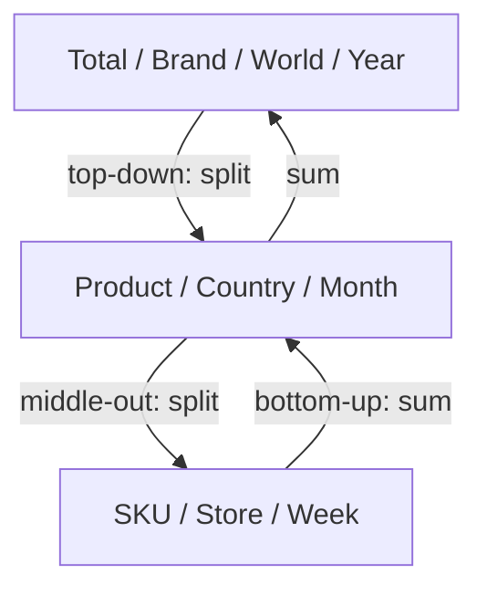
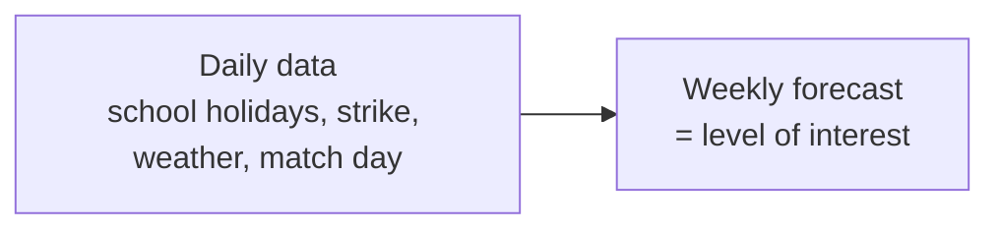

# 5. Forecasting Hierarchies

> **Teaching rewrite** — the *Objective* step: at what level of detail should you forecast? Original wording; numbers are illustrative.

## Introduction

Many supply chains — especially manufacturers — forecast **18 months ahead, per country, per month**. Is that a deliberate best practice or just a default nobody questioned? The level of detail of a forecast should match the decisions it supports. When it doesn’t, planners spread country forecasts across warehouses with flat splits and stock ends up in the wrong place.

This lesson covers:

- The three forecasting **dimensions**: materiality, geography, temporality (plus horizon)
- Moving between levels: **bottom-up**, **top-down**, **middle-out**
- Which level to **focus on** (the decision level)
- Which level to **build the forecast from** (not necessarily the same)

---

## 5.1 Three dimensions

| Dimension | Examples of levels | Units of measure |
|---|---|---|
| **Materiality** | SKU → product → segment → brand → total | Units, value, weight, raw material needed |
| **Geography** | Store/zip code → warehouse → region → country → world; also channel, customer segment, B2B vs B2C | |
| **Temporality** | Day → week → month → quarter → year | |

The fourth question — **how far ahead** (horizon) — is the subject of lesson 6.

A coffee shop could forecast at very different levels:

- **27 lattes** tomorrow (product × day)
- **5 gallons of milk** next week (raw material × week)
- **$4,800 of drinks** next month (value × month)

---

## 5.2 Zooming in and out

| Technique | How it works | Example |
|---|---|---|
| **Bottom-up** | Forecast the detailed level; **sum** upward | Sum store forecasts to get a country forecast |
| **Top-down** | Forecast the aggregate; **split** downward with rules | Split a monthly forecast into days evenly (*flat split*), or a national forecast into stores by historical revenue share |
| **Middle-out** | Forecast an intermediate level; sum up **and** split down | Forecast per country; sum to regions; split to stores |

All three keep forecasts **reconciled**: the levels add up.

### Worked example: top-down split

A country forecast for next month is **9,000** units. Three warehouses serve the country:

| Warehouse | Historical demand share (from geographic footprint) | Flat split | Share-based split |
|---|---|---|---|
| North | 50% | 3,000 | **4,500** |
| Centre | 30% | 3,000 | **2,700** |
| South | 20% | 3,000 | **1,800** |

A flat split sends 1,500 too few units North and 1,200 too many South — a guaranteed misallocation.

---

## 5.3 Which level should you focus on?

With unlimited data, time, and computing power you could forecast everything at the finest grain and add it up. In practice:

- **Review time and computing power are limited.**
- There is an **accuracy glass ceiling**: at very fine grain (product × customer × store × hour) noise swamps signal. If an item sold once last year — in December — was that seasonality or luck? Aggregated data reveals patterns that granular data hides.

So pick a **focus level** — and pick it from the **decisions**:

> Your supply chain makes decisions at specific levels. Forecast demand at those levels.

| Decision | Focus level |
|---|---|
| What to ship from the plant to each regional warehouse | **Product × warehouse** — based on each warehouse’s **geographic footprint**, not its historical shipments |
| Production set-up by packaging format | **Packaging** level, discussing what drives each format (events, promotions) |
| Single warehouse supply | Possibly **one global forecast** is enough; per-channel detail may not repay the effort |
| Items with very different growth rates or components | Forecast them **separately** rather than splitting a total |
| Make-to-order business | **Sub-components**, mid/long term |
| Make-to-stock business | **Granular**, short term |

:::caution Pro note — forecasting per warehouse
Don’t forecast a warehouse from its **shipments**. If warehouse A is out of stock, warehouse B (the next closest) serves A’s customers — A’s shipments understate its demand and B’s overstate it. Track demand by the **geography the warehouse should serve** (e.g. zip codes). This also survives warehouse openings and closures.
:::

:::tip Red flag
Hearing “we use a flat split to turn the monthly forecast into weeks” or “we split the country forecast across warehouses evenly” is a sign the forecast level doesn’t match the decision level.
:::

<GuidedChoiceExplanation preset="dfx-aggregation-level" />

---

### Checkpoint: dimensions and focus

<MultipleChoice
  id="dfx-ch5-mid1"
  title="Checkpoint — sections 5.1 to 5.3"
  questions={[
    {
      prompt: 'Which are the three forecasting dimensions?',
      choices: [
        'Price, volume, mix',
        'Materiality, geography, temporality',
        'Accuracy, bias, value added',
        'Plan, do, check',
      ],
      answer: 1,
      why: 'Horizon is a separate fourth question.',
    },
    {
      prompt: 'A plant ships to 4 regional warehouses but the company forecasts per country. What is the problem?',
      choices: [
        'Nothing — country is enough',
        'The forecast level does not match the allocation decision, so stock is misallocated across warehouses',
        'The horizon is too short',
        'Countries cannot be forecast',
      ],
      answer: 1,
      why: 'Forecast at the level decisions are made.',
    },
    {
      prompt: 'Country forecast 12,000; warehouse shares 40% / 35% / 25%. Warehouse B (35%) gets…',
      choices: ['4,000', '4,200', '3,000', '4,800'],
      answer: 1,
      why: '12,000 × 35% = 4,200.',
    },
    {
      type: 'order',
      prompt: 'Rank the materiality levels from MOST granular to MOST aggregated.',
      items: ['SKU', 'Product', 'Segment', 'Brand', 'Total company'],
      why: 'Each level groups the one before it.',
    },
  ]}
/>

---

## 5.4 Which level should you build the forecast from?

The level you **care about** is not necessarily the level at which you should **compute** the forecast. A model run on weekly-by-channel data gives a slightly different answer than one run on monthly-by-market data — different history, different information.

**Ice-cream truck**: you restock every weekend for the coming week, so the **weekly** forecast is what matters. But building it from a **daily** forecast lets you use daily information: schools closed Monday, a strike Tuesday, rain on Wednesday (normally the big after-school day), a match on Friday. Summing the daily forecasts can give a more accurate weekly number.

### Worked example: daily build-up

| Day | Normal daily demand | Known event | Adjusted forecast |
|---|---|---|---|
| Mon | 40 | School closed (−50%) | 20 |
| Tue | 40 | Strike (−25%) | 30 |
| Wed | 60 | Rain (−50%) | 30 |
| Thu | 40 | — | 40 |
| Fri | 40 | Match day (+50%) | 60 |
| **Week** | **220** | | **180** |

A weekly model that ignores the daily events predicts ~220; the daily build-up predicts **180**.

### Review frequency

Updating forecasts more often uses new data sooner and can improve accuracy — but too often causes **over-reaction** (“nervous” plans) and eats planner time.

### Test, don’t assume

Granular data in a granular model is **not guaranteed** to be better. Try several levels and models, **measure** accuracy at the level of interest, keep the winner — and re-test when data or the business changes.

<GuidedChoiceExplanation preset="dfx-granularity-source" />

---

### Checkpoint: building the forecast

<MultipleChoice
  id="dfx-ch5-mid2"
  title="Checkpoint — section 5.4"
  questions={[
    {
      prompt: 'You need a weekly forecast. Should the model always run on weekly data?',
      choices: [
        'Yes — always forecast at the level of interest',
        'Not necessarily — another level (e.g. daily) may carry useful information; test both',
        'No — always use monthly data',
        'No — always use yearly data',
      ],
      answer: 1,
      why: 'Level of interest ≠ level used to create the forecast.',
    },
    {
      prompt: 'Normal daily demand is 50 for 5 days. Two days have −40% events; one day +20%. Weekly forecast?',
      choices: ['250', '220', '230', '270'],
      answer: 1,
      why: 'Two days at 30 = 60; one day at 60 = 60; two normal days at 50 = 100; total 220.',
    },
    {
      prompt: 'What is the risk of updating forecasts too often?',
      choices: [
        'Forecasts become stale',
        'Over-reaction to noise and wasted planner time',
        'Less data is used',
        'Hierarchies stop reconciling',
      ],
      answer: 1,
      why: 'Balance freshness against stability and effort.',
    },
    {
      type: 'order',
      prompt: 'Rank the steps to choose a forecasting granularity.',
      items: [
        'Identify the decisions and the level at which they are made.',
        'Set that as the level of interest for accuracy.',
        'Build candidate forecasts from different data levels and models.',
        'Measure accuracy at the level of interest and keep the best approach.',
        'Re-test when data or the business changes.',
      ],
      why: 'Decision first; then experiment and measure.',
    },
  ]}
/>

---

### Rank: hierarchies in practice

<MultipleChoice
  id="dfx-ch5-rank"
  title="Hierarchy decisions"
  questions={[
    {
      type: 'order',
      prompt: 'Rank these from MOST to LEAST noisy (lowest signal-to-noise first).',
      items: [
        'SKU × store × day',
        'SKU × warehouse × week',
        'Product family × country × month',
        'Brand × world × year',
      ],
      why: 'Aggregation cancels random noise.',
    },
    {
      type: 'order',
      prompt: 'Rank the steps to fix a company that forecasts per country but stocks four warehouses.',
      items: [
        'Map each customer location (e.g. zip code) to the warehouse that should serve it.',
        'Rebuild demand history per warehouse footprint from orders, not shipments.',
        'Forecast per warehouse (or split with footprint-based shares).',
        'Measure accuracy per warehouse and adjust allocation decisions.',
      ],
      why: 'Define the footprint, rebuild the history, forecast at the decision level, measure.',
    },
  ]}
/>

---

### Check: forecasting hierarchies

<MultipleChoice
  id="dfx-ch5"
  title="Forecasting hierarchies"
  questions={[
    {
      prompt: 'Summing store forecasts to get a national forecast is…',
      choices: ['Top-down', 'Bottom-up', 'Middle-out', 'Censoring'],
      answer: 1,
      why: 'Detail summed upward.',
    },
    {
      prompt: 'Forecasting per country, summing to regions, and splitting to stores is…',
      choices: ['Top-down', 'Bottom-up', 'Middle-out', 'Flat split'],
      answer: 2,
      why: 'Start in the middle; go both ways.',
    },
    {
      prompt: 'Why not forecast every SKU × store × hour and sum up?',
      choices: [
        'It is illegal',
        'Limited time and computing power, and very granular forecasts hit an accuracy ceiling from noise',
        'Sums never reconcile',
        'Hours are not a valid time bucket',
      ],
      answer: 1,
      why: 'Noise dominates at the finest grain.',
    },
    {
      prompt: 'Warehouse A was out of stock and Warehouse B served its customers. Forecasting each from shipments will…',
      choices: [
        'Be accurate',
        'Understate A’s demand and overstate B’s',
        'Overstate both',
        'Understate both',
      ],
      answer: 1,
      why: 'Forecast by geographic footprint instead.',
    },
    {
      prompt: 'A forecast of 6,000 is split flat across 3 warehouses whose true shares are 60/25/15%. How far off is the largest warehouse?',
      choices: ['600 too low', '1,600 too low', '2,000 too low', '1,000 too high'],
      answer: 1,
      why: 'Flat = 2,000; true = 3,600; short by 1,600.',
    },
  ]}
/>

---

## Takeaways

:::tip Remember
- Forecasts live in three dimensions — **materiality, geography, temporality** — plus a horizon
- Move between levels with **bottom-up, top-down, middle-out**; keep them reconciled
- **Focus** on the level where decisions are made — not on the habitual “country × month”
- Forecast warehouses by **geographic footprint**, not shipments
- The level you **build** the forecast from can differ from the level you **care** about — test and measure
:::

## Further Reading

- [4. Collaboration and the bullwhip effect](./collaboration-and-bullwhip)
- [Distribution, MEIO and simulation](../inventory-optimization/distribution-meio-and-simulation)
- Next: [6. How long should the horizon be?](./forecasting-horizon)
- Background: N. Vandeput, *Demand Forecasting Best Practices* (Manning) — used as a study outline
