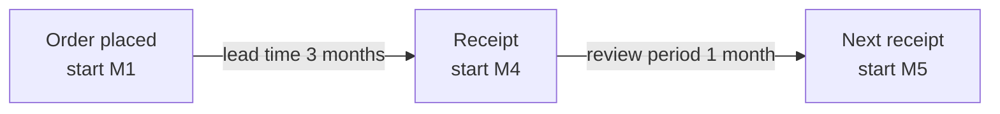

# 6. How Long Should the Forecasting Horizon Be?

> **Teaching rewrite** — the *Objective* step: which future periods deserve the team’s attention? Original wording; numbers are illustrative.

## Introduction

Planners can’t polish a three-year forecast for every product. Most manufacturers populate **18 months** automatically, but management usually tracks accuracy on one or two **lags** — e.g. “we focus on M+2 because production is planned two months ahead”, or “we track M+3 and M+12”. Those choices are often made by habit, not by analysis of the supply decisions they serve.

This lesson covers:

- **Lags** and the **risk horizon** (lead time + review period)
- Why the right focus is a **range** (M1…M4), not a single lag
- A worked **order-sizing** example that links forecasts to orders
- Why **freezing** forecasts is a bad practice
- Looking **beyond** the risk horizon: safety-stock targets and supplier collaboration
- How **lost sales vs backorders** change what matters

---

## 6.1 Lags

A **lag** is how many periods ahead a forecast is. By convention **lag 0** is the current period. For a monthly forecast made in January: lag 0 = January, lag 1 = February, lag 2 = March…

### The puzzle

You order **monthly**, on the first day of each month. Your supplier’s lead time is **3 months**: an order placed on day 1 of M1 arrives at the start of M4 (and can’t serve demand from earlier months). Your next order goes out at the start of M2.

> Which lag(s) should demand planners focus on to support this ordering decision? M+3? M+4? A range?

Most planners answer M+3 or M+4. The better answer is **M1 to M4 (cumulative) — and a little beyond**.

---

## 6.2 Theory: the risk horizon

Almost all real inventory policies are **periodic**: you order on a calendar (daily, weekly, monthly), not at any instant. For a periodic policy the stock must protect you over the **risk horizon**:

> **Risk horizon = lead time + review period**

Here: 3 months lead time + 1 month review period = **4 months**. To size today’s order you need the forecast for **every month** M1–M4.

:::info Why practitioners get this wrong
Textbooks spend more time on **continuous-review** policies (where the risk horizon is just the lead time), and some planning software forgets the review period. In periodic policies, forgetting it under-protects you.
:::

---

## 6.3 Reconciling the forecast with the order

**Set-up**: start-of-M1 stock **150**. Orders already in transit: **+40** arriving start of M2, **+30** arriving start of M3. Demand forecast: **M1 50, M2 75, M3 25, M4 50**. Policy: finish each month with **100** units (the safety stock) before the next receipt.

| Month | Opening stock | Receipt (start of month) | Forecast | Closing stock |
|---|---|---|---|---|
| M1 | 150 | — | 50 | **100** |
| M2 | 100 | +40 → 140 | 75 | **65** |
| M3 | 65 | +30 → 95 | 25 | **70** |
| M4 | 70 | **+X** (today’s order) | 50 | 70 + X − 50 |

Today’s order can only affect M4. To close M4 at 100: 70 + X − 50 = 100 → **X = 80**.

Now change **any** forecast in M1–M4 and X changes one-for-one. If M2 rises from 75 to **100**, M3 closes at 45 instead of 70, so X must rise to **105** (+25).

Equivalently: **order = target + total forecast over the risk horizon − stock − pipeline** = 100 + (50 + 75 + 25 + 50) − 150 − (40 + 30) = 100 + 200 − 220 = **80**.

So every month in the risk horizon matters equally.

:::caution Don’t freeze the forecast
Many companies freeze the near-term forecast (e.g. M1) because the plan for M1 can no longer change. But the **plan** (what you will do) and the **forecast** (what you expect customers to want) are different things. Updating M1 still changes the right order quantity for M4. Freeze plans if you must — keep the forecast current.
:::

<GuidedChoiceExplanation preset="dfx-risk-horizon" />

---

### Checkpoint: lags and risk horizon

<MultipleChoice
  id="dfx-ch6-mid1"
  title="Checkpoint — sections 6.1 to 6.3"
  questions={[
    {
      prompt: 'Weekly orders, supplier lead time 5 weeks. Risk horizon?',
      choices: ['5 weeks', '6 weeks', '1 week', '4 weeks'],
      answer: 1,
      why: 'Lead time 5 + review period 1 = 6 weeks.',
    },
    {
      prompt: 'For the monthly example (3-month lead time, monthly orders), which forecasts drive today’s order?',
      choices: ['Only M+3', 'Only M+4', 'M1 through M4', 'Only M1'],
      answer: 2,
      why: 'All months in the risk horizon change the order quantity one-for-one.',
    },
    {
      prompt: 'Stock 200, pipeline 60, forecast over the risk horizon 300, closing target 120. Order?',
      choices: ['160', '120', '140', '220'],
      answer: 0,
      why: '120 + 300 − 200 − 60 = 160.',
    },
    {
      type: 'order',
      prompt: 'Rank the steps to size a periodic order.',
      items: [
        'Determine the risk horizon (lead time + review period).',
        'Sum the demand forecast over that horizon.',
        'Add the closing safety-stock target.',
        'Subtract current stock and orders already in transit.',
      ],
      why: 'Need over the horizon, plus buffer, minus what you already have or will receive.',
    },
  ]}
/>

---

## 6.4 Looking further ahead

### Safety stock depends on what comes next

How much stock is sensible at the end of M4 depends on the outlook for **M5**:

| Scenario | M5 expected demand | Sensible end-of-M4 stock |
|---|---|---|
| 1 | **0** (product ending) | Little or none — leftovers risk becoming obsolete |
| 2 | **1,000** | A larger buffer is cheap insurance |

Many companies set safety stock as **weeks of cover** (“3 weeks for our top items”), which makes the end-of-M4 target a function of the **M5** forecast. So the useful horizon is **risk horizon + a few periods**.

### Supplier collaboration

A longer view helps suppliers plan capacity, cut lead times and costs, and raise their service level. Share expected **supply requirements** (net of your stock and policies) — not raw demand forecasts.

---

## 6.5 Lost sales vs backorders

| Situation | What happens to unmet demand | What matters in the forecast |
|---|---|---|
| **Lost sales** (common in B2C, FMCG) | Disappears — customer buys elsewhere | **Each period** individually, because shortages in a given month lose demand |
| **Backorders** (customers wait) | Carried forward until stock arrives | The **cumulative** total over the risk horizon; carry unfulfilled forecast into later periods |
| **Hybrid** (typical B2B) | Some wait, some leave | Both: each period **and** the total |

### Worked example: a demand surprise in M1

Same set-up, but M1 demand jumps from 50 to **200**.

**Lost sales:**

| Month | Opening | Receipt | Demand | Closing | Lost |
|---|---|---|---|---|---|
| M1 | 150 | — | 200 | 0 | **50** |
| M2 | 0 | +40 | 75 | 0 | **35** |
| M3 | 0 | +30 | 25 | 5 | — |
| M4 | 5 | +X | 50 | 100 | — |

X = 100 + 50 − 5 = **145** — only **+65** versus the original 80, because 85 units of demand were lost rather than carried forward.

**Backorders:** all 150 extra units are still owed, so the order rises by the full **+150** to **230** (100 + 350 total demand − 150 stock − 70 pipeline).

:::tip Pro tip
Even during a shortage, keep forecasting **demand**, not the sales you expect to manage. Track backlogs explicitly so carried-over orders aren’t mistaken for new demand.
:::

<GuidedChoiceExplanation preset="dfx-lost-vs-backorder" />

---

### Checkpoint: beyond the horizon

<MultipleChoice
  id="dfx-ch6-mid2"
  title="Checkpoint — sections 6.4 and 6.5"
  questions={[
    {
      prompt: 'A product is discontinued after M4. What should happen to the end-of-M4 stock target?',
      choices: ['Increase it', 'Reduce it toward zero', 'Keep it at the usual cover', 'Double the order'],
      answer: 1,
      why: 'Leftovers after M4 would become obsolete.',
    },
    {
      prompt: 'Customers wait for out-of-stock items. Which forecast view matters most?',
      choices: [
        'Each period individually',
        'The cumulative total over the risk horizon',
        'Only lag 0',
        'Only the last period',
      ],
      answer: 1,
      why: 'Backorders shift timing but not total demand.',
    },
    {
      prompt: 'Lost sales. Stock 100, nothing in transit. Forecast: M1 160, M2 60. Today’s order arrives at the start of M2 and should leave 50 units at the end of M2. Order?',
      choices: ['110', '170', '60', '50'],
      answer: 0,
      why: 'M1: 100 stock vs 160 demand → closes 0, 60 lost. M2: 0 + X − 60 = 50 → X = 110. With backorders it would be 170.',
    },
    {
      type: 'order',
      prompt: 'Rank the forecast horizon a team should actively review (SHORTEST to LONGEST).',
      items: [
        'Lead time only',
        'Risk horizon (lead time + review period)',
        'Risk horizon + a few periods for safety-stock targets',
        'Long view shared with suppliers for capacity planning',
      ],
      why: 'Each layer adds a decision that depends on later periods.',
    },
  ]}
/>

---

### Rank: horizon practice

<MultipleChoice
  id="dfx-ch6-rank"
  title="Choose and use the horizon"
  questions={[
    {
      type: 'order',
      prompt: 'Rank the steps to set a team’s focus horizon.',
      items: [
        'List the supply decisions the forecast supports (orders, production, capacity).',
        'For each, find the lead time and review period.',
        'Set the focus horizon to the risk horizon plus a few periods.',
        'Track accuracy over that whole range, not a single lag.',
        'Store every forecast version so multi-lag accuracy can be measured.',
      ],
      why: 'Decision-driven horizon, then metrics and data management that match it.',
    },
    {
      type: 'order',
      prompt: 'Rank by how much a +150 surprise in M1 increases today’s order (SMALLEST first).',
      items: ['Lost sales', 'Hybrid (some customers wait)', 'Backorders'],
      why: 'Lost demand needs no replacement; backordered demand must all be supplied.',
    },
  ]}
/>

---

### Check: forecasting horizon

<MultipleChoice
  id="dfx-ch6"
  title="How long should the forecasting horizon be?"
  questions={[
    {
      prompt: 'In a monthly forecast made in March, lag 2 is…',
      choices: ['January', 'March', 'May', 'June'],
      answer: 2,
      why: 'Lag 0 = March, lag 1 = April, lag 2 = May.',
    },
    {
      prompt: 'Why is tracking accuracy on a single lag (e.g. M+3) a weak practice?',
      choices: [
        'It is too expensive',
        'Order quantities depend on every period in the risk horizon, so all of them need attention',
        'Lags cannot be measured',
        'Single lags are always accurate',
      ],
      answer: 1,
      why: 'Focus on the range, not one point.',
    },
    {
      prompt: 'Forecast M1–M4: 50, 75, 25, 50; stock 150; pipeline 70; closing target 100. Planner raises M3 from 25 to 45. New order?',
      choices: ['80', '100', '60', '120'],
      answer: 1,
      why: 'Original 80; +20 demand in the risk horizon → 100.',
    },
    {
      prompt: '“M1 is frozen, so we stopped updating its forecast.” What is wrong?',
      choices: [
        'Nothing',
        'The plan may be frozen, but M1 demand still affects the right order for later months',
        'M1 should be deleted',
        'Freezing improves accuracy',
      ],
      answer: 1,
      why: 'Don’t confuse plans with information.',
    },
    {
      prompt: 'Which statement about lost sales is true?',
      choices: [
        'Unmet demand is carried to the next period',
        'Each period’s forecast matters, because shortages in a period lose that demand',
        'Only the cumulative total matters',
        'Lost sales never occur in retail',
      ],
      answer: 1,
      why: 'Lost demand never returns.',
    },
  ]}
/>

---

## Takeaways

:::tip Remember
- **Risk horizon = lead time + review period**; size orders from the forecast over the **whole** range
- Every period in the risk horizon changes the order **one-for-one** — don’t focus on a single lag
- **Don’t freeze forecasts**; freeze plans if needed
- Look a few periods **beyond** the risk horizon for safety-stock targets and supplier collaboration
- **Lost sales** → each period matters; **backorders** → the cumulative total matters; **hybrid** → both
- Multi-lag accuracy tracking needs stored forecast versions — use proper tools, not spreadsheets
:::

## Further Reading

- [5. Forecasting hierarchies](./forecasting-hierarchies)
- [When should I order?](../inventory-optimization/when-should-i-order) — review periods and lead times
- [Safety stocks](../inventory-optimization/safety-stocks)
- Next: [7. One number forecast or one number mindset?](./reconciling-forecasts)
- Background: N. Vandeput, *Demand Forecasting Best Practices* (Manning) — used as a study outline
