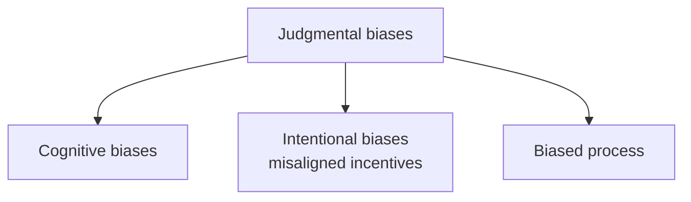

# 16. Judgmental Forecasting

> **Teaching rewrite** — the *Review process* step: how people should (and shouldn’t) adjust the baseline. Original wording; illustrative numbers.

## Introduction

After the model produces a baseline, planners, sales, and a consensus meeting may adjust it. These human adjustments are **judgmental forecasts**. Done well, they add information no model has; done badly, they inject bias, politics, and wasted hours.

**FVA** (lesson 12) is the foundation — it shows **whether** people add value. This lesson explains **when** to adjust, **why** people go wrong, and **how** to run group forecasts that work.

This lesson covers:

- **When** judgmental adjustments make sense
- Three sources of bias: **cognitive**, **intentional** (misaligned incentives), and **biased processes**
- The **wisdom of the crowds** and its three pillars
- **Assumption-based** discussions: vote first, debate after

---

## 16.1 When to adjust the baseline

> **Rule**: adjust only when you have **information the model doesn’t**.

| Statement | Adjust? | Why |
|---|---|---|
| “Our main customer expects lower sales than usual.” | ✅ | The model doesn’t talk to customers |
| “I’ll forecast this new product manually.” | ✅ | Models usually can’t forecast launches |
| “We raise prices next month.” | ✅ if the model ignores price; ❌ if price is already a feature | Don’t double-count |
| “I think the trend should be higher.” | ❌ (without new info) | Models detect trends; if one is missed, fix the model |
| “Seasonality looks wrong.” | ❌ per item | Fix the model or engine, not every item by hand |
| “A big market change is coming.” | ✅ | Unknown to the model |
| “Last month had a special event; I’ll edit history.” | ❌ edit; ✅ **tag** the event | Let the model handle tagged events |

Judgment is also right when history is thin or the world is changing fast (new competitors, regulation, pandemic, war). These aren’t absolute rules — but they focus effort where people are most likely to add value (efficacy) and least likely to waste time (efficiency).

:::tip Pro tip — let adjustments teach you
Patterns in adjustments reveal model gaps. If planners beat the model **without** extra information, the model isn’t good enough. If they spend time on promotions, add promotions as a driver. If they fix seasonal items, the engine is weak on seasonality.
:::

<GuidedChoiceExplanation preset="dfx-when-adjust" />

---

## 16.2 Judgmental biases

Remember what a forecast **is** — the best **unbiased** estimate of future **unconstrained** demand — and what it **isn’t**: a budget, a sales target, or a supply plan (lesson 2).

### Cognitive biases (unintentional)

| Bias | What happens | Forecasting example |
|---|---|---|
| **Anchoring** | The first number heard pulls estimates toward it — even an irrelevant one (classic experiments used a spun wheel) | A manager opens with “we’ll sell 20% more than last quarter” |
| **Confirmation** | We seek and favour evidence for what we already believe or want | Marketing over-estimates its campaign’s uplift, surrounded by like-minded colleagues |
| **Apophenia** | Seeing patterns in noise; explaining every wiggle | Over-confidence from “patterns” in random history; reports explaining every deviation |
| **Hindsight** | “I knew it all along” | Past shocks feel predictable after the fact |

Better than asking “what did we miss?” or “who was right?”: ask **“how do we make sure we capture this information next time?”**

### Intentional biases — misaligned incentives

Ask three colleagues for next month’s forecast:

| Person | Number | Hidden motive | Name |
|---|---|---|---|
| Sales rep | **500** | Bonus for beating the forecast → wants it low | **Sandbagging** |
| Customer service | **2,000** | KPI is fill rate → wants plenty of stock | **Hedging** |
| Finance | **1,250** | Must stay on budget | **Enforcing** |

Other examples: sales raising a forecast to match the budget during a slump (enforcing); sales over-forecasting for opportunistic stock (hedging); regional planners inflating forecasts to grab scarce central stock (shortage gaming → bullwhip, lesson 4). People who benefit from an optimistic or pessimistic forecast tend to produce one — especially when no one tracks their accuracy.

### Biased process

| Problem | Example |
|---|---|
| **One-sided data or assumptions** | Counting store openings but not closures, launches but not discontinuations, our marketing but not competitors’. Most common: using **sales** instead of **demand** (ignoring lost sales) |
| **Selective justification** | Management demands reasons for **downward** changes but waves through upward ones → systematic over-forecasting (or vice versa) |
| **Imbalance of influence** | The loudest person, a powerful channel, or the final signatory steers the number; executives refuse to sign a declining forecast |

Asymmetric costs of over/under-stock belong in **service levels and safety stock**, not in the forecast (lesson 11).

<GuidedChoiceExplanation preset="dfx-bias-spot" />

---

### Checkpoint: when and why people go wrong

<MultipleChoice
  id="dfx-ch16-mid1"
  title="Checkpoint — sections 16.1 and 16.2"
  questions={[
    {
      prompt: 'Which adjustment is most justified?',
      choices: [
        '“I feel the trend should be steeper.”',
        '“Our top customer told us they’re cutting orders 30% next quarter.”',
        '“Seasonality looks off for all items.”',
        '“I’ll smooth last month’s spike in history.”',
      ],
      answer: 1,
      why: 'Information the model cannot know.',
    },
    {
      prompt: 'A salesperson rewarded for beating the forecast pushes it down. This is…',
      choices: ['Hedging', 'Sandbagging', 'Enforcing', 'Anchoring'],
      answer: 1,
      why: 'A lower forecast makes the target easier.',
    },
    {
      prompt: 'A meeting opens with the CEO saying “I expect +15%”. Estimates cluster near +15%. Which bias?',
      choices: ['Confirmation', 'Anchoring', 'Hindsight', 'Apophenia'],
      answer: 1,
      why: 'The first number anchors the group.',
    },
    {
      type: 'order',
      prompt: 'Rank these process fixes from MOST to LEAST fundamental.',
      items: [
        'Track FVA for every participant',
        'Align incentives so no one benefits from a biased forecast',
        'Require equal justification for upward and downward edits',
        'Let the most senior person speak last',
      ],
      why: 'Measurement and incentives first; then process rules and meeting etiquette.',
    },
  ]}
/>

---

## 16.3 Group forecasts

### Wisdom of the crowds

In 1906 Francis Galton analysed about 800 guesses of an ox’s weight at a country fair. The **average** guess was almost exactly right — better than the winner and the experts. The idea — the average of many independent estimates beats most individuals — was popularised a century later as the **wisdom of the crowds**.

It works only under conditions:

| Pillar | Meaning | In practice |
|---|---|---|
| **Objective alignment** | Everyone tries to estimate the truth — no hidden games. Shared biases don’t cancel | Agree what a forecast is (and isn’t); remove incentives to bias; track FVA |
| **Mindset diversity** | Different backgrounds see different information; biases offset | Mix sales, marketing, finance, supply; field and big-picture; quantitative and qualitative; optimists and pessimists |
| **Independence** | Each person forms a view **alone** first — avoid anchoring and **groupthink** | Prepare numbers in advance; reveal simultaneously or **anonymously** (shuffle written estimates) |

### Worked example: averaging vs independence

Five people estimate next quarter’s demand (true value 1,000): 900, 950, 1,040, 1,080, 1,100.

- Individual errors: 100, 50, 40, 80, 100.
- Average = 5,070 / 5 = **1,014** — error **14**, better than **every** individual.
- If everyone had first heard a manager say “1,300” and drifted toward it (say +150 each), the average would be **1,164** — anchoring makes errors move together, so they no longer cancel.

---

## 16.4 Assumption-based discussions

The baseline says **1,000**. Three colleagues, working independently with aligned goals, say **1,250**, **1,300**, **1,150**. What’s the final forecast?

Most people answer ~**1,200** (the average). Now ask **why**:

| Person | Number | Assumption | Uplift |
|---|---|---|---|
| Sales | 1,250 | We cut the price by 10% | +250 |
| Customer service | 1,300 | We opened two new stores | +300 |
| Finance | 1,150 | Our main customer placed a big order | +150 |

Each had **different, additive** information. The right forecast is 1,000 + 250 + 300 + 150 = **1,700** — not 1,233 (the average of 1,250, 1,300, 1,150).

> **Vote first, debate after**: collect numbers independently, then discuss the **assumptions** behind them.

Good practices:

- Discuss **drivers and assumptions** (launches, marketing, competition, pricing — good **and** bad news), not just final numbers. Arguing over numbers invites the loudest voice and groupthink.
- Ask **open** questions: “**How** did you account for the promotion?” rather than “**Did** you include it?”
- Let the **highest-paid person speak last**.
- Check for **overlap**: if two people cite the same price cut, count its effect once.

<GuidedChoiceExplanation preset="dfx-assumptions" />

---

### Checkpoint: group forecasting

<MultipleChoice
  id="dfx-ch16-mid2"
  title="Checkpoint — sections 16.3 and 16.4"
  questions={[
    {
      prompt: 'Which is NOT one of the three pillars of the wisdom of the crowds here?',
      choices: ['Objective alignment', 'Mindset diversity', 'Independence', 'Unanimous agreement'],
      answer: 3,
      why: 'Unanimity often signals groupthink.',
    },
    {
      prompt: 'Baseline 2,000. Independent inputs: +200 (new channel), +100 (price cut), −150 (competitor launch). Distinct assumptions. Forecast?',
      choices: ['2,050', '2,150', '2,450', '2,000'],
      answer: 1,
      why: '2,000 + 200 + 100 − 150 = 2,150.',
    },
    {
      prompt: 'Why ask “How did you account for the promotion?” instead of “Did you include it?”',
      choices: [
        'It is more polite',
        'Open questions reveal reasoning and assumptions; closed ones just get “yes”',
        'It is shorter',
        'It avoids FVA',
      ],
      answer: 1,
      why: 'The discussion is where insight emerges.',
    },
    {
      type: 'order',
      prompt: 'Rank the steps of an assumption-based forecast meeting.',
      items: [
        'Share the baseline and ask for independent estimates in advance.',
        'Reveal estimates simultaneously (or anonymously).',
        'Each person explains the assumptions behind their number.',
        'Combine distinct assumptions; remove overlaps.',
        'Senior people give their view last; record the final forecast and track FVA.',
      ],
      why: 'Independence, then reasoning, then combination, then accountability.',
    },
  ]}
/>

---

### Rank: judgmental forecasting

<MultipleChoice
  id="dfx-ch16-rank"
  title="Judgmental forecasting practice"
  questions={[
    {
      type: 'order',
      prompt: 'Rank these adjustments from MOST to LEAST likely to add value.',
      items: [
        'New-product forecast based on launch plans',
        'Lowering a forecast after a key customer announced cuts',
        'Raising a trend because it “feels low”',
        'Many ±1% tweaks across all items',
      ],
      why: 'Information the model lacks beats intuition; tiny tweaks add nothing.',
    },
    {
      type: 'order',
      prompt: 'Rank these meeting formats from BEST to WORST for group forecasting.',
      items: [
        'Independent estimates, simultaneous reveal, assumption discussion',
        'Independent estimates averaged without discussion',
        'Open debate where the manager states a number first',
      ],
      why: 'Independence plus reasoning wins; anchoring by a manager is worst.',
    },
  ]}
/>

---

### Check: judgmental forecasting

<MultipleChoice
  id="dfx-ch16"
  title="Judgmental forecasting"
  questions={[
    {
      prompt: 'When should planners adjust the baseline?',
      choices: [
        'Always, every item',
        'When they have information the model doesn’t',
        'Only upward',
        'Never',
      ],
      answer: 1,
      why: 'Efficacy and efficiency.',
    },
    {
      prompt: 'Customer service inflates the forecast to protect its fill-rate KPI. This is…',
      choices: ['Sandbagging', 'Hedging', 'Enforcing', 'Apophenia'],
      answer: 1,
      why: 'Over-forecasting to be safe.',
    },
    {
      prompt: 'Management questions every downward edit but not upward ones. Likely result?',
      choices: ['Unbiased forecasts', 'Systematic over-forecasting', 'Systematic under-forecasting', 'No effect'],
      answer: 1,
      why: 'Selective justification biases the process.',
    },
    {
      prompt: 'Five independent guesses: 80, 95, 100, 110, 115 (truth 100). Average and its error?',
      choices: ['100, error 0', '98, error 2', '102, error 2', '95, error 5'],
      answer: 0,
      why: 'Sum 500 / 5 = 100 — the crowd hits the truth.',
    },
    {
      prompt: 'Why can’t the crowd rescue forecasts from people who all share the same incentive?',
      choices: [
        'Crowds are always wrong',
        'Shared biases point the same way and don’t cancel out',
        'Averages remove information',
        'They lack diversity of data',
      ],
      answer: 1,
      why: 'Objective alignment is a precondition.',
    },
    {
      prompt: 'What is the cornerstone for keeping judgmental forecasting honest?',
      choices: ['MAPE', 'Forecast value added tracking', 'Longer meetings', 'More adjustments'],
      answer: 1,
      why: 'Accountability and ownership.',
    },
  ]}
/>

---

## Takeaways

:::tip Remember
- Adjust the baseline only with **information the model lacks**; fix model gaps at the source
- Watch **cognitive** biases: anchoring, confirmation, apophenia, hindsight
- Remove **intentional** biases: sandbagging, hedging, enforcing — by aligning incentives and tracking FVA
- Fix **biased processes**: one-sided data, selective justification, imbalance of influence
- **Wisdom of the crowds** needs aligned objectives, diverse mindsets, and independent work
- **Vote first, debate after** — discuss **assumptions**, add distinct effects, let senior people speak last
:::

## Further Reading

- [12. Forecast value added](./forecast-value-added)
- [2. Demand, sales, and plans](./demand-vs-sales) — sandbagging and targets
- [4. Collaboration and the bullwhip effect](./collaboration-and-bullwhip) — shortage gaming
- P. Tetlock & D. Gardner, *Superforecasting* (2015); J. Surowiecki, *The Wisdom of Crowds* (2004); R. Oliva & N. Watson, “Managing Functional Biases in Organizational Forecasts” (2009)
- Background: N. Vandeput, *Demand Forecasting Best Practices* (Manning) — used as a study outline
