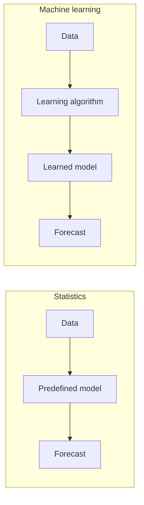
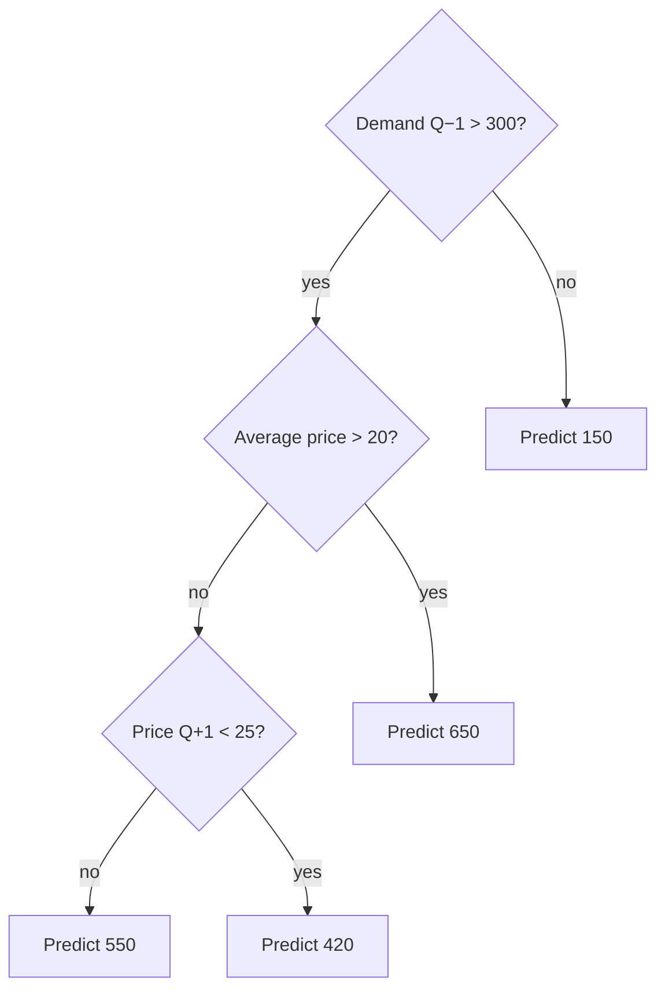
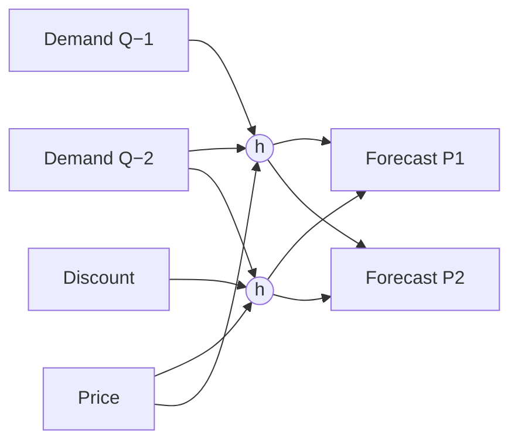
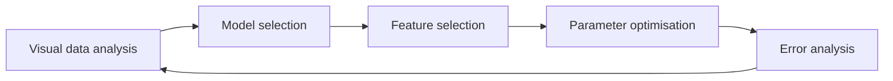

# 15. Machine Learning for Demand Forecasting

> **Teaching rewrite** — the *Baseline model* step. Original wording; illustrative numbers. Competition figures recomputed from the published scores.

## Introduction

Statistical models (lesson 14) apply **predefined** equations: give a non-seasonal model a seasonal product and it mistakes the cycle for changing trends; give a seasonal model a flat product and it invents seasonality. **Machine learning (ML)** works the other way round: a learning algorithm **discovers** relationships between inputs (history, drivers) and outputs (future demand) from data.

This lesson covers:

- What ML is — and isn’t — and how it **learns** from **features**
- **Feature engineering** as a business activity
- **Local vs global** models
- **Black box** vs white box, and how to peek inside (feature importance, scenarios)
- **Tree-based models** and **neural networks**, with a short history
- **Realistic expectations** from forecasting competitions and practice
- How to **launch** an ML initiative — and four pitfalls

---

## 15.1 What is machine learning?

You choose the algorithm and its settings, but not the resulting relationships — the model learns them from a **training** dataset, then applies them to new data.

| | Statistical models | Machine learning |
|---|---|---|
| Explainability | **White box** | **Black box** |
| Complexity | Simpler | More complicated |
| Demand drivers | Hard to include | Easy to include |
| Data requirement | Limited | Extensive |
| Expected accuracy | Lower | Higher |

Neither replaces the other — they trade transparency for flexibility.

:::info What counts as ML here
Tree-based models (random forests, gradient-boosted trees) and neural networks. Linear regressions (including Lasso/Ridge/ElasticNet), ARIMA, and Prophet are treated as **statistical** models — be wary of vendors relabelling them as ML. Be even warier of “AI” claims: the term has no strict definition and often sells over-promises.
:::

### Features

A **feature** is a piece of information the model can use to predict, e.g. “last quarter’s demand”, “next quarter’s price”, “promotion next quarter?”, “brand”.

| Brand | Demand Q−4 | Q−3 | Q−2 | Q−1 | Avg price | Price Q+1 | Promo Q+1 | **Demand Q+1** (target) |
|---|---|---|---|---|---|---|---|---|
| Low cost | 1,500 | 500 | 400 | 300 | 10 | 10 | — | 200 |
| Premium | 500 | 1,000 | 750 | 500 | 35 | 30 | −15% | 700 |
| Regular | 250 | 350 | 150 | 400 | 20 | 20 | −20% | 300 |

(This is **supervised** learning: the model sees inputs **and** the desired output.)

Two success factors:

1. **The features you provide** — business insight matters most. You can’t predict Black Friday sales without knowing whether the item will be discounted.
2. **Tuning the algorithm** — a data-science skill.

### Feature engineering is a business process

Don’t leave data scientists alone. Run a brainstorm: *“If I had to forecast next month myself, what would I want to check?”* Typical answers become features:

- Current price, and did it change recently?
- Average monthly demand?
- Was it recently out of stock?
- Is a promotion running?

Then the hard part: collecting the data. Trade off quality vs availability — don’t freeze a project for months to collect a barely useful driver.

### Local vs global models

| | **Local** (typical statistical) | **Global** (typical ML) |
|---|---|---|
| Trained on | One item’s history at a time | **All items** at once |
| More history helps? | Yes | Yes |
| More items helps? | No | **Yes** — more examples of each pattern |
| Transfer learning | None | A never-promoted item can benefit from what promotions did to other items |
| Small datasets | Works | Struggles — too few examples |

A global model learns **general** patterns (“promotions lift demand”, “recent growth tends to continue”); it learns **cross-item** relationships only if you give it features describing them.

### Opening the black box

ML won’t tell you level, trend, or seasonality. Two tools help:

- **Feature importance** (tree models) — shows which features the model relies on, not **how** they affect demand. Useful to drop useless drivers (weather at 0.01% importance). If a driver you consider critical scores low, suspect bad data or a design flaw.
- **Scenario analysis** — run the model with and without a driver (e.g. with/without a discount) and compare. Example: a promotion scenario shows **+17%** total uplift and dips before/after the promotion (**self-cannibalisation**).

<GuidedChoiceExplanation preset="dfx-ml-basics" />

---

### Checkpoint: ML fundamentals

<MultipleChoice
  id="dfx-ch15-mid1"
  title="Checkpoint — section 15.1"
  questions={[
    {
      prompt: 'What distinguishes ML from statistical forecasting models?',
      choices: [
        'ML always uses more history',
        'ML learns relationships from data instead of applying predefined equations',
        'ML is always more transparent',
        'ML cannot use demand drivers',
      ],
      answer: 1,
      why: 'Statistical models assume the structure; ML discovers it.',
    },
    {
      prompt: 'A global model is trained on 5,000 items. A new item is promoted for the first time. Why can the model still estimate the effect?',
      choices: [
        'It copies last year’s forecast',
        'It learned how promotions affected other items',
        'It ignores promotions',
        'It uses the item’s own promotion history',
      ],
      answer: 1,
      why: 'Global models transfer learnings across items.',
    },
    {
      prompt: 'Feature importance shows “promotion” is the top feature. What do you know?',
      choices: [
        'Promotions raise demand by a known %',
        'The model relies heavily on promotion data — but not how it affects demand',
        'Promotions reduce demand',
        'Nothing at all',
      ],
      answer: 1,
      why: 'Use scenarios to quantify the effect.',
    },
    {
      type: 'order',
      prompt: 'Rank the steps of feature engineering.',
      items: [
        'Ask the team what they would check to forecast next month.',
        'List candidate features from the answers.',
        'Check data availability and quality for each.',
        'Start with available features; add others later.',
        'Use feature importance and errors to refine.',
      ],
      why: 'Business insight first, pragmatic data collection, iterative refinement.',
    },
  ]}
/>

---

## 15.2 Main types of learning algorithms

> *Technical extra — skip to 15.3 if you only need the business view.*

### A short history

| Year | Milestone |
|---|---|
| 1940s | McCulloch & Pitts model artificial neurons |
| 1957 | Rosenblatt’s **Perceptron** (first trainable neural network); Holt’s **exponential smoothing** |
| 1960 | Winters adds seasonality to exponential smoothing |
| 1963 | Morgan & Sonquist: first **decision tree** algorithm |
| 1985 | **Damped trends** for exponential smoothing (Gardner & McKenzie) |
| 1986 | **Backpropagation** popularised — deeper networks trainable |
| 1995–2001 | **Boosting** (AdaBoost 1995/97), **random forests** (2001) |
| 2010–2015 | ReLU activation, Adam optimiser — deep networks train well |
| 2016–2017 | **XGBoost**, **LightGBM** — fast, accurate gradient boosting |

Why the boom only recently? Computing power and data grew, but the decisive factors were **better algorithms** (2010–2017) and **simpler tools** (open-source libraries, learning resources).

### Tree-based models

A **decision tree** asks yes/no questions (**nodes**) until it reaches a prediction (**leaf**) — like the game *Guess Who?*. The training algorithm picks, at each node, the question that splits the data into the most homogeneous groups. (“Does the person wear clothes?” is useless — everyone does.)

Example path for a forecast:

- **Random forest** — averages hundreds of independent, randomised trees; simple and robust.
- **Gradient boosting** — builds trees **one after another**, each focusing on the previous trees’ mistakes; today’s top performers (XGBoost, LightGBM).

### Neural networks

An artificial **neuron** weights its inputs and applies an **activation function** (often something like a capped weighted sum, e.g. ReLU) to produce an output.

- **Input layer** passes features in; **hidden layers** do the learning; **output layer** produces forecasts (one neuron per period).
- **Training** = an optimiser adjusts the connection weights to reduce error.

---

## 15.3 What to expect from ML

### Forecasting competitions

| Competition | Year | Granularity | Items | Horizon | Benchmark | Benchmark score | Winner | Error reduction |
|---|---|---|---|---|---|---|---|---|
| Corporación Favorita | 2018 | Store × product × day | 210,000 | 16 days | Seasonal naïve | 0.8486 | 0.5092 | **40%** |
| M5 (Walmart) | 2020 | Store × product × day | 42,840 | 28 days | Exponential smoothing | 0.6710 | 0.5204 | **22%** |
| Intermarché | 2021 | Store × product × day | 275,781 | 90 days | Seasonal moving average | 0.6088 | 0.5478 | **10%** |

Error reduction = (benchmark − winner) / benchmark. All three were won by ML. Gains differ partly because of the benchmark (a weak seasonal naïve flatters Favorita) and the data/metric (Intermarché had one year of history and a log-scaled metric). Each used a different metric, so compare cautiously.

### Rules of thumb from practice

- ML typically reduces forecast error by **0–30%** versus a good moving average.
- Gains grow with **more data** — shortages, promotions, prices; **promotions alone** can be worth up to ~15%.
- ML shines most on **granular** data.
- Claims far beyond this deserve scrutiny — check for cherry-picked periods or excluded “worst” items.

### Improving the baseline, not replacing planners

ML may not beat your **whole** process (planners know things the model doesn’t), but it should beat your **baseline** — freeing planners to focus on new products and items where they have special information.

| Step | Before: MAE (FVA) | Bias | After ML: MAE (FVA) | Bias |
|---|---|---|---|---|
| Benchmark | 52% | −1% | 52% | −1% |
| Baseline model | 45% (+7) | −3% | **41% (+11)** | −2% |
| Demand planners | 41% (+4) | +1% | **39% (+2)** | +1% |

The final forecast improves from 41% to 39%, and planners need to add less — less workload.

<GuidedChoiceExplanation preset="dfx-ml-expectations" />

---

### Checkpoint: algorithms and expectations

<MultipleChoice
  id="dfx-ch15-mid2"
  title="Checkpoint — sections 15.2 and 15.3"
  questions={[
    {
      prompt: 'How does gradient boosting differ from a random forest?',
      choices: [
        'It uses one tree only',
        'It adds trees sequentially, each correcting the previous trees’ errors',
        'It averages independent trees',
        'It is a neural network',
      ],
      answer: 1,
      why: 'Forests average independent trees; boosting learns from mistakes.',
    },
    {
      prompt: 'Benchmark score 0.80, winning model 0.60. Error reduction?',
      choices: ['20%', '25%', '33%', '75%'],
      answer: 1,
      why: '(0.80 − 0.60) / 0.80 = 25%.',
    },
    {
      prompt: 'A vendor promises 60% error reduction versus a moving average. Reasonable reaction?',
      choices: [
        'Sign immediately',
        'Be sceptical — typical gains are 0–30%; check test periods, exclusions, and metrics',
        'Expect even more',
        'Use MAPE to confirm',
      ],
      answer: 1,
      why: 'If it seems too good to be true, it probably is.',
    },
    {
      type: 'order',
      prompt: 'Rank the neural-network layers in the order data flows through them.',
      items: ['Input layer', 'Hidden layers', 'Output layer'],
      why: 'Forward propagation.',
    },
  ]}
/>

---

## 15.4 Launching an ML initiative

Follow the 5-step framework (objective → data → metrics → baseline model → review). For ML, the model-building loop gains a step:

### Four pitfalls

| Pitfall | Avoid it by |
|---|---|
| **Bad test set-up** | Hold out a **test period** never used for feature selection or tuning (e.g. tune on 2021–2025, test on 2026). Picking the best of many models on the same period you report is cherry-picking. Compare against a **benchmark**, your **current engine**, and your **consensus** — same periods, same granularity |
| **“What” before “why”** | Don’t chase fashionable models. Fix the objective (level, horizon), the data (demand, not sales), and the metrics (MAE + bias, not MAPE) first |
| **Wrong expectations** | Promise too much → disappointment and user resistance; too little → no traction. Plan for 0–30%; >15% is realistic when promotions or pricing drive demand |
| **“We tried ML once”** | ML is hundreds of models and set-ups. One failed attempt doesn’t prove ML can’t work — any more than one failed spreadsheet proves maths doesn’t |

---

### Rank: ML project

<MultipleChoice
  id="dfx-ch15-rank"
  title="ML project sequence"
  questions={[
    {
      type: 'order',
      prompt: 'Rank the steps of an ML forecasting project.',
      items: [
        'Define the decision-level objective (granularity, horizon).',
        'Collect demand data and key drivers (promotions, prices, shortages).',
        'Agree metrics (MAE + bias, value-weighted) and benchmarks.',
        'Select features and tune models on a training period.',
        'Evaluate on an untouched test period against benchmark, current engine, and consensus.',
        'Deploy as the baseline; track FVA.',
      ],
      why: 'Framework first, honest testing, then measured deployment.',
    },
    {
      type: 'order',
      prompt: 'From the competitions, rank by error reduction (LARGEST first).',
      items: ['Corporación Favorita (40%)', 'M5 (22%)', 'Intermarché (10%)'],
      why: 'Partly driven by benchmark strength and available data.',
    },
  ]}
/>

---

### Check: machine learning

<MultipleChoice
  id="dfx-ch15"
  title="Machine learning for demand forecasting"
  questions={[
    {
      prompt: 'Which model is a typical example of ML in this lesson?',
      choices: ['ARIMA', 'Linear regression', 'Gradient-boosted trees', 'Holt-Winters'],
      answer: 2,
      why: 'Trees and neural networks count as ML here.',
    },
    {
      prompt: 'Why do global models struggle on small datasets?',
      choices: [
        'They need prices',
        'Too few examples to learn meaningful patterns',
        'They overfit seasonality',
        'They only use one item',
      ],
      answer: 1,
      why: 'More items and history = more learning opportunities.',
    },
    {
      prompt: 'How can you estimate a promotion’s uplift from a black-box model?',
      choices: [
        'Read the seasonal factor',
        'Run scenarios with and without the promotion and compare',
        'Use feature importance alone',
        'It is impossible',
      ],
      answer: 1,
      why: 'Scenario analysis quantifies effects.',
    },
    {
      prompt: 'Baseline MAE drops from 45% to 41% with ML; planners then reach 39%. What happened to planners’ FVA?',
      choices: ['Rose from +4 to +6', 'Fell from +4 to +2 — less to fix, less workload', 'Unchanged', 'Became negative'],
      answer: 1,
      why: 'A better baseline leaves less room — and less work — for adjustments.',
    },
    {
      prompt: 'A team reports results after removing the 5% worst forecasts. This is…',
      choices: ['Best practice', 'A misleading presentation of accuracy', 'Value weighting', 'Feature engineering'],
      answer: 1,
      why: 'Excluding offenders flatters results.',
    },
  ]}
/>

---

## Takeaways

:::tip Remember
- ML **learns** relationships from data; statistical models **assume** them
- **Features** drive success — make feature engineering a **business** exercise
- **Global** models learn across items; need enough data
- ML is a **black box** — use feature importance and **scenarios**
- Expect **0–30%** error reduction vs a good benchmark; more data (promotions, prices, shortages) → bigger gains
- ML improves the **baseline** and reduces planner workload; it doesn’t replace planners
- Test honestly on **held-out** periods; follow the 5-step framework
:::

## Further Reading

- [14. Statistical forecasting](./statistical-forecasting)
- [12. Forecast value added](./forecast-value-added)
- Next: [16. Judgmental forecasting](./judgmental-forecasting)
- S. Makridakis et al., “The M5 accuracy competition: Results, findings and conclusions” (2022)
- Background: N. Vandeput, *Demand Forecasting Best Practices* (Manning) — used as a study outline
