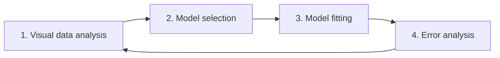

# 14. Statistical Forecasting

> **Teaching rewrite** — the *Baseline model* step. Original wording; illustrative numbers.

## Introduction

The baseline model does the bulk of the work in a good process (lesson 12). Statistical models come in two broad families — the split is a simplification, since one model can combine both:

| Family | Looks at | Example question |
|---|---|---|
| **Time series** | Past demand only (**univariate**) — level, trend, seasonality | “What does the demand pattern say about next month?” |
| **Predictive (causal)** | **Demand drivers** — prices, promotions, weather, events… | “What happens to demand if we run a 20% promotion?” |

This lesson covers:

- **Level, trend, seasonality** and how time series models use them
- How much history you need, and the risk of **overfitting**
- **Demand drivers** — internal and external — and their pitfalls
- Time series vs predictive: how to **choose or combine**
- A **4-step model-building loop**: visual analysis → selection → fitting → error analysis

---

## 14.1 Time series forecasting

### Demand components

| Component | Meaning | Example |
|---|---|---|
| **Level** | The average around which demand fluctuates (a smoothed demand) | “We sell about 10 books a day.” |
| **Trend** | Consistent change in level per period — prefer **additive** (units/period) over multiplicative (growth %), which is risky to extrapolate | “+100 units each month.” |
| **Seasonality** | How demand is distributed within a recurring cycle (day, week, year); over a full cycle, seasonal effects net to zero | “+30% in Q2, −20% in Q3, −10% in Q4.” |

Planners like this decomposition because they can **read** how the model interprets history and why it forecasts what it does.

### Worked example: building a forecast from components

Level **1,000**/month, trend **+20**/month, additive seasonal effects: Q1 0, Q2 +300, Q3 −200, Q4 −100 (they sum to 0 over the year).

| Month ahead | Level + trend | Seasonal effect (quarter) | Forecast |
|---|---|---|---|
| +1 (Q2) | 1,000 + 20 = 1,020 | +300 | **1,320** |
| +4 (Q3) | 1,000 + 80 = 1,080 | −200 | **880** |
| +7 (Q4) | 1,000 + 140 = 1,140 | −100 | **1,040** |

### Worked example: simple exponential smoothing

Exponential smoothing updates the level with each new observation: **level = α × demand + (1 − α) × previous level**. With α = 0.3 and starting level 100:

| Demand | New level |
|---|---|
| 100 | 0.3×100 + 0.7×100 = **100.0** |
| 120 | 0.3×120 + 0.7×100 = **106.0** |
| 90 | 0.3×90 + 0.7×106 = **101.2** |
| 110 | 0.3×110 + 0.7×101.2 = **103.8** |

Higher α reacts faster; lower α smooths more. Trend and seasonal versions (Holt, Holt-Winters) add components the same way. **ARIMA** is the other classical family. Both can be tuned automatically.

### How much history?

- Seasonal models need several cycles — roughly **3–5** — to separate seasonality from noise. For monthly seasonality, 3–4+ years.
- Rules like “always use exactly three years” invite **overfitting**: the model treats random wiggles as trend or seasonality, looks great on history, and fails on the future.

:::tip Pro tip — don’t over-model
Many engines assume a seasonal product also has a trend. Often it doesn’t. A model too complex for the pattern overfits; with little history, a simple **moving average** often beats sophisticated models.
:::

<GuidedChoiceExplanation preset="dfx-ts-components" />

---

### Checkpoint: time series

<MultipleChoice
  id="dfx-ch14-mid1"
  title="Checkpoint — section 14.1"
  questions={[
    {
      prompt: 'A univariate model uses…',
      choices: ['Demand and price', 'Only historical demand', 'Weather and holidays', 'Competitor data'],
      answer: 1,
      why: 'One variable to predict itself.',
    },
    {
      prompt: 'Level 500, trend +10/month, seasonal effect +50 for month +3. Forecast for month +3?',
      choices: ['550', '560', '580', '530'],
      answer: 2,
      why: '500 + 3×10 + 50 = 580.',
    },
    {
      prompt: 'α = 0.5, previous level 80, new demand 100. New level?',
      choices: ['80', '85', '90', '100'],
      answer: 2,
      why: '0.5×100 + 0.5×80 = 90.',
    },
    {
      type: 'order',
      prompt: 'Rank these models by risk of overfitting on 18 months of noisy, non-seasonal data (HIGHEST first).',
      items: [
        'Trend + seasonal model (Holt-Winters)',
        'Trend model (Holt)',
        'Simple exponential smoothing',
        'Moving average',
      ],
      why: 'More components = more chances to fit noise.',
    },
  ]}
/>

---

## 14.2 Predictive analytics and demand drivers

**Demand drivers** (a.k.a. explanatory or exogenous variables) influence buying behaviour. Ice cream next Monday depends on the weather forecast, school holidays, a match, and whether the waffle truck is parked nearby.

| Driver | Internal / external | History available? | Future known? | Notes |
|---|---|---|---|---|
| **Promotions** | Internal | ✅ | Usually (medium term) | Big impact; watch pre-/post-promo dips |
| **Events** | Internal | ✅ | ✅ | Planned months ahead; often paired with promotions |
| **Marketing** | Internal | ✅ | Sometimes | Hard to link to specific products; lagged effect |
| **Pricing** | Internal | ✅ | Often unclear | Little variation in many B2C shops; B2B customer-specific prices; sensitive |
| **Shortages** | Internal | ✅ | Short term | Essential for censoring (lesson 3) |
| **Holidays** | External | ✅ | ✅ | Moving holidays (e.g. school breaks, Ramadan) complicate monthly buckets |
| **Weather** | External | ✅ | Only ~2 weeks | Very short-term only |
| **Macroeconomics** | External | ✅ | Usually not | Use **leading indicators** instead |
| **Competition** | External | Rarely | Rarely | Hard to obtain |

### Notes by driver

- **Promotions** — model each promotion type separately or model the **actual discounted price**. Expect **self-cannibalisation**: customers wait for announced sales and buy less before/after. Rare events (e.g. once-a-year sales) give the model few examples. Promotions added at short notice can’t be forecast in time. Don’t **manually clean** promotions out of history — it’s slow and invites data hacking; use a tool that flags promotions or models uplift directly.
- **Pricing** — announced price **increases** often cause a pre-buy spike then a dip; announcements can be modelled even when detailed future prices aren’t known. Without future prices, use the model for **price scenarios**.
- **Shortages** — without them the model falls into the sales-forecasting vicious circle. With monthly buckets, a few stock-out days have unclear impact. Retailers may need to **infer** shortages from runs of zero sales.
- **Leading indicators** — drivers that move **before** demand: building permits → construction demand; an **order book** of pre-orders → near-term demand.

### Worked example: a leading indicator

Building permits lead demand for window frames by about **6 months**, and history suggests ~**12 frames per permit**. Permits issued this month: **850** → expected frame demand in six months ≈ 850 × 12 = **10,200**.

### Challenges

| Challenge | Example |
|---|---|
| **Data gathering** | Key data in spreadsheets; months of work to collect; weigh cost vs expected gain |
| **Non-linear effects** | Ice cream rises with temperature — but not below zero sales when freezing, and drops when it’s too hot to go out |
| **Cross effects** | This weekend’s barbecue demand depends on this **and** next weekend’s weather |
| **Lagged effects** | Advertising today, purchase in two weeks |

<GuidedChoiceExplanation preset="dfx-drivers" />

---

### Checkpoint: demand drivers

<MultipleChoice
  id="dfx-ch14-mid2"
  title="Checkpoint — section 14.2"
  questions={[
    {
      prompt: 'Why is weather useful only for short-term forecasts?',
      choices: [
        'It has no effect',
        'It can’t be forecast reliably more than about two weeks ahead',
        'It is an internal driver',
        'It is always flat',
      ],
      answer: 1,
      why: 'You need future driver values to use them.',
    },
    {
      prompt: 'Customers wait for a well-known yearly sale, so demand dips before and after. This is…',
      choices: ['Substitution', 'Self-cannibalisation', 'Bullwhip', 'Overfitting'],
      answer: 1,
      why: 'Promotions shift demand in time.',
    },
    {
      prompt: 'An indicator leads demand by 3 months with ratio 4 units per indicator point. Indicator now 2,500. Demand in 3 months?',
      choices: ['625', '2,500', '7,500', '10,000'],
      answer: 3,
      why: '2,500 × 4 = 10,000.',
    },
    {
      type: 'order',
      prompt: 'Rank these drivers by how far ahead their future values are typically known (LONGEST first).',
      items: ['Holidays', 'Planned events', 'Promotions', 'Weather'],
      why: 'Holidays are fixed far ahead; weather only days ahead.',
    },
  ]}
/>

---

## 14.3 Time series vs predictive — and how to choose

| | Time series | Predictive |
|---|---|---|
| Complexity | Simple to set up | Needs advanced analytics |
| Scenario planning | No | **Yes** (“what if we run a promotion?”) |
| Data | Demand history only | Drivers — often hard to collect |

There is no universal winner. Approach:

1. **Check data availability** before debating models.
2. **Try several** approaches and inputs; always compare with **benchmarks** (lesson 10) and your current engine.
3. **Select or combine** — keep a clear winner; if several are close, **averaging** them often adds accuracy (at the cost of transparency).

### Within the 5-step framework

- **Objective** — make sure you forecast the right **level** (lesson 5) and **horizon** (lesson 6) first. A great monthly-by-market model is wasted if logistics then flat-splits it into weeks and warehouses.
- **Data** — *bad data beats a good model every time*. Forecast **demand**, not sales. Start with the data you have; add drivers later. Be wary of opaque, delayed, expensive third-party data.
- **Metrics** — make sure success is measured with **MAE + bias** (value-weighted for wide price ranges), not MAPE. Projects fail when management’s metric isn’t aligned with business value.

### The 4-step model-building loop

1. **Visual data analysis** — plot demand with prices, promotions, holidays; look for trend, seasonality, odd promotions, similarities across items.
2. **Model selection** — pick a model that can capture what you saw (machine learning handles many interacting drivers better — next lesson).
3. **Model fitting** — let an optimiser find parameters. Ask your software vendor **which horizon and metric** it optimises — and align them with yours.
4. **Error analysis** — plot the biggest offenders. Usual root causes:

| Cause | Fix |
|---|---|
| **Wrong data** | Fix the root cause at the source — don’t hand-smooth outliers |
| **Missing driver** (e.g. an unmodelled price rise) | Collect it and make sure the model can use it |
| **Badly tuned optimisation** | Watch for **overfitting** (inventing seasonality that isn’t there) and **underfitting** (missing real seasonality) |

<GuidedChoiceExplanation preset="dfx-model-loop" />

---

### Rank: model building

<MultipleChoice
  id="dfx-ch14-rank"
  title="Model building"
  questions={[
    {
      type: 'order',
      prompt: 'Rank the 4-step model loop.',
      items: ['Visual data analysis', 'Model selection', 'Model fitting', 'Error analysis'],
      why: 'Then loop back with what the errors teach you.',
    },
    {
      type: 'order',
      prompt: 'Rank the steps before building a new model.',
      items: [
        'Confirm the forecast level and horizon match the decisions.',
        'Collect demand (not sales) data and check its quality.',
        'Agree success metrics (MAE + bias, value-weighted).',
        'Set up benchmarks to compare against.',
        'Build and test candidate models.',
      ],
      why: 'Objective, data, metrics, then models.',
    },
  ]}
/>

---

### Check: statistical forecasting

<MultipleChoice
  id="dfx-ch14"
  title="Statistical forecasting"
  questions={[
    {
      prompt: 'Over a full seasonal cycle, additive seasonal effects should sum to…',
      choices: ['The level', 'Zero', 'The trend', '100%'],
      answer: 1,
      why: 'High seasons are offset by low seasons.',
    },
    {
      prompt: 'Why prefer additive trends?',
      choices: [
        'They are always more accurate',
        'Multiplicative (growth-rate) trends can explode when extrapolated',
        'Additive trends need no data',
        'Software requires it',
      ],
      answer: 1,
      why: 'Compounding growth is risky far ahead.',
    },
    {
      prompt: 'A planner manually removes promotion spikes from history each month. Better practice?',
      choices: [
        'Keep doing it',
        'Flag promotions in the tool or use a model that forecasts promotion uplift',
        'Delete all promotions',
        'Ignore promotions',
      ],
      answer: 1,
      why: 'Manual cleaning is slow and invites data hacking.',
    },
    {
      prompt: 'The model invents a seasonal pattern that isn’t really there. This is…',
      choices: ['Underfitting', 'Overfitting', 'Bias', 'Censoring'],
      answer: 1,
      why: 'Fitting noise as signal.',
    },
    {
      prompt: 'Which can predictive models do that pure time series models cannot?',
      choices: ['Use demand history', 'Run scenarios on drivers like price or promotions', 'Detect seasonality', 'Be automated'],
      answer: 1,
      why: 'Drivers make “what if” analysis possible.',
    },
  ]}
/>

---

## Takeaways

:::tip Remember
- **Time series** models decompose demand into **level, trend, seasonality** — easy to set up and read
- Prefer **additive** trends; need several cycles for seasonality; beware **overfitting**; simple often wins
- **Predictive** models use **drivers**: promotions, events, pricing, shortages, holidays, weather, **leading indicators**
- Drivers bring data, non-linear, cross, and lagged challenges — and you need their **future** values
- Check data, try several models, compare with **benchmarks**, select or combine
- Build models in a loop: **visualise → select → fit → analyse errors**
:::

## Further Reading

- [13. What do you review?](./abc-xyz-review)
- [3. Capturing unconstrained demand](./capturing-unconstrained-demand) — shortages as a driver
- Free textbook: R. Hyndman & G. Athanasopoulos, *Forecasting: Principles and Practice* ([otexts.com/fpp3](https://otexts.com/fpp3/))
- Next: [15. Machine learning for demand forecasting](./machine-learning-forecasting)
- Background: N. Vandeput, *Demand Forecasting Best Practices* (Manning) — used as a study outline
