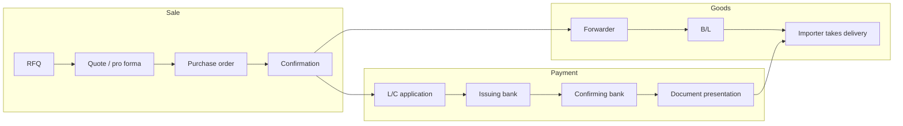

# 2. Documents and the Transaction Sequence

> **Teaching rewrite** of the classic export–import document walkthrough. Original explanations of the document pack and deal timeline — not a reprint of any commercial handbook or specimen forms.

Cross-border sales look like domestic PO-and-invoice deals until you count the **subsidiary** agreements: banks, carriers, insurers, inspectors, and customs each leave their own paper trail. In a **documentary sale**, that trail is not paperwork for the archive — it is often the **payment trigger**.

This chapter maps the usual **sequence of events** and the **standard documents** that appear along the way.

---

## A documentary affair

Think of one deal as several parallel flows:

| Flow | Typical papers |
|---|---|
| **Contract** | RFQ → quote / pro forma → purchase order / confirmation (or a model sale form + GTCs) |
| **Payment** | Documentary credit application → advice / confirmation of credit → presentation of documents |
| **Transport** | Booking via forwarder → bill of lading (or other transport doc) → packing list |
| **Risk / quality** | Insurance certificate · inspection / quality certificate · certificate of origin · (sometimes) consular invoice |
| **Customs** | Export formalities (often seller under CIF-style terms) · import declaration (buyer) |

:::tip Operator habit
List the documents **before** you ship. Under a letter of credit, the bank pays on **conforming documents**, not on a phone call that “the container left.”
:::



---

## 2.1 Sequence of events

International deals still start with an exchange of commercial forms. The difference is that the sale contract usually **forces** extra contracts with banks, carriers, and insurers — each represented by standard documents.

### Step 1 — Marketing → RFQ

Exporters market via catalogues, trade shows, and websites. An importer then asks for a price on a defined quantity and quality.

**Request for quote (RFQ)** / **RFP**: often a letter or pre-printed inquiry form. It is usually **not** yet a binding offer — it is a structured ask.

### Step 2 — Offer

The exporter answers with price **and** enough terms to form a contract if accepted.

| Tool | Role |
|---|---|
| **Pro forma invoice** | Looks like the eventual commercial invoice, but earlier: price, delivery, payment. May be the first binding offer, or later a confirmation of a PO. |
| **Model sale “specific conditions”** | A fill-in deal sheet (parties, goods, price, delivery term, timing). Completeness is the point — it forces decisions on the hard boxes. |
| **General conditions** | If parties use the specific form of a two-part model, they are usually treated as also adopting the linked GTCs (CISG fallback, Incoterms® references, payment defaults, writing rules, etc.). |

:::info Incoterms® editions
Older specimen forms cite **Incoterms® 2000 / 2010**. In live contracts, name the **edition you intend** (today typically **Incoterms® 2020**). The idea of CIF-style “cost + insurance + freight to destination” still structures many maritime examples in this chapter.
:::

### Step 3 — Acceptance

A contract forms when an offer meets **unequivocal acceptance**.

**Purchase order (PO):** often the buyer’s acceptance of a pro forma. With large commercial buyers, the **PO is frequently the first binding offer**, and the seller’s **order confirmation** is the acceptance. Always ask: *who made the first binding move?*

<GuidedChoiceExplanation preset="export-contract-formation" />

### Step 4 — Payment term

If the exporter cannot credit-check the importer comfortably, a common insistence is a **confirmed, irrevocable documentary credit** (letter of credit / L/C — same idea).

**Documentary credit application:** the buyer (applicant / account party) asks its bank to issue the credit **before** shipment. A well-drafted sale contract sets a **deadline** to open the credit; otherwise a reasonable time is presumed.

### Step 5 — Shipping setup (CIF-style example)

Suppose the quote is **CIF** (cost, insurance, freight) under a named Incoterms® edition: price includes freight to the named destination **plus** insurance. Incoterms® allocate **cost and risk** among eleven standard trade terms (FOB, CIF, EXW, …). Container and multimodal moves often use related terms covered later with carriage.

Under CIF-style allocation, the **exporter** typically handles **export** customs formalities (e.g. export licence). **Import** formalities and duties stay with the importer. Unloading / discharge costs are a frequent CIF dispute — many exporters state in the pro forma / contract that **discharge is for the buyer**, and give the forwarder matching instructions.

When goods are delivered to the carrier, the exporter (as shipper) receives the **bill of lading**.

### Step 6 — Issuance of the documentary credit

In bank language:

- **Importer** = applicant / account party  
- **Exporter** = beneficiary  

The credit lists **what documents** earn payment (commercial invoice, insurance, packing list, inspection certificate, B/L, …). Agree that list in the **sale contract**, not after the ship sails.

### Step 7 — Confirmation of the credit

If the beneficiary required **confirmation**, another bank (often in the exporter’s country) adds its **own irrevocable undertaking** to pay when the credit conditions are met. Confirmation is a **fee-based** service — useful when the issuer is distant, unfamiliar, or credit-risky, or when the exporter simply prefers a known local paymaster. Not every credit is confirmed.

**Advice of confirmed credit:** read it immediately. Check that you can actually produce every required document, and that the credit matches the sale contract.

### Step 8 — Shipment and presentation for payment

The exporter ships (via forwarder) and presents the credit documents to the confirming bank (or as the credit directs). Typical pack:

| Document | What it does |
|---|---|
| **Commercial invoice** | Seller’s bill of sale. Under an L/C, tiny typos become **discrepancies**. |
| **Bill of lading** | Receipt that goods were received in apparent good order/quantity; evidences rights against the carrier. CIF deals usually need a **negotiable** B/L so goods can be sold in transit and so banks can control title in the credit chain. Other receipts (mate’s receipt, FIATA B/L, air waybill, …) have different legal effects. |
| **Insurance certificate / policy** | Under classic CIF Incoterms® practice, cover is typically for **110%** of the goods value (the extra 10% for the buyer’s minimum anticipated profit; higher cover can be agreed). |
| **Certificate of origin** | Country of origin / substantial manufacturing. Not always required; sometimes a company letterhead declaration is enough. |
| **Inspection / quality certificate** | Not mandatory globally, but common on large or unfamiliar deals; powerful anti-fraud / quality gate when required under the credit. |
| **Consular invoice** | Detailed goods description certified by a consul of the importing country (when that country still requires it). |
| **Packing list** | Contents per package; package type (box, crate, drum, carton). |

<GuidedChoiceExplanation preset="export-key-documents" />

---

## 2.2 Transport: the freight forwarder

Exporters usually book space and often clear export formalities through a **freight forwarder**. Give the forwarder the same discharge / Incoterms® story you put in the contract — inconsistent instructions create unpaid “surprise” terminal charges and angry emails.

After shipment, the transport document becomes the backbone of both **delivery** and **L/C presentation**.

---

## 2.3 Bank examination and discrepancies

The confirming bank examines the presentation. If documents **conform**, it pays or undertakes to pay under the credit type:

- **Sight** — pay now  
- **Deferred payment** — pay later  
- **Acceptance / negotiation** — draft or negotiation mechanics that can yield earlier funds at a discount  

Documents then move to the **issuing bank**. If conforming, the issuer reimburses the confirmer, turns documents over to the importer, and debits the applicant. The importer uses the transport document to take delivery from the carrier.

:::caution Reality check
First presentations often fail on **discrepancies** (wrong description, late B/L date, missing endorsement, invoice math, inconsistent weights). Fixes and waivers cost time and can delay or block payment. Proofread the pack as if it were code shipping to production.
:::

<GuidedChoiceExplanation preset="export-lc-discrepancies" />

Documentary credits are developed further in the payment chapters; this lesson only places them in the timeline.

---

## 2.4 Carrier liability and insurance coverage

If goods arrive damaged or short:

1. **Insurance** — recover only if the cause is **within** the policy (and not excluded).  
2. **Carrier** — if the loss stems from the carrier’s acts, recovery depends on **B/L exclusions / liability limits** and the law governing the bill.

Incoterms® tell you **who** must arrange insurance and when risk passes; they do not by themselves set carrier liability ceilings. Read both the insurance wording and the B/L.

---

### Walk the timeline

```text
Marketing → RFQ → Offer (pro forma / model form) → PO / confirmation
    → Open L/C (deadline!) → Ship (forwarder, B/L, insurance, pack)
    → Advice / confirmation of credit → Present documents → Bank check
    → Reimbursement & delivery → (if loss) insurance / carrier claims
```

<GuidedChoiceExplanation preset="export-doc-sequence" />

---

### Check: documents & sequence

<MultipleChoice
  id="ib-export-import-ch2"
  title="Documents and transaction sequence"
  questions={[
    {
      prompt: 'A pro forma invoice is best described as…',
      choices: [
        'An early sale-terms document that mirrors the eventual commercial invoice',
        'A customs entry stamped by the importing government',
        'The carrier’s receipt after loading',
        'A bank’s confirmation of a credit',
      ],
      answer: 0,
      why: 'Pro forma = early commercial terms (price, delivery, payment); not a B/L or L/C advice.',
    },
    {
      prompt: 'With a large commercial buyer, the purchase order often…',
      choices: [
        'Is the first binding offer, accepted by the seller’s confirmation',
        'Is never legally relevant',
        'Replaces the bill of lading',
        'Is issued only after the bank pays',
      ],
      answer: 0,
      why: 'Formation can flip: big-buyer PO as offer, seller confirmation as acceptance.',
    },
    {
      prompt: 'Under a classic CIF-style quote, who typically arranges cargo insurance for the voyage?',
      choices: [
        'The exporter, usually to at least ~110% of goods value under Incoterms® CIF practice',
        'Only the importer’s local chamber of commerce',
        'WTO dispute panels',
        'Nobody — CIF means uninsured',
      ],
      answer: 0,
      why: 'CIF includes insurance arranged by the seller on the stated Incoterms® basis.',
    },
    {
      prompt: 'A confirming bank’s main added value is…',
      choices: [
        'Its own irrevocable undertaking to pay if credit conditions are met',
        'Inspecting the factory for free',
        'Setting import duties',
        'Rewriting Incoterms®',
      ],
      answer: 0,
      why: 'Confirmation = second bank promise; it is optional and fee-based.',
    },
    {
      prompt: 'Small errors on a commercial invoice presented under an L/C usually…',
      choices: [
        'Count as discrepancies that can delay or block payment',
        'Are ignored if the container arrived',
        'Automatically amend the sale contract',
        'Cancel export customs',
      ],
      answer: 0,
      why: 'Banks examine facial conformity of documents; typos matter.',
    },
  ]}
/>

---

## Takeaways

:::tip Remember
- Export deals = **sale forms** + **bank / carrier / insurer** documents in a fixed timeline
- Lock the **L/C document list** and **open-credit deadline** in the contract
- Negotiable **B/L** + accurate **invoice / packing / insurance / inspection** papers drive payment in documentary sales
- First presentations often fail — budget time for **discrepancy** cleanup
- Loss recovery splits between **insurance wording** and **carrier / B/L** limits
:::

## Further Reading

- [1. Introduction to export–import](./introduction-to-export-import) — risk map and documentary-sale intuition
- [International Business home](../intro) — section map
- Next: [3. Incoterms® trade terms](./incoterms-trade-terms)
- Public references: [CISG](https://uncitral.un.org/en/texts/salegoods/conventions/sale_of_goods/cisg) · [ICC](https://iccwbo.org/) (organizational portal; incorporate rules by contract, do not paste handbook pages)
