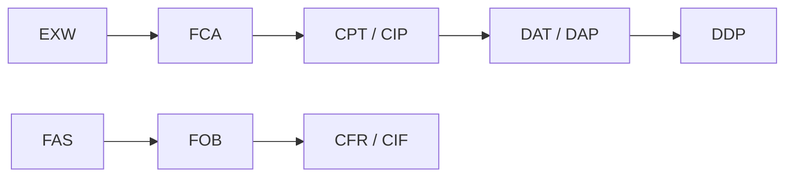

# 3. Focus on Incoterms®: Standard Trade Terms

> **Teaching rewrite** of Incoterms® foundations (allocation of cost, risk, customs, insurance). Pedagogical summaries only — not the official ICC Incoterms® rules text. For live contracts, buy and cite the current ICC publication.

A bare price like “€1000 per unit” does not say **where** delivery happens, who pays freight, who clears customs, or who buys cargo insurance. An Incoterms® rule plus a **named place** (and the **edition**) fills those gaps:

```text
€1000 per unit DDP Beijing Incoterms® 2010
```

---

## What Incoterms® allocate

**Incoterms®** (International Commercial Terms) are ICC standard **trade terms** — FOB, CIF, FCA, and the rest. In a sale contract they allocate, between **seller and buyer**:

1. Transport **costs**
2. **Risk** of loss or damage
3. Export / import **customs clearance and duties** (where applicable)
4. **Insurance** duties (only under **CIF** and **CIP**)

They also pin **where** the seller delivers (or hands goods to the carrier) when combined with a named place. Traders often call them “shipping” or “delivery” terms; ICC’s preferred label is **trade terms**, because they cover more than freight.

:::caution Sale vs carriage
Incoterms® live in the **contract of sale** (seller ↔ buyer). Do **not** confuse them with **liner terms** or other carriage-contract labels (shipper ↔ carrier). Tell your forwarder which Incoterm you sold under so the booking matches the sale.
:::

The eleven Incoterms® 2010 rules sit on a ladder from **minimum seller duty** (**EXW** — buyer runs the whole move from the works) to **maximum seller duty** (**DDP** — delivered, import-cleared, ready to unload at destination).



---

## Any mode vs sea / inland waterway

| Class | Rules | Use when |
|---|---|---|
| **Any mode** (incl. multimodal; ship may be one leg) | EXW, FCA, CPT, CIP, DAT, DAP, DDP | Containers, air, road, rail, multimodal |
| **Sea / inland waterway only** | FAS, FOB, CFR, CIF | Port-to-port; often bulk / string sales |

:::danger Do not FOB a container by truck
Maritime rules assume a **port** delivery story and (for CFR/CIF) a transport document that can support selling goods **in transit**. Using FOB/CIF for pure air or inland container moves can put the seller in **documentary breach**. Prefer **FCA / CPT / CIP** for those moves.
:::

```text
Sea/inland waterway:  FAS · FOB · CFR · CIF
Any mode:             EXW · FCA · CPT · CIP · DAT · DAP · DDP
```

:::info Incoterms® 2020 note
This lesson follows the **Incoterms® 2010** map (the edition in many older guides and forms). **Incoterms® 2020** is the current ICC edition: among other updates, **DAT** was renamed **DPU** (Delivered at Place Unloaded). Always name the **edition** in the contract.
:::

---

## How to use them in contracts

**Incorporate explicitly**, e.g.:

- Append to price/place: `FOB Rotterdam Incoterms® 2010`
- Or pre-print on forms: “All transactions under this document are subject to Incoterms® 2010”

They are **not legislation**. Parties may exclude them or draft bespoke delivery/risk terms. If you use “FOB” / “FCA” **without** naming Incoterms®, meaning becomes ambiguous — though some courts treat Incoterms® as widely known **trade usage** under CISG Art. 9(2) even without an express cite. Best practice: **always** write the rule **and** the year.

Each contract is governed by the **edition it cites**. If it says only “Incoterms®”, tribunals often apply the version in force at contracting. ICC revises roughly once a decade — monitor between revisions, but you need not refresh yearly.

---

## Brief origin

Major trading countries used to define FOB/CIF differently. ICC published the first broadly accepted Incoterms® set in **1936**, with later revisions including 1953, 1967, 1976, 1980, 1990, 2000, and **2010** (then **2020**).

---

## C-terms vs D-terms (the loss-in-transit test)

| | **C-terms** (CFR, CIF, CPT, CIP) | **D-terms** (DAT, DAP, DDP) |
|---|---|---|
| Delivery fulfilled when? | Goods handed to the carrier / on board as the rule requires (**shipment** contract) | Goods arrive at the named destination ready as the rule requires (**arrival** contract) |
| Risk in international transit | Generally **buyer’s** after the shipment point | Generally **seller’s** until destination delivery |
| If cargo is lost at sea | Seller already delivered; buyer looks to **insurance** (and bears gaps) | Seller may be in **breach** — substitute goods / damages / other remedies |

**FOB and CIF are both shipment contracts** — a common myth is that “C” somehow means arrival. Under CIF, risk typically passes **on board at shipment**; the named destination is mainly where **freight (and under CIF, insurance) is paid to**, not where risk ends.

```text
C-term:  seller risk ──► [shipment point] ──► buyer risk  ··· freight paid toward destination
D-term:  seller risk ──────────────────────────────► [destination delivery]
```

---

## What Incoterms® do **not** cover

| Topic | Who handles it |
|---|---|
| Price / payment method | Sale contract |
| Transfer of **title / property** | National law + contract (e.g. retention-of-title clause) — **not** Incoterms® |
| Breach remedies | Sale contract + governing law |
| How goods travel **to** the delivery point | Specify if it matters (e.g. refrigerated containers to FOB port) |
| Mandatory local law | Can override contract choices |

Delivery under an Incoterm ≠ automatic transfer of ownership. CISG also does not unify title transfer. Exporters often want a **retention of title** until paid — check local counsel; not every jurisdiction enforces it the same way.

---

## Insurance duties

Only **CIF** and **CIP** make insurance a **seller→buyer contractual duty**. Other rules do not force either side to insure *as between the parties* — but commercial prudence still says insure what you bear.

Under CIF/CIP (2010 practice):

- At least **Institute Cargo Clauses (C)** (or similar) **minimum** cover
- Sum insured: **contract price + 10%**, in the **contract currency**

Minimum cover often **excludes** theft, pilferage, and rough handling — weak for high-value manufactures. War / strikes / riots (**SRCC**) and similar extensions must be **named**; vague “maximum insurance” leaves the seller to pick cover and creates uncertainty.

:::tip Draft the cover
Agree in the sale contract: which clauses, from where to where, storage days, war/SRCC, profit %, currency, and other add-ons — do not rely on the Incoterm alone.
:::

---

## Incoterms® 2010 design notes (operator view)

| Change / feature | Why it matters |
|---|---|
| **DAT** + **DAP** replace DAF / DES / DEQ / DDU | 13 → **11** rules; DAT = unloaded at terminal; DAP = ready for unloading at place |
| Two classes: any-mode vs sea | Stops misusing maritime rules for containers/air |
| “On board” (not ship’s rail) for FOB/CFR/CIF | Matches modern practice |
| Domestic + international | Export/import formalities only **where applicable** |
| Guidance Notes | Teaching aids — **not** part of the binding rule text |
| Electronic communications | Same effect as paper if agreed or customary |
| Security clearances | A2/B2, A10/B10-style assist / obtain duties |
| Terminal handling | Clearer allocation so buyers are less often billed twice |
| **“Procure goods shipped”** | Supports **string sales** (middle sellers who do not themselves load) |

---

## Pedagogical map of the 11 rules (2010)

:::warning Official text required
The blurbs below are **teaching summaries**. Negotiate from the full ICC Incoterms® book for your edition.
:::

### Any mode of transport

| Rule | Seller delivers when… | Watch-outs |
|---|---|---|
| **EXW** | Goods at buyer’s disposal at named works/place; seller need not load or clear export | Buyer runs export — avoid if buyer cannot clear; **FCA** often better if seller should load |
| **FCA** | Goods to carrier (or buyer’s nominee) at named place; seller clears export where applicable | Name the exact point; risk passes there |
| **CPT** | Goods to carrier; seller pays carriage to named destination | Delivery (risk) ≠ destination (cost); default risk may pass at **first** carrier |
| **CIP** | Like CPT + seller buys insurance for buyer’s risk | Insurance is **minimum** unless upgraded |
| **DAT** | Unloaded at named **terminal** at destination | Specify terminal/point; beyond terminal → DAP/DDP |
| **DAP** | At named place, ready for unloading (not import-cleared) | Import formalities/duties for buyer |
| **DDP** | At named place, **import-cleared**, ready for unloading | Max seller duty; avoid if seller cannot clear import; VAT/taxes unless agreed otherwise |

### Sea and inland waterway

| Rule | Seller delivers when… | Watch-outs |
|---|---|---|
| **FAS** | Alongside the vessel at named port of shipment | Bad fit for containers handed at a terminal → use **FCA** |
| **FOB** | On board the vessel (or procure already on board) | Containers usually **FCA**; string sales via “procure” |
| **CFR** | On board + seller pays freight to named destination port | Risk on board at shipment; unloading cost fights common; containers → **CPT** |
| **CIF** | Like CFR + minimum insurance for buyer | Same two-point cost/risk split; containers → **CIP** |

Under **CPT / CIP / CFR / CIF**, the seller’s **delivery** duty is met at the **shipment / hand-over** point — not when goods arrive.

<GuidedChoiceExplanation preset="incoterms-mode-choice" />

---

## A/B article skeleton

Each rule pairs **A** (seller) and **B** (buyer) articles covering, among other things: general duties; licences / security clearances; carriage & insurance contracts; delivery / taking delivery; risk; costs; notices; delivery documents / proof; packing / inspection; information assistance.

You do not memorize article numbers in this lesson — you learn to **ask** for each deal: who contracts carriage, who insures, where risk passes, who clears export/import, who pays which terminal charges.

---

## Shipment vs arrival contracts

| Family | Rules (2010) | Idea |
|---|---|---|
| **Shipment** | EXW, FAS, FOB, FCA, CFR, CIF, CPT, CIP | Seller done at the agreed shipment/hand-over point; L/C culture grew with this model |
| **Arrival** | DAT, DAP, DDP | Seller still at risk (and usually paying carriage) until destination delivery |

**F-terms and C-terms share shipment-contract risk logic** — C-terms simply add that the seller also **pays** main carriage (and under CIP/CIF, buys insurance).

### Why more deals quote D-terms

- One party arranging the whole move can get **better freight** rates  
- Seller keeps **quality/timing control** on high-value goods  
- Buyers compare offers more easily when price is “delivered”

Higher D-term prices often price in that extra risk.

---

## Practical traps

**Ship before B/L.** Goods may arrive before the buyer holds an original bill of lading. Masters sometimes release against bank guarantees / LOIs. That practice **weakens** the documentary-credit security model (goods only against original B/L) — treat it as a risk, not routine.

**Variants** (“CIF landed”, “FOB stowed”, …). Incoterms® 2010 does **not** standardize those add-ons. Changing **cost** wording can accidentally shift **risk** or customs responsibility. If you vary a rule, write explicitly what moves: duties, clearance admin, non-clearance risk, unloading costs, or all of the above.

<GuidedChoiceExplanation preset="incoterms-c-vs-d" />

---

## Operator checklist

1. Cite **`[RULE] [named place] Incoterms® [year]`** every time  
2. Keep the **official** ICC book for that year at hand  
3. Pick **any-mode** vs **sea-only** correctly (containers → FCA/CPT/CIP, not FOB/CIF by habit)  
4. Add contract detail Incoterms® omit: insurance extent, transport constraints, force majeure / time extensions if you clear or deliver inland abroad  
5. Align forwarder instructions with the **sale** Incoterm  
6. On **C-terms**, remember: named place ≈ **cost** end-point; **risk** already passed at shipment — specify both points when it matters  

<GuidedChoiceExplanation preset="incoterms-quote-hygiene" />

---

## Court snapshots (usage, not magic words)

Public U.S. cases often treat Incoterms® as CISG Art. 9(2) **usages** when the governing law brings in the CISG — even if the contract only said “CIF …” without “Incoterms®”:

- **St. Paul Guardian Ins. v. Neuromed** (S.D.N.Y. 2002): MRI sold “CIF New York Seaport”; damage in transit. Court applied Incoterms® CIF via German law / CISG usages — risk had passed on shipment of goods loaded in good order.  
- **BP Oil Int’l v. Empresa Estatal Petroleos de Ecuador** (5th Cir. 2003): CFR gasoline; on-load inspection OK, arrival gum content high. Court applied Incoterms® CFR via CISG usages — risk passed on loading; seller had delivered.

Lesson: still **write the edition**; do not gamble that a court will fill gaps the way you hoped.

---

### Check: Incoterms®

<MultipleChoice
  id="ib-export-import-ch3"
  title="Incoterms® trade terms"
  questions={[
    {
      prompt: 'Incoterms® primarily allocate…',
      choices: [
        'Cost, risk, customs roles, and (for CIF/CIP) insurance between seller and buyer',
        'WTO tariff rates between states',
        'Title to goods in every legal system automatically',
        'Carrier liability limits under the B/L',
      ],
      answer: 0,
      why: 'Sale-contract trade terms; title and carriage liability are separate.',
    },
    {
      prompt: 'Which set is sea / inland waterway only under Incoterms® 2010?',
      choices: [
        'FAS, FOB, CFR, CIF',
        'EXW, FCA, CPT, CIP',
        'DAT, DAP, DDP only',
        'All eleven rules',
      ],
      answer: 0,
      why: 'The other seven are any-mode (including multimodal).',
    },
    {
      prompt: 'Under CIF, if cargo is lost after loading in good order…',
      choices: [
        'Seller has usually already delivered; buyer bears transit risk and looks to insurance',
        'Seller must always replace the goods under the Incoterm alone',
        'Risk never left the seller until discharge',
        'WTO pays the claim',
      ],
      answer: 0,
      why: 'CIF is a shipment contract; destination names the freight/insurance stretch, not risk end.',
    },
    {
      prompt: 'For containerized goods handed over at a terminal, a better default than FOB is often…',
      choices: ['FCA', 'FAS only', 'DES (2010)', 'Ignore Incoterms®'],
      answer: 0,
      why: 'Containers rarely go “alongside/on board” from the seller’s hand — FCA fits.',
    },
    {
      prompt: 'CIF/CIP minimum insurance typically…',
      choices: [
        'Is Clause (C)-style minimum at price + 10% unless parties upgrade',
        'Automatically includes all theft and war risks worldwide',
        'Is bought by the buyer as a CIP duty',
        'Transfers title to the insurer',
      ],
      answer: 0,
      why: 'Minimum cover is thin; name upgrades in the sale contract.',
    },
  ]}
/>

---

## Takeaways

:::tip Remember
- Always write **rule + named place + Incoterms® year**
- **Sea-only** vs **any-mode** — do not FOB/CIF container/air by habit
- **C-terms** = shipment contracts (two points: risk vs paid freight); **D-terms** = arrival risk for seller
- Incoterms® ≠ title, price, payment method, or carriage-contract terms
- Only **CIF/CIP** force seller-bought insurance — and it is **minimum** unless you specify more
:::

## Further Reading

- [2. Documents and the transaction sequence](./documents-and-transaction-sequence) — where Incoterms® sit in the deal timeline
- [1. Introduction to export–import](./introduction-to-export-import)
- [International Business home](../intro)
- Next: [4. International trade law](./international-trade-law) — CISG, choice of law, remedies
- Later (planned): payment instruments (L/Cs in depth) · carriage documents · insurance
- Official rules: purchase the current **ICC Incoterms®** publication for the edition you cite ([ICC](https://iccwbo.org/))
