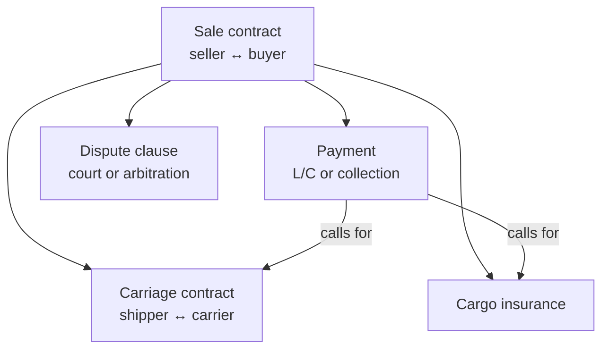

# 4. International Trade Law: Contracts, CISG, and Remedies

> **Teaching rewrite** of trade-law foundations for exporters and importers. Pedagogical summaries only — not legal advice and not the text of the CISG, ICC rules, or any handbook. For a live deal, read the primary sources and talk to counsel in the relevant jurisdiction.

## Introduction

An export sale is never just one contract. Behind a single shipment sit a **chain of linked agreements**: the sale itself, the carriage contract, the cargo insurance policy, the payment instrument, sometimes an inspection order and a customs broker mandate. Each link is governed by a **different body of rules**. When the links agree, the deal runs quietly. When one link is silent or contradicts another — the insurance does not cover what the sale promised, the letter of credit asks for a document the carriage contract cannot produce — the gap surfaces at the worst moment: when goods are lost, late, or rejected.

This lesson gives you the legal map an operator needs:

- **Which law governs which link** of the transaction chain
- Why the **sale contract is the “master”** and must be complete and written
- How **civil law, common law, and Shari’a** traditions shape business habits
- **Jurisdiction and choice of law** — where disputes go and which law decides them
- The **CISG** (UN sales convention): scope, key rules, and the battle of the forms
- **Breach and remedies** — and the money logic of whether suing is even worth it
- **Pre-contract** risk: offers, acceptances, letters of intent, and model contracts

**Assumptions.** We take the viewpoint of a business-to-business sale of goods across a border. Consumer sales, services-heavy deals, and land or securities transactions follow other rules and are out of scope.

---

## 4.1 The legal map of one export deal

Think of the sale contract as the hub and every other contract as a spoke that must **conform** to it.

| Link | Typical governing rules | What goes wrong |
|---|---|---|
| **Sale** | National commercial law **or** the CISG | Missing terms; conflicting forms |
| **Delivery / trade terms** | Incoterms® (seller ↔ buyer only) | Confusing the sale term with the carriage contract |
| **Carriage** | Mode-specific transport law and treaties (e.g. Hague / Hague-Visby for sea) | Carrier liability far lower than the cargo value |
| **Payment** | ICC uniform rules (e.g. UCP 600 for documentary credits) | Credit asks for documents the seller cannot produce |
| **Insurance** | Under CIF/CIP: seller buys at least minimum cover at contract price + 10% | Minimum cover misses theft or war risks |
| **Disputes** | Choice-of-law and forum / arbitration clause | No clause → overlapping courts, unknown law |

**Example.** A buyer opens a letter of credit that requires an “on board” ocean bill of lading plus an inspection certificate. The seller now *must* book carriage that issues that exact document and hire an inspector — the payment spoke dictates the carriage and inspection spokes. If the sale contract never said which documents the credit may demand, the seller discovers the burden only when the credit arrives.

:::tip Use models as a checklist
Published model contracts (for sale, agency, distribution, and so on) are useful even when you never sign one: line up the counterparty’s draft against the model clause by clause and see what is missing or one-sided.
:::

<GuidedChoiceExplanation preset="trade-law-contract-chain" />

---

## 4.2 Complete, precise, written contracts

When anything goes wrong, the parties first reach for the contract. If it is **silent or vague**, the only remaining tools are expensive and adversarial: litigation or arbitration. A good contract is less a weapon than a **record of what both sides understood** — most disputes are prevented by the conversation that produced it.

Habits that cause trouble:

- Rushing to sign whatever form the other side presents because the deal “feels done”
- Treating a terse commodity-style confirmation as adequate for a complex manufactured product
- Relying on a **handshake** and goodwill for terms that matter (inspection periods, warranty, remedies)
- Assuming you have no leverage against a standard form — you can often send back an acceptance that **excludes a specific clause**

### Case snapshot — signing what you cannot read

*Paraphrased from a reported U.S. appellate decision (MCC-Marble Ceramic v. Ceramica Nuova d’Agostino, 11th Cir. 1998).* A U.S. tile importer agreed price, quantity, and delivery orally with an Italian manufacturer at a trade fair, then signed the maker’s pre-printed form whose terms were written in Italian — a language the buyer could not read. When the buyer later complained about quality without following the form’s notice procedure, the seller relied on the printed terms. The appeal turned on whether evidence of the oral side-understanding could be heard; because the **CISG** governed (not domestic U.S. contract law), the court allowed it.

**Lesson for operators:** the buyer only escaped through a long appeal. Never sign terms you have not read in a language you understand; get a translation first.

### Oral agreements

Under the CISG, a contract **need not be in writing** to be valid. Some national laws do require writing, and many contracts contain an **entire-agreement / merger clause** saying only the written document counts and changes must be written. Even where an oral promise is enforceable, you must **prove** it — typically through the parties’ conduct, a prior **course of dealing** between them, or an established **trade usage**.

<GuidedChoiceExplanation preset="trade-law-written-contracts" />

---

## 4.3 Legal families: civil law, common law, Shari’a

| Family | Where (examples) | Main source of law | Role of the judge |
|---|---|---|---|
| **Civil law** | France, Germany, Italy, most of continental Europe, Japan, much of Latin America | Comprehensive **codes** (rooted in Roman law; shaped by the French 1804 and German 1896 codes) | Applies the code; may take an active, investigative role; precedent is persuasive |
| **Common law** | England, U.S., Canada, Australia, New Zealand, Nigeria | Statutes **plus binding precedent** | Bound by prior decisions; creates new law for novel cases |
| **Shari’a** | Many Muslim-majority states (e.g. Saudi Arabia, Iran, Pakistan, Egypt — applied to differing degrees) | Religious sources (Qur’an, Prophetic tradition, scholarly interpretation) | Strong respect for commercial custom; compatible with arbitration |

**Why this matters on the desk**

- Contracts drafted by U.S. lawyers are famously **long**: freedom of contract plus a litigious market reward spelling everything out. Civil-law counterparts often find this excessive, because the code supplies default rules.
- In Islamic-law markets, doctrines such as **riba** (often read as prohibiting interest) shape financing — expect profit-sharing or mark-up structures rather than plain interest-bearing credit.
- Even two common-law systems (U.S. and England) differ on important points. Never assume “same family” means “same rule”.

---

### Checkpoint: the contract chain and legal families

<MultipleChoice
  id="ib-export-import-ch4-mid1"
  title="Checkpoint — sections 4.1 to 4.3"
  questions={[
    {
      prompt: 'Goods worth USD 500,000 are damaged at sea under a CIF sale. Which rules decide how much the carrier must pay the cargo owner?',
      choices: [
        'The CIF Incoterm in the sale contract',
        'The carriage contract and the applicable sea-transport law (e.g. Hague-Visby)',
        'UCP 600',
        'The buyer’s general conditions of purchase',
      ],
      answer: 1,
      why: 'Incoterms® allocate duties between seller and buyer; carrier liability sits in the carriage link.',
      whyWrong: 'UCP 600 governs banks under documentary credits, not carriers.',
    },
    {
      prompt: 'Under the CISG, a deal agreed only by phone is…',
      choices: [
        'Void, because sales must be signed',
        'Valid, but its terms must still be proven (conduct, course of dealing, usage)',
        'Valid only if under USD 5,000',
        'Automatically governed by the seller’s printed conditions',
      ],
      answer: 1,
      why: 'No writing requirement under the CISG — but proof, and any merger clause, still matter.',
    },
    {
      prompt: 'A judge mainly applies a comprehensive code and treats past rulings as persuasive only. Which legal family?',
      choices: ['Common law', 'Civil law', 'Shari’a', 'Lex mercatoria'],
      answer: 1,
      why: 'Codes are the defining feature of civil law; binding precedent is the mark of common law.',
    },
    {
      type: 'order',
      prompt: 'Rank the links of a documentary-credit sale in the order they must be put in place.',
      items: [
        'Agree the sale contract, including which documents the credit may require.',
        'Buyer opens a letter of credit that conforms to the sale contract.',
        'Seller books carriage and insurance that will produce the documents the credit demands.',
        'Seller presents the transport, insurance, and other documents to the bank.',
      ],
      why: 'The sale defines the credit; the credit defines which carriage and insurance documents are needed; the documents can only be presented once those contracts are performed.',
      whyWrong: 'Booking carriage before the credit is opened risks producing the wrong document type for the bank.',
    },
  ]}
/>

---

## 4.4 Jurisdiction and choice of law

**Jurisdiction** = a court’s or tribunal’s power to hear a dispute. Without a clause, courts in **several countries** may each claim it, and each may apply its own conflict-of-laws reasoning. A well-drafted contract answers two separate questions:

### a. Which law applies?

Parties are generally free to choose. The stronger party usually pushes its own law. If nothing is chosen, the court or tribunal runs a **conflict-of-laws** analysis to find the most appropriate law; arbitrators have wider freedom to pick the rules they consider appropriate.

In arbitration there can be **two** laws: the **substantive** law of the contract and the **procedural** law (usually that of the seat). National courts always use their own procedure.

### b. Which forum decides?

Options: the national courts of one party, a neutral court, or **arbitration** (e.g. ICC arbitration). Certain matters — labour disputes, for instance — may be reserved to particular national courts regardless of the clause. If you choose arbitration, specify:

1. Applicable (substantive) law
2. **Seat** of arbitration
3. Language
4. Number of arbitrators (usually 1 or 3)

…and use a recognised model arbitration clause rather than inventing wording.

**Why the forum matters so much:** foreign litigation means travel, local counsel, translation of documents, and executive time. Securing your **home forum** can deter the counterparty from suing at all — which is exactly why each side resists the other’s courts.

:::info Choice-of-court treaty
The **Hague Convention on Choice of Court Agreements (2005)** supports enforcing exclusive forum clauses and the resulting judgments among its parties. Uptake was very slow at first; it has since entered into force for the EU, Mexico, Singapore, the UK and others. Check current status for the countries in your deal.
:::

<GuidedChoiceExplanation preset="trade-law-dispute-clause" />

---

## 4.5 The CISG (UN Convention on Contracts for the International Sale of Goods)

Most national sales laws and the CISG distil centuries of merchant practice — the **lex mercatoria** — so they share much of their logic. The CISG gives one uniform set of rules for **forming** and **performing** international sale contracts and has been adopted by most major trading nations (now well over 90 states).

Critics say it leans toward **buyers**; supporters say its balance lets parties stop fighting to impose their own domestic law. Either way, every trader should know its outline.

:::caution “New York law” may mean CISG
If both parties are in CISG states and the contract says only “governed by New York law”, the CISG still applies — it is *part of* U.S. (federal) law. To exclude it you must say so expressly, e.g. “the CISG does not apply”.
:::

### a. Scope — four limits

1. **International sales only.** It applies when the parties have places of business in different CISG states; or when conflict rules lead to the law of a CISG state; or when parties expressly opt in.
2. **Excluded sales.** Consumer purchases; ships, aircraft, electricity; securities; contracts where **services predominate** (parties may opt back in).
3. **Topics it does not cover.** **Trade terms** (it defers to usages such as Incoterms®) and **passing of title / property** (left to national law).
4. **Freedom of contract.** Parties may exclude the CISG entirely, vary any provision, or use it as the main law with a named national law to **fill gaps**.

### b. Key provisions for operators

| Topic | CISG default (paraphrased) | Exporter’s drafting move |
|---|---|---|
| **Form** | Oral contracts are valid; no signed writing needed | Add an entire-agreement clause and require written modifications |
| **Usages & course of dealing** | Parties are bound by agreed usages and their own established practices; courts increasingly treat Incoterms® as such a usage | Still cite the Incoterm and edition expressly |
| **Offer** | Must be sufficiently definite: identifies goods and fixes (or provides a way to fix) quantity and price | Mark price lists “not an offer” if you do not intend to be bound |
| **Acceptance** | Effective when it **reaches** the offeror; offer can no longer be revoked once acceptance is **dispatched** | Track acceptance dates; set validity periods |
| **Battle of the forms** | An acceptance with **material** changes (price, quantity, quality, delivery, payment, liability, disputes) = rejection + counter-offer; **non-material** changes form a contract unless promptly objected to | Send your own acknowledgement with your conditions — aim to “fire the last shot”; negotiate openly on any clause you truly cannot accept |
| **Delivery & risk** | Covered more thinly than Incoterms® | Incorporate the Incoterm explicitly |
| **Documents & L/Cs** | Banks under UCP 600 deal in **documents, not goods** | Reference UCP 600 in the clause describing the seller’s document duties |
| **Title** | Not covered (nor by Incoterms®) | State when title passes (e.g. retention until paid) and check local enforceability |
| **Conformity / warranty** | Goods must match the contract in quantity, quality, description, and be fit for ordinary purposes and for any particular purpose made known to the seller | Define specs and limit implied warranties where the law allows |
| **Inspection & notice** | Buyer must examine promptly and give notice of non-conformity within a **reasonable time** or lose the claim | Fix a short, concrete notice period; shift the risk of lost notices (overriding the CISG default that the sender is protected) |

<GuidedChoiceExplanation preset="trade-law-cisg-battle-forms" />

---

### Checkpoint: jurisdiction and the CISG

<MultipleChoice
  id="ib-export-import-ch4-mid2"
  title="Checkpoint — sections 4.4 and 4.5"
  questions={[
    {
      prompt: 'An ICC arbitration is seated in Geneva but the contract is governed by Swedish law. Which statement is right?',
      choices: [
        'Impossible — seat and governing law must match',
        'Swedish law decides the substance; procedure follows the law of the seat',
        'Swiss law decides everything',
        'The arbitrators must apply the CISG only',
      ],
      answer: 1,
      why: 'Arbitration can involve two laws: substantive (chosen by parties) and procedural (usually the seat).',
    },
    {
      prompt: 'Which question must you answer with national law because the CISG does not cover it?',
      choices: [
        'Is the reply an acceptance or a counter-offer?',
        'Were the goods fit for their ordinary purpose?',
        'When does ownership of the goods pass to the buyer?',
        'Did the buyer give notice of defects in time?',
      ],
      answer: 2,
      why: 'Title / property transfer is outside the CISG (and outside Incoterms®).',
    },
    {
      prompt: 'An offeree posts an acceptance on Monday. On Tuesday the offeror tries to revoke the offer. The acceptance arrives Wednesday. Under the CISG…',
      choices: [
        'The revocation works — the acceptance had not yet arrived',
        'The revocation is too late; the contract is concluded when the acceptance arrives on Wednesday',
        'No contract — both messages cancel out',
        'The contract dates from Monday and the revocation is a breach',
      ],
      answer: 1,
      why: 'An offer cannot be revoked once acceptance is dispatched; the acceptance becomes effective when it reaches the offeror.',
      whyWrong: 'Dispatch blocks revocation, but the contract still forms on receipt, not on posting.',
    },
    {
      type: 'order',
      prompt: 'Rank these events in CISG contract formation from first to last.',
      items: [
        'Offeror sends a sufficiently definite offer.',
        'The offer reaches the offeree and becomes effective.',
        'Offeree dispatches an unconditional acceptance — the offer can no longer be revoked.',
        'The acceptance reaches the offeror — the contract is concluded.',
      ],
      why: 'Each step depends on the previous one: an offer is effective on arrival, acceptance is possible only after that, dispatch freezes revocation, receipt concludes the contract.',
    },
  ]}
/>

---

## 4.6 Performance, breach, and remedies

Most contracts are performed well enough, and small slips get forgiven. That comfort is dangerous: the clauses matter for the **rare** serious breach, and sloppy habits in good years become evidence of waiver in bad ones.

**Curing and waiver.** Some breaches are **curable** — a seller who delivers non-conforming goods early may still deliver conforming goods before the deadline. Forgiving a minor breach (goods a day late) is common, but forgiving it **repeatedly** can be read as a waiver of the right. Two protections:

- A clause that changes to rights must be in a **signed writing** (not enforceable everywhere)
- **Objecting in writing** to small breaches, even when you accept the goods, so a paper trail shows you did not waive

### a. What determines the remedy

1. **The contract** — e.g. a liquidated-damages clause fixing compensation for late delivery
2. **The applicable law** — common-law courts are more reluctant than civil-law courts to order specific performance
3. **The gravity of the breach**
   - **Substantial performance:** the bulk was performed and the shortfall is minor → usually only a price reduction
   - **Fundamental breach:** the breach deprives the other side of what it essentially bargained for → it may **terminate (avoid)** the contract

### b. Remedies menu

| Remedy | Idea | Watch-outs |
|---|---|---|
| **Money damages** | Compensation for the loss; may take the form of a price reduction or lump sum | Must be proven |
| **Consequential damages** | Foreseeable knock-on losses (e.g. a buyer’s plant idles for lack of parts) | Exporters often **exclude** them by contract |
| **Mitigation** | The injured party must take reasonable steps to limit its loss | A buyer of off-spec but saleable produce must try to resell, not let it rot |
| **Termination / avoidance** | Ends remaining obligations after a serious breach | Wrongful termination is itself a breach |
| **Specific performance** | Court orders the party to perform (pay, deliver, replace) | Common law: only when damages are inadequate; rarely sought in practice |

The CISG allows the full range — specific performance, substitute goods, price reduction, damages. Exporters commonly **cap liability** and exclude consequential damages, price reduction, or specific performance where enforceable.

### c. Is suing worth it? A worked example

A Bolivian buyer suffers **USD 50,000** of loss from a U.S. seller’s breach. Before suing, estimate the economics:

| Input | Estimate |
|---|---|
| Claim value | USD 50,000 |
| Own legal + forum costs to trial (foreign court) | USD 30,000 |
| Executive time, travel, translation | USD 8,000 |
| Probability of winning | 60% |
| If lost and **loser pays** applies: other side’s costs | USD 25,000 |

Expected value ≈ 0.60 × 50,000 − (30,000 + 8,000) − 0.40 × 25,000
= 30,000 − 38,000 − 10,000 = **−USD 18,000**

Even with a good case, suing abroad destroys value here. Every deal has a **threshold** below which litigation is irrational — and the forum and law clauses largely set where that threshold sits. (Collection risk on the judgment would push the number lower still.)

Below the threshold you need **non-legal safeguards**: export credit insurance, advance deposits, bank guarantees or performance bonds, and good credit information on the counterparty.

Also beware the **mirror risk**: being sued in a distant court. Ignore it and the claimant may win a **default judgment** that is later enforced against you — which is why parties resist forum clauses pointing to the other side’s home courts.

<GuidedChoiceExplanation preset="trade-law-remedies" />

---

## 4.7 Negotiations and pre-contract liability

A contract is formed when a **definite offer** meets an **unconditional acceptance**. But contact starts much earlier — a catalogue, an inquiry, a request for tenders — and statements made along the way can matter.

- **General rule:** negotiating statements do not bind unless incorporated into the contract; courts let parties negotiate freely.
- **Exception:** if a contract results and a pre-contract statement was **misleading**, the party that made it can be liable. Apply common-sense **good faith**; avoid statements the other side is likely to rely on to its detriment.

### a. Offers and tenders

An offer (tender) is addressed to a specific buyer, typically covering product, price, payment, and delivery, with the **intention to be bound** on acceptance. Whether a price quotation is an offer turns mainly on that intention. A tender is also a **sales document**: it should be professional, complete, and carry key selling points and specifications alongside general conditions, delivery time, and payment terms.

### b. Acceptance

An acceptance must generally be **unconditional**. A conditional reply is usually a **counter-offer**, unless (under the CISG) the change is minor and the offeror does not promptly object. Make sure both sides have expressly agreed the **same** set of terms — easy to skip in fast email exchanges.

### c. Letters of intent, MOUs, and other preliminary agreements

LOIs, MOUs, heads of agreement, commitment letters, and “agreements to agree” help when a major condition is still open (a bank loan approval, a government licence) or when parties settle basic points while negotiating the rest. The document itself may help unlock the approval.

The danger is a **two-sided trap**:

| Too vague / many disclaimers | Too detailed / no disclaimer |
|---|---|
| Bank or ministry will not rely on it | A court may hold it is already a **binding contract** |

Disclaimers like “not intended to create a binding contract” help but are not decisive everywhere. If terms are intentionally left open, the key question becomes whether there is a **fallback mechanism** a court could use to fill them. Rule of thumb: **do not sign even a preliminary document you would not be prepared to perform** if the other side accepted it.

---

## 4.8 Model and standard contracts

Many sectors run on standard forms — commodity markets almost require them.

| Source | Typical use |
|---|---|
| **FIDIC** (e.g. the “Red Book” for civil-engineering works) | International construction and engineering projects, often tendered in developing markets |
| **Orgalime** general conditions | Supply of mechanical and electrical products (European engineering industries) |
| **UNECE** general conditions | Supply and erection of plant and machinery (goods + services) |
| **Legal form books** and in-house precedent banks | Drafting starting points, tested in prior deals |
| **ICC model contracts** | Neutral templates for international sale, agency, distribution, franchising, intermediaries, turnkey projects, confidentiality, and more |

**Worst use of a form:** sign it unread. **Best use:** walk every clause before negotiating, mark each as favourable / neutral / unfavourable to you, and plan your asks.

---

### Rank: from negotiation to dispute-ready contract

<MultipleChoice
  id="ib-export-import-ch4-rank"
  title="Sequence the legal workflow"
  questions={[
    {
      type: 'order',
      prompt: 'Order these steps for closing a cross-border sale on your own terms when the buyer sends its purchase order with printed conditions.',
      items: [
        'Read the buyer’s purchase order and its printed conditions (with a translation if needed).',
        'Flag material differences from your own conditions — price, quantity, quality, delivery, payment, liability, disputes.',
        'Negotiate openly on any material clause you cannot accept.',
        'Send your acknowledgement with your general conditions, including the agreed changes (fire the last shot).',
        'Keep a written record of every later modification or objection to small breaches.',
      ],
      why: 'You must know the terms before you can classify them; material gaps are negotiated before your acknowledgement locks in the deal; afterwards, written records protect against waiver claims.',
      whyWrong: 'Sending your acknowledgement before reading and negotiating can create a contract — or a counter-offer battle — on terms you never checked.',
    },
    {
      type: 'order',
      prompt: 'Order the cost-benefit analysis before deciding whether to sue a foreign counterparty.',
      items: [
        'Quantify the loss actually caused by the breach.',
        'Check the contract’s law, forum, and remedy clauses (caps, exclusions, liquidated damages).',
        'Estimate legal fees, forum costs, travel, translation, and executive time.',
        'Weigh the probability of winning and the cost exposure if you lose (loser-pays).',
        'Decide: sue/arbitrate, negotiate, or rely on non-legal safeguards such as credit insurance or a bank guarantee.',
      ],
      why: 'The claim value and the contract clauses define what can be recovered and where; only then can costs and odds be estimated and compared to reach a decision.',
      whyWrong: 'Estimating costs before reading the forum clause is guesswork — the forum is the biggest driver of cost.',
    },
  ]}
/>

---

### Check: international trade law

<MultipleChoice
  id="ib-export-import-ch4"
  title="International trade law"
  questions={[
    {
      prompt: 'Which statement best describes the role of the sale contract in an export deal?',
      choices: [
        'It is one contract among equals; the L/C overrides it',
        'It is the “master” contract that the payment, carriage, and insurance contracts should conform to',
        'It only matters for domestic sales',
        'Incoterms® replace it entirely',
      ],
      answer: 1,
      why: 'The other links implement the sale; if the sale is silent, the subsidiary contracts drift out of alignment.',
      whyWrong: 'A letter of credit is independent of the sale but should be opened to match it — it does not replace it.',
    },
    {
      prompt: 'Incoterms® in the sale contract also determine the carrier’s liability to the shipper.',
      choices: [
        'True — FOB and CIF fix the carrier’s liability limits',
        'False — carrier liability comes from the carriage contract and transport law/treaties',
      ],
      answer: 1,
      why: 'Incoterms® allocate duties between seller and buyer only; carriage law (e.g. Hague-Visby for sea) governs the carrier.',
    },
    {
      prompt: 'Both parties are in CISG states. The contract says only “governed by the laws of New York”. What applies to the sale?',
      choices: [
        'The New York UCC only, because it was named',
        'The CISG, because it is part of U.S. law and was not expressly excluded',
        'No law — the clause is void',
        'ICC arbitration rules',
      ],
      answer: 1,
      why: 'Choosing the law of a CISG state brings the Convention in; exclusion must be explicit.',
    },
    {
      prompt: 'Which sale is outside the CISG by default?',
      choices: [
        'A German manufacturer selling machine parts to a Brazilian distributor',
        'A retailer selling a TV to a consumer for home use',
        'A Chinese exporter selling steel coils to a Canadian importer',
        'A French winery selling cases to a U.S. wholesaler',
      ],
      answer: 1,
      why: 'Consumer sales are excluded; the others are B2B international goods sales.',
    },
    {
      prompt: 'Under the CISG, the buyer’s acceptance changes the delivery date. What is the usual result?',
      choices: [
        'A contract on the seller’s terms',
        'A contract on the buyer’s terms automatically',
        'A rejection and counter-offer, because delivery date is a material term',
        'The contract is void forever',
      ],
      answer: 2,
      why: 'Material changes (price, quantity, quality, delivery, payment, liability, disputes) turn the reply into a counter-offer.',
      whyWrong: 'Only non-material changes form a contract unless the offeror promptly objects.',
    },
    {
      prompt: 'Which topic does the CISG leave to national law?',
      choices: [
        'Conformity of the goods',
        'Formation by offer and acceptance',
        'When title (property) in the goods passes',
        'Buyer’s duty to give notice of defects',
      ],
      answer: 2,
      why: 'Neither the CISG nor Incoterms® govern transfer of property — draft it and check local law.',
    },
    {
      prompt: 'A buyer receives off-spec but saleable tomatoes and lets them rot, then claims the full value. Which principle hurts the claim?',
      choices: ['Specific performance', 'Mitigation of damages', 'Substantial performance', 'Parol evidence'],
      answer: 1,
      why: 'The injured party must take reasonable steps to limit its loss, e.g. reselling the produce.',
    },
    {
      prompt: 'Claim: USD 40,000. Expected costs to trial abroad: USD 35,000. Win probability: 50%. Loser pays the other side’s ~USD 20,000 if you lose. Expected value of suing?',
      choices: ['+USD 5,000', '−USD 15,000', '−USD 25,000', '+USD 20,000'],
      answer: 2,
      why: '0.5 × 40,000 − 35,000 − 0.5 × 20,000 = 20,000 − 35,000 − 10,000 = −25,000.',
      whyWrong: 'Remember to weight both the recovery and the loser-pays exposure by their probabilities, and subtract your own costs in full.',
    },
    {
      prompt: 'Which is the safest approach to a letter of intent while a bank loan is still pending?',
      choices: [
        'Make it fully detailed with no disclaimer so the bank trusts it',
        'Make it vague and full of disclaimers',
        'Only sign terms you would be prepared to perform, and state clearly which parts are (non-)binding',
        'Never write anything down until the loan is approved',
      ],
      answer: 2,
      why: 'Too detailed risks being binding; too vague is useless to the bank. Sign only what you could live with.',
    },
    {
      prompt: 'In which legal family are judges strictly bound by prior court decisions?',
      choices: ['Civil law', 'Common law', 'Shari’a', 'None — no system uses precedent'],
      answer: 1,
      why: 'Common law relies on binding precedent; civil-law judges treat precedent as persuasive and apply codes.',
    },
  ]}
/>

---

## Takeaways

:::tip Remember
- An export deal is a **chain of contracts**; the **sale** is the master — draft it fully and in writing
- Never sign terms you cannot read; oral side deals are hard to prove
- Always choose **law + forum** (or arbitration seat, language, arbitrators)
- The **CISG** applies by default between member states — exclude it **expressly** if you must
- Material changes in an acceptance = **counter-offer**; try to fire the last shot
- CISG does **not** cover trade terms or **title** — add Incoterms® and a title clause
- Price the lawsuit before filing it; below the threshold, rely on **credit insurance, deposits, guarantees**
- LOIs cut both ways — do not sign what you would not perform
:::

## Further Reading

- [3. Incoterms® trade terms](./incoterms-trade-terms) — the delivery terms the CISG defers to
- [2. Documents and the transaction sequence](./documents-and-transaction-sequence)
- [1. Introduction to export–import](./introduction-to-export-import)
- [International Business home](../intro)
- Next: [5. The international sale contract](./international-sale-contract) — forms, ICC model, key clauses
- Later (planned): payment instruments (L/Cs in depth) · carriage documents
- Primary sources: CISG text ([UNCITRAL](https://uncitral.un.org/)); Hague Choice of Court Convention ([HCCH](https://www.hcch.net/)); ICC model contracts and arbitration clause ([ICC](https://iccwbo.org/))
