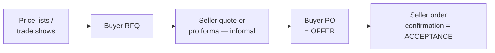
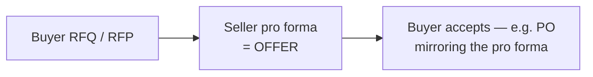

# 5. The International Sale Contract: Forms, Models, and Key Clauses

> **Teaching rewrite** built around the structure of the ICC Model International Sale Contract. Pedagogical summaries only — not the ICC contract text, and clause/article numbers and default values change between editions. Buy the **current** ICC edition before relying on any number quoted here.

## Introduction

Every export or import needs a **contract of sale**. Sometimes it is one signed document; far more often it is assembled from an exchange of business forms — the seller’s **pro forma invoice**, the buyer’s **purchase order** — each pointing to its own **general conditions** printed on the back or in a separate handbook.

Lesson 4 gave you the legal map: the sale contract is the master of the transaction chain, the CISG often governs it, and conflicting forms trigger a “battle of the forms”. This lesson zooms into the contract itself:

- How sale contracts are **actually formed** in practice (PO as offer vs pro forma as offer)
- What general conditions, **standard industry contracts**, and **model contracts** each do
- Which transactions a spot sale contract is **not** built for
- How the ICC model’s **two-part structure** (Specific + General Conditions) works
- A clause-by-clause tour: goods, price, delivery, inspection, **retention of title**, payment, documents, lateness, liability caps, time-bar, law, disputes, **force majeure**

**Assumptions.** A one-off (“spot”) B2B sale of **manufactured goods intended for resale** — appliances, tools, textiles, apparel, furniture, office products. Commodity trades (grain, ore, chemicals) and consumer sales use different forms and rules.

---

## 5.1 The sale contract as conductor

Picture the transaction as an orchestra. The **sale contract** is the conductor; the letter of credit, the carriage contract, the insurance policy, and the inspection order each play their part — but only in tune if they follow the sale.

| Question to ask before shipping | Why it matters |
|---|---|
| Does the insurance policy give at least the cover the sale’s Incoterm requires? | Under CIF/CIP the seller owes minimum cover; under-insuring is a breach |
| Is the transport document the one the Incoterm and the credit expect? | A wrong document type = discrepant presentation, unpaid seller |
| Do the L/C terms match the sale contract exactly? | Goods described one way in the contract and another in the credit invite rejection |

The ICC model was designed to run under the **CISG**, which applies automatically between parties in contracting states unless **expressly** excluded (a bare choice of national law is usually not enough). Whether to exclude it is a strategic legal decision — get counsel.

---

## 5.2 How sale contracts are formed in practice

Every contract needs an **offer** and an **acceptance**. In trade there are two common paths.

### a. Purchase order as the offer

After price, quality, and quantity are discussed, the buyer issues a **PO**. That PO is the first binding offer, and usually incorporates the **buyer’s** general conditions of purchase (sometimes a whole supplier compliance manual). The seller’s confirmation accepts it.

### b. Pro forma invoice as the offer

Here the seller’s **pro forma invoice** is the binding offer; the buyer only has to accept. For complex sales the buyer’s request is often called an **RFP** (request for proposal).

Why pro formas are popular:

- The buyer sees what the **final commercial invoice** will look like — total landed cost is easier to judge
- **Banks** prefer to open letters of credit against a firm pro forma rather than loose emails
- Some customs authorities (e.g. the U.S.) may accept a pro forma in place of a commercial invoice at import

**Who controls the terms?** Whoever makes the binding offer usually anchors the terms — which is why each side wants its own form (and conditions) to be the offer, or to “fire the last shot” as you saw in Lesson 4.

### c. General terms and conditions

Transaction forms carry the **deal details**: price, goods, quantity, payment, delivery. The **legal background** — governing law, warranties, damages, termination, disputes — lives in a separate set of **general conditions of sale (or purchase)**, typically on the reverse with a reference on the front. Inexperienced traders often have no general conditions at all, or ones that omit what international deals need.

### d. Standard industry contracts

Some sectors run on association forms that are almost mandatory:

| Sector | Standard forms (examples) |
|---|---|
| Cocoa (U.S. imports) | Cocoa Merchants’ Association of America contracts |
| Grain, feed, rice, oilseeds | **GAFTA** standard contracts |
| Engineering, electrical/mechanical | **FIDIC**, **Orgalime** |

:::caution Trade-association FOB ≠ Incoterms® FOB
Industry forms sometimes define FOB or CIF their own way. If you mean the ICC definitions, write the rule **and** “Incoterms® [year]”.
:::

### e. Three ways to use a model contract

1. **As is** — fill in the blanks (parties, goods, price, payment, delivery, disputes) and use it as your contract.
2. **As a drafting source** — mine it when writing your own forms or general conditions.
3. **As a negotiating lever** — when the other side’s clause is harsh, point to the more balanced model wording as a neutral benchmark.

<GuidedChoiceExplanation preset="sale-contract-formation" />

---

## 5.3 Right contract for the right deal

Recycling a form you used before is tempting — and a classic mistake. A spot sale contract lacks the machinery other relationships need.

| Transaction | Why a spot sale contract does not fit |
|---|---|
| **Long-term supply** | Needs price escalation / adjustment, delivery schedules, partial deliveries, lead-time rules |
| **IP licence / technology transfer** | No tangible goods — outside sales law like the CISG |
| **Services** | Outside the CISG; local tax, labour, and employment law may override the contract |
| **Agency & distribution** | Long-term marketing relationships, often under mandatory local agency laws |
| **Custom manufacture** | Requires collaboration on specs before and during production |
| **Mergers & acquisitions** | Transfers shares or company interests under detailed company law |

ICC publishes separate models for many of these (agency, distributorship, franchising, occasional intermediary, turnkey plant, selective distribution, M&A, and others).

:::info Mixed goods + services
If services or labour form the **preponderant** part of the seller’s obligations, the CISG does not apply automatically — but parties may opt in so it governs the goods portion.
:::

---

## 5.4 The two-part structure of the ICC model

| Part | What it holds | Analogy |
|---|---|---|
| **A. Specific Conditions** | Fill-in form for this deal: parties, goods, price, Incoterm, delivery time, inspection, retention of title, payment, documents, cancellation date, liability options, law, disputes | Pro forma invoice / purchase order |
| **B. General Conditions** | Standard legal terms plus **fallback rules** that apply when a Specific Condition is left blank or unclear | Your general conditions of sale |

Ways to use it:

- Send the **Specific Conditions form** in place of a pro forma or PO (paper or digital)
- Keep your own sales forms but **incorporate** the General Conditions by appending them or by reference, e.g. *“This contract is subject to the General Conditions of the ICC Model International Sale Contract.”*

**Who benefits most?** Large multinationals have their own conditions and rarely use general models (apart from sector forms). The model is aimed at **new and smaller exporters/importers** who would otherwise reuse domestic forms that lack international provisions. Large-company counsel, meanwhile, have shifted from reflexively excluding the CISG to choosing it **strategically** when its rules beat a given national law.

---

### Checkpoint: forms, models, and structure

<MultipleChoice
  id="ib-export-import-ch5-mid1"
  title="Checkpoint — sections 5.1 to 5.4"
  questions={[
    {
      prompt: 'A seller replies to an RFP with a firm pro forma invoice. The buyer answers with a PO that mirrors it exactly. Which document was the offer?',
      choices: ['The RFP', 'The pro forma invoice', 'The PO', 'Neither — no contract exists yet'],
      answer: 1,
      why: 'In the “pro forma as offer” path the pro forma is the binding offer and the mirroring PO accepts it.',
    },
    {
      prompt: 'Which deal is the best fit for a one-off sale contract like the ICC model?',
      choices: [
        'A five-year supply agreement with price escalation',
        'A single shipment of office chairs to a distributor for resale',
        'A software licence',
        'Installing and maintaining a factory line on site for three years',
      ],
      answer: 1,
      why: 'The model targets spot B2B sales of manufactured goods for resale; the others need long-term, IP, or service terms.',
    },
    {
      prompt: 'A small exporter wants to keep its own pro forma layout but use ICC legal terms. Simplest approach?',
      choices: [
        'Copy the ICC General Conditions’ wording into the price field',
        'Incorporate the ICC General Conditions by appending them or by an express reference clause',
        'Write “ICC” next to the Incoterm',
        'It is not possible to mix them',
      ],
      answer: 1,
      why: 'The General Conditions can be attached or incorporated by reference to your own forms.',
    },
    {
      type: 'order',
      prompt: 'Rank the steps of a “pro forma as offer” deal that will be paid by letter of credit.',
      items: [
        'Buyer sends a request for quotation or proposal.',
        'Seller issues a firm pro forma invoice — the offer.',
        'Buyer accepts, e.g. with a PO mirroring the pro forma.',
        'Buyer applies to its bank for a credit based on the agreed terms.',
        'Issuing bank opens the letter of credit in the seller’s favour.',
      ],
      why: 'The request prompts the offer, acceptance concludes the contract, and the credit application relies on the agreed terms before the bank can open it.',
      whyWrong: 'Banks open credits against agreed terms — applying before the pro forma is accepted invites amendments.',
    },
  ]}
/>

---

## 5.5 Clause-by-clause tour

The pattern throughout: **Specific Conditions** let you choose; **General Conditions** supply a **default** if you do not. The digital edition links each blank to its fallback and can warn about poor combinations of Incoterm, payment method, and documents.

### a. Parties

Use the **exact legal name** of the entity you credit-checked — not an affiliate with a similar name. Make it clear whether a signatory binds the **company** or only themself.

### b. Goods sold (description)

The heart of the contract. The **buyer** wants precision; the **seller** wants precision only where it is sure to deliver exactly that.

**Buyer’s view.** Vague words let a seller deliver goods that technically match but are commercially useless:

- “Frozen chickens, Grade A” → buyer expected fryers, got stewing birds
- “Pork livers” → buyer needed female livers for a recipe, got male ones
- “Top quality fish meal” → replace with *“inspection certificate by [named agency] stating minimum 70.75% protein”* — something a bank or court can test

Complex contracts sometimes add a **Definitions** section for technical terms.

**Seller’s view.** Over-precision can backfire:

- Catalogue colours, sizes, or materials may vary slightly in production — leave them out of the description if they are not needed to identify the goods (the model’s General Conditions say advertising specs are **not** contract terms unless expressly referenced).
- Long descriptions get garbled when retyped into L/C documents → **discrepancy** → bank refuses payment. Even delivering *better* goods than described can create a mismatch the buyer must choose to waive.

**Minor deviations.** The model’s General Conditions make the buyer accept **trivial** discrepancies usual in the trade or in the parties’ dealings, with a price reduction for minor quality shortfalls rather than outright rejection — provided the seller acts in good faith to deliver conforming goods within a commercially reasonable time.

#### Case snapshot — “What is chicken?”

*Paraphrased from Frigaliment Importing v. B.N.S. International Sales (S.D.N.Y. 1960).* A Swiss importer bought a large quantity of “chicken” from a U.S. exporter. The first shipment contained older stewing fowl, not the young broilers the importer wanted. The contract never said which. Experts disagreed about trade meaning, and the court held that the importer, as plaintiff, had not proven its narrower reading — so it lost.

**Lesson:** if a specific variety, grade, or property matters to you, **write it in**.

### c. Contract price

State the **currency** and the amount in **figures and words**. If the parties somehow leave price open, the General Conditions provide a fallback method.

### d. Delivery terms

Use an **Incoterms®** rule with a **named place** — and the edition. If none is chosen, the model defaults to **EXW**. Incoterms® allocate costs, risk transfer, customs/security clearance, and (for CIF/CIP) insurance, but they still need your help:

- the **exact point** within the named place
- insurance amount and extent beyond the minimum
- transport constraints (e.g. *no on-deck stowage*)

### e. Time of delivery

A fixed date (*19 March*) or a period (*September*). Default consequence of lateness: modest **liquidated damages** per week late, capped (check the current edition for the percentages) — designed to keep the contract alive. A buyer who truly cannot accept late goods uses a **cancellation date** instead (see j).

### f. Inspection before shipment

Parties may agree **pre-shipment inspection (PSI)**: where, by whom, what is checked. The seller must then notify the buyer when goods are ready. PSI is a strong quality and **anti-fraud** control — but only with a **reputable independent** agency, not an employee or agent of either side.

### g. Retention of title (RoT)

Seller keeps **ownership until paid in full** and may reclaim unpaid goods — crucial if the buyer goes **insolvent** and other creditors compete for its assets.

| Type | What the seller claims |
|---|---|
| **Simple RoT** | Title to the delivered goods until the price is paid |
| **Extended / “all monies”** | Also proceeds of resale, products mixed with or made from the goods, other debts owed by the buyer — or combinations |

- Title transfer is governed by **national law** (not the CISG, not Incoterms®) — check the clause works where the goods will be.
- The ICC model uses a **simple** RoT, the type most widely recognised. Extended clauses are often unenforceable.
- Some countries require **registration** to perfect the seller’s interest.
- **Export credit insurers** often require RoT before covering a buyer: it is the unpaid seller’s consolation prize — less than payment, more than nothing.

### Checkpoint: clauses a–g

<MultipleChoice
  id="ib-export-import-ch5-mid2"
  title="Checkpoint — parties to retention of title"
  questions={[
    {
      prompt: 'You credit-checked “Veronese S.p.A.”, but the contract names “Veronese Trading S.r.l.”, a sister company. The risk?',
      choices: [
        'None — related companies share liability',
        'You are contracting with an entity you never vetted, and may be unable to recover from the one you did',
        'The CISG voids the contract',
        'The Incoterm changes automatically',
      ],
      answer: 1,
      why: 'Name the exact legal entity whose credit you checked.',
    },
    {
      prompt: 'Who should perform pre-shipment inspection to make the certificate credible in a dispute?',
      choices: [
        'The seller’s quality manager',
        'The buyer’s purchasing agent',
        'A reputable independent inspection agency',
        'The carrier',
      ],
      answer: 2,
      why: 'An employee or agent of either side cannot be expected to stay neutral.',
    },
    {
      prompt: 'A seller wants its RoT clause to also cover resale proceeds and goods made from its materials. What should it know?',
      choices: [
        'That is an extended clause whose validity depends heavily on national law',
        'The CISG guarantees it everywhere',
        'Incoterms® CIF includes it automatically',
        'It applies only to services',
      ],
      answer: 0,
      why: 'Simple RoT is widely recognised; extended / all-monies clauses vary by jurisdiction.',
    },
    {
      type: 'order',
      prompt: 'Rank the steps a seller takes to be able to reclaim goods from an insolvent buyer.',
      items: [
        'Include a retention-of-title clause, checked against the law where the goods will be.',
        'Register or perfect the seller’s interest where local law requires it.',
        'Deliver the goods to the buyer.',
        'Buyer fails to pay and becomes insolvent.',
        'Seller asserts its title and reclaims the unsold goods.',
      ],
      why: 'The clause must exist and be perfected before delivery; the right is only exercised after non-payment.',
      whyWrong: 'Registering after the buyer is insolvent is often too late to beat other creditors.',
    },
  ]}
/>

---

### h. Payment conditions

All main methods are available; if none is chosen, the default is **open account by bank transfer, 30 days from invoice**.

| Method | What you specify | Default if details are missing |
|---|---|---|
| **Open account** | Days after invoice; optional **standby L/C** as security | — |
| **Payment in advance** | Optional **advance-payment bond** | Funds available to seller at least **30 days before** agreed delivery |
| **Documentary collection** | **D/P** (documents against payment) or **D/A** (against acceptance) | D/P under ICC collection rules (URC) |
| **Documentary credit** | Confirmation, place of confirmation, sight vs negotiation | Reputable bank, opened **≥30 days** before earliest delivery date; **sight** payment; **no** partial shipments or transhipment; subject to **UCP** |
| **Bank Payment Obligation (BPO)** | Bank-to-bank electronic undertaking | — |

### i. Documents

A checklist of the documents the seller must supply. In a documentary sale — **FOB / CFR / CIF**, and any deal paid by L/C — the **document duty is as important as the goods duty**. The wrong transport document, or under CIF the wrong insurance document, can be a **fundamental breach** under the CISG. Manage export documents meticulously.

### j. Cancellation date

Optional. A firm deadline after which, if goods have not been delivered, the buyer may **cancel immediately** — an alternative to the per-week liquidated damages default.

### k. Liability for delay

Optional override of the default liquidated-damages rate. Warning: set it **too high** and courts in some jurisdictions may treat it as a **penalty** and refuse to enforce it.

### l. Limitation of liability for non-conformity

Lets the seller cap damages for non-conforming goods to proven loss up to a chosen percentage of their price. Default: additional damages capped at **10% of the contract price** (on top of any agreed liquidated damages).

### m. Non-conforming goods kept by the buyer

Default: a buyer who **keeps** non-conforming goods gets a price reduction of **no more than 15%**. Parties may set a different percentage or a flat amount.

### n. Time-bar

Default: the buyer loses legal remedies **four years** after the goods arrive. Parties may shorten or lengthen it.

### o. Applicable law

The model is built to run under the **CISG**, so adding a national law can create conflict. Parties may instead pick another sale law. For gaps the CISG does not cover, the default is the law of the **seller’s place of business** — the buyer can negotiate a different gap-filler (e.g. its own law).

### p. Resolution of disputes

Choose **arbitration** (e.g. ICC, with seat and details) **or litigation** (naming the competent courts).

### q. Force majeure

Excuses performance hindered by impediments beyond a party’s control that were not reasonably foreseeable. Default: either party may **terminate** if force majeure lasts **more than six months**.

Some relief exists even without a clause, but standards differ:

| System | Test (paraphrased) |
|---|---|
| U.S. UCC | Commercial **impracticability** |
| Many civil-law systems | **Force majeure** |
| CISG | Unforeseeable / unavoidable **impediment** |

Because of those differences, parties often use ICC’s model **force majeure and hardship clauses** or draft their own, listing likely impediments: government authorisations, changes in duties or regulations, extreme swings in labour, materials, energy, or freight costs.

<GuidedChoiceExplanation preset="sale-contract-description" />

<GuidedChoiceExplanation preset="sale-contract-defaults" />

---

### Worked example: which default kicks in?

A London exporter and a Turin importer sign the model’s Specific Conditions for a **USD 1,570,000** order but fill in only parties, goods, price, and **FCA Dover Incoterms® 2010**. The goods arrive with a minor defect the buyer decides to live with.

| Question | Blank left? | Result (model defaults as described above) |
|---|---|---|
| Payment method? | Yes | Open account, bank transfer, **30 days** after invoice |
| Max price reduction if the buyer keeps the goods? | Yes | ≤ 15% × 1,570,000 = **USD 235,500** |
| Cap on additional damages for non-conformity? | Yes | ≤ 10% × 1,570,000 = **USD 157,000** |
| Deadline to sue? | Yes | **4 years** from arrival |
| Law for a gap the CISG does not cover? | Yes | Law of the **seller’s** place of business (England) |

Five unfilled boxes, five consequences the parties never discussed. The defaults are reasonable — but they should be **chosen**, not stumbled into.

---

### Rank: building the contract

<MultipleChoice
  id="ib-export-import-ch5-rank"
  title="Sequence the sale-contract workflow"
  questions={[
    {
      type: 'order',
      prompt: 'Order the steps of a “PO as offer” transaction, from first contact to a concluded contract.',
      items: [
        'Seller publicises the product (price list, catalogue, trade show).',
        'Buyer sends a request for quotation (RFQ).',
        'Seller replies with a price quote or informal pro forma.',
        'Buyer issues a purchase order incorporating its general conditions — the binding offer.',
        'Seller confirms the order — the acceptance that concludes the contract.',
      ],
      why: 'Marketing prompts the inquiry; the quote informs the PO; the PO is the first binding offer; the confirmation accepts it.',
      whyWrong: 'In this path the PO — not the quote — is the offer, so the seller’s confirmation must come after it.',
    },
    {
      type: 'order',
      prompt: 'Order the steps for a seller preparing to export under the ICC model with payment by documentary credit.',
      items: [
        'Credit-check the buyer’s exact legal entity.',
        'Agree the goods description, price, Incoterm + named place, and delivery time in the Specific Conditions.',
        'Specify the documentary credit details and the documents list consistent with that Incoterm.',
        'Check the credit, once opened, against the contract (description, documents, dates).',
        'Ship and present conforming documents to the bank.',
      ],
      why: 'You need to know who you are dealing with before negotiating; the commercial terms drive the payment and document choices; the opened credit must be checked against them before shipment and presentation.',
      whyWrong: 'Shipping before checking the opened credit risks documents the bank will reject.',
    },
  ]}
/>

---

### Check: the international sale contract

<MultipleChoice
  id="ib-export-import-ch5"
  title="International sale contract"
  questions={[
    {
      prompt: 'In the “pro forma as offer” path, what concludes the contract?',
      choices: [
        'The buyer’s RFQ',
        'The seller sending the pro forma',
        'The buyer’s acceptance of the pro forma (e.g. a PO mirroring it)',
        'Shipment of the goods only',
      ],
      answer: 2,
      why: 'The pro forma is the offer; the buyer’s acceptance forms the contract.',
    },
    {
      prompt: 'Why might banks prefer a pro forma invoice when opening a letter of credit?',
      choices: [
        'It is a firm offer that shows how the final commercial invoice will look',
        'It replaces the bill of lading',
        'It is legally required by UCP 600 in every credit',
        'It transfers title to the bank',
      ],
      answer: 0,
      why: 'A binding, invoice-like document gives the bank precise terms to mirror.',
    },
    {
      prompt: 'A trader reuses a spot-sale form for a five-year supply relationship. The biggest gap is likely…',
      choices: [
        'No signature line',
        'No price-adjustment mechanism or delivery schedule',
        'Too many Incoterms®',
        'The CISG cannot apply to goods',
      ],
      answer: 1,
      why: 'Long-term supply needs escalation clauses, schedules, and partial-delivery rules.',
    },
    {
      prompt: 'In the ICC model, what happens if the Specific Conditions name no Incoterm?',
      choices: ['DDP applies', 'FOB applies', 'EXW applies', 'The contract is void'],
      answer: 2,
      why: 'The General Conditions fall back to Ex Works — minimum seller duty.',
    },
    {
      prompt: 'Which description best protects an importer of fish meal paid by L/C?',
      choices: [
        '“Top quality fish meal”',
        '“Fish meal as per seller’s catalogue”',
        '“Fish meal, min. 70.75% protein per certificate of [named independent inspector]”',
        '“Fish meal, buyer satisfaction guaranteed”',
      ],
      answer: 2,
      why: 'A measurable spec backed by an independent certificate is testable by banks and courts.',
    },
    {
      prompt: 'An exporter lists exact catalogue colours in a long L/C goods description. The main risk?',
      choices: [
        'None — more detail always helps the seller',
        'Small mismatches in documents create discrepancies and the bank refuses payment',
        'The CISG stops applying',
        'Title passes early',
      ],
      answer: 1,
      why: 'Over-precise descriptions are easily garbled or contradicted in documents.',
    },
    {
      prompt: 'What does a simple retention-of-title clause give the seller?',
      choices: [
        'Ownership of the goods until the price is paid, enabling reclaim if the buyer is insolvent',
        'Automatic rights over all the buyer’s other assets',
        'Title to the proceeds of every resale in all countries',
        'Freedom from national law',
      ],
      answer: 0,
      why: 'Extended “all monies” claims go further but depend heavily on national law.',
    },
    {
      prompt: 'Contract price USD 400,000. The buyer keeps non-conforming goods and the parties left the abatement blank. Under the default described, the maximum price reduction is…',
      choices: ['USD 40,000', 'USD 60,000', 'USD 100,000', 'Unlimited'],
      answer: 1,
      why: '15% × 400,000 = 60,000.',
      whyWrong: 'USD 40,000 is the 10% cap on additional damages — a different default.',
    },
    {
      prompt: 'Payment by documentary credit is chosen but no details are given. Which is a default described in the lesson?',
      choices: [
        'Deferred payment at 180 days',
        'Sight payment, no partial shipments or transhipment, subject to UCP',
        'Unconfirmed credit opened after delivery',
        'Payment in a currency chosen by the bank',
      ],
      answer: 1,
      why: 'The fallback credit is opened ≥30 days before earliest delivery, payable at sight, under UCP.',
    },
    {
      prompt: 'A seller sets liquidated damages for delay at 20% of the price per week. The main legal risk?',
      choices: [
        'Courts may treat it as an unenforceable penalty',
        'It automatically converts to force majeure',
        'Incoterms® override it',
        'There is no risk — any rate is enforceable',
      ],
      answer: 0,
      why: 'Excessive pre-agreed damages can be struck down as punitive in some jurisdictions.',
    },
  ]}
/>

---

## Takeaways

:::tip Remember
- The sale contract **conducts** the L/C, carriage, insurance, and inspection — align them all to it
- Know which document is the **offer**: PO or pro forma — and whose conditions it carries
- Write “Incoterms® [year]”; sector forms may define FOB/CIF differently
- Spot sale forms do not fit long-term supply, services, IP, agency, custom manufacture, or M&A
- ICC model = **Specific Conditions** (your choices) + **General Conditions** (defaults) — blanks have consequences
- Describe goods **testably**; buyers want precision, sellers want only the precision they can deliver
- RoT, payment, documents, delay, liability caps, time-bar, law, disputes, and force majeure are all **choices** — make them deliberately
:::

## Further Reading

- [4. International trade law](./international-trade-law) — CISG, battle of the forms, remedies
- [3. Incoterms® trade terms](./incoterms-trade-terms)
- [2. Documents and the transaction sequence](./documents-and-transaction-sequence)
- [International Business home](../intro)
- Next: [6. International dispute resolution](./international-dispute-resolution) — litigation, arbitration, and ADR
- Later (planned): payment instruments (L/Cs in depth) · carriage documents · insurance
- Primary source: the current **ICC Model International Sale Contract** edition ([ICC](https://iccwbo.org/))
