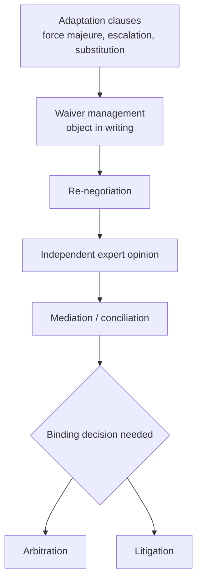

# 6. International Dispute Resolution: Litigation, Arbitration, and ADR

> **Teaching rewrite** of dispute-resolution foundations for traders. Pedagogical summaries only — not legal advice and not the text of any convention or institutional rules. Treaty memberships change; check current status before relying on them.

## Introduction

A domestic dispute is painful. An international one multiplies the pain: foreign lawyers, translated evidence, unfamiliar procedure, travel to distant courts — and, after all that, a judgment you may not be able to collect. Because a cargo loss can touch the sale, carriage, insurance, and payment contracts at once, even working out **who is liable** can take months.

So a trading firm needs a **dispute-resolution strategy** designed up front, not improvised when the shipment goes wrong. This lesson covers:

- Why international disputes cost so much — and how to **prevent** them in the contract
- The **escalation ladder**: adaptation clauses → waiver management → re-negotiation → expert opinion → arbitration or litigation
- **Litigation**: forum, forum-shopping, choice of law, and **enforcing** judgments abroad
- **Arbitration**: why it dominates international trade, and its real limitations

**Assumptions.** A B2B cross-border commercial relationship, either a single sale or an ongoing partnership. Remember from Lessons 4 and 5: the best time to choose your dispute mechanism is **before signing** — though parties can still agree on arbitration or ADR after a dispute starts.

---

## 6.1 Preparing a dispute-resolution strategy

### Why international disputes hurt more

| Cost driver | What it looks like |
|---|---|
| **Foreign counsel** | You pay your own lawyers *and* local lawyers abroad |
| **Travel** | Executives testify in distant, sometimes hostile venues |
| **Translation** | Contracts, emails, technical files — all of it |
| **Evidence abroad** | Witnesses and documents in other countries are slow and costly to reach |
| **Unpredictability** | Unfamiliar law and procedure make outcomes hard to forecast |
| **Fault is unclear** | Seller, carrier, insurer, bank, inspector — whose problem is it? |
| **Enforcement** | Winning on paper ≠ collecting the money |
| **Lost partner** | A hostile fight can destroy a relationship that took years to build in that market |

### Prevent first, decide the mechanism second

During negotiation and drafting:

1. **Vet the counterparty** — trustworthiness and solvency.
2. Make the contract **precise** enough that compliance is clear, yet **flexible** enough that foreseeable contingencies are already covered (adaptation and price-escalation clauses in long-term deals).
3. For ongoing relationships, require a **first step** of re-negotiation, mediation, or conciliation before anyone sues.
4. Include a clear **dispute-resolution clause** naming the final binding mechanism.

**International arbitration** is the most common final mechanism — seen as more neutral, faster, cheaper, less adversarial, and more confidential than courts (section 6.4 tests those claims).

---

## 6.2 After a dispute arises

If the contract is silent, the parties can still agree a mechanism — but once relations sour, agreeing on a seat, a governing law, or an institution may be impossible. A party that knows it is liable has every incentive to **stall**.

The ladder below runs from cheapest and most cooperative to most expensive and adversarial.

### 6.2.1 Working it out: adaptation clauses

Adaptation clauses let a long-running contract **flex** instead of break.

| Clause | How it adapts | Watch-outs |
|---|---|---|
| **Force majeure / excusable delay** | Specified events (war, natural disaster) automatically suspend obligations without ending the deal | Must not wholly frustrate the transaction; see Lesson 5 for drafting |
| **Price escalation** | Price fixed for a period (e.g. six months), then pegged to a public index | Choose a verifiable index |
| **Most-favoured / best-price** | Buyer never pays more than any other customer | Check **competition law** and financial regulation |
| **Specification updates** | Specs follow catalogue updates or verifiable market changes | Define what counts as a valid update |
| **Variation / substitution** | Seller may deliver functionally equivalent goods of slightly different composition | Buyer should limit the scope |
| **Flexible delivery** | Time extensions for unexpected events | Cap the extension |
| **Change-of-law / hardship** | Excuses or limits liability after drastic changes in policy, legislation, or tax | Define “drastic” |

### 6.2.2 Talking it over

#### a. Waiver

Forgiving small breaches — a late delivery, a slightly short quantity, a distributor missing its sales target — is normal business. Legally, repeated forgiveness can become a **waiver**: you lose the right to object later.

Protect yourself by:

- A clause requiring that modifications, and any waiver, be **in writing** and expressly accepted by the party who benefits from the obligation
- **Objecting in writing** each time you tolerate a breach, so the record shows a one-off concession, not a new rule

#### b. Re-negotiation

Parties can always agree to change a contract. Some contracts go further and **oblige** (or invite) senior executives to meet and re-negotiate before escalating. How much that commits them depends on whether the duty is binding — but either way it signals a shared intent to avoid litigation.

#### c. Independent expert

An expert opinion is far less formal and aggressive than a court or arbitration. Typical uses:

- Technical assessment of machinery or processes
- Testing product quality or a constructed works
- Checking whether an industrial plant performs and conforms
- Investigating why a deal failed, or the causes and effects of delays
- Valuing company shares

Experts can create a **contemporaneous record of the facts** (e.g. conformity of materials during plant construction) and help lawyers prepare submissions. Alone, an expert finding is usually **not binding or enforceable** — but made close to the events, it can be very **persuasive** to a later judge or tribunal.

The **ICC International Centre for ADR** (which absorbed the former ICC International Centre for Expertise) can **propose** a qualified expert under ICC expert rules — on request of a party or of an arbitral tribunal, inside or outside a dispute (e.g. technical advice before signing). The requester is not obliged to use the proposed expert. Parties can reference these rules in the contract or agree on them later.

<GuidedChoiceExplanation preset="dispute-escalation-ladder" />

---

### Checkpoint: strategy and amicable tools

<MultipleChoice
  id="ib-export-import-ch6-mid1"
  title="Checkpoint — sections 6.1 and 6.2"
  questions={[
    {
      prompt: 'A distributor has missed its minimum sales target three years running and the supplier said nothing each time. The supplier now wants to terminate for that reason. The main risk?',
      choices: [
        'None — targets can never be waived',
        'A court may find the supplier waived the target by repeatedly tolerating the breach',
        'The CISG forbids sales targets',
        'Force majeure applies automatically',
      ],
      answer: 1,
      why: 'Silent repeated forgiveness can amount to waiver; object in writing each time.',
    },
    {
      prompt: 'An independent expert’s report on why a plant failed, written right after the incident, is usually…',
      choices: [
        'A binding, enforceable judgment',
        'Not binding on its own, but highly persuasive to a later tribunal',
        'Inadmissible in any arbitration',
        'Only valid if the CISG applies',
      ],
      answer: 1,
      why: 'Expert findings are rarely enforceable alone, but contemporaneous facts carry weight.',
    },
    {
      prompt: 'A “most-favoured customer” clause should be checked especially against…',
      choices: ['Incoterms®', 'Competition law and financial regulation', 'UCP 600', 'The Hague-Visby Rules'],
      answer: 1,
      why: 'Best-price commitments can raise antitrust and regulatory issues.',
    },
    {
      type: 'order',
      prompt: 'Rank these responses to a disagreement in a long-term supply contract, from least to most adversarial.',
      items: [
        'Apply the contract’s adaptation clause (e.g. index-based price escalation).',
        'Send a written objection that preserves your rights while tolerating the breach.',
        'Meet under the re-negotiation clause.',
        'Ask an independent expert for an opinion on the disputed facts.',
        'Start arbitration for a binding award.',
      ],
      why: 'Self-executing clauses come first, then preserving rights, then talks, then a neutral non-binding view, and only then a binding adversarial process.',
      whyWrong: 'Jumping to arbitration first skips cheaper tools that often settle the issue and preserve the relationship.',
    },
  ]}
/>

---

## 6.3 International litigation

### 6.3.1 Why courts are the last resort

Public courts are generally the **slowest, costliest, and most confrontational** option. Seasoned traders negotiate ADR or arbitration clauses precisely to avoid them. Yet some firms and countries litigate by reflex — often because their lawyers know little about arbitration, ADR, or adaptation clauses.

Litigation can still **favour the strong party**: by imposing its own home courts, it makes any claim by a weaker counterparty so expensive that the claim is never brought.

Other drawbacks:

- Technically complex; needs specialised international counsel
- Risk of **home-court bias** when enforcing against a local party
- **Slowness as a weapon**: a party expecting to lose may deliberately stall in a backlogged court system

A judgment is final once appeals are exhausted and enforceable **in its own country** — but across borders, an **arbitral award** often travels better, thanks to the **New York Convention (1958)**, adopted by over 170 states.

### 6.3.2 Where to sue: jurisdiction and forum

**Jurisdiction** = a court’s competence to hear the case. The first step for a claimant is to choose a **forum** with jurisdiction.

The old Roman-law rule — *actor forum rei sequitur*, “the plaintiff follows the defendant’s forum” — meant suing where the defendant lived. As trade grew, commercial centres developed theories for reaching foreign defendants wherever they held assets. Today courts typically:

1. Look for a **choice-of-forum clause** in the contract
2. Then decide, under their own national law and the facts, whether to take the case

#### Forum-shopping

With no clause, each side races to the court it finds most favourable or convenient — even one barely connected to the deal — and may launch **counter-suits** in yet another country. A **forum-selection clause** prevents this; the stronger party usually proposes its own courts.

Courts may test the clause for **reasonableness**: the forum should have some logical link to the contract. In one reported U.S. case, a clause sending a small Puerto Rican distributor’s disputes with a large German manufacturer to **Mexico** — unconnected to either party — was struck down because its real effect was to make suing impossible. Some countries also disregard foreign forum clauses imposed on their nationals (Brazilian courts have been noted for this).

### 6.3.3 Choice of law

Parties may choose the governing law, provided it does not offend the **public policy** of the forum. If they did not choose — or the choice is unreasonable or against public policy — the court applies **conflict-of-laws** rules, looking at factors such as:

- Where the contract was **negotiated / signed**
- Where it is to be **performed**
- Where the parties are **domiciled**

Some systems pick the law with “the **most significant relationship**” to the contract. Treaties harmonise this in places — in the EU, the 1980 Rome Convention has been replaced by the **Rome I Regulation**.

### 6.3.4 Enforcing judgments

Winning is half the job; **collecting** is the other half. Think about enforcement **before** filing:

- Does the defendant have **assets** that can satisfy a money judgment? Suing a party that will go bankrupt or vanish is wasted money.
- If assets may disappear, seek an **injunction freezing** them pending the case.
- If the loser has no assets where the judgment was given, you must go where the assets are — often the defendant’s home country — and ask a court there to **recognise** the foreign judgment (an **exequatur** proceeding).

How hard is recognition?

| Situation | Typical outcome |
|---|---|
| Between EU states | Largely routine under the Brussels regime (and Lugano with some neighbours) |
| Many other pairs of countries | Courts ask about **reciprocity** — “we enforce your judgments if you enforce ours” |
| No treaty, no reciprocity | Uncertain; may require re-litigating |

:::info Newer judgments treaties
The **Hague Judgments Convention (2019)** and the **Hague Choice of Court Convention (2005)** aim to make court judgments travel more like arbitral awards. Coverage is still limited — check whether both countries in your deal are parties.
:::

<GuidedChoiceExplanation preset="dispute-litigation-enforcement" />

---

### Checkpoint: litigation

<MultipleChoice
  id="ib-export-import-ch6-mid2"
  title="Checkpoint — section 6.3"
  questions={[
    {
      prompt: 'A contract has no forum clause. After a dispute, the buyer sues at home and the seller files a counter-suit in a third country where it expects a friendlier court. This is…',
      choices: ['Exequatur', 'Forum-shopping', 'Waiver', 'Force majeure'],
      answer: 1,
      why: 'Racing to the most favourable court is forum-shopping — a forum clause prevents it.',
    },
    {
      prompt: 'Why might a court refuse to enforce a forum clause choosing a country unconnected to either party?',
      choices: [
        'Forum clauses are never valid',
        'It fails a reasonableness test — its real effect is to block the weaker party from suing',
        'Only arbitration clauses can name a place',
        'The CISG forbids forum clauses',
      ],
      answer: 1,
      why: 'Courts may require a logical link between the forum and the contract.',
    },
    {
      prompt: 'You win a court judgment at home, but the defendant’s assets are all in its own country. You must…',
      choices: [
        'Simply send the judgment to the defendant’s bank',
        'Seek recognition of the judgment (exequatur) in the defendant’s country',
        'Start arbitration on the same claim automatically',
        'Nothing — judgments are enforceable worldwide',
      ],
      answer: 1,
      why: 'A foreign court must recognise the judgment before assets there can be seized.',
    },
    {
      type: 'order',
      prompt: 'Rank the steps of a well-planned international lawsuit for unpaid goods.',
      items: [
        'Confirm the defendant has reachable assets that could satisfy a money judgment.',
        'Identify a competent forum — starting with the contract’s forum clause.',
        'Seek an injunction freezing assets if they risk disappearing.',
        'Obtain a final judgment after any appeals.',
        'Seek recognition (exequatur) where the assets are located, then enforce.',
      ],
      why: 'Collectability decides whether to sue at all; the forum must be fixed before applying to it for interim relief; recognition follows a final judgment.',
      whyWrong: 'Checking assets only after winning risks an uncollectable judgment and wasted costs.',
    },
  ]}
/>

---

## 6.4 International commercial arbitration

### 6.4.1 Benefits

When a **binding** decision is needed in an international deal, arbitration is often the best fit.

| Benefit | Why it matters |
|---|---|
| **Neutrality** | Resolves the “whose courts?” fight; hearings can be in a neutral country (or anywhere agreed) |
| **Confidentiality** | Private hearings, no public record — unfounded allegations stay out of the press |
| **Speed & cost** | Fewer dilatory tactics; no years-long court backlog |
| **Finality** | Awards normally cannot be appealed on the merits — one set of proceedings |
| **Language** | Any language the parties choose — less translation |
| **Expertise** | Parties can appoint arbitrators who know the industry or technology — less time “educating” the decision-maker |
| **Enforcement** | Awards enforceable in 170+ states under the **New York Convention** |

### 6.4.2 Potential disadvantages

| Concern | Reality check |
|---|---|
| **Cost and delay** | Some arbitrations are expensive and long; parties also pay arbitrators’ fees and hearing venues (judges and courtrooms are publicly funded). Overall it is usually cheaper thanks to speed and no appeals — but “cheaper” does not mean “cheap”. |
| **Procedural safeguards** | Litigators may find arbitration too informal. Parties can build in structure — transcripts, written records, document-production rules — when the stakes justify it. |
| **Finality cuts both ways** | No appeal if the tribunal gets it wrong; courts review awards only on narrow grounds (e.g. procedure, public policy). |

### Worked example: litigation vs arbitration, counting enforcement

A seller is owed **USD 200,000** by a buyer whose assets are all in the buyer’s country. Win probability is **70%** either way. Assume all costs are incurred regardless of outcome (a simplification).

| Route | Own costs incl. enforcement | Chance a win is actually enforced |
|---|---|---|
| **Seller’s home court** → exequatur abroad, reciprocity doubtful | USD 60,000 + 20,000 = 80,000 | 40% |
| **Arbitration** → New York Convention enforcement | USD 70,000 + 10,000 = 80,000 | 85% |

Expected value = P(win) × P(enforced) × claim − costs

- Litigation: 0.70 × 0.40 × 200,000 − 80,000 = 56,000 − 80,000 = **−USD 24,000**
- Arbitration: 0.70 × 0.85 × 200,000 − 80,000 = 119,000 − 80,000 = **+USD 39,000**

Same claim, same merits, same total cost — the route to **enforcement** flips the decision. (The numbers are illustrative; the method is what matters.)

<GuidedChoiceExplanation preset="dispute-arbitration-choice" />

---

### Rank: building a dispute strategy

<MultipleChoice
  id="ib-export-import-ch6-rank"
  title="Sequence the dispute strategy"
  questions={[
    {
      type: 'order',
      prompt: 'Rank the steps for building dispute protection into a new international distribution contract.',
      items: [
        'Vet the counterparty’s trustworthiness and solvency.',
        'Draft precise obligations plus adaptation clauses for foreseeable changes.',
        'Add a written-modification / no-waiver clause.',
        'Add a tiered clause: re-negotiation, then mediation, then binding arbitration.',
        'Specify the arbitration details — institution, seat, law, language, number of arbitrators.',
      ],
      why: 'Only vetted partners are worth contracting with; substance comes before protective clauses; the tiered clause must exist before its final step can be detailed.',
      whyWrong: 'Fine-tuning the arbitration seat before deciding whether to deal with the partner at all puts the cart before the horse.',
    },
    {
      type: 'order',
      prompt: 'Rank these in the order you would analyse a cross-border claim before filing.',
      items: [
        'Read the contract’s dispute, forum, and law clauses.',
        'Identify the competent forum and the governing law.',
        'Locate the defendant’s assets and the route to enforce there (New York Convention or exequatur).',
        'Estimate costs, win probability, and enforcement probability.',
        'Decide: file, negotiate, or rely on non-legal safeguards.',
      ],
      why: 'The clauses fix forum and law; those determine where enforcement must happen; all three feed the cost-benefit estimate that drives the decision.',
    },
  ]}
/>

---

### Check: international dispute resolution

<MultipleChoice
  id="ib-export-import-ch6"
  title="International dispute resolution"
  questions={[
    {
      prompt: 'Which is NOT typically listed as an extra cost of international (vs domestic) disputes?',
      choices: [
        'Translating voluminous documents',
        'Retaining foreign counsel',
        'Paying the judge’s salary in a state court',
        'Gathering evidence abroad',
      ],
      answer: 2,
      why: 'Judges and courtrooms are publicly funded; arbitrators’ fees are what parties pay directly.',
    },
    {
      prompt: 'The main reason arbitral awards are often easier to enforce abroad than court judgments is…',
      choices: [
        'Arbitrators are always government officials',
        'The New York Convention, widely adopted for recognising foreign awards',
        'Awards are published in newspapers',
        'The CISG requires it',
      ],
      answer: 1,
      why: '170+ states recognise foreign awards under one treaty; judgments rely on patchier treaties or reciprocity.',
    },
    {
      prompt: 'A party that knows it will lose prefers which forum?',
      choices: [
        'Fast arbitration with a sole expert arbitrator',
        'A backlogged national court where it can stall for years',
        'Expert determination',
        'Immediate settlement',
      ],
      answer: 1,
      why: 'Slowness benefits the party in the wrong — a reason claimants favour arbitration.',
    },
    {
      prompt: 'A contract says nothing about dispute resolution. A dispute has started. Which is true?',
      choices: [
        'Arbitration is now impossible',
        'The parties may still agree on arbitration or ADR, but agreement is harder once relations are hostile',
        'The seller’s courts automatically have jurisdiction',
        'The dispute must go to the WTO',
      ],
      answer: 1,
      why: 'Post-dispute agreements are allowed, just harder to reach.',
    },
    {
      prompt: 'Which statement about arbitration’s finality is correct?',
      choices: [
        'Awards can be appealed on the merits like court judgments',
        'Awards are normally final; court review is limited to narrow grounds',
        'Awards are only advisory',
        'Finality makes arbitration more expensive than litigation',
      ],
      answer: 1,
      why: 'One set of proceedings — good for speed, risky if the tribunal errs.',
    },
    {
      prompt: 'Claim USD 100,000; win probability 80%; probability a win is enforced 50%; total costs USD 30,000. Expected value of proceeding?',
      choices: ['+USD 50,000', '+USD 10,000', '−USD 30,000', '+USD 40,000'],
      answer: 1,
      why: '0.8 × 0.5 × 100,000 − 30,000 = 40,000 − 30,000 = 10,000.',
      whyWrong: 'USD 40,000 forgets to subtract costs; USD 50,000 ignores the win probability.',
    },
    {
      prompt: 'When a court must choose the governing law because the parties did not, it typically looks at…',
      choices: [
        'Only the claimant’s nationality',
        'Where the contract was negotiated/signed, where it is performed, and the parties’ domiciles',
        'The cheapest law',
        'The law of the arbitrator’s country',
      ],
      answer: 1,
      why: 'Conflict-of-laws analysis seeks the law most closely connected to the contract.',
    },
    {
      prompt: 'Which arbitration benefit helps most in a dispute over a turbine’s technical performance?',
      choices: ['Confidentiality', 'Choosing an arbitrator with industry expertise', 'Language choice', 'Neutral seat'],
      answer: 1,
      why: 'An expert arbitrator needs less education on technical issues and can decide faster.',
    },
  ]}
/>

---

## Takeaways

:::tip Remember
- International disputes cost more: foreign counsel, travel, translation, evidence abroad, and **enforcement**
- **Prevent** with vetting, precise-but-flexible drafting, and adaptation clauses
- Climb the ladder: adaptation → written objections → re-negotiation → expert → mediation → binding decision
- Litigation: fix the **forum** in the contract to stop forum-shopping; keep the forum **reasonable**
- Before suing, ask **where the assets are** and how a win will be enforced there
- Arbitration: neutral, private, final, expert, enforceable under the **New York Convention** — but not automatically cheap or fast
:::

## Further Reading

- [5. The international sale contract](./international-sale-contract) — force majeure, dispute and law clauses in the ICC model
- [4. International trade law](./international-trade-law) — jurisdiction, choice of law, remedies
- [International Business home](../intro)
- Next: [7. ICC arbitration and dispute services](./icc-arbitration-and-adr) — clause, procedure, costs, ADR tools
- Later (planned): payment instruments (L/Cs in depth) · carriage documents · insurance
- Primary sources: New York Convention ([UNCITRAL](https://uncitral.un.org/)); Hague Conventions ([HCCH](https://www.hcch.net/)); ICC arbitration and ADR rules ([ICC](https://iccwbo.org/))
