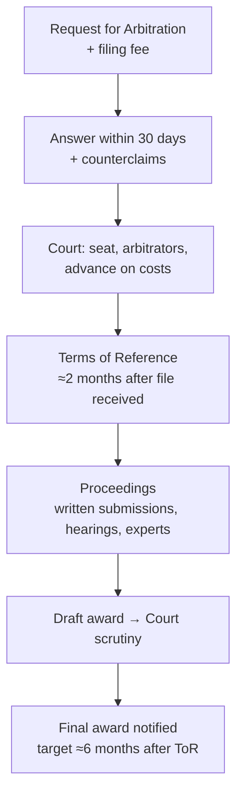

# 7. ICC Arbitration and Dispute Resolution Services

> **Teaching rewrite** of how ICC’s dispute services work, structured around the 2012 ICC Arbitration Rules. Pedagogical summaries only — not the Rules text. ICC has revised its Rules since (2017, 2021) and changes fees, time limits, and thresholds; always check the **current** Rules, cost scales, and model clauses at [ICC](https://iccwbo.org/) before drafting or filing.

## Introduction

Lesson 6 compared litigation, arbitration, and ADR in general. This lesson looks inside one institution that many export contracts name: the **International Chamber of Commerce (ICC)**. Its **International Court of Arbitration** was the first body devoted to international commercial arbitration and is widely ranked as the most-used arbitral institution. Around it, ICC offers a toolkit of lighter mechanisms: mediation, expert appointment, **DOCDEX** for banking-instrument disputes, and **dispute boards** for long projects.

You will learn:

- What makes **institutional** ICC arbitration different from ad hoc arbitration
- How to write — and how *not* to modify — the **ICC arbitration clause**
- Who does what: the **Court**, the **Secretariat**, and the **arbitral tribunal**
- The procedure from **Request** to **award**, including Terms of Reference, time limits, and costs
- Key features added in the 2012 Rules: **emergency arbitrator**, multi-party tools, confidentiality, case management
- ICC’s non-arbitration services: **DOCDEX**, **mediation/ADR**, **dispute boards**, **experts**

**Assumptions.** You already know why arbitration usually beats foreign litigation for cross-border trade (Lesson 6). Here the question is *how* to use an institution well.

---

## 7.1 Why ICC arbitration?

| Feature | What it means for a trader |
|---|---|
| **Universality** | Any industry, any country, private or state parties. The Court sits in Paris, but most hearings happen elsewhere — in dozens of countries, with arbitrators of many nationalities. |
| **Supervision** | Unlike **ad hoc** arbitration (parties design and police the process themselves), a professional Secretariat handles case management, fees, and paperwork. |
| **Award scrutiny** | The Court reviews every draft award before it is issued — a distinctive ICC quality check. The Court, not the arbitrators, notifies the final award. |
| **Stature** | Decades of reputation for neutrality — you rarely need to persuade a counterparty that ICC is fair. |

**Trade-off:** supervision and scrutiny cost money and some time. Ad hoc arbitration can be cheaper when both sides cooperate — and much worse when one side does not.

---

## 7.2 The ICC arbitration clause

ICC publishes a short **standard clause**. Its substance:

> All disputes arising out of or in connection with the contract are finally settled under the ICC Rules of Arbitration by one or more arbitrators appointed under those Rules.

*(Paraphrased — copy the exact current wording from ICC’s website.)*

### Recommended additions

| Add | Why |
|---|---|
| **Place (seat)** of arbitration | Fixes the procedural law and the courts that can review the award |
| **Number of arbitrators** (one or three) | A **sole** arbitrator is the simplest way to keep costs down |
| **Applicable law** | Saves a fight later; a **neutral** country’s law is a common compromise |
| **Language** | Avoids translation disputes |

### Drafting trap

Edits should come from experienced arbitration counsel. Classic mistake: writing *“…of the International Chamber of Commerce **in Paris**…”* — does that make Paris the **seat**, or just describe where ICC is? Ambiguity invites a jurisdictional fight before the real dispute even starts.

**Timing:** parties *can* agree to ICC arbitration after a dispute arises, but the side that expects to lose has every reason to refuse. Put the clause in the contract.

<GuidedChoiceExplanation preset="icc-arbitration-clause" />

---

## 7.3 Who does what: Court, Secretariat, tribunal

The **Court** does **not** decide disputes. It is an administrative body — attached to ICC but independent of it — with a chair, vice-chairs, and members from many countries. Its job is to make sure the **Rules** are applied.

| Body | Role |
|---|---|
| **Arbitral tribunal** (1 or 3 arbitrators) | Hears the case and **decides** it |
| **Court** | Checks there is a prima facie arbitration agreement (when referred to it); appoints arbitrators the parties did not; decides challenges; fixes the seat if the parties did not; handles Terms of Reference where a party will not sign; fixes costs and deposits; extends time limits; **scrutinises draft awards** |
| **Secretariat** | Day-to-day administration: case teams led by counsel specialised in arbitration procedure |

**Appointing a sole arbitrator or chair:** the Court usually chooses a **nationality different from the parties’**, then asks the relevant ICC national committee for a proposal (usually but not necessarily followed).

---

## 7.4 The arbitrators

- Parties may **nominate** arbitrators; the Court must **confirm** them.
- If they do not, the Court appoints a neutral arbitrator, normally from a neutral country.
- Every arbitrator must be — and stay — **independent** of the parties, and (expressly since 2012) **impartial**, and must sign a statement disclosing anything that could call this into question.
- A party can **challenge** an arbitrator before the Court; if the challenge succeeds, the arbitrator is replaced.

### One or three?

| | Sole arbitrator | Three-member tribunal |
|---|---|---|
| Default if contract is silent | Yes — unless the Court finds the case warrants three | Only if the Court decides so |
| Cost | Lower | Higher (three sets of fees) |
| Speed | Faster scheduling | More coordination, possible delay |
| Comfort | Parties do not each pick “their” arbitrator | Each party nominates one; the two (or the Court) pick the chair |

The Court weighs **complexity** and **amount in dispute** when choosing.

---

### Checkpoint: institution, clause, tribunal

<MultipleChoice
  id="ib-export-import-ch7-mid1"
  title="Checkpoint — sections 7.1 to 7.4"
  questions={[
    {
      prompt: 'Who decides the merits of a dispute in ICC arbitration?',
      choices: [
        'The ICC International Court of Arbitration',
        'The ICC Secretariat',
        'The arbitral tribunal',
        'The national committee of the claimant’s country',
      ],
      answer: 2,
      why: 'The Court supervises and scrutinises; only the tribunal decides.',
      whyWrong: 'Despite its name, the Court is an administrative body.',
    },
    {
      prompt: 'A clause says disputes go to “ICC arbitration in Paris” but the parties meant only to name the institution. The risk?',
      choices: [
        'None — Paris is always the seat',
        'Ambiguity over whether Paris is the seat, inviting a preliminary fight',
        'The clause becomes a court clause',
        'ICC refuses all cases mentioning cities',
      ],
      answer: 1,
      why: 'State the seat separately and unambiguously; avoid ad hoc edits to the model wording.',
    },
    {
      prompt: 'The contract does not say how many arbitrators. A USD 300,000 dispute about late delivery arrives. Most likely…',
      choices: [
        'Three arbitrators, always',
        'A sole arbitrator, since the case does not appear to warrant three',
        'No tribunal until the parties agree',
        'Five arbitrators',
      ],
      answer: 1,
      why: 'The default is one unless complexity or amount justifies three.',
    },
    {
      type: 'order',
      prompt: 'Rank the steps for drafting an ICC arbitration clause for a new export contract.',
      items: [
        'Start from ICC’s current standard clause wording.',
        'Decide the seat, number of arbitrators, governing law, and language.',
        'Have experienced arbitration counsel add those stipulations without altering the core wording.',
        'Check the final clause for ambiguities (e.g. city names that could be read as the seat).',
        'Sign the contract with the clause included — before any dispute exists.',
      ],
      why: 'The model is the base; the parameters must be decided before counsel can draft them; review comes after drafting; and the clause must be agreed while relations are good.',
      whyWrong: 'Waiting until a dispute arises lets the party expecting to lose refuse arbitration altogether.',
    },
  ]}
/>

---

## 7.5 The procedure, step by step

### a. Request for Arbitration

The **claimant** files a written Request with the Secretariat, identifying all parties and describing the case, with a **non-refundable filing fee** (USD 2,500 under the 2012 Rules — higher today). The Secretariat notifies the **respondent**, who has **30 days** to file an **Answer** (defence, counterclaims, views on the tribunal). The claimant gets **30 days** to reply to counterclaims. The Court then fixes the seat (if not agreed) and constitutes the tribunal.

### b. Terms of Reference (ToR)

A distinctive ICC document drafted by the tribunal with the parties: it **summarises the case, defines the issues**, and records the seat and procedural rules.

- Parties comment, then sign; the ToR then go to the Court.
- All sign → the Court simply **takes note**. A party refuses → the Court decides whether to **approve**; the arbitration continues either way.
- Critics say ToR cost time. ICC’s view: they **narrow the issues**, make hearings more efficient, and often show the parties they are closer than they thought — opening the door to **settlement**.

### c. Time limits

| Milestone | Limit (2012 Rules) |
|---|---|
| ToR to the Court | ~**2 months** after the tribunal receives the file |
| Final award | ~**6 months** after the ToR are signed / approved |

The Court may **extend** either, on reasoned request or its own initiative — and in complex cases it often does.

### d. Proceedings

Parties may agree their own procedural rules; otherwise the **tribunal** decides — including whether to hold hearings (a party that asks to be heard has the right to be), hear witnesses, or appoint experts.

### e. Applicable law

If the parties have not chosen, the **tribunal** decides. Options are broad: a national law, or general principles such as the **UNIDROIT Principles of International Commercial Contracts** or the **lex mercatoria**.

### f. The award

- In writing; by unanimity, by majority, or failing both by the **chair** alone. Dissenting opinions are possible with three arbitrators.
- A settlement can be recorded as an **award by consent** — easier to enforce than a bare settlement contract.
- The award also **allocates costs**, including legal fees.
- The draft goes to the **Court**, which may modify its **form** and draw attention to points of **substance** without overriding the tribunal.
- Parties are notified only once arbitration costs are **fully paid**.
- If the loser will not comply, enforce through national courts under the **New York Convention** (170+ states).

### g. Costs

Costs = arbitrators’ fees and expenses + ICC administrative expenses + experts + lawyers.

1. On receiving the Request, the Secretary General sets a **provisional advance** (to cover work up to the ToR). The file is not passed to the tribunal until it is paid.
2. The Court then fixes the full **advance on costs**, normally split **50/50** between claimant and respondent sides.
3. ICC’s fees and the arbitrators’ fee range follow a published **scale based on the amount in dispute** (ICC provides an online cost calculator).
4. If one side does **not** pay its half, the other may pay it (or post a **bank guarantee**) so the case can proceed.

### h. Fast-track arbitration

Parties can agree expedited proceedings — either a deadline for **every step** (answer, tribunal constitution, challenges, submissions, hearings, award, extensions) or a **single deadline** for the award. With committed, sophisticated parties, ICC has reported large cases resolved in **60–80 days**. Draft fast-track clauses with experienced counsel.

:::info Later development
Since the 2017 revision, ICC Rules include an **Expedited Procedure** that applies automatically below a value threshold (raised in 2021) unless the parties opt out — check the current threshold.
:::

### Worked example: budget and timeline

A seller files against a buyer. The Court fixes an advance on costs of **USD 180,000**.

| Item | Calculation | Result |
|---|---|---|
| Each side’s share | 50% × 180,000 | **USD 90,000** each |
| Buyer refuses to pay | Seller pays the buyer’s half too (or posts a guarantee) | Seller funds **USD 180,000** up front |
| Recovery | The award can order the buyer to bear the costs | Seller seeks reimbursement in the award |

Timeline at the Rules’ default pace, starting from the Request:

| Step | Elapsed time |
|---|---|
| Answer due | ~1 month |
| Court constitutes tribunal, file transmitted | say ~1 more month → ~2 months |
| ToR due (≈2 months after the file reaches the tribunal) | ~4 months |
| Award due (≈6 months after ToR) | **~10 months** |

Ten months is a planning baseline, not a promise — extensions are common. Lesson: a party refusing to pay its share **shifts cash burden**, not final liability; budget for funding the whole advance.

<GuidedChoiceExplanation preset="icc-arbitration-procedure" />

---

## 7.6 What the 2012 Rules added

| Feature | What it does |
|---|---|
| **Emergency arbitrator** | Urgent interim measures **before** the tribunal exists. Appointed within ~2 working days; order within ~15 days; does **not** bind the later tribunal, which may modify or set it aside. Minimum fee was USD 40,000. Parties may **opt out**; courts remain available for interim relief. |
| **Joinder** | Join a third party (before any arbitrator is confirmed; after that, all parties must agree) |
| **Multi-party claims** | Any party may claim against any other before ToR approval; later, with permission |
| **Multiple contracts** | Claims under several contracts in one arbitration |
| **Consolidation** | The Court may merge related arbitrations on request |
| **Impartiality + disclosure** | Arbitrators must be impartial as well as independent and disclose any doubts |
| **Direct appointment** | The Court may appoint directly — e.g. if a national committee fails, or where a **state** party is involved |
| **Jurisdiction to the tribunal** | Objections to the existence, validity, or scope of the arbitration agreement go by default to the **tribunal** |
| **Confidentiality orders** | Tribunal can protect trade secrets and even the existence of the case |
| **Email** | Recognised as a normal channel |
| **Case management** | Duty of **expedition and cost-effectiveness**; early case-management conference; tribunal announces when it expects to submit the draft award; **conduct affects cost allocation** |
| **Exclusivity** | Only ICC may administer arbitrations under the ICC Rules |

---

### Checkpoint: procedure and 2012 features

<MultipleChoice
  id="ib-export-import-ch7-mid2"
  title="Checkpoint — sections 7.5 and 7.6"
  questions={[
    {
      prompt: 'The respondent refuses to sign the Terms of Reference. What happens?',
      choices: [
        'The arbitration stops permanently',
        'The Court decides whether to approve them, and the arbitration continues',
        'The claimant must refile in court',
        'The tribunal resigns',
      ],
      answer: 1,
      why: 'A refusal cannot block the case; the Court approves the ToR instead of merely taking note.',
    },
    {
      prompt: 'Advance on costs USD 240,000. The respondent pays nothing. To keep the case moving, the claimant must fund…',
      choices: ['USD 120,000', 'USD 240,000 (or provide a bank guarantee for the respondent’s half)', 'USD 0', 'USD 480,000'],
      answer: 1,
      why: 'Each side normally pays 50%; if one defaults, the other may pay or guarantee the missing half.',
      whyWrong: 'USD 120,000 is only the claimant’s own half — the case would stall.',
    },
    {
      prompt: 'Goods worth USD 2M are about to be resold by the buyer before any tribunal exists. The fastest ICC tool is…',
      choices: [
        'Wait for the Terms of Reference',
        'An emergency arbitrator for urgent interim measures (or a competent court)',
        'DOCDEX',
        'A dispute review board',
      ],
      answer: 1,
      why: 'The emergency arbitrator acts before the tribunal is constituted; court interim relief stays available.',
    },
    {
      type: 'order',
      prompt: 'Rank the stages of an ICC arbitration from filing to final award.',
      items: [
        'Claimant files the Request for Arbitration with the filing fee.',
        'Respondent files its Answer and any counterclaims.',
        'Court fixes the seat if needed, constitutes the tribunal, and sets the advance on costs.',
        'Tribunal and parties settle the Terms of Reference.',
        'Written submissions, hearings, and any experts.',
        'Court scrutinises the draft award; the award is notified once costs are paid.',
      ],
      why: 'Each stage depends on the last: no Answer without a Request, no tribunal without the case being referred, no ToR without a tribunal, no hearings without defined issues, no award without hearings.',
      whyWrong: 'The Court scrutinises the award before notification — it is not a post-award appeal.',
    },
  ]}
/>

---

## 7.7 DOCDEX — disputes over banking instruments

**DOCDEX** (Documentary Instruments Dispute Resolution Expertise) handles disputes under ICC banking rules: **UCP** (documentary credits), **URR** (bank-to-bank reimbursement), **URC** (collections), and **URDG** (demand guarantees).

- **Document-based**: no hearings; three experts decide on the written file
- Decision reviewed by the ICC Banking Commission’s technical adviser
- **Not binding** unless the parties agree otherwise — but highly persuasive in banking practice
- Typically **6–12 weeks** from request

Use it when the fight is about whether documents complied with a credit or collection — a narrow, technical question where a full arbitration would be overkill.

---

## 7.8 ICC mediation and ADR

**Mediation / conciliation** = amicable resolution with a neutral third party. Theoretically fast and cheap; **non-binding** — either side can walk away, and any settlement is usually a **contract**, not a judgment.

Success depends on both sides’ commitment and the **neutral’s** skill.

### Starting ADR

- Needs **agreement**: an ADR clause in the contract, or consent after the dispute.
- A **joint** request starts it directly. A **unilateral** request is notified to the other side — and if it declines, nothing happens.
- ICC suggests **four ADR clauses**, adaptable, escalating from purely **optional** ADR to an **obligation** to try ADR, with or without follow-on arbitration.

### Techniques

| Technique | How it works |
|---|---|
| **Mediation** (default) | Neutral facilitates the parties’ own agreement |
| **Neutral’s opinion** | Neutral gives a view on specific issues |
| **Mini-trial** | Panel of the neutral plus one executive from each side gives an opinion |
| **Combination** | Mix as needed |

Parties may jointly pick the neutral or set required qualifications for ICC’s appointment; a party may make a reasoned objection to ICC’s choice within **15 days**. Proceedings start with a discussion to agree the procedure.

### Result

A settlement on some or all issues — or no binding outcome. ADR combines well with arbitration: try mediation **during** an arbitration when settlement looks possible, or use a **tiered clause** (ADR first, arbitration if it fails). Like ICC arbitration, ICC ADR is **confidential**.

:::info Naming update
ICC’s ADR Rules were replaced by the **ICC Mediation Rules (2014)**, administered by the **ICC International Centre for ADR**. The concepts above still apply.
:::

---

## 7.9 Dispute boards for long-term contracts

Long projects (construction, plant supply) breed disputes as circumstances change. A **dispute board (DB)** — a standing panel of one or three independent members who know the contract and follow its performance — resolves them **as they arise**, keeping the project moving. Best set up at the start, though it can be formed later.

| Type | Output | Bound when? | If a party objects in time |
|---|---|---|---|
| **Dispute Review Board (DRB)** | Recommendation | If no one objects within the stated period | Not obliged to comply (may choose to) pending arbitration/court |
| **Dispute Adjudication Board (DAB)** | Decision | **Immediately** on receipt | Still must comply; may take the dispute to arbitration/court if the contract allows |
| **Combined Dispute Board (CDB)** | Recommendation, or a decision if one party asks and none objects | Depends on which was issued | If a party objects to a decision being issued, the CDB decides which to issue |

ICC does **not administer** DB proceedings. It plays a supporting role: appointing members, deciding challenges, and reviewing the form of decisions when asked. ICC offers DB Rules, standard clauses, and a model DB member agreement.

---

## 7.10 Experts

ICC can help with experts in two ways (now through the **ICC International Centre for ADR**):

| Service | Binding? | Use case |
|---|---|---|
| **Proposal** of an expert | No — requester need not use the proposed person | A party (even before contracting) or a tribunal wants a name for a technical, financial, or legal question |
| **Appointment** of an expert (by agreement) | The **choice** of expert binds the parties | Parties want a report to settle questions amicably or establish facts |

Example matters: a plant’s operating capacity, corrosion of materials, a financial audit during a takeover, revaluing a contract price, supporting dispute adjudication boards on construction projects.

<GuidedChoiceExplanation preset="icc-adr-services" />

---

### Rank: choosing ICC services

<MultipleChoice
  id="ib-export-import-ch7-rank"
  title="Sequence ICC dispute tools"
  questions={[
    {
      type: 'order',
      prompt: 'Rank these ICC mechanisms from least to most binding on the parties’ substantive dispute.',
      items: [
        'Optional ADR clause — either party may decline to mediate.',
        'Mediation that the contract obliges the parties to attempt.',
        'Dispute Review Board recommendation — binding only if no one objects in time.',
        'Dispute Adjudication Board decision — must be complied with immediately, subject to later arbitration.',
        'Final arbitral award — enforceable under the New York Convention.',
      ],
      why: 'Each step adds compulsion: optional participation → mandatory participation → conditional binding → immediate interim binding → final enforceable outcome.',
      whyWrong: 'A DRB recommendation is weaker than a DAB decision: objection frees the parties from a DRB recommendation but not from a DAB decision.',
    },
    {
      type: 'order',
      prompt: 'Rank the steps of an ICC mediation started by one party alone.',
      items: [
        'Claimant files a unilateral request with ICC.',
        'ICC notifies the request to the other party.',
        'The other party agrees to take part.',
        'ICC appoints the neutral (subject to reasoned objection within 15 days).',
        'Opening discussion defines the procedure; mediation proceeds toward a settlement.',
      ],
      why: 'Without the other side’s agreement a unilateral request cannot start proceedings; the neutral is appointed only once there is a case, and the procedure is set with the neutral.',
    },
  ]}
/>

---

### Check: ICC arbitration and dispute services

<MultipleChoice
  id="ib-export-import-ch7"
  title="ICC arbitration and dispute services"
  questions={[
    {
      prompt: 'The main advantage of institutional ICC arbitration over ad hoc arbitration is…',
      choices: [
        'It is always free',
        'Professional supervision, case administration, and Court scrutiny of awards',
        'It avoids having any arbitrators',
        'Awards can be appealed on the merits',
      ],
      answer: 1,
      why: 'Ad hoc arbitration leaves design and policing of the process to the parties.',
    },
    {
      prompt: 'Which choice in the arbitration clause most directly reduces cost?',
      choices: ['A sole arbitrator', 'Three arbitrators', 'Paris as seat', 'English as language'],
      answer: 0,
      why: 'One set of arbitrator fees and simpler scheduling.',
    },
    {
      prompt: 'What does the ICC Court do with a draft award?',
      choices: [
        'Rewrites the decision on the merits',
        'Scrutinises it — may modify form and draw attention to substance without overriding the tribunal',
        'Nothing — awards go straight to the parties',
        'Sends it to national courts for approval',
      ],
      answer: 1,
      why: 'Scrutiny improves awards and their enforceability while respecting the tribunal’s authority.',
    },
    {
      prompt: 'Parties settle mid-arbitration. Why record it as an award by consent?',
      choices: [
        'It is cheaper than any contract',
        'It can be enforced like an arbitral award',
        'It keeps the case open forever',
        'It removes confidentiality',
      ],
      answer: 1,
      why: 'A consent award carries award-level enforceability; a bare settlement is just a contract.',
    },
    {
      prompt: 'An advising bank and an issuing bank disagree about whether presented documents complied with a UCP credit. A fast, document-based ICC option is…',
      choices: ['A dispute adjudication board', 'DOCDEX', 'An emergency arbitrator', 'A mini-trial'],
      answer: 1,
      why: 'DOCDEX resolves UCP/URC/URR/URDG disputes on the documents in weeks.',
    },
    {
      prompt: 'Under ICC ADR, a mediator’s outcome is…',
      choices: [
        'Binding like an award',
        'Non-binding unless the parties sign a settlement, which is usually a contract',
        'Automatically enforceable under the New York Convention',
        'Reviewed by the ICC Court',
      ],
      answer: 1,
      why: 'Either party may walk away; a reached settlement is contractual.',
    },
    {
      prompt: 'A DAB issues a decision on a construction claim; the contractor objects within the stated period. The contractor…',
      choices: [
        'May ignore the decision',
        'Must still comply, but may pursue arbitration or court if the contract allows',
        'Automatically wins',
        'Must start a new DAB',
      ],
      answer: 1,
      why: 'DAB decisions bind on receipt; objection preserves the right to a final determination.',
    },
    {
      prompt: 'Timeline estimate: Answer at month 1, tribunal constituted at month 2, ToR two months later, award six months after ToR. Approximate month of the award?',
      choices: ['Month 6', 'Month 8', 'Month 10', 'Month 14'],
      answer: 2,
      why: '2 + 2 = month 4 for ToR; 4 + 6 = month 10.',
      whyWrong: 'Month 8 forgets the time to constitute the tribunal and prepare ToR; month 6 starts the six-month clock at filing.',
    },
  ]}
/>

---

## Takeaways

:::tip Remember
- ICC = institutional arbitration: Secretariat administration + Court **scrutiny**; the **tribunal** decides
- Use ICC’s **standard clause**, add seat, number of arbitrators, law, language — and do not improvise wording
- Sole arbitrator = cheapest; three = more control, more cost and delay
- Procedure: Request → Answer → tribunal → **Terms of Reference** → hearings → scrutinised award
- Advance on costs splits **50/50**; if the other side will not pay, you may have to fund it all
- Emergency arbitrator for urgent relief before the tribunal exists
- Lighter tools: **DOCDEX** (banking documents), **mediation**, **dispute boards** (long projects), **experts**
:::

## Further Reading

- [6. International dispute resolution](./international-dispute-resolution) — litigation vs arbitration vs ADR
- [5. The international sale contract](./international-sale-contract) — dispute clause in the ICC model
- [International Business home](../intro)
- Next: [8. Introduction to international payments](./international-payments) — methods, collections, L/Cs, FX risk
- Later (planned): documentary credits in depth · carriage documents · insurance
- Primary sources: current ICC Arbitration Rules, Mediation Rules, Dispute Board Rules, DOCDEX Rules, and cost calculator ([ICC](https://iccwbo.org/))
