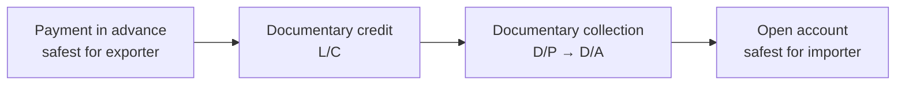
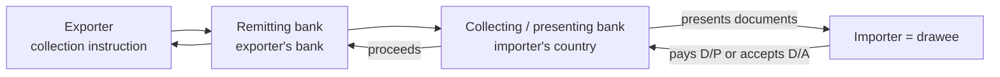

# 8. Introduction to International Payments

> **Teaching rewrite** of export–import payment foundations. Pedagogical summaries only — not the text of ICC banking rules (UCP, URC, ISP, URDG) or any handbook, and not financial advice. Fees, rates, and rules in the examples are illustrative.

## Introduction

Exporter and importer want opposite things from the payment term:

- The **importer** wants to pay **after** the goods arrive and pass inspection — open account.
- The **exporter** wants the money **before** the goods leave — payment in advance.

Whoever wins that tug-of-war holds the leverage in the deal. Once an importer has the goods and owes the money, it can push back on late delivery or quality complaints from a position of strength; suing abroad to collect is slow and expensive (Lessons 4 and 6). Everything between the two extremes — **documentary collections**, **letters of credit**, **standby credits**, **credit insurance** — is a way of splitting the risk.

This lesson covers:

- The **five payment options** and where each sits on the risk ladder
- Supporting tools: **export credit insurance**, **factors**, and the difference between **payment, security, and finance** functions
- How **open account, advance payment, collections (D/P, D/A), and documentary credits** work step by step
- **Foreign-exchange risk**: transaction, translation, and economic — with a forward-hedge worked example
- The **documents** that move money: bill of exchange, bill of lading, commercial invoice, insurance documents, certificates

**Assumptions.** A B2B cross-border sale of goods. Deeper treatment of letters of credit, trade finance (factoring, forfaiting), and security instruments (standbys, guarantees) comes in later lessons.

---

## 8.1 The payment options

### a. The risk ladder

| Option | Exporter risk | Importer risk | Cost & complexity | Notes |
|---|---|---|---|---|
| **Payment in advance** | None | High — may never receive goods | Low | Often unrealistic in competitive markets; **partial** advance (e.g. 20–30%) more common; importer may demand an advance-payment **bank guarantee** |
| **Open account + standby / guarantee** | Low — draw on the bank if unpaid | Exposure to an **unfair call** | Moderate | Underused; simple paperwork; only with trusted exporters |
| **Documentary credit (L/C)** | Low — bank pays against compliant documents | Low — pays only against shipping documents | **High** fees, rigorous paperwork | Exporter needs a disciplined document process |
| **Documentary collection** | Medium — buyer may refuse to pay/accept | Low–medium | Low | Banks act as agents, take no payment risk |
| **Open account** (net 30/60/90) | **Highest** | None | Lowest | Only with trusted, creditworthy buyers; consider credit insurance |

**Rule of thumb:** less risk costs more paperwork and higher fees. Parties use the cheap, simple options when they trust each other — or when one side is strong enough to impose risky terms on the other.

**Who pays in advance anyway?** Importers who need scarce, high-demand, or luxury goods — and sometimes buyers in markets the exporter does not prioritise.

### b. Export (trade) credit insurance

A key exporter safeguard: an insurer — often a government export credit agency (in the U.S., **EXIM**) or a private credit insurer — covers non-payment by approved buyers. With cover in place, exporters can offer **competitive credit terms** like open account.

### c. Exchange-rate risk

Simplest defence: invoice in **your own currency**. In competitive markets you may have to accept the buyer’s currency instead — see section 8.3.

### d. Factors

**Factors** take over credit checking, receivables management, advances, and collection of late accounts (details in a later lesson on factoring and forfaiting).

### e. Three functions: payment, security, finance

| Function | What it does | Typical instruments |
|---|---|---|
| **Payment** | Moves the money | Wire transfer, bank draft; in trade, a **bill of exchange** (draft) accepted or paid by the importer or its bank. A draft alone = **clean bill**; draft + shipping documents = **documentary bill** |
| **Security** | Protects against the other side failing | L/C (exporter paid if documents comply; importer pays only for shipment — and with an inspection certificate, for contract quality); documentary bills swap **goods for money through a bank**; **standbys / demand guarantees** are pure **security** — drawn only if the buyer fails to pay its invoice |
| **Finance** | Gives one side time or cash | Importer gets 30–180+ days to resell before paying; exporter is protected by a **deferred-payment L/C** or an **accepted / avalised** term bill, which it can **discount** for cash; transferable and back-to-back L/Cs finance intermediaries |

<GuidedChoiceExplanation preset="payment-method-choice" />

---

### Checkpoint: the payment landscape

<MultipleChoice
  id="ib-export-import-ch8-mid1"
  title="Checkpoint — section 8.1"
  questions={[
    {
      prompt: 'Why does control of the payment term matter so much in export deals?',
      choices: [
        'It decides which Incoterm applies',
        'Whoever holds the money has leverage, and enforcing claims abroad is slow and costly',
        'It transfers title automatically',
        'Customs duties depend on it',
      ],
      answer: 1,
      why: 'An open-account buyer can push back on quality or delay with the money still in hand.',
    },
    {
      prompt: 'A USD 200,000 order is paid 30% in advance and 70% on open account. The exporter’s unsecured exposure is…',
      choices: ['USD 0', 'USD 60,000', 'USD 140,000', 'USD 200,000'],
      answer: 2,
      why: '70% × 200,000 = 140,000 still depends on the buyer paying.',
      whyWrong: 'USD 60,000 is the part already received — it is no longer at risk.',
    },
    {
      prompt: 'In an open-account sale backed by the buyer’s standby letter of credit, the standby is primarily…',
      choices: [
        'The normal way the invoice gets paid',
        'A security device the exporter draws on only if the buyer fails to pay',
        'A transport document',
        'A finance device that gives the exporter cash on shipment',
      ],
      answer: 1,
      why: 'The buyer pays invoices normally; the standby is the fallback.',
    },
    {
      type: 'order',
      prompt: 'Rank these payment methods from SAFEST to RISKIEST for the exporter.',
      items: [
        'Payment in advance',
        'Confirmed documentary credit',
        'Documentary collection, documents against payment (D/P)',
        'Documentary collection, documents against acceptance (D/A)',
        'Open account (net 90), no insurance or security',
      ],
      why: 'Advance = money first; a confirmed L/C adds a bank’s promise to pay; D/P keeps documents until payment; D/A releases documents against a promise to pay later; open account releases goods with no security at all.',
      whyWrong: 'D/A is riskier than D/P: the buyer gets the goods before paying, holding only an accepted draft.',
    },
  ]}
/>

---

## 8.2 Payment methods in practice

### a. Open account

The exporter ships, then sends the invoice and shipping documents; the importer “buys now, pays later” — often from the proceeds of reselling the goods.

Accept open account only when you trust:

- the **buyer** (creditworthiness, track record)
- the buyer’s **country** (political stability, import and FX regulations)
- the **market** for the goods — if prices crash, buyers look for reasons to escape contracts

International open-account trade has grown strongly as technology, transparency, and financial know-how improve. Protect yourself with **retention of title** (Lesson 5) and, where available, **credit insurance**.

### b. Payment in advance

Zero risk for the seller; serious risk for the buyer, who should pay in advance only with full information on the seller’s reputation. Usually only **partial**. A documentary variant is the **“red clause” L/C**, which lets the seller draw an advance before shipment.

### c. Open account backed by a standby or demand guarantee

Many exporters overlook this: it can be **as secure as cash in advance** — more secure than a partial advance. The buyer pays invoices normally; if it does not, the exporter calls on the bank. The risk shifts to the buyer: an unscrupulous exporter could make an **unfair or fraudulent call**. ICC has specific rules for standbys and demand guarantees (later lesson).

### d. Collections

| | **Clean collection** | **Documentary collection** |
|---|---|---|
| What travels through the banks | Bill of exchange only | Draft **plus** commercial documents (invoice, **bill of lading**…) |
| Exporter’s control of goods | None — goods already released | Bank releases the B/L only against payment or acceptance |
| Effectively | Open account via a draft | Goods-for-money swap through banks |

**Two variants:**

- **D/P — documents against payment** (“cash against documents”, “sight D/P”): importer **pays** the draft to get the B/L.
- **D/A — documents against acceptance**: importer **accepts** a time draft — an unconditional promise to pay later — and gets the B/L now.

**The bank chain:**

Because instructions pass through several banks, the exporter’s **collection instruction** (lodgement form) must be precise and complete. Practice is standardised by ICC’s **Uniform Rules for Collections (URC 522)**.

| For the exporter | For the importer |
|---|---|
| ✅ Simple and cheap; keeps control of the transport document until paid or promised | ✅ No payment before seeing the documents — sometimes the goods too (e.g. in a bonded warehouse) |
| ❌ Buyer may refuse the goods; buyer credit risk; country risk; customs may block clearance; slow — get a **credit report** and assess **country risk**; the bank may finance the waiting period | ❌ Under D/P, still risks that the goods do not match the documents |

Banks take **no payment risk** in collections (only liability for their own negligence) — one reason fees are far lower than for L/Cs. In negotiations, the collection is the natural **middle ground**: the exporter prefers it to open account, the importer prefers it to an L/C.

### e. Documentary credits

The L/C targets the two central risks — the exporter’s **non-payment** and the importer’s **non-conforming shipment** — by having the **importer’s bank** promise to pay against **compliant documents**. The documents prove, at a basic level, that the right goods were shipped (though they could still be wrong or forged). It remains the classic method between distant partners, despite its cost.

**Typical sequence:**

1. **Contract** — sale contract specifies payment by L/C (usually at the exporter’s insistence)
2. **Application** — importer asks its bank to open the credit
3. **Issuance** — after credit approval, the **issuing bank** issues it
4. **Confirmation** *(optional)* — a bank in the exporter’s country adds its own promise to pay: a trusted local paymaster
5. **Notification / advice** — exporter (beneficiary) is told the credit is available
6. **Shipment & presentation** — exporter ships, then presents the required documents (usually with a draft) to the nominated bank
7. **Examination** — bank checks the documents against the credit; if **discrepant**, it refuses and notifies the exporter, who can **correct** them or seek the importer’s **waiver**
8. **Payment** — on compliant (or waived) documents
9. **Release** — issuing bank releases documents to the importer, who collects the goods

**Early examination helps both sides:** the buyer pays only against compliant documents, and the exporter learns of discrepancies **in time to fix them** — unlike a collection, where errors may surface only when the buyer checks the documents.

<GuidedChoiceExplanation preset="payment-collection-dp-da" />

---

### Checkpoint: methods in practice

<MultipleChoice
  id="ib-export-import-ch8-mid2"
  title="Checkpoint — section 8.2"
  questions={[
    {
      prompt: 'Under a D/A collection, how does the importer obtain the bill of lading?',
      choices: [
        'By paying the draft at sight',
        'By accepting a time draft — an unconditional promise to pay later',
        'Automatically from the carrier',
        'By opening a letter of credit',
      ],
      answer: 1,
      why: 'Acceptance releases the documents; payment follows at maturity.',
      whyWrong: 'Paying at sight is D/P.',
    },
    {
      prompt: 'Why are documentary collections much cheaper than documentary credits?',
      choices: [
        'They are illegal in most countries',
        'Banks act only as agents and take no payment risk',
        'They require no documents',
        'The buyer pays all fees by law',
      ],
      answer: 1,
      why: 'In an L/C the issuing (and confirming) bank promises to pay; in a collection nobody but the buyer does.',
    },
    {
      prompt: 'Which market condition makes open account especially risky?',
      choices: [
        'Stable prices for the goods',
        'A sudden price drop, giving buyers a reason to escape contracts',
        'Long trading history',
        'Credit insurance in place',
      ],
      answer: 1,
      why: 'Falling prices tempt buyers to reject goods or delay payment.',
    },
    {
      type: 'order',
      prompt: 'Rank the steps of a confirmed documentary credit transaction.',
      items: [
        'Exporter and importer agree a sale contract requiring payment by L/C.',
        'Importer applies to its bank to open the credit.',
        'Issuing bank issues the credit.',
        'A bank in the exporter’s country confirms the credit and advises the exporter.',
        'Exporter ships and presents the required documents.',
        'Bank examines the documents and pays if they comply.',
        'Issuing bank releases the documents to the importer, who collects the goods.',
      ],
      why: 'Each step depends on the previous: no application without a contract, no confirmation without an issued credit, no presentation before shipment, no payment before examination, no release before payment.',
      whyWrong: 'Shipping before the credit is confirmed and advised exposes the exporter to unsecured risk.',
    },
  ]}
/>

---

## 8.3 Currency and exchange-rate risk

**New and small exporters** usually just want to avoid FX risk: (1) invoice in their **own currency**, or failing that (2) **hedge** with forward or option contracts. Larger firms with big exposures often centralise currency management in a specialist team and may even run it as a profit centre.

Three categories of FX risk:

| Risk | What it is | Horizon | Hedgeable? |
|---|---|---|---|
| **Transaction** | Rate moves between contract and payment | One deal (weeks–months) | **Yes** — forwards, options |
| **Translation** (balance-sheet) | Foreign-currency assets/liabilities restated in the reporting currency each period | Accounting periods | Strategic; weigh in foreign-investment decisions |
| **Economic** | Long-run currency trends hit your competitiveness in a market you depend on | Years | **No** simple hedge — even invoicing in your own currency does not remove it |

### Worked example: forward hedge

A U.S. exporter sells to Germany for **EUR 1,000,000**, payable 90 days after invoice. At signing, EUR 1 = USD 1.00.

**Unhedged outcomes at payment:**

| Scenario | Rate at payment | USD received |
|---|---|---|
| Dollar weakens 10% | EUR 1 = USD 1.10 | **1,100,000** (gain 100,000) |
| No change | EUR 1 = USD 1.00 | 1,000,000 |
| Dollar strengthens 10% | EUR 1 = USD 0.90 | **900,000** (loss 100,000) |

**Hedged:** the exporter books a **forward contract** with its bank to sell EUR 1,000,000 for USD at today’s rate on the payment date. With an illustrative 0.9% cost:

USD 1,000,000 × (1 − 0.009) = **USD 991,000**, guaranteed in every scenario.

The USD 9,000 works like an **insurance premium**: the exporter gives up the possible USD 100,000 gain to remove the possible USD 100,000 loss. (Real forward rates also reflect interest-rate differences between the two currencies; the commission framing is a simplification.)

**Economic-risk twist:** even if this exporter forces all German buyers to pay in dollars, a long-term dollar surge makes its products expensive in Germany and sales fall. Invoicing currency moves **transaction** risk to the buyer; it cannot remove **economic** risk.

<GuidedChoiceExplanation preset="payment-fx-risk" />

---

## 8.4 Documents that move the money

### a. Bill of exchange (draft)

A **negotiable** written, signed, **unconditional order** from one person (the **drawer** — the exporter) to another (the **drawee** — the importer or a bank) to pay a fixed sum on demand or at a fixed/determinable future date, to a named person, to their order, or to bearer.

| Term | Meaning |
|---|---|
| **Sight draft** | Payable on presentation |
| **Usance / time draft** | Payable at a future date |
| **Acceptance** | Drawee writes “accepted”, dates and signs a time draft — now legally bound |
| **Banker’s acceptance** | Accepted by a bank |
| **Trade acceptance** | Accepted by the buyer |
| **Documentary bill** | Draft with the transport document attached — buyer gets no rights to the goods until it pays or accepts |
| **Holder in due course** | Third party who acquires the draft by endorsement and can enforce it |

### b. Bill of lading (B/L)

The B/L links the **sale**, the **payment** contracts, and the **carriage** contract. A famous 19th-century English judgment (*Sanders v. Maclean*, 1883) pictured it as a **key** to the floating warehouse in which the goods travel. It has three functions:

| Function | What it means | Watch-out |
|---|---|---|
| **Control of the goods** (for an “order” B/L) | The holder can direct the carrier to deliver | Often called a “document of title”, but holding it ≠ owning the goods — ownership depends on the sale contract and its law |
| **Evidence of the carriage contract** | Contains or references the carriage terms | Under shipment sales the seller must provide carriage on **usual** terms |
| **Receipt** | Confirms quantity and **apparent good order** of goods loaded on board | Damage noted → **claused / unclean** B/L → may be rejected under an L/C |

**Negotiable vs not:** an **order** B/L is negotiable and has real **security value** to banks (it can be sold to recover funds). A **straight** B/L or **waybill** has little security value unless the bank is named consignee and that designation is irrevocable.

### c. Commercial invoice

Prepared by the exporter: parties and addresses, description of goods, quantities, prices, discounts, invoice number, packing, marks and numbers, shipping details, buyer’s order date and reference. Everything else — including the L/C — is checked against it, so it must be **exact**. An inexact invoice can sink an L/C payment. The buyer also uses it for import licences, duties, and FX controls — which is why it often asks for a **pro forma** first.

### d. Insurance documents

Under **CIF** and **CIP**, the seller buys cargo insurance for the buyer, and the L/C will require an insurance document:

| Document | When used |
|---|---|
| **Insurance policy** (facultative) | A single consignment |
| **Open contract / open cover** | Continuous or repeated shipments |
| **Insurance certificate** | Evidence of cover under an open contract for one shipment |

The **Institute Cargo Clauses** (A, B, C) attached to the policy define covered risks and exclusions. Under Incoterms® 2010 both CIF and CIP required at least minimum (C) cover; **Incoterms® 2020** raised **CIP** to all-risks **(A)** cover while CIF stays at (C).

### e. Certificates and licences

- **Certificate of origin** — the most important official document; usually issued by the seller’s **chamber of commerce**; drives tariff treatment
- **Inspection certificates** — quality/quantity checks by private agencies (e.g. SGS, Bureau Veritas)

---

### Rank: payments and documents

<MultipleChoice
  id="ib-export-import-ch8-rank"
  title="Sequence payment workflows"
  questions={[
    {
      type: 'order',
      prompt: 'Rank the steps of a documentary collection on D/P terms.',
      items: [
        'Exporter ships the goods and obtains an order bill of lading.',
        'Exporter gives the remitting bank the documents, a sight draft, and a precise collection instruction.',
        'Remitting bank forwards everything to the collecting bank in the importer’s country.',
        'Collecting bank presents the documents to the importer.',
        'Importer pays the draft and receives the bill of lading.',
        'Proceeds flow back through the banks to the exporter.',
      ],
      why: 'You need the B/L before lodging documents; banks pass them along the chain; the importer pays before receiving the B/L under D/P; proceeds return last.',
      whyWrong: 'Under D/P the importer gets the B/L only after paying — not before.',
    },
    {
      type: 'order',
      prompt: 'Rank the steps for an exporter managing transaction risk on a foreign-currency sale.',
      items: [
        'Try to negotiate invoicing in your own currency.',
        'If you must accept a foreign currency, measure the exposure (amount and payment date).',
        'Get forward or option quotes from your bank for that date.',
        'Book the hedge when the sale contract is signed.',
        'On the payment date, deliver the foreign currency received under the forward and receive your home currency.',
      ],
      why: 'Avoiding the risk is cheapest; only a remaining exposure needs measuring and pricing; the hedge must be booked at signing to lock the contract rate; settlement comes last.',
      whyWrong: 'Hedging only after the rate has moved locks in the loss instead of preventing it.',
    },
  ]}
/>

---

### Check: international payments

<MultipleChoice
  id="ib-export-import-ch8"
  title="International payments"
  questions={[
    {
      prompt: 'Which payment option gives the importer the strongest position?',
      choices: ['Payment in advance', 'Confirmed L/C', 'Documentary collection D/P', 'Open account'],
      answer: 3,
      why: 'The importer receives and inspects the goods before paying anything.',
    },
    {
      prompt: 'Main risk for an importer that provides a standby credit to back open-account terms?',
      choices: [
        'The exporter could make an unfair or fraudulent call on the standby',
        'The standby replaces the bill of lading',
        'The importer must pay twice for every invoice',
        'Customs will reject the goods',
      ],
      answer: 0,
      why: 'Standbys pay on demand/documents, not on proof of real default — use only with trusted exporters.',
    },
    {
      prompt: 'Which collection keeps the goods out of the importer’s hands until it has actually paid?',
      choices: ['Clean collection', 'D/A collection', 'D/P collection', 'Open account'],
      answer: 2,
      why: 'D/P: pay first, then get the B/L.',
    },
    {
      prompt: 'Why can an L/C’s bank examination benefit the exporter?',
      choices: [
        'Banks guarantee the goods’ quality',
        'Discrepancies are spotted early, so documents can be corrected before it is too late',
        'Banks waive all discrepancies automatically',
        'It removes the need for an invoice',
      ],
      answer: 1,
      why: 'In a collection, errors may be found only when the buyer checks — much later.',
    },
    {
      prompt: 'An exporter invoices EUR 500,000 and books a forward at EUR 1 = USD 1.08 with a 0.5% cost. Guaranteed USD proceeds?',
      choices: ['USD 540,000', 'USD 537,300', 'USD 542,700', 'USD 497,500'],
      answer: 1,
      why: '500,000 × 1.08 = 540,000; × (1 − 0.005) = 537,300.',
      whyWrong: 'USD 540,000 ignores the cost; USD 497,500 forgets to convert to dollars.',
    },
    {
      prompt: 'Which FX risk can NOT be removed by invoicing in your own currency?',
      choices: ['Transaction risk on that sale', 'Economic risk from long-term currency trends', 'Neither', 'Both are removed'],
      answer: 1,
      why: 'A persistently strong home currency still makes your goods expensive in the buyer’s market.',
    },
    {
      prompt: 'The carrier notes “3 cartons crushed” on the bill of lading. Under an L/C requiring a clean on-board B/L…',
      choices: [
        'Nothing changes — notes are ignored',
        'The B/L is claused and the bank may refuse it as discrepant',
        'The insurance certificate replaces the B/L',
        'The importer automatically receives a refund',
      ],
      answer: 1,
      why: 'A claused B/L no longer evidences goods loaded in apparent good order.',
    },
    {
      prompt: 'Why does a bank value a negotiable “order” bill of lading more than a straight waybill?',
      choices: [
        'It is printed on better paper',
        'Holding it gives control over the goods, which can be sold to recover the credit',
        'It is always cheaper',
        'Waybills are illegal under UCP',
      ],
      answer: 1,
      why: 'Control of the goods = security; a waybill has little unless the bank is the irrevocable consignee.',
    },
    {
      prompt: 'A draft accepted by the buyer itself (not a bank) is called…',
      choices: ['Banker’s acceptance', 'Trade acceptance', 'Sight draft', 'Clean bill of lading'],
      answer: 1,
      why: 'Accepted by a bank = banker’s acceptance; by the buyer = trade acceptance.',
    },
  ]}
/>

---

## Takeaways

:::tip Remember
- The payment term is the **leverage** in an export deal — choose it deliberately
- Risk ladder for the exporter: **advance → L/C → D/P → D/A → open account**
- Open account + **standby/guarantee** can be as safe as advance payment — for the exporter
- Collections: cheap, banks take no risk; **D/P** = pay for documents, **D/A** = accept for documents
- L/C: issuing bank pays against **compliant documents**; confirmation adds a local paymaster
- FX: avoid by invoicing in your currency or **hedge transaction risk**; economic risk needs strategy, not a forward
- Documents: bill of exchange, **bill of lading** (control, contract, receipt), exact **invoice**, insurance, origin and inspection certificates
:::

## Further Reading

- [7. ICC arbitration and dispute services](./icc-arbitration-and-adr) — DOCDEX for documentary-credit disputes
- [5. The international sale contract](./international-sale-contract) — payment clause and defaults in the ICC model
- [2. Documents and the transaction sequence](./documents-and-transaction-sequence)
- [International Business home](../intro)
- Next: [9. Documentary credits and the UCP 600](./documentary-credits-ucp) — bank roles, credit types, strict compliance
- Later (planned): factoring and forfaiting · standbys and demand guarantees · carriage documents · insurance
- Primary sources: ICC URC 522, UCP 600, ISP98, URDG 758 ([ICC](https://iccwbo.org/))
