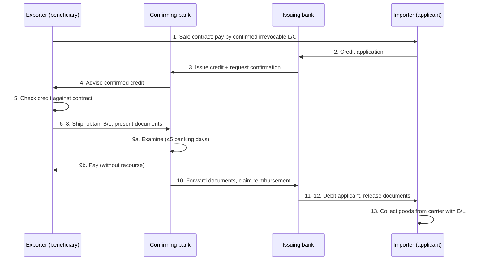

# 9. Documentary Credits and the UCP 600

> **Teaching rewrite** of documentary-credit practice under ICC’s UCP 600. Pedagogical summaries only — not the text of UCP 600, ISBP, or eUCP, and not banking advice. Article references and time limits are given for orientation; read the current ICC publications before relying on them.

## Introduction

Lesson 8 placed the **documentary credit** (letter of credit, L/C, D/C) on the payment risk ladder. This lesson opens it up. A documentary credit is an **irrevocable promise by a bank** to pay the exporter — provided the exporter presents documents that **strictly comply** with the credit. The exporter gets payment security from a bank instead of an unknown buyer; the buyer gets assurance that nothing is paid unless documents show the right goods were shipped.

The governing rules are ICC’s **Uniform Customs and Practice for Documentary Credits (UCP 600)**. The core idea fits in one line: **banks deal with documents, not with goods.**

You will learn:

- What credits do (pay, finance, protect the buyer) and their main **risk: discrepancies**
- How the **UCP** came to dominate world trade without being a treaty
- Who’s who: **parties, banks, and credit types** (confirmed, usance, revolving, red clause, transferable, back-to-back, standby)
- The full life of a **confirmed irrevocable credit**, with UCP time limits
- The two pillars: **independence** and **strict compliance**
- Practical **checklists** for exporters, importers, and banks
- The **eUCP** for electronic presentations

**Assumptions.** A commercial credit paying for goods. Standby credits and guarantees as security instruments get their own lesson.

---

## 9.1 What a documentary credit does — and where it fails

### Terminology

| Term | Meaning |
|---|---|
| Letter of credit (L/C) = documentary credit (D/C) | Same instrument, different regional habits |
| **Commercial credit** | A D/C used to **pay** for goods |
| **Standby letter of credit** | A **security** device, drawn only on default — the “letter of credit” in news about aid packages is usually this kind |

### Three functions

1. **Pays the exporter** — swaps the buyer’s creditworthiness for the **issuing bank’s**. That is why the L/C clause is usually in the sale contract at the **seller’s** request: no wasted production for a buyer who later refuses to pay.
2. **Finances the exporter** — a credit in hand can secure loans to buy materials or manufacture the goods.
3. **Protects the buyer** — no payment without the required documents. Add a **pre-shipment inspection certificate** and the buyer gets real quality assurance. Problems also surface right after shipment, not weeks later at arrival, so the buyer can source substitutes sooner.

### The big risk: discrepancies

Surveys have found that **over half** of first presentations contain at least one discrepancy even in major banking centres, and far more in some emerging markets. One discrepancy can block payment entirely.

Most of the time buyers **waive** discrepancies or **amend** the credit, so exporters grow complacent. Then the market falls — and the buyer uses a typo as a free exit. The only durable answer is a **meticulous document-management system**.

### Alternatives

| Party in a strong position | Better option |
|---|---|
| Strong **exporter** wanting to avoid L/C paperwork | Open account backed by a **standby** credit — no discrepancy risk on routine shipments |
| Strong **buyer** | **Documentary collection** or **open account** — no funds tied up before shipment |

Credits stay near-mandatory in **commodity** markets where goods are resold many times in transit.

---

## 9.2 The UCP 600

The UCP is ICC’s codification of actual L/C practice — often called the most successful harmonisation in commercial history, achieved **without** a treaty.

| Year | Milestone |
|---|---|
| 1933 | First UCP; accepted mainly in Europe |
| 1951 | Goes global (Asia, Africa, Latin America, U.S. export credits) |
| 1962 | U.K. and Commonwealth banks adopt it — the breakthrough |
| 1974, 1983, 1994 | Technical revisions (UCP 500 in 1994) |
| **2007** | **UCP 600** in force |

**How it applies.** The UCP is not law; parties **incorporate** it, typically through a line in the bank’s application form (“subject to UCP 600”). Some countries treat it almost as law or custom; in the U.K. it applies only by incorporation; in the U.S. the **UCC** governs letters of credit, but the UCP prevails when incorporated or customary. Being private rules, it can be revised far faster than a treaty.

**Interpretation.** Courts interpret it, and the **ICC Banking Commission** publishes **Opinions** on practitioners’ questions. ICC’s **International Standard Banking Practice (ISBP)** sets out how documents are examined in practice (since revised several times — check the current edition).

### Key UCP 600 changes

| Rule | What it says (paraphrased) |
|---|---|
| **Irrevocable by default** | A credit is irrevocable even if it does not say so; revocable credits are not covered |
| **Five banking days** | Each examining bank has at most **5 banking days after the day of presentation** to decide (UCP 500 allowed a “reasonable time” up to 7) |
| **Complying presentation** | Complies with the credit terms, the UCP, and **international standard banking practice** — not only the ISBP booklet |
| **Definitions & interpretations** | Dedicated articles defining key terms and common wording |

---

## 9.3 Parties, banks, and credit types

### The parties

| Exporter is called… | Because… | Importer is called… | Because… |
|---|---|---|---|
| **Beneficiary** | Receives payment | **Applicant** | Applies to the bank |
| Shipper / consignor | Ships the goods | Opener | Opens the credit |
| | | Account party | The credit is an extension of the bank’s credit to its client |

### The banks

| Bank | Role | Its risk |
|---|---|---|
| **Issuing (opening)** | Issues the credit; **irrevocable undertaking** to honour a complying presentation | Paying, then the applicant cannot or will not reimburse |
| **Nominated** | Authorised to honour (pay, defer payment, accept drafts) or negotiate; any bank if “freely available” | Not bound unless it **confirms** |
| **Advising** | Passes the credit to the beneficiary; checks **apparent authenticity** and accurate transmission | None beyond that — a conduit |
| **Confirming** | Adds its **own irrevocable undertaking** — often the advising bank, in the exporter’s country | Missing a discrepancy; issuing bank failing to reimburse. Pays **without recourse** |
| **Paying (agent)** | Examines and pays | Paying discrepant documents; if unconfirmed, may refuse if the issuer’s funds are not there |
| **Negotiating** | Examines and **advances funds** (e.g. against a usance draft) before maturity | Usually **with recourse** to the exporter if the issuer does not reimburse |

**With vs without recourse** is the key distinction: a **confirming** bank cannot claw back money from the exporter if the issuer defaults (save fraud in some jurisdictions); a mere **negotiating** bank usually can.

### Credit types

| Type | Feature | Use / caution |
|---|---|---|
| **Irrevocable** | Cannot be changed or cancelled without all parties’ consent | The standard; lets the exporter produce with confidence |
| **Revocable** | Issuer can cancel | Almost no security; rare; not covered by UCP 600 |
| **Confirmed** | Second bank’s undertaking added | Exporter gets a local, trusted paymaster |
| **Sight / usance** | Pay immediately vs at a future date | Usance gives the buyer time |
| **Revolving** | Fixed maximum, renewed automatically at intervals | Regular trade; saves re-applying |
| **Red clause** | Pre-shipment **advances** to the exporter at the applicant’s risk | Only with high trust in the exporter (originally typed in red) |
| **Transferable** | First beneficiary (middleman) transfers rights to a **second beneficiary** (supplier) and may substitute its own invoice | Must be requested by the applicant; the buyer may never know the real supplier; supplier identity is hard to hide fully |
| **Back-to-back** | Middleman uses the first credit as security for a **separate** second credit to its supplier | Buyer may not know; middleman owes the bank for valid payments under credit 2 **even if credit 1 never pays** — banks are wary |
| **Standby** | Security / guarantee, drawn on non-performance | Developed in the U.S.; legally close to a bank guarantee; usually under **ISP98** or **URDG 758** rather than mainly the UCP |

<GuidedChoiceExplanation preset="lc-bank-roles" />

---

### Checkpoint: rules, parties, and types

<MultipleChoice
  id="ib-export-import-ch9-mid1"
  title="Checkpoint — sections 9.1 to 9.3"
  questions={[
    {
      prompt: 'A credit issued under UCP 600 does not say whether it is revocable. It is treated as…',
      choices: ['Revocable', 'Irrevocable', 'Void', 'A standby'],
      answer: 1,
      why: 'UCP 600 deems credits irrevocable; revocability must be spelled out in full.',
    },
    {
      prompt: 'An advising bank passes on a credit without confirming it. If the issuing bank later fails, the advising bank…',
      choices: [
        'Must pay the exporter anyway',
        'Has no payment obligation — it only checked apparent authenticity and relayed the terms',
        'Becomes the applicant',
        'Must issue a replacement credit',
      ],
      answer: 1,
      why: 'Advising alone carries no undertaking to pay; confirming does.',
    },
    {
      prompt: 'A trading company buys from a supplier and resells to a buyer, wanting to hide the supplier and use the buyer’s credit as security. If the buyer’s credit never pays, which structure still leaves the middleman owing its bank for payments to the supplier?',
      choices: ['Transferable credit', 'Back-to-back credit', 'Revolving credit', 'Red clause credit'],
      answer: 1,
      why: 'Back-to-back credits are separate undertakings; credit 2 must be reimbursed regardless of credit 1.',
    },
    {
      type: 'order',
      prompt: 'Rank these bank roles from LEAST to MOST payment commitment toward the exporter.',
      items: [
        'Advising bank — relays the credit, checks apparent authenticity',
        'Nominated bank that has not confirmed — authorised, but not obliged, to honour',
        'Negotiating bank — advances funds, usually with recourse to the exporter',
        'Confirming bank — irrevocable undertaking, pays without recourse',
      ],
      why: 'Commitment grows from relaying, to optional authority, to advancing money that can be reclaimed, to a firm undertaking that cannot be reclaimed.',
      whyWrong: 'A negotiating bank’s advance is usually with recourse, so it commits less than a confirming bank.',
    },
  ]}
/>

---

## 9.4 Life of a confirmed irrevocable credit

Think of it as **four undertakings**: (1) the **sale contract**, (2) the **application** (bank issues; applicant reimburses), (3) the **issuing bank’s undertaking** to the beneficiary, (4) the **confirming bank’s undertaking**.

### a. Sale contract

Say **“confirmed irrevocable documentary credit”** explicitly if you want it. Exporters insist on confirmation when they doubt the issuing bank or fear political / FX risk in the buyer’s country. The credit will be **independent** of this contract (9.5), but the buyer must still apply for a credit that matches it.

### b. The application

The applicant’s contract with its bank. The bank follows the applicant’s instructions — so a credit that contradicts the sale contract puts the **buyer** in breach.

**Never include non-documentary conditions** (conditions no document proves) — banks will disregard them. Minimum contents:

| Item | Good practice |
|---|---|
| **Time of payment** | Sight or usance |
| **Expiry date and place** | Leave enough time to produce, ship, and present |
| **Latest shipment & presentation dates** | Realistic; if silent, presentation must be within **21 calendar days** after shipment and before expiry |
| **Beneficiary** | Exact, complete name and address |
| **Type** | Irrevocable, confirmed, transferable… |
| **Currency & amount** | “About”/“approximately” allows **±10%**; “up to” sets a ceiling |
| **Shipment** | Allow partial shipments unless there is a strong reason not to; permit on-deck B/Ls for hazardous or bulky goods |
| **Goods** | General but identifying; cite the contract number; **never attach** pro formas or specs |
| **Documents** | Only what is needed — every extra document is another chance of a discrepancy |

### c. Issuance

For the issuing bank, the credit is **lending** to the importer from issue until expiry/payment — it checks the importer’s creditworthiness first.

### d. Confirmation

The confirming bank analyses the **issuing bank’s** credit risk plus country and FX risk. Once it confirms, it must honour a complying presentation **whether or not** it is later reimbursed.

### e. Exporter reviews the credit — immediately

Many presentation problems start because the exporter never read the credit on arrival. Check it against the contract **and** against how you actually plan to produce and ship. If something is impractical, ask the buyer for an **amendment** — and confirm the amendment actually reaches you through the banks. Agreeing a change with the buyer but never telling the issuing bank is a classic trap.

### f. Shipment and presentation

Check documents against the credit **before** presenting, and present **early**: the bank may use up to five banking days, and you need time to correct and re-present before expiry or the presentation deadline.

### g. Examination by the confirming bank

- Decision within **5 banking days** after presentation; any refusal must be notified promptly by telecommunication or other quick means within that period.
- **Complying** → honour (pay, accept, or incur a deferred payment undertaking) or negotiate — **without recourse**.
- **Discrepant** → correct and re-present if time allows and the defect is fixable (late shipment or overdrawing cannot be fixed), or seek a **waiver**. Only the **issuing bank** approaches the applicant for a waiver. Some buyers use the moment to demand a **discount**.

### h. Issuing bank review and release

The issuing bank re-examines (also ≤5 banking days). If the confirming bank paid against discrepant documents, the issuer can refuse to reimburse it. If compliant, the issuer debits the applicant and releases the documents; the **bill of lading** lets the buyer collect the goods. The importer should check the documents too — depending on its application and the law, it may refuse to reimburse its bank for discrepant documents. That is why banks examine so carefully.

### Worked example: deadlines and tolerances

A credit for **“about USD 100,000”** expires **31 March**; it states no presentation period. The bill of lading is dated **1 March**.

| Question | Calculation | Answer |
|---|---|---|
| Acceptable drawing range? | 100,000 ± 10% | **USD 90,000 – 110,000** |
| Latest presentation date? | 1 March + 21 calendar days = 22 March; also ≤ 31 March expiry | **22 March** (the earlier date) |
| Exporter presents Monday 15 March; latest bank decision? | 5 banking days after the day of presentation: 16, 17, 18, 19, 22 March | **22 March** (no holidays assumed) |
| Bank refuses on 22 March for a fixable typo | Corrected documents must arrive by 22 March | **Too late — waiver needed** |

Presenting on 15 March felt early, yet the bank could legitimately use all its time and leave **no** window to re-present. Present as soon after shipment as you can.

<GuidedChoiceExplanation preset="lc-credit-review" />

---

### Checkpoint: the credit procedure

<MultipleChoice
  id="ib-export-import-ch9-mid2"
  title="Checkpoint — section 9.4"
  questions={[
    {
      prompt: 'A credit application says “goods must be of first-class quality” but calls for no document proving it. The bank will…',
      choices: [
        'Inspect the goods itself',
        'Disregard the non-documentary condition',
        'Refuse to issue the credit',
        'Ask the carrier to certify quality',
      ],
      answer: 1,
      why: 'Banks deal in documents; require an inspection certificate if quality matters.',
    },
    {
      prompt: 'A credit for “approximately EUR 250,000” allows the beneficiary to draw…',
      choices: ['Exactly EUR 250,000', 'EUR 237,500 – 262,500', 'EUR 225,000 – 275,000', 'Any amount'],
      answer: 2,
      why: '“About”/“approximately” allows ±10%: 225,000 to 275,000.',
      whyWrong: '±5% is a different UCP tolerance for quantities, not for “about” amounts.',
    },
    {
      prompt: 'The exporter and buyer agree by email to extend the shipment date, but nobody tells the issuing bank. What happens at presentation?',
      choices: [
        'The bank follows the email agreement',
        'The late shipment is a discrepancy — the credit was never amended',
        'The credit becomes revocable',
        'The confirming bank amends it automatically',
      ],
      answer: 1,
      why: 'Only a formal amendment issued through the banks changes the credit.',
    },
    {
      type: 'order',
      prompt: 'Rank what the beneficiary should do from the moment the credit is advised.',
      items: [
        'Compare the credit with the sale contract and the planned production and shipment.',
        'Request any needed amendments and confirm they are formally advised.',
        'Ship the goods and obtain the transport document.',
        'Check every document against the credit.',
        'Present as early as possible, leaving time to correct and re-present.',
      ],
      why: 'Problems are cheapest to fix before production and shipment; documents can only be checked once issued; early presentation preserves a correction window.',
      whyWrong: 'Reviewing the credit only after shipment can leave terms you physically cannot meet.',
    },
  ]}
/>

---

## 9.5 Independence and strict compliance

### a. Independence (autonomy)

The credit is **separate from the sale contract**. If the documents comply, the bank must pay — even if the buyer says the goods are late, short, or poor. Disputes about the goods are fought under the **sale contract**, not by stopping the credit. Without this rule nobody could trust a bank’s promise, and credits — called the “lifeblood” of trade by courts — would stop working.

**Fraud exception:** clear evidence of fraud by the beneficiary can entitle (and under some laws oblige) a bank to refuse payment. Mere **suspicion** is not enough, banks need not investigate, and courts grant injunctions only reluctantly.

Banks must resist an applicant pressing them to stop payment on a hunch. A seller can ship bad goods with good documents — which is exactly why buyers should require an **inspection certificate**.

### b. Strict compliance

Documents must match the credit **precisely**. In a well-known English judgment (*Equitable Trust v. Dawson Partners*, 1927), the court said in effect that documents which are *almost* right, or would do just as well, are not good enough.

**Why banks are so strict:**

- If a bank pays against even one discrepancy, the applicant may refuse to reimburse it.
- Banks are not experts in every trade’s jargon. In *Rayner v. Hambros Bank* (1943) the credit called for “Coromandel groundnuts”; the B/L said “machine-shelled groundnut kernels”. The trade knew these were the same goods — the bank did not have to, and its refusal was upheld.

**Where is the line?** ICC’s ISBP treats a **typo that does not change meaning** (e.g. “mashine” for “machine”) as not discrepant, but a changed **number** (“model 123” vs “model 321”) as discrepant. In practice: get goods descriptions and numbers in the invoice **exactly** right.

### Example: why falling markets bite

A buyer contracts **500 containers** at **USD 2,000** each. By arrival the market price is **USD 1,200**.

- Overpayment versus market: 500 × (2,000 − 1,200) = **USD 400,000**
- If the documents are compliant, the bank pays and the buyer must reimburse.
- If there is **any** discrepancy, the buyer can refuse a waiver and walk away — or demand a discount — with USD 400,000 of motivation.

In a **rising** market, or when the buyer needs the goods for another contract, the same discrepancy would probably be waived. The buyer must decide quickly, because the issuing bank’s refusal deadline keeps running.

<GuidedChoiceExplanation preset="lc-strict-compliance" />

---

## 9.6 Practical checklists

| Exporter / beneficiary | Importer / applicant | Banks |
|---|---|---|
| Build a rigorous document-checking system **before** using credits | Avoid excessive detail and technical specs in the credit | Help applicants with transport documents: transhipment? multimodal document? place of dispatch vs port? |
| Specify the exact credit type in the sale contract | Make the credit mirror the contract | Advise inexperienced buyers on inspection certificates |
| Review the credit **on receipt**; request amendments early | Do not demand documents not agreed with the seller | Keep the application form aligned with current UCP and Incoterms® and ICC model forms |
| Present **exactly** the documents called for — volunteer nothing extra | No non-documentary conditions — evidence everything by a document | Never exceed the examination period, even while asking for a waiver (some courts enforce shorter periods) |
| Check document **type** (insurance certificate vs policy) | Do not ask for documents the seller cannot get (e.g. marine on-board B/L for containerised multimodal transport) | Do not change the applicant’s Incoterm unilaterally — suggest the parties fix the contract first |
| Present early; ensure corrections are authenticated by the issuer of the document | Ask the bank when unsure | |
| Check your company name as beneficiary | Weigh requiring an **inspection certificate** (buyer can pay for it as a compromise) | |
| Give one person end-to-end responsibility for each credit | Choose the correct Incoterm® | |
| Choose the correct Incoterm® | | |

---

## 9.7 Electronic presentation: the eUCP

ICC added the **eUCP** as a **supplement** to the UCP for **part- or all-electronic presentations** (first version 2001 for UCP 500; updated for UCP 600; since superseded by **eUCP 2.0**, 2019 — check the current version).

| Point | What it means |
|---|---|
| **Presentation only** | Electronic *issuance and advice* were already common; the eUCP deals with presenting electronic records |
| **Supplement, not replacement** | Where the eUCP is silent, the UCP applies |
| **Express incorporation** | Incorporating the eUCP brings in the UCP too; incorporating only the UCP does **not** bring in the eUCP |
| **Mixed presentations** | Paper documents under an eUCP credit must identify the credit; a credit subject to eUCP with only paper documents is governed by the UCP alone |
| **Format** | The credit should state accepted formats; if it does not, any format is acceptable (unless corrupted). Technology-neutral |
| **Authentication** | A record that cannot be authenticated is treated as not presented; parties choose the method (e.g. digital signatures) |
| **Notice of completeness** | Beneficiary must signal when an electronic presentation is complete — records may arrive separately (paper or telecom notice allowed) |
| **Corrupted records** | Bank may ask for re-presentation; if not re-presented within **30 days**, treated as not presented |

---

### Rank: documentary-credit workflows

<MultipleChoice
  id="ib-export-import-ch9-rank"
  title="Sequence documentary-credit operations"
  questions={[
    {
      type: 'order',
      prompt: 'Rank the stages of a confirmed irrevocable credit, from contract to delivery of the goods.',
      items: [
        'Sale contract requires a confirmed irrevocable credit.',
        'Importer submits the credit application to the issuing bank.',
        'Issuing bank issues the credit and requests confirmation.',
        'Confirming bank adds its undertaking and advises the exporter.',
        'Exporter ships and presents the documents to the confirming bank.',
        'Confirming bank examines and pays, then claims reimbursement from the issuing bank.',
        'Issuing bank debits the importer and releases the documents; importer collects the goods.',
      ],
      why: 'Each undertaking rests on the one before: contract → application → issuance → confirmation → presentation → payment and reimbursement → release.',
    },
    {
      type: 'order',
      prompt: 'Rank the steps when the confirming bank finds a discrepancy.',
      items: [
        'Bank examines the documents within five banking days and identifies the discrepancy.',
        'Bank notifies the beneficiary of refusal promptly within that period.',
        'Beneficiary corrects and re-presents if the defect is fixable and time remains.',
        'If correction is impossible, a waiver request goes via the banks to the issuing bank.',
        'Issuing bank asks the applicant whether it waives the discrepancy.',
      ],
      why: 'Refusal must follow examination; correction is the beneficiary’s own fix and is tried first; only if it fails does the waiver route run through the issuing bank to the applicant.',
      whyWrong: 'The confirming bank does not approach the applicant directly — only the issuing bank does.',
    },
  ]}
/>

---

### Check: documentary credits and the UCP

<MultipleChoice
  id="ib-export-import-ch9"
  title="Documentary credits and UCP 600"
  questions={[
    {
      prompt: 'Which statement captures the core UCP principle?',
      choices: [
        'Banks inspect goods before paying',
        'Banks deal with documents, not with goods, services, or performance',
        'Banks guarantee contract quality',
        'Banks pay whenever the buyer agrees',
      ],
      answer: 1,
      why: 'Payment depends on complying documents alone.',
    },
    {
      prompt: 'The buyer learns the goods may be defective and asks the issuing bank to stop paying a credit. The documents comply and there is no clear fraud. The bank…',
      choices: [
        'Must stop payment',
        'Must pay; the buyer pursues its claim under the sale contract',
        'May pay half',
        'Must investigate the goods first',
      ],
      answer: 1,
      why: 'Independence: contract disputes do not block a complying presentation.',
    },
    {
      prompt: 'Credit says “Coromandel groundnuts”; the B/L says “machine-shelled groundnut kernels” — the same thing in the trade. The bank refuses. A court is likely to…',
      choices: [
        'Order payment because the goods are identical',
        'Uphold the refusal — banks need not know trade terminology',
        'Fine the bank',
        'Void the credit',
      ],
      answer: 1,
      why: 'Strict compliance: documents must match the credit wording, not the trade’s understanding.',
    },
    {
      prompt: 'Which error is most likely NOT a discrepancy under standard banking practice?',
      choices: [
        '“Model 321” instead of “Model 123”',
        '“Fountan pen” instead of “fountain pen”',
        'Shipment after the latest shipment date',
        'Amount above the credit',
      ],
      answer: 1,
      why: 'A typo that does not change meaning is tolerated; changed numbers, late shipment, and overdrawing are not.',
    },
    {
      prompt: 'Who pays the exporter without recourse?',
      choices: ['Advising bank', 'Negotiating bank', 'Confirming bank', 'Collecting bank'],
      answer: 2,
      why: 'A confirming bank cannot reclaim the money if the issuer fails to reimburse (save fraud in some jurisdictions).',
    },
    {
      prompt: 'B/L dated 10 June; credit expires 15 July; no presentation period stated. Latest presentation date?',
      choices: ['10 June', '1 July', '15 July', '31 July'],
      answer: 1,
      why: '10 June + 21 calendar days = 1 July, which is before the 15 July expiry.',
      whyWrong: '15 July is the expiry — but the default 21-day rule ends earlier.',
    },
    {
      prompt: 'A buyer contracted 300 containers at USD 1,500; the market falls to USD 1,000. If the seller’s documents contain a discrepancy, how much incentive does the buyer have to refuse a waiver?',
      choices: ['USD 50,000', 'USD 150,000', 'USD 300,000', 'USD 450,000'],
      answer: 1,
      why: '300 × (1,500 − 1,000) = 150,000.',
    },
    {
      prompt: 'A credit says it is subject to UCP 600 only. An exporter presents electronic records. Which applies?',
      choices: [
        'The eUCP automatically',
        'Only the UCP — the eUCP applies only if expressly incorporated',
        'National e-commerce law only',
        'Neither; electronic records are banned',
      ],
      answer: 1,
      why: 'Incorporating eUCP brings in UCP; not the other way round.',
    },
    {
      prompt: 'Which credit lets an exporter draw pre-shipment advances at the applicant’s risk?',
      choices: ['Revolving', 'Red clause', 'Back-to-back', 'Standby'],
      answer: 1,
      why: 'Red clause credits fund production — only with a highly trusted exporter.',
    },
  ]}
/>

---

## Takeaways

:::tip Remember
- A D/C replaces the buyer’s credit risk with a **bank’s** — but only for **complying documents**
- UCP 600: irrevocable by default, **5 banking days** to examine, **21 days** default presentation, “about” = **±10%**
- **Confirming** bank pays without recourse; **advising** bank only relays; **negotiating** usually with recourse
- **Independence**: contract disputes do not stop payment; only clear **fraud** does
- **Strict compliance**: “almost the same” is not the same — get descriptions and numbers exact
- Review the credit **on arrival**, present **early**, and never rely on waivers in a falling market
- eUCP must be **expressly** incorporated for electronic presentations
:::

## Further Reading

- [8. Introduction to international payments](./international-payments) — where credits sit among payment methods
- [7. ICC arbitration and dispute services](./icc-arbitration-and-adr) — DOCDEX for credit disputes
- [5. The international sale contract](./international-sale-contract) — payment clause and documents list
- [International Business home](../intro)
- Later (planned): factoring and forfaiting · standbys and demand guarantees · carriage documents · insurance
- Primary sources: UCP 600, current ISBP, eUCP, ICC Banking Commission Opinions ([ICC](https://iccwbo.org/))
