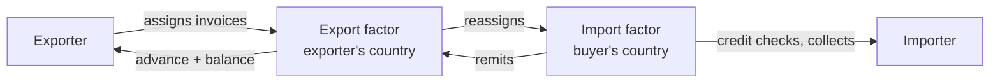

# 10. Short-term Trade Finance: Factoring and Forfaiting

> **Teaching rewrite** of export receivables finance. Pedagogical summaries only — not financial or legal advice, and not the text of any ICC or industry rules. Rates, fees, and percentages in examples are illustrative; real quotes depend on the buyer, the guarantor, the country, and the market.

## Introduction

Lesson 8 showed that **open account** is what buyers want and what competitive markets increasingly force on exporters. The price is cash: every “net 90” invoice is money the exporter has already spent on production but will not see for three months — and may never see if the buyer fails.

Two families of finance turn those future payments into cash **now**:

- **Factoring** — an ongoing arrangement in which a **factor** buys a stream of (usually small, short) invoices, advances most of their value, and often also checks credit, keeps the ledger, and collects.
- **Forfaiting** — usually a **single**, larger, medium-term receivable (often a bill of exchange or promissory note, ideally bank-guaranteed) sold to a **forfaiter** for **100%** of its discounted value, **without recourse** to the exporter.

This lesson covers:

- Why receivables finance exists and when it beats a bank overdraft
- Factoring: services, recourse vs non-recourse, fees, **two-factor** vs **single-factor** schemes, factoring vs credit insurance
- Forfaiting: definition, the **aval**, supplier vs buyer credit, transaction sequence, documents, pricing
- Side-by-side comparison, rules (**URF**), and **anti-money-laundering** duties

**Assumptions.** A B2B exporter selling on deferred terms. Bank guarantees and standby credits as security instruments are covered only as they support forfaiting.

---

## 10.1 Turning receivables into cash

| Option | How it works | Drawback |
|---|---|---|
| **Bank overdraft / credit line** | Borrow against the company’s general credit | Expensive; uses up credit lines needed for other purposes |
| **Factoring** | Sell the invoice stream to a factor at a discount; get ~70–85% up front | Fees and interest; buyers may notice (unless undisclosed) |
| **Forfaiting** | Sell one guaranteed payment obligation outright at a discount | Strict documents; importer must usually arrange a bank guarantee/aval |

**Factoring vs forfaiting at a glance**

| | Factoring | Forfaiting |
|---|---|---|
| Typical size | Many small invoices (often < USD 100,000) | One larger receivable (often > USD 100,000, up to hundreds of millions) |
| Typical term | Short: 30–90 (up to 180) days | Medium: often 1–5 years, also shorter |
| Relationship | Ongoing, whole or part of turnover | Usually a single transaction (sometimes under a master agreement) |
| Advance | ~70–85% now, balance on collection | ~100% of discounted value now |
| Recourse | Either (recourse traditionally more common) | **Without recourse** |
| Instrument | Invoices (open account) | Bills of exchange, promissory notes, L/C deferred-payment/acceptance |
| Extra services | Credit checks, ledger, collections | None needed — the forfaiter becomes the creditor |
| Typical users | SMEs with many customers | Capital-goods and project exporters |

---

## 10.2 Factoring: major features

### Definition

Factoring is the **purchase of an exporter’s receivables** by a factor. Factors may also offer:

1. **Finance** (advances against receivables)
2. **Credit risk assessment and protection**
3. **Collection** of overdue accounts
4. **Ledger administration**

UNIDROIT’s factoring convention treats an arrangement with at least **two** of these functions as international factoring. Related names: *invoice financing, invoice discounting, receivables discounting, sales financing*.

### Why exporters use it

- Offer **open account** confidently instead of insisting on L/Cs or collections
- Cash-flow help when bank finance is too costly or only works against negotiable instruments
- **Outsource** credit control and collections — much as forwarders take over transport

### Disclosed vs undisclosed

| Type | Buyer knows? | Services |
|---|---|---|
| **Disclosed** factoring | Yes — buyer pays the factor | Full: finance, credit, ledger, collections |
| **Undisclosed (silent)** factoring | No | Exporter keeps the customer relationship |
| **Invoice discounting** (a silent form) | No | Finance only — no credit management or ledger |

Some exporters choose silence because customers might wrongly read factoring as a sign of financial weakness.

### Market

International factoring has grown strongly for years, spreading from its traditional base in **garments and textiles** to many manufacturing and service sectors, and into markets where it was once rare (e.g. parts of Latin America, the Middle East, Eastern Europe, and Southeast Asia). Industry bodies such as **FCI** publish current volumes.

---

## 10.3 Factoring in practice

### How it works

```mermaid
sequenceDiagram
  participant E as Exporter
  participant F as Factor
  participant I as Importer
  E->>F: Factoring agreement; credit limit per buyer
  E->>I: Ship goods + original invoice (net 90)
  E->>F: Copy of invoice + proof of delivery
  F->>E: Advance ~70–85% (within ~24 h once account is open)
  I->>F: Pays 100% at maturity
  F->>E: Balance minus fees and interest
```

- Opening a factoring account typically takes a few business days; funding can then follow within about a day of submitting invoices.
- The factor sets a **credit limit per buyer** — directly or through an **import factor** in the buyer’s country.
- The factor may ask for evidence of delivery (transport document, delivery note) before paying.
- Exporters usually get the best terms by assigning the **whole** (or a defined part) of their receivables flow.

### Recourse vs non-recourse

| | Recourse factoring | Non-recourse factoring |
|---|---|---|
| If the buyer does not pay | Exporter must repay the advance | Factor bears the loss (for approved credit) |
| Who holds credit risk | **Exporter** | **Factor** |
| Cost & availability | Cheaper, easier to obtain | More expensive; factor evaluates buyers first |
| Watch-out | A big customer’s bankruptcy can force repayment of large advances | Cover applies only within approved limits and to undisputed debts |

### Fees

| Charge | Typical basis |
|---|---|
| **Service charge** | About **1%** of invoice value — credit protection, collection, reporting |
| **Interest (discount charge)** | On funds actually drawn, per day — similar to overdraft rates |

Fees are usually billed monthly, sometimes up front.

### Worked example: what a factored invoice really costs

Invoice **USD 100,000**, terms **net 90**, advance **80%**, service charge **1%**, interest **6% p.a.** (360-day basis), buyer pays on day 90.

| Step | Calculation | USD |
|---|---|---|
| Advance at shipment | 80% × 100,000 | **80,000** |
| Service charge | 1% × 100,000 | 1,000 |
| Interest on the advance | 80,000 × 6% × 90/360 | 1,200 |
| Balance paid at collection | 20,000 − 1,000 − 1,200 | **17,800** |
| Total received | 80,000 + 17,800 | **97,800** |
| All-in cost | 2,200 / 100,000 | **2.2%** |

Compare that 2.2% with the cost of an overdraft **plus** the credit insurance and collection effort the factor replaces.

### Two-factor vs single-factor schemes



| | Two-factor | Single-factor (“direct export”) |
|---|---|---|
| Parties | Export factor + correspondent **import factor** | One factor handles everything |
| Strengths | Local language, law, and customs for credit checks and collection; import factor pays **100%** of approved invoices if the buyer defaults | Cheaper and simpler |
| Best when | Unfamiliar markets, many new buyers | Well-established buyer relationships; integrated legal areas such as the EU |
| Risk | More fees and coordination | Factor has less local reach — more exposure |

### Factoring vs credit insurance

| | Factor | Credit insurer |
|---|---|---|
| Typical cover | Up to **100%** of approved invoices | Often **~90%** (the rest is the exporter’s own share) |
| Speed of credit decision | Slower, more thorough | Faster |
| Services | Finance + collections + ledger | Indemnity for losses only |
| Cost | Higher | Lower premiums |
| Suits | New exporters wanting service and cash | Experienced exporters managing their own credit |

### Advantages and constraints

- Lets an exporter win buyers who refuse advance payment or L/Cs — common when developed-market buyers want time to inspect goods from emerging-market suppliers.
- Factoring is a **regulated** financial service in many countries: licensing (e.g. France), restrictions on assigning future receivables in bulk (Germany historically required per-invoice transfers), and taxes such as stamp duty (India) can shape the market.

<GuidedChoiceExplanation preset="tradefin-factoring" />

---

### Checkpoint: factoring

<MultipleChoice
  id="ib-export-import-ch10-mid1"
  title="Checkpoint — sections 10.1 to 10.3"
  questions={[
    {
      prompt: 'Under recourse factoring, the buyer goes bankrupt before paying an advanced invoice. Who bears the loss?',
      choices: ['The factor', 'The exporter, who must repay the advance', 'The import factor', 'The buyer’s bank'],
      answer: 1,
      why: 'Recourse puts credit risk back on the exporter; that is why it is cheaper.',
      whyWrong: 'The factor absorbs the loss only under non-recourse terms (within approved limits).',
    },
    {
      prompt: 'An exporter wants finance against invoices but does not want customers to know. Which arrangement fits?',
      choices: ['Two-factor disclosed factoring', 'Invoice discounting (undisclosed)', 'Forfaiting with an aval', 'Documentary collection'],
      answer: 1,
      why: 'Invoice discounting is a silent form: finance only, customer relationship unchanged.',
    },
    {
      prompt: 'Invoice USD 50,000, advance 85%, service charge 1%, interest 8% p.a. on the advance for 60 days (360-day year). Balance paid to the exporter at collection?',
      choices: ['USD 7,500', 'USD 6,433', 'USD 7,000', 'USD 6,000'],
      answer: 1,
      why: 'Advance 42,500; fee 500; interest 42,500 × 8% × 60/360 = 566.67; balance 7,500 − 500 − 566.67 ≈ 6,433.',
      whyWrong: 'USD 7,500 is the unadvanced 15% before deducting the factor’s fee and interest.',
    },
    {
      type: 'order',
      prompt: 'Rank the steps of a two-factor export factoring deal.',
      items: [
        'Exporter signs a factoring agreement with the export factor.',
        'Import factor checks the buyer and sets a credit limit.',
        'Exporter ships and sends the invoice copy and proof of delivery to the export factor.',
        'Export factor advances up to about 85% of the invoice value.',
        'Import factor collects from the importer at maturity and remits to the export factor.',
        'Export factor pays the exporter the balance minus charges.',
      ],
      why: 'Limits must exist before shipments are financed; advances follow proof of shipment; the balance can only be paid after collection.',
      whyWrong: 'Shipping before a buyer limit is approved risks invoices the factor will not finance or cover.',
    },
  ]}
/>

---

## 10.4 Forfaiting: an in-depth look

### Definition

Forfaiting is the **discounting of trade-related payment obligations falling due in the future, without recourse** to the exporter (the seller/endorser). The forfaiter pays now and takes all risk at maturity.

- Traditionally for **capital goods** and projects; increasingly also for working-capital-style trade deals
- Usually **medium-term** (often one to five years), at a **fixed** (normal) or floating rate
- Often under a non-binding **master agreement** that lists acceptable receivables

### Key characteristics

| Feature | Detail |
|---|---|
| Financing | **100%** of the discounted value, **without recourse** |
| Security | Importer’s obligation often backed by a bank **aval** or guarantee |
| L/C route | Discounting an acceptance or **deferred payment undertaking** by the issuing or confirming bank |
| Instruments | Bills of exchange, promissory notes, L/C undertakings — legally valid and preferably negotiable |
| Size | From roughly USD 100,000 up to very large deals |
| Currencies | Any major currency |
| Guarantee quality | Should be **irrevocable, unconditional, and assignable** |

### The aval

An **aval** is a bank’s guarantee written on the bill or note itself (“per aval”), adding the bank’s credit to the obligor’s. Forfaiters prefer it because an avalised bill is easy to trade. Where local law does not recognise the aval, a separate **bank guarantee**, a guarantor’s endorsement, or a **standby letter of credit** can do the same job — if the guarantor is creditworthy.

### Supplier credit vs buyer credit

| | Supplier credit | Buyer credit |
|---|---|---|
| Who gets the money | Exporter | Importer (or its bank) |
| Typical instrument | Exporter draws a bill on the buyer, buyer accepts, buyer’s bank avalises | Buyer (or its bank) issues a promissory note |
| Forfaiter’s concern | Standard | Harder to obtain shipping documents; funds may not be used for the import |

---

## 10.5 Forfaiting in practice

### Transaction sequence

```mermaid
sequenceDiagram
  participant E as Exporter
  participant FF as Forfaiter
  participant B as Importer's bank (guarantor)
  participant I as Importer
  E->>FF: 1. Request quote; forfaiter commits (rate, fees, availability date)
  E->>I: 2. Commercial contract
  E->>I: 3. Deliver goods
  I->>B: 4. Bank avalises bills/notes (or issues guarantee / L/C undertaking)
  I->>E: 5. Hands over avalised bills/notes
  E->>FF: 6. Endorses and delivers documents "without recourse"
  FF->>E: 7. Pays discounted value — cash now
  FF->>B: 8. Presents bills at maturity
  B->>FF: 9. Pays at maturity
```

**Commitment stage.** The forfaiter confirms it will buy paper bearing a named bank’s aval (or an L/C acceptance/deferred payment undertaking) by an **availability date**, giving the exporter time to ship and collect the avalised paper. It quotes a **discount rate**, any **days of grace**, and a **commitment fee** if there is a long run-in.

**Gross-up.** If the exporter must net a fixed amount, the forfaiter calculates a higher face value for the bills so that, after discount, the exporter receives exactly that amount. The importer then owes the face value — the credit cost is effectively priced into the deal.

### Required documents (typical minimum)

1. Copy of the supply contract (or its payment terms)
2. Signed commercial invoice
3. Shipping documents (bill of lading, air waybill, rail bill, receipts…)
4. If relevant: the letter of credit and amendments
5. If relevant: the issuing or confirming bank’s acceptance advice / due-date notification
6. Letter of assignment and notice to the guarantor
7. Letter of guarantee or **aval** (from a creditworthy bank)

### Pricing

| Component | What it covers |
|---|---|
| **Funding cost** | The forfaiter’s cost of money for the life of the deal. Historically **LIBOR**-based; LIBOR has been discontinued, so quotes now use replacement benchmarks (e.g. SOFR, €STR, SONIA) or term rates |
| **Margin** | Political, commercial, and transfer risk of the guarantor and its country — varies widely (roughly fractions of a percent to several percent p.a.) |
| **Days of grace** | Extra days of interest for typical payment delays from the debtor country (from none to around ten days) |
| **Commitment fee** | Paid per annum on the commitment period (commitment to discounting) if the forfaiter holds a line open |
| **Broker fee** | Optional one-time fee (often well under 1%) if a broker shops the deal |

### Worked example: forfaiting a bill

An exporter holds an avalised bill with face value **USD 1,000,000**, maturing in **180 days**. The forfaiter quotes an all-in discount rate of **6% p.a.** (funding + margin), **5 days of grace**, straight discount on a 360-day year. The commitment lasted **60 days** at **0.75% p.a.**

| Item | Calculation | USD |
|---|---|---|
| Discount | 1,000,000 × 6% × (180 + 5)/360 | 30,833 |
| Proceeds to exporter | 1,000,000 − 30,833 | **969,167** |
| Commitment fee | 1,000,000 × 0.75% × 60/360 | 1,250 |
| Net to exporter | 969,167 − 1,250 | **967,917** |

**Gross-up variant.** To net exactly **USD 1,000,000** (ignoring the commitment fee), the bill must have face value 1,000,000 ÷ (1 − 0.06 × 185/360) ≈ **USD 1,031,814** — the importer owes that amount at maturity.

<GuidedChoiceExplanation preset="tradefin-forfaiting" />

---

### Checkpoint: forfaiting

<MultipleChoice
  id="ib-export-import-ch10-mid2"
  title="Checkpoint — sections 10.4 and 10.5"
  questions={[
    {
      prompt: 'After forfaiting, the avalising bank fails and the bill is never paid. What happens to the exporter?',
      choices: [
        'Must refund the forfaiter',
        'Keeps the money — forfaiting is without recourse',
        'Must sue the importer on behalf of the forfaiter',
        'Shares the loss 50/50',
      ],
      answer: 1,
      why: 'The forfaiter takes commercial, political, transfer, interest-rate, and currency risk at maturity.',
    },
    {
      prompt: 'Why do forfaiters prefer bills carrying a bank aval?',
      choices: [
        'An aval adds a creditworthy bank’s obligation and makes the paper easy to trade',
        'An aval replaces the need for any commercial invoice',
        'An aval makes the transaction recourse to the exporter',
        'An aval removes all country risk',
      ],
      answer: 0,
      why: 'Avalised paper has a liquid secondary market; country risk is still priced in the margin.',
    },
    {
      prompt: 'Face value USD 500,000, 90 days to maturity, 3 days of grace, discount rate 8% p.a. (360-day year). Approximate proceeds?',
      choices: ['USD 489,667', 'USD 490,000', 'USD 460,000', 'USD 496,667'],
      answer: 0,
      why: '500,000 × 8% × 93/360 = 10,333; 500,000 − 10,333 = 489,667.',
      whyWrong: 'USD 490,000 ignores the days of grace (90 days only).',
    },
    {
      type: 'order',
      prompt: 'Rank the steps of a typical forfaiting transaction.',
      items: [
        'Forfaiter commits to buy paper with a named bank’s aval by an availability date.',
        'Exporter and importer sign the commercial contract on deferred terms.',
        'Exporter ships the goods.',
        'Importer’s bank avalises the bills or notes, which are handed to the exporter.',
        'Exporter endorses the paper without recourse to the forfaiter and is paid the discounted value.',
        'Forfaiter presents the paper at maturity and is paid by the guarantor.',
      ],
      why: 'Securing the commitment first lets the exporter price the deal; paper only exists after shipment and avalisation; maturity comes last.',
      whyWrong: 'Signing first and asking for a forfaiting quote afterwards risks a deal no forfaiter will buy at an acceptable price.',
    },
  ]}
/>

---

## 10.6 Advantages and drawbacks of forfaiting

| For the exporter | Against / watch-outs |
|---|---|
| **No recourse**: commercial, political, transfer, interest and currency risk pass to the forfaiter | Can look **expensive** — the price reflects all that risk |
| **Fixed rate** known in advance — easy to build into the selling price | **Strict documents**; one defect can delay or kill the purchase |
| Cash now; receivable removed from the balance sheet | Importer must cooperate: obtaining an aval uses its credit lines and costs a fee |
| No collection work | Cost calculations are complex — get expert quotes, compare brokers |

---

## 10.7 Rules and anti-money-laundering

### Uniform Rules for Forfaiting (URF)

ICC and the **International Trade and Forfaiting Association (ITFA, formerly IFA)** drafted standard rules, published in 2013 as the **Uniform Rules for Forfaiting (URF 800)**. They cover the **primary market** (exporter to forfaiter) and the **secondary market** (forfaiter to forfaiter): recourse, required documents, deadlines, and model agreements. Contracts incorporate them by reference, much like UCP 600 for credits.

### Money laundering and fraud

Trade finance is a known channel for fraud and money laundering. The **FATF** (Financial Action Task Force) sets the global AML/CFT standard — its **40 Recommendations**, which since 2012 also absorb the former special recommendations on terrorist financing. Factoring and forfaiting firms apply a **risk-based approach**:

| Market | Customer | Due diligence also on |
|---|---|---|
| **Primary** | The exporter selling the receivable | The importer and the underlying transaction — is it real? |
| **Secondary** | The forfaiter selling the paper | The guarantor bank paying at maturity, and as far as possible the original parties |

The further a buyer of the paper is from the original deal, the harder meaningful due diligence becomes.

<GuidedChoiceExplanation preset="tradefin-choose" />

---

### Rank: choosing and running receivables finance

<MultipleChoice
  id="ib-export-import-ch10-rank"
  title="Sequence trade-finance decisions"
  questions={[
    {
      type: 'order',
      prompt: 'Rank these from LEAST to MOST risk transferred away from the exporter.',
      items: [
        'Bank overdraft secured on the company’s general credit',
        'Recourse factoring',
        'Credit insurance covering about 90% of approved invoices',
        'Non-recourse factoring covering 100% of approved invoices',
        'Forfaiting an avalised bill without recourse',
      ],
      why: 'An overdraft transfers nothing; recourse factoring transfers only the funding; insurance covers most of the credit loss; non-recourse factoring covers it fully within limits; forfaiting also passes political, transfer, interest-rate and currency risk.',
      whyWrong: 'Recourse factoring transfers less risk than credit insurance — the exporter still repays advances on default.',
    },
    {
      type: 'order',
      prompt: 'Rank the forfaiter’s anti-money-laundering checks in a primary-market deal.',
      items: [
        'Identify and verify the exporter (customer due diligence).',
        'Assess the risk of the countries, products, and parties involved.',
        'Scrutinise the importer and the underlying commercial transaction for validity.',
        'Check the documents presented against the claimed shipment.',
        'Decide whether to purchase, request more information, or report suspicion.',
      ],
      why: 'You must know your customer first; the risk assessment sets how deep the transaction checks go; the decision comes last.',
    },
  ]}
/>

---

### Check: factoring and forfaiting

<MultipleChoice
  id="ib-export-import-ch10"
  title="Factoring and forfaiting"
  questions={[
    {
      prompt: 'Which situation best fits factoring rather than forfaiting?',
      choices: [
        'One USD 8 million machine sale on 4-year terms with a bank aval',
        'An SME with 300 customers invoicing USD 5,000–20,000 each on net 60',
        'A project payable by an L/C deferred payment undertaking over 3 years',
        'A government agency issuing promissory notes',
      ],
      answer: 1,
      why: 'Many small, short invoices with credit-control needs are classic factoring.',
    },
    {
      prompt: 'A typical factoring advance is…',
      choices: ['100% of face value', 'About 70–85% now, balance on collection', '50% after the buyer pays', 'Nothing until maturity'],
      answer: 1,
      why: 'The retained balance (minus charges) is paid when the buyer pays.',
    },
    {
      prompt: 'In a two-factor scheme, which party pays 100% of an approved invoice if the buyer defaults?',
      choices: ['Exporter', 'Export factor alone', 'Import factor (under its guarantee)', 'Buyer’s customs broker'],
      answer: 2,
      why: 'The import factor guarantees approved invoices and pursues the buyer locally.',
    },
    {
      prompt: 'Main reason an experienced exporter might choose credit insurance over factoring?',
      choices: [
        'Insurance covers 100% and adds collection services',
        'Lower cost when it already manages credit and collections well',
        'Insurance provides immediate cash advances',
        'Insurance is required by UCP 600',
      ],
      answer: 1,
      why: 'Premiums are lower; the factor charges for services such an exporter may not need.',
    },
    {
      prompt: 'Which statement about forfaiting is correct?',
      choices: [
        'It is always recourse to the exporter',
        'It typically finances a single medium-term receivable at 100% of discounted value without recourse',
        'It requires the forfaiter to manage the exporter’s sales ledger',
        'It cannot be used with letters of credit',
      ],
      answer: 1,
      why: 'Forfaiting buys one obligation outright; L/C acceptances and deferred payment undertakings are common forfaiting assets.',
    },
    {
      prompt: '“Days of grace” in a forfaiting quote are…',
      choices: [
        'Free days the importer gets after maturity',
        'Extra days of interest reflecting typical payment delays from the debtor country',
        'The period before the forfaiter commits',
        'Days the exporter has to ship',
      ],
      answer: 1,
      why: 'They are added to the discount period to price expected delays.',
    },
    {
      prompt: 'An exporter must net exactly USD 200,000. Discount rate 10% p.a., 180 days, no grace (360-day year). Required face value?',
      choices: ['USD 210,000', 'USD 210,526', 'USD 220,000', 'USD 190,000'],
      answer: 1,
      why: 'Discount factor 1 − 0.10 × 180/360 = 0.95; 200,000 / 0.95 ≈ 210,526.',
      whyWrong: 'USD 210,000 adds simple interest instead of grossing up for a discount.',
    },
    {
      prompt: 'Where does a forfaiter in the secondary market also need to perform due diligence?',
      choices: [
        'Only on the seller of the paper',
        'On the guarantor bank that will pay at maturity, and where possible on the original parties',
        'Nowhere — the primary forfaiter already did it',
        'Only on the shipping line',
      ],
      answer: 1,
      why: 'It receives funds from the guarantor; risk-based checks extend to the underlying deal.',
    },
  ]}
/>

---

## Takeaways

:::tip Remember
- **Factoring**: ongoing, many small invoices, ~70–85% advance, credit + ledger + collection services; recourse or non-recourse
- **Forfaiting**: usually one larger medium-term receivable, **100% of discounted value**, **without recourse**, best with a bank **aval**
- Recourse factoring is cheaper because the **exporter keeps the credit risk**
- Two-factor schemes add a local **import factor**; single-factor is cheaper but less local
- Forfaiting price = funding cost + country/guarantor **margin** + days of grace (+ commitment fee)
- Rules: **URF 800**; AML: FATF risk-based due diligence in both primary and secondary markets
:::

## Further Reading

- [9. Documentary credits and the UCP 600](./documentary-credits-ucp) — acceptances and deferred payment undertakings that forfaiters discount
- [8. Introduction to international payments](./international-payments) — open account, bills of exchange, avalised bills
- [International Business home](../intro)
- Next: [11. Guarantees, bonds, and standby credits](./guarantees-bonds-standbys) — demand vs surety, URDG, ISP98
- Later (planned): carriage documents · insurance
- Sources: ICC Uniform Rules for Forfaiting (URF 800); FCI factoring resources; FATF Recommendations ([fatf-gafi.org](https://www.fatf-gafi.org/))
