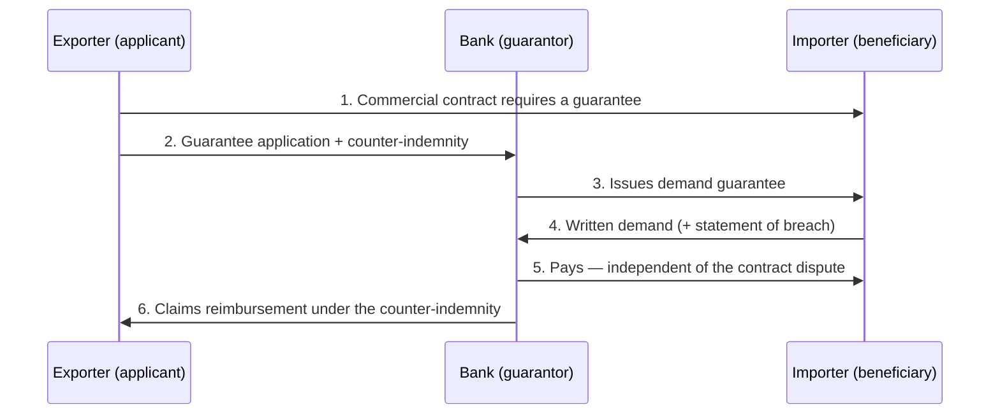
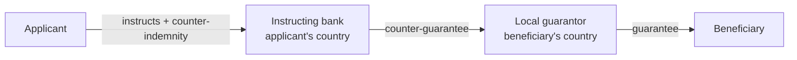

# 11. Securing International Transactions: Guarantees, Bonds, and Standby Credits

> **Teaching rewrite** of trade security instruments. Pedagogical summaries only — not legal or banking advice and not the text of URDG 758, ISP98, or URCB. Percentages and fees in examples are illustrative.

## Introduction

Suing a foreign counterparty is slow and expensive (Lessons 4 and 6). So international contracts often replace the old **cash deposit** with a promise from a bank or insurer: a **guarantee**, **bond**, or **standby letter of credit**. These instruments:

- **Deter** default — the defaulting party knows money will be taken quickly
- **Compensate** fast if default happens anyway

The single most important question about any such instrument is: **does the guarantor pay on the beneficiary’s mere demand, or only after default is proven?** Demand instruments are common and powerful — and dangerous, because a beneficiary can claim even when not entitled to (the **unfair call**).

This lesson covers:

- Terminology and the three parties
- The six main uses: bid, performance, advance payment, retention, warranty, payment
- **Demand** vs **surety (conditional)** instruments — and why the difference matters more than the label
- ICC rules: **URDG 758**, URCB, URCG, and **ISP98** for standbys
- Direct (three-party) vs indirect (four-party) structures

**Assumptions.** Cross-border sales and construction contracts. Commercial letters of credit as payment instruments are in Lesson 9.

---

## 11.1 Terminology and parties

There is **no international standard vocabulary**. “Guarantee”, “bond”, “surety”, “undertaking”, and “indemnity” are used almost interchangeably in practice, and national laws treat them differently. Issuers may be banks, insurers, specialised surety companies, or other financial firms.

**Standby credits** (standbys, SLCs) arose because U.S. banks were once barred from issuing guarantees, so they adapted the letter-of-credit form. Like guarantees, they are **backups** used only on default — unlike **commercial credits**, which are the normal way of paying.

:::caution The label does not tell you the type
A document called a “guarantee”, “bond”, or “standby” can be either a **demand** instrument or a **surety** instrument. Read the payment condition, not the title.
:::

| Party | Role | Example |
|---|---|---|
| **Beneficiary** | Receives payment if the other side does not perform | Importer, employer, often a government agency |
| **Applicant** (formerly account party / principal) | Asks for the guarantee and must reimburse the guarantor | Exporter or contractor |
| **Guarantor** | Bank, insurer, or surety company that promises to pay a determined or determinable sum | Exporter’s bank |

---

## 11.2 Main uses

| Type | Protects the beneficiary against… | Typical amount | When |
|---|---|---|---|
| **Bid (tender)** | Winning bidder refusing to sign the contract on its bid terms | ~2–5% of contract value | Tender stage |
| **Advance payment (repayment)** | Exporter keeping an advance without performing | Equal to the advance (often reducing as deliveries are made) | When the advance is paid |
| **Performance** | Exporter or contractor failing to perform | Commonly up to ~10% | Contract execution |
| **Retention** | Hidden defects, instead of the employer withholding part of each payment | The retention amount | Around completion |
| **Maintenance (warranty)** | Supplier failing warranty obligations | A percentage for the warranty period | After acceptance |
| **Payment** | Importer not paying on open account | The amount at risk | Throughout credit period |

### Case snapshot — an unfair call

*Paraphrased from Falcoal, Inc. v. Türkiye Kömür İşletmeleri Kurumu (S.D. Tex. 1987).* A U.S. coal supplier won a Turkish state tender and posted a USD 400,000 performance bond — evidently payable on demand. The buyer was supposed to open a commercial letter of credit before shipment but never did, and then called the bond anyway. The supplier sued in Texas; the court dismissed the case for lack of jurisdiction over the Turkish entity.

**Lesson:** a demand bond can be called even when the beneficiary is the party in breach, and recovering the money abroad may be impossible in practice. Limit the amount, negotiate protections, or insure against unfair calls.

### Worked example: the guarantee stack on one project

A contractor bids for a **USD 20 million** plant. The employer pays a **15%** advance.

| Stage | Instrument | Calculation | Amount (USD) |
|---|---|---|---|
| Tender | Bid guarantee 3% | 3% × 20M | 600,000 |
| Signing | Advance payment guarantee | 15% × 20M | 3,000,000 |
| Execution | Performance guarantee 10% | 10% × 20M | 2,000,000 |
| Completion | Retention guarantee 5% (instead of withheld cash) | 5% × 20M | 1,000,000 |
| Warranty | Maintenance guarantee 2% | 2% × 20M | 400,000 |

If the bank charges **1.5% p.a.** on the performance guarantee for **18 months**: 2,000,000 × 1.5% × 1.5 = **USD 45,000** — a cost the contractor builds into its bid. The bid guarantee is released once the winner signs; the advance payment guarantee usually **reduces** as work is delivered; retention and warranty guarantees replace cash the employer would otherwise hold.

<GuidedChoiceExplanation preset="guarantee-types" />

---

### Checkpoint: parties and uses

<MultipleChoice
  id="ib-export-import-ch11-mid1"
  title="Checkpoint — sections 11.1 and 11.2"
  questions={[
    {
      prompt: 'A bank issues a guarantee at the contractor’s request in favour of a ministry. Who is the applicant?',
      choices: ['The ministry', 'The contractor', 'The bank', 'The project engineer'],
      answer: 1,
      why: 'The applicant orders the guarantee and reimburses the guarantor; the ministry is the beneficiary.',
    },
    {
      prompt: 'An importer pays a 20% advance. Which instrument protects it if the goods are never shipped?',
      choices: ['Bid guarantee', 'Advance payment (repayment) guarantee', 'Maintenance guarantee', 'Commercial letter of credit'],
      answer: 1,
      why: 'It secures return of the advance on non-performance.',
    },
    {
      prompt: 'Contract USD 8 million; 10% performance guarantee; bank fee 1.2% p.a. for 24 months. Fee?',
      choices: ['USD 9,600', 'USD 19,200', 'USD 96,000', 'USD 192,000'],
      answer: 1,
      why: 'Guarantee 800,000 × 1.2% × 2 years = 19,200.',
      whyWrong: 'USD 192,000 applies the fee to the whole contract value, not the guarantee amount.',
    },
    {
      type: 'order',
      prompt: 'Rank these guarantees in the order they usually appear over a construction project’s life.',
      items: [
        'Bid (tender) guarantee',
        'Advance payment guarantee',
        'Performance guarantee',
        'Retention guarantee',
        'Maintenance (warranty) guarantee',
      ],
      why: 'Tender → contract signing and advance → execution → completion (retentions) → post-acceptance warranty period.',
      whyWrong: 'A warranty guarantee only matters after the works are accepted, so it comes last.',
    },
  ]}
/>

---

## 11.3 Demand vs surety (conditional) instruments

| | **Demand** guarantee | **Surety / conditional** guarantee |
|---|---|---|
| Trigger | Written demand (usually with a statement of breach) | **Proven** default — e.g. judgment, arbitral award, or agreed certificate of default |
| Legal nature | **Independent** (autonomous) of the contract | **Accessory** (secondary) to the contract |
| Guarantor’s defences | Essentially none except clear **fraud** | Can raise the **applicant’s** contractual defences |
| What the guarantor pays | The demanded amount up to the limit | Only to the extent of the applicant’s actual liability — or it **performs** instead |
| Speed for beneficiary | Fast — “instant cash” | Slow — must establish default first |
| Unfair-call risk for applicant | **High** | Low |
| Typical amount | Small: ~**5–10%** | Larger: **30–40%** possible |
| Typical issuer | Banks | Insurers and surety companies (who can investigate defaults) |

### Demand guarantees: risks for the applicant

- **Unfair call** — the beneficiary claims without real default; stopping payment requires clear fraud, which is hard to prove quickly.
- **Extend or pay** — near expiry, the beneficiary demands “extend the guarantee or pay it now.” The applicant usually has to extend. Sometimes this has a fair purpose (a second chance to finish the work); in some markets it is used repeatedly.
- **Independence** — the guarantor must pay even if the applicant is insolvent or protests that the beneficiary is in breach.

**Defences in practice:** keep the amount small, negotiate a **counter-guarantee** from the beneficiary, specify documents beyond a bare demand, and consider **unfair-calling insurance** from an export credit agency — then price it into the bid.

### Using both together

A contract can combine a **small demand guarantee** (say 10%, fast cash for the beneficiary) with a **larger conditional bond** (say 30%, paid only on proven default). The beneficiary gets speed and depth; the applicant limits its unfair-call exposure to the small layer.

<GuidedChoiceExplanation preset="guarantee-demand-surety" />

---

### Checkpoint: demand vs surety

<MultipleChoice
  id="ib-export-import-ch11-mid2"
  title="Checkpoint — section 11.3"
  questions={[
    {
      prompt: 'Under a demand guarantee, the applicant tells the bank the beneficiary is itself in breach of the contract. The bank must usually…',
      choices: [
        'Refuse payment until the dispute is resolved',
        'Pay against a compliant demand unless there is clear evidence of fraud',
        'Pay half',
        'Ask the court for an opinion before paying',
      ],
      answer: 1,
      why: 'Demand guarantees are independent of the underlying contract.',
    },
    {
      prompt: 'Why can conditional (surety) bonds be set at 30–40% of contract value when demand guarantees rarely exceed 10%?',
      choices: [
        'Surety bonds are cheaper because they never pay',
        'They pay only on proven default, so the applicant’s unfair-call exposure is low',
        'Law forbids demand guarantees above 10%',
        'Beneficiaries prefer slower payment',
      ],
      answer: 1,
      why: 'The applicant can accept a bigger amount when payment requires proof of its default.',
    },
    {
      prompt: 'Two weeks before expiry, the beneficiary sends “extend for six months or pay now.” Typically the applicant…',
      choices: [
        'Can safely ignore it',
        'Has little practical choice but to extend, unless fraud can be shown',
        'Gets the guarantee cancelled automatically',
        'Can demand a counter-guarantee from the bank',
      ],
      answer: 1,
      why: 'Refusing usually means the guarantee is paid out.',
    },
    {
      type: 'order',
      prompt: 'Rank these instruments from MOST to LEAST protective for the APPLICANT (exporter).',
      items: [
        'Conditional bond payable only against an arbitral award',
        'Conditional bond payable against an independent engineer’s certificate of default',
        'URDG demand guarantee requiring a statement of breach',
        'Bare demand guarantee payable on first written demand',
      ],
      why: 'Protection falls as proof of default gets lighter: award → third-party certificate → beneficiary’s own statement → bare demand.',
      whyWrong: 'An engineer’s certificate is quicker for the beneficiary than an award, so it protects the applicant slightly less.',
    },
  ]}
/>

---

## 11.4 ICC rules for guarantees and bonds

| Rules | Applies to | Key point |
|---|---|---|
| **URDG 758** (2010; first edition 1991) | **Demand** guarantees and counter-guarantees | Global market standard |
| **URCB 524** (1993) | Conditional / surety bonds, mainly from insurers and surety companies | Default can be shown by a judgment, award, or an agreed **certificate of default** (independent engineer, referee, or the guarantor’s own investigation) |
| **URCG 325** (1978) | Bank guarantees requiring a judgment or award | Never gained acceptance — beneficiaries with bargaining power refused it; largely superseded by URDG |

### URDG 758 in brief

- Applies only when **incorporated** (e.g. on the bank’s application form), like the UCP.
- Covers written guarantees payable on written demand.
- Three principles: **independence** from the underlying contract, **documentary** nature, and the guarantor’s duty limited to checking that the demand and documents **comply on their face**.
- The demand must be in writing, comply with the guarantee, and be supported by a **statement of breach** saying in what respect the applicant is in breach. Unless the guarantee says otherwise, the **beneficiary’s own statement** suffices — enough to discourage frivolous calls without destroying the on-demand character.
- Endorsed widely: banking federations, the **World Bank** (in its model guarantee forms), **FIDIC** (in its construction contract forms), and **OHADA**, whose uniform security-interests law (17 African member states) mirrors URDG for guarantees.

The **UN Convention on Independent Guarantees and Stand-by Letters of Credit** (in force since 2000) supports independent instruments under national law, though relatively few states have joined it.

<GuidedChoiceExplanation preset="guarantee-rules" />

---

## 11.5 Standby credits and ISP98

**History.** Standbys began as a U.S. workaround and are now issued worldwide; annual standby volume exceeds that of commercial letters of credit. They were once issued under the UCP, but several UCP articles fit badly, so the **International Standby Practices (ISP98)** — developed by the Institute of International Banking Law & Practice and endorsed by ICC — provide dedicated rules.

**Why separate rules?** Standbys support payment *when due or after default*, often in large, complex, legally detailed deals. ISP98 is more precise and legalistic than other ICC rules. It can be varied by the standby’s text, and mandatory law prevails over it.

| ISP98 rule | Covers |
|---|---|
| 1 | Scope, application, definitions |
| 2 | Obligations of issuers, branches, nominated persons |
| 3 | Presentation — timing, partial and multiple drawings, **extend or pay** |
| 4 | Examination — compliance, signatures, non-documentary conditions |
| 5 | Notice of dishonour, preclusion, disposition of documents |
| 6 | Transfer and assignment of proceeds |
| 7 | Cancellation — needs the beneficiary’s consent |
| 8 | Reimbursement |
| 9 | Timing and expiry |
| 10 | Syndication / participation |

**UCP articles that hurt standby beneficiaries** (avoided by choosing ISP98):

| UCP 600 article | Problem for a standby |
|---|---|
| **36** — force majeure | If the bank is closed by force majeure until after expiry, the credit is not honoured afterwards |
| **32** — instalments | If one scheduled drawing is missed, the credit ceases for that and later instalments |
| **14(c)** — 21-day presentation | Rejects documents presented more than 21 days after a shipment date — irrelevant for most standbys |

**Incorporate expressly:** “This undertaking is issued subject to the International Standby Practices 1998” or simply “Subject to ISP98”. Standbys may also be issued under URDG 758 or, less suitably, UCP 600.

---

## 11.6 Direct vs indirect guarantees

| | **Direct (three-party)** | **Indirect (four-party)** |
|---|---|---|
| Parties | Applicant, guarantor, beneficiary | Applicant, **instructing bank**, **local guarantor** in the beneficiary’s country, beneficiary |
| How | Applicant’s bank issues to the beneficiary; applicant signs a reimbursement agreement (counter-indemnity) | Applicant’s bank asks a local bank to issue and backs it with a **counter-guarantee** |
| Why used | Simpler, cheaper | Beneficiary wants a local bank; local rules may require it |
| Drawbacks for applicant | — | **Two sets of fees**; guarantee governed by the beneficiary’s local law, which may limit defences against abusive calls |

---

### Rank: issuing and calling guarantees

<MultipleChoice
  id="ib-export-import-ch11-rank"
  title="Sequence guarantee operations"
  questions={[
    {
      type: 'order',
      prompt: 'Rank the steps of an indirect (four-party) demand guarantee from issue to final reimbursement after a call.',
      items: [
        'Applicant asks its bank to arrange the guarantee and signs a counter-indemnity.',
        'Instructing bank issues a counter-guarantee to a bank in the beneficiary’s country.',
        'Local bank issues the guarantee to the beneficiary.',
        'Beneficiary presents a complying written demand with a statement of breach.',
        'Local bank pays the beneficiary and claims under the counter-guarantee.',
        'Instructing bank pays the local bank and recovers from the applicant.',
      ],
      why: 'Each undertaking backs the next one down the chain; payment then flows back up the same chain.',
    },
    {
      type: 'order',
      prompt: 'Rank the steps a contractor should take before accepting a guarantee requirement in a tender.',
      items: [
        'Read whether each instrument is demand or conditional, and under which rules.',
        'Negotiate amounts, expiry, reduction clauses, and required documents.',
        'Seek a counter-guarantee or extra documentary conditions where possible.',
        'Price bank fees and any unfair-calling insurance into the bid.',
        'Instruct the bank to issue the guarantees once the terms are final.',
      ],
      why: 'You cannot negotiate sensibly until you know the instrument type; costs depend on the negotiated terms; issue last.',
    },
  ]}
/>

---

### Check: guarantees, bonds, and standbys

<MultipleChoice
  id="ib-export-import-ch11"
  title="Guarantees, bonds, and standby credits"
  questions={[
    {
      prompt: 'What distinguishes a standby letter of credit from a commercial letter of credit?',
      choices: [
        'A standby is a backup drawn only on default; a commercial credit is the normal payment method',
        'A standby is always revocable',
        'A standby only covers sea freight',
        'There is no difference',
      ],
      answer: 0,
      why: 'Standbys, like guarantees, are security instruments.',
    },
    {
      prompt: 'A document titled “performance bond” — how do you know if it is a demand instrument?',
      choices: [
        'The word “bond” always means demand',
        'Read its payment condition: payable on written demand vs on proven default',
        'Only insurers issue demand bonds',
        'Check the currency',
      ],
      answer: 1,
      why: 'Labels are unreliable; the trigger decides the type.',
    },
    {
      prompt: 'Under URDG 758, unless the guarantee says otherwise, the demand must be supported by…',
      choices: [
        'A court judgment',
        'A statement of breach — which can come from the beneficiary itself',
        'An independent engineer’s certificate',
        'The applicant’s consent',
      ],
      answer: 1,
      why: 'URDG adds a light formality without removing the on-demand nature.',
    },
    {
      prompt: 'Which rules were designed specifically for standby letters of credit?',
      choices: ['UCP 600', 'URDG 758', 'ISP98', 'URC 522'],
      answer: 2,
      why: 'ISP98 addresses issues the UCP handles poorly for standbys.',
    },
    {
      prompt: 'A standby subject to UCP 600 has monthly drawings. One month is missed. What does UCP 600 art. 32 do?',
      choices: [
        'Nothing',
        'The credit ceases to be available for that and any later instalment',
        'The missed amount rolls into next month',
        'The beneficiary gets a 21-day extension',
      ],
      answer: 1,
      why: 'One reason standby beneficiaries prefer ISP98.',
    },
    {
      prompt: 'Main drawback of an indirect (four-party) guarantee for the applicant?',
      choices: [
        'It cannot be called',
        'Higher fees and local-law exposure that may limit defences against abusive calls',
        'It needs no counter-indemnity',
        'It is always conditional',
      ],
      answer: 1,
      why: 'Two banks charge, and the local guarantee follows the beneficiary’s law.',
    },
    {
      prompt: 'A contractor accepts a 10% demand guarantee plus a 30% conditional bond on a USD 12 million contract. Maximum unfair-call exposure?',
      choices: ['USD 4.8 million', 'USD 3.6 million', 'USD 1.2 million', 'USD 0'],
      answer: 2,
      why: 'Only the demand layer (10% × 12M) can be called without proof of default.',
      whyWrong: 'USD 4.8 million adds the conditional layer, which requires proven default.',
    },
    {
      prompt: 'Who most often issues conditional (surety) bonds, and why?',
      choices: [
        'Central banks, because they set interest rates',
        'Insurers and surety companies, which can investigate whether a default occurred',
        'Shipping lines, because they carry the goods',
        'Exporters, to themselves',
      ],
      answer: 1,
      why: 'Banks avoid deciding factual disputes; sureties specialise in it.',
    },
  ]}
/>

---

## Takeaways

:::tip Remember
- Guarantees, bonds, and standbys replace the **cash deposit**: deter default and pay quickly
- Parties: **beneficiary**, **applicant**, **guarantor**
- Uses: bid, advance payment, performance, retention, warranty, payment
- The label tells you nothing — **demand** (independent, fast, unfair-call risk) vs **surety** (accessory, proof of default)
- Keep demand amounts small; consider counter-guarantees and unfair-calling insurance; watch “**extend or pay**”
- Rules: **URDG 758** (demand), **URCB 524** (bonds), **ISP98** (standbys)
- **Indirect** guarantees cost more and pull in the beneficiary’s local law
:::

## Further Reading

- [10. Factoring and forfaiting](./factoring-and-forfaiting) — avals and guarantees supporting forfaited paper
- [9. Documentary credits and the UCP 600](./documentary-credits-ucp) — commercial credits vs standbys
- [6. International dispute resolution](./international-dispute-resolution) — why foreign litigation makes security instruments valuable
- [International Business home](../intro)
- Next: [12. The ICC model contracts](./icc-model-contracts) — agency, distribution, franchising
- Later (planned): carriage documents · insurance
- Sources: ICC URDG 758, ISP98, URCB 524; UN Convention on Independent Guarantees and Stand-by Letters of Credit ([UNCITRAL](https://uncitral.un.org/))
