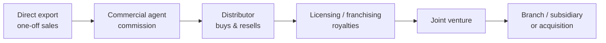
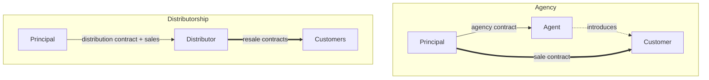

# 12. International Business Transactions: The ICC Model Contracts

> **Teaching rewrite** of international expansion structures and the ICC model contracts. Pedagogical summaries only — not legal advice and not the text of any ICC model. ICC updates its models periodically (new editions, new titles); check the current catalogue before relying on a clause. Commission rates and amounts in examples are illustrative.

## Introduction

Exporting by one-off sales (Lesson 5) is only the first step. As a company grows abroad it signs **agents**, appoints **distributors**, licenses **trademarks** and **technology**, **franchises** its business system, builds **turnkey plants**, and eventually **acquires** companies. Each structure has different risks, costs, control, and — often — mandatory local law protecting the weaker party.

Drafting all of these from scratch is slow and expensive, and few lawyers know every model well. **Model contracts** offer a tested, balanced starting point.

This lesson covers:

- How to use model contracts (fill in, adapt, or negotiate against)
- Who publishes them: **ICC**, **ITC**, **FIDIC**, **Orgalime**
- The ICC model portfolio, contract by contract
- **Agency vs distributorship** — the choice most exporters face first
- Agency law: authority, duties, EU protection, and the key clauses of the **ICC Model Commercial Agency Contract**
- The **ICC Model Distributorship**, **Franchising**, and **Occasional Intermediary** contracts

**Assumptions.** A manufacturer or brand owner expanding into foreign markets. Competition (antitrust) and mandatory local law vary widely — always check the target country.

---

## 12.1 Paths to international expansion

Moving right means **more investment, more control, more commitment** — and usually more legal complexity. Many exporters follow roughly this path: direct sales, then an agent, then a distributor, then (in a mature market) their own branch or subsidiary.

---

## 12.2 Three ways to use a model contract

| Use | How | Watch-out |
|---|---|---|
| **Fill in the blanks** | Complete the form for the deal | Some clauses may not fit — review each one |
| **Source of inspiration** | Take the relevant clauses into your own forms; redraft the rest | Needs counsel who understands the model’s logic |
| **Negotiation benchmark** | Compare the counterparty’s draft to the model; offer the model clause as a neutral compromise | Works best when the model is recognised by both sides |

---

## 12.3 Who publishes model contracts

| Organisation | Focus | Strength |
|---|---|---|
| **ICC** (Commission on Commercial Law and Practice) | Broad, multi-industry international transactions | **Balanced and neutral** — designed to be safe for either side; drafted by international expert teams and circulated to national committees |
| **ITC** (International Trade Centre, joint WTO–UN agency) | Small firms | Models for alliances, joint ventures, sale, long-term supply, contract manufacture, distribution, agency, services |
| **FIDIC** | Consulting engineering and construction | Detailed sector models (e.g. the Red Book) |
| **Orgalime** | European engineering industries | Model contracts and general conditions for mechanical, electrical, electronic supply |

---

## 12.4 The ICC model portfolio

| Model | What it covers | Note |
|---|---|---|
| **International Sale** | Spot sales of manufactured goods for resale | Built to work with the **CISG** (Lesson 5); not commodities or long-term supply |
| **Commercial Agency** | Self-employed sales agent on commission | Detailed below |
| **Distributorship** | Sole importer-distributor who buys and resells | Detailed below |
| **Short-form** agency & distributorship | Abbreviated versions | For simpler relationships |
| **Selective Distributorship** | Network of qualified resellers (luxury, high-tech) | Closed network: members may not sell to unauthorised resellers |
| **Franchising** | Unit franchising of a distribution system | Detailed below |
| **Occasional Intermediary** | One-off introducer, non-circumvention & non-disclosure | Detailed below |
| **Turnkey Supply of an Industrial Plant** | Design-and-build where the buyer just “turns the key” | Broader than FIDIC/Orgalime turnkey forms |
| **Turnkey for Major Projects** | Very large, detailed version | Includes a **Combined Dispute Board** (Lesson 7) |
| **Transfer of Technology** | Patent and know-how licence to let a licensee manufacture | |
| **M&A — Share Purchase** | Buying all shares of a private company | Not for public companies or complex deals |
| **Trademark Licence** | Licensee designs and sells products under the brand | Licensor focuses on **quality control** |
| **Confidentiality** | Full NDA and a stand-alone clause | |

<GuidedChoiceExplanation preset="model-contract-choice" />

---

### Checkpoint: models and portfolio

<MultipleChoice
  id="ib-export-import-ch12-mid1"
  title="Checkpoint — sections 12.1 to 12.4"
  questions={[
    {
      prompt: 'A counterparty sends a one-sided agency draft. How can an ICC model help most?',
      choices: [
        'It overrides the draft automatically',
        'As a neutral benchmark: propose the model clause as a fair compromise',
        'It replaces the need for any negotiation',
        'Only by filling in its blanks',
      ],
      answer: 1,
      why: 'Recognised, balanced wording makes a credible middle ground.',
    },
    {
      prompt: 'A luxury watchmaker wants only approved retailers to sell its watches and forbids them selling to discounters. Which model fits?',
      choices: ['Occasional Intermediary', 'Selective Distributorship', 'Turnkey Supply', 'Share Purchase'],
      answer: 1,
      why: 'Selective distribution keeps a closed network of qualified resellers.',
    },
    {
      prompt: 'Which organisation’s model contracts are especially aimed at small firms?',
      choices: ['FIDIC', 'ITC', 'Orgalime', 'World Bank'],
      answer: 1,
      why: 'The International Trade Centre (WTO/UN) targets SMEs.',
    },
    {
      type: 'order',
      prompt: 'Rank these expansion modes from LEAST to MOST investment and control.',
      items: [
        'Direct export sales',
        'Commercial agent on commission',
        'Sole distributor buying and reselling',
        'Master franchise in the territory',
        'Wholly owned subsidiary',
      ],
      why: 'Each step commits more resources and gives more control over the market.',
      whyWrong: 'An agent requires less investment than a distributor relationship, which involves stock and a buy-resell framework.',
    },
  ]}
/>

---

## 12.5 Agency or distributorship?

| | **Commercial agent** | **Distributor** |
|---|---|---|
| Role | **Intermediary**: finds customers | **Buyer-reseller** |
| Sale contract with customer | Principal ↔ customer | Distributor ↔ customer |
| Title to goods | Never held by agent | Distributor owns stock |
| Income | **Commission** on sales | **Margin** between buy and resell price |
| Customer credit risk | Principal (unless del credere) | Distributor |
| Principal’s control | Higher (sets prices and terms) | Lower (distributor sets resale prices) |
| Best when | Unique, customised, complex, expensive, or maintenance-heavy goods — customers want the maker | Large stock must be held for many customers |

**Choose carefully.** These relationships take years to build; agents and distributors act as your **ambassadors**. Firms often outgrow them and want to take over the territory — and then discover termination costs (indemnities) and that a dismissed representative may join a competitor.

### Case snapshot — choosing representatives like a marriage

*Summarised from a widely retold story about Parker Pen’s founder.* Before appointing a foreign distributor he would research the market, spend weeks visiting shops, ask retailers which brands sold and why, check candidates with banks and his embassy, interview a shortlist, and ask other exporters for opinions. He described appointing a distributor as like a marriage — and some of those relationships lasted for generations.

**Lesson:** time spent selecting a representative is cheap compared with the cost of terminating the wrong one.

<GuidedChoiceExplanation preset="agency-vs-distributor" />

---

## 12.6 Agency law basics

| Topic | Rule of thumb | Drafting move |
|---|---|---|
| **Terminology** | “Agent” in trade talk may not match the legal meaning; employed agents fall under labour law | State the relationship precisely; contract with agents that are companies |
| **Undisclosed principal** | In many civil-law systems, if the agent did not disclose the principal, only the agent can sue the customer | Require disclosure, or assignment of claims to the principal |
| **Actual vs apparent authority** | Third parties may rely on authority the agent **appears** to have | Do not let the agent look like it can bind you; supervise |

### Duties

| Agent must… | Principal must… |
|---|---|
| Use reasonable care, skill, diligence (no unauthorised warranties) | Pay the agreed **commission** — define it precisely |
| Disclose all material facts (no double commission from both sides) | Reimburse expenses only if agreed |
| Make **no secret profits** (no bribes) | Decide on orders fairly and promptly |
| Keep the principal’s information **confidential** | Settle whether direct orders from the territory and **repeat orders** earn commission |
| **Account** for money and keep records | |

**Del credere** — the agent guarantees (some or all of) customers’ payment, usually for a higher commission.

### EU protection: Directive 86/653

- On termination the agent is entitled to an **indemnity** (or compensation, depending on the member state) for goodwill brought to the principal — **capped at one year’s average remuneration** under the indemnity system.
- The agent must claim **in writing within one year** of termination.
- It can be lost through the agent’s own culpable conduct.
- Mandatory: the parties cannot contract out of it to the agent’s detriment.

---

### Checkpoint: agency and distribution basics

<MultipleChoice
  id="ib-export-import-ch12-mid2"
  title="Checkpoint — sections 12.5 and 12.6"
  questions={[
    {
      prompt: 'A distributor stops paying, but its customers paid it in full. Who bears the loss on the end-customer side?',
      choices: [
        'The manufacturer, because it made the goods',
        'The distributor, which bought and resold on its own account',
        'The customers',
        'Nobody',
      ],
      answer: 1,
      why: 'The manufacturer’s credit risk is on the distributor only; end-customer credit is the distributor’s risk.',
    },
    {
      prompt: 'A maker of custom industrial furnaces wants customers to contract directly with it. Which structure fits?',
      choices: ['Distributorship', 'Commercial agency', 'Selective distribution', 'Trademark licence'],
      answer: 1,
      why: 'Customised, complex, expensive goods favour agency — the principal sells directly.',
    },
    {
      prompt: 'A customer relies on an agent who seemed authorised to agree a 15% discount, though the principal never allowed it. The principal may be bound because of…',
      choices: ['Actual authority', 'Apparent (ostensible) authority', 'Del credere', 'Exclusivity'],
      answer: 1,
      why: 'Third parties can rely on authority the agent appears to have.',
    },
    {
      type: 'order',
      prompt: 'Rank the steps of selecting a foreign representative.',
      items: [
        'Choose the target market and research it.',
        'Visit outlets and learn how the product category sells.',
        'Build a list of candidate agents or distributors.',
        'Check candidates’ reputation and finances with banks and other references.',
        'Interview the shortlist and decide.',
        'Negotiate and sign the agency or distribution contract.',
      ],
      why: 'Market knowledge defines who is a good candidate; checks and interviews narrow the list; the contract comes last.',
    },
  ]}
/>

---

## 12.7 ICC Model Commercial Agency Contract

**Scope.** Self-employed commercial agents selling **goods**. Not for service agents, salaried representatives, or buying agents (though it can inspire them). Using a **company** as agent helps keep labour law and its bar on arbitration out of the picture.

### Key clauses

| Clause | ICC approach (paraphrased) |
|---|---|
| **Products & territory** | Define precisely; principal must tell the agent about new products and discuss including them |
| **Good faith** | Both act fairly and reasonably |
| **Agent’s functions** | Actively promote, follow reasonable directions; **no authority to bind** the principal (beware apparent authority and **permanent establishment** tax risk) |
| **Acceptance of orders** | Principal must decide promptly and in good faith; arbitrarily refusing orders to “**freeze out**” the agent is a breach |
| **Non-compete** | No competing products; non-competing lines allowed with notice |
| **Sales organisation** | Service, warehousing, **consignment stock** (clear ownership, identification, insurance), after-sales, advertising, fairs |
| **Minimum target** | Either a soft sales target or a **guaranteed minimum** whose breach allows termination (or loss of exclusivity / smaller territory); agents seek excuses for events outside their control |
| **Sub-agents** | Alternative A: agent’s free choice; Alternative B: notify/approve |
| **Information** | Both sides keep each other informed |
| **Financial responsibility** | Agent must not pass on orders from customers it doubts; optional **del credere** annex signed by both |
| **Trademarks** | Agent may **not** register the principal’s marks; must stop using them on termination; must report infringements |
| **Customer complaints** | No authority to accept returns or compensate without written authorisation |
| **Exclusivity** | Exclusive, but the principal may sell directly into the territory — paying commission, possibly reduced for listed key accounts |
| **Commission** | On all sales in the territory; reduced for principal’s own sales, out-of-territory orders, cut-price deals, insured bad debts; expenses not reimbursed unless agreed |
| **Calculation** | On the **net invoice** amount — agent-granted discounts reduce it; later principal discounts do not; separately invoiced freight, packing, taxes excluded |
| **When paid** | When the **customer pays** (proportionally for part payments), no later than the end of the month after the quarter it fell due |
| **Unconcluded business** | No commission if non-performance is beyond the principal’s control; owed if the principal is at fault |
| **Term & notice** | Indefinite, or fixed and renewable yearly; notice **4 months** (under 5 years) or **6 months** (5 years or more) |
| **Unfinished business** | Commission on orders the agent generated before termination, concluded after |
| **Early termination** | Substantial breach, bankruptcy, liquidation, etc. |
| **Termination indemnity** | Alternative: up to **one year’s average remuneration**, or none (where law allows) |
| **Disputes** | **ICC arbitration**; law = lex mercatoria or a chosen national law; mandatory local agency rules still apply |
| **Entire agreement** | Supersedes earlier deals; changes in writing |

### Worked example: commission, notice, indemnity

**Commission.** The agent closes an order:

| Item | USD |
|---|---|
| Goods at list price | 80,000 |
| Discount the **agent** gave the customer | −4,000 |
| **Net invoice for goods** | **76,000** |
| Freight, invoiced separately | 3,000 (excluded) |
| VAT, shown separately | excluded |
| Later 2% cash discount granted by the **principal** | does **not** reduce commission |

Commission at 5% = 5% × 76,000 = **USD 3,800**, payable when the customer pays. If the customer pays half now: **USD 1,900** now, the rest later.

**Notice.** Contract running 3 years → at least **4 months**; running 7 years → at least **6 months**.

**Indemnity.** Average annual commission over the last five years = USD 60,000 → indemnity capped at **USD 60,000** (one year), subject to the agent having brought real business.

**Del credere.** With a 5% commission, a balanced limited del credere might cap the agent’s share of a customer’s bad debt at **5%** (rule of thumb: no more than the commission rate).

<GuidedChoiceExplanation preset="agency-clauses" />

---

## 12.8 ICC Model Distributorship Contract

**Sole vs exclusive.** In practice, *sole* often means the supplier may still sell into the territory; *exclusive* means not even the supplier may. Law does not always respect the distinction — define it in the contract.

The distribution agreement is a **framework**, not a sale: individual purchases follow under it. The supplier’s big advantage: it only takes the **distributor’s** credit risk.

| Clause | Key points |
|---|---|
| **Territory** | Precise; possible expansion if targets are met; pass inquiries to the right party. In the EU, a supplier may not stop a distributor from accepting **unsolicited** orders from another territory (passive sales); only active selling into another exclusive territory can be restricted |
| **Resale price** | Competition law generally forbids **fixing** resale prices; suggested or maximum prices are usually allowed |
| **Supply price** | Long-term pricing problem — peg to a market price, or grant the best price offered to unrelated customers |
| **Sole buying / selling** | Reciprocal exclusivity is common but must respect competition law (EU, US); require **active efforts** and a **minimum target** so the distributor cannot sit on the territory |
| **Advertising, market info, IP** | Distributor commonly advertises, reports market data, and helps protect trademarks and patents |

:::info EU competition rules
Distribution agreements in the EU are assessed under the Vertical Block Exemption Regulation (currently Regulation 2022/720 with its guidelines). Hard-core restrictions such as resale price fixing remove the exemption. Check the rules in force for your territory.
:::

---

## 12.9 ICC Model International Franchising Contract

**Franchising** replicates a successful business system using the franchisee’s capital: the franchisor provides trademarks, know-how, and support; the franchisee pays an initial fee, invests in the outlet, pays **royalties**, and follows the system’s standards. It dominates sectors where brand and service reputation drive sales (fast food, retail, car rental, real estate).

Many countries regulate franchising — especially **pre-contract disclosure**, after complaints of franchisees being lured by inflated profit forecasts.

### Types

| Type | What is licensed |
|---|---|
| **Product / trademark** | Right to make and/or sell a product under a mark |
| **Business format** | The whole operating system plus marks |
| **Production** | Franchisee manufactures to franchisor specifications |
| **Service** | Franchisee provides the franchisor’s service concept |
| **Distribution** | Franchisor makes the product; franchisee resells it |

### International structures

| Structure | How | Trade-off |
|---|---|---|
| **Direct / unit** | Franchisor signs each outlet | Most control, but costly to supervise from abroad — best for nearby, similar markets |
| **Area development** | Developer must open N units in a territory on a schedule | Fewer counterparties; if the developer fails, the whole territory suffers; a strong developer becomes hard to replace |
| **Master franchise** | Master franchisee operates and **sub-franchises** | Local supervision, faster growth; less control, enforcement can be hard |
| **Subsidiary** | Own local company acts as franchisor | Control plus local know-how; more investment |
| **Joint venture** | With a local partner | Shared control and risk |

The ICC model targets **unit distribution franchises**. Key elements: **know-how** (and its confidentiality), franchisor’s ownership of **marks and patents**, clear **products and exclusive territory**, precise **fees and royalties** (non-payment can justify termination), and a **term** long enough for the franchisee to recover its investment, with clear renewal and termination rules.

---

## 12.10 ICC Model Occasional Intermediary Contract

An **occasional intermediary** promotes a specific deal without any continuing duty to develop a market — sometimes just supplying information or making an introduction (an agent, by contrast, usually negotiates for the principal over time).

The contract should define:

- The **service** (information about third parties, or putting parties in contact)
- **Exclusivity** for that business, if any
- **Remuneration** (commission or lump sum)
- **Non-circumvention** — the principal may not go around the intermediary to the introduced party
- **Non-disclosure** of the information provided

---

### Rank: agency contract lifecycle

<MultipleChoice
  id="ib-export-import-ch12-rank"
  title="Sequence agency and distribution decisions"
  questions={[
    {
      type: 'order',
      prompt: 'Rank these commission trigger points under an agency contract from MOST favourable to the AGENT to MOST favourable to the PRINCIPAL.',
      items: [
        'When the customer places the order',
        'When the principal accepts the order',
        'When the principal delivers the goods',
        'When the customer pays (the ICC model default)',
      ],
      why: 'Each later trigger shifts more risk of non-acceptance, non-delivery, or non-payment onto the agent.',
      whyWrong: 'Payment on order placement is best for the agent — it could even earn commission on orders the principal rejects.',
    },
    {
      type: 'order',
      prompt: 'Rank the steps of ending an agency relationship properly under an ICC-style contract.',
      items: [
        'Check the term, notice period, and any grounds for early termination.',
        'Serve written notice of the required length (4 or 6 months).',
        'Keep paying commission on orders generated before termination (unfinished business).',
        'Require the agent to stop using the principal’s marks.',
        'Settle any termination indemnity the contract or mandatory law requires.',
      ],
      why: 'Grounds and notice come first; commission and IP obligations run through the end of the relationship; the indemnity is settled last (the agent has a year to claim under EU law).',
    },
  ]}
/>

---

### Check: ICC model contracts

<MultipleChoice
  id="ib-export-import-ch12"
  title="ICC model contracts"
  questions={[
    {
      prompt: 'What makes ICC model contracts distinctive compared with many publishers’ forms?',
      choices: [
        'They always favour the exporter',
        'They are drafted to be balanced and safe for either side to sign',
        'They are mandatory law',
        'They only cover construction',
      ],
      answer: 1,
      why: 'Neutrality is the core design goal.',
    },
    {
      prompt: 'Which statement about a distributor is correct?',
      choices: [
        'It earns a commission and never owns the goods',
        'It buys the goods and resells them on its own account',
        'It must always follow the supplier’s fixed resale prices',
        'Its customers contract directly with the manufacturer',
      ],
      answer: 1,
      why: 'Distributors earn a margin; resale price fixing is generally prohibited by competition law.',
    },
    {
      prompt: 'An agent gives a customer a USD 2,000 discount on a USD 50,000 order; freight of USD 1,500 is invoiced separately; commission is 6%. Commission?',
      choices: ['USD 3,000', 'USD 2,880', 'USD 2,970', 'USD 3,090'],
      answer: 1,
      why: 'Net goods invoice 48,000 × 6% = 2,880; separately invoiced freight is excluded.',
      whyWrong: 'USD 3,000 ignores the agent’s discount; USD 2,970 wrongly adds the freight.',
    },
    {
      prompt: 'Under the ICC agency model, an agency running for 6 years needs at least how much notice to terminate?',
      choices: ['1 month', '4 months', '6 months', '12 months'],
      answer: 2,
      why: 'Four months under five years; six months at five years or more.',
    },
    {
      prompt: 'The principal starts rejecting every order from an agent it wants to get rid of, without contractual grounds. Under the ICC model this is…',
      choices: ['Allowed', 'A breach (“freezing out”)', 'Automatic termination', 'A del credere event'],
      answer: 1,
      why: 'Orders must be accepted or rejected in good faith.',
    },
    {
      prompt: 'Under EU Directive 86/653, a terminated agent claiming an indemnity must…',
      choices: [
        'Claim within five years orally',
        'Notify the principal in writing within one year of termination',
        'Have a del credere clause',
        'Prove the principal’s fraud',
      ],
      answer: 1,
      why: 'The one-year written claim is a condition of the right.',
    },
    {
      prompt: 'Why is master franchising popular internationally?',
      choices: [
        'It gives the franchisor maximum direct control over each outlet',
        'A local master franchisee supervises and sub-franchises, reducing distant supervision costs',
        'It avoids any franchise regulation',
        'It needs no royalties',
      ],
      answer: 1,
      why: 'Decentralised local supervision trades some control for speed and lower cost.',
    },
    {
      prompt: 'What does a non-circumvention clause in an occasional intermediary contract prevent?',
      choices: [
        'The intermediary competing with the principal',
        'The principal dealing directly with the introduced party to avoid paying the intermediary',
        'Customers from complaining',
        'Disclosure of trademarks',
      ],
      answer: 1,
      why: 'It protects the intermediary’s commission for the introduction.',
    },
  ]}
/>

---

## Takeaways

:::tip Remember
- Use models to **fill in, inspire, or negotiate** — always review every clause
- ICC models are **balanced**; ITC suits SMEs; FIDIC/Orgalime are sector-specific
- **Agent** = intermediary on commission; **distributor** = buyer-reseller on margin
- Agency risks: **apparent authority**, permanent establishment, **termination indemnity** (EU: up to a year’s pay, claim within a year)
- Commission on **net invoice**, payable when the **customer pays**; notice **4 / 6 months**
- Distributors set their own resale prices; respect competition law on territories and exclusivity
- Franchising: unit vs area development vs **master**; regulate know-how, marks, fees, term
- Occasional intermediaries need **non-circumvention and non-disclosure**
:::

## Further Reading

- [5. The international sale contract](./international-sale-contract) — the ICC Model International Sale Contract
- [7. ICC arbitration and dispute services](./icc-arbitration-and-adr) — arbitration clause and dispute boards used in these models
- [11. Guarantees, bonds, and standby credits](./guarantees-bonds-standbys)
- [International Business home](../intro)
- Next: [13. International transport](./international-transport) — carriage, documents, cargo insurance
- Later (planned): customs · e-commerce
- Sources: ICC model contracts catalogue ([ICC](https://iccwbo.org/)); ITC model contracts ([intracen.org](https://intracen.org/)); EU Directive 86/653/EEC; EU Regulation 2022/720
