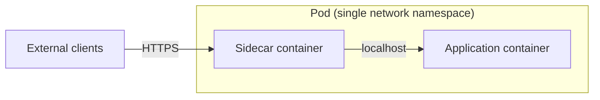
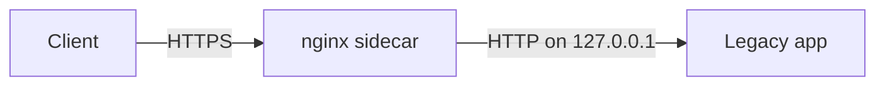
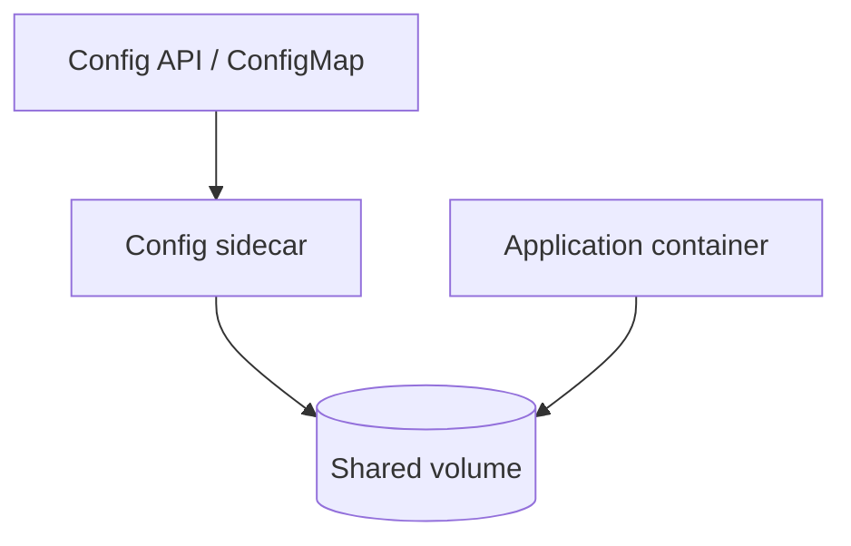
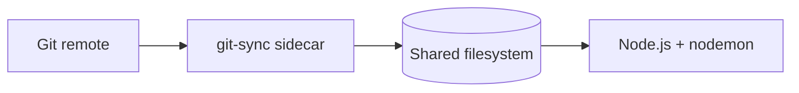

# The Sidecar Pattern

> **Adapted from:** Bilgin Ibryam & Roland Huß, *Kubernetes Patterns* (O'Reilly, 2019), Chapter 3 — rewritten and condensed for teaching.

The first **single-node pattern** is the **sidecar pattern**: two containers scheduled together on one machine, packaged as an atomic group. In Kubernetes that group is a **Pod**.

- The **application container** holds the core logic. Without it, the application does not exist.
- The **sidecar container** augments the application — often **without the application knowing** — adding capabilities that would be hard to bolt onto the app directly.

Sidecars are **co-scheduled** onto the same machine and share resources: parts of the filesystem, the hostname, the network namespace, and other Linux namespaces. That shared context is what makes localhost proxying, shared config volumes, and PID-namespace introspection possible.



---

## Adding HTTPS to a Legacy Service

Consider a legacy web service built years ago that speaks **HTTP only**. Security policy now requires **HTTPS everywhere**, but the source tree only builds on a retired toolchain — resurrecting that build system or porting the app would take months.

**Containerizing** the binary is easy: run it in a container with an old userspace on a modern kernel. **Adding TLS inside the app** is the hard part.

The sidecar fix:

1. Configure the legacy app to listen on **localhost only** (`127.0.0.1`). Normally that would make it unreachable from outside the machine — but the sidecar shares the same network namespace, so **localhost inside the Pod is shared**.
2. Add an **nginx sidecar** (or any TLS-terminating proxy) that listens on the Pod's external address, terminates HTTPS, and forwards plain HTTP to `127.0.0.1:<app-port>`.
3. Unencrypted traffic never leaves the loopback interface inside the Pod — acceptable to most security reviews — and the team never touches the legacy source.



The same shape extends to **automatic certificate rotation**, or adding **authentication/authorization** in front of code you cannot modify.

### Check: HTTPS sidecar

<MultipleChoice
  id="dds-sidecar-https"
  title="TLS termination with a sidecar"
  questions={[
    {
      prompt: 'Why must the legacy application bind to localhost (127.0.0.1) in the HTTPS sidecar setup?',
      choices: [
        'Because Kubernetes only allows one container per Pod to bind to any port',
        'So only processes in the same network namespace — the TLS sidecar sharing the Pod — can reach the app over HTTP, while external clients only ever see HTTPS terminated at the sidecar',
        'Because localhost binding automatically enables HTTPS',
        'Because legacy applications cannot bind to 0.0.0.0 under any orchestrator',
      ],
      answer: 1,
      why: 'Shared network namespace is the mechanism: loopback is shared between containers in the Pod, so the sidecar can proxy to the app without exposing unencrypted HTTP on the Pod\'s external interfaces.',
    },
    {
      prompt: 'What is the main advantage of the sidecar approach over rebuilding the legacy application for HTTPS?',
      choices: [
        'Sidecars always outperform in-process TLS',
        'You modernize transport security without modifying or recompiling application source that is expensive or impossible to rebuild',
        'Sidecars eliminate the need for certificates',
        'HTTPS sidecars only work with Node.js applications',
      ],
      answer: 1,
      why: 'Adaptation without source changes is the classic sidecar motivation for legacy systems.',
    },
  ]}
/>

### Practice: validate loopback binding

The legacy app must listen on **loopback** so only the sidecar in the same network namespace can reach it over plain HTTP. Implement `is_loopback_bind(host)` — return `True` for `127.0.0.1`, `localhost`, or `::1`, and `False` otherwise.

<CodeExercise
  title="Loopback bind check"
  heading="exercise-sidecar-upstream"
  lang="python"
  filename="main.py"
  prompt="Implement is_loopback_bind(host). Return True when host is 127.0.0.1, localhost, or ::1 (IPv6 loopback). Return False for any other bind address."
  sampleLog={`(no input)
True
True
False
False`}
  starter={`def is_loopback_bind(host):
    # Return True only for loopback addresses the TLS sidecar can reach
    # inside the shared Pod network namespace.
    pass

print(is_loopback_bind("127.0.0.1"))
print(is_loopback_bind("localhost"))
print(is_loopback_bind("0.0.0.0"))
print(is_loopback_bind("10.244.0.5"))
`}
  hint="Compare host against the three loopback forms, or normalize localhost to 127.0.0.1 first."
  solution={`def is_loopback_bind(host):
    return host in ("127.0.0.1", "localhost", "::1")

print(is_loopback_bind("127.0.0.1"))
print(is_loopback_bind("localhost"))
print(is_loopback_bind("0.0.0.0"))
print(is_loopback_bind("10.244.0.5"))
`}
  sourceChecks={[
    { name: 'checks loopback hosts', pattern: '127\\.0\\.0\\.1|localhost|::1', must: true, hint: 'accept 127.0.0.1, localhost, and ::1' },
  ]}
  tests={[
    { name: 'loopback and all-interfaces binds', stdin: '', equals: 'True\nTrue\nFalse\nFalse' },
  ]}
/>

---

## Dynamic Configuration with Sidecars

Proxying traffic is not the only use case. Many older applications read a **configuration file** from disk at startup (plain text, TOML, XML, JSON, or YAML). In a cloud-native environment you usually want configuration pushed through an **API** — for automation, rollback, and avoiding SSH edits on every server. Kubernetes exposes **ConfigMap** resources for this.

New apps can call the API directly. Legacy apps cannot — but a **configuration sidecar** can:

1. Share a **volume** with the application container (often a ConfigMap mount).
2. On startup, compare the API's desired config with what is on disk.
3. If they differ, write the new file into the shared directory and **signal** the app (file watch, `SIGHUP`, or in extreme cases `SIGKILL` so the orchestrator restarts the pod and the app reloads on boot).



The notification mechanism varies: some apps watch the file; others reload on `SIGHUP`; the harshest option kills the app and lets the orchestrator restart it with the new file already in place.

### Practice: when should the config sidecar sync?

Implement `needs_sync(api_version, file_version)` — return `True` when the versions differ and the sidecar should write an updated config file to the shared volume.

<CodeExercise
  title="Config sync decision"
  heading="exercise-config-sync"
  lang="python"
  filename="main.py"
  prompt="Implement needs_sync(api_version, file_version). Return True when the sidecar should download and write new configuration."
  sampleLog={`(no input)
True
False
True`}
  starter={`def needs_sync(api_version, file_version):
    # Return True if the API config differs from what is on disk.
    pass

print(needs_sync("v3", "v1"))
print(needs_sync("v2", "v2"))
print(needs_sync("v5", "v4"))
`}
  hint="Compare the two version strings for equality."
  solution={`def needs_sync(api_version, file_version):
    return api_version != file_version

print(needs_sync("v3", "v1"))
print(needs_sync("v2", "v2"))
print(needs_sync("v5", "v4"))
`}
  sourceChecks={[
    { name: 'compares versions', pattern: '!=|==|compare', must: true, hint: 'return True when api_version and file_version are not equal' },
  ]}
  tests={[
    { name: 'sync only when versions differ', stdin: '', equals: 'True\nFalse\nTrue' },
  ]}
/>

---

## Modular Application Containers

Sidecars are not only for legacy adaptation. They also enable **modular, reusable** operational tooling.

Example: every service should expose a `/topz` HTTP endpoint showing process resource usage (like the `top` command). You could ask every team to embed that in every language — or ship one **topz sidecar** that shares the application's **PID namespace**, introspects all processes, and serves a consistent UI. The orchestrator can inject that sidecar into every deployment automatically.

Trade-off: an off-the-shelf sidecar is less tailored than in-process code (like off-the-rack vs bespoke clothing). For most teams, reuse wins; for extreme performance needs, embed the logic in the app.

:::note Local lab: topz sidecar
Piston cannot run Docker or share PID namespaces. On a machine with Docker installed, you can try Brendan Burns' `topz` image:

```bash
docker run -d <my-app-image>
# note the container id as APP_ID
docker run --pid=container:${APP_ID} -p 8080:8080 brendanburns/topz:db0fa58 /server --addr=0.0.0.0:8080
```

Visit `http://localhost:8080/topz` to see processes from the application container. Change the published port if your app already uses 8080.
:::

### Check: modular sidecars

<MultipleChoice
  id="dds-sidecar-modular"
  title="Modular utility sidecars"
  questions={[
    {
      prompt: 'Why deploy /topz-style monitoring as a sidecar instead of a per-language library inside every application?',
      choices: [
        'Libraries cannot access process information',
        'A single sidecar sharing the PID namespace provides one consistent interface across all languages and can be injected uniformly by the orchestrator, avoiding N language-specific implementations that drift apart',
        'Sidecars always use less CPU than in-process monitoring',
        'Kubernetes requires monitoring to run as a sidecar',
      ],
      answer: 1,
      why: 'Reuse and consistency across polyglot estates are the win — one artifact, one UI, orchestrator-wide policy.',
    },
    {
      prompt: 'What namespace must the topz sidecar share with the application to inspect its processes?',
      choices: [
        'The network namespace only',
        'The PID namespace',
        'The UTS namespace only',
        'No shared namespace is required',
      ],
      answer: 1,
      why: 'Process tables are per PID namespace; sharing it lets the sidecar see the app\'s processes.',
    },
  ]}
/>

---

## Building a Simple PaaS with Sidecars

Sidecars can carry **application workflow**, not just adaptation.

Imagine a minimal **PaaS** where `git push` deploys code:

- **Application container:** a Node.js server using **nodemon** to reload when files change.
- **Sidecar container:** shares a filesystem with the app and runs a loop — `git pull`, sleep, repeat — keeping the working tree synchronized with a remote repository.

Push to Git → sidecar updates files → nodemon reloads the server. Two containers, one Pod, no changes to the Node.js application code for deployment mechanics.



---

## Designing Sidecars for Modularity and Reusability

Reusable sidecars need the same discipline as reusable libraries:

### Parameterized containers

Treat each image like a **function**. Expose inputs that customize a generic image to a specific deployment — e.g. an HTTPS sidecar needs at least **certificate path** and **backend port on localhost**. Pass parameters via **environment variables** (preferred) or command-line flags. A small entrypoint script reads env vars and renders config (nginx.conf, sync interval, etc.).

### Define each container's API

Parameters are part of the API, but so are:

- HTTP endpoints the sidecar exposes
- Outbound calls the sidecar makes
- Semantics of each env var (units, defaults, stability)

Renaming `UPDATE_FREQUENCY` to `UPDATE_PERIOD` is an obvious breaking change. Subtler breaks matter too: changing seconds to milliseconds without updating callers, or accepting `"10m"` strings where `10` used to mean ten **seconds**, can silently change behavior and load on the config API.

### Document your containers

Document in the **Dockerfile**: `EXPOSE` with comments, `ENV` defaults with descriptions, and **OCI image labels** (`org.opencontainers.image.vendor`, `url`, `version`) so community tools can discover metadata consistently.

### Practice: validate a sidecar Pod layout

Given a simplified Pod description, decide whether it satisfies the minimum sidecar contract: **at least two containers**, and **at least one volume mount name shared** between the app and sidecar (so they can share config or files).

Each container is `{"name": str, "volumeMounts": [str, ...]}`. Implement `is_sidecar_pod(containers)`.

<CodeExercise
  title="Sidecar Pod layout"
  heading="exercise-sidecar-pod"
  lang="python"
  filename="main.py"
  prompt="Implement is_sidecar_pod(containers). Return True when there are at least two containers AND some volume mount name appears in more than one container's volumeMounts list."
  sampleLog={`(no input)
True
False`}
  starter={`def is_sidecar_pod(containers):
    # containers: list of {"name": str, "volumeMounts": [str, ...]}
    # Return True for a plausible sidecar pod: 2+ containers sharing a volume.
    pass

pod_ok = [
    {"name": "app", "volumeMounts": ["config"]},
    {"name": "config-sync", "volumeMounts": ["config"]},
]
pod_bad = [
    {"name": "app", "volumeMounts": ["data"]},
    {"name": "logger", "volumeMounts": ["logs"]},
]
print(is_sidecar_pod(pod_ok))
print(is_sidecar_pod(pod_bad))
`}
  hint="Collect all mount names per container; return True only if len(containers) >= 2 and some mount name is used by at least two different containers."
  solution={`def is_sidecar_pod(containers):
    if len(containers) < 2:
        return False
    mount_owners = {}
    for c in containers:
        for mount in c.get("volumeMounts", []):
            mount_owners.setdefault(mount, set()).add(c["name"])
    return any(len(owners) >= 2 for owners in mount_owners.values())

pod_ok = [
    {"name": "app", "volumeMounts": ["config"]},
    {"name": "config-sync", "volumeMounts": ["config"]},
]
pod_bad = [
    {"name": "app", "volumeMounts": ["data"]},
    {"name": "logger", "volumeMounts": ["logs"]},
]
print(is_sidecar_pod(pod_ok))
print(is_sidecar_pod(pod_bad))
`}
  sourceChecks={[
    { name: 'checks container count', pattern: 'len\\(containers\\)', must: true, hint: 'require at least two containers in the pod' },
    { name: 'tracks shared mounts', pattern: 'volumeMounts|mount', must: true, hint: 'find a volume mount name used by more than one container' },
  ]}
  tests={[
    { name: 'shared config volume vs isolated mounts', stdin: '', equals: 'True\nFalse' },
  ]}
/>

### Check: sidecar API stability

<MultipleChoice
  id="dds-sidecar-api"
  title="Sidecar APIs and parameters"
  questions={[
    {
      prompt: 'A config sidecar used to treat UPDATE_FREQUENCY=10 as ten seconds. A new release parses bare numbers as milliseconds but still accepts "10s" for seconds. What kind of change is this?',
      choices: [
        'A safe, backward-compatible change because old values still parse without error',
        'A breaking API change — old deployments silently poll ten times more often, increasing load on the config API even though nothing errors',
        'Not an API change because environment variables are not part of a contract',
        'Only a breaking change if the parameter name also changed',
      ],
      answer: 1,
      why: 'Silent semantic changes to parameter meaning are breaking changes even when parsing succeeds.',
    },
    {
      prompt: 'Why are environment variables often preferred over command-line flags for sidecar parameters?',
      choices: [
        'Environment variables are the only mechanism Kubernetes supports',
        'They are easy to inject from orchestrator manifests and play well with parameterized, reusable images — though either mechanism can work',
        'Command-line flags cannot be changed after a container starts',
        'Environment variables are always more secure than flags',
      ],
      answer: 1,
      why: 'Orchestrators naturally supply env vars per deployment; reusable sidecar images are designed around that injection style.',
    },
  ]}
/>

---

:::important Key takeaways
- The **sidecar pattern** pairs an application container with a co-scheduled helper in the same Pod, sharing network, filesystem, and other namespaces.
- **HTTPS for legacy apps:** bind the app to localhost; terminate TLS in a proxy sidecar on the shared network namespace.
- **Dynamic config:** a sidecar syncs API/ConfigMap state into a shared volume and signals (or restarts) the legacy app.
- **Modular ops:** utility sidecars like `/topz` reuse one implementation across languages when they share the PID namespace.
- **PaaS-style workflows:** a git-sync sidecar plus a reload-aware app container can implement push-to-deploy without embedding deploy logic in the app.
- **Reusable sidecars** need parameterized images, a stable API surface (including env var semantics), and clear documentation — treat breaking changes as seriously as library semver.
:::

## Further Reading

- Bilgin Ibryam & Roland Huß — *Kubernetes Patterns* (O'Reilly, 2019), Chapter 3
- [Ambassadors](./ambassador-pattern) — the next lesson: brokering sharded storage, service discovery, and traffic splitting
- Brendan Burns — *Designing Distributed Systems* (O'Reilly), single-node patterns
- [Important Distributed System Concepts](./important-distributed-system-concepts) — orchestration, liveness, and readiness in this series
- [Kubernetes Pod documentation](https://kubernetes.io/docs/concepts/workloads/pods/)
