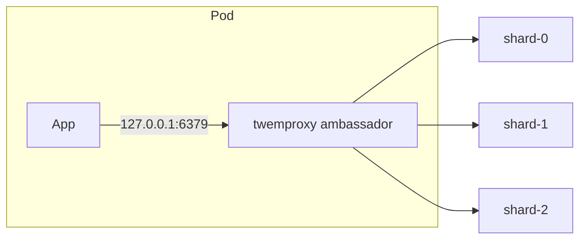
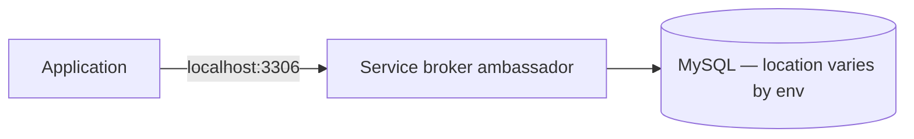

# Ambassadors

> **Adapted from:** Bilgin Ibryam & Roland Huß, *Kubernetes Patterns* (O'Reilly, 2019), Chapter 4 — rewritten and condensed for teaching.

[The Sidecar Pattern](./sidecar-pattern) introduced a container that **augments** an existing application — often without the app knowing. The **ambassador pattern** is different: an ambassador container **brokers interactions** between the application container and the rest of the world.

As with other single-node patterns, the two containers are tightly linked — co-scheduled to one machine in the same Pod — but the division of labor shifts:

| Pattern | Ambassador's job |
|---|---|
| **Sidecar** | Adds capability *to* the app (TLS, config sync, monitoring) |
| **Ambassador** | Speaks to the outside world *on behalf of* the app (sharding, service discovery, traffic splitting) |

The app typically connects to **localhost**, believing it talks to one simple backend. The ambassador hides sharded storage, environment-specific service locations, or A/B routing behind that single address.


**Why bother?** Modular, reusable containers — same benefits as sidecars. The ambassador can be shared across many apps; sharding or discovery logic is built once, tested once, and deployed consistently.

---

## Using an Ambassador to Shard a Service

When data outgrows one machine, you **shard** the storage layer — split it into disjoint pieces, each on its own host. This lesson focuses on the **single-node ambassador** that lets an existing client talk to a sharded backend without embedding shard-routing logic in application source.

Two deployment styles:

1. **Server-side ambassador** — a stateless load balancer in front of the shards (ambassador-as-a-service). Simpler clients; more complex shard deployment.
2. **Client-side ambassador** — a proxy container in the Pod next to the app. Simpler shard deployment; each client Pod carries routing logic (or an off-the-shelf proxy like **twemproxy**).

Neither is universally correct — team boundaries, who writes code vs. deploys off-the-shelf software, and operational ownership all matter.



The app only knows "Redis on localhost." The ambassador hashes keys and forwards each request to the right shard.

### Check: sharding ambassadors

<MultipleChoice
  id="dds-ambassador-sharding"
  title="Client-side vs server-side sharding"
  questions={[
    {
      prompt: 'What does the application container believe it is talking to when a sharding ambassador is deployed in the same Pod?',
      choices: [
        'A random shard chosen per request by the application code',
        'A single storage backend on localhost — the ambassador hides the shard topology',
        'The Kubernetes API server',
        'Every shard simultaneously without a proxy',
      ],
      answer: 1,
      why: 'The ambassador presents one local endpoint; routing logic lives in the proxy, not the app.',
    },
    {
      prompt: 'When is a client-side sharding ambassador a better fit than a centralized shard load balancer?',
      choices: [
        'When you want every application team to reimplement hash routing in their own language',
        'When simplifying shard deployment and reusing an off-the-shelf proxy in each Pod is acceptable, even though client Pods become slightly more complex',
        'When you never need more than one shard',
        'When localhost networking is unavailable inside a Pod',
      ],
      answer: 1,
      why: 'Client-side ambassadors trade per-Pod complexity for simpler shard infrastructure — a common pattern when teams deploy apps, not storage.',
    },
  ]}
/>

---

## Hands On: Implementing a Sharded Redis

We'll deploy three Redis shards with a **StatefulSet**, give them stable DNS names with a **headless Service**, configure **twemproxy** (Twitter's open-source Redis/memcached proxy) as the ambassador, and mount that config from a **ConfigMap**.

### Step 1 — StatefulSet for Redis shards

Complete the StatefulSet so Kubernetes creates **three** Redis pods with stable names (`sharded-redis-0`, `sharded-redis-1`, …). You need the fields that wire this StatefulSet to its headless Service and set the replica count. Deploy with `kubectl apply -f redis-shards.yaml`.

<YamlEditor
  filename="redis-shards.yaml"
  title="StatefulSet for Redis shards"
  heading="exercise-redis-statefulset"
  hint="A StatefulSet needs serviceName (matching the headless Service you will create) and replicas (one per shard)."
  checks={[
    { name: 'serviceName matches headless Service', pattern: 'serviceName:\\s*["\']?redis', must: true, hint: 'add serviceName: redis under spec (must match the Service in Step 2)' },
    { name: 'three Redis shards', pattern: 'replicas:\\s*3\\b', must: true, hint: 'add replicas: 3 under spec' },
  ]}
  starter={`apiVersion: apps/v1
kind: StatefulSet
metadata:
  name: sharded-redis
spec:
  selector:
    matchLabels:
      app: redis
  template:
    metadata:
      labels:
        app: redis
    spec:
      terminationGracePeriodSeconds: 10
      containers:
        - name: redis
          image: redis
          ports:
            - containerPort: 6379
              name: redis`}
  solution={`apiVersion: apps/v1
kind: StatefulSet
metadata:
  name: sharded-redis
spec:
  serviceName: "redis"
  replicas: 3
  selector:
    matchLabels:
      app: redis
  template:
    metadata:
      labels:
        app: redis
    spec:
      terminationGracePeriodSeconds: 10
      containers:
        - name: redis
          image: redis
          ports:
            - containerPort: 6379
              name: redis`}
/>

### Step 2 — Headless Service for stable DNS

A headless Service (`clusterIP: None`) creates per-pod DNS entries instead of one virtual IP. Complete the Service so its **name** pairs with the StatefulSet `serviceName` and pods resolve as `sharded-redis-0.redis`, `sharded-redis-1.redis`, and `sharded-redis-2.redis` inside the cluster.

<YamlEditor
  filename="redis-service.yaml"
  title="Headless Service for Redis"
  heading="exercise-redis-service"
  hint="metadata.name must match the StatefulSet serviceName; spec needs clusterIP: None for headless DNS."
  checks={[
    { name: 'Service name matches StatefulSet serviceName', pattern: 'name:\\s*redis\\b', must: true, hint: 'add metadata.name: redis' },
    { name: 'headless clusterIP', pattern: 'clusterIP:\\s*None', must: true, hint: 'add clusterIP: None under spec' },
  ]}
  starter={`apiVersion: v1
kind: Service
metadata:
  labels:
    app: redis
spec:
  ports:
    - port: 6379
      name: redis
  selector:
    app: redis`}
  solution={`apiVersion: v1
kind: Service
metadata:
  name: redis
  labels:
    app: redis
spec:
  ports:
    - port: 6379
      name: redis
  clusterIP: None
  selector:
    app: redis`}
/>

### Step 3 — twemproxy (nutcracker) configuration

The ambassador listens on **localhost** so the application container in the same Pod can connect without knowing about shards. Add the **listen** address twemproxy should bind to, then create the ConfigMap with:

```bash
kubectl create configmap twem-config --from-file=nutcracker.yaml
```

<YamlEditor
  filename="nutcracker.yaml"
  title="twemproxy listen address"
  heading="exercise-nutcracker"
  hint="The proxy must listen on loopback so only containers sharing the Pod network namespace can reach it."
  checks={[
    { name: 'listens on loopback', pattern: 'listen:\\s*127\\.0\\.0\\.1:6379', must: true, hint: 'add listen: 127.0.0.1:6379 under redis' },
    { name: 'still lists all three shards', pattern: 'sharded-redis-2\\.redis:6379', must: true, hint: 'keep all three shard entries in servers' },
  ]}
  starter={`redis:
  hash: fnv1a_64
  distribution: ketama
  auto_eject_hosts: true
  redis: true
  timeout: 400
  server_retry_timeout: 2000
  server_failure_limit: 1
  servers:
    - sharded-redis-0.redis:6379:1
    - sharded-redis-1.redis:6379:1
    - sharded-redis-2.redis:6379:1`}
  solution={`redis:
  listen: 127.0.0.1:6379
  hash: fnv1a_64
  distribution: ketama
  auto_eject_hosts: true
  redis: true
  timeout: 400
  server_retry_timeout: 2000
  server_failure_limit: 1
  servers:
    - sharded-redis-0.redis:6379:1
    - sharded-redis-1.redis:6379:1
    - sharded-redis-2.redis:6379:1`}
/>

### Step 4 — Ambassador Pod

Mount the ConfigMap and run twemproxy. Wire the volume mount path to match the `-c` flag in the command, and reference the ConfigMap you created in Step 3. The application container slot is left commented — inject your real app alongside the ambassador.

<YamlEditor
  filename="ambassador-example.yaml"
  title="Ambassador Pod with twemproxy"
  heading="exercise-ambassador-pod"
  hint="volumeMounts.mountPath must match /etc/config from the nutcracker -c path; volumes.configMap.name must match the ConfigMap from Step 3."
  checks={[
    { name: 'config mounted at /etc/config', pattern: 'mountPath:\\s*/etc/config', must: true, hint: 'add mountPath: /etc/config on the config-volume mount' },
    { name: 'twem-config ConfigMap', pattern: 'name:\\s*twem-config', must: true, hint: 'add name: twem-config under volumes.configMap' },
  ]}
  starter={`apiVersion: v1
kind: Pod
metadata:
  name: ambassador-example
spec:
  containers:
    # Application container — connects to 127.0.0.1:6379
    # - name: my-app
    #   image: my-app:latest

    - name: twemproxy
      image: ganomede/twemproxy
      command:
        - "nutcracker"
        - "-c"
        - "/etc/config/nutcracker.yaml"
        - "-v"
        - "7"
        - "-s"
        - "6222"
      volumeMounts:
        - name: config-volume
  volumes:
    - name: config-volume
      configMap:`}
  solution={`apiVersion: v1
kind: Pod
metadata:
  name: ambassador-example
spec:
  containers:
    # Application container — connects to 127.0.0.1:6379
    # - name: my-app
    #   image: my-app:latest

    - name: twemproxy
      image: ganomede/twemproxy
      command:
        - "nutcracker"
        - "-c"
        - "/etc/config/nutcracker.yaml"
        - "-v"
        - "7"
        - "-s"
        - "6222"
      volumeMounts:
        - name: config-volume
          mountPath: /etc/config
  volumes:
    - name: config-volume
      configMap:
        name: twem-config`}
/>

---

## Using an Ambassador for Service Brokering

Portable apps must run in a public cloud (managed MySQL SaaS), a private cloud (dynamically provisioned VM), or a data center — each with different **service discovery**.

Without an ambassador, the application embeds environment-specific lookup logic. With a **service broker ambassador**, the app always connects to MySQL on **localhost**; the ambassador introspects the environment and brokers the real connection.



Same separation of concerns as sharding: slim application code, reusable broker container.

### Practice: service broker Pod sketch

The frontend should always reach MySQL through **loopback**; add a second container that brokers the real database endpoint. Name and configure both containers appropriately.

<YamlEditor
  filename="mysql-broker-example.yaml"
  title="Service broker Pod"
  heading="exercise-mysql-broker"
  hint="The app env should point DATABASE_HOST at loopback; the second container is the broker ambassador."
  checks={[
    { name: 'DATABASE_HOST is loopback', pattern: 'value:\\s*["\']?127\\.0\\.0\\.1', must: true, hint: 'add DATABASE_HOST with value 127.0.0.1 on the frontend container' },
    { name: 'broker container named', pattern: 'name:\\s*mysql-broker', must: true, hint: 'name the ambassador container mysql-broker' },
  ]}
  starter={`apiVersion: v1
kind: Pod
metadata:
  name: mysql-broker-example
spec:
  containers:
    - name: frontend
      image: my-frontend:latest

    - image: my-mysql-broker:latest`}
  solution={`apiVersion: v1
kind: Pod
metadata:
  name: mysql-broker-example
spec:
  containers:
    - name: frontend
      image: my-frontend:latest
      env:
        - name: DATABASE_HOST
          value: "127.0.0.1"

    - name: mysql-broker
      image: my-mysql-broker:latest`}
/>

---

## Using an Ambassador for Experimentation and Request Splitting

Production systems often need **request splitting**:

- **A/B experiments** — send a fraction of traffic to a beta version (e.g. 10% experiment, 90% production).
- **Traffic teeing** — duplicate requests to a shadow service; return only production responses (load-test the new version without user impact).

The application still connects to localhost. The ambassador proxies to production and/or experiment backends and returns the appropriate response.

**Sticky routing matters:** if users flip between experiment and production on every request, results are meaningless. **IP hashing** (or consistent hashing on a user id) keeps each client on one variant for a consistent experience.

### Check: request splitting

<MultipleChoice
  id="dds-ambassador-experiments"
  title="Experimentation ambassadors"
  questions={[
    {
      prompt: 'Why does the nginx experiment config use ip_hash in the upstream block?',
      choices: [
        'To encrypt traffic between variants',
        'So the same client IP consistently maps to either production or experiment — users do not flip-flop between versions on every request',
        'To disable load balancing entirely',
        'Because Kubernetes requires ip_hash for ConfigMaps',
      ],
      answer: 1,
      why: 'Consistent per-client routing is required for meaningful A/B tests and acceptable user experience.',
    },
    {
      prompt: 'In traffic teeing, which backend response is returned to the user?',
      choices: [
        'The experiment backend only',
        'Both responses are merged into one',
        'Production — experiment traffic is executed but its response is discarded',
        'Whichever backend responds faster',
      ],
      answer: 2,
      why: 'Teeing exercises the new version under real load without risking production user experience.',
    },
  ]}
/>

---

## Hands On: Implementing 10% Experiments

Configure **nginx** as an ambassador. Set upstream **weights** so roughly 90% of traffic goes to `web` and 10% to `experiment`, keeping `ip_hash` for sticky routing.

<YamlEditor
  filename="nginx.conf"
  lang="yaml"
  title="nginx 90/10 experiment split"
  heading="exercise-nginx-weights"
  hint="nginx weight values are relative — 9 and 1 gives a 90/10 split when ip_hash is enabled."
  checks={[
    { name: 'sticky routing with ip_hash', pattern: 'ip_hash', must: true, hint: 'keep ip_hash in the upstream block' },
    { name: 'production weight', pattern: 'server\\s+web\\s+weight=9', must: true, hint: 'add weight=9 on the web upstream server' },
    { name: 'experiment weight', pattern: 'server\\s+experiment\\s+weight=1', must: true, hint: 'add weight=1 on the experiment upstream server' },
  ]}
  starter={`worker_processes  5;
error_log  error.log;
pid        nginx.pid;
worker_rlimit_nofile 8192;

events {
  worker_connections  1024;
}

http {
  upstream backend {
    ip_hash;
    server web;
    server experiment;
  }
  server {
    listen localhost:80;
    location / {
      proxy_pass http://backend;
    }
  }
}`}
  solution={`worker_processes  5;
error_log  error.log;
pid        nginx.pid;
worker_rlimit_nofile 8192;

events {
  worker_connections  1024;
}

http {
  upstream backend {
    ip_hash;
    server web weight=9;
    server experiment weight=1;
  }
  server {
    listen localhost:80;
    location / {
      proxy_pass http://backend;
    }
  }
}`}
/>

Create the ConfigMap:

```bash
kubectl create configmap experiment-config --from-file=nginx.conf
```

nginx will not start until both upstream Services exist. Complete each Service **selector** so it targets the right Deployment labels.

<YamlEditor
  filename="experiment-services.yaml"
  title="Experiment and production Services"
  heading="exercise-experiment-services"
  hint="Each Service name already matches an nginx upstream; add selector labels that match the experiment and production Deployments."
  checks={[
    { name: 'experiment Service selector', pattern: 'app:\\s*experiment\\b', must: true, hint: 'add selector.app: experiment on the experiment Service' },
    { name: 'production Service selector', pattern: 'app:\\s*web\\b', must: true, hint: 'add selector.app: web on the web Service' },
  ]}
  starter={`apiVersion: v1
kind: Service
metadata:
  name: experiment
spec:
  ports:
    - port: 80
      name: web

---
apiVersion: v1
kind: Service
metadata:
  name: web
spec:
  ports:
    - port: 80
      name: web`}
  solution={`apiVersion: v1
kind: Service
metadata:
  name: experiment
spec:
  ports:
    - port: 80
      name: web
  selector:
    app: experiment

---
apiVersion: v1
kind: Service
metadata:
  name: web
spec:
  ports:
    - port: 80
      name: web
  selector:
    app: web`}
/>

Finally, deploy the ambassador Pod — mount the ConfigMap from `nginx.conf` at the path nginx expects:

<YamlEditor
  filename="experiment-example.yaml"
  title="Experiment ambassador Pod"
  heading="exercise-experiment-pod"
  hint="Reference the ConfigMap you created from nginx.conf; nginx reads its config from /etc/nginx."
  checks={[
    { name: 'experiment-config ConfigMap', pattern: 'name:\\s*experiment-config', must: true, hint: 'add name: experiment-config under volumes.configMap' },
    { name: 'nginx config mount path', pattern: 'mountPath:\\s*/etc/nginx', must: true, hint: 'mount the ConfigMap at /etc/nginx' },
  ]}
  starter={`apiVersion: v1
kind: Pod
metadata:
  name: experiment-example
spec:
  containers:
    # - name: my-app
    #   image: my-app:latest

    - name: nginx
      image: nginx
      volumeMounts:
        - name: config-volume
  volumes:
    - name: config-volume
      configMap:`}
  solution={`apiVersion: v1
kind: Pod
metadata:
  name: experiment-example
spec:
  containers:
    # - name: my-app
    #   image: my-app:latest

    - name: nginx
      image: nginx
      volumeMounts:
        - name: config-volume
          mountPath: /etc/nginx
  volumes:
    - name: config-volume
      configMap:
        name: experiment-config`}
/>

:::note Ambassador vs standalone experiment service
You can also run the experiment router as a **separate microservice** in front of your app instead of a Pod-local ambassador. That adds another service to maintain, scale, and monitor. If experimentation is a permanent platform feature, a shared router may be worth it; for occasional tests, a client-side ambassador is often simpler.
:::

---

:::important Key takeaways
- **Ambassadors broker** between the application and the outside world; **sidecars augment** the application itself.
- **Sharding:** app talks to localhost; ambassador (e.g. twemproxy) routes to the correct shard — client-side vs server-side routing is a deployment trade-off.
- **Service brokering:** app always connects to localhost; ambassador discovers the real MySQL (or other) endpoint per environment.
- **Request splitting:** ambassador sends a fraction of traffic to an experiment backend; use **sticky routing** (`ip_hash`) so users do not flip-flop.
- Reusable ambassadors encapsulate complex platform logic once — same modularity goals as sidecars, different direction of proxying.
:::

## Further Reading

- Bilgin Ibryam & Roland Huß — *Kubernetes Patterns* (O'Reilly, 2019), Chapter 4
- [Replicated Load-Balanced Services](./replicated-load-balanced-services) — the next serving pattern: stateless replicas, readiness probes, and stacked cache/TLS tiers
- [Sharded Services](./sharded-services) — building the sharded tier, shard keys, and consistent hashing (extends the Redis ambassador hands-on)
- [The Sidecar Pattern](./sidecar-pattern) — the previous lesson in this series
- [Partitioning of Key-Value Data](../distributed-data/partitioning-of-key-value-data) — multinode sharding concepts in this curriculum
- [twemproxy on GitHub](https://github.com/twitter/twemproxy)
- [Kubernetes StatefulSets](https://kubernetes.io/docs/concepts/workloads/controllers/statefulset/)
