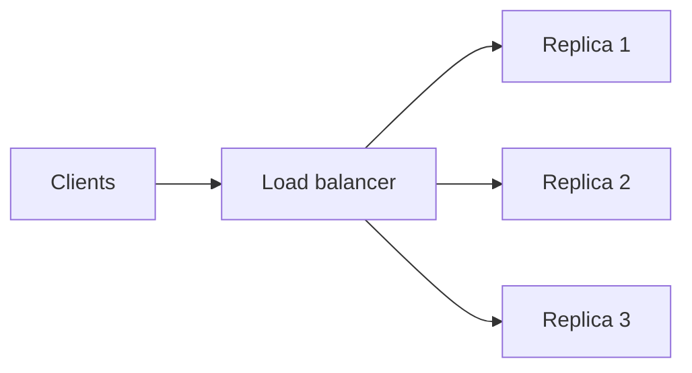
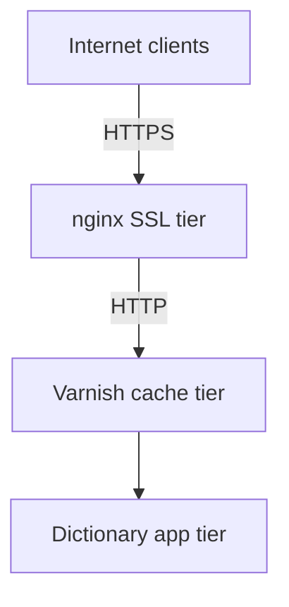

# Replicated Load-Balanced Services

> **Adapted from:** Bilgin Ibryam & Roland Huß, *Kubernetes Patterns* (O'Reilly, 2019), Chapter 6 — rewritten and condensed for teaching.

The simplest distributed pattern — and one most teams already know — is a **replicated load-balanced service**: several identical servers behind a load balancer, any replica able to serve any client request.



This chapter walks through deploying that pattern in Kubernetes, then stacking additional replicated tiers for caching and TLS termination.

---

## Stateless Services

A **stateless** service does not depend on saved per-request state on a particular instance. Any replica can handle any request — static file servers, aggregators that fan out to backends, dictionary lookup APIs, and many HTTP APIs fit this model.

Replicas serve two goals:

1. **Redundancy** — survive rollouts and crashes without user-visible downtime.
2. **Scale** — add replicas as traffic grows (**horizontal scaling**).

### Why you need at least two replicas for a real SLA

A single instance makes aggressive uptime targets nearly impossible during deploys.

For **99.9%** availability you get about **1.4 minutes of downtime per day** (24 × 60 × 0.001). If you deploy once per day, each rollout must finish in under 1.4 minutes — and that assumes the process never crashes from bugs. Deploy **hourly** and each rollout must complete in about **3.6 seconds** to stay within budget on a single node.

Two replicas behind a load balancer let you roll one instance while the other keeps serving — users never notice a healthy rollout or a single crash.

### Check: stateless replication

<MultipleChoice
  id="dds-replicated-stateless"
  title="Stateless replicated services"
  questions={[
    {
      prompt: 'Why is a single replica a poor fit for a 99.9% availability SLA when you deploy frequently?',
      choices: [
        'Kubernetes cannot schedule more than one Pod per Deployment',
        'Every rollout (or crash) takes the only instance offline; with frequent deploys the cumulative downtime quickly exceeds the SLA budget unless each rollout is unrealistically fast',
        'Load balancers only work with exactly three replicas',
        'Stateless services must store session state on disk',
      ],
      answer: 1,
      why: 'Redundancy exists so one replica can serve while another is upgrading or recovering.',
    },
    {
      prompt: 'What does it mean for a service to be stateless in this pattern?',
      choices: [
        'It never uses a database',
        'Any replica can serve any client request without relying on data pinned to a specific instance from a prior request',
        'It cannot be load-balanced',
        'It must use round-robin routing only',
      ],
      answer: 1,
      why: 'Statelessness is about per-request independence at the serving tier, not about backends or storage elsewhere.',
    },
  ]}
/>

---

## Readiness Probes for Load Balancing

Replicating and load-balancing is not enough. The orchestrator and load balancer need to know when a replica is **ready for traffic** — not just **alive**.

| Probe | Question | Typical action if it fails |
|---|---|---|
| **Liveness** | Is the process alive? | Restart the container |
| **Readiness** | Can this instance serve requests right now? | Remove it from the load balancer pool |

Many apps start quickly but are not ready immediately: downloading data, connecting to databases, loading plugins. The dictionary server in the hands-on section starts serving HTTP immediately but only reports **ready** after an ~8 MB dictionary finishes downloading.

Build a **readiness endpoint** (e.g. `GET /ready`) and wire it into the Pod spec so traffic only hits warmed replicas. See also [Important Distributed System Concepts](./important-distributed-system-concepts#orchestration-and-kubernetes) for the liveness/readiness distinction.

### Check: readiness probes

<MultipleChoice
  id="dds-replicated-readiness"
  title="Readiness vs liveness"
  questions={[
    {
      prompt: 'A container is downloading a large file it needs before it can answer requests correctly. It is alive but not yet usable. Which probe should fail?',
      choices: [
        'Liveness — so Kubernetes restarts it',
        'Readiness — so the load balancer withholds traffic until initialization completes',
        'Both must fail immediately on startup',
        'Neither — probes are only for databases',
      ],
      answer: 1,
      why: 'Failing readiness keeps a healthy-but-initializing process running while preventing bad user traffic.',
    },
  ]}
/>

---

## Hands On: Dictionary Server Deployment

We'll deploy `brendanburns/dictionary-server` — visit `/dog` for a definition; `/ready` reports when the dictionary has loaded.

Local smoke test (optional):

```bash
docker run -p 8080:8080 brendanburns/dictionary-server
# http://localhost:8080/dog
```

### Deployment with readiness

Complete the Deployment: run **three** replicas, label Pods so a Service can select them, and add an **HTTP readiness probe** on `/ready` (port 8080, sensible `initialDelaySeconds` / `periodSeconds`).

<YamlEditor
  filename="dictionary-deploy.yaml"
  title="Dictionary server Deployment"
  heading="exercise-dictionary-deploy"
  hint="spec.replicas, template.metadata.labels, and containers.readinessProbe.httpGet are the missing pieces."
  height="380px"
  checks={[
    { name: 'three replicas', pattern: 'replicas:\\s*3\\b', must: true, hint: 'add replicas: 3 under spec' },
    { name: 'app label on Pod template', pattern: 'app:\\s*dictionary-server', must: true, hint: 'label Pods with app: dictionary-server so the Service can select them' },
    { name: 'readiness probe on /ready', pattern: 'readinessProbe:[\\s\\S]*path:\\s*/ready', must: true, hint: 'add readinessProbe.httpGet.path: /ready on port 8080' },
  ]}
  starter={`apiVersion: apps/v1
kind: Deployment
metadata:
  name: dictionary-server
spec:
  template:
    metadata:
      labels:
    spec:
      containers:
        - name: server
          image: brendanburns/dictionary-server
          ports:
            - containerPort: 8080`}
  solution={`apiVersion: apps/v1
kind: Deployment
metadata:
  name: dictionary-server
spec:
  replicas: 3
  selector:
    matchLabels:
      app: dictionary-server
  template:
    metadata:
      labels:
        app: dictionary-server
    spec:
      containers:
        - name: server
          image: brendanburns/dictionary-server
          ports:
            - containerPort: 8080
          readinessProbe:
            httpGet:
              path: /ready
              port: 8080
            initialDelaySeconds: 5
            periodSeconds: 5`}
/>

### Service load balancer

Add a Service that selects the dictionary Pods and exposes port **8080** (with `targetPort` matching the container).

<YamlEditor
  filename="dictionary-service.yaml"
  title="Dictionary server Service"
  heading="exercise-dictionary-service"
  hint="The Service needs a selector matching the Deployment labels and ports that map 8080 to the container."
  checks={[
    { name: 'selector matches Deployment', pattern: 'selector:[\\s\\S]*app:\\s*dictionary-server', must: true, hint: 'add selector.app: dictionary-server under spec' },
    { name: 'port 8080 with targetPort', pattern: 'port:\\s*8080[\\s\\S]*targetPort:\\s*8080', must: true, hint: 'expose port 8080 and set targetPort: 8080' },
  ]}
  starter={`apiVersion: v1
kind: Service
metadata:
  name: dictionary-server-service
spec:
  ports:
    - protocol: TCP`}
  solution={`apiVersion: v1
kind: Service
metadata:
  name: dictionary-server-service
spec:
  selector:
    app: dictionary-server
  ports:
    - protocol: TCP
      port: 8080
      targetPort: 8080`}
/>

The Service gives clients a **stable DNS name** independent of any single Pod IP.

---

## Session-Tracked Services

Round-robin spreads load evenly but sends each user's requests to random replicas. Sometimes you need **session stickiness** — all requests from one user hit the same replica (in-memory cache, long-lived interaction state).

**IP hashing** (source + destination IP) keeps a client on one backend while IPs stay constant. Inside a cluster this works with internal IPs; **NAT** breaks it for external clients — use **cookies** or application headers instead.

When replica count changes, remapping every client is expensive. **Consistent hashing** minimizes how many sessions move when you scale up or down.

### Check: session tracking

<MultipleChoice
  id="dds-replicated-session"
  title="Session-tracked services"
  questions={[
    {
      prompt: 'Why is IP-based session affinity often a poor choice for external users behind NAT?',
      choices: [
        'NAT makes many clients appear to share one source IP, breaking per-user stickiness',
        'Kubernetes Services cannot use IP hashing',
        'External IPs are always encrypted',
        'Session tracking requires stateful storage on every replica',
      ],
      answer: 0,
      why: 'NAT collapses many users behind one address — cookies or app-level keys identify users more reliably.',
    },
  ]}
/>

---

## Application-Layer Replicated Services: A Caching Tier

Even stateless app code can be expensive (database queries, rendering). An **HTTP cache** (e.g. **Varnish**) sits between clients and your app tier: identical requests are answered from memory after the first miss.


### Sidecar cache vs dedicated cache tier

You *could* run Varnish as a **sidecar** beside each app Pod — simple, but every page is cached on every replica. That duplicates memory and lowers hit rate.

Usually you want **few large cache replicas** and **many smaller app replicas** (Node.js often uses one core per process). Deploy caching as a **second replicated tier** above the app tier, each with its own Service.

:::warning Caching breaks naive IP stickiness
With a cache tier, backends see the **cache's IP**, not the end user. IP affinity at the app layer may send all traffic to one app Pod. Use cookies or headers for session tracking behind a cache.
:::

---

## Hands On: Varnish Caching Layer

The dictionary Service is reachable in-cluster as `dictionary-server-service:8080`. Complete the Varnish config, Deployment, and Service.

### Varnish backend

Point the default backend at the dictionary Service on port 8080.

<YamlEditor
  filename="default.vcl"
  lang="yaml"
  title="Varnish backend configuration"
  heading="exercise-varnish-vcl"
  hint="backend.default needs .host and .port for the dictionary Service DNS name."
  checks={[
    { name: 'backend host', pattern: '\\.host\\s*=\\s*"dictionary-server-service"', must: true, hint: 'set .host to dictionary-server-service' },
    { name: 'backend port', pattern: '\\.port\\s*=\\s*"8080"', must: true, hint: 'set .port to "8080"' },
  ]}
  starter={`vcl 4.0;

backend default {
}`}
  solution={`vcl 4.0;

backend default {
  .host = "dictionary-server-service";
  .port = "8080";
}`}
/>

Create the ConfigMap: `kubectl create configmap varnish-config --from-file=default.vcl`

### Varnish Deployment

Deploy **two** cache replicas with a **2Gi** memory request, mount `varnish-config` at `/etc/varnish-config`, and run `varnishd` with `-f /etc/varnish-config/default.vcl` listening on `0.0.0.0:8080`.

<YamlEditor
  filename="varnish-deploy.yaml"
  title="Varnish cache Deployment"
  heading="exercise-varnish-deploy"
  hint="Add replicas, resources.requests.memory, volumeMounts, and volumes.configMap for varnish-config."
  height="400px"
  checks={[
    { name: 'two cache replicas', pattern: 'replicas:\\s*2\\b', must: true, hint: 'add replicas: 2 under spec' },
    { name: '2Gi memory request', pattern: 'memory:\\s*2Gi', must: true, hint: 'request memory: 2Gi for the cache container' },
    { name: 'varnish-config volume', pattern: 'name:\\s*varnish-config', must: true, hint: 'mount the varnish-config ConfigMap' },
  ]}
  starter={`apiVersion: apps/v1
kind: Deployment
metadata:
  name: varnish-cache
spec:
  template:
    metadata:
      labels:
        app: varnish-cache
    spec:
      containers:
        - name: cache
          image: brendanburns/varnish
          command:
            - varnishd
            - -F
            - -f
            - /etc/varnish-config/default.vcl
            - -a
            - 0.0.0.0:8080
            - -s
            - malloc,2G
          ports:
            - containerPort: 8080`}
  solution={`apiVersion: apps/v1
kind: Deployment
metadata:
  name: varnish-cache
spec:
  replicas: 2
  selector:
    matchLabels:
      app: varnish-cache
  template:
    metadata:
      labels:
        app: varnish-cache
    spec:
      containers:
        - name: cache
          image: brendanburns/varnish
          resources:
            requests:
              memory: 2Gi
          command:
            - varnishd
            - -F
            - -f
            - /etc/varnish-config/default.vcl
            - -a
            - 0.0.0.0:8080
            - -s
            - malloc,2G
          ports:
            - containerPort: 8080
          volumeMounts:
            - name: varnish
              mountPath: /etc/varnish-config
      volumes:
        - name: varnish
          configMap:
            name: varnish-config`}
/>

### Varnish Service

Expose the cache tier: select `app: varnish-cache`, listen on port **80**, forward to container port **8080**.

<YamlEditor
  filename="varnish-service.yaml"
  title="Varnish Service"
  heading="exercise-varnish-service"
  hint="selector must match the varnish Deployment labels; map Service port 80 to targetPort 8080."
  checks={[
    { name: 'selector for varnish-cache', pattern: 'selector:[\\s\\S]*app:\\s*varnish-cache', must: true, hint: 'add selector.app: varnish-cache' },
    { name: 'port 80 to 8080', pattern: 'port:\\s*80[\\s\\S]*targetPort:\\s*8080', must: true, hint: 'set port: 80 and targetPort: 8080' },
  ]}
  starter={`apiVersion: v1
kind: Service
metadata:
  name: varnish-service
spec:
  ports:
    - protocol: TCP`}
  solution={`apiVersion: v1
kind: Service
metadata:
  name: varnish-service
spec:
  selector:
    app: varnish-cache
  ports:
    - protocol: TCP
      port: 80
      targetPort: 8080`}
/>

---

## Expanding the Edge: Rate Limiting and TLS

HTTP reverse proxies can also provide **rate limiting** (Varnish throttle modules, HTTP **429** responses, custom `X-RateLimit-Remaining` headers) and are a natural place for **anonymous vs authenticated** quotas. For mission-critical public APIs, add cloud DDoS protection beyond what a proxy alone provides.

**Varnish does not terminate TLS.** A third replicated tier of **nginx** servers often handles HTTPS at the edge, using **per-layer certificates** (edge cert ≠ internal service certs) so each tier rolls independently.

Complete the nginx SSL server block: terminate TLS on **443** and `proxy_pass` to the Varnish Service on port 80, forwarding standard headers (`Host`, `X-Forwarded-For`, `X-Forwarded-Proto`, `X-Real-IP`).

<YamlEditor
  filename="nginx-ssl.conf"
  lang="yaml"
  title="nginx SSL termination"
  heading="exercise-nginx-ssl"
  hint="listen 443 ssl; certificate paths under /etc/certs; proxy_pass to varnish-service:80 with proxy_set_header lines."
  height="360px"
  checks={[
    { name: 'listens on 443 ssl', pattern: 'listen\\s+443\\s+ssl', must: true, hint: 'add listen 443 ssl in the server block' },
    { name: 'proxies to varnish', pattern: 'proxy_pass\\s+http://varnish-service:80', must: true, hint: 'proxy_pass to the Varnish Service' },
    { name: 'forwards client IP', pattern: 'X-Forwarded-For', must: true, hint: 'set X-Forwarded-For (and related headers) for downstream apps' },
  ]}
  starter={`events {
  worker_connections  1024;
}

http {
  server {
    ssl_certificate     /etc/certs/tls.crt;
    ssl_certificate_key /etc/certs/tls.key;

    location / {
    }
  }
}`}
  solution={`events {
  worker_connections  1024;
}

http {
  server {
    listen 443 ssl;
    server_name my-domain.com www.my-domain.com;

    ssl_certificate     /etc/certs/tls.crt;
    ssl_certificate_key /etc/certs/tls.key;

    location / {
      proxy_pass http://varnish-service:80;
      proxy_set_header Host $host;
      proxy_set_header X-Forwarded-For $proxy_add_x_forwarded_for;
      proxy_set_header X-Forwarded-Proto $scheme;
      proxy_set_header X-Real-IP $remote_addr;
    }
  }
}`}
/>

Upload certs as a Secret (`kubectl create secret tls ssl --cert=server.crt --key=server.key`), mount the nginx ConfigMap and Secret in a fourth Deployment, and expose it with a `type: LoadBalancer` Service on port 443 — same shape as the tiers above.



---

:::important Key takeaways
- **Replicated load-balanced services** put identical replicas behind a load balancer for redundancy and horizontal scale.
- **Two or more replicas** make realistic SLAs achievable during rollouts; one replica forces impossibly fast deploys.
- **Readiness probes** gate traffic until an instance is initialized; **liveness** probes restart broken processes — do not conflate them.
- **Session stickiness** via IP hash works in-cluster; prefer cookies/headers for external users and behind caches.
- **Dedicated cache tiers** (few large replicas) beat per-Pod cache sidecars for hit rate; watch stickiness when traffic comes from the cache layer's IP.
- A full **edge stack** often stacks nginx (TLS) → Varnish (cache/rate limit) → app tier, each as its own replicated Service.
:::

## Further Reading

- Bilgin Ibryam & Roland Huß — *Kubernetes Patterns* (O'Reilly, 2019), Chapter 6
- [Sharded Services](./sharded-services) — the next pattern: partition-specific caches, shard keys, and consistent hashing
- [Ambassadors](./ambassador-pattern) — client-side proxies in the same Pod (contrast with network-layer Services)
- [Important Distributed System Concepts](./important-distributed-system-concepts) — liveness vs readiness
- [The Sidecar Pattern](./sidecar-pattern) — alternative placement for a cache container
- [Kubernetes Deployments](https://kubernetes.io/docs/concepts/workloads/controllers/deployment/)
- [Configure Liveness, Readiness and Startup Probes](https://kubernetes.io/docs/tasks/configure-pod-container/configure-liveness-readiness-startup-probes/)
