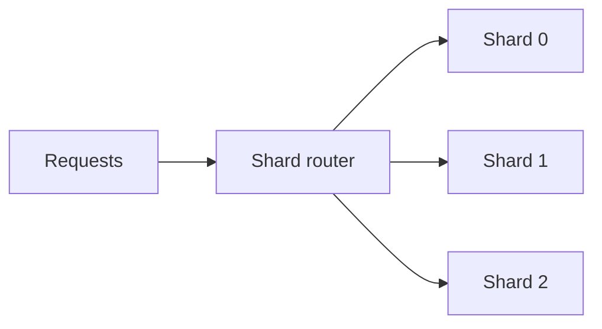
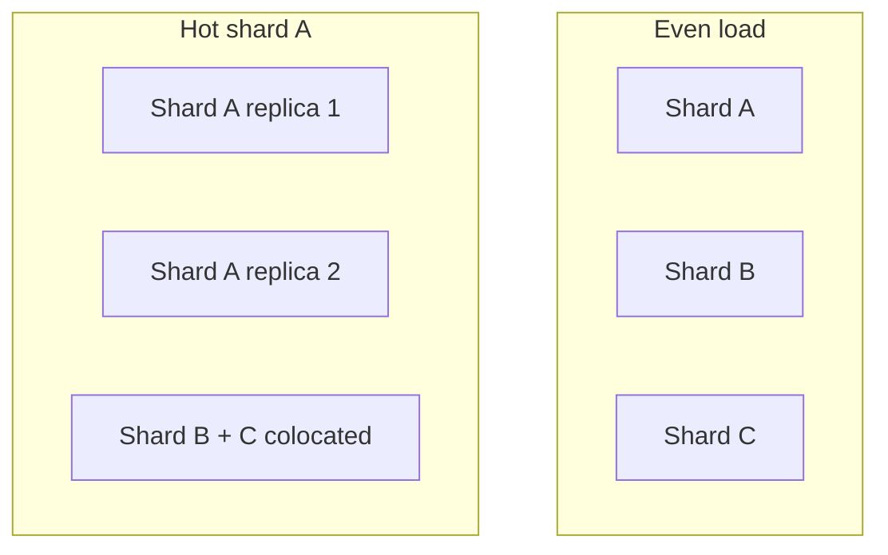

# Sharded Services

> **Adapted from:** Bilgin Ibryam & Roland Huß, *Kubernetes Patterns* (O'Reilly, 2019), Chapter 7 — rewritten and condensed for teaching.

[Replicated Load-Balanced Services](./replicated-load-balanced-services) spread identical replicas behind a load balancer — any replica can serve any request. **Sharding** sends particular requests to particular **groups** of machines instead. Each shard holds a disjoint slice of data or traffic.



Sharding helps when:

- **Data exceeds one machine** — caches, game worlds, databases.
- **Isolation matters** — a poison request that crashes replicas may take down one shard, not the entire fleet.

[Ambassadors](./ambassador-pattern) showed how a Pod-local proxy routes to shards; this chapter focuses on **building the sharded tier itself** and choosing **shard keys** and **hash functions**.

---

## Sharded Caching

A **sharded cache** sits between users and your app tier.


### Why replicate is not enough for big working sets

Example: each cache node has **10 GB** RAM and handles **100 RPS**. Your working set is **200 GB** and you need **1,000 RPS**.

| Design | RPS capacity | Unique data cached |
|---|---|---|
| **10 replicated caches** (Ch. 6) | 10 × 100 = 1,000 ✓ | ~10 GB each → **5%** of 200 GB total |
| **10-way sharded cache** | 10 × 100 = 1,000 ✓ | 10 × 10 GB → **50%** of 200 GB total |

Replicated caches duplicate the **same hot keys** on every node — great for redundancy, poor for **memory utilization**. Sharded caches store each key on **one** shard, dramatically improving hit rate for large catalogs.

### Check: sharded vs replicated cache

<MultipleChoice
  id="dds-sharded-cache-why"
  title="Why shard a cache?"
  questions={[
    {
      prompt: 'Ten cache replicas each have 10 GB RAM; the total working set is 200 GB. Why does a replicated (non-sharded) layout only cover about 5% of the data?',
      choices: [
        'Kubernetes limits cache size to 5%',
        'Each replica stores roughly the same popular keys independently, so aggregate unique cached data is about one node worth (~10 GB), not 10× unique capacity',
        'Sharded caches cannot handle 1,000 RPS',
        'Memcached always duplicates data by design',
      ],
      answer: 1,
      why: 'Replication optimizes availability and RPS; sharding optimizes aggregate memory — each key lives on one shard.',
    },
  ]}
/>

---

## The Role of the Cache in Performance

Ask: **if the cache fails, what happens to users?**

### Throughput (hit rate and RPS)

A serving layer handles **1,000 RPS** before returning HTTP 500. Add a cache with **50% hit rate**:

- 2,000 inbound RPS → 1,000 served from cache, 1,000 hit the origin → system stays within capacity.
- **Cache failure** doubles origin load → half of users may fail.

If the cache is critical, rate the service below theoretical max (e.g. **1,500 RPS** instead of 2,000) so you survive losing half the cache shards.

### Latency

A **25% hit rate** cache returning in 10 ms vs 100 ms origin work lowers average latency (e.g. to ~77.5 ms). Cache misses are slower but usually tolerable unless queues back up. **Load-test with and without the cache.**

### Warmup and rollouts

A **new empty shard** has 0% hit rate until populated. Rolling a sharded cache temporarily reduces effective capacity — unlike replicated caches where a new replica can share load immediately. Mitigations: **replicated shards** (each shard is its own small replicated service) or careful rollout timing.

---

## Replicated Sharded Caches

Combine patterns: each **shard** is implemented as a **replicated service** (Ch. 6), not a single server.

- Shard failure does not remove an entire partition from the fleet.
- Rollouts during peak traffic become safer with over-provisioned shard capacity.
- **Hot shards** can scale independently (**hot sharding**) — replicate a busy shard onto more machines while cooler shards share hardware.

Trade-off: more moving parts than simple sharding.

### Check: cache criticality and shards

<MultipleChoice
  id="dds-sharded-cache-failure"
  title="Sharded cache behavior"
  questions={[
    {
      prompt: 'Why does losing one shard in a sharded cache hurt more than losing one replica in a fully replicated cache?',
      choices: [
        'Sharded caches never recalculate missed data',
        'A given key always maps to the same shard — while that shard is down, those keys always miss until it recovers, whereas replicated caches have identical data on other replicas',
        'Kubernetes restarts sharded caches more slowly',
        'Hit rate is unrelated to shard failures',
      ],
      answer: 1,
      why: 'Sharding trades memory efficiency for partition-specific failure domains — misses are correct but slower until the shard returns.',
    },
  ]}
/>

---

## Hands On: Sharded Memcache with an Ambassador

Same shape as [sharded Redis in Ambassadors](./ambassador-pattern#hands-on-implementing-a-sharded-redis): **StatefulSet** shards, **headless Service** DNS, **twemproxy** routing, **ConfigMap** config.

### Memcache StatefulSet

Complete the StatefulSet for **three** `memcached` shards. `serviceName` must match the headless Service you create next; Pods need the `app: memcache` label.

<YamlEditor
  filename="memcached-shards.yaml"
  title="Memcache StatefulSet"
  heading="exercise-memcache-statefulset"
  hint="spec needs serviceName, replicas, selector, and template labels for app: memcache."
  checks={[
    { name: 'serviceName memcache', pattern: 'serviceName:\\s*["\']?memcache', must: true, hint: 'add serviceName: memcache under spec' },
    { name: 'three shards', pattern: 'replicas:\\s*3\\b', must: true, hint: 'add replicas: 3' },
    { name: 'memcache label', pattern: 'app:\\s*memcache', must: true, hint: 'label Pods with app: memcache' },
  ]}
  starter={`apiVersion: apps/v1
kind: StatefulSet
metadata:
  name: sharded-memcache
spec:
  template:
    metadata:
      labels:
    spec:
      terminationGracePeriodSeconds: 10
      containers:
        - name: memcache
          image: memcached
          ports:
            - containerPort: 11211
              name: memcache`}
  solution={`apiVersion: apps/v1
kind: StatefulSet
metadata:
  name: sharded-memcache
spec:
  serviceName: memcache
  replicas: 3
  selector:
    matchLabels:
      app: memcache
  template:
    metadata:
      labels:
        app: memcache
    spec:
      terminationGracePeriodSeconds: 10
      containers:
        - name: memcache
          image: memcached
          ports:
            - containerPort: 11211
              name: memcache`}
/>

### Headless Service

Pods should resolve as `memcache-0.memcache`, `memcache-1.memcache`, etc.

<YamlEditor
  filename="memcached-service.yaml"
  title="Memcache headless Service"
  heading="exercise-memcache-service"
  hint="metadata.name must match the StatefulSet serviceName; use clusterIP: None."
  checks={[
    { name: 'Service named memcache', pattern: 'name:\\s*memcache\\b', must: true, hint: 'add metadata.name: memcache' },
    { name: 'headless Service', pattern: 'clusterIP:\\s*None', must: true, hint: 'add clusterIP: None under spec' },
  ]}
  starter={`apiVersion: v1
kind: Service
metadata:
  labels:
    app: memcache
spec:
  ports:
    - port: 11211
      name: memcache
  selector:
    app: memcache`}
  solution={`apiVersion: v1
kind: Service
metadata:
  name: memcache
  labels:
    app: memcache
spec:
  ports:
    - port: 11211
      name: memcache
  clusterIP: None
  selector:
    app: memcache`}
/>

### twemproxy config (Pod ambassador)

Route memcache protocol on **loopback** so the app container in the same Pod talks to `127.0.0.1:11211`. List all three shard DNS names under `servers`.

<YamlEditor
  filename="nutcracker-memcache.yaml"
  title="twemproxy memcache routing"
  heading="exercise-memcache-nutcracker"
  hint="listen on 127.0.0.1:11211; servers use memcache-0.memcache through memcache-2.memcache on port 11211."
  checks={[
    { name: 'loopback listen', pattern: 'listen:\\s*127\\.0\\.0\\.1:11211', must: true, hint: 'add listen: 127.0.0.1:11211' },
    { name: 'ketama distribution', pattern: 'distribution:\\s*ketama', must: true, hint: 'use distribution: ketama for memcache sharding' },
    { name: 'three shard backends', pattern: 'memcache-2\\.memcache:11211', must: true, hint: 'list all three memcache shard hostnames under servers' },
  ]}
  starter={`memcache:
  hash: fnv1a_64
  auto_eject_hosts: true
  timeout: 400
  server_retry_timeout: 2000
  server_failure_limit: 1
  servers:`}
  solution={`memcache:
  listen: 127.0.0.1:11211
  hash: fnv1a_64
  distribution: ketama
  auto_eject_hosts: true
  timeout: 400
  server_retry_timeout: 2000
  server_failure_limit: 1
  servers:
    - memcache-0.memcache:11211:1
    - memcache-1.memcache:11211:1
    - memcache-2.memcache:11211:1`}
/>

---

## Shared Shard Router (Alternative to Ambassador)

Instead of a twemproxy **ambassador per app Pod**, deploy a **replicated shard router** as its own tier:

- **Pros:** simpler client — one DNS name; no sidecar in every Pod.
- **Cons:** shared bottleneck to scale; extra network hop and bandwidth.

The twemproxy config difference: listen on **`0.0.0.0:11211`** (all interfaces) instead of loopback, then front it with a Service load balancer.

<YamlEditor
  filename="shared-nutcracker.yaml"
  title="Shared twemproxy listen address"
  heading="exercise-shared-nutcracker"
  hint="A cluster-wide router must accept connections from other Pods — bind all interfaces on port 11211."
  checks={[
    { name: 'listens on all interfaces', pattern: 'listen:\\s*0\\.0\\.0\\.0:11211', must: true, hint: 'set listen: 0.0.0.0:11211' },
    { name: 'three memcache shards', pattern: 'memcache-0\\.memcache:11211', must: true, hint: 'keep the three shard entries under servers' },
  ]}
  starter={`memcache:
  hash: fnv1a_64
  distribution: ketama
  auto_eject_hosts: true
  timeout: 400
  server_retry_timeout: 2000
  server_failure_limit: 1
  servers:
    - memcache-0.memcache:11211:1
    - memcache-1.memcache:11211:1
    - memcache-2.memcache:11211:1`}
  solution={`memcache:
  listen: 0.0.0.0:11211
  hash: fnv1a_64
  distribution: ketama
  auto_eject_hosts: true
  timeout: 400
  server_retry_timeout: 2000
  server_failure_limit: 1
  servers:
    - memcache-0.memcache:11211:1
    - memcache-1.memcache:11211:1
    - memcache-2.memcache:11211:1`}
/>

Complete the **Deployment** (three `shared-twemproxy` replicas, mount `shared-twem-config`) and **Service** (`shard-router-service`, selector `app: shared-twemproxy`, port 11211) using the same patterns as [Replicated Load-Balanced Services](./replicated-load-balanced-services).

---

## Sharding Functions

Pick shard for request `Req`:

```
Shard = ShardingFunction(Req)
```

Common approach: **`hash(key) % num_shards`**

Requirements:

- **Determinism** — same input → same shard.
- **Uniformity** — spread load evenly across shards.

### Selecting the shard key

Do **not** hash the entire request object if most fields do not affect the response.

| Key choice | Effect |
|---|---|
| `hash(full request)` | Different client IP / time → different shards for identical cacheable responses — **too general** |
| `hash(request.path)` | Good when path alone defines the response |
| `hash(ip, path)` | French vs US IPs need different content, but two French IPs land on different shards — **too specific** |
| `hash(country(ip), path)` | Groups geographically equivalent users while splitting countries |

The right key requires understanding which request attributes actually change the response. See also [Partitioning of Key-Value Data](../distributed-data/partitioning-of-key-value-data) for database partition keys.

### Check: shard keys

<MultipleChoice
  id="dds-sharded-key"
  title="Choosing a shard key"
  questions={[
    {
      prompt: 'Two HTTP GETs differ only by client IP and timestamp; the response depends only on the URL path. Which shard key is best for a cache in front of this API?',
      choices: [
        'Hash the entire request object including IP and time',
        'Hash only the request path (or full URI if query string matters)',
        'Hash a random UUID per request',
        'Always shard by timestamp',
      ],
      answer: 1,
      why: 'Shard on attributes that actually determine the cached bytes — otherwise you fragment identical cacheable responses across shards.',
    },
    {
      prompt: 'Responses vary by user country derived from IP, but two users in France should share cached pages. Which key is better?',
      choices: [
        'hash(client_ip, path) — every IP is unique',
        'hash(country(client_ip), path) — group by country then path',
        'hash(timestamp) only',
        'No sharding — use one global cache',
      ],
      answer: 1,
      why: 'Normalize IP to country before hashing when geography defines the response but per-IP stickiness is unnecessary.',
    },
  ]}
/>

---

## Consistent Hashing

Changing from `hash(Req) % 10` to `hash(Req) % 11` **remaps most keys** — in a cache, that looks like a mass miss event (similar to total cache failure).

**Consistent hashing** limits remapping when shard count changes — moving from 10 to 11 shards remaps roughly **K/11** keys instead of nearly all of them. twemproxy's **ketama** distribution uses this idea.

### Hands On: nginx consistent hash HTTP proxy

Shard HTTP requests by **full URI** (`$request_uri` — path + query; add cookies or locale if responses vary by them). Use nginx **`hash $request_uri consistent`** in the upstream block.

<YamlEditor
  filename="nginx-shard-proxy.conf"
  lang="yaml"
  title="nginx consistent hash sharding"
  heading="exercise-nginx-consistent-hash"
  hint="upstream backend needs hash $request_uri consistent and three server lines for web-shard-1.web through web-shard-3.web."
  height="360px"
  checks={[
    { name: 'consistent hash on URI', pattern: 'hash\\s+\\$request_uri\\s+consistent', must: true, hint: 'add hash $request_uri consistent inside upstream backend' },
    { name: 'three shard backends', pattern: 'web-shard-3\\.web', must: true, hint: 'list server web-shard-1.web through web-shard-3.web' },
    { name: 'proxy_pass to backend', pattern: 'proxy_pass\\s+http://backend', must: true, hint: 'proxy_pass http://backend in location /' },
  ]}
  starter={`worker_processes  5;
error_log  error.log;
pid        nginx.pid;
worker_rlimit_nofile 8192;

events {
  worker_connections  1024;
}

http {
  upstream backend {
  }
  server {
    listen localhost:80;
    location / {
    }
  }
}`}
  solution={`worker_processes  5;
error_log  error.log;
pid        nginx.pid;
worker_rlimit_nofile 8192;

events {
  worker_connections  1024;
}

http {
  upstream backend {
    hash $request_uri consistent;
    server web-shard-1.web;
    server web-shard-2.web;
    server web-shard-3.web;
  }
  server {
    listen localhost:80;
    location / {
      proxy_pass http://backend;
    }
  }
}`}
/>

---

## Beyond Caching: Hot Shards and Isolation

**Sharded replicated serving** applies to any dataset larger than one machine — open-world game servers shard by player location; databases shard by user id or range.

**Hot shards** happen when traffic is uneven (a viral photo, a celebrity account). With **replicated shards**, scale the hot partition independently — even colocate cool shards and replicate the hot one onto extra machines (autoscaling per shard).

Poison or crash-inducing requests are **isolated to one shard** — the blast radius is a fraction of total traffic, not the whole fleet.



---

:::important Key takeaways
- **Sharding** routes requests to partition-specific server groups — unlike replication, each shard holds **different** data.
- **Sharded caches** maximize memory for large working sets; replicated caches maximize **duplicate** hot data for RPS and redundancy.
- **Hit rate** ties cache health to origin capacity and user latency — design headroom for shard loss and warmup after deploys.
- **Replicated shards** combine both patterns: each partition is its own small HA replica set.
- **Shard keys** must reflect what actually changes the response — not every request field belongs in the hash.
- **Consistent hashing** (ketama, nginx `consistent`) limits key churn when shard counts change.
- Deploy shard routers as **Pod ambassadors** (localhost) or **shared Services** (0.0.0.0) — simpler ops vs extra hop.
:::

## Further Reading

- Bilgin Ibryam & Roland Huß — *Kubernetes Patterns* (O'Reilly, 2019), Chapter 7
- [Ambassadors](./ambassador-pattern) — client-side twemproxy to sharded Redis
- [Replicated Load-Balanced Services](./replicated-load-balanced-services) — the pattern sharded caches often sit in front of
- [Partitioning of Key-Value Data](../distributed-data/partitioning-of-key-value-data) — partition keys and rebalancing in storage systems
- [twemproxy / ketama](https://github.com/twitter/twemproxy)
