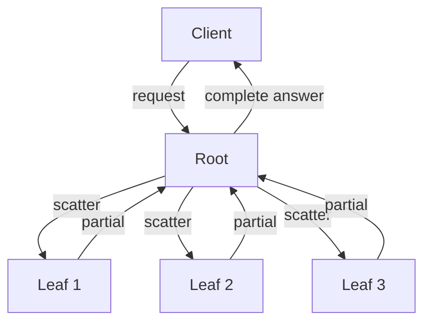
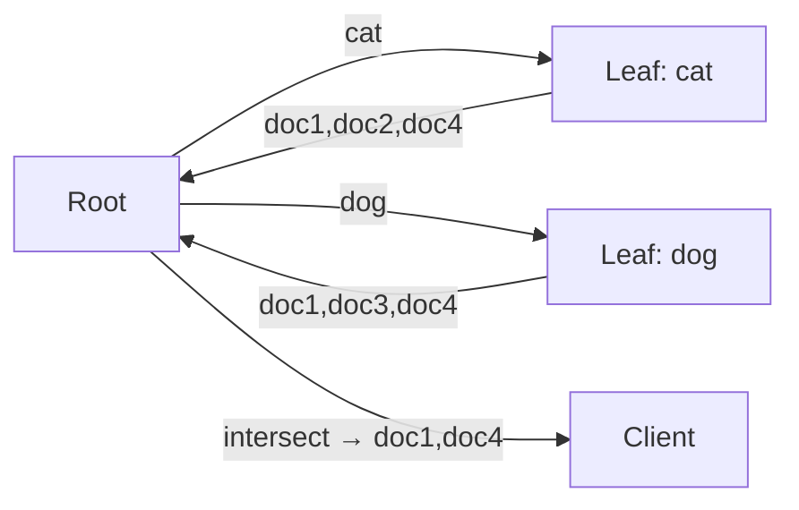
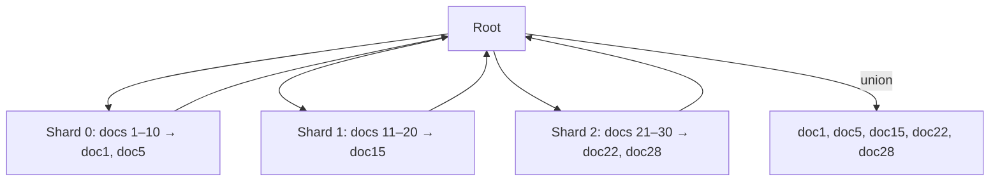
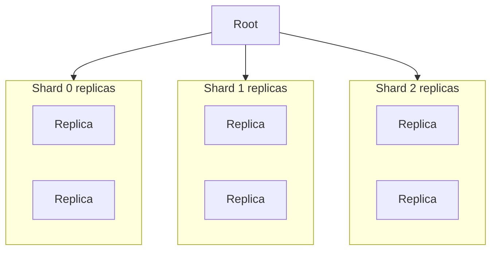

# Scatter/Gather

> **Adapted from:** Brendan Burns, *Designing Distributed Systems* (O'Reilly), Chapter 8 — rewritten and condensed for teaching.

[Replicated load-balanced services](./replicated-load-balanced-services) scale **request rate**. [Sharded services](./sharded-services) scale **data size**. **Scatter/gather** scales **time**: it farms one request out to many workers in parallel, then merges partial answers so wall-clock latency drops versus doing the work sequentially.

Like those patterns, scatter/gather is a **tree**: a **root** distributes work; **leaves** process slices. Unlike ordinary sharding — where one shard handles a request — scatter/gather typically sends work to **many (or all) leaves at once**. Each leaf returns a **fraction** of the answer; the root **combines** them and replies to the client.

Use scatter/gather when a request needs a **large amount of mostly independent** computation (or index lookup) that you can split, run in parallel, and stitch back together.

---

## Scatter/Gather with Root Distribution

The simplest form: every leaf can see the **same** data (or the same full index), but the root **splits the computation** across leaves — an “embarrassingly parallel” problem.

Example: one core needs **60 s** for request `R`. On a **30-core** machine, ideal parallelization is about **2 s** — still slow for a web request, and a single box hits memory, disk, and NIC limits. Scatter/gather pushes the same idea **across machines**: more cores, more bandwidth pools, and a root that can favor responsive leaves when one node is slow (noisy neighbor).

### Hands On: Distributed Document Search (term scatter)

Goal: find documents containing **both** `"cat"` and `"dog"`.

A full-text **index** is a map from word → list of document IDs. Looking up `"cat"` and `"dog"` are **independent**. The root only needs both lists to compute the **intersection**.

Implement the root merge for term-sharded scatter/gather: given one document-ID list per word, return the **sorted intersection**.

<CodeExercise
  id="dds-sg-term-intersect"
  title="Term scatter: intersect leaf results"
  heading="exercise-term-intersect"
  lang="python"
  filename="main.py"
  prompt={`(1) Implement intersect_docs(partial_lists): each list is document IDs for one word.

(2) Return the sorted list of IDs present in EVERY input list.

(3) An empty input list means no matches for that word — intersection is empty.`}
  sampleLog={`(no input)
[1, 4]`}
  starter={`def intersect_docs(partial_lists):
    # partial_lists: list of lists/sets of document IDs, one per word leaf.
    # Return sorted IDs that appear in every list.
    pass

print(intersect_docs([[1, 2, 4], [1, 3, 4]]))
print(intersect_docs([[1, 2], [3, 4]]))
print(intersect_docs([[5, 6, 7]]))
`}
  hint="Convert the first list to a set, then &= set(next) for each remaining list; return sorted(...)."
  solution={`def intersect_docs(partial_lists):
    if not partial_lists:
        return []
    result = set(partial_lists[0])
    for docs in partial_lists[1:]:
        result &= set(docs)
    return sorted(result)

print(intersect_docs([[1, 2, 4], [1, 3, 4]]))
print(intersect_docs([[1, 2], [3, 4]]))
print(intersect_docs([[5, 6, 7]]))
`}
  sourceChecks={[
    {
      name: 'uses set intersection',
      pattern: '&=|\\.intersection|set\\(',
      must: true,
      hint: 'intersect using sets (& or .intersection)',
    },
    {
      name: 'returns sorted',
      pattern: 'sorted\\s*\\(',
      must: true,
      hint: 'return sorted(...)',
    },
  ]}
  tests={[
    { name: 'cat ∩ dog example', stdin: '', equals: '[1, 4]\n[]\n[5, 6, 7]' },
  ]}
/>

### Check: root distribution

<MultipleChoice
  id="dds-sg-root-distribution"
  title="Root distribution"
  questions={[
    {
      prompt: 'In term-sharded document search for "cat" AND "dog", why can the two lookups run on different leaves?',
      choices: [
        'Because intersection never needs both word lists',
        'Because each word lookup only needs the index entry for that word — the lookups are independent until the root merges them',
        'Because HTTP forbids sequential lookups',
        'Because every leaf must hold a different document corpus',
      ],
      answer: 1,
      why: 'Independence of the per-word lookups is what makes scatter useful; the root still needs both results to intersect.',
    },
    {
      prompt: 'Compared with sharding a cache by key, root-distribution scatter/gather mainly improves…',
      choices: [
        'Only disk durability of a single replica',
        'Wall-clock latency by parallelizing independent pieces of one request across machines',
        'The number of unique keys that fit in one machine’s RAM (by itself)',
        'Certificate rotation frequency',
      ],
      answer: 1,
      why: 'Scatter/gather targets time; data capacity often still needs leaf sharding (next section).',
    },
  ]}
/>

---

## Scatter/Gather with Leaf Sharding

Root distribution alone does **not** grow past what one machine can store. When the corpus is huge (e.g. all patents worldwide), **shard the documents** across leaves.

Unlike request-level sharding — where the router sends each request to **one** shard — leaf-sharded scatter/gather sends the query to **every** shard. Each leaf searches **its** slice and returns matches. The root **unions** (or otherwise merges) those partial hits into one response.

Prefer a stable shard function (e.g. `patent_id % num_shards`) over contiguous ID ranges that always dump new data onto the newest shard.

### Hands On: Sharded Document Search

Each leaf holds only some documents. For `"cat" AND "dog"`, every leaf returns docs **in its shard** that contain **both** words. The root builds the **union** of those sets (not the intersection of different words — each leaf already applied the AND locally).

Implement shard-local AND search and root-side union.

<CodeExercise
  id="dds-sg-leaf-shard"
  title="Leaf-sharded search: local AND + union"
  heading="exercise-leaf-shard"
  lang="python"
  filename="main.py"
  prompt={`(1) search_shard(docs, words): docs is a list of (doc_id, word_set). Return sorted IDs whose word_set contains EVERY word in words.

(2) gather_union(shard_results): shard_results is a list of ID lists from each leaf. Return the sorted union of all IDs.`}
  sampleLog={`(no input)
[1, 5]
[1, 5, 15, 22, 28]`}
  starter={`def search_shard(docs, words):
    # docs: [(doc_id, set_of_words), ...]
    # Return sorted doc_ids that contain all words.
    pass

def gather_union(shard_results):
    # shard_results: list of lists of doc_ids from each leaf.
    # Return sorted unique IDs across all shards.
    pass

shard0 = [
    (1, {"cat", "dog", "bird"}),
    (5, {"cat", "dog"}),
    (7, {"cat"}),
]
print(search_shard(shard0, ["cat", "dog"]))

print(gather_union([[1, 5], [15], [22, 28]]))
`}
  hint="In search_shard, keep doc_id when set(words) <= word_set. In gather_union, extend into a set (or use |), then sorted()."
  solution={`def search_shard(docs, words):
    needed = set(words)
    return sorted(doc_id for doc_id, word_set in docs if needed <= word_set)

def gather_union(shard_results):
    found = set()
    for ids in shard_results:
        found.update(ids)
    return sorted(found)

shard0 = [
    (1, {"cat", "dog", "bird"}),
    (5, {"cat", "dog"}),
    (7, {"cat"}),
]
print(search_shard(shard0, ["cat", "dog"]))

print(gather_union([[1, 5], [15], [22, 28]]))
`}
  sourceChecks={[
    {
      name: 'search loops docs',
      pattern: 'for\\s+.*\\s+in\\s+docs',
      must: true,
      hint: 'iterate docs in search_shard',
    },
    {
      name: 'gather merges shards',
      pattern: 'for\\s+.*\\s+in\\s+shard_results|update\\s*\\(|\\.extend\\s*\\(|\\|',
      must: true,
      hint: 'merge every shard list in gather_union',
    },
    {
      name: 'both return sorted',
      pattern: 'sorted\\s*\\(',
      must: true,
      hint: 'return sorted results from both functions',
    },
  ]}
  tests={[
    { name: 'local AND and root union', stdin: '', equals: '[1, 5]\n[1, 5, 15, 22, 28]' },
  ]}
/>

### Check: leaf sharding vs term scatter

<MultipleChoice
  id="dds-sg-leaf-sharding"
  title="Leaf sharding"
  questions={[
    {
      prompt: 'In leaf-sharded scatter/gather for a conjunctive query, what does the root typically merge?',
      choices: [
        'Intersections of different words computed only at the root (leaves never filter)',
        'The union of per-shard result sets, where each shard already applied the query to its documents',
        'Only the first shard’s answer',
        'Checksums of empty responses',
      ],
      answer: 1,
      why: 'Each leaf searches its shard fully; the root collates complementary slices with a union (or similar merge).',
    },
    {
      prompt: 'Why shard patent IDs with id % num_shards instead of fixed ranges like 0–100000, 100001–200000?',
      choices: [
        'Modulo hashing is required by HTTP',
        'Contiguous ranges dump all new patents onto the newest shard and force constant resharding; a hash/modulo spreads growth more evenly',
        'Ranges cannot store integers',
        'Kubernetes forbids range sharding',
      ],
      answer: 1,
      why: 'Stable, even placement avoids hot “latest range” shards as the corpus grows.',
    },
  ]}
/>

---

## Choosing the Right Number of Leaves

More leaves are **not** always faster.

### Constant overhead vs useful work

Every leaf pays **fixed costs** (parse request, network, TLS, …). Extra leaves raise total overhead while shrinking useful work per leaf. Past a point, overhead dominates — parallel speedup is **asymptotic**, not unlimited.

### The straggler problem

The root usually waits for **all** leaf responses. Latency of the user request ≈ latency of the **slowest** leaf.

If a single leaf call has a **1%** chance of taking 2 seconds (99th percentile = 2 s), then:

- **5** parallel leaf calls → about \(1 - 0.99^5 ≈ 5\%\) chance that *at least one* is a 2 s straggler — your former p99 becomes roughly **p95** for the whole fan-out.
- **100** leaves → you almost **always** hit a 2 s leaf — overall latency sticks near 2 s.

Availability has the same math: if each leaf fails with probability 1/100 and you need all 100, you are nearly guaranteed a failed user request unless leaves are replicated.

### Check: leaves and stragglers

<MultipleChoice
  id="dds-sg-stragglers"
  title="Leaf count and stragglers"
  questions={[
    {
      prompt: 'Why can adding leaf nodes stop helping (or even hurt) scatter/gather latency?',
      choices: [
        'Because CPUs never matter for search',
        'Because each leaf adds fixed request overhead while useful work per leaf shrinks, and the root still waits on the slowest leaf (stragglers)',
        'Because roots never merge results',
        'Because sharding forbids more than three leaves',
      ],
      answer: 1,
      why: 'Overhead growth plus tail-latency amplification both limit useful fan-out.',
    },
    {
      prompt: 'Five independent leaf calls each have a 1% chance of being a 2-second outlier. About how often is the combined scatter/gather request stuck waiting on a 2-second leaf?',
      choices: [
        'Still about 1% — percentiles never compose',
        'About 5% — roughly 1 − 0.99⁵',
        'Exactly 0% if you use HTTP/2',
        'Always 50%',
      ],
      answer: 1,
      why: 'P(all fast) ≈ 0.99⁵ ≈ 0.95, so P(at least one slow) ≈ 5%.',
    },
    {
      prompt: 'Why do scatter/gather systems care even more about p99 leaf latency than a single-replica API?',
      choices: [
        'Because one user request becomes many leaf requests, so rare slow leaves become common end-to-end slowness',
        'Because p99 is illegal to measure on leaves',
        'Because averages are always higher than p99',
        'Because DNS only uses p99',
      ],
      answer: 0,
      why: 'Fan-out turns rare leaf stragglers into frequent user-visible latency.',
    },
  ]}
/>

---

## Scaling Scatter/Gather for Reliability and Scale

A **single replica per shard** is fragile: one leaf down → every scatter/gather request that needs that shard fails; upgrades under load become hard; RPS is capped by one machine per shard. You also **cannot** fix compute capacity merely by adding infinite shards — stragglers and overhead intervene.

**Replicated sharded scatter/gather:** each leaf shard is itself a **small replicated service**. The root load-balances each shard request across healthy replicas of that shard.

Benefits:

- Leaf failure ≠ whole-query outage (another replica of that shard serves).
- Rolling upgrades one replica at a time (even across shards in parallel if you choose).
- Scale hot shards by adding replicas where load concentrates.

### Check: replicated shards

<MultipleChoice
  id="dds-sg-replicated-shards"
  title="Replicated scatter/gather leaves"
  questions={[
    {
      prompt: 'Why replicate each scatter/gather leaf shard?',
      choices: [
        'So the root can skip merging forever',
        'So a single leaf crash or upgrade does not fail every user request that needs that shard, and so you can scale shard RPS with more replicas',
        'So documents never need an index',
        'So consistent hashing becomes unnecessary for all systems',
      ],
      answer: 1,
      why: 'Replication restores availability and capacity that pure fan-out to singleton shards lacks.',
    },
  ]}
/>

---

:::important Key takeaways
- **Scatter/gather** parallelizes **one request** across many leaves, then **merges** partial answers — scaling for **latency**, not only RPS or dataset size.
- **Root distribution** splits independent work (e.g. per-term lookups) when leaves share a full index; the root **intersects** or otherwise combines partials.
- **Leaf sharding** puts **different data** on each leaf; the query hits **all** shards; the root usually **unions** shard-local matches.
- **More leaves ≠ always faster** — fixed per-leaf overhead and **stragglers** (root waits on the slowest) bound parallelism; p99 leaf latency dominates end-to-end SLOs.
- **Replicate each shard** so fan-out stays available under failure and upgrades, and so you can scale compute per partition.
- Large production systems often **compose** patterns: replication + sharding + scatter/gather together.
:::

## Further Reading

- Brendan Burns — *Designing Distributed Systems* (O'Reilly), Chapter 8 (Scatter/Gather)
- [Sharded Services](./sharded-services) — partitioning data and traffic (the pattern this chapter builds on)
- [Replicated Load-Balanced Services](./replicated-load-balanced-services) — the replica sets you nest under each scatter/gather leaf shard
- [Functions and Event-Driven Processing](./functions-and-event-driven-processing) — next: short-lived FaaS, decorators, and event pipelines
- [Partitioning and Secondary Indexes](../distributed-data/partitioning-and-secondary-indexes) — document-local indexes and scatter/gather reads in databases
