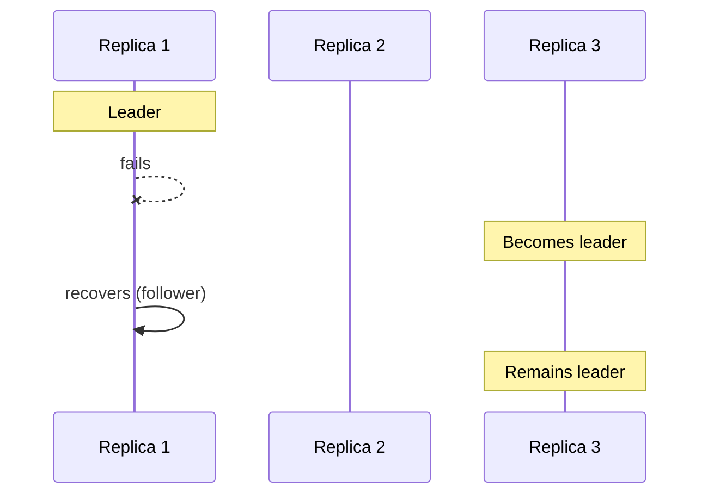
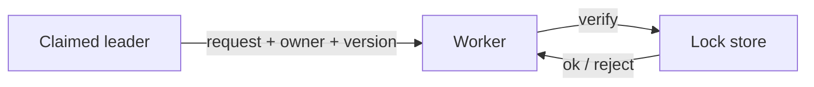

# Ownership Election

> **Adapted from:** Brendan Burns, *Designing Distributed Systems* (O'Reilly), Chapter 10 — rewritten and condensed for teaching.

Many distributed designs need **exactly one** active owner for a resource — a scheduler making placement decisions, a shard leader writing, a single worker draining a queue. **Leader election** (ownership election) is how replicas agree on who that owner is, and how ownership moves when the current leader fails.



Ownership is often the **hardest and most important** piece of a reliable distributed system — get it wrong and you get split brains, double writes, or stuck locks.

---

## Do You Even Need Leader Election?

The simplest “ownership” is a **singleton**: one replica. No election — that process owns everything.

In an orchestrator like Kubernetes you still get:

- Process crash → restart  
- Hang + health check → restart  
- Node failure → reschedule elsewhere  

Rough uptime intuition:

| Failure | Typical recovery | Uptime sketch |
|---|---|---|
| Daily container crash, ~2 s restart | Short blip | On the order of **four nines** (~2 s/day) |
| Node death, ~5 min move | Longer gap | Worse — but if *every* node dies daily, you have bigger problems |

**Deployments** hurt singletons more: you cannot run old and new together, so download/start time is downtime. Daily 2-minute rollouts ≈ **two nines**; hourly deploys can be worse unless you pre-pull images (more complexity — what you hoped to avoid).

Singletons fit **async / background** work where occasional full outage is acceptable. They are a bad fit for **interactive** retail, banking, or games: even brief total downtime is highly visible.

Use multi-replica leader election when you need **high availability (roughly four+ nines)** with continuous serving while one instance is down.

### Check: singleton vs election

<MultipleChoice
  id="dds-ownership-singleton"
  title="Singleton ownership"
  questions={[
    {
      prompt: 'When is a Kubernetes singleton often “good enough” without leader election?',
      choices: [
        'Only for interactive banking frontends that must never pause',
        'For background/async work where brief full downtime during crash or deploy is acceptable in exchange for simplicity',
        'Never — singletons are always unsafe',
        'Only when you disable health checks',
      ],
      answer: 1,
      why: 'Orchestrators restart singletons quickly; election complexity is justified when partial availability during failover matters.',
    },
    {
      prompt: 'What is the main availability downside of a singleton under rolling upgrades?',
      choices: [
        'You must run infinitely many replicas',
        'Old and new versions cannot both serve, so upgrade download/start time is user-visible downtime',
        'etcd forbids singletons',
        'Health checks stop working',
      ],
      answer: 1,
      why: 'No dual-running replicas means cutover gaps dominate the SLA.',
    },
  ]}
/>

---

## The Basics of Leader Election

Example: service `Foo` has replicas `Foo-1`, `Foo-2`, `Foo-3`. Object `Bar` must have **one** owner at a time — that replica is the **leader**.

**Do not** implement Paxos/Raft yourself for production locks — that is like writing mutexes from raw compare-and-swap in assembly: educational, rarely worth it.

Use a **consensus-backed key-value store** that already runs those algorithms: **etcd**, **ZooKeeper**, **Consul**. They give a reliable replicated store plus primitives — especially **compare-and-swap (CAS)** and often **TTL** — to build locks and elections.

### Compare-and-swap

CAS atomically writes `nextValue` only if the current value equals `currentValue` (or the key is absent when you allow create). Pseudocode:

```text
compareAndSwap(key, nextValue, currentValue):
  if key missing and currentValue empty → write nextValue, success
  if key missing and currentValue set → error
  if store[key] == currentValue → write nextValue, success
  else → fail (someone else changed it)
```

With a **TTL**, an abandoned key expires back to empty so a dead holder cannot block forever.

### Hands On: Simulate CAS

Implement an in-memory CAS used by later lock exercises.

<CodeExercise
  id="dds-ownership-cas"
  title="Compare-and-swap store"
  heading="exercise-cas"
  lang="python"
  filename="main.py"
  prompt={`(1) Implement CompareAndSwapStore with method cas(key, next_value, current_value).

(2) If the key is absent and current_value is None, set key to next_value and return (True, None).

(3) If the key is absent and current_value is not None, return (False, "missing").

(4) If store[key] == current_value, set to next_value and return (True, None).

(5) Otherwise return (False, None).`}
  sampleLog={`(no input)
(True, None)
(False, None)
(True, None)
(False, 'missing')`}
  starter={`class CompareAndSwapStore:
    def __init__(self):
        self.store = {}

    def cas(self, key, next_value, current_value):
        # Return (ok: bool, err: None or "missing")
        pass

s = CompareAndSwapStore()
print(s.cas("lock", "1", None))       # create
print(s.cas("lock", "alice", "0"))    # wrong expected
print(s.cas("lock", "alice", "1"))    # success
print(s.cas("other", "x", "y"))       # missing with expected value
`}
  hint="Branch on key in self.store; treat current_value is None as 'create if absent'."
  solution={`class CompareAndSwapStore:
    def __init__(self):
        self.store = {}

    def cas(self, key, next_value, current_value):
        if key not in self.store:
            if current_value is None:
                self.store[key] = next_value
                return (True, None)
            return (False, "missing")
        if self.store[key] == current_value:
            self.store[key] = next_value
            return (True, None)
        return (False, None)

s = CompareAndSwapStore()
print(s.cas("lock", "1", None))
print(s.cas("lock", "alice", "0"))
print(s.cas("lock", "alice", "1"))
print(s.cas("other", "x", "y"))
`}
  sourceChecks={[
    {
      name: 'checks key presence',
      pattern: 'not in self\\.store|in self\\.store',
      must: true,
      hint: 'branch on whether the key exists',
    },
    {
      name: 'writes on match',
      pattern: 'self\\.store\\[key\\]\\s*=\\s*next_value',
      must: true,
      hint: 'assign self.store[key] = next_value on success',
    },
  ]}
  tests={[
    {
      name: 'create, fail, succeed, missing',
      stdin: '',
      equals: "(True, None)\n(False, None)\n(True, None)\n(False, 'missing')",
    },
  ]}
/>

:::tip Deploying etcd
Production clusters use multi-node etcd (often via Helm/operators). Locally, running the `etcd` binary on `127.0.0.1` is enough to explore CAS and leases; Kubernetes itself depends on etcd for cluster state.
:::

---

## Implementing Locks

Map a mutex onto the KV store: value `"0"` / unlocked vs `"1"` / locked (or store the owner name).

1. **Try lock:** CAS `"1"` over `"0"`; if the key is missing, CAS create `"1"` with expected empty.  
2. **Block:** retry until success (prefer **watch** over sleep-polling when the store supports it).  
3. **Unlock:** CAS `"0"` over `"1"`.  
4. **TTL:** write locks with expiry so a crashed holder cannot wedge the system forever.  
5. **Watchdog:** assert/crash if you still run critical work after TTL — never assume you hold the lock forever.

### The TTL unlock bug

Without **resource versions** (or equivalent fencing tokens):

1. Process-1 locks with TTL `t`, then stalls past `t`.  
2. Lock expires; Process-2 acquires.  
3. Process-1 wakes and **unlocks** — clearing Process-2’s lock.  
4. Process-3 also acquires → **two owners**.

Fix: remember the **version** from the successful lock write; unlock (and renew) only with CAS that checks **value and version**. If TTL expired and someone else wrote, your unlock fails safely.

### Hands On: Lock with versioned unlock

<CodeExercise
  id="dds-ownership-lock"
  title="Versioned lock acquire/release"
  heading="exercise-lock"
  lang="python"
  filename="main.py"
  prompt={`(1) Implement Lock on a VersionedStore (provided).

(2) try_lock(): CAS name from "0"→"1", or create "1" if missing; store returned version on success; return True/False.

(3) unlock(): CAS "1"→"0" only if version matches; clear local version; return whether unlock succeeded.

(4) Do not unlock without a matching version.`}
  sampleLog={`(no input)
True
True
False
True
True`}
  starter={`class VersionedStore:
    def __init__(self):
        self.store = {}
        self.versions = {}
        self._ver = 0

    def cas(self, key, next_value, current_value, expected_version=None):
        if key not in self.store:
            if current_value is not None:
                return (False, None)
            self._ver += 1
            self.store[key] = next_value
            self.versions[key] = self._ver
            return (True, self._ver)
        if expected_version is not None and self.versions[key] != expected_version:
            return (False, None)
        if self.store[key] != current_value:
            return (False, None)
        self._ver += 1
        self.store[key] = next_value
        self.versions[key] = self._ver
        return (True, self._ver)


class Lock:
    def __init__(self, store, name):
        self.store = store
        self.name = name
        self.version = None

    def try_lock(self):
        pass

    def unlock(self):
        pass


store = VersionedStore()
a = Lock(store, "L")
b = Lock(store, "L")
print(a.try_lock())
print(a.unlock())
print(b.unlock())  # never held
print(b.try_lock())
# Simulate TTL loss: bump version out from under b
store.cas("L", "1", "1", expected_version=store.versions["L"])
print(b.unlock())  # must fail — version stale
`}
  hint="try_lock: cas(name,'1','0') then if fail cas(name,'1',None). Save version. unlock: if version is None return False; cas to '0' with expected_version."
  solution={`class VersionedStore:
    def __init__(self):
        self.store = {}
        self.versions = {}
        self._ver = 0

    def cas(self, key, next_value, current_value, expected_version=None):
        if key not in self.store:
            if current_value is not None:
                return (False, None)
            self._ver += 1
            self.store[key] = next_value
            self.versions[key] = self._ver
            return (True, self._ver)
        if expected_version is not None and self.versions[key] != expected_version:
            return (False, None)
        if self.store[key] != current_value:
            return (False, None)
        self._ver += 1
        self.store[key] = next_value
        self.versions[key] = self._ver
        return (True, self._ver)


class Lock:
    def __init__(self, store, name):
        self.store = store
        self.name = name
        self.version = None

    def try_lock(self):
        ok, ver = self.store.cas(self.name, "1", "0")
        if not ok:
            ok, ver = self.store.cas(self.name, "1", None)
        if ok:
            self.version = ver
        return ok

    def unlock(self):
        if self.version is None:
            return False
        ok, _ = self.store.cas(self.name, "0", "1", expected_version=self.version)
        if ok:
            self.version = None
        return ok


store = VersionedStore()
a = Lock(store, "L")
b = Lock(store, "L")
print(a.try_lock())
print(a.unlock())
print(b.unlock())
print(b.try_lock())
store.cas("L", "1", "1", expected_version=store.versions["L"])
print(b.unlock())
`}
  sourceChecks={[
    {
      name: 'stores version on lock',
      pattern: 'self\\.version\\s*=',
      must: true,
      hint: 'save the CAS version when locking',
    },
    {
      name: 'unlock uses expected_version',
      pattern: 'expected_version',
      must: true,
      hint: 'pass expected_version into cas on unlock',
    },
  ]}
  tests={[
    {
      name: 'lock, unlock, reject stale unlock',
      stdin: '',
      equals: 'True\nTrue\nFalse\nTrue\nFalse',
    },
  ]}
/>

### Check: locks and TTL

<MultipleChoice
  id="dds-ownership-locks"
  title="Distributed locks"
  questions={[
    {
      prompt: 'Why add a TTL to a distributed lock?',
      choices: [
        'So locks never expire',
        'So a crashed holder cannot leave the lock stuck forever',
        'So CAS becomes optional',
        'So etcd can delete the whole cluster',
      ],
      answer: 1,
      why: 'TTL is the distributed equivalent of recovering from a thread that died while holding a mutex.',
    },
    {
      prompt: 'Why must unlock check a resource version (fencing token)?',
      choices: [
        'Versions make locks faster on SSDs',
        'After TTL expiry another process may own the lock; unlocking by value alone can clear the new owner’s lock',
        'Kubernetes requires versions in every YAML',
        'CAS cannot store strings without versions',
      ],
      answer: 1,
      why: 'Versioned unlock prevents the original holder from releasing someone else’s acquisition.',
    },
  ]}
/>

---

## Implementing Ownership (Renewable Locks / Leases)

Sometimes ownership should last for the **lifetime of the process** (e.g. one active Kubernetes scheduler among several replicas), not a few milliseconds.

A huge TTL (a week) means slow failover after crash. Better: a **renewable lock / lease** — hold with a short TTL and **renew** periodically while healthy.

```text
renew(): CAS same owner value with same version, refreshing TTL
loop every ttl/2:
  if not renew(): handleLockLost()  # stop acting as leader
```

Renew at **`ttl/2`** to reduce accidental expiry from timing jitter. On loss, stop leader work immediately — often easiest in Kubernetes: **exit** and let the orchestrator restart you as a follower waiting for the lock.

etcd leases: create with TTL (`mk` if absent), then periodically `set` the same owner value with TTL to extend.

### Hands On: Lease renew loop logic

<CodeExercise
  id="dds-ownership-lease"
  title="Renewable lock renew()"
  heading="exercise-lease-renew"
  lang="python"
  filename="main.py"
  prompt={`(1) Lock has name, version, ttl, and store.cas(key, next, current, version, ttl) → (ok, new_version).

(2) Implement renew(): CAS "1"→"1" with current version and ttl; on success update version; return ok.

(3) Implement should_sleep_seconds(ttl): return ttl/2 (float ok) for the renew interval.`}
  sampleLog={`(no input)
True
5.0
False`}
  starter={`class FakeStore:
    def __init__(self):
        self.value = "1"
        self.version = 1
        self.ttl = 0

    def cas(self, key, next_value, current_value, version, ttl):
        if self.value != current_value or self.version != version:
            return (False, self.version)
        self.value = next_value
        self.version += 1
        self.ttl = ttl
        return (True, self.version)


class Lock:
    def __init__(self, store, name, version, ttl):
        self.store = store
        self.name = name
        self.version = version
        self.ttl = ttl

    def renew(self):
        pass

def should_sleep_seconds(ttl):
    pass

store = FakeStore()
lock = Lock(store, "sched", version=1, ttl=10)
print(lock.renew())
print(should_sleep_seconds(10))
lock.version = 999  # stale
print(lock.renew())
`}
  hint="renew: ok, ver = store.cas(name, '1', '1', version, ttl); if ok: version = ver; return ok. Sleep ttl/2."
  solution={`class FakeStore:
    def __init__(self):
        self.value = "1"
        self.version = 1
        self.ttl = 0

    def cas(self, key, next_value, current_value, version, ttl):
        if self.value != current_value or self.version != version:
            return (False, self.version)
        self.value = next_value
        self.version += 1
        self.ttl = ttl
        return (True, self.version)


class Lock:
    def __init__(self, store, name, version, ttl):
        self.store = store
        self.name = name
        self.version = version
        self.ttl = ttl

    def renew(self):
        ok, ver = self.store.cas(self.name, "1", "1", self.version, self.ttl)
        if ok:
            self.version = ver
        return ok

def should_sleep_seconds(ttl):
    return ttl / 2

store = FakeStore()
lock = Lock(store, "sched", version=1, ttl=10)
print(lock.renew())
print(should_sleep_seconds(10))
lock.version = 999
print(lock.renew())
`}
  sourceChecks={[
    {
      name: 'renew CAS 1→1',
      pattern: 'cas\\s*\\([^)]*[\'"]1[\'"]\\s*,\\s*[\'"]1[\'"]',
      must: true,
      hint: "cas(..., '1', '1', version, ttl)",
    },
    {
      name: 'sleep ttl/2',
      pattern: 'ttl\\s*/\\s*2',
      must: true,
      hint: 'return ttl / 2',
    },
  ]}
  tests={[
    {
      name: 'renew success then stale fail',
      stdin: '',
      equals: 'True\n5.0\nFalse',
    },
  ]}
/>

---

## Handling Concurrent Data Manipulation

Even with correct locks, **two replicas can briefly both believe they are leader** (extreme scheduling delay: TTL expires, new leader elected, old process wakes before `handleLockLost`).

Mitigations (defense in depth):

1. **Local check** before critical work: still locked and `now < lockTime + 0.75 * ttl`.  
2. **Worker-side validation:** store **owner identity** in the KV; workers reject requests from non-owners.  
3. **Send resource version / generation** with every request; reject if owner **or** version mismatch — fixes delayed packets after ownership flip-flops (`shard1 → shard2 → shard1` while an old request is in flight).



You still choose a consistency/availability trade-off:

| Choice | Meaning |
|---|---|
| **At-most-once** | Prefer losing availability briefly over double-applying |
| **At-least-once** | Prefer availability; accept rare duplicate processing |

Duplicates may only waste GPU time — or may **double-charge a bank transfer**. Match the processing guarantee to the domain.

### Check: fencing and duplicates

<MultipleChoice
  id="dds-ownership-fencing"
  title="Fencing and processing guarantees"
  questions={[
    {
      prompt: 'Why should workers verify the caller is still the lock owner (and often the resource version)?',
      choices: [
        'Because leaders never fail',
        'Because a stale process may still send work after losing the lease; workers must fence out invalid leaders',
        'Because CAS is illegal without workers',
        'Because TTL only works on laptops',
      ],
      answer: 1,
      why: 'End-to-end fencing closes the gap where local lock loss detection is delayed.',
    },
    {
      prompt: 'At-most-once vs at-least-once for leader-driven work mainly trades…',
      choices: [
        'JSON vs XML',
        'Availability during uncertain leadership vs risk of duplicate processing',
        'TCP vs UDP only',
        'Singleton vs ReplicaSet labels',
      ],
      answer: 1,
      why: 'Distributed ownership cannot erase the fundamental delivery trade-off.',
    },
  ]}
/>

---

:::important Key takeaways
- Prefer a **singleton** when simplicity beats continuous availability; use **leader election** when interactive SLAs need multi-replica ownership.
- Build locks/leases on **consensus KV** (etcd/ZooKeeper/Consul) with **CAS + TTL + versions** — do not hand-roll Raft for app locks.
- **TTL** recovers from dead holders; **versions** stop stale unlocks and fence delayed requests.
- **Renewable leases** (`renew` every `ttl/2`) give long-lived leaders with fast failover.
- Assume brief dual-leader windows — **workers must verify owner (+ version)**; choose **at-most-once** vs **at-least-once** consciously.
- Prefer **battle-tested lock libraries** in your language when available.
:::

## Further Reading

- Brendan Burns — *Designing Distributed Systems* (O'Reilly), Chapter 10 (Ownership Election)
- [Functions and Event-Driven Processing](./functions-and-event-driven-processing) — short-lived work that often sits beside long-running leaders
- [Work Queue Systems](./work-queue-systems) — next: batch queues with reusable source and worker containers
- [Replicated Load-Balanced Services](./replicated-load-balanced-services) — multi-replica serving without exclusive ownership
- [Scatter/Gather](./scatter-gather) — parallel workers that still may need a coordinating root/leader
- [etcd documentation](https://etcd.io/docs/) — leases, transactions, and compare-and-swap style ops
