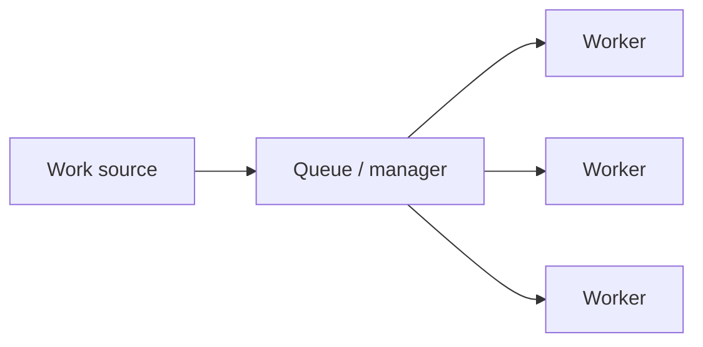
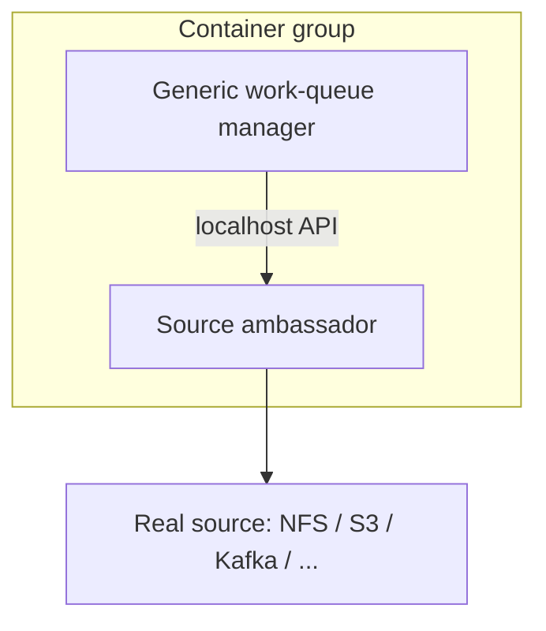
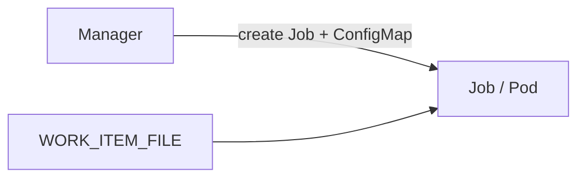
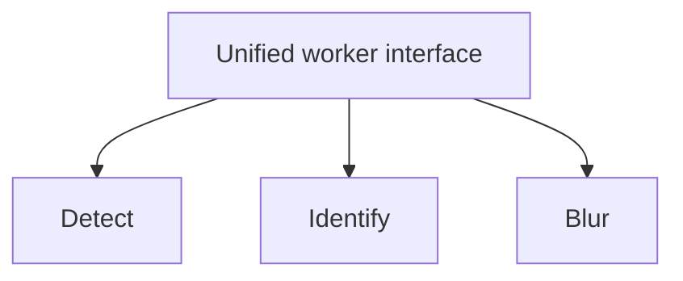

# Work Queue Systems

> **Adapted from:** Brendan Burns, *Designing Distributed Systems* (O'Reilly), Chapter 11 — rewritten and condensed for teaching.

The simplest batch pattern is a **work queue**: a pile of **independent** items, each processable without talking to the others. The usual goal is finishing each item within a latency bound by **scaling workers** up or down with demand.



Work queues showcase **distributed system patterns**: most of the machinery is generic; only “what is an item?” and “how do I process one?” are app-specific. With containers, those two pieces become **reusable library containers** plus a thin user worker.

---

## A Generic Container Work Queue

Split the system into:

| Role | Responsibility |
|---|---|
| **Source** | Stream of work item names/IDs |
| **Manager** | Track pending vs done; spawn workers |
| **Worker** | Process one item’s payload |

The source often sits beside the manager as an **ambassador** (localhost proxy): the generic manager asks a stable API; the ambassador maps that to NFS listings, cloud objects, Kafka, Redis, etc.



Reuse library ambassadors when the backend is generic; only swap which ambassador you deploy.

---

## Source Container Interface

Prefer a small **versioned HTTP API** on localhost (versioning is cheap on day one, expensive to retrofit):

- `GET http://localhost/api/v1/items` → list of item names  
- `GET http://localhost/api/v1/items/<item-name>` → item details  

List response shape:

```json
{
  "kind": "ItemList",
  "apiVersion": "v1",
  "items": ["item-1", "item-2"]
}
```

Item response:

```json
{
  "kind": "Item",
  "apiVersion": "v1",
  "data": { "some": "json", "object": "here" }
}
```

There is **no** “mark complete” on this API on purpose: keep completion tracking in the **generic manager** (maximizes shared logic). The manager passes `item.data` into the worker interface.

### Hands On: Source list endpoint

Implement the list handler for files matching a suffix (video thumbnailer style).

<CodeExercise
  id="dds-wq-source-list"
  title="Work source: ItemList JSON"
  heading="exercise-source-list"
  lang="python"
  filename="main.py"
  prompt={`(1) Implement list_items(filenames): filenames is a list of names in a media directory.

(2) Return a dict with kind "ItemList", apiVersion "v1", and items equal to filenames (same order).

(3) If filenames is empty or None, return items: [].`}
  sampleLog={`(no input)
{'kind': 'ItemList', 'apiVersion': 'v1', 'items': ['a.mp4', 'b.mp4']}
{'kind': 'ItemList', 'apiVersion': 'v1', 'items': []}`}
  starter={`def list_items(filenames):
    pass

print(list_items(["a.mp4", "b.mp4"]))
print(list_items(None))
`}
  hint='return {"kind": "ItemList", "apiVersion": "v1", "items": filenames or []}'
  solution={`def list_items(filenames):
    return {
        "kind": "ItemList",
        "apiVersion": "v1",
        "items": filenames or [],
    }

print(list_items(["a.mp4", "b.mp4"]))
print(list_items(None))
`}
  sourceChecks={[
    {
      name: 'kind ItemList',
      pattern: '["\']ItemList["\']',
      must: true,
      hint: 'kind must be ItemList',
    },
    {
      name: 'apiVersion v1',
      pattern: '["\']v1["\']',
      must: true,
      hint: 'apiVersion must be v1',
    },
  ]}
  tests={[
    {
      name: 'lists items and empty',
      stdin: '',
      equals: "{'kind': 'ItemList', 'apiVersion': 'v1', 'items': ['a.mp4', 'b.mp4']}\n{'kind': 'ItemList', 'apiVersion': 'v1', 'items': []}",
    },
  ]}
/>

### Check: source API

<MultipleChoice
  id="dds-wq-source-api"
  title="Source ambassador API"
  questions={[
    {
      prompt: 'Why version the work-source API as /api/v1/... even if you “will never change it”?',
      choices: [
        'HTTP forbids unversioned paths',
        'Adding versions later is expensive; putting v1 in from the start is cheap insurance',
        'Kubernetes requires v1 in every URL',
        'Ambassadors cannot call localhost without v1',
      ],
      answer: 1,
      why: 'Retrofitting versioning onto a live contract is painful; upfront versions are nearly free.',
    },
    {
      prompt: 'Why omit “mark processed” from the source ambassador API?',
      choices: [
        'Work items never complete',
        'Completion tracking belongs in the generic manager so more logic stays shared',
        'JSON cannot represent booleans',
        'Workers must own the source disk',
      ],
      answer: 1,
      why: 'Push generic orchestration into the reusable manager, not every ambassador.',
    },
  ]}
/>

---

## Worker Container Interface

Workers differ from the source API:

- **One-shot:** start work once; no chatty localhost loop.  
- **Remote:** the manager launches workers via the orchestrator (not the same pod as the manager).  
- **Harder to spoof:** a cluster peer should not casually inject fake HTTP work.

So use a **file-based** handoff: set `WORK_ITEM_FILE` to a path containing `item.data` (often a Kubernetes **ConfigMap** mounted as a file). Shell-script workers stay simple — no embedded web server required.

You can still share **generic** worker images (download from object storage → run a user script → upload results) and only swap the script.



### Hands On: Read WORK_ITEM_FILE

<CodeExercise
  id="dds-wq-worker-file"
  title="Worker: load payload from file"
  heading="exercise-worker-file"
  lang="python"
  filename="main.py"
  prompt={`(1) Implement load_work(path): read the file as UTF-8 text and return json.loads of its contents.

(2) Implement run_worker(env): read WORK_ITEM_FILE from env, load_work it, return the "title" field from the JSON object.`}
  sampleLog={`(no input)
demo`}
  starter={`import json
import os
import tempfile

def load_work(path):
    pass

def run_worker(env):
    pass

with tempfile.NamedTemporaryFile("w", delete=False) as f:
    f.write('{"title": "demo", "frames": 100}')
    path = f.name
print(run_worker({"WORK_ITEM_FILE": path}))
`}
  hint='path = env["WORK_ITEM_FILE"]; return load_work(path)["title"]'
  solution={`import json
import os
import tempfile

def load_work(path):
    with open(path, "r", encoding="utf-8") as f:
        return json.loads(f.read())

def run_worker(env):
    path = env["WORK_ITEM_FILE"]
    return load_work(path)["title"]

with tempfile.NamedTemporaryFile("w", delete=False) as f:
    f.write('{"title": "demo", "frames": 100}')
    path = f.name
print(run_worker({"WORK_ITEM_FILE": path}))
`}
  sourceChecks={[
    {
      name: 'reads WORK_ITEM_FILE',
      pattern: 'WORK_ITEM_FILE',
      must: true,
      hint: 'read env["WORK_ITEM_FILE"]',
    },
    {
      name: 'json.loads',
      pattern: 'json\\.loads',
      must: true,
      hint: 'parse JSON with json.loads',
    },
  ]}
  tests={[
    { name: 'loads title from file', stdin: '', equals: 'demo' },
  ]}
/>

---

## Shared Work Queue Infrastructure

Manager loop (conceptually):

1. Load items from the source API.  
2. Diff against Jobs already created for this queue.  
3. Spawn Jobs for missing items (worker interface).  
4. On successful Job completion, treat the item as done.

Kubernetes **Job** objects help: run once or **until success**, survive node loss, and carry **annotations** naming the work item — so the manager can track state **without its own database**.

```text
forever:
  items ← GET /items
  jobs  ← list Jobs for this queue
  for each item not in jobs:
    create Job for that item
  sleep
```

### Hands On: Diff pending work

<CodeExercise
  id="dds-wq-pending"
  title="Manager: find unprocessed items"
  heading="exercise-pending-diff"
  lang="python"
  filename="main.py"
  prompt={`(1) Implement pending_items(source_items, existing_job_names):

(2) Return source items that do not appear in existing_job_names, preserving source order.

(3) existing_job_names may be a list or set.`}
  sampleLog={`(no input)
['b.mp4', 'c.mp4']`}
  starter={`def pending_items(source_items, existing_job_names):
    pass

print(pending_items(
    ["a.mp4", "b.mp4", "c.mp4"],
    ["a.mp4", "z.mp4"],
))
`}
  hint="existing = set(existing_job_names); return [i for i in source_items if i not in existing]"
  solution={`def pending_items(source_items, existing_job_names):
    existing = set(existing_job_names)
    return [item for item in source_items if item not in existing]

print(pending_items(
    ["a.mp4", "b.mp4", "c.mp4"],
    ["a.mp4", "z.mp4"],
))
`}
  sourceChecks={[
    {
      name: 'iterates source order',
      pattern: 'for\\s+.*\\s+in\\s+source_items',
      must: true,
      hint: 'loop source_items to preserve order',
    },
    {
      name: 'membership check',
      pattern: 'not in|in existing',
      must: true,
      hint: 'skip items already in existing jobs',
    },
  ]}
  tests={[
    { name: 'returns only missing items', stdin: '', equals: "['b.mp4', 'c.mp4']" },
  ]}
/>

### Example: video thumbnailer

- **Source:** list `*.mp4` on shared NFS (ItemList).  
- **Worker:** `ffmpeg -i ${INPUT_FILE} -frames:v 100 thumb.png` (or a container that wraps ffmpeg).  

Thin adapters + generic queue machinery = short path from idea to running batch jobs.

### Check: Kubernetes Jobs

<MultipleChoice
  id="dds-wq-k8s-jobs"
  title="Work queue on Kubernetes"
  questions={[
    {
      prompt: 'How do Kubernetes Jobs simplify a reusable work-queue manager?',
      choices: [
        'They replace the need for any worker containers',
        'They reliably run each item (optionally until success) and can be annotated with the item id — reducing custom persistence',
        'They disable scaling forever',
        'They only work for HTTP workers on localhost',
      ],
      answer: 1,
      why: 'Orchestrator-owned Job lifecycle + metadata ≈ queue state without a bespoke DB.',
    },
  ]}
/>

---

## Dynamic Scaling of Workers

Unlimited Job fan-out finishes work fast but **bursts** cluster load (and cost). Cap parallelism → smoother resource use, **higher item latency** under load.

If average arrival stays high, a capped queue **never catches up** — latency grows without bound. Then raise parallelism (or buy capacity).

Stability rule of thumb:

- Let **interarrival** = average time between new items (e.g. items / 24h).  
- Let **service time** = average processing time **once work starts** (exclude queue wait).  
- With parallelism \(p\), effective service ≈ `service_time / p`.  
- Need **effective service &lt; interarrival** (with safety margin).  

Examples:

| Interarrival | Service (serial) | Result |
|---|---|---|
| 60 s | 30 s | Stable; can drain bursts |
| 60 s | 60 s | Balanced but fragile — little slack |
| 60 s | 120 s | Unstable — backlog → ∞ |

Scale **up** when effective service approaches interarrival; scale **down** carefully (e.g. keep service ≈ 90% of interarrival for margin). Prefer battle-tested autoscalers such as **[KEDA](https://keda.sh/)** (files, pub/sub, and many other event sources) over reinventing metrics plumbing.

### Hands On: Stability check

<CodeExercise
  id="dds-wq-stability"
  title="Autoscaler: is parallelism enough?"
  heading="exercise-wq-stability"
  lang="python"
  filename="main.py"
  prompt={`(1) Implement is_stable(interarrival_s, service_s, parallelism):

(2) effective = service_s / parallelism.

(3) Return True if effective < interarrival_s, else False.

(4) Assume parallelism >= 1.`}
  sampleLog={`(no input)
True
False
True`}
  starter={`def is_stable(interarrival_s, service_s, parallelism):
    pass

print(is_stable(60, 30, 1))
print(is_stable(60, 120, 1))
print(is_stable(60, 120, 3))
`}
  hint="return (service_s / parallelism) < interarrival_s"
  solution={`def is_stable(interarrival_s, service_s, parallelism):
    return (service_s / parallelism) < interarrival_s

print(is_stable(60, 30, 1))
print(is_stable(60, 120, 1))
print(is_stable(60, 120, 3))
`}
  sourceChecks={[
    {
      name: 'divides by parallelism',
      pattern: 'service_s\\s*/\\s*parallelism',
      must: true,
      hint: 'effective service = service_s / parallelism',
    },
    {
      name: 'compares to interarrival',
      pattern: '<\\s*interarrival_s|interarrival_s\\s*>',
      must: true,
      hint: 'require effective < interarrival_s',
    },
  ]}
  tests={[
    { name: 'stability cases', stdin: '', equals: 'True\nFalse\nTrue' },
  ]}
/>

### Check: scaling math

<MultipleChoice
  id="dds-wq-scaling"
  title="Work queue scaling"
  questions={[
    {
      prompt: 'Items arrive every 60 s on average and each takes 120 s alone. With parallelism 3, is the queue stable?',
      choices: [
        'No — 120 always loses to 60',
        'Yes — effective service ≈ 40 s < 60 s interarrival',
        'Only if Jobs are deleted',
        'Stability does not depend on parallelism',
      ],
      answer: 1,
      why: 'Parallelism divides service time for capacity planning.',
    },
    {
      prompt: 'Capping Job parallelism mainly trades…',
      choices: [
        'JSON for XML',
        'Lower peak resource use for higher item wait time under bursts',
        'Source ambassadors for workers',
        'CAS locks for leases',
      ],
      answer: 1,
      why: 'Feast-or-famine load vs backlog latency.',
    },
  ]}
/>

---

## The Multiworker Pattern

One item may need **several** steps (detect faces → identify → blur). A single megaworker is hard to reuse when the next pipeline wants cars instead of faces but the same blur.

**Multiworker** (an adapter specialization): one facade container implements the worker interface and **delegates** to a group of reusable step containers.



Compose shared steps into new pipelines without rewriting everything.

### Check: multiworker

<MultipleChoice
  id="dds-wq-multiworker"
  title="Multiworker composition"
  questions={[
    {
      prompt: 'What problem does the multiworker pattern solve?',
      choices: [
        'Replacing Kubernetes Jobs with CronJobs only',
        'Reusing discrete processing containers behind one worker interface instead of one bespoke mega-image per pipeline',
        'Eliminating the need for a work source',
        'Making all work items share memory',
      ],
      answer: 1,
      why: 'Encapsulation and reuse — same theme as ambassadors/adapters.',
    },
  ]}
/>

---

:::important Key takeaways
- Work queues process **independent** items; scale workers for **latency SLAs**.
- Split **source ambassador**, **generic manager**, and **worker** — maximize shared containers.
- Source: versioned **localhost HTTP**; worker: **`WORK_ITEM_FILE`** (often ConfigMap) for one-shot remote jobs.
- Managers can track state via **Kubernetes Jobs + annotations** without custom storage.
- Keep **effective service time < interarrival**; use caps and autoscalers (e.g. KEDA) for cost and stability.
- **Multiworker** composes reusable step containers behind one worker API.
:::

## Further Reading

- Brendan Burns — *Designing Distributed Systems* (O'Reilly), Chapter 11 (Work Queue Systems)
- [Ownership Election](./ownership-election) — exclusive leaders when only one consumer may drain a critical queue
- [Event-Driven Batch Processing](./event-driven-batch-processing) — next: multi-stage workflows that compose work queues
- [Ambassadors](./ambassador-pattern) — the pattern behind work-source proxies
- [Functions and Event-Driven Processing](./functions-and-event-driven-processing) — event-triggered relatives of batch workers
- [KEDA](https://keda.sh/) — event-driven autoscaling for Kubernetes workloads
